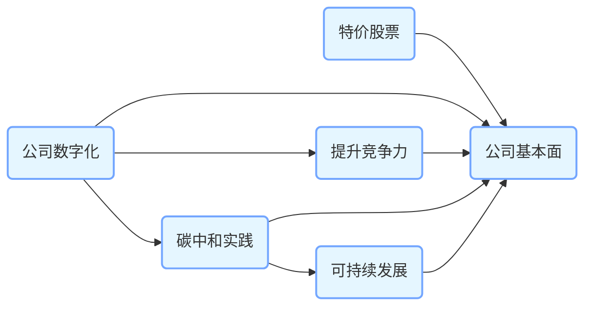

# 特价股票与公司数字化碳中和实践的关联性研究

> 关键词：特价股票、公司数字化、碳中和实践、关联性、金融市场、企业战略、可持续发展

> 摘要：本文旨在深入研究特价股票与公司数字化碳中和实践之间的关联性。通过对相关概念、原理、算法、数学模型的阐述，结合项目实战案例和实际应用场景分析，揭示两者之间的内在联系。特价股票反映了市场对公司价值的一种评估，而公司数字化碳中和实践是当下企业顺应时代发展、实现可持续发展的重要战略举措。研究两者的关联性有助于投资者更好地理解股票价值，也有助于企业制定合理的发展战略，促进金融市场与实体经济的协同发展。

## 1. 背景介绍 
### 1.1 目的和范围
本研究的目的在于全面探究特价股票与公司数字化碳中和实践之间的内在联系，分析这种联系对金融市场和企业发展的影响。范围涵盖了不同行业的上市公司，通过对其股票价格波动、数字化转型举措以及碳中和实践的多维度分析，挖掘两者之间的潜在关联。

### 1.2 预期读者
本文预期读者包括金融投资者、企业管理者、行业研究员、政策制定者以及对可持续发展和金融市场感兴趣的相关人士。投资者可以从本文中获取投资决策的参考信息，企业管理者可以借鉴相关经验制定企业发展战略，行业研究员可以进一步深入研究相关领域，政策制定者可以依据研究结果制定合理的政策，而普通读者可以增进对该领域的了解。

### 1.3 文档结构概述
本文首先介绍背景信息，包括目的、预期读者和文档结构。接着阐述核心概念与联系，通过文本示意图和 Mermaid 流程图展示相关原理和架构。然后详细讲解核心算法原理和具体操作步骤，用 Python 源代码进行说明。之后介绍数学模型和公式，并举例说明。再通过项目实战案例详细解释代码实现和分析。随后探讨实际应用场景。接着推荐相关的工具和资源。最后总结未来发展趋势与挑战，提供常见问题与解答以及扩展阅读和参考资料。

### 1.4 术语表
#### 1.4.1 核心术语定义
- **特价股票**：指在金融市场中，价格相对较低，可能由于公司业绩、市场环境、行业竞争等多种因素导致其价值被市场低估的股票。
- **公司数字化**：企业利用数字技术对业务流程、管理模式、产品与服务等进行全面改造和创新，以提高运营效率、增强竞争力的过程。
- **碳中和实践**：企业通过采取一系列措施，如节能减排、使用可再生能源、参与碳交易等，使自身产生的温室气体排放量与吸收或抵消的排放量达到平衡的实践活动。

#### 1.4.2 相关概念解释
- **金融市场效率**：指金融市场将信息迅速、准确地反映在资产价格中的能力。高效的金融市场能够使股票价格及时反映公司的真实价值。
- **可持续发展战略**：企业在追求经济利益的同时，考虑社会和环境因素，实现经济、社会和环境的协调发展的战略。公司数字化碳中和实践是可持续发展战略的重要组成部分。
- **碳足迹**：指企业在生产、运营等过程中产生的温室气体排放量，通常以二氧化碳当量来衡量。

#### 1.4.3 缩略词列表
- **ESG**：环境（Environmental）、社会（Social）和治理（Governance）的缩写，是一种关注企业可持续发展的投资理念和评价标准。
- **AI**：人工智能（Artificial Intelligence）的缩写，在公司数字化过程中广泛应用。
- **IoT**：物联网（Internet of Things）的缩写，是实现企业数字化转型的重要技术手段。

## 2. 核心概念与联系 
### 核心概念原理
特价股票的形成往往与公司的基本面、市场预期等因素密切相关。公司的业绩不佳、行业竞争激烈、负面事件等都可能导致股票价格下跌成为特价股票。而公司数字化是利用数字技术提升企业的运营效率、创新能力和竞争力。通过引入人工智能、大数据、物联网等技术，企业可以实现生产自动化、管理智能化、服务个性化。碳中和实践则是企业响应全球应对气候变化的号召，采取措施减少温室气体排放，实现可持续发展。

公司数字化和碳中和实践之间存在着紧密的联系。数字化技术可以帮助企业更好地监测和管理碳排放，提高能源利用效率，优化生产流程，从而推动碳中和目标的实现。例如，通过物联网技术可以实时监测能源消耗和碳排放数据，人工智能算法可以对这些数据进行分析和预测，为企业制定节能减排策略提供依据。

同时，公司的数字化碳中和实践也会对其股票价格产生影响。积极开展数字化碳中和实践的企业，通常会被市场认为具有更好的可持续发展能力和社会责任感，从而提升市场对其的预期，可能导致股票价格上升，减少成为特价股票的可能性。相反，忽视数字化和碳中和的企业，可能面临环境风险、政策风险等，导致业绩下滑，股票价格下跌成为特价股票。

### 架构的文本示意图
特价股票、公司数字化和碳中和实践之间的关系可以用以下文本示意图表示：

特价股票 <---- 公司基本面（业绩、竞争力等）
           |
           | 影响
           v
公司数字化 ----> 提升竞争力 ----> 影响公司基本面
           |
           | 促进
           v
碳中和实践 ----> 可持续发展 ----> 影响公司基本面

### Mermaid 流程图


## 3. 核心算法原理 & 具体操作步骤 
### 算法原理
为了研究特价股票与公司数字化碳中和实践的关联性，我们可以采用多元线性回归算法。多元线性回归是一种用于分析多个自变量与一个因变量之间线性关系的统计方法。在本研究中，因变量可以是股票价格，自变量可以包括公司数字化程度、碳中和实践指标、公司财务指标等。

多元线性回归的数学模型可以表示为：

$y = \beta_0 + \beta_1x_1 + \beta_2x_2 + \cdots + \beta_nx_n + \epsilon$

其中，$y$ 是因变量（股票价格），$x_1, x_2, \cdots, x_n$ 是自变量（公司数字化程度、碳中和实践指标等），$\beta_0$ 是截距，$\beta_1, \beta_2, \cdots, \beta_n$ 是回归系数，$\epsilon$ 是误差项。

### 具体操作步骤
1. **数据收集**：收集不同公司的股票价格数据、公司数字化程度数据（如数字化投入、数字化技术应用水平等）、碳中和实践指标数据（如碳排放量、可再生能源使用比例等）以及公司财务指标数据（如营业收入、净利润等）。
2. **数据预处理**：对收集到的数据进行清洗、缺失值处理、异常值处理等操作，确保数据的质量。然后对数据进行标准化处理，将不同变量的数据范围统一，以提高算法的性能。
3. **模型训练**：将预处理后的数据分为训练集和测试集，使用训练集数据对多元线性回归模型进行训练，估计回归系数。
4. **模型评估**：使用测试集数据对训练好的模型进行评估，计算模型的拟合优度（如 $R^2$ 值）、均方误差（MSE）等指标，评估模型的性能。
5. **结果分析**：分析回归系数的显著性和正负性，判断各个自变量对因变量的影响程度和方向。例如，如果公司数字化程度的回归系数为正且显著，说明公司数字化程度的提高有助于提升股票价格。

### Python 源代码实现
```python
import pandas as pd
from sklearn.model_selection import train_test_split
from sklearn.linear_model import LinearRegression
from sklearn.preprocessing import StandardScaler
from sklearn.metrics import r2_score, mean_squared_error

# 数据收集和预处理
# 假设数据存储在一个 CSV 文件中，文件名为 'stock_data.csv'
data = pd.read_csv('stock_data.csv')

# 分离自变量和因变量
X = data.drop('stock_price', axis=1)  # 自变量
y = data['stock_price']  # 因变量

# 数据标准化
scaler = StandardScaler()
X_scaled = scaler.fit_transform(X)

# 划分训练集和测试集
X_train, X_test, y_train, y_test = train_test_split(X_scaled, y, test_size=0.2, random_state=42)

# 模型训练
model = LinearRegression()
model.fit(X_train, y_train)

# 模型预测
y_pred = model.predict(X_test)

# 模型评估
r2 = r2_score(y_test, y_pred)
mse = mean_squared_error(y_test, y_pred)

print(f'R^2 值: {r2}')
print(f'均方误差: {mse}')

# 结果分析
coefficients = pd.DataFrame({'Variable': X.columns, 'Coefficient': model.coef_})
print(coefficients)
```

## 4. 数学模型和公式 & 详细讲解 & 举例说明 
### 多元线性回归模型公式
多元线性回归模型的一般形式为：

$$y = \beta_0 + \beta_1x_1 + \beta_2x_2 + \cdots + \beta_nx_n + \epsilon$$

其中：
- $y$ 是因变量，在本研究中表示股票价格。
- $x_1, x_2, \cdots, x_n$ 是自变量，分别表示公司数字化程度、碳中和实践指标、公司财务指标等。
- $\beta_0$ 是截距，表示当所有自变量都为 0 时，因变量的取值。
- $\beta_1, \beta_2, \cdots, \beta_n$ 是回归系数，分别表示每个自变量对因变量的影响程度。回归系数的正负性表示自变量与因变量之间的正相关或负相关关系，绝对值大小表示影响程度的强弱。
- $\epsilon$ 是误差项，表示模型无法解释的随机误差。

### 回归系数的估计
回归系数的估计通常采用最小二乘法。最小二乘法的目标是使观测值与模型预测值之间的误差平方和最小。误差平方和可以表示为：

$$S(\beta_0, \beta_1, \cdots, \beta_n) = \sum_{i=1}^{m}(y_i - \hat{y}_i)^2$$

其中，$m$ 是样本数量，$y_i$ 是第 $i$ 个观测值，$\hat{y}_i$ 是第 $i$ 个观测值的模型预测值，即：

$$\hat{y}_i = \beta_0 + \beta_1x_{i1} + \beta_2x_{i2} + \cdots + \beta_nx_{in}$$

通过对误差平方和 $S(\beta_0, \beta_1, \cdots, \beta_n)$ 求偏导数并令其等于 0，可以得到回归系数的估计值。

### 拟合优度（$R^2$ 值）
拟合优度是衡量回归模型拟合效果的指标，其计算公式为：

$$R^2 = 1 - \frac{\sum_{i=1}^{m}(y_i - \hat{y}_i)^2}{\sum_{i=1}^{m}(y_i - \bar{y})^2}$$

其中，$\bar{y}$ 是因变量的均值。$R^2$ 值的取值范围是 $[0, 1]$，$R^2$ 值越接近 1，说明模型对数据的拟合效果越好。

### 均方误差（MSE）
均方误差是衡量模型预测误差的指标，其计算公式为：

$$MSE = \frac{1}{m}\sum_{i=1}^{m}(y_i - \hat{y}_i)^2$$

均方误差越小，说明模型的预测精度越高。

### 举例说明
假设我们收集了 100 家公司的数据，自变量包括公司数字化投入（$x_1$）、碳中和实践得分（$x_2$）和公司净利润（$x_3$），因变量是股票价格（$y$）。通过多元线性回归分析得到回归方程为：

$$y = 10 + 0.5x_1 + 0.3x_2 + 0.2x_3$$

这意味着在其他因素不变的情况下，公司数字化投入每增加 1 个单位，股票价格预计增加 0.5 个单位；碳中和实践得分每增加 1 个单位，股票价格预计增加 0.3 个单位；公司净利润每增加 1 个单位，股票价格预计增加 0.2 个单位。

假设某公司的数字化投入为 20，碳中和实践得分为 30，公司净利润为 50，则根据回归方程预测该公司的股票价格为：

$$y = 10 + 0.5\times20 + 0.3\times30 + 0.2\times50 = 10 + 10 + 9 + 10 = 39$$

## 5. 项目实战：代码实际案例和详细解释说明 
### 5.1  开发环境搭建
- **操作系统**：可以选择 Windows、Linux 或 macOS 操作系统。
- **Python 环境**：安装 Python 3.7 及以上版本。可以从 Python 官方网站（https://www.python.org/downloads/）下载安装包进行安装。
- **开发工具**：推荐使用 PyCharm 或 Jupyter Notebook 作为开发工具。PyCharm 是一款功能强大的 Python 集成开发环境，Jupyter Notebook 则适合进行交互式数据分析和代码演示。
- **第三方库**：安装所需的第三方库，包括 pandas、scikit-learn 等。可以使用以下命令进行安装：
```sh
pip install pandas scikit-learn
```

### 5.2  源代码详细实现和代码解读
```python
import pandas as pd
from sklearn.model_selection import train_test_split
from sklearn.linear_model import LinearRegression
from sklearn.preprocessing import StandardScaler
from sklearn.metrics import r2_score, mean_squared_error

# 数据收集和预处理
# 假设数据存储在一个 CSV 文件中，文件名为 'stock_data.csv'
data = pd.read_csv('stock_data.csv')

# 分离自变量和因变量
X = data.drop('stock_price', axis=1)  # 自变量
y = data['stock_price']  # 因变量

# 数据标准化
scaler = StandardScaler()
X_scaled = scaler.fit_transform(X)

# 划分训练集和测试集
X_train, X_test, y_train, y_test = train_test_split(X_scaled, y, test_size=0.2, random_state=42)

# 模型训练
model = LinearRegression()
model.fit(X_train, y_train)

# 模型预测
y_pred = model.predict(X_test)

# 模型评估
r2 = r2_score(y_test, y_pred)
mse = mean_squared_error(y_test, y_pred)

print(f'R^2 值: {r2}')
print(f'均方误差: {mse}')

# 结果分析
coefficients = pd.DataFrame({'Variable': X.columns, 'Coefficient': model.coef_})
print(coefficients)
```

### 代码解读与分析
1. **数据收集和预处理**：
    - `pd.read_csv('stock_data.csv')`：使用 pandas 库的 `read_csv` 函数读取存储在 CSV 文件中的数据。
    - `X = data.drop('stock_price', axis=1)` 和 `y = data['stock_price']`：将数据分为自变量 $X$ 和因变量 $y$。
    - `scaler = StandardScaler()` 和 `X_scaled = scaler.fit_transform(X)`：使用 `StandardScaler` 类对自变量数据进行标准化处理，将数据转换为均值为 0，标准差为 1 的标准正态分布。

2. **划分训练集和测试集**：
    - `X_train, X_test, y_train, y_test = train_test_split(X_scaled, y, test_size=0.2, random_state=42)`：使用 `train_test_split` 函数将数据划分为训练集和测试集，其中测试集占总数据的 20%。`random_state` 参数用于确保每次划分的结果相同，以便于结果的复现。

3. **模型训练**：
    - `model = LinearRegression()`：创建一个线性回归模型对象。
    - `model.fit(X_train, y_train)`：使用训练集数据对模型进行训练，估计回归系数。

4. **模型预测**：
    - `y_pred = model.predict(X_test)`：使用训练好的模型对测试集数据进行预测，得到预测值。

5. **模型评估**：
    - `r2 = r2_score(y_test, y_pred)`：计算模型的 $R^2$ 值，评估模型的拟合效果。
    - `mse = mean_squared_error(y_test, y_pred)`：计算模型的均方误差，评估模型的预测精度。

6. **结果分析**：
    - `coefficients = pd.DataFrame({'Variable': X.columns, 'Coefficient': model.coef_})`：将回归系数与自变量名称对应，存储在一个 DataFrame 中，方便查看每个自变量的回归系数。

## 6. 实际应用场景 
### 投资决策
投资者可以通过分析公司的数字化碳中和实践情况，结合股票价格，判断股票是否被低估或高估。如果一家公司积极开展数字化转型和碳中和实践，但股票价格却处于较低水平，可能是被市场低估的特价股票，具有