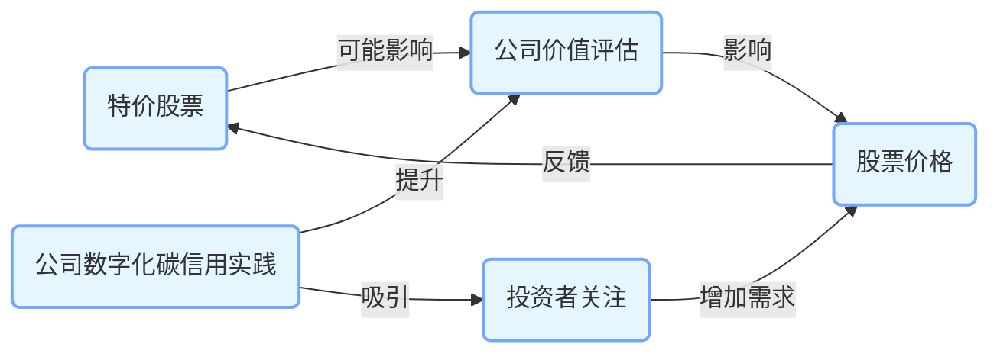

# 特价股票与公司数字化碳信用实践的关联性研究

> 关键词：特价股票、公司数字化碳信用实践、关联性、金融市场、可持续发展

> 摘要：本文旨在深入研究特价股票与公司数字化碳信用实践之间的关联性。通过对相关核心概念的阐释、算法原理的分析、数学模型的构建，结合项目实战案例和实际应用场景，全面探讨两者之间的内在联系。同时，为读者提供了学习资源、开发工具以及相关论文著作的推荐，最后对未来发展趋势与挑战进行了总结，并给出常见问题解答和参考资料。这对于理解金融市场与企业可持续发展之间的关系具有重要意义。

## 1. 背景介绍 
### 1.1 目的和范围
本研究的主要目的是揭示特价股票与公司数字化碳信用实践之间的潜在联系。在当今金融市场和可持续发展的大背景下，了解两者的关联性有助于投资者做出更明智的决策，也能为企业的数字化碳信用实践提供新的视角。研究范围涵盖了对特价股票的定义、特征分析，公司数字化碳信用实践的内涵、实施方式，以及两者之间相互影响的机制和程度。

### 1.2 预期读者
本文预期读者包括金融市场投资者、企业管理人员、环境政策研究者、可持续发展领域的从业者以及对金融与环境交叉领域感兴趣的学者和学生。对于投资者而言，有助于他们识别具有潜力的投资机会；企业管理人员可以从中获取关于数字化碳信用实践对企业价值影响的信息；政策研究者能为制定相关政策提供参考；而学生和学者则可将其作为研究的参考资料。

### 1.3 文档结构概述
本文将首先介绍相关的核心概念，包括特价股票和公司数字化碳信用实践，并通过文本示意图和 Mermaid 流程图展示它们之间的联系。接着，详细阐述核心算法原理和具体操作步骤，同时给出相应的 Python 源代码。之后，构建数学模型和公式，进行详细讲解并举例说明。通过项目实战案例，展示代码的实际应用和详细解释。分析实际应用场景，为不同读者提供实际操作的指导。推荐相关的学习资源、开发工具和论文著作。最后，总结未来发展趋势与挑战，解答常见问题，并提供扩展阅读和参考资料。

### 1.4 术语表
#### 1.4.1 核心术语定义
- **特价股票**：指在金融市场中，价格相对其内在价值或同行业其他股票价格明显偏低的股票。特价股票可能由于市场情绪、公司短期困境等因素导致价格低估，但具有潜在的价值回归可能性。
- **数字化碳信用**：是指利用数字化技术对企业的碳减排成果进行量化、记录和交易的一种信用凭证。通过数字化手段，能够更准确、高效地管理和监控企业的碳排放情况，为企业的碳减排行动提供可衡量的依据。
- **公司数字化碳信用实践**：企业在运营过程中，采用数字化技术进行碳减排管理、参与碳市场交易、披露碳减排信息等一系列与数字化碳信用相关的活动。

#### 1.4.2 相关概念解释
- **碳减排**：企业通过改进生产工艺、采用清洁能源、提高能源效率等方式，减少自身生产经营活动所产生的温室气体排放。
- **碳市场**：是一个以碳排放权为交易对象的市场，企业可以在市场上买卖碳排放配额或碳信用，以实现碳排放的合理分配和控制。
- **内在价值**：股票的内在价值是指股票未来现金流的现值，它反映了公司的真实盈利能力和资产价值。

#### 1.4.3 缩略词列表
- **ESG**：Environmental, Social and Governance，即环境、社会和治理，是一种关注企业可持续发展和社会责任的投资理念。
- **GHG**：Greenhouse Gas，温室气体，主要包括二氧化碳、甲烷等导致全球气候变暖的气体。

## 2. 核心概念与联系 

### 核心概念原理
#### 特价股票
特价股票的形成通常与市场的非理性因素有关。市场参与者的情绪波动、信息不对称等可能导致股票价格偏离其内在价值。例如，当市场整体处于悲观情绪时，即使公司的基本面良好，其股票价格也可能被过度压低。此外，公司短期的经营困境，如突发的财务危机、产品质量问题等，也可能使股票价格下跌成为特价股票。但从长期来看，随着公司解决问题或市场情绪的改善，股票价格有望回归其内在价值。

#### 公司数字化碳信用实践
公司数字化碳信用实践的核心在于利用数字化技术实现对碳排放的精准管理和碳减排的有效激励。通过安装传感器、使用数据分析软件等手段，企业可以实时监测和记录自身的碳排放情况。将碳减排成果转化为数字化碳信用后，企业可以在碳市场上进行交易，获取经济收益。同时，良好的数字化碳信用实践也有助于提升企业的社会形象和声誉，增强其市场竞争力。

### 核心概念架构的文本示意图
特价股票与公司数字化碳信用实践之间存在着潜在的联系。公司积极开展数字化碳信用实践可能会对其财务状况、市场形象产生积极影响，进而影响股票价格。如果投资者意识到公司数字化碳信用实践的价值，可能会增加对该公司股票的需求，推动股票价格上升，使原本的特价股票不再“特价”。反之，特价股票所在的公司若能通过数字化碳信用实践改善经营状况，也有助于提升股票的价值。

### Mermaid 流程图


## 3. 核心算法原理 & 具体操作步骤 

### 核心算法原理
为了研究特价股票与公司数字化碳信用实践的关联性，我们可以采用回归分析算法。回归分析是一种用于研究变量之间关系的统计方法，通过建立数学模型，我们可以量化特价股票价格与公司数字化碳信用实践相关指标之间的关系。

### 具体操作步骤
1. **数据收集**：收集特价股票的历史价格数据、公司的财务数据、数字化碳信用实践的相关指标（如碳减排量、碳信用交易量等）。
2. **数据预处理**：对收集到的数据进行清洗、缺失值处理和标准化处理，以确保数据的质量和一致性。
3. **模型建立**：选择合适的回归分析模型，如线性回归模型。假设特价股票价格为 $y$，公司数字化碳信用实践的相关指标为 $x_1, x_2, \cdots, x_n$，则线性回归模型可以表示为：
$$y = \beta_0 + \beta_1x_1 + \beta_2x_2 + \cdots + \beta_nx_n + \epsilon$$
其中，$\beta_0$ 为截距项，$\beta_1, \beta_2, \cdots, \beta_n$ 为回归系数，$\epsilon$ 为误差项。
4. **模型训练**：使用收集到的数据对回归模型进行训练，通过最小化误差平方和来估计回归系数。
5. **模型评估**：使用评估指标（如 $R^2$ 值、均方误差等）对训练好的模型进行评估，判断模型的拟合效果和预测能力。
6. **结果分析**：根据模型的回归系数和评估结果，分析特价股票价格与公司数字化碳信用实践之间的关联性。

### Python 源代码实现
```python
import pandas as pd
import numpy as np
from sklearn.linear_model import LinearRegression
from sklearn.model_selection import train_test_split
from sklearn.metrics import r2_score, mean_squared_error

# 数据收集与预处理
# 假设 data.csv 包含特价股票价格和公司数字化碳信用实践指标
data = pd.read_csv('data.csv')
X = data.drop('stock_price', axis=1)  # 特征变量
y = data['stock_price']  # 目标变量

# 数据划分
X_train, X_test, y_train, y_test = train_test_split(X, y, test_size=0.2, random_state=42)

# 模型建立
model = LinearRegression()

# 模型训练
model.fit(X_train, y_train)

# 模型预测
y_pred = model.predict(X_test)

# 模型评估
r2 = r2_score(y_test, y_pred)
mse = mean_squared_error(y_test, y_pred)

print(f'R^2 值: {r2}')
print(f'均方误差: {mse}')

# 结果分析
coefficients = model.coef_
intercept = model.intercept_
print('回归系数:', coefficients)
print('截距项:', intercept)
```

## 4. 数学模型和公式 & 详细讲解 & 举例说明 

### 数学模型
我们使用的线性回归模型为：
$$y = \beta_0 + \beta_1x_1 + \beta_2x_2 + \cdots + \beta_nx_n + \epsilon$$
其中：
- $y$ 表示特价股票的价格。
- $\beta_0$ 是截距项，代表当所有自变量 $x_1, x_2, \cdots, x_n$ 都为 0 时，特价股票的基础价格。
- $\beta_1, \beta_2, \cdots, \beta_n$ 是回归系数，分别表示自变量 $x_1, x_2, \cdots, x_n$ 对特价股票价格的影响程度。例如，$\beta_1$ 表示在其他自变量不变的情况下，$x_1$ 每增加一个单位，特价股票价格的平均变化量。
- $x_1, x_2, \cdots, x_n$ 是公司数字化碳信用实践的相关指标，如碳减排量、碳信用交易量等。
- $\epsilon$ 是误差项，代表模型无法解释的随机因素对特价股票价格的影响。

### 公式详细讲解
#### 回归系数的估计
回归系数 $\beta_0, \beta_1, \beta_2, \cdots, \beta_n$ 的估计通常采用最小二乘法。最小二乘法的目标是使实际观测值 $y_i$ 与模型预测值 $\hat{y}_i$ 之间的误差平方和最小，即：
$$\min_{\beta_0, \beta_1, \cdots, \beta_n} \sum_{i=1}^{m} (y_i - \hat{y}_i)^2 = \min_{\beta_0, \beta_1, \cdots, \beta_n} \sum_{i=1}^{m} (y_i - (\beta_0 + \beta_1x_{i1} + \beta_2x_{i2} + \cdots + \beta_nx_{in}))^2$$
其中，$m$ 是样本数量，$x_{i1}, x_{i2}, \cdots, x_{in}$ 是第 $i$ 个样本的自变量值。

#### 模型评估指标
- **$R^2$ 值**：$R^2$ 值用于衡量模型的拟合优度，其取值范围在 0 到 1 之间。$R^2$ 值越接近 1，表示模型对数据的拟合效果越好。$R^2$ 的计算公式为：
$$R^2 = 1 - \frac{\sum_{i=1}^{m} (y_i - \hat{y}_i)^2}{\sum_{i=1}^{m} (y_i - \bar{y})^2}$$
其中，$\bar{y}$ 是 $y$ 的平均值。
- **均方误差（MSE）**：均方误差衡量了模型预测值与实际观测值之间的平均误差程度。MSE 的计算公式为：
$$MSE = \frac{1}{m} \sum_{i=1}^{m} (y_i - \hat{y}_i)^2$$

### 举例说明
假设我们收集了 100 家公司的数据，其中自变量 $x_1$ 表示公司的碳减排量，$x_2$ 表示公司的碳信用交易量，因变量 $y$ 表示特价股票价格。通过线性回归模型训练，得到回归系数 $\beta_0 = 10$，$\beta_1 = 0.5$，$\beta_2 = 0.3$。这意味着当碳减排量和碳信用交易量都为 0 时，特价股票的基础价格为 10 元。在其他条件不变的情况下，碳减排量每增加 1 个单位，特价股票价格平均增加 0.5 元；碳信用交易量每增加 1 个单位，特价股票价格平均增加 0.3 元。

假设某家公司的碳减排量为 20 个单位，碳信用交易量为 10 个单位，则根据模型预测的特价股票价格为：
$$y = 10 + 0.5 \times 20 + 0.3 \times 10 = 10 + 10 + 3 = 23$$（元）

## 5. 项目实战：代码实际案例和详细解释说明 

### 5.1  开发环境搭建
#### 安装 Python
首先，需要安装 Python 编程语言。可以从 Python 官方网站（https://www.python.org/downloads/）下载适合自己操作系统的 Python 版本，并按照安装向导进行安装。

#### 安装必要的库
在项目中，我们使用了 `pandas`、`numpy`、`scikit-learn` 等库。可以使用以下命令来安装这些库：
```sh
pip install pandas numpy scikit-learn
```

### 5.2  源代码详细实现和代码解读
```python
import pandas as pd
import numpy as np
from sklearn.linear_model import LinearRegression
from sklearn.model_selection import train_test_split
from sklearn.metrics import r2_score, mean_squared_error

# 数据收集与预处理
# 假设 data.csv 包含特价股票价格和公司数字化碳信用实践指标
data = pd.read_csv('data.csv')
```
- 代码解释：首先导入所需的库，`pandas` 用于数据处理，`numpy` 用于数值计算，`LinearRegression` 用于构建线性回归模型，`train_test_split` 用于将数据划分为训练集和测试集，`r2_score` 和 `mean_squared_error` 用于模型评估。然后使用 `pd.read_csv` 函数读取存储在 `data.csv` 中的数据。

```python
X = data.drop('stock_price', axis=1)  # 特征变量
y = data['stock_price']  # 目标变量
```
- 代码解释：将数据集中的 `stock_price` 列作为目标变量 $y$，其余列作为特征变量 $X$。

```python
# 数据划分
X_train, X_test, y_train, y_test = train_test_split(X, y, test_size=0.2, random_state=42)
```
- 代码解释：使用 `train_test_split` 函数将数据集划分为训练集和测试集，其中测试集占总数据的 20%。`random_state` 参数用于确保每次划分的结果一致。

```python
# 模型建立
model = LinearRegression()
```
- 代码解释：创建一个线性回归模型对象 `model`。

```python
# 模型训练
model.fit(X_train, y_train)
```
- 代码解释：使用训练集数据对线性回归模型进行训练，通过最小二乘法估计回归系数。

```python
# 模型预测
y_pred = model.predict(X_test)
```
- 代码解释：使用训练好的模型对测试集数据进行预测，得到预测值 `y_pred`。

```python
# 模型评估
r2 = r2_score(y_test, y_pred)
mse = mean_squared_error(y_test, y_pred)

print(f'R^2 值: {r2}')
print(f'均方误差: {mse}')
```
- 代码解释：使用 `r2_score` 和 `mean_squared_error` 函数计算模型的 $R^2$ 值和均方误差，并打印输出。

```python
# 结果分析
coefficients = model.coef_
intercept = model.intercept_
print('回归系数:', coefficients)
print('截距项:', intercept)
```
- 代码解释：获取模型的回归系数和截距项，并打印输出，用于分析特价股票价格与公司数字化碳信用实践指标之间的关系。

### 5.3  代码解读与分析
通过上述代码，我们完成了一个简单的线性回归模型的建立、训练、预测和评估过程。从代码中可以看出，线性回归模型的实现相对简单，但在实际应用中，需要注意数据的质量和特征的选择。例如，如果数据存在缺失值或异常值，可能会影响模型的性能；如果选择的特征与目标变量之间的关联性不强，模型的预测效果也会受到影响。

在本项目中，我们通过 $R^2$ 值和均方误差来评估模型的性能。$R^2$ 值越接近 1，说明模型对数据的拟合效果越好；均方误差越小，说明模型的预测误差越小。回归系数的正负和大小可以反映特征变量对目标变量的影响方向和程度。例如，正的回归系数表示特征变量与目标变量呈正相关关系，负的回归系数表示呈负相关关系。

## 6. 实际应用场景 
### 投资者决策
对于投资者来说，了解特价股票与公司数字化碳信用实践的关联性可以帮助他们做出更明智的投资决策。如果一家公司积极开展数字化碳信用实践，且回归分析结果显示其与特价股票价格呈正相关关系，那么投资者可以考虑增加对该公司股票的投资。因为公司的数字化碳信用实践可能会提升其长期竞争力和市场价值，从而推动股票价格上涨。

### 企业战略规划
企业可以通过研究特价股票与数字化碳信用实践的关系，制定更合理的战略规划。如果发现良好的数字化碳信用实践能够提升公司股票价格，企业可以加大在碳减排和数字化碳管理方面的投入，以吸引更多投资者，提升公司的市场形象和价值。同时，企业还可以通过参与碳市场交易，将碳减排成果转化为经济收益，进一步改善财务状况。

### 政策制定
政府和监管机构可以根据特价股票与公司数字化碳信用实践的关联性，制定相关的政策和法规。例如，对积极开展数字化碳信用实践的企业给予税收优惠、财政补贴等支持，鼓励更多企业参与碳减排行动。同时，加强对碳市场的监管，确保碳信用交易的公平、公正和透明，促进金融市场与可持续发展的良性互动。

## 7. 工具和资源推荐
### 7.1 学习资源推荐
#### 7.1.1 书籍推荐
- 《金融市场学》：全面介绍了金融市场的基本概念、运行机制和投资策略，对于理解特价股票的市场环境有很大帮助。
- 《可持续金融》：探讨了金融与可持续发展的关系，包括碳金融、绿色投资等方面的内容，有助于深入了解公司数字化碳信用实践的金融背景。
- 《Python 数据分析实战》：详细介绍了使用 Python 进行数据分析的方法和技巧，对于实现本研究中的算法和模型非常有帮助。

#### 7.1.2 在线课程
- Coursera 上的“金融市场与投资策略”课程：由知名教授授课，系统讲解金融市场的理论和实践，提供丰富的案例分析。
- edX 上的“可持续发展金融”课程：介绍了可持续金融的前沿理论和实践，包括碳市场、绿色债券等内容。
- 中国大学 MOOC 上的“Python 数据分析基础”课程：适合初学者学习 Python 数据分析的基础知识和技能。

#### 7.1.3 技术博客和网站
- Towards Data Science：是一个专注于数据科学和机器学习的技术博客，提供了大量的数据分析和建模案例，以及最新的技术趋势和研究成果。
- Seeking Alpha：是一个金融投资领域的知名网站，提供股票分析、市场评论和投资建议等内容，对于了解特价股票的市场动态非常有帮助。
- Carbon Pulse：专注于碳市场和气候变化政策的新闻和分析，及时报道全球碳市场的最新动态和政策变化。

### 7.2 开发工具框架推荐
#### 7.2.1 IDE和编辑器
- PyCharm：是一款专业的 Python 集成开发环境，提供了丰富的代码编辑、调试和项目管理功能，适合开发大型的 Python 项目。
- Jupyter Notebook：是一个交互式的开发环境，支持代码、文本、图表等多种形式的展示，非常适合进行数据分析和模型实验。
- Visual Studio Code：是一款轻量级的代码编辑器，支持多种编程语言，具有丰富的插件生态系统，可以方便地进行 Python 开发。

#### 7.2.2 调试和性能分析工具
- pdb：是 Python 自带的调试工具，可以在代码中设置断点，逐行调试代码，帮助开发者定位和解决问题。
- cProfile：是 Python 的性能分析工具，可以统计代码的运行时间和函数调用次数，帮助开发者优化代码性能。
- Py-Spy：是一个轻量级的 Python 性能分析工具，可以实时监测 Python 程序的运行状态，找出性能瓶颈。

#### 7.2.3 相关框架和库
- Pandas：是一个强大的数据处理和分析库，提供了高效的数据结构和数据操作方法，适合处理和分析金融数据。
- NumPy：是 Python 的数值计算库，提供了多维数组和各种数学函数，为数据分析和模型计算提供了基础支持。
- Scikit-learn：是一个常用的机器学习库，提供了丰富的机器学习算法和工具，适合进行回归分析、分类、聚类等任务。

### 7.3 相关论文著作推荐
#### 7.3.1 经典论文
- “The Pricing of Carbon Risk in the Stock Market”：研究了股票市场中碳风险的定价机制，探讨了碳排放对股票价格的影响。
- “Digital Transformation in the Carbon Market: Opportunities and Challenges”：分析了数字化技术在碳市场中的应用现状和发展趋势，以及面临的机遇和挑战。
- “Sustainable Investing: The Performance of ESG Funds”：研究了可持续投资的绩效，包括 ESG 基金的表现和投资者的回报。

#### 7.3.2 最新研究成果
- 关注《Journal of Financial Economics》、《Review of Financial Studies》等金融领域的顶级期刊，以及《Nature Climate Change》、《Energy Policy》等环境领域的知名期刊，获取关于特价股票与公司数字化碳信用实践的最新研究成果。

#### 7.3.3 应用案例分析
- 一些国际组织和研究机构会发布关于企业数字化碳信用实践的案例分析报告，如世界银行、国际金融公司等。这些案例分析可以帮助读者了解企业在实际操作中的经验和教训，为自身的实践提供参考。

## 8. 总结：未来发展趋势与挑战
### 未来发展趋势
- **数字化碳信用实践的普及**：随着全球对气候变化问题的关注度不断提高，越来越多的企业将认识到数字化碳信用实践的重要性，积极参与碳减排行动，并采用数字化技术进行碳管理。这将推动数字化碳信用市场的不断发展和壮大。
- **金融市场与碳市场的深度融合**：特价股票与公司数字化碳信用实践的关联性将更加紧密，金融市场将更加关注企业的碳减排表现和数字化碳信用资产。碳金融产品将不断创新，如碳期货、碳期权等，为投资者提供更多的投资选择。
- **政策支持力度加大**：政府和监管机构将出台更多的政策和法规，鼓励企业开展数字化碳信用实践，推动碳市场的健康发展。例如，建立更加完善的碳排放权交易制度，加强对碳信用的认证和监管等。

### 挑战
- **数据质量和可靠性**：数字化碳信用实践需要大量的碳排放数据和相关信息，数据的质量和可靠性直接影响到模型的准确性和决策的科学性。目前，数据采集、传输和存储过程中存在一定的误差和风险，需要加强数据管理和质量控制。
- **技术创新和应用**：虽然数字化技术为碳信用管理提供了便利，但在实际应用中还面临一些技术难题，如碳排放监测技术的准确性、碳信用交易平台的安全性等。需要不断进行技术创新和改进，提高数字化碳信用实践的效率和效果。
- **市场机制不完善**：目前，碳市场的发展还处于初级阶段，市场机制不够完善，存在市场流动性不足、价格波动较大等问题。需要进一步完善市场规则，加强市场监管，提高碳市场的稳定性和有效性。

## 9. 附录：常见问题与解答
### 问题 1：特价股票一定具有投资价值吗？
解答：特价股票并不一定具有投资价值。虽然特价股票价格相对较低，但可能是由于公司存在基本面问题或市场风险等因素导致的。在投资特价股票时，需要综合考虑公司的财务状况、行业前景、数字化碳信用实践等多方面因素，进行深入的分析和研究，以判断其是否具有投资潜力。

### 问题 2：公司数字化碳信用实践对股票价格的影响有多大？
解答：公司数字化碳信用实践对股票价格的影响程度因公司而异，受到多种因素的影响，如行业特点、市场环境、碳减排效果等。通过回归分析等方法可以量化两者之间的关系，但具体的影响大小需要根据实际数据和模型结果进行判断。

### 问题 3：如何获取公司的数字化碳信用实践数据？
解答：可以通过以下途径获取公司的数字化碳信用实践数据：一是公司的官方报告，如年度报告、社会责任报告等，部分公司会在报告中披露碳排放情况和碳减排措施；二是政府和监管机构发布的相关数据，如碳排放监测平台、碳市场交易数据等；三是专业的数据库和研究机构提供的数据服务。

### 问题 4：线性回归模型是否适用于所有情况？
解答：线性回归模型是一种简单而常用的统计模型，但并不适用于所有情况。当变量之间的关系是非线性的，或者存在复杂的交互作用时，线性回归模型可能无法准确描述变量之间的关系。在这种情况下，可以考虑使用其他非线性模型，如决策树、神经网络等。

## 10. 扩展阅读 & 参考资料
### 扩展阅读
- 《低碳经济：理论与实践》：深入探讨了低碳经济的理论基础和实践经验，对于理解公司数字化碳信用实践的背景和意义有很大帮助。
- 《金融科技与可持续发展》：介绍了金融科技在可持续发展领域的应用，包括碳金融科技的发展趋势和创新模式。
- 《数据分析实战：Python 语言实现》：提供了更多的数据分析案例和技巧，有助于提升读者的数据分析能力。

### 参考资料
- [1] Brealey, R. A., Myers, S. C., & Allen, F. (2020). Principles of Corporate Finance. McGraw-Hill Education.
- [2] Stern, N. (2006). Stern Review on the Economics of Climate Change. HM Treasury.
- [3] Hastie, T., Tibshirani, R., & Friedman, J. (2009). The Elements of Statistical Learning: Data Mining, Inference, and Prediction. Springer.

作者：AI天才研究院/AI Genius Institute & 禅与计算机程序设计艺术 /Zen And The Art of Computer Programming