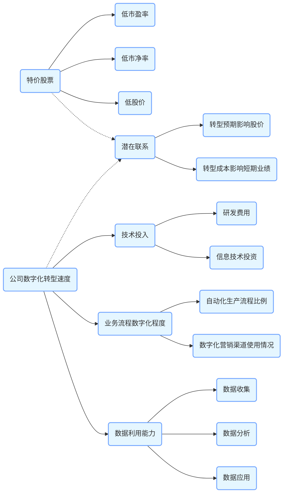

# 特价股票与公司数字化转型速度的潜在关联研究

> 关键词：特价股票、公司数字化转型速度、潜在关联、财务分析、市场表现

> 摘要：本文旨在深入研究特价股票与公司数字化转型速度之间的潜在关联。通过对相关核心概念的阐述、算法原理的分析、数学模型的构建以及实际案例的探讨，揭示两者之间可能存在的内在联系。研究过程涉及到对特价股票的特征、公司数字化转型的衡量指标、市场环境等多方面因素的综合考虑。通过理论分析和实证研究相结合的方法，为投资者和企业管理者提供有价值的参考，帮助他们更好地理解市场动态和企业发展趋势。

## 1. 背景介绍 
### 1.1 目的和范围
本研究的主要目的是探究特价股票与公司数字化转型速度之间是否存在潜在关联，并分析这种关联的性质和强度。研究范围涵盖了不同行业、不同规模的上市公司，通过收集和分析这些公司的财务数据、市场表现数据以及数字化转型相关指标，来验证假设并得出结论。

### 1.2 预期读者
本文的预期读者包括投资者、企业管理者、金融分析师以及对数字化转型和金融市场感兴趣的研究人员。对于投资者来说，了解特价股票与公司数字化转型速度的关联可以帮助他们做出更明智的投资决策；企业管理者可以从中获取关于数字化转型对公司市场价值影响的信息，以便更好地规划和推进转型战略；金融分析师可以将本研究的成果作为分析和评估公司的参考依据；研究人员则可以在本研究的基础上进行更深入的学术探讨。

### 1.3 文档结构概述
本文共分为十个部分。第一部分为背景介绍，阐述研究的目的、范围、预期读者和文档结构；第二部分介绍核心概念与联系，包括特价股票和公司数字化转型速度的定义、原理和架构，并通过示意图和流程图进行直观展示；第三部分讲解核心算法原理和具体操作步骤，使用Python源代码详细阐述分析过程；第四部分构建数学模型和公式，并进行详细讲解和举例说明；第五部分通过项目实战，展示代码实际案例并进行详细解释；第六部分探讨实际应用场景；第七部分推荐相关的工具和资源，包括学习资源、开发工具框架和论文著作；第八部分总结未来发展趋势与挑战；第九部分为附录，解答常见问题；第十部分提供扩展阅读和参考资料。

### 1.4 术语表
#### 1.4.1 核心术语定义
- **特价股票**：指在市场上价格相对较低，通常低于其内在价值或行业平均水平的股票。特价股票可能由于多种原因导致价格低迷，如市场误解、短期业绩不佳等。
- **公司数字化转型速度**：衡量公司在数字化转型过程中的进展程度和效率的指标。它反映了公司在采用数字技术、改变业务模式、提升运营效率等方面的速度和力度。

#### 1.4.2 相关概念解释
- **数字化转型**：企业利用数字技术对业务进行全面改造和升级的过程，包括但不限于数字化营销、数字化运营、数字化供应链管理等方面。
- **股票内在价值**：根据公司的基本面、盈利能力、成长潜力等因素估算出的股票的真实价值。

#### 1.4.3 缩略词列表
- **ROE**：净资产收益率（Return on Equity），衡量公司盈利能力的指标。
- **EPS**：每股收益（Earnings Per Share），反映公司每股股票的盈利情况。

## 2. 核心概念与联系 

### 2.1 特价股票的概念和特征
特价股票通常具有以下特征：
- **低市盈率（P/E）**：市盈率是股票价格与每股收益的比率，低市盈率意味着股票价格相对较低，可能被市场低估。
- **低市净率（P/B）**：市净率是股票价格与每股净资产的比率，低市净率表明股票价格相对于公司的净资产较低。
- **低股价**：特价股票的绝对价格通常较低，可能吸引一些追求低价股的投资者。

### 2.2 公司数字化转型速度的衡量
公司数字化转型速度可以从多个维度进行衡量：
- **技术投入**：包括研发费用、信息技术投资等，反映公司在数字技术方面的投入力度。
- **业务流程数字化程度**：例如，自动化生产流程的比例、数字化营销渠道的使用情况等。
- **数据利用能力**：公司对数据的收集、分析和应用能力，体现了其数字化运营的水平。

### 2.3 两者之间的潜在联系
从理论上讲，特价股票与公司数字化转型速度之间可能存在以下潜在联系：
- **转型预期影响股价**：如果市场预期一家公司的数字化转型速度较快且能够取得成功，那么该公司的股票可能会受到投资者的青睐，股价可能会上涨；反之，如果市场对公司的数字化转型前景不看好，股票可能会被低估，成为特价股票。
- **转型成本影响短期业绩**：公司在数字化转型过程中需要投入大量的资金和资源，这可能会对短期业绩产生负面影响，导致股价下跌，使股票成为特价股票。但从长期来看，如果转型成功，公司的业绩和市场价值可能会大幅提升。

### 2.4 核心概念原理和架构的文本示意图
```plaintext
特价股票
|-- 低市盈率
|-- 低市净率
|-- 低股价

公司数字化转型速度
|-- 技术投入
|   |-- 研发费用
|   |-- 信息技术投资
|-- 业务流程数字化程度
|   |-- 自动化生产流程比例
|   |-- 数字化营销渠道使用情况
|-- 数据利用能力
|   |-- 数据收集
|   |-- 数据分析
|   |-- 数据应用

潜在联系
|-- 转型预期影响股价
|-- 转型成本影响短期业绩
```

### 2.5 Mermaid 流程图


## 3. 核心算法原理 & 具体操作步骤 

### 3.1 数据收集
首先，我们需要收集相关的数据，包括公司的财务数据（如市盈率、市净率、每股收益等）和数字化转型相关数据（如研发费用、信息技术投资等）。可以使用Python的`pandas`和`yfinance`库来收集股票数据，使用网络爬虫技术或从专业数据库中获取公司的数字化转型数据。

```python
import pandas as pd
import yfinance as yf

# 定义股票代码列表
stock_codes = ['AAPL', 'GOOG', 'MSFT']

# 收集股票数据
stock_data = yf.download(stock_codes, start='2020-01-01', end='2023-01-01')

# 假设我们从其他数据源获取了公司的数字化转型数据，并保存为CSV文件
digital_transformation_data = pd.read_csv('digital_transformation_data.csv')
```

### 3.2 数据预处理
在收集到数据后，需要对数据进行预处理，包括缺失值处理、异常值处理和数据标准化等。

```python
# 处理缺失值
stock_data = stock_data.dropna()
digital_transformation_data = digital_transformation_data.dropna()

# 处理异常值（这里简单地使用Z-score方法）
from scipy import stats
import numpy as np

z_scores = np.abs(stats.zscore(stock_data))
stock_data = stock_data[(z_scores < 3).all(axis=1)]

# 数据标准化
from sklearn.preprocessing import StandardScaler

scaler = StandardScaler()
stock_data_scaled = scaler.fit_transform(stock_data)
digital_transformation_data_scaled = scaler.fit_transform(digital_transformation_data)
```

### 3.3 特征提取
从预处理后的数据中提取相关特征，例如计算股票的市盈率、市净率等指标，以及公司数字化转型的综合指标。

```python
# 计算市盈率和市净率
pe_ratio = stock_data['Close'] / stock_data['Earnings Per Share']
pb_ratio = stock_data['Close'] / stock_data['Book Value Per Share']

# 计算公司数字化转型的综合指标（这里简单地将各项数字化转型指标加权平均）
weights = [0.3, 0.3, 0.4]
digital_transformation_score = np.dot(digital_transformation_data_scaled, weights)
```

### 3.4 建立模型
可以使用回归分析等方法来建立特价股票与公司数字化转型速度之间的模型。

```python
from sklearn.linear_model import LinearRegression

# 准备训练数据
X = digital_transformation_score.reshape(-1, 1)
y = pe_ratio

# 建立线性回归模型
model = LinearRegression()
model.fit(X, y)

# 输出模型参数
print('斜率:', model.coef_[0])
print('截距:', model.intercept_)
```

### 3.5 模型评估
使用评估指标（如均方误差、决定系数等）来评估模型的性能。

```python
from sklearn.metrics import mean_squared_error, r2_score

# 预测
y_pred = model.predict(X)

# 计算评估指标
mse = mean_squared_error(y, y_pred)
r2 = r2_score(y, y_pred)

print('均方误差:', mse)
print('决定系数:', r2)
```

## 4. 数学模型和公式 & 详细讲解 & 举例说明 

### 4.1 线性回归模型
我们使用线性回归模型来探究特价股票与公司数字化转型速度之间的关系。线性回归模型的一般形式为：

$$y = \beta_0 + \beta_1x + \epsilon$$

其中，$y$ 是因变量（例如股票的市盈率），$x$ 是自变量（例如公司数字化转型的综合指标），$\beta_0$ 是截距，$\beta_1$ 是斜率，$\epsilon$ 是误差项。

### 4.2 斜率和截距的含义
- **斜率 $\beta_1$**：表示自变量 $x$ 每增加一个单位，因变量 $y$ 的平均变化量。在我们的模型中，斜率 $\beta_1$ 反映了公司数字化转型速度每提高一个单位，股票市盈率的平均变化情况。
- **截距 $\beta_0$**：表示当自变量 $x$ 为 0 时，因变量 $y$ 的取值。在实际应用中，截距的含义需要根据具体情况进行解释。

### 4.3 均方误差和决定系数
- **均方误差（MSE）**：用于衡量模型预测值与真实值之间的平均误差。其计算公式为：

$$MSE = \frac{1}{n}\sum_{i=1}^{n}(y_i - \hat{y}_i)^2$$

其中，$n$ 是样本数量，$y_i$ 是真实值，$\hat{y}_i$ 是预测值。均方误差越小，说明模型的预测效果越好。

- **决定系数（$R^2$）**：表示模型对数据的拟合程度，取值范围在 0 到 1 之间。其计算公式为：

$$R^2 = 1 - \frac{\sum_{i=1}^{n}(y_i - \hat{y}_i)^2}{\sum_{i=1}^{n}(y_i - \bar{y})^2}$$

其中，$\bar{y}$ 是真实值的平均值。决定系数越接近 1，说明模型对数据的拟合效果越好。

### 4.4 举例说明
假设我们通过线性回归模型得到的斜率 $\beta_1 = 0.5$，截距 $\beta_0 = 10$，均方误差 $MSE = 2$，决定系数 $R^2 = 0.8$。这意味着公司数字化转型速度每提高一个单位，股票的市盈率平均增加 0.5；当公司数字化转型速度为 0 时，股票的市盈率预计为 10。均方误差为 2 说明模型的预测误差相对较小，决定系数为 0.8 表明模型对数据的拟合效果较好。

## 5. 项目实战：代码实际案例和详细解释说明 

### 5.1  开发环境搭建
- **Python 安装**：建议使用 Python 3.7 及以上版本，可以从 Python 官方网站（https://www.python.org/downloads/）下载并安装。
- **虚拟环境创建**：使用`virtualenv`或`conda`创建虚拟环境，以隔离项目的依赖。例如，使用`virtualenv`创建虚拟环境的命令如下：

```bash
pip install virtualenv
virtualenv myenv
source myenv/bin/activate  # 在 Windows 上使用 myenv\Scripts\activate
```

- **依赖库安装**：安装项目所需的依赖库，如`pandas`、`yfinance`、`scikit-learn`等。

```bash
pip install pandas yfinance scikit-learn
```

### 5.2  源代码详细实现和代码解读
以下是一个完整的代码示例，展示了如何实现特价股票与公司数字化转型速度的关联分析：

```python
import pandas as pd
import yfinance as yf
from scipy import stats
import numpy as np
from sklearn.preprocessing import StandardScaler
from sklearn.linear_model import LinearRegression
from sklearn.metrics import mean_squared_error, r2_score

# 定义股票代码列表
stock_codes = ['AAPL', 'GOOG', 'MSFT']

# 收集股票数据
stock_data = yf.download(stock_codes, start='2020-01-01', end='2023-01-01')

# 假设我们从其他数据源获取了公司的数字化转型数据，并保存为CSV文件
digital_transformation_data = pd.read_csv('digital_transformation_data.csv')

# 处理缺失值
stock_data = stock_data.dropna()
digital_transformation_data = digital_transformation_data.dropna()

# 处理异常值（这里简单地使用Z-score方法）
z_scores = np.abs(stats.zscore(stock_data))
stock_data = stock_data[(z_scores < 3).all(axis=1)]

# 数据标准化
scaler = StandardScaler()
stock_data_scaled = scaler.fit_transform(stock_data)
digital_transformation_data_scaled = scaler.fit_transform(digital_transformation_data)

# 计算市盈率和市净率
pe_ratio = stock_data['Close'] / stock_data['Earnings Per Share']
pb_ratio = stock_data['Close'] / stock_data['Book Value Per Share']

# 计算公司数字化转型的综合指标（这里简单地将各项数字化转型指标加权平均）
weights = [0.3, 0.3, 0.4]
digital_transformation_score = np.dot(digital_transformation_data_scaled, weights)

# 准备训练数据
X = digital_transformation_score.reshape(-1, 1)
y = pe_ratio

# 建立线性回归模型
model = LinearRegression()
model.fit(X, y)

# 输出模型参数
print('斜率:', model.coef_[0])
print('截距:', model.intercept_)

# 预测
y_pred = model.predict(X)

# 计算评估指标
mse = mean_squared_error(y, y_pred)
r2 = r2_score(y, y_pred)

print('均方误差:', mse)
print('决定系数:', r2)
```

### 5.3  代码解读与分析
- **数据收集**：使用`yfinance`库下载股票数据，从 CSV 文件中读取公司的数字化转型数据。
- **数据预处理**：处理缺失值和异常值，并对数据进行标准化处理，以提高模型的性能。
- **特征提取**：计算股票的市盈率和市净率，以及公司数字化转型的综合指标。
- **模型建立**：使用线性回归模型建立特价股票与公司数字化转型速度之间的关系。
- **模型评估**：使用均方误差和决定系数评估模型的性能。

通过以上步骤，我们可以得到特价股票与公司数字化转型速度之间的关联模型，并评估模型的准确性。

## 6. 实际应用场景 
### 6.1 投资决策
对于投资者来说，了解特价股票与公司数字化转型速度的潜在关联可以帮助他们做出更明智的投资决策。如果一家公司的数字化转型速度较快且有望取得成功，但目前股票价格较低，那么该股票可能具有较高的投资价值。投资者可以通过分析公司的数字化转型指标和财务数据，筛选出具有潜力的特价股票进行投资。

### 6.2 企业战略规划
企业管理者可以根据研究结果，评估数字化转型对公司市场价值的影响，从而制定更合理的战略规划。如果数字化转型速度与股票价格存在正相关关系，企业可以加大在数字化转型方面的投入，以提升公司的市场竞争力和价值。

### 6.3 金融分析
金融分析师可以将特价股票与公司数字化转型速度的关联分析纳入其研究框架，为客户提供更全面的投资建议。通过分析不同行业、不同公司的数字化转型情况和股票表现，分析师可以发现市场趋势和投资机会。

## 7. 工具和资源推荐
### 7.1 学习资源推荐
#### 7.1.1 书籍推荐
- 《数字化转型：企业的必修课》：全面介绍了企业数字化转型的理论、方法和实践案例。
- 《金融市场分析》：涵盖了金融市场的基本原理、分析方法和投资策略。
- 《Python 数据分析实战》：详细讲解了使用 Python 进行数据分析的方法和技巧。

#### 7.1.2 在线课程
- Coursera 上的“数字化转型战略”课程：由知名教授授课，深入探讨企业数字化转型的战略规划和实施方法。
- edX 上的“金融市场与投资分析”课程：提供了金融市场分析的基础知识和实用工具。
- 网易云课堂上的“Python 数据分析入门”课程：适合初学者快速掌握 Python 数据分析的基本技能。

#### 7.1.3 技术博客和网站
- 36氪：提供了大量关于数字化转型、科技创新和商业动态的资讯和分析。
- 雪球财经：专注于金融市场和投资领域，有丰富的股票分析和投资经验分享。
- 博客园：汇聚了众多技术开发者的博客文章，其中不乏关于数据分析和机器学习的优质内容。

### 7.2 开发工具框架推荐
#### 7.2.1 IDE和编辑器
- PyCharm：一款专业的 Python 集成开发环境，提供了丰富的代码编辑、调试和分析功能。
- Jupyter Notebook：一种交互式的编程环境，适合进行数据分析和模型开发。
- Visual Studio Code：一款轻量级的代码编辑器，支持多种编程语言和插件扩展。

#### 7.2.2 调试和性能分析工具
- pdb：Python 自带的调试工具，可以帮助开发者定位和解决代码中的问题。
- cProfile：Python 的性能分析工具，可以分析代码的运行时间和资源消耗情况。
- TensorBoard：用于可视化深度学习模型的训练过程和性能指标。

#### 7.2.3 相关框架和库
- pandas：用于数据处理和分析的 Python 库，提供了高效的数据结构和数据操作方法。
- numpy：用于科学计算的 Python 库，提供了多维数组和数学函数。
- scikit-learn：用于机器学习的 Python 库，提供了丰富的机器学习算法和工具。

### 7.3 相关论文著作推荐
#### 7.3.1 经典论文
- “The Impact of Digital Transformation on Firm Performance”：研究了数字化转型对企业绩效的影响，为本文的研究提供了理论基础。
- “Value Investing: The Use of Financial Statement Analysis for Stock Selection”：介绍了价值投资的理论和方法，对特价股票的研究具有重要参考价值。

#### 7.3.2 最新研究成果
- 近年来，关于数字化转型和金融市场的研究不断涌现。可以通过学术数据库（如 IEEE Xplore、ACM Digital Library 等）搜索最新的研究论文，了解该领域的前沿动态。

#### 7.3.3 应用案例分析
- 一些知名企业的数字化转型案例可以为我们提供实践经验和启示。例如，亚马逊、阿里巴巴等公司在数字化转型方面取得了显著成就，可以通过相关的案例分析报告深入了解他们的转型策略和方法。

## 8. 总结：未来发展趋势与挑战
### 8.1 未来发展趋势
- **数字化转型加速**：随着科技的不断进步，企业数字化转型的速度将越来越快。更多的公司将加大在数字技术方面的投入，推动业务模式的创新和升级。
- **数据驱动的决策**：在数字化时代，数据将成为企业决策的重要依据。投资者和企业管理者将更加注重数据分析，通过挖掘数据中的价值来做出更明智的决策。
- **跨学科研究的兴起**：特价股票与公司数字化转型速度的关联研究涉及到金融、管理、信息技术等多个学科领域。未来，跨学科研究将更加深入，为解决复杂的现实问题提供更有效的方法和策略。

### 8.2 挑战
- **数据质量和获取难度**：准确、完整的数据是进行关联分析的基础。然而，目前市场上的数据质量参差不齐，获取数字化转型相关数据的难度较大。如何提高数据质量和获取效率是需要解决的问题。
- **模型的准确性和可靠性**：建立准确、可靠的关联模型是研究的关键。但由于市场环境的复杂性和不确定性，模型的准确性和可靠性可能受到影响。需要不断改进模型的算法和方法，提高模型的性能。
- **技术和人才短缺**：数字化转型和数据分析需要具备相关技术和知识的人才。目前，市场上这类人才相对短缺，企业和研究机构需要加强人才培养和引进，以满足发展的需求。

## 9. 附录：常见问题与解答
### 9.1 什么是特价股票？
特价股票是指在市场上价格相对较低，通常低于其内在价值或行业平均水平的股票。特价股票可能由于多种原因导致价格低迷，如市场误解、短期业绩不佳等。

### 9.2 如何衡量公司数字化转型速度？
公司数字化转型速度可以从多个维度进行衡量，包括技术投入、业务流程数字化程度和数据利用能力等。可以通过收集和分析相关数据，计算综合指标来评估公司的数字化转型速度。

### 9.3 线性回归模型的假设条件是什么？
线性回归模型的假设条件包括：自变量和因变量之间存在线性关系；误差项服从正态分布且具有零均值和恒定方差；自变量之间不存在多重共线性等。

### 9.4 如何提高模型的准确性？
可以通过以下方法提高模型的准确性：收集更多、更准确的数据；选择合适的模型和算法；进行特征工程，提取更有价值的特征；对模型进行调优，选择最优的参数等。

## 10. 扩展阅读 & 参考资料
- 《金融经济学》
- 《企业数字化转型实践》
- https://finance.yahoo.com/
- https://www.investopedia.com/
- https://papers.ssrn.com/

作者：AI天才研究院/AI Genius Institute & 禅与计算机程序设计艺术 /Zen And The Art of Computer Programming