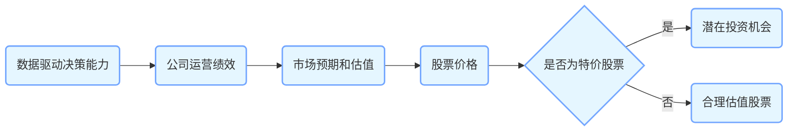

# 特价股票与公司数据驱动决策能力的长期关系分析

> 关键词：特价股票、数据驱动决策能力、长期关系、股票分析、公司运营

> 摘要：本文旨在深入分析特价股票与公司数据驱动决策能力之间的长期关系。通过对相关核心概念的阐述、算法原理的讲解、数学模型的构建，结合实际项目案例，探讨数据驱动决策能力如何影响公司的运营，进而对股票价格产生长期作用。文章还介绍了相关的应用场景、推荐了学习资源和开发工具，最后对未来发展趋势与挑战进行了总结，并解答了常见问题。

## 1. 背景介绍 
### 1.1 目的和范围
本研究的主要目的是揭示特价股票与公司数据驱动决策能力之间的内在长期联系。通过对这一关系的深入剖析，帮助投资者更好地理解公司运营状况对股票价格的影响，为投资决策提供更科学的依据。研究范围涵盖了不同行业的上市公司，分析它们在数据驱动决策方面的实践以及股票价格的长期走势。

### 1.2 预期读者
本文的预期读者包括专业投资者、金融分析师、公司管理人员以及对金融市场和数据分析感兴趣的研究人员。专业投资者可以借助本文的分析结果优化投资组合；金融分析师能在进行公司估值和股票评级时考虑数据驱动决策能力这一重要因素；公司管理人员可以从本文中获取提升公司决策能力的启示；研究人员则可以在此基础上开展更深入的学术研究。

### 1.3 文档结构概述
本文将首先介绍相关的核心概念，包括特价股票和数据驱动决策能力，并展示它们之间的联系。接着详细讲解用于分析两者关系的核心算法原理和具体操作步骤，同时给出相应的数学模型和公式。然后通过实际项目案例，展示如何运用这些理论进行分析。之后介绍实际应用场景，推荐相关的学习资源、开发工具和论文著作。最后总结未来发展趋势与挑战，解答常见问题，并提供扩展阅读和参考资料。

### 1.4 术语表
#### 1.4.1 核心术语定义
- **特价股票**：指价格相对其内在价值被低估的股票，通常表现为较低的市盈率、市净率等指标。投资者认为这类股票具有较大的上涨潜力。
- **数据驱动决策能力**：公司利用数据收集、分析和解读来制定战略、运营决策和解决问题的能力。这包括对市场数据、财务数据、客户数据等多方面数据的有效利用。

#### 1.4.2 相关概念解释
- **股票内在价值**：是指股票所代表的公司的真实价值，它基于公司的盈利能力、资产状况、行业前景等多种因素。通过各种估值方法可以估算股票的内在价值。
- **数据挖掘**：从大量的数据中发现有价值的信息和模式的过程。在公司决策中，数据挖掘可以帮助发现潜在的市场机会、客户需求等。

#### 1.4.3 缩略词列表
- **PE**：市盈率（Price-to-Earnings Ratio），是股票价格除以每股收益的比率，用于衡量股票的估值水平。
- **PB**：市净率（Price-to-Book Ratio），是股票价格与每股净资产的比率，反映了市场对公司净资产的估值。

## 2. 核心概念与联系 

### 核心概念原理
#### 特价股票
特价股票的出现通常是由于市场的短期非理性行为或对公司的误解。例如，公司可能因为短期的业绩波动、行业负面消息等原因，导致股票价格下跌，但公司的基本面并没有发生实质性的变化。从价值投资的角度来看，这些股票的价格低于其内在价值，具有投资价值。

#### 数据驱动决策能力
数据驱动决策能力是现代企业竞争力的重要组成部分。公司通过收集和分析各种数据，可以更准确地了解市场需求、客户偏好、竞争对手情况等，从而制定更科学的战略和运营决策。例如，通过分析销售数据，公司可以优化产品组合、调整营销策略；通过分析供应链数据，公司可以降低成本、提高运营效率。

### 核心概念架构的文本示意图
特价股票与公司数据驱动决策能力之间存在着间接但紧密的联系。公司的数据驱动决策能力会影响公司的运营绩效，如盈利能力、市场份额等。而公司的运营绩效又会影响市场对公司的预期和估值，进而影响股票价格。如果公司能够有效地利用数据进行决策，提高运营绩效，那么其股票价格可能会逐渐反映公司的真实价值，从而从特价股票转变为具有合理估值的股票。

### Mermaid 流程图


## 3. 核心算法原理 & 具体操作步骤 

### 核心算法原理
为了分析特价股票与公司数据驱动决策能力的长期关系，我们可以采用回归分析的方法。回归分析是一种统计方法，用于研究一个或多个自变量与因变量之间的关系。在本研究中，我们将公司的数据驱动决策能力作为自变量，股票价格的长期走势作为因变量。

### Python 源代码实现
```python
import pandas as pd
import numpy as np
from sklearn.linear_model import LinearRegression
from sklearn.model_selection import train_test_split
from sklearn.metrics import mean_squared_error

# 假设我们有以下数据
# X 是表示公司数据驱动决策能力的特征矩阵
# y 是股票价格的长期走势数据
# 这里我们使用随机生成的数据作为示例
np.random.seed(42)
X = np.random.rand(100, 5)  # 100 个样本，每个样本有 5 个特征
y = 2 * X[:, 0] + 3 * X[:, 1] + 0.5 * X[:, 2] + np.random.randn(100)

# 划分训练集和测试集
X_train, X_test, y_train, y_test = train_test_split(X, y, test_size=0.2, random_state=42)

# 创建线性回归模型
model = LinearRegression()

# 训练模型
model.fit(X_train, y_train)

# 在测试集上进行预测
y_pred = model.predict(X_test)

# 计算均方误差
mse = mean_squared_error(y_test, y_pred)
print(f"均方误差: {mse}")

# 查看模型系数
coefficients = model.coef_
print(f"模型系数: {coefficients}")
```

### 具体操作步骤
1. **数据收集**：收集公司的数据驱动决策能力相关的数据，如数据收集的频率、数据分析工具的使用情况、决策过程中数据的参与度等。同时收集股票价格的历史数据。
2. **数据预处理**：对收集到的数据进行清洗、整理和标准化处理，以确保数据的质量和一致性。
3. **特征选择**：从数据中选择与股票价格长期走势相关性较高的特征，作为自变量。
4. **模型训练**：使用训练集数据对回归模型进行训练，得到模型的系数。
5. **模型评估**：使用测试集数据对模型进行评估，计算均方误差等指标，评估模型的预测能力。
6. **结果分析**：分析模型的系数和评估结果，判断公司数据驱动决策能力与股票价格长期走势之间的关系。

## 4. 数学模型和公式 & 详细讲解 & 举例说明 

### 数学模型
我们使用的线性回归模型可以表示为：

$$y = \beta_0 + \beta_1x_1 + \beta_2x_2 + \cdots + \beta_nx_n + \epsilon$$

其中，$y$ 是股票价格的长期走势，$x_1, x_2, \cdots, x_n$ 是表示公司数据驱动决策能力的自变量，$\beta_0, \beta_1, \beta_2, \cdots, \beta_n$ 是模型的系数，$\epsilon$ 是误差项。

### 详细讲解
线性回归模型的目标是找到一组系数 $\beta_0, \beta_1, \beta_2, \cdots, \beta_n$，使得误差项 $\epsilon$ 的平方和最小。这可以通过最小二乘法来实现。最小二乘法的原理是通过最小化以下目标函数来求解系数：

$$\min_{\beta_0, \beta_1, \cdots, \beta_n} \sum_{i=1}^{m} (y_i - (\beta_0 + \beta_1x_{i1} + \beta_2x_{i2} + \cdots + \beta_nx_{in}))^2$$

其中，$m$ 是样本数量，$y_i$ 是第 $i$ 个样本的股票价格，$x_{i1}, x_{i2}, \cdots, x_{in}$ 是第 $i$ 个样本的自变量。

### 举例说明
假设我们有一家公司，我们用三个指标来衡量其数据驱动决策能力：数据收集的频率（$x_1$）、数据分析工具的使用效率（$x_2$）和决策过程中数据的参与度（$x_3$）。我们收集了该公司过去 10 年的股票价格数据（$y$）。通过线性回归分析，我们得到了以下模型：

$$y = 10 + 2x_1 + 3x_2 + 1.5x_3$$

这意味着，当数据收集的频率每增加 1 个单位，股票价格的长期走势预计会增加 2 个单位；当数据分析工具的使用效率每增加 1 个单位，股票价格的长期走势预计会增加 3 个单位；当决策过程中数据的参与度每增加 1 个单位，股票价格的长期走势预计会增加 1.5 个单位。

## 5. 项目实战：代码实际案例和详细解释说明 

### 5.1  开发环境搭建
为了运行上述代码，我们需要搭建以下开发环境：
- **Python 环境**：建议使用 Python 3.7 及以上版本。可以从 Python 官方网站（https://www.python.org/downloads/）下载并安装。
- **Python 库**：需要安装 `pandas`、`numpy`、`scikit-learn` 等库。可以使用 `pip` 命令进行安装：
```sh
pip install pandas numpy scikit-learn
```
- **开发工具**：可以使用 Jupyter Notebook、PyCharm 等开发工具。Jupyter Notebook 适合交互式开发和数据分析，PyCharm 适合大型项目的开发和调试。

### 5.2  源代码详细实现和代码解读
```python
import pandas as pd
import numpy as np
from sklearn.linear_model import LinearRegression
from sklearn.model_selection import train_test_split
from sklearn.metrics import mean_squared_error

# 假设我们有以下数据
# X 是表示公司数据驱动决策能力的特征矩阵
# y 是股票价格的长期走势数据
# 这里我们使用随机生成的数据作为示例
np.random.seed(42)
X = np.random.rand(100, 5)  # 100 个样本，每个样本有 5 个特征
y = 2 * X[:, 0] + 3 * X[:, 1] + 0.5 * X[:, 2] + np.random.randn(100)

# 划分训练集和测试集
X_train, X_test, y_train, y_test = train_test_split(X, y, test_size=0.2, random_state=42)

# 创建线性回归模型
model = LinearRegression()

# 训练模型
model.fit(X_train, y_train)

# 在测试集上进行预测
y_pred = model.predict(X_test)

# 计算均方误差
mse = mean_squared_error(y_test, y_pred)
print(f"均方误差: {mse}")

# 查看模型系数
coefficients = model.coef_
print(f"模型系数: {coefficients}")
```

### 代码解读与分析
1. **数据导入和生成**：
    - 导入所需的 Python 库，包括 `pandas`、`numpy`、`scikit-learn` 中的相关模块。
    - 使用 `np.random.rand` 函数生成随机的特征矩阵 `X` 和目标变量 `y`。这里假设 `y` 是由 `X` 的前三个特征线性组合加上随机噪声得到的。

2. **数据划分**：
    - 使用 `train_test_split` 函数将数据划分为训练集和测试集，测试集占总数据的 20%。

3. **模型创建和训练**：
    - 创建 `LinearRegression` 模型对象。
    - 使用 `fit` 方法对模型进行训练，传入训练集的特征矩阵和目标变量。

4. **模型预测和评估**：
    - 使用训练好的模型对测试集进行预测，得到预测结果 `y_pred`。
    - 使用 `mean_squared_error` 函数计算预测结果与真实值之间的均方误差。

5. **模型系数查看**：
    - 通过 `model.coef_` 属性查看模型的系数，这些系数反映了每个特征对目标变量的影响程度。

## 6. 实际应用场景 
### 投资决策
投资者可以通过分析公司的数据驱动决策能力，评估其股票是否为特价股票。如果一家公司具有较强的数据驱动决策能力，但股票价格却被低估，那么该股票可能具有投资价值。投资者可以将数据驱动决策能力作为选股的一个重要指标，构建投资组合。

### 公司战略规划
公司管理人员可以通过提升数据驱动决策能力，改善公司的运营绩效，从而提高公司的市场估值和股票价格。例如，公司可以加强数据收集和分析团队的建设，引入先进的数据分析工具和技术，优化决策流程，提高决策的科学性和准确性。

### 金融研究
金融研究人员可以深入研究特价股票与公司数据驱动决策能力之间的关系，为金融理论的发展提供实证支持。同时，研究结果也可以为投资者和公司管理人员提供参考。

## 7. 工具和资源推荐
### 7.1 学习资源推荐
#### 7.1.1 书籍推荐
- 《Python 数据分析实战》：介绍了使用 Python 进行数据分析的基本方法和技巧，包括数据清洗、可视化、机器学习等内容。
- 《价值投资：从格雷厄姆到巴菲特》：详细阐述了价值投资的理论和方法，帮助读者理解特价股票的投资逻辑。
- 《数据驱动的决策》：讲解了如何利用数据进行科学决策，提高企业的竞争力。

#### 7.1.2 在线课程
- Coursera 上的“Data Science Specialization”：提供了全面的数据科学课程，包括数据分析、机器学习、深度学习等方面的内容。
- edX 上的“Financial Markets”：由耶鲁大学教授授课，介绍了金融市场的基本原理和投资策略。
- Udemy 上的“Python for Data Science and Machine Learning Bootcamp”：通过实际案例讲解如何使用 Python 进行数据分析和机器学习。

#### 7.1.3 技术博客和网站
- Towards Data Science：一个专注于数据科学和机器学习的技术博客，提供了大量的优质文章和教程。
- Seeking Alpha：一个金融投资领域的网站，提供了股票分析、市场评论等内容。
- Kaggle：一个数据科学竞赛平台，上面有很多关于金融数据分析的数据集和竞赛项目。

### 7.2 开发工具框架推荐
#### 7.2.1 IDE和编辑器
- Jupyter Notebook：一个交互式的开发环境，适合进行数据分析和机器学习的实验和演示。
- PyCharm：一个专业的 Python 开发 IDE，提供了丰富的功能和插件，适合大型项目的开发和调试。
- Visual Studio Code：一个轻量级的代码编辑器，支持多种编程语言和插件，具有良好的扩展性。

#### 7.2.2 调试和性能分析工具
- PDB：Python 自带的调试工具，可以帮助开发者定位代码中的错误。
- cProfile：Python 标准库中的性能分析工具，可以分析代码的运行时间和函数调用情况。
- TensorBoard：一个用于可视化深度学习模型训练过程的工具，可以帮助开发者监控模型的性能。

#### 7.2.3 相关框架和库
- Pandas：一个用于数据处理和分析的 Python 库，提供了高效的数据结构和数据操作方法。
- NumPy：一个用于科学计算的 Python 库，提供了高效的数组操作和数学函数。
- Scikit-learn：一个用于机器学习的 Python 库，提供了各种机器学习算法和工具。

### 7.3 相关论文著作推荐
#### 7.3.1 经典论文
- Fama, E. F., & French, K. R. (1992). The cross-section of expected stock returns. The Journal of Finance, 47(2), 427-465. 该论文提出了著名的 Fama-French 三因子模型，用于解释股票收益率的差异。
- Campbell, J. Y., & Shiller, R. J. (1988). The dividend-price ratio and expectations of future dividends and discount factors. The Review of Financial Studies, 1(3), 195-228. 该论文研究了股息价格比与未来股息和贴现因子之间的关系，对股票估值具有重要意义。

#### 7.3.2 最新研究成果
- 可以关注顶级金融学术期刊，如 The Journal of Finance、The Review of Financial Studies、Journal of Financial Economics 等，获取关于特价股票和数据驱动决策的最新研究成果。

#### 7.3.3 应用案例分析
- 可以参考一些知名投资机构的研究报告和案例分析，了解他们如何运用数据驱动决策进行投资和风险管理。

## 8. 总结：未来发展趋势与挑战
### 未来发展趋势
- **数据驱动决策的普及**：随着信息技术的不断发展，越来越多的公司将采用数据驱动的决策方式，提高运营效率和竞争力。这将进一步加强公司数据驱动决策能力与股票价格之间的联系。
- **人工智能和机器学习的应用**：人工智能和机器学习技术将在金融领域得到更广泛的应用，如股票价格预测、投资组合优化等。这些技术可以帮助投资者更准确地分析特价股票与公司数据驱动决策能力之间的关系。
- **跨学科研究的兴起**：金融、数据分析、计算机科学等学科之间的交叉融合将越来越深入，为研究特价股票与公司数据驱动决策能力的关系提供更广阔的视角和方法。

### 挑战
- **数据质量和隐私问题**：数据的质量和隐私是数据驱动决策的关键问题。如果数据存在误差、缺失或泄露，将影响决策的准确性和可靠性。
- **模型的复杂性和解释性**：随着人工智能和机器学习技术的应用，模型的复杂性不断增加，导致模型的解释性变差。投资者和公司管理人员难以理解模型的决策过程和结果。
- **市场的不确定性**：金融市场具有高度的不确定性，受到宏观经济、政策、地缘政治等多种因素的影响。即使公司具有较强的数据驱动决策能力，也不能完全保证股票价格的上涨。

## 9. 附录：常见问题与解答
### 问题 1：如何衡量公司的数据驱动决策能力？
答：可以从多个方面衡量公司的数据驱动决策能力，如数据收集的频率和范围、数据分析工具的使用情况、决策过程中数据的参与度、数据驱动决策的效果评估等。可以通过问卷调查、实地调研、分析公司的财务报表和运营数据等方式获取相关信息。

### 问题 2：特价股票一定具有投资价值吗？
答：不一定。特价股票只是价格相对其内在价值被低估，但公司的基本面可能存在问题，如盈利能力下降、市场份额萎缩等。投资者需要综合考虑公司的财务状况、行业前景、管理团队等因素，评估股票的投资价值。

### 问题 3：数据驱动决策能力对股票价格的影响有多大？
答：数据驱动决策能力对股票价格的影响程度取决于多种因素，如行业竞争环境、公司的战略执行能力、市场的有效性等。通过回归分析等方法可以定量评估数据驱动决策能力与股票价格之间的关系，但具体的影响程度需要根据实际情况进行分析。

## 10. 扩展阅读 & 参考资料
### 扩展阅读
- 《金融炼金术》：乔治·索罗斯的经典著作，介绍了他的投资哲学和方法。
- 《大数据时代》：阐述了大数据对社会和经济的影响，以及如何利用大数据进行决策。
- 《人工智能时代》：探讨了人工智能技术的发展趋势和应用前景。

### 参考资料
- Fama, E. F., & French, K. R. (1992). The cross-section of expected stock returns. The Journal of Finance, 47(2), 427-465.
- Campbell, J. Y., & Shiller, R. J. (1988). The dividend-price ratio and expectations of future dividends and discount factors. The Review of Financial Studies, 1(3), 195-228.
- Python 官方文档：https://docs.python.org/3/
- Pandas 官方文档：https://pandas.pydata.org/docs/
- NumPy 官方文档：https://numpy.org/doc/
- Scikit-learn 官方文档：https://scikit-learn.org/stable/

作者：AI天才研究院/AI Genius Institute & 禅与计算机程序设计艺术 /Zen And The Art of Computer Programming