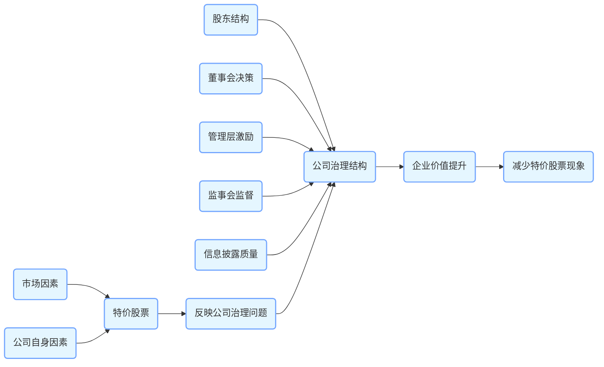

# 特价股票与公司治理结构改善的关系

> 关键词：特价股票、公司治理结构、市场效率、企业价值、股东权益、信息披露、代理成本

> 摘要：本文旨在深入探讨特价股票与公司治理结构改善之间的内在联系。通过对特价股票的定义、形成原因以及公司治理结构相关理论的分析，阐述二者相互作用的机制。研究发现，特价股票的出现可能反映公司治理存在问题，而公司治理结构的改善有助于提升公司价值，减少特价股票现象。同时，本文还结合实际案例，分析如何利用二者关系促进企业健康发展，为投资者和企业管理者提供有价值的参考。

## 1. 背景介绍 
### 1.1 目的和范围
本研究的主要目的是全面剖析特价股票与公司治理结构改善之间的关系。具体范围涵盖了特价股票的基本概念、形成因素，公司治理结构的内涵、要素以及其对企业运营的影响。通过理论分析和实际案例研究，揭示二者之间的相互作用机制，为企业管理者优化公司治理结构、投资者做出合理投资决策提供理论支持和实践指导。

### 1.2 预期读者
本文预期读者包括金融领域的投资者、企业管理者、公司治理研究学者以及对金融市场和企业管理感兴趣的相关人员。投资者可以通过了解特价股票与公司治理结构的关系，更好地评估投资风险和潜在收益；企业管理者可以从中获取优化公司治理结构的思路和方法，提升企业价值；研究学者可以将本文作为进一步深入研究的参考资料。

### 1.3 文档结构概述
本文首先介绍研究的背景、目的、预期读者和文档结构，为后续内容的展开奠定基础。接着阐述特价股票和公司治理结构的核心概念及其联系，包括相关原理和架构示意图。然后详细讲解与二者关系相关的核心算法原理和具体操作步骤，并给出相应的数学模型和公式。通过实际项目案例，对代码实现和解读进行分析，展示二者关系在实际中的应用。随后探讨实际应用场景，推荐相关的工具和资源。最后总结未来发展趋势与挑战，解答常见问题，并提供扩展阅读和参考资料。

### 1.4 术语表
#### 1.4.1 核心术语定义
- **特价股票**：指市场价格明显低于其内在价值的股票。这种价格偏离可能是由于市场短期波动、投资者情绪、公司负面消息等多种因素导致。
- **公司治理结构**：是一种对公司进行管理和控制的体系。它规定了公司各个参与者，如股东、董事会、管理层、监事会等之间的权利和责任分配，以及决策公司事务时所应遵循的规则和程序。

#### 1.4.2 相关概念解释
- **市场效率**：指市场能够迅速、准确地反映所有相关信息，使资产价格与其内在价值相符的程度。市场效率的高低影响着特价股票的出现频率和持续时间。
- **企业价值**：是企业未来现金流量的现值，反映了企业的综合实力和市场竞争力。公司治理结构的优劣直接影响企业价值的创造和提升。
- **股东权益**：是指股东对公司净资产的所有权，包括股本、资本公积、盈余公积和未分配利润等。良好的公司治理结构有助于保护股东权益。

#### 1.4.3 缩略词列表
- **CEO**：Chief Executive Officer，首席执行官
- **CFO**：Chief Financial Officer，首席财务官
- **BOD**：Board of Directors，董事会

## 2. 核心概念与联系 
### 2.1 特价股票的形成机制
特价股票的形成是多种因素共同作用的结果。从市场层面来看，宏观经济环境的变化、行业竞争态势的加剧以及投资者情绪的波动都可能导致股票价格偏离其内在价值。例如，在经济衰退期间，投资者对未来经济前景悲观，可能会过度抛售股票，导致股价下跌，从而出现特价股票。

从公司层面来看，公司自身的经营业绩、财务状况、信息披露质量等因素也会影响股票价格。如果公司业绩不佳、财务报表存在问题或者信息披露不及时、不透明，投资者可能会对公司失去信心，进而导致股价下跌。

### 2.2 公司治理结构的要素与功能
公司治理结构主要包括股东、董事会、管理层和监事会等要素。股东是公司的所有者，拥有公司的剩余索取权和控制权。董事会是公司的决策机构，负责制定公司的战略规划和重大决策。管理层是公司的执行机构，负责公司的日常运营和管理。监事会是公司的监督机构，负责监督董事会和管理层的行为，确保公司的运营符合法律法规和公司章程的规定。

公司治理结构的主要功能包括决策、监督和激励。通过合理的决策机制，公司能够制定出科学合理的发展战略；通过有效的监督机制，能够防止管理层的机会主义行为，保护股东权益；通过适当的激励机制，能够调动管理层和员工的积极性，提高公司的运营效率。

### 2.3 特价股票与公司治理结构的联系
特价股票的出现可能反映公司治理结构存在问题。例如，如果公司内部存在严重的代理问题，管理层可能会为了自身利益而损害股东利益，导致公司业绩下滑，股价下跌。此外，信息披露不透明也可能导致投资者对公司的真实情况了解不足，从而低估公司价值，使股票成为特价股票。

相反，改善公司治理结构有助于减少特价股票现象。通过完善公司的决策机制、监督机制和激励机制，能够提高公司的运营效率和管理水平，提升公司价值。同时，加强信息披露的透明度，能够增强投资者对公司的信心，使股票价格更能反映其内在价值。

### 2.4 核心概念原理和架构的文本示意图
特价股票与公司治理结构的关系可以用以下文本示意图表示：

特价股票 <-> 公司治理结构
|                    |
|                    |
市场因素           内部治理要素
|                    |
|                    |
宏观经济环境        股东结构
行业竞争态势        董事会决策
投资者情绪          管理层激励
|                    |
|                    |
公司业绩            监事会监督
财务状况            信息披露质量

### 2.5 Mermaid 流程图


## 3. 核心算法原理 & 具体操作步骤 
### 3.1 特价股票的估值算法
在金融领域，常用的股票估值方法有股息贴现模型（Dividend Discount Model，DDM）、自由现金流贴现模型（Discounted Cash Flow Model，DCF）等。这里以股息贴现模型为例进行讲解。

股息贴现模型的基本原理是将股票的价值视为其未来股息的现值之和。假设股票的股息增长率为 $g$，必要收益率为 $r$，当前股息为 $D_0$，则股票的内在价值 $V$ 可以用以下公式表示：

$$V = \frac{D_1}{r - g}$$

其中，$D_1 = D_0(1 + g)$ 为下一期的股息。

以下是使用 Python 实现股息贴现模型的代码示例：
```python
def ddm_valuation(D0, g, r):
    """
    股息贴现模型估值函数
    :param D0: 当前股息
    :param g: 股息增长率
    :param r: 必要收益率
    :return: 股票内在价值
    """
    D1 = D0 * (1 + g)
    if r <= g:
        raise ValueError("必要收益率必须大于股息增长率")
    V = D1 / (r - g)
    return V

# 示例数据
D0 = 2.0
g = 0.05
r = 0.1

# 计算股票内在价值
value = ddm_valuation(D0, g, r)
print(f"股票内在价值: {value}")
```

### 3.2 公司治理结构评价指标体系
为了评估公司治理结构的优劣，可以构建一套评价指标体系。常见的评价指标包括股权集中度、董事会独立性、管理层薪酬激励等。

以下是一个简单的公司治理结构评价指标体系示例：
| 指标类别 | 具体指标 | 计算方法 |
|---|---|---|
| 股权结构 | 第一大股东持股比例 | 第一大股东持股数量 / 总股本 |
|  | 前十大股东持股比例之和 | 前十大股东持股数量之和 / 总股本 |
| 董事会结构 | 独立董事比例 | 独立董事人数 / 董事会总人数 |
|  | 董事会会议次数 | 统计一定时期内董事会会议的次数 |
| 管理层激励 | 管理层薪酬与公司业绩的相关性 | 通过回归分析计算管理层薪酬与公司净利润等业绩指标的相关性系数 |

### 3.3 基于评价指标的公司治理结构优化步骤
1. **数据收集**：收集公司的股权结构、董事会结构、管理层薪酬等相关数据。
2. **指标计算**：根据上述评价指标的计算方法，计算各项指标的值。
3. **对比分析**：将计算得到的指标值与同行业的平均水平或优秀企业的指标值进行对比，找出存在的问题。
4. **制定优化方案**：根据对比分析的结果，制定针对性的优化方案，如调整股权结构、增加独立董事比例、完善管理层薪酬激励机制等。
5. **实施与监控**：实施优化方案，并定期对公司治理结构进行评估和监控，确保优化方案的有效执行。

以下是一个简单的 Python 代码示例，用于计算股权集中度指标：
```python
def calculate_ownership_concentration(top1_shares, total_shares):
    """
    计算第一大股东持股比例
    :param top1_shares: 第一大股东持股数量
    :param total_shares: 总股本
    :return: 第一大股东持股比例
    """
    concentration = top1_shares / total_shares
    return concentration

# 示例数据
top1_shares = 500000
total_shares = 1000000

# 计算股权集中度
ownership_concentration = calculate_ownership_concentration(top1_shares, total_shares)
print(f"第一大股东持股比例: {ownership_concentration * 100}%")
```

## 4. 数学模型和公式 & 详细讲解 & 举例说明 
### 4.1 股息贴现模型的详细讲解
股息贴现模型（DDM）是一种基于股票未来股息现金流的估值模型。其基本假设是股票的价值取决于其未来所能产生的股息现金流。

公式 $V = \frac{D_1}{r - g}$ 的推导过程如下：

假设股票每年的股息以固定增长率 $g$ 增长，第 $n$ 期的股息 $D_n$ 可以表示为 $D_n = D_0(1 + g)^n$。

股票的内在价值 $V$ 是其未来股息现金流的现值之和，即：

$$V = \frac{D_1}{(1 + r)^1} + \frac{D_2}{(1 + r)^2} + \frac{D_3}{(1 + r)^3} + \cdots$$

将 $D_n = D_0(1 + g)^n$ 代入上式，得到：

$$V = \frac{D_0(1 + g)}{(1 + r)^1} + \frac{D_0(1 + g)^2}{(1 + r)^2} + \frac{D_0(1 + g)^3}{(1 + r)^3} + \cdots$$

这是一个等比数列求和的问题，公比为 $\frac{1 + g}{1 + r}$。当 $r > g$ 时，等比数列收敛，其和为：

$$V = \frac{D_0(1 + g)}{r - g} = \frac{D_1}{r - g}$$

### 4.2 举例说明
假设某公司当前股息 $D_0 = 2$ 元，预计股息增长率 $g = 5\%$，投资者的必要收益率 $r = 10\%$。

首先计算下一期的股息 $D_1$：

$D_1 = D_0(1 + g) = 2 \times (1 + 0.05) = 2.1$（元）

然后根据股息贴现模型计算股票的内在价值 $V$：

$$V = \frac{D_1}{r - g} = \frac{2.1}{0.1 - 0.05} = 42$$（元）

如果该股票的市场价格低于 42 元，则可能被认为是特价股票。

### 4.3 公司治理结构与企业价值的数学关系
公司治理结构的优劣会影响企业的运营效率和价值创造能力。可以用一个简单的线性回归模型来表示公司治理结构与企业价值之间的关系：

$$V = \alpha + \beta_1X_1 + \beta_2X_2 + \cdots + \beta_nX_n + \epsilon$$

其中，$V$ 表示企业价值，$X_1, X_2, \cdots, X_n$ 表示公司治理结构的各项评价指标，$\alpha$ 是截距项，$\beta_1, \beta_2, \cdots, \beta_n$ 是回归系数，$\epsilon$ 是误差项。

通过收集大量的企业数据，运用最小二乘法等方法可以估计出回归系数 $\beta_1, \beta_2, \cdots, \beta_n$ 的值，从而分析公司治理结构各指标对企业价值的影响程度。

## 5. 项目实战：代码实际案例和详细解释说明 
### 5.1  开发环境搭建
本项目实战使用 Python 语言进行开发，需要安装以下必要的库：
- `pandas`：用于数据处理和分析。
- `numpy`：用于数值计算。
- `matplotlib`：用于数据可视化。

可以使用以下命令进行安装：
```sh
pip install pandas numpy matplotlib
```

### 5.2  源代码详细实现和代码解读
以下是一个完整的项目实战代码示例，用于分析特价股票与公司治理结构的关系。

```python
import pandas as pd
import numpy as np
import matplotlib.pyplot as plt

# 模拟公司数据
data = {
    'company_name': ['Company A', 'Company B', 'Company C', 'Company D', 'Company E'],
    'current_dividend': [2.0, 1.5, 3.0, 2.5, 1.8],
    'dividend_growth_rate': [0.05, 0.03, 0.06, 0.04, 0.02],
    'required_return': [0.1, 0.12, 0.09, 0.11, 0.13],
    'top1_shareholder_ratio': [0.3, 0.4, 0.2, 0.35, 0.45],
    'independent_director_ratio': [0.3, 0.2, 0.4, 0.3, 0.25],
    'market_price': [30, 20, 40, 35, 25]
}

df = pd.DataFrame(data)

# 定义股息贴现模型估值函数
def ddm_valuation(D0, g, r):
    D1 = D0 * (1 + g)
    if r <= g:
        raise ValueError("必要收益率必须大于股息增长率")
    V = D1 / (r - g)
    return V

# 计算股票内在价值
df['intrinsic_value'] = df.apply(lambda row: ddm_valuation(row['current_dividend'], row['dividend_growth_rate'], row['required_return']), axis=1)

# 计算是否为特价股票
df['is_bargain_stock'] = df['market_price'] < df['intrinsic_value']

# 分析公司治理结构与特价股票的关系
correlation_top1 = df['top1_shareholder_ratio'].corr(df['is_bargain_stock'])
correlation_independent = df['independent_director_ratio'].corr(df['is_bargain_stock'])

print(f"第一大股东持股比例与特价股票的相关性: {correlation_top1}")
print(f"独立董事比例与特价股票的相关性: {correlation_independent}")

# 数据可视化
plt.figure(figsize=(10, 6))
plt.scatter(df['top1_shareholder_ratio'], df['is_bargain_stock'], label='Top 1 Shareholder Ratio')
plt.scatter(df['independent_director_ratio'], df['is_bargain_stock'], label='Independent Director Ratio')
plt.xlabel('Ratio')
plt.ylabel('Is Bargain Stock (1: Yes, 0: No)')
plt.title('Relationship between Corporate Governance Structure and Bargain Stocks')
plt.legend()
plt.show()
```

### 5.3  代码解读与分析
1. **数据模拟**：使用字典 `data` 模拟了 5 家公司的数据，包括当前股息、股息增长率、必要收益率、第一大股东持股比例、独立董事比例和市场价格等信息。
2. **股息贴现模型计算**：定义了 `ddm_valuation` 函数，用于计算股票的内在价值。通过 `apply` 方法将该函数应用到 DataFrame 的每一行，计算出每家公司股票的内在价值。
3. **判断特价股票