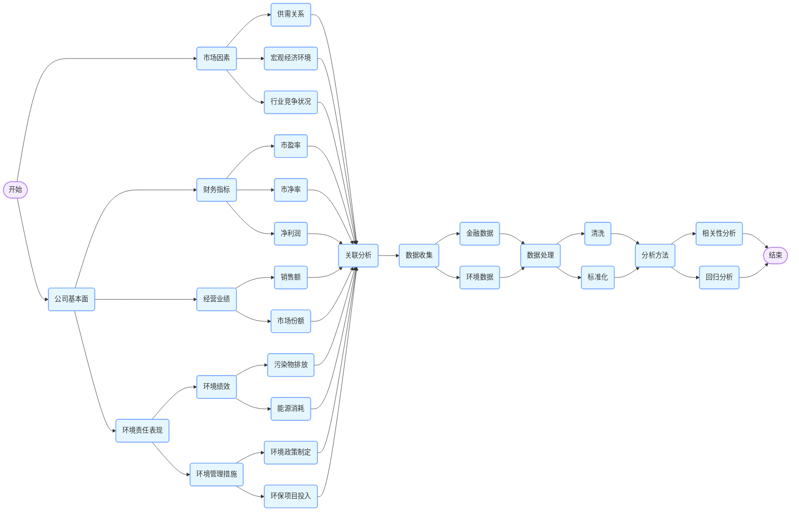

# 特价股票与公司环境责任表现的关联分析

> 关键词：特价股票、公司环境责任表现、关联分析、财务指标、环境绩效

> 摘要：本文旨在深入探讨特价股票与公司环境责任表现之间的关联。通过对特价股票的定义、公司环境责任表现的内涵进行剖析，运用统计学方法和相关数学模型，结合实际案例进行研究。文章详细阐述了核心概念、算法原理、数学模型，搭建开发环境并给出代码实现，分析了实际应用场景，推荐了相关学习资源、开发工具和论文著作。最后总结了未来发展趋势与挑战，并对常见问题进行解答。

## 1. 背景介绍 
### 1.1 目的和范围
在当今的金融市场和企业运营环境中，特价股票一直是投资者关注的焦点之一。特价股票通常指价格相对较低、具有一定投资潜力的股票。同时，随着社会对环境保护意识的不断提高，公司的环境责任表现也日益受到重视。本研究的目的在于分析特价股票与公司环境责任表现之间是否存在某种关联，这种关联的性质和程度如何。研究范围涵盖了多个行业的上市公司，通过对它们的财务数据和环境责任相关数据进行收集和分析，以揭示两者之间可能存在的关系。

### 1.2 预期读者
本文预期读者包括金融投资者、企业管理者、环境政策制定者以及对金融与环境交叉领域感兴趣的研究人员。对于投资者来说，了解特价股票与公司环境责任表现的关联有助于他们做出更明智的投资决策；企业管理者可以从中获取有关企业环境责任对股票价格影响的信息，以制定更合理的企业战略；环境政策制定者可以根据研究结果制定更有效的政策来推动企业履行环境责任；研究人员则可以在本研究的基础上进行更深入的探索。

### 1.3 文档结构概述
本文将按照以下结构进行阐述：首先介绍核心概念与联系，明确特价股票和公司环境责任表现的定义和相关关系；接着讲解核心算法原理和具体操作步骤，包括如何收集和处理数据、运用何种算法进行关联分析；然后给出数学模型和公式，并进行详细讲解和举例说明；之后通过项目实战展示代码实际案例和详细解释；分析实际应用场景；推荐相关的工具和资源；最后总结未来发展趋势与挑战，解答常见问题，并提供扩展阅读和参考资料。

### 1.4 术语表
#### 1.4.1 核心术语定义
- **特价股票**：指在股票市场中，价格相对其内在价值或行业平均水平较低，可能具有一定投资价值的股票。其价格低可能是由于市场短期波动、公司短期业绩不佳等原因导致。
- **公司环境责任表现**：指公司在生产经营过程中，对环境保护所做出的努力和取得的成果。包括减少污染物排放、提高资源利用效率、推动可持续发展等方面的表现。

#### 1.4.2 相关概念解释
- **环境绩效**：是衡量公司环境责任表现的一个重要指标，通常通过污染物排放减少量、能源消耗降低率等具体指标来衡量。
- **财务指标**：用于评估公司财务状况和经营业绩的指标，如市盈率、市净率、净利润等。在本研究中，财务指标与特价股票的定义和分析密切相关。

#### 1.4.3 缩略词列表
- **PE**：市盈率（Price Earnings Ratio），是指股票价格除以每股收益的比率，用于衡量股票的估值水平。
- **PB**：市净率（Price to Book Ratio），是指股票价格与每股净资产的比率，反映了市场对公司资产质量的评价。

## 2. 核心概念与联系 
### 核心概念原理
特价股票的形成通常与市场供需关系、公司基本面等因素有关。当市场对某只股票的需求较低，或者公司的业绩表现不佳时，股票价格可能会下跌，从而形成特价股票。而公司的环境责任表现则受到多种因素的影响，包括公司的战略决策、政府的环境政策、社会舆论压力等。

从理论上讲，公司良好的环境责任表现可能会带来多方面的积极影响。一方面，有助于提升公司的品牌形象和声誉，吸引更多的消费者和投资者，从而对公司的业绩和股票价格产生正面影响；另一方面，积极履行环境责任可以促使公司采用更高效的生产技术和管理方法，降低成本，提高资源利用效率，进一步提升公司的竞争力。然而，在实际市场中，特价股票与公司环境责任表现之间的关系可能并非如此简单直接，还可能受到其他因素的干扰。

### 架构的文本示意图
```plaintext
特价股票与公司环境责任表现关联分析架构

市场因素
    ├── 供需关系
    ├── 宏观经济环境
    ├── 行业竞争状况

公司基本面
    ├── 财务指标
    │   ├── 市盈率
    │   ├── 市净率
    │   ├── 净利润
    ├── 经营业绩
    │   ├── 销售额
    │   ├── 市场份额
    ├── 环境责任表现
    │   ├── 环境绩效
    │   │   ├── 污染物排放
    │   │   ├── 能源消耗
    │   ├── 环境管理措施
    │   │   ├── 环境政策制定
    │   │   ├── 环保项目投入

关联分析
    ├── 数据收集
    │   ├── 金融数据
    │   ├── 环境数据
    ├── 数据处理
    │   ├── 清洗
    │   ├── 标准化
    ├── 分析方法
    │   ├── 相关性分析
    │   ├── 回归分析
```

### Mermaid 流程图


## 3. 核心算法原理 & 具体操作步骤 
### 核心算法原理
在分析特价股票与公司环境责任表现的关联时，主要运用相关性分析和回归分析两种方法。

#### 相关性分析
相关性分析用于衡量两个变量之间线性关系的强度和方向。常用的相关系数有皮尔逊相关系数（Pearson correlation coefficient），其取值范围在 -1 到 1 之间。当相关系数为 1 时，表示两个变量完全正相关；当相关系数为 -1 时，表示两个变量完全负相关；当相关系数为 0 时，表示两个变量之间不存在线性相关关系。

皮尔逊相关系数的计算公式为：
$$r_{xy}=\frac{\sum_{i=1}^{n}(x_i-\bar{x})(y_i-\bar{y})}{\sqrt{\sum_{i=1}^{n}(x_i-\bar{x})^2\sum_{i=1}^{n}(y_i-\bar{y})^2}}$$
其中，$x_i$ 和 $y_i$ 分别是变量 $X$ 和 $Y$ 的第 $i$ 个观测值，$\bar{x}$ 和 $\bar{y}$ 分别是变量 $X$ 和 $Y$ 的均值，$n$ 是观测值的数量。

#### 回归分析
回归分析用于建立一个变量（因变量）与一个或多个其他变量（自变量）之间的定量关系。在本研究中，我们可以将特价股票的相关指标（如市盈率、市净率等）作为因变量，将公司环境责任表现的相关指标（如污染物排放减少量、环保项目投入等）作为自变量，建立回归模型来分析它们之间的关系。

简单线性回归模型的一般形式为：
$$y=\beta_0+\beta_1x+\epsilon$$
其中，$y$ 是因变量，$x$ 是自变量，$\beta_0$ 是截距，$\beta_1$ 是斜率，$\epsilon$ 是误差项。

### 具体操作步骤
#### 数据收集
收集多个行业上市公司的金融数据和环境数据。金融数据可以从证券交易所网站、金融数据提供商（如 Wind、东方财富等）获取，包括股票价格、市盈率、市净率、净利润等指标；环境数据可以从公司的年度报告、环境影响评估报告、政府环保部门的公开数据等渠道获取，包括污染物排放总量、能源消耗总量、环保项目投入等指标。

#### 数据处理
- **数据清洗**：去除数据中的缺失值、异常值和重复值。对于缺失值，可以采用删除法、插值法等方法进行处理；对于异常值，可以采用统计方法（如 Z-score 方法）进行识别和处理。
- **数据标准化**：将不同指标的数据进行标准化处理，使其具有可比性。常用的标准化方法有 Z-score 标准化和 Min-Max 标准化。

#### 分析方法应用
- **相关性分析**：使用 Python 中的 `pandas` 和 `scipy` 库计算特价股票相关指标与公司环境责任表现相关指标之间的皮尔逊相关系数，并进行显著性检验。
- **回归分析**：使用 Python 中的 `statsmodels` 库建立回归模型，分析公司环境责任表现对特价股票相关指标的影响。

### Python 源代码实现
```python
import pandas as pd
from scipy.stats import pearsonr
import statsmodels.api as sm

# 假设已经收集并整理好数据，存储在一个 CSV 文件中
data = pd.read_csv('stock_environment_data.csv')

# 提取特价股票相关指标和公司环境责任表现相关指标
stock_metrics = data[['PE', 'PB']]
environment_metrics = data[['Pollutant_Emission', 'Environmental_Investment']]

# 相关性分析
for stock_metric in stock_metrics.columns:
    for environment_metric in environment_metrics.columns:
        corr, p_value = pearsonr(stock_metrics[stock_metric], environment_metrics[environment_metric])
        print(f'Correlation between {stock_metric} and {environment_metric}: {corr}, p-value: {p_value}')

# 回归分析
# 以市盈率（PE）为例，建立与污染物排放（Pollutant_Emission）和环保项目投入（Environmental_Investment）的回归模型
X = data[['Pollutant_Emission', 'Environmental_Investment']]
X = sm.add_constant(X)  # 添加截距项
y = data['PE']

model = sm.OLS(y, X).fit()
print(model.summary())
```

## 4. 数学模型和公式 & 详细讲解 & 举例说明 
### 相关性分析的数学模型和公式
如前所述，皮尔逊相关系数的计算公式为：
$$r_{xy}=\frac{\sum_{i=1}^{n}(x_i-\bar{x})(y_i-\bar{y})}{\sqrt{\sum_{i=1}^{n}(x_i-\bar{x})^2\sum_{i=1}^{n}(y_i-\bar{y})^2}}$$

详细讲解：
- 分子 $\sum_{i=1}^{n}(x_i-\bar{x})(y_i-\bar{y})$ 表示变量 $X$ 和 $Y$ 的离差乘积之和。当 $x_i$ 大于 $\bar{x}$ 且 $y_i$ 也大于 $\bar{y}$ 时，$(x_i-\bar{x})(y_i-\bar{y})$ 为正；当 $x_i$ 小于 $\bar{x}$ 且 $y_i$ 也小于 $\bar{y}$ 时，$(x_i-\bar{x})(y_i-\bar{y})$ 也为正；当 $x_i$ 和 $y_i$ 一个大于均值，一个小于均值时，$(x_i-\bar{x})(y_i-\bar{y})$ 为负。因此，分子反映了两个变量之间的协同变化程度。
- 分母 $\sqrt{\sum_{i=1}^{n}(x_i-\bar{x})^2\sum_{i=1}^{n}(y_i-\bar{y})^2}$ 是一个标准化因子，用于将相关系数的取值范围限制在 -1 到 1 之间。

举例说明：
假设有以下两组数据：
$X = [1, 2, 3, 4, 5]$
$Y = [2, 4, 6, 8, 10]$

首先计算均值：
$\bar{x}=\frac{1 + 2 + 3 + 4 + 5}{5}=3$
$\bar{y}=\frac{2 + 4 + 6 + 8 + 10}{5}=6$

然后计算分子：
$\sum_{i=1}^{5}(x_i-\bar{x})(y_i-\bar{y})=(1 - 3)(2 - 6)+(2 - 3)(4 - 6)+(3 - 3)(6 - 6)+(4 - 3)(8 - 6)+(5 - 3)(10 - 6)$
$=(-2)(-4)+(-1)(-2)+0\times0 + 1\times2 + 2\times4$
$=8 + 2 + 0 + 2 + 8$
$=20$

接着计算分母：
$\sum_{i=1}^{5}(x_i-\bar{x})^2=(1 - 3)^2+(2 - 3)^2+(3 - 3)^2+(4 - 3)^2+(5 - 3)^2$
$=(-2)^2+(-1)^2+0^2+1^2+2^2$
$=4 + 1 + 0 + 1 + 4$
$=10$

$\sum_{i=1}^{5}(y_i-\bar{y})^2=(2 - 6)^2+(4 - 6)^2+(6 - 6)^2+(8 - 6)^2+(10 - 6)^2$
$=(-4)^2+(-2)^2+0^2+2^2+4^2$
$=16 + 4 + 0 + 4 + 16$
$=40$

$\sqrt{\sum_{i=1}^{5}(x_i-\bar{x})^2\sum_{i=1}^{5}(y_i-\bar{y})^2}=\sqrt{10\times40}=\sqrt{400}=20$

最后计算相关系数：
$r_{xy}=\frac{20}{20}=1$

这表明变量 $X$ 和 $Y$ 之间存在完全正相关关系。

### 回归分析的数学模型和公式
简单线性回归模型的一般形式为：
$$y=\beta_0+\beta_1x+\epsilon$$

详细讲解：
- $\beta_0$ 是截距，表示当自变量 $x$ 为 0 时，因变量 $y$ 的取值。
- $\beta_1$ 是斜率，表示自变量 $x$ 每变化一个单位，因变量 $y$ 的平均变化量。
- $\epsilon$ 是误差项，反映了除自变量 $x$ 之外其他因素对因变量 $y$ 的影响。误差项通常假设服从均值为 0、方差为 $\sigma^2$ 的正态分布。

在多元线性回归模型中，假设有 $k$ 个自变量 $x_1,x_2,\cdots,x_k$，则模型的一般形式为：
$$y=\beta_0+\beta_1x_1+\beta_2x_2+\cdots+\beta_kx_k+\epsilon$$

举例说明：
假设有以下数据：
| $x$ | $y$ |
| --- | --- |
| 1 | 3 |
| 2 | 5 |
| 3 | 7 |
| 4 | 9 |
| 5 | 11 |

我们使用最小二乘法来估计回归模型的参数 $\beta_0$ 和 $\beta_1$。最小二乘法的目标是使残差平方和 $\sum_{i=1}^{n}(y_i-\hat{y}_i)^2$ 最小，其中 $\hat{y}_i=\beta_0+\beta_1x_i$ 是根据回归模型预测的 $y$ 值。

通过计算可以得到：
$\beta_1=\frac{\sum_{i=1}^{n}(x_i-\bar{x})(y_i-\bar{y})}{\sum_{i=1}^{n}(x_i-\bar{x})^2}$
$\beta_0=\bar{y}-\beta_1\bar{x}$

计算过程如下：
$\bar{x}=\frac{1 + 2 + 3 + 4 + 5}{5}=3$
$\bar{y}=\frac{3 + 5 + 7 + 9 + 11}{5}=7$

$\sum_{i=1}^{5}(x_i-\bar{x})(y_i-\bar{y})=(1 - 3)(3 - 7)+(2 - 3)(5 - 7)+(3 - 3)(7 - 7)+(4 - 3)(9 - 7)+(5 - 3)(11 - 7)$
$=(-2)(-4)+(-1)(-2)+0\times0 + 1\times2 + 2\times4$
$=8 + 2 + 0 + 2 + 8$
$=20$

$\sum_{i=1}^{5}(x_i-\bar{x})^2=(1 - 3)^2+(2 - 3)^2+(3 - 3)^2+(4 - 3)^2+(5 - 3)^2$
$=(-2)^2+(-1)^2+0^2+1^2+2^2$
$=4 + 1 + 0 + 1 + 4$
$=10$

$\beta_1=\frac{20}{10}=2$
$\beta_0=7 - 2\times3=1$

因此，回归模型为 $y = 1 + 2x$。

## 5. 项目实战：代码实际案例和详细解释说明 
### 5.1  开发环境搭建
#### 操作系统
可以选择 Windows、Linux 或 macOS 操作系统。本项目在 Windows 10 操作系统上进行开发和测试。

#### Python 安装
首先需要安装 Python 环境，建议安装 Python 3.7 及以上版本。可以从 Python 官方网站（https://www.python.org/downloads/）下载安装包，按照安装向导进行安装。

#### 第三方库安装
在安装好 Python 后，需要安装一些第三方库来实现数据处理、分析和可视化等功能。可以使用 `pip` 命令进行安装，具体命令如下：
```sh
pip install pandas scipy statsmodels matplotlib
```
- `pandas`：用于数据处理和分析，提供了高效的数据结构和数据操作方法。
- `scipy`：提供了许多科学计算和统计分析的工具，包括相关性分析等。
- `statsmodels`：用于建立和估计统计模型，如线性回归模型等。
- `matplotlib`：用于数据可视化，将分析结果以图表的形式展示出来。

### 5.2  源代码详细实现和代码解读
```python
import pandas as pd
from scipy.stats import pearsonr
import statsmodels.api as sm
import matplotlib.pyplot as plt

# 步骤 1：数据读取
# 假设数据存储在一个 CSV 文件中，文件名为 stock_environment_data.csv
data = pd.read_csv('stock_environment_data.csv')

# 代码解读：使用 pandas 的 read_csv 函数读取 CSV 文件，并将数据存储在一个 DataFrame 对象中。

# 步骤 2：数据预处理
# 提取特价股票相关指标和公司环境责任表现相关指标
stock_metrics = data[['PE', 'PB']]
environment_metrics = data[['Pollutant_Emission', 'Environmental_Investment']]

# 处理缺失值
stock_metrics = stock_metrics.dropna()
environment_metrics = environment_metrics.dropna()

# 代码解读：从 DataFrame 中提取需要的指标列，并使用 dropna 函数删除包含缺失值的行。

# 步骤 3：相关性分析
correlation_results = []
for stock_metric in stock_metrics.columns:
    for environment_metric in environment_metrics.columns:
        corr, p_value = pearsonr(stock_metrics[stock_metric], environment_metrics[environment_metric])
        correlation_results.append((stock_metric, environment_metric, corr, p_value))
        print(f'Correlation between {stock_metric} and {environment_metric}: {corr}, p-value: {p_value}')

# 代码解读：使用嵌套循环遍历特价股票相关指标和公司环境责任表现相关指标的所有组合，使用 pearsonr 函数计算皮尔逊相关系数和 p 值，并将结果存储在一个列表中。

# 步骤 4：回归分析
# 以市盈率（PE）为例，建立与污染物排放（Pollutant_Emission）和环保项目投入（Environmental_Investment）的回归模型
X = data[['Pollutant_Emission', 'Environmental_Investment']]
X = sm.add_constant(X)  # 添加截距项
y = data['PE']

model = sm.OLS(y, X).fit()
print(model.summary())

# 代码解读：选择市盈率作为因变量，污染物排放和环保项目投入作为自变量，使用 statsmodels 的 OLS 函数建立线性回归模型，并使用 fit 方法拟合模型。最后打印模型的摘要信息。

# 步骤 5：数据可视化
# 绘制散点图展示市盈率与污染物排放的关系
plt.scatter(data['Pollutant_Emission'], data['PE'])
plt.xlabel('Pollutant Emission')
plt.ylabel('PE')
plt.title('Relationship between Pollutant Emission and PE')
plt.show()

# 代码解读：使用 matplotlib 的 scatter 函数绘制散点图，展示市盈率与污染物排放之间的关系，并添加坐标轴标签和标题。最后使用 show 函数显示图表。
```

### 5.3  代码解读与分析
#### 数据读取和预处理
通过 `pandas` 的 `read_csv` 函数读取存储在 CSV 文件中的数据，并将其存储在 `DataFrame` 对象中。然后提取需要的指标列，并使用 `dropna` 函数删除包含缺失值的行，以确保数据的质量。

#### 相关性分析
使用嵌套循环遍历所有指标组合，使用 `scipy` 的 `pearsonr` 函数计算皮尔逊相关系数和 p 值。相关系数反映了两个变量之间线性关系的强度和方向，p 值用于检验相关系数的显著性。如果 p 值小于某个显著性水平（通常为 0.05），则认为两个变量之间的相关性是显著的。

#### 回归分析
选择市盈率作为因变量，污染物排放和环保项目投入作为自变量，使用 `statsmodels` 的 `OLS` 函数建立线性回归模型。通过添加截距项，确保模型包含常数项。使用 `fit` 方法拟合模型，并打印模型的摘要信息，包括回归系数、标准误差、t 值、p 值等。这些信息可以帮助我们评估自变量对因变量的影响程度和显著性。

#### 数据可视化
使用 `matplotlib` 的 `scatter` 函数绘制散点图，展示市盈率与污染物排放之间的关系。通过可视化可以直观地观察两个变量之间的大致趋势，帮助我们更好地理解数据。

## 6. 实际应用场景 
### 投资者决策
对于投资者来说，了解特价股票与公司环境责任表现的关联可以帮助他们做出更明智的投资决策。如果发现公司良好的环境责任表现与特价股票的价格上涨存在正相关关系，投资者可以关注那些环境责任表现优秀但股票价格相对较低的公司，将其纳入投资组合，以获取潜在的投资收益。同时，投资者也可以通过分析公司的环境责任表现来评估公司的长期发展潜力和风险，避免投资那些环境责任表现不佳、可能面临环境监管风险的公司。

### 企业战略制定
企业管理者可以根据研究结果制定更合理的企业战略。如果发现公司的环境责任表现对股票价格有积极影响，企业可以加大在环境保护方面的投入，提升公司的环境责任表现，从而提高公司的市场价值和竞争力。此外，积极履行环境责任还可以帮助企业树立良好的品牌形象，吸引更多的消费者和投资者，为企业的长期发展奠定基础。

### 政府政策制定
政府环境政策制定者可以根据研究结果制定更有效的环境政策。如果发现公司的环境责任表现与股票价格之间存在关联，政府可以通过政策引导企业积极履行环境责任，例如给予环保企业税收优惠、财政补贴等政策支持，或者加强对环境违法行为的处罚力度，促使企业加大在环境保护方面的投入。同时，政府还可以通过信息披露要求，提高企业环境责任表现的透明度，让投资者和社会公众更好地了解企业的环境行为。

## 7. 工具和资源推荐
### 7.1 学习资源推荐
#### 7.1.1 书籍推荐
- 《金融市场学》：这本书系统地介绍了金融市场的基本概念、运行机制和各种金融工具，对于理解特价股票的形成和市场机制具有重要的帮助。
- 《环境经济学》：详细阐述了环境经济学的基本理论和方法，包括环境成本核算、环境政策评估等内容，有助于深入理解公司环境责任表现的经济内涵。
- 《Python 数据分析实战》：通过实际案例介绍了如何使用 Python 进行数据分析，包括数据处理、统计分析和可视化等方面的内容，对于实现本研究中的数据分析任务具有很大的参考价值。

#### 7.1.2 在线课程
- Coursera 上的 “Financial Markets” 课程：由耶鲁大学教授罗伯特·席勒（Robert Shiller）主讲，全面介绍了金融市场的理论和实践，包括股票市场、债券市场等内容。
- edX 上的 “Environmental Economics and Policy” 课程：提供了环境经济学的基本原理和政策分析方法，帮助学习者了解环境问题的经济本质和解决方案。
- 慕课网上的 “Python 数据分析与挖掘实战” 课程：结合实际项目，详细讲解了 Python 在数据分析和挖掘中的应用，包括数据处理、机器学习算法等内容。

#### 7.1.3 技术博客和网站
- 金融界网站（https://www.jrj.com.cn/）：提供了丰富的金融市场资讯和数据分析工具，包括股票行情、财务报表等内容，对于获取特价股票相关数据和信息非常有帮助。
- 中国环境网（https://www.cenews.com.cn/）：专注于环境领域的新闻和资讯，发布了大量关于企业环境责任表现、环境政策法规等方面的内容。
- 博客园（https://www.cnblogs.com/）和掘金（https://juejin.cn/）：汇聚了众多技术开发者的博客文章，其中有很多关于 Python 数据分析、金融数据分析等方面的技术分享和实践经验。

### 7.2 开发工具框架推荐
#### 7.2.1 IDE和编辑器
- PyCharm：是一款专业的 Python 集成开发环境（IDE），提供了丰富的代码编辑、调试、代码分析等功能，适合开发大型 Python 项目。
- Jupyter Notebook：是一个交互式的开发环境，支持多种编程语言，特别适合进行数据分析和可视化。可以方便地编写代码、运行代码块、展示图表和结果。
- Visual Studio Code：是一款轻量级的代码编辑器，支持多种编程语言，具有丰富的插件扩展功能。可以通过安装 Python 相关插件来进行 Python 开发。

#### 7.2.2 调试和性能分析工具
- `pdb`：是 Python 内置的调试器，可以在代码中设置断点，逐行调试代码，查看变量的值和程序的执行流程。
- `cProfile`：是 Python 标准库中的性能分析工具，可以统计代码中各个函数的执行时间和调用次数，帮助开发者找出代码中的性能瓶颈。
- Py-Spy：是一个跨平台的 Python 性能分析工具，可以实时监控 Python 程序的性能，生成火焰图等可视化报告，方便开发者进行性能优化。

#### 7.2.3 相关框架和库
- `pandas`：是 Python 中用于数据处理和分析的核心库，提供了高效的数据结构（如 `DataFrame` 和 `Series`）和数据操作方法，支持数据的读取、清洗、转换、聚合等操作。
- `numpy`：是 Python 中用于科学计算的基础库，提供了高效的多维数组对象和各种数学函数，是许多数据分析和机器学习库的基础。
- `scikit-learn`：是 Python 中常用的机器学习库，提供了丰富的机器学习算法和工具，包括分类、回归、聚类等算法，以及数据预处理、模型评估等功能。

### 7.3 相关论文著作推荐
#### 7.3.1 经典论文
- “The Relationship between Corporate Social Responsibility and Financial Performance: A Meta-Analysis”：该论文对企业社会责任与财务绩效之间的关系进行了元分析，总结了以往研究的结果，为理解企业环境责任表现与财务指标之间的关系提供了重要的理论基础。
- “Environmental Performance and Firm Value: Evidence from the S&P 500”：通过对标准普尔 500 指数成分股的研究，分析了企业环境绩效对企业价值的影响，为研究特价股票与公司环境责任表现的关联提供了实证依据。

#### 7.3.2 最新研究成果
- 可以关注《Journal of Financial Economics》、《Management Science》、《Journal of Environmental Economics and Management》等国际顶级学术期刊，这些期刊经常发表关于金融市场、企业管理和环境经济学等领域的最新研究成果。
- 国内的《金融研究》、《管理世界》等期刊也会发表相关的研究论文，可以及时了解国内学者在该领域的研究动态。

#### 7.3.3 应用案例分析
- 一些专业的商业咨询公司（如麦肯锡、波士顿咨询集团等）会发布关于企业社会责任和可持续发展的研究报告和应用案例分析，可以从中了解企业在实践中如何平衡环境责任和经济效益。
- 一些上市公司的年度报告和可持续发展报告中也会披露公司在环境责任方面的实践和成果，可以作为实际案例进行分析和学习。

## 8. 总结：未来发展趋势与挑战
### 未来发展趋势
#### 市场关注度提升
随着社会对环境保护意识的不断提高，投资者和市场对公司环境责任表现的关注度将越来越高。未来，特价股票与公司环境责任表现的关联可能会更加明显，投资者会更加倾向于投资那些环境责任表现优秀的公司，从而推动公司积极履行环境责任。

#### 数据透明度提高
政府和监管机构可能会加强对企业环境信息披露的要求，提高企业环境责任表现数据的透明度。这将为研究特价股票与公司环境责任表现的关联提供更准确、更丰富的数据支持，有助于更深入地分析两者之间的关系。

#### 技术应用拓展
随着人工智能、大数据等技术的不断发展，未来可以利用这些技术对海量的金融数据和环境数据进行更深入的分析和挖掘。例如，使用机器学习算法建立更精准的预测模型，预测特价股票的走势与公司环境责任表现的变化趋势。

### 挑战
#### 数据质量和一致性问题
目前，企业环境责任表现数据的质量和一致性存在一定的问题。不同企业对环境数据的统计方法和披露标准可能存在差异，导致数据的可比性较差。此外，环境数据的收集和整理也面临一定的困难，需要花费大量的时间和精力。

#### 复杂的影响因素
特价股票与公司环境责任表现之间的关系受到多种因素的影响，除了公司的环境责任表现外，还包括市场供需关系、宏观经济环境、行业竞争状况等。如何准确地分离出公司环境责任表现对特价股票的影响，是一个具有挑战性的问题。

#### 法律法规和政策不完善
目前，关于企业环境责任的法律法规和政策还不够完善，对企业的环境违法行为处罚力度不够大，导致一些企业缺乏积极履行环境责任的动力。此外，政策的稳定性和连续性也有待提高，这给企业的环境管理和投资决策带来了一定的不确定性。

## 9. 附录：常见问题与解答
### 问题 1：如何确定一只股票是否为特价股票？
解答：确定一只股票是否为特价股票没有一个固定的标准，通常可以从以下几个方面进行考虑：
- **市盈率和市净率**：与同行业其他股票相比，如果某只股票的市盈率和市净率较低，可能被认为是特价股票。
- **公司业绩**：虽然公司目前的业绩可能不佳，但如果有迹象表明公司未来的业绩有望改善，其股票价格可能相对较低，具有投资价值。
- **市场情绪**：市场短期的恐慌或过度乐观情绪可能导致股票价格偏离其内在价值，形成特价股票。

### 问题 2：公司环境责任表现的评估指标有哪些？
解答：公司环境责任表现的评估指标可以分为以下几类：
- **环境绩效指标**：如污染物排放总量、能源消耗总量、废弃物处理量等。
- **环境管理指标**：如环境政策制定、环境管理体系认证、环保项目投入等。
- **环境声誉指标**：如获得的环保奖项、社会公众对公司环境形象的评价等。

### 问题 3：相关性分析和回归分析有什么区别？
解答：相关性分析和回归分析都是用于分析变量之间关系的统计方法，但它们有以下区别：
- **目的不同**：相关性分析主要用于衡量两个变量之间线性关系的强度和方向，不考虑变量之间的因果关系；回归分析则用于建立变量之间的定量关系，通常用于预测和解释因变量的变化。
- **结果表示不同**：相关性分析的结果通常用相关系数表示，取值范围在 -1 到 1 之间；回归分析的结果用回归方程表示，包括截距和斜率等参数。
- **应用场景不同**：相关性分析适用于初步探索变量之间的关系；回归分析适用于需要建立精确模型进行预测和分析的场景。

### 问题 4：如何提高回归模型的准确性？
解答：可以从以下几个方面提高回归模型的准确性：
- **数据质量**：确保数据的准确性和完整性，处理好缺失值、异常值等问题。
- **变量选择**：选择与因变量相关性较强的自变量，避免引入无关变量或多重共线性的变量。
- **模型选择**：根据数据的特点和问题的性质选择合适的回归模型，如线性回归、非线性回归等。
- **模型评估和改进**：使用交叉验证等方法评估模型的性能，根据评估结果对模型进行改进和优化。

## 10. 扩展阅读 & 参考资料
### 扩展阅读
- 《可持续金融：理论与实践》：深入探讨了可持续金融的概念、理论和实践，包括环境、社会和治理（ESG）投资等内容，对于理解金融市场与企业环境责任的关系具有重要的参考价值。
- 《企业社会责任前沿问题研究》：介绍了企业社会责任领域的最新研究成果和实践经验，包括企业环境责任的战略管理、绩效评估等方面的内容。

### 参考资料
- 证券交易所网站（如上海证券交易所、深圳证券交易所）：获取上市公司的财务数据和股票行情信息。
- 政府环保部门网站（如生态环境部网站）：获取企业环境责任表现相关的政策法规和数据信息。
- 学术数据库（如知网、万方、Web of Science 等）：查阅相关的学术论文和研究报告。

作者：AI天才研究院/AI Genius Institute & 禅与计算机程序设计艺术 /Zen And The Art of Computer Programming