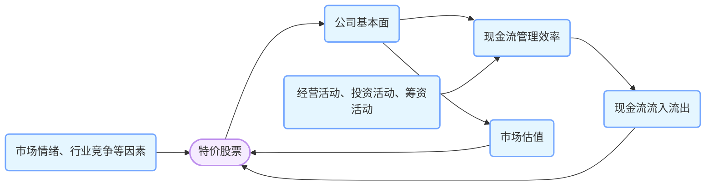

# 特价股票与公司现金流管理效率的关系

> 关键词：特价股票、公司现金流管理效率、财务分析、投资决策、市场估值

> 摘要：本文旨在深入探讨特价股票与公司现金流管理效率之间的内在联系。通过对相关核心概念的阐述、算法原理的剖析、数学模型的构建以及实际案例的分析，揭示特价股票的形成机制与公司现金流管理效率的相互影响。同时，介绍了在研究和实践中可使用的工具和资源，对未来发展趋势和挑战进行了总结，并提供了常见问题的解答和扩展阅读资料，为投资者和企业管理者在投资决策和财务管理方面提供有价值的参考。

## 1. 背景介绍 
### 1.1 目的和范围
本研究的主要目的是全面且深入地探究特价股票与公司现金流管理效率之间的关系。在金融市场中，特价股票往往吸引着众多投资者的目光，但其背后的影响因素错综复杂。公司的现金流管理效率作为企业财务健康的重要指标，对股票价格和市场估值有着潜在的影响。通过本研究，我们希望揭示两者之间的内在联系，为投资者提供更准确的投资决策依据，同时也为企业管理者优化现金流管理提供参考。

研究范围涵盖了不同行业、不同规模的上市公司。我们将分析这些公司的财务报表、股票市场数据，以验证特价股票与现金流管理效率之间的关系，并探讨这种关系在不同市场环境下的变化。

### 1.2 预期读者
本文的预期读者主要包括以下几类人群：
- **投资者**：无论是个人投资者还是机构投资者，都希望通过了解特价股票与公司现金流管理效率的关系，提高投资决策的准确性和成功率，寻找具有潜在价值的投资机会。
- **企业管理者**：企业管理者可以从本文中了解到现金流管理效率对公司股票价格和市场形象的影响，从而优化企业的现金流管理策略，提升企业的财务健康状况和市场竞争力。
- **金融研究人员**：金融研究人员可以将本文作为进一步研究的参考，深入探讨金融市场中股票价格与企业财务指标之间的关系，推动金融理论的发展。

### 1.3 文档结构概述
本文将按照以下结构进行阐述：
- **核心概念与联系**：介绍特价股票和公司现金流管理效率的核心概念，分析两者之间的内在联系，并通过文本示意图和 Mermaid 流程图进行直观展示。
- **核心算法原理 & 具体操作步骤**：阐述用于评估特价股票和公司现金流管理效率的核心算法原理，并使用 Python 源代码详细说明具体的操作步骤。
- **数学模型和公式 & 详细讲解 & 举例说明**：构建数学模型和公式来描述特价股票与公司现金流管理效率之间的关系，并通过具体的例子进行详细讲解。
- **项目实战：代码实际案例和详细解释说明**：通过实际的项目案例，展示如何使用 Python 代码进行特价股票和公司现金流管理效率的分析，并对代码进行详细解读。
- **实际应用场景**：探讨特价股票与公司现金流管理效率的关系在实际投资和企业管理中的应用场景。
- **工具和资源推荐**：推荐在研究和实践中可使用的学习资源、开发工具框架以及相关的论文著作。
- **总结：未来发展趋势与挑战**：总结本文的研究成果，分析未来特价股票与公司现金流管理效率关系研究的发展趋势和面临的挑战。
- **附录：常见问题与解答**：解答读者在阅读本文过程中可能遇到的常见问题。
- **扩展阅读 & 参考资料**：提供与本文主题相关的扩展阅读资料和参考文献，方便读者进一步深入研究。

### 1.4 术语表
#### 1.4.1 核心术语定义
- **特价股票**：指在股票市场中，价格相对其内在价值被低估的股票。这种低估可能是由于市场情绪、行业竞争、公司短期业绩波动等多种因素导致的。
- **公司现金流管理效率**：是指公司在经营活动、投资活动和筹资活动中，对现金的流入和流出进行有效管理和控制的能力。它反映了公司资金的使用效率和财务健康状况。

#### 1.4.2 相关概念解释
- **内在价值**：股票的内在价值是指股票所代表的公司未来预期现金流的现值。它是基于公司的基本面分析，包括盈利能力、资产质量、市场竞争力等因素计算得出的。
- **现金流**：现金流是指企业在一定会计期间按照现金收付实现制，通过一定经济活动（包括经营活动、投资活动、筹资活动和非经常性项目）而产生的现金流入、现金流出及其总量情况的总称。

#### 1.4.3 缩略词列表
- **EPS**：Earnings Per Share，每股收益，是指普通股股东每持有一股所能享有的企业净利润或需承担的企业净亏损。
- **ROE**：Return on Equity，净资产收益率，是衡量公司运用自有资本的效率指标。
- **FCF**：Free Cash Flow，自由现金流，是指企业经营活动产生的现金流量扣除资本性支出后的余额。

## 2. 核心概念与联系 

### 特价股票的概念
特价股票通常是指那些市场价格低于其内在价值的股票。内在价值的评估是一个复杂的过程，需要考虑公司的财务状况、行业前景、市场竞争力等多个因素。一般来说，特价股票可能是由于市场对公司的短期负面信息反应过度，导致股票价格下跌，但公司的基本面并没有发生实质性的恶化。

### 公司现金流管理效率的概念
公司现金流管理效率反映了公司在现金的获取、使用和分配方面的能力。良好的现金流管理效率意味着公司能够及时、足额地获取现金，合理地安排资金的使用，确保公司的运营和发展。衡量公司现金流管理效率的指标包括自由现金流、现金周转率、经营活动现金流量净额等。

### 两者之间的联系
公司的现金流管理效率对特价股票的形成有着重要的影响。一方面，如果公司能够有效地管理现金流，保持充足的自由现金流，说明公司的经营状况良好，具有较强的抗风险能力。在市场情绪波动时，这类公司的股票价格可能相对稳定，即使出现短期下跌，也更容易被市场重新估值，从而形成特价股票的机会。另一方面，市场对公司现金流管理效率的预期也会影响股票价格。如果市场预期公司未来的现金流管理效率将提高，那么股票价格可能会提前反映这一预期，反之则可能导致股票价格下跌。

### 文本示意图
```plaintext
特价股票 <-- 公司基本面（包括现金流管理效率） --> 市场估值
|                                   |
|                                   |
| 市场情绪、行业竞争等因素          | 经营活动、投资活动、筹资活动
|                                   |
V                                   V
股票价格波动                        现金流流入流出
```

### Mermaid 流程图


## 3. 核心算法原理 & 具体操作步骤 

### 评估特价股票的算法原理
评估特价股票的一种常用方法是使用市盈率（P/E）、市净率（P/B）等指标与同行业公司进行比较。如果某只股票的 P/E 或 P/B 明显低于同行业平均水平，且公司的基本面没有明显问题，那么这只股票可能被低估，成为特价股票的候选。

以下是使用 Python 实现的计算 P/E 和 P/B 的代码示例：
```python
import pandas as pd

# 假设有一个包含股票数据的 DataFrame，包含 'price'（股价）、'earnings_per_share'（每股收益）和 'book_value_per_share'（每股账面价值）列
stock_data = pd.DataFrame({
    'price': [10, 20, 30],
    'earnings_per_share': [1, 2, 3],
    'book_value_per_share': [5, 10, 15]
})

# 计算 P/E 和 P/B
stock_data['P/E'] = stock_data['price'] / stock_data['earnings_per_share']
stock_data['P/B'] = stock_data['price'] / stock_data['book_value_per_share']

print(stock_data)
```
### 评估公司现金流管理效率的算法原理
评估公司现金流管理效率可以使用自由现金流（FCF）和现金周转率等指标。自由现金流是指企业经营活动产生的现金流量扣除资本性支出后的余额，反映了企业可以自由支配的现金量。现金周转率是指企业在一定时期内现金的周转次数，反映了企业现金的使用效率。

以下是使用 Python 实现的计算 FCF 和现金周转率的代码示例：
```python
# 假设有一个包含公司财务数据的 DataFrame，包含 'operating_cash_flow'（经营活动现金流量）、'capital_expenditure'（资本性支出）和 'total_assets'（总资产）列
financial_data = pd.DataFrame({
    'operating_cash_flow': [100, 200, 300],
    'capital_expenditure': [50, 100, 150],
    'total_assets': [500, 1000, 1500]
})

# 计算自由现金流
financial_data['FCF'] = financial_data['operating_cash_flow'] - financial_data['capital_expenditure']

# 计算现金周转率
financial_data['cash_turnover'] = financial_data['operating_cash_flow'] / financial_data['total_assets']

print(financial_data)
```

### 具体操作步骤
1. **数据收集**：收集目标公司的财务报表数据，包括利润表、资产负债表和现金流量表，以及同行业公司的相关数据。
2. **指标计算**：使用上述代码计算目标公司和同行业公司的 P/E、P/B、FCF 和现金周转率等指标。
3. **比较分析**：将目标公司的指标与同行业公司进行比较，判断目标公司的股票是否被低估，以及公司的现金流管理效率是否良好。
4. **综合评估**：结合公司的基本面、行业前景等因素，对目标公司的投资价值进行综合评估。

## 4. 数学模型和公式 & 详细讲解 & 举例说明 

### 市盈率（P/E）
市盈率是指股票价格与每股收益的比率，计算公式为：
$$P/E = \frac{Price}{EPS}$$
其中，$Price$ 为股票价格，$EPS$ 为每股收益。

市盈率反映了市场对公司盈利能力的预期。一般来说，市盈率越低，说明股票的估值越低，可能存在投资机会。例如，某公司的股票价格为 20 元，每股收益为 2 元，则该公司的市盈率为：
$$P/E = \frac{20}{2} = 10$$

### 市净率（P/B）
市净率是指股票价格与每股账面价值的比率，计算公式为：
$$P/B = \frac{Price}{Book\ Value\ per\ Share}$$
其中，$Price$ 为股票价格，$Book\ Value\ per\ Share$ 为每股账面价值。

市净率反映了市场对公司净资产的估值。一般来说，市净率越低，说明股票的估值越低，可能存在投资机会。例如，某公司的股票价格为 20 元，每股账面价值为 10 元，则该公司的市净率为：
$$P/B = \frac{20}{10} = 2$$

### 自由现金流（FCF）
自由现金流是指企业经营活动产生的现金流量扣除资本性支出后的余额，计算公式为：
$$FCF = Operating\ Cash\ Flow - Capital\ Expenditure$$
其中，$Operating\ Cash\ Flow$ 为经营活动现金流量，$Capital\ Expenditure$ 为资本性支出。

自由现金流反映了企业可以自由支配的现金量，是评估企业财务健康状况的重要指标。例如，某公司的经营活动现金流量为 100 万元，资本性支出为 50 万元，则该公司的自由现金流为：
$$FCF = 100 - 50 = 50$$（万元）

### 现金周转率
现金周转率是指企业在一定时期内现金的周转次数，计算公式为：
$$Cash\ Turnover = \frac{Operating\ Cash\ Flow}{Total\ Assets}$$
其中，$Operating\ Cash\ Flow$ 为经营活动现金流量，$Total\ Assets$ 为总资产。

现金周转率反映了企业现金的使用效率。一般来说，现金周转率越高，说明企业现金的使用效率越高。例如，某公司的经营活动现金流量为 100 万元，总资产为 500 万元，则该公司的现金周转率为：
$$Cash\ Turnover = \frac{100}{500} = 0.2$$

## 5. 项目实战：代码实际案例和详细解释说明 

### 5.1  开发环境搭建
为了完成本项目实战，我们需要搭建以下开发环境：
- **Python 环境**：建议使用 Python 3.7 及以上版本。
- **必要的库**：安装 `pandas`、`numpy` 等库，用于数据处理和分析。可以使用以下命令进行安装：
```sh
pip install pandas numpy
```

### 5.2  源代码详细实现和代码解读
以下是一个完整的 Python 代码示例，用于分析特价股票与公司现金流管理效率的关系：
```python
import pandas as pd
import numpy as np

# 模拟收集的股票数据
stock_data = pd.DataFrame({
    'stock_code': ['000001', '000002', '000003'],
    'price': [10, 20, 30],
    'earnings_per_share': [1, 2, 3],
    'book_value_per_share': [5, 10, 15],
    'operating_cash_flow': [100, 200, 300],
    'capital_expenditure': [50, 100, 150],
    'total_assets': [500, 1000, 1500]
})

# 计算 P/E 和 P/B
stock_data['P/E'] = stock_data['price'] / stock_data['earnings_per_share']
stock_data['P/B'] = stock_data['price'] / stock_data['book_value_per_share']

# 计算自由现金流
stock_data['FCF'] = stock_data['operating_cash_flow'] - stock_data['capital_expenditure']

# 计算现金周转率
stock_data['cash_turnover'] = stock_data['operating_cash_flow'] / stock_data['total_assets']

# 筛选特价股票（假设 P/E 低于行业平均 15，P/B 低于行业平均 2）
industry_avg_pe = 15
industry_avg_pb = 2
bargain_stocks = stock_data[(stock_data['P/E'] < industry_avg_pe) & (stock_data['P/B'] < industry_avg_pb)]

# 筛选现金流管理效率高的股票（假设 FCF 为正，现金周转率高于行业平均 0.1）
industry_avg_cash_turnover = 0.1
efficient_cash_flow_stocks = stock_data[(stock_data['FCF'] > 0) & (stock_data['cash_turnover'] > industry_avg_cash_turnover)]

# 找出既是特价股票又是现金流管理效率高的股票
target_stocks = pd.merge(bargain_stocks, efficient_cash_flow_stocks, how='inner')

print("特价股票：")
print(bargain_stocks)
print("现金流管理效率高的股票：")
print(efficient_cash_flow_stocks)
print("既是特价股票又是现金流管理效率高的股票：")
print(target_stocks)
```
### 代码解读与分析
1. **数据模拟**：使用 `pandas` 库创建一个包含股票数据的 DataFrame，模拟收集到的股票信息。
2. **指标计算**：计算 P/E、P/B、FCF 和现金周转率等指标，并将结果添加到 DataFrame 中。
3. **特价股票筛选**：根据行业平均 P/E 和 P/B 水平，筛选出 P/E 低于 15 且 P/B 低于 2 的股票作为特价股票。
4. **现金流管理效率高的股票筛选**：根据行业平均现金周转率和 FCF 为正的条件，筛选出 FCF 为正且现金周转率高于 0.1 的股票作为现金流管理效率高的股票。
5. **目标股票筛选**：使用 `pandas` 的 `merge` 函数找出既是特价股票又是现金流管理效率高的股票。

通过以上步骤，我们可以从模拟数据中筛选出具有投资价值的股票。

## 6. 实际应用场景 
### 投资决策
对于投资者来说，了解特价股票与公司现金流管理效率的关系可以帮助他们做出更明智的投资决策。投资者可以通过分析公司的现金流管理效率，筛选出那些基本面良好、现金流充足的公司，再结合股票的估值情况，寻找被低估的特价股票进行投资。这样可以降低投资风险，提高投资回报率。

### 企业财务管理
对于企业管理者来说，认识到现金流管理效率对公司股票价格的影响，可以促使他们更加重视现金流管理。通过优化企业的经营活动、投资活动和筹资活动，提高现金流管理效率，不仅可以增强企业的财务健康状况，还可以提升公司的市场形象，吸引更多的投资者，从而提高公司的股票价格。

### 金融研究
金融研究人员可以将特价股票与公司现金流管理效率的关系作为研究课题，深入探讨金融市场中股票价格与企业财务指标之间的内在联系。通过建立更精确的数学模型和实证研究，为金融理论的发展提供新的思路和方法。

## 7. 工具和资源推荐
### 7.1 学习资源推荐
#### 7.1.1 书籍推荐
- 《财务报表分析与证券定价》：这本书详细介绍了如何通过分析公司的财务报表来评估股票的价值，对于理解特价股票的评估方法和公司现金流管理效率的分析具有重要的参考价值。
- 《自由现金流的神话》：深入探讨了自由现金流在企业估值和投资决策中的应用，有助于读者更好地理解公司现金流管理效率的重要性。

#### 7.1.2 在线课程
- Coursera 上的“Financial Markets”课程：由耶鲁大学教授 Robert Shiller 主讲，涵盖了金融市场的基本原理、股票估值方法等内容，对于学习特价股票和公司现金流管理效率的相关知识非常有帮助。
- edX 上的“Corporate Finance”课程：提供了企业财务管理的全面知识，包括现金流管理、投资决策等方面的内容。

#### 7.1.3 技术博客和网站
- Seeking Alpha：一个专业的金融投资博客网站，提供了大量关于股票分析、公司财务分析的文章和研究报告。
- 雪球网：国内知名的财经社区，投资者可以在上面交流股票投资经验，获取公司的财务信息和市场动态。

### 7.2 开发工具框架推荐
#### 7.2.1 IDE和编辑器
- PyCharm：一款专业的 Python 集成开发环境，具有代码编辑、调试、版本控制等功能，适合进行数据分析和金融编程。
- Jupyter Notebook：一个交互式的编程环境，支持 Python、R 等多种编程语言，方便进行数据探索和可视化分析。

#### 7.2.2 调试和性能分析工具
- PDB：Python 自带的调试工具，可以帮助开发者定位代码中的错误和问题。
- cProfile：Python 的性能分析工具，可以分析代码的运行时间和函数调用情况，帮助优化代码性能。

#### 7.2.3 相关框架和库
- Pandas：一个强大的数据处理和分析库，提供了丰富的数据结构和函数，方便进行金融数据的处理和分析。
- Numpy：一个用于科学计算的 Python 库，提供了高效的数组操作和数学函数，对于金融数据分析和建模非常有用。

### 7.3 相关论文著作推荐
#### 7.3.1 经典论文
- “The Capital Asset Pricing Model: Theory and Evidence”：这篇论文提出了资本资产定价模型（CAPM），对于理解股票价格的形成机制和风险评估具有重要的理论意义。
- “Efficient Capital Markets: A Review of Theory and Empirical Work”：该论文对有效市场假说进行了全面的综述和分析，为金融市场的研究奠定了基础。

#### 7.3.2 最新研究成果
- “The Relationship between Free Cash Flow and Stock Returns: Evidence from Emerging Markets”：该研究探讨了新兴市场中自由现金流与股票回报率之间的关系，为投资者在新兴市场的投资决策提供了参考。
- “Cash Flow Management and Firm Valuation: A Structural Approach”：提出了一种基于结构模型的现金流管理和企业估值方法，对于深入理解公司现金流管理效率对企业价值的影响具有重要的意义。

#### 7.3.3 应用案例分析
- 《价值投资案例集》：收集了多个成功的价值投资案例，包括如何通过分析公司的现金流管理效率和股票估值来选择投资标的，对于投资者具有很强的实践指导意义。

## 8. 总结：未来发展趋势与挑战
### 未来发展趋势
- **数据驱动的投资决策**：随着金融科技的发展，越来越多的投资者将依靠大数据和人工智能技术来分析特价股票和公司现金流管理效率，实现更加精准的投资决策。
- **跨学科研究的兴起**：特价股票与公司现金流管理效率的研究将不再局限于金融领域，而是与会计学、经济学、管理学等多个学科进行交叉融合，形成更加全面和深入的研究成果。
- **国际市场的关注**：随着全球金融市场的一体化，投资者将更加关注国际市场上的特价股票和公司现金流管理效率，寻找跨国投资机会。

### 挑战
- **数据质量和可靠性**：金融数据的质量和可靠性是进行准确分析的基础，但数据的获取和清洗过程中可能存在误差和缺失值，影响分析结果的准确性。
- **市场的不确定性**：股票市场受到多种因素的影响，包括宏观经济环境、政策变化、市场情绪等，这些因素的不确定性增加了预测特价股票和公司现金流管理效率的难度。
- **技术的复杂性**：大数据和人工智能技术在金融分析中的应用需要具备较高的技术水平和专业知识，对于普通投资者和企业管理者来说，掌握这些技术存在一定的困难。

## 9. 附录：常见问题与解答
### 问题 1：如何判断一只股票是否为特价股票？
判断一只股票是否为特价股票需要综合考虑多个因素，包括市盈率、市净率、公司的基本面、行业前景等。一般来说，如果股票的市盈率和市净率明显低于同行业平均水平，且公司的财务状况良好、具有较强的竞争力，那么这只股票可能是特价股票。

### 问题 2：公司现金流管理效率对股票价格有多大的影响？
公司现金流管理效率对股票价格有着重要的影响。良好的现金流管理效率意味着公司能够及时、足额地获取现金，合理地安排资金的使用，这反映了公司的经营状况良好，具有较强的抗风险能力。市场通常会对这类公司给予较高的估值，从而推动股票价格上涨。反之，现金流管理效率低下的公司可能会面临资金短缺、偿债困难等问题，导致市场对其估值下降，股票价格下跌。

### 问题 3：如何提高公司的现金流管理效率？
提高公司的现金流管理效率可以从以下几个方面入手：
- **优化经营活动**：加强应收账款管理，缩短收款周期；合理控制库存水平，减少存货占用资金；优化采购流程，降低采购成本。
- **合理安排投资活动**：谨慎选择投资项目，确保投资项目具有良好的回报率；避免盲目扩张，控制投资规模。
- **优化筹资活动**：合理安排债务融资和股权融资的比例，降低融资成本；确保融资资金的及时到位和合理使用。

## 10. 扩展阅读 & 参考资料
### 扩展阅读
- 《聪明的投资者》：本杰明·格雷厄姆的经典著作，介绍了价值投资的理念和方法，对于理解特价股票的投资策略具有重要的启示作用。
- 《巴菲特致股东的信》：沃伦·巴菲特每年写给股东的信，包含了他对投资、企业管理等方面的深刻见解，对于学习如何分析公司的现金流管理效率和股票投资价值非常有帮助。

### 参考资料
- [1] Brealey, R. A., Myers, S. C., & Allen, F. (2020). Principles of Corporate Finance. McGraw-Hill Education.
- [2] Damodaran, A. (2012). The Little Book of Valuation: How to Value a Company, Pick a Stock and Profit. Wiley.
- [3] Fama, E. F., & French, K. R. (1992). The Cross-Section of Expected Stock Returns. The Journal of Finance, 47(2), 427-465.

作者：AI天才研究院/AI Genius Institute & 禅与计算机程序设计艺术 /Zen And The Art of Computer Programming