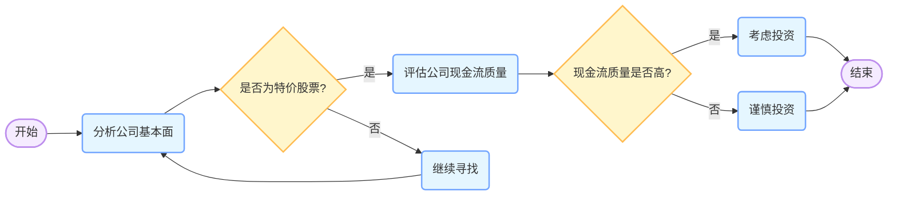

# 特价股票与公司现金流质量的关系

> 关键词：特价股票、公司现金流质量、财务分析、股票估值、投资决策

> 摘要：本文深入探讨了特价股票与公司现金流质量之间的关系。首先介绍了研究此关系的背景和目的，包括对投资者和市场分析的重要性。接着阐述了特价股票和公司现金流质量的核心概念及它们之间的联系，通过文本示意图和 Mermaid 流程图进行直观展示。详细讲解了分析两者关系的核心算法原理和具体操作步骤，并结合 Python 代码进行说明。运用数学模型和公式对相关概念进行量化分析，同时给出实际例子加深理解。通过项目实战，展示了如何搭建开发环境、实现源代码并对代码进行解读。探讨了该关系在实际投资中的应用场景，推荐了相关的学习资源、开发工具框架和论文著作。最后总结了未来发展趋势与挑战，并对常见问题进行了解答。

## 1. 背景介绍 
### 1.1 目的和范围
在股票投资领域，寻找具有投资价值的股票是投资者的核心目标之一。特价股票通常指那些价格相对其内在价值被低估的股票，这类股票往往吸引着投资者的关注，期望通过买入并持有获得超额收益。而公司的现金流质量则反映了公司在经营、投资和融资等活动中产生现金的能力和现金的健康状况，是衡量公司财务健康和可持续发展的重要指标。本研究的目的在于深入探究特价股票与公司现金流质量之间的内在联系，为投资者提供更全面、准确的投资决策依据。

研究范围涵盖了不同行业、不同规模的上市公司，通过对其财务报表数据的分析，揭示特价股票与公司现金流质量之间的普遍规律和特殊情况。同时，结合市场环境和宏观经济因素，探讨这些因素对两者关系的影响。

### 1.2 预期读者
本文的预期读者主要包括股票投资者，无论是个人投资者还是机构投资者，他们希望通过对特价股票和公司现金流质量的研究，提高投资决策的准确性和收益率。此外，金融分析师、财务顾问和相关研究人员也可以从本文中获取有价值的信息，用于深入的市场分析和学术研究。

### 1.3 文档结构概述
本文将按照以下结构进行阐述：首先介绍核心概念，包括特价股票和公司现金流质量的定义和相关联系；接着讲解分析两者关系的核心算法原理和具体操作步骤，并给出 Python 代码示例；然后通过数学模型和公式对相关概念进行量化分析，结合实际例子加深理解；通过项目实战展示如何运用这些方法进行实际分析；探讨该关系在实际投资中的应用场景；推荐相关的学习资源、开发工具框架和论文著作；最后总结未来发展趋势与挑战，并解答常见问题。

### 1.4 术语表
#### 1.4.1 核心术语定义
- **特价股票**：指股票价格相对其内在价值被低估的股票，通常表现为市盈率、市净率等估值指标低于同行业平均水平。
- **公司现金流质量**：指公司在经营、投资和融资等活动中产生现金的能力和现金的健康状况，包括现金流量的充足性、稳定性和持续性等方面。
- **自由现金流**：指公司经营活动产生的现金流量扣除资本性支出后的余额，反映了公司可自由支配的现金量。
- **市盈率（P/E）**：指股票价格与每股收益的比率，用于衡量股票的估值水平。
- **市净率（P/B）**：指股票价格与每股净资产的比率，用于衡量股票的估值水平。

#### 1.4.2 相关概念解释
- **内在价值**：指股票的真实价值，通常通过对公司的财务状况、盈利能力、发展前景等因素进行综合分析得出。
- **现金流量表**：反映公司在一定会计期间内现金和现金等价物流入和流出的报表，是分析公司现金流质量的重要依据。
- **经营活动现金流量**：指公司在日常经营活动中产生的现金流量，包括销售商品、提供劳务收到的现金，购买商品、接受劳务支付的现金等。
- **投资活动现金流量**：指公司在投资活动中产生的现金流量，包括购建固定资产、无形资产和其他长期资产支付的现金，处置固定资产、无形资产和其他长期资产收回的现金等。
- **融资活动现金流量**：指公司在融资活动中产生的现金流量，包括吸收投资收到的现金，偿还债务支付的现金等。

#### 1.4.3 缩略词列表
- **P/E**：市盈率（Price-to-Earnings Ratio）
- **P/B**：市净率（Price-to-Book Ratio）
- **FCF**：自由现金流（Free Cash Flow）
- **CFO**：经营活动现金流量（Cash Flow from Operations）

## 2. 核心概念与联系 
### 核心概念原理
#### 特价股票
特价股票的概念基于股票的估值理论。股票的价值取决于公司的未来盈利能力和现金流量，当市场对公司的预期过于悲观，导致股票价格低于其内在价值时，就会出现特价股票。投资者通过分析公司的基本面和市场情况，寻找那些被低估的股票，以期在未来获得价格回归价值的收益。

#### 公司现金流质量
公司现金流质量反映了公司的财务健康状况和经营效率。高质量的现金流意味着公司能够稳定地产生现金，具有较强的偿债能力和再投资能力，能够应对市场风险和不确定性。现金流质量可以从多个方面进行评估，如经营活动现金流量的充足性、自由现金流的稳定性等。

### 两者联系
特价股票与公司现金流质量之间存在着密切的联系。一方面，公司现金流质量是评估股票内在价值的重要因素之一。如果公司的现金流质量较高，说明公司的经营状况良好，未来盈利能力较强，其股票的内在价值也会相应提高。在市场效率不高的情况下，可能会出现股票价格低于其内在价值的情况，从而形成特价股票。

另一方面，特价股票的出现也可能与公司现金流质量的短期波动或市场误解有关。例如，公司可能由于季节性因素、临时性投资等原因导致某一时期的现金流表现不佳，但市场过度反应，将股票价格压低。此时，投资者如果能够准确判断公司现金流质量的真实情况，就有可能发现特价股票。

### 文本示意图
```plaintext
特价股票 <-- 估值低于内在价值 --> 公司基本面分析 <-- 包含 --> 公司现金流质量分析
公司现金流质量 <-- 影响 --> 公司内在价值 <-- 决定 --> 股票合理价格
```

### Mermaid 流程图


## 3. 核心算法原理 & 具体操作步骤 
### 核心算法原理
分析特价股票与公司现金流质量的关系，主要基于以下几个方面的算法：

#### 股票估值算法
常用的股票估值方法有市盈率法、市净率法和现金流折现法等。这里以现金流折现法为例，其基本原理是将公司未来的自由现金流折现到当前，得到公司的内在价值。公式如下：

$$V = \sum_{t=1}^{n} \frac{FCF_t}{(1 + r)^t}$$

其中，$V$ 表示公司的内在价值，$FCF_t$ 表示第 $t$ 期的自由现金流，$r$ 表示折现率，$n$ 表示预测期数。

#### 现金流质量评估算法
评估公司现金流质量可以从多个指标入手，如经营活动现金流量与净利润的比率、自由现金流的稳定性等。以下是一些常用的指标和算法：

- **经营活动现金流量与净利润的比率**：该比率反映了公司净利润的现金实现程度。公式如下：

$$CFO\_to\_NI = \frac{CFO}{NI}$$

其中，$CFO\_to\_NI$ 表示经营活动现金流量与净利润的比率，$CFO$ 表示经营活动现金流量，$NI$ 表示净利润。

- **自由现金流的稳定性**：可以通过计算自由现金流的标准差来评估其稳定性。标准差越小，说明自由现金流越稳定。

### 具体操作步骤
#### 数据收集
收集公司的财务报表数据，包括资产负债表、利润表和现金流量表，以及市场数据，如股票价格、行业平均估值指标等。

#### 股票估值计算
根据收集到的数据，运用现金流折现法等估值方法计算公司的内在价值。

#### 现金流质量评估
计算经营活动现金流量与净利润的比率、自由现金流的标准差等指标，评估公司的现金流质量。

#### 特价股票筛选
比较股票的市场价格与内在价值，如果市场价格低于内在价值，且公司的现金流质量较高，则认为该股票是特价股票。

### Python 源代码实现
```python
import pandas as pd
import numpy as np

# 假设已经收集到了公司的财务数据，存储在 DataFrame 中
# 数据包含列：'CFO'（经营活动现金流量）、'NI'（净利润）、'FCF'（自由现金流）
financial_data = pd.DataFrame({
    'CFO': [100, 120, 130, 150, 160],
    'NI': [80, 90, 100, 110, 120],
    'FCF': [50, 60, 70, 80, 90]
})

# 计算经营活动现金流量与净利润的比率
financial_data['CFO_to_NI'] = financial_data['CFO'] / financial_data['NI']

# 计算自由现金流的标准差
fcf_std = financial_data['FCF'].std()

# 假设已经计算出公司的内在价值和市场价格
intrinsic_value = 100
market_price = 80

# 判断是否为特价股票
if market_price < intrinsic_value and fcf_std < 10 and financial_data['CFO_to_NI'].mean() > 1:
    print("该股票是特价股票")
else:
    print("该股票不是特价股票")
```

## 4. 数学模型和公式 & 详细讲解 & 举例说明 
### 股票估值模型
#### 现金流折现法
现金流折现法是一种基于未来现金流量的股票估值方法，其核心思想是将公司未来的自由现金流折现到当前，得到公司的内在价值。公式如下：

$$V = \sum_{t=1}^{n} \frac{FCF_t}{(1 + r)^t}$$

其中，$V$ 表示公司的内在价值，$FCF_t$ 表示第 $t$ 期的自由现金流，$r$ 表示折现率，$n$ 表示预测期数。

**详细讲解**：
- **自由现金流（$FCF_t$）**：自由现金流是公司经营活动产生的现金流量扣除资本性支出后的余额，反映了公司可自由支配的现金量。预测自由现金流需要对公司的经营状况、市场环境等因素进行分析和预测。
- **折现率（$r$）**：折现率反映了投资者对投资风险的预期，通常采用加权平均资本成本（WACC）作为折现率。WACC 的计算公式如下：

$$WACC = w_d \times r_d \times (1 - T) + w_e \times r_e$$

其中，$w_d$ 和 $w_e$ 分别表示债务资本和权益资本的权重，$r_d$ 表示债务资本成本，$r_e$ 表示权益资本成本，$T$ 表示所得税税率。

- **预测期数（$n$）**：预测期数通常根据公司的发展阶段和行业特点来确定。一般来说，对于处于稳定发展阶段的公司，可以预测 5 - 10 年的自由现金流；对于处于成长阶段的公司，可以适当延长预测期数。

**举例说明**：
假设某公司未来 5 年的自由现金流分别为 100 万元、120 万元、130 万元、150 万元和 160 万元，折现率为 10%。则该公司的内在价值为：

$$V = \frac{100}{(1 + 0.1)^1} + \frac{120}{(1 + 0.1)^2} + \frac{130}{(1 + 0.1)^3} + \frac{150}{(1 + 0.1)^4} + \frac{160}{(1 + 0.1)^5} \approx 523.64 \text{万元}$$

### 现金流质量评估模型
#### 经营活动现金流量与净利润的比率
该比率反映了公司净利润的现金实现程度。公式如下：

$$CFO\_to\_NI = \frac{CFO}{NI}$$

其中，$CFO\_to\_NI$ 表示经营活动现金流量与净利润的比率，$CFO$ 表示经营活动现金流量，$NI$ 表示净利润。

**详细讲解**：
- 当 $CFO\_to\_NI > 1$ 时，说明公司的净利润有足够的现金支撑，现金流质量较高；
- 当 $CFO\_to\_NI < 1$ 时，说明公司的净利润可能存在应收账款、存货等非现金项目的增加，现金流质量较低。

**举例说明**：
假设某公司某一年度的经营活动现金流量为 100 万元，净利润为 80 万元。则该公司的经营活动现金流量与净利润的比率为：

$$CFO\_to\_NI = \frac{100}{80} = 1.25$$

由于 $CFO\_to\_NI > 1$，说明该公司的净利润有足够的现金支撑，现金流质量较高。

#### 自由现金流的稳定性
可以通过计算自由现金流的标准差来评估其稳定性。标准差越小，说明自由现金流越稳定。公式如下：

$$\sigma_{FCF} = \sqrt{\frac{1}{n} \sum_{i=1}^{n} (FCF_i - \overline{FCF})^2}$$

其中，$\sigma_{FCF}$ 表示自由现金流的标准差，$FCF_i$ 表示第 $i$ 期的自由现金流，$\overline{FCF}$ 表示自由现金流的平均值，$n$ 表示样本数量。

**详细讲解**：
- 自由现金流的稳定性反映了公司经营活动的稳定性和抗风险能力。如果自由现金流的标准差较小，说明公司的经营活动比较稳定，能够持续产生稳定的现金流量；如果自由现金流的标准差较大，说明公司的经营活动存在较大的不确定性，现金流量波动较大。

**举例说明**：
假设某公司过去 5 年的自由现金流分别为 50 万元、60 万元、70 万元、80 万元和 90 万元。则该公司自由现金流的平均值为：

$$\overline{FCF} = \frac{50 + 60 + 70 + 80 + 90}{5} = 70 \text{万元}$$

自由现金流的标准差为：

$$\sigma_{FCF} = \sqrt{\frac{(50 - 70)^2 + (60 - 70)^2 + (70 - 70)^2 + (80 - 70)^2 + (90 - 70)^2}{5}} \approx 14.14 \text{万元}$$

通过计算自由现金流的标准差，可以评估该公司自由现金流的稳定性。

## 5. 项目实战：代码实际案例和详细解释说明 
### 5.1  开发环境搭建
#### 安装 Python
首先需要安装 Python 环境，建议使用 Python 3.7 及以上版本。可以从 Python 官方网站（https://www.python.org/downloads/）下载并安装。

#### 安装必要的库
使用以下命令安装必要的 Python 库：

```sh
pip install pandas numpy matplotlib
```

- **pandas**：用于数据处理和分析。
- **numpy**：用于数值计算。
- **matplotlib**：用于数据可视化。

### 5.2  源代码详细实现和代码解读
```python
import pandas as pd
import numpy as np
import matplotlib.pyplot as plt

# 读取财务数据文件，假设数据文件为 CSV 格式
financial_data = pd.read_csv('financial_data.csv')

# 计算经营活动现金流量与净利润的比率
financial_data['CFO_to_NI'] = financial_data['CFO'] / financial_data['NI']

# 计算自由现金流的标准差
fcf_std = financial_data['FCF'].std()

# 计算公司的内在价值（简化示例，假设使用固定的折现率和预测期数）
r = 0.1  # 折现率
n = 5    # 预测期数
fcfs = financial_data['FCF'].values[-n:]
intrinsic_value = np.sum([fcf / (1 + r) ** (i + 1) for i, fcf in enumerate(fcfs)])

# 假设市场价格为 80
market_price = 80

# 判断是否为特价股票
if market_price < intrinsic_value and fcf_std < 10 and financial_data['CFO_to_NI'].mean() > 1:
    print("该股票是特价股票")
else:
    print("该股票不是特价股票")

# 数据可视化
plt.figure(figsize=(10, 6))
plt.plot(financial_data['Year'], financial_data['CFO'], label='经营活动现金流量')
plt.plot(financial_data['Year'], financial_data['NI'], label='净利润')
plt.xlabel('年份')
plt.ylabel('金额（万元）')
plt.title('经营活动现金流量与净利润对比')
plt.legend()
plt.show()
```

### 代码解读与分析
#### 数据读取
```python
financial_data = pd.read_csv('financial_data.csv')
```
使用 `pandas` 库的 `read_csv` 函数读取财务数据文件，将数据存储在 `DataFrame` 中。

#### 现金流质量评估
```python
financial_data['CFO_to_NI'] = financial_data['CFO'] / financial_data['NI']
fcf_std = financial_data['FCF'].std()
```
计算经营活动现金流量与净利润的比率，并计算自由现金流的标准差，用于评估公司的现金流质量。

#### 股票估值
```python
r = 0.1  # 折现率
n = 5    # 预测期数
fcfs = financial_data['FCF'].values[-n:]
intrinsic_value = np.sum([fcf / (1 + r) ** (i + 1) for i, fcf in enumerate(fcfs)])
```
使用现金流折现法计算公司的内在价值，这里简化了计算过程，假设使用固定的折现率和预测期数。

#### 特价股票判断
```python
if market_price < intrinsic_value and fcf_std < 10 and financial_data['CFO_to_NI'].mean() > 1:
    print("该股票是特价股票")
else:
    print("该股票不是特价股票")
```
根据股票的市场价格、内在价值和现金流质量指标判断该股票是否为特价股票。

#### 数据可视化
```python
plt.figure(figsize=(10, 6))
plt.plot(financial_data['Year'], financial_data['CFO'], label='经营活动现金流量')
plt.plot(financial_data['Year'], financial_data['NI'], label='净利润')
plt.xlabel('年份')
plt.ylabel('金额（万元）')
plt.title('经营活动现金流量与净利润对比')
plt.legend()
plt.show()
```
使用 `matplotlib` 库绘制经营活动现金流量和净利润的对比图，直观展示公司的财务状况。

## 6. 实际应用场景 
### 股票投资决策
投资者可以通过分析特价股票与公司现金流质量的关系，筛选出具有投资价值的股票。当发现某只股票价格被低估，且公司的现金流质量较高时，可以考虑买入该股票，等待价格回归价值，获取投资收益。

### 风险评估
公司现金流质量的好坏直接影响其偿债能力和再投资能力。通过分析现金流质量，可以评估公司面临的财务风险。如果公司的现金流质量较差，可能存在偿债困难、资金链断裂等风险，投资者应谨慎投资。

### 行业比较分析
不同行业的公司现金流质量存在差异。通过比较不同行业公司的现金流质量和股票估值水平，可以发现行业之间的投资机会。例如，某些行业由于行业特点，现金流质量普遍较高，但股票估值较低，可能存在投资价值。

### 公司财务分析
公司管理层可以通过分析自身的现金流质量和股票估值情况，了解公司在市场中的地位和价值。如果公司的股票价格被低估，且现金流质量较高，可以考虑采取一些措施，如回购股票、加强市场宣传等，提升公司的市场形象和股票价格。

## 7. 工具和资源推荐
### 7.1 学习资源推荐
#### 7.1.1 书籍推荐
- 《财务报表分析与证券定价》：全面介绍了财务报表分析的方法和技术，以及如何运用财务报表数据进行证券定价。
- 《聪明的投资者》：价值投资领域的经典著作，介绍了如何寻找被低估的股票，以及如何进行投资决策。
- 《巴菲特致股东的信：股份公司教程》：包含了巴菲特对公司财务、投资等方面的深刻见解，是学习价值投资的重要参考书籍。

#### 7.1.2 在线课程
- Coursera 上的“财务分析与决策”课程：由知名教授授课，系统介绍了财务分析的基本概念和方法。
- 网易云课堂上的“股票投资实战课程”：结合实际案例，讲解股票投资的策略和技巧。

#### 7.1.3 技术博客和网站
- 雪球网：国内知名的投资交流社区，提供股票分析、投资策略等方面的内容。
- 东方财富网：提供丰富的财经数据和资讯，是投资者获取信息的重要渠道。

### 7.2 开发工具框架推荐
#### 7.2.1 IDE和编辑器
- PyCharm：功能强大的 Python 集成开发环境，提供代码编辑、调试、版本控制等功能。
- Jupyter Notebook：交互式编程环境，适合进行数据探索和分析。

#### 7.2.2 调试和性能分析工具
- PDB：Python 自带的调试工具，用于调试 Python 代码。
- cProfile：Python 自带的性能分析工具，用于分析代码的性能瓶颈。

#### 7.2.3 相关框架和库
- Pandas：用于数据处理和分析，提供了丰富的数据结构和函数。
- Numpy：用于数值计算，提供了高效的数组操作和数学函数。
- Matplotlib：用于数据可视化，提供了多种绘图功能。

### 7.3 相关论文著作推荐
#### 7.3.1 经典论文
- Fama, E. F., & French, K. R. (1992). The cross-section of expected stock returns. Journal of Finance, 47(2), 427-465.
- Ohlson, J. A. (1995). Earnings, book values, and dividends in equity valuation. Contemporary Accounting Research, 11(2), 661-687.

#### 7.3.2 最新研究成果
可以通过学术数据库，如知网、万方、Web of Science 等，搜索关于特价股票和公司现金流质量的最新研究成果。

#### 7.3.3 应用案例分析
一些金融研究机构和咨询公司会发布关于股票投资和财务分析的应用案例报告，可以关注这些报告，学习实际应用中的分析方法和技巧。

## 8. 总结：未来发展趋势与挑战
### 未来发展趋势
#### 数据驱动的投资决策
随着金融科技的发展，越来越多的投资者将采用数据驱动的方法进行投资决策。通过收集和分析大量的财务数据、市场数据和非财务数据，运用机器学习和人工智能算法，挖掘特价股票与公司现金流质量之间的潜在关系，提高投资决策的准确性和效率。

#### 多维度分析
未来的研究将不仅仅局限于财务数据的分析，还将结合宏观经济因素、行业发展趋势、公司治理等多维度信息，全面评估公司的价值和风险。例如，考虑宏观经济周期对公司现金流的影响，以及公司治理结构对现金流质量的作用。

#### 跨境投资分析
随着全球经济一体化的发展，跨境投资将越来越普遍。投资者需要考虑不同国家和地区的会计制度、税收政策、市场环境等因素，对跨境公司的现金流质量和股票估值进行分析。

### 挑战
#### 数据质量和可靠性
财务数据的质量和可靠性是分析特价股票与公司现金流质量关系的基础。然而，由于会计政策的选择、财务造假等原因，财务数据可能存在误差和偏差。投资者需要具备一定的财务分析能力，对数据进行甄别和调整。

#### 市场不确定性
股票市场受到多种因素的影响，如宏观经济政策、行业竞争、突发事件等，市场价格波动较大，难以准确预测。即使公司的现金流质量较高，股票价格也可能受到市场情绪的影响而下跌。

#### 模型的局限性
目前的股票估值模型和现金流质量评估模型都存在一定的局限性。例如，现金流折现法需要对未来的现金流量和折现率进行预测，预测的准确性直接影响估值结果。投资者需要结合多种模型和方法，进行综合分析。

## 9. 附录：常见问题与解答
### 问题 1：如何确定股票的内在价值？
解答：确定股票的内在价值可以采用多种方法，如现金流折现法、市盈率法、市净率法等。现金流折现法是一种较为常用的方法，需要预测公司未来的自由现金流，并选择合适的折现率进行折现。市盈率法和市净率法是相对简单的方法，通过比较公司的市盈率和市净率与同行业平均水平，来评估股票的估值水平。

### 问题 2：经营活动现金流量与净利润的比率小于 1 一定意味着公司现金流质量差吗？
解答：不一定。经营活动现金流量与净利润的比率小于 1 可能是由于应收账款、存货等非现金项目的增加，但这并不一定意味着公司现金流质量差。例如，公司可能处于快速扩张阶段，需要增加应收账款和存货来满足市场需求。投资者需要结合公司的业务模式、行业特点等因素进行综合分析。

### 问题 3：如何选择合适的折现率？
解答：折现率反映了投资者对投资风险的预期，通常采用加权平均资本成本（WACC）作为折现率。WACC 的计算需要考虑债务资本成本、权益资本成本、债务资本和权益资本的权重等因素。投资者可以参考同行业公司的 WACC 水平，结合公司的具体情况进行调整。

### 问题 4：特价股票一定具有投资价值吗？
解答：不一定。特价股票只是价格相对其内在价值被低估，但并不意味着其一定具有投资价值。投资者还需要考虑公司的基本面、现金流质量、行业前景等因素。如果公司的现金流质量较差，未来盈利能力不确定，即使股票价格被低估，也可能存在投资风险。

## 10. 扩展阅读 & 参考资料
- 本杰明·格雷厄姆. 《证券分析》. 海南出版社.
- 菲利普·费雪. 《怎样选择成长股》. 地震出版社.
- 中国证券监督管理委员会官方网站.
- 上海证券交易所官方网站.
- 深圳证券交易所官方网站.

作者：AI天才研究院/AI Genius Institute & 禅与计算机程序设计艺术 /Zen And The Art of Computer Programming