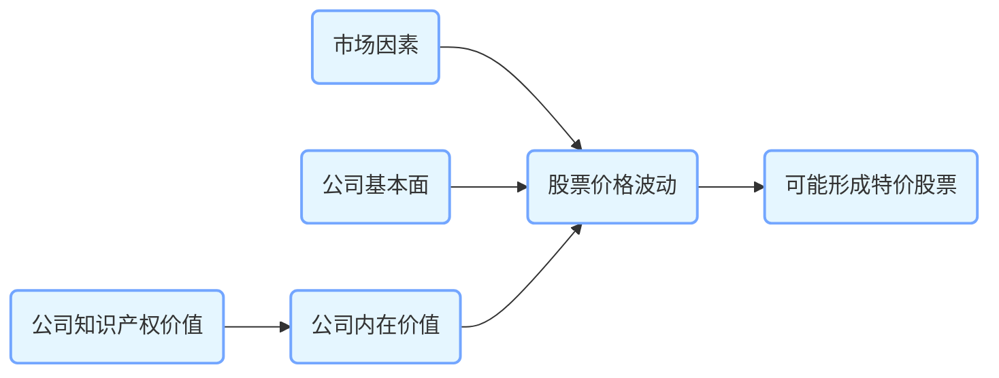

# 特价股票与公司知识产权价值的关联性研究

> 关键词：特价股票、公司知识产权价值、关联性、股票估值、知识产权评估

> 摘要：本文旨在深入研究特价股票与公司知识产权价值之间的关联性。通过对相关核心概念的阐述、算法原理的剖析、数学模型的构建以及实际案例的分析，揭示特价股票的形成机制与公司知识产权价值的内在联系。同时探讨了这种关联性在实际应用场景中的表现，为投资者和企业管理者提供决策依据，最后对未来发展趋势与挑战进行了展望。

## 1. 背景介绍 
### 1.1 目的和范围
本研究的目的在于探究特价股票与公司知识产权价值之间的潜在关系。在当今资本市场中，股票价格受到多种因素的影响，而公司的知识产权作为一种重要的无形资产，其价值可能对股票价格产生重要作用。研究范围涵盖了不同行业、不同规模的上市公司，通过对其股票价格走势和知识产权状况的分析，挖掘两者之间的关联性。

### 1.2 预期读者
本文预期读者包括投资者、金融分析师、企业管理者、知识产权专家以及对资本市场和知识产权领域感兴趣的研究人员。投资者可以通过了解这种关联性，更好地进行股票投资决策；金融分析师能够在进行股票估值时考虑知识产权因素；企业管理者可以认识到知识产权对公司市值的重要性，从而加强知识产权管理；知识产权专家可以从资本市场的角度审视知识产权的价值；研究人员则可以在此基础上进行更深入的学术研究。

### 1.3 文档结构概述
本文首先介绍相关背景信息，包括目的、预期读者和文档结构等。接着阐述核心概念与联系，明确特价股票和公司知识产权价值的定义及它们之间的关系。然后详细讲解核心算法原理和具体操作步骤，通过 Python 代码实现相关计算。再介绍数学模型和公式，并举例说明。之后通过项目实战，给出代码实际案例和详细解释。随后探讨实际应用场景，为读者展示这种关联性在现实中的应用。接着推荐相关工具和资源，方便读者进一步学习和研究。最后进行总结，展望未来发展趋势与挑战，并提供常见问题与解答以及扩展阅读和参考资料。

### 1.4 术语表
#### 1.4.1 核心术语定义
- **特价股票**：指股票价格相对其内在价值被低估的股票。这种低估可能是由于市场短期情绪、行业竞争、公司短期业绩波动等多种因素导致的。
- **公司知识产权价值**：公司所拥有的知识产权（如专利、商标、著作权等）的经济价值。它反映了知识产权为公司带来未来经济利益的能力。

#### 1.4.2 相关概念解释
- **股票内在价值**：是指股票未来现金流的现值。它是基于公司的基本面、盈利能力、成长潜力等因素进行评估的。
- **知识产权评估**：是指专业评估机构运用一定的方法和程序，对知识产权的价值进行评估的过程。

#### 1.4.3 缩略词列表
- **DCF**：Discounted Cash Flow，折现现金流法，一种用于评估资产价值的方法。
- **ROI**：Return on Investment，投资回报率，衡量投资收益的指标。

## 2. 核心概念与联系 

### 2.1 特价股票的形成机制
特价股票的形成往往是多种因素共同作用的结果。从市场层面来看，投资者的情绪波动可能导致股票价格短期内偏离其内在价值。例如，当市场整体处于悲观情绪时，即使公司基本面良好，其股票价格也可能被过度压低。从公司层面来看，短期的业绩下滑、负面新闻等也可能导致股票价格下跌。此外，行业竞争的加剧、宏观经济环境的变化等因素也会对股票价格产生影响。

### 2.2 公司知识产权价值的评估
公司知识产权价值的评估是一个复杂的过程。常见的评估方法包括成本法、市场法和收益法。成本法是基于开发知识产权所投入的成本来评估其价值；市场法是通过比较类似知识产权的市场交易价格来确定其价值；收益法是基于知识产权未来能为公司带来的收益来评估其价值。

### 2.3 特价股票与公司知识产权价值的联系
公司的知识产权价值可能是影响股票价格的重要因素之一。当公司拥有高价值的知识产权，但市场尚未充分认识到其价值时，股票价格可能被低估，从而形成特价股票。例如，一家公司拥有一项具有巨大商业潜力的专利，但由于市场对该技术的前景存在疑虑，股票价格可能没有反映出该专利的价值。另一方面，公司的知识产权价值也可能受到股票价格的影响。如果股票价格持续低迷，可能会影响公司的融资能力和市场形象，进而影响公司对知识产权的投入和管理。

### 2.4 文本示意图
特价股票与公司知识产权价值的关系可以用以下文本示意图表示：

市场因素（投资者情绪、宏观经济环境等） -> 股票价格波动 -> 可能形成特价股票
公司基本面（业绩、负面新闻等） -> 股票价格波动 -> 可能形成特价股票
公司知识产权价值（专利、商标等） -> 影响公司内在价值 -> 与股票价格相关

### 2.5 Mermaid 流程图


## 3. 核心算法原理 & 具体操作步骤 

### 3.1 股票内在价值评估算法 - 折现现金流法（DCF）
折现现金流法是一种常用的评估股票内在价值的方法。其基本原理是将公司未来的现金流折现到当前时刻，从而得到公司的内在价值。具体步骤如下：

1. **预测未来现金流**：根据公司的历史财务数据和行业发展趋势，预测公司未来若干年的自由现金流。
2. **确定折现率**：折现率反映了投资者对投资风险的预期。通常可以使用加权平均资本成本（WACC）作为折现率。
3. **计算现值**：将预测的未来现金流按照折现率折现到当前时刻，得到公司的内在价值。

### 3.2 Python 代码实现
```python
import numpy as np

def dcf_valuation(free_cash_flows, discount_rate, terminal_growth_rate):
    """
    折现现金流法计算股票内在价值
    :param free_cash_flows: 未来若干年的自由现金流列表
    :param discount_rate: 折现率
    :param terminal_growth_rate: 永续增长率
    :return: 股票内在价值
    """
    n = len(free_cash_flows)
    present_values = []
    for i in range(n):
        pv = free_cash_flows[i] / (1 + discount_rate) ** (i + 1)
        present_values.append(pv)
    
    # 计算终值
    terminal_value = free_cash_flows[-1] * (1 + terminal_growth_rate) / (discount_rate - terminal_growth_rate)
    terminal_pv = terminal_value / (1 + discount_rate) ** n
    
    # 计算内在价值
    intrinsic_value = sum(present_values) + terminal_pv
    return intrinsic_value

# 示例数据
free_cash_flows = [100, 120, 140, 160, 180]
discount_rate = 0.1
terminal_growth_rate = 0.03

intrinsic_value = dcf_valuation(free_cash_flows, discount_rate, terminal_growth_rate)
print(f"股票内在价值: {intrinsic_value}")
```

### 3.3 知识产权价值评估算法 - 收益法
收益法是基于知识产权未来能为公司带来的收益来评估其价值。具体步骤如下：

1. **预测知识产权未来收益**：根据知识产权的技术特点、市场需求等因素，预测其未来若干年的收益。
2. **确定折现率**：与股票内在价值评估中的折现率类似，反映了投资知识产权的风险。
3. **计算现值**：将预测的未来收益按照折现率折现到当前时刻，得到知识产权的价值。

### 3.4 Python 代码实现
```python
def ip_value_evaluation(ip_earnings, discount_rate, terminal_growth_rate):
    """
    收益法计算知识产权价值
    :param ip_earnings: 知识产权未来若干年的收益列表
    :param discount_rate: 折现率
    :param terminal_growth_rate: 永续增长率
    :return: 知识产权价值
    """
    n = len(ip_earnings)
    present_values = []
    for i in range(n):
        pv = ip_earnings[i] / (1 + discount_rate) ** (i + 1)
        present_values.append(pv)
    
    # 计算终值
    terminal_value = ip_earnings[-1] * (1 + terminal_growth_rate) / (discount_rate - terminal_growth_rate)
    terminal_pv = terminal_value / (1 + discount_rate) ** n
    
    # 计算知识产权价值
    ip_value = sum(present_values) + terminal_pv
    return ip_value

# 示例数据
ip_earnings = [50, 60, 70, 80, 90]
discount_rate = 0.1
terminal_growth_rate = 0.03

ip_value = ip_value_evaluation(ip_earnings, discount_rate, terminal_growth_rate)
print(f"知识产权价值: {ip_value}")
```

## 4. 数学模型和公式 & 详细讲解 & 举例说明 

### 4.1 折现现金流法（DCF）数学模型
折现现金流法的数学模型可以表示为：

$$V = \sum_{t=1}^{n} \frac{FCF_t}{(1 + r)^t} + \frac{FCF_n \times (1 + g)}{(r - g) \times (1 + r)^n}$$

其中：
- $V$ 表示股票内在价值
- $FCF_t$ 表示第 $t$ 年的自由现金流
- $r$ 表示折现率
- $g$ 表示永续增长率
- $n$ 表示预测期数

### 4.2 详细讲解
公式的前半部分 $\sum_{t=1}^{n} \frac{FCF_t}{(1 + r)^t}$ 是将预测期内的自由现金流折现到当前时刻的总和。后半部分 $\frac{FCF_n \times (1 + g)}{(r - g) \times (1 + r)^n}$ 是计算预测期后永续现金流的现值，也称为终值。

### 4.3 举例说明
假设某公司未来 5 年的自由现金流分别为 100 万元、120 万元、140 万元、160 万元、180 万元，折现率为 10%，永续增长率为 3%。则该公司的内在价值计算如下：

- 预测期内现金流现值：
  - 第 1 年：$\frac{100}{(1 + 0.1)^1} \approx 90.91$ 万元
  - 第 2 年：$\frac{120}{(1 + 0.1)^2} \approx 99.17$ 万元
  - 第 3 年：$\frac{140}{(1 + 0.1)^3} \approx 105.18$ 万元
  - 第 4 年：$\frac{160}{(1 + 0.1)^4} \approx 109.29$ 万元
  - 第 5 年：$\frac{180}{(1 + 0.1)^5} \approx 111.74$ 万元
  - 预测期内现金流现值总和：$90.91 + 99.17 + 105.18 + 109.29 + 111.74 = 516.29$ 万元

- 终值：
  - 终值 $= \frac{180 \times (1 + 0.03)}{(0.1 - 0.03) \times (1 + 0.1)^5} \approx 1645.71$ 万元

- 内在价值：
  - 内在价值 $= 516.29 + 1645.71 = 2162$ 万元

### 4.4 收益法知识产权价值评估数学模型
收益法评估知识产权价值的数学模型与折现现金流法类似：

$$V_{IP} = \sum_{t=1}^{n} \frac{IPE_t}{(1 + r)^t} + \frac{IPE_n \times (1 + g)}{(r - g) \times (1 + r)^n}$$

其中：
- $V_{IP}$ 表示知识产权价值
- $IPE_t$ 表示第 $t$ 年的知识产权收益
- $r$ 表示折现率
- $g$ 表示永续增长率
- $n$ 表示预测期数

### 4.5 详细讲解和举例说明
其详细讲解和举例说明与折现现金流法类似，只是将自由现金流替换为知识产权收益。

## 5. 项目实战：代码实际案例和详细解释说明 

### 5.1  开发环境搭建
本项目使用 Python 进行开发，需要安装以下库：
- `numpy`：用于数值计算
- `pandas`：用于数据处理
- `matplotlib`：用于数据可视化

可以使用以下命令进行安装：
```sh
pip install numpy pandas matplotlib
```

### 5.2  源代码详细实现和代码解读
```python
import numpy as np
import pandas as pd
import matplotlib.pyplot as plt

# 模拟股票和知识产权数据
np.random.seed(42)
n_years = 10
free_cash_flows = np.random.randint(100, 200, n_years)
ip_earnings = np.random.randint(50, 100, n_years)
discount_rate = 0.1
terminal_growth_rate = 0.03

# 计算股票内在价值和知识产权价值
def dcf_valuation(free_cash_flows, discount_rate, terminal_growth_rate):
    n = len(free_cash_flows)
    present_values = []
    for i in range(n):
        pv = free_cash_flows[i] / (1 + discount_rate) ** (i + 1)
        present_values.append(pv)
    
    terminal_value = free_cash_flows[-1] * (1 + terminal_growth_rate) / (discount_rate - terminal_growth_rate)
    terminal_pv = terminal_value / (1 + discount_rate) ** n
    
    intrinsic_value = sum(present_values) + terminal_pv
    return intrinsic_value

def ip_value_evaluation(ip_earnings, discount_rate, terminal_growth_rate):
    n = len(ip_earnings)
    present_values = []
    for i in range(n):
        pv = ip_earnings[i] / (1 + discount_rate) ** (i + 1)
        present_values.append(pv)
    
    terminal_value = ip_earnings[-1] * (1 + terminal_growth_rate) / (discount_rate - terminal_growth_rate)
    terminal_pv = terminal_value / (1 + discount_rate) ** n
    
    ip_value = sum(present_values) + terminal_pv
    return ip_value

intrinsic_value = dcf_valuation(free_cash_flows, discount_rate, terminal_growth_rate)
ip_value = ip_value_evaluation(ip_earnings, discount_rate, terminal_growth_rate)

# 模拟股票市场价格
market_prices = np.random.randint(int(intrinsic_value * 0.8), int(intrinsic_value * 1.2), n_years)

# 绘制股票内在价值、市场价格和知识产权价值变化图
years = np.arange(1, n_years + 1)
plt.figure(figsize=(12, 6))
plt.plot(years, [intrinsic_value] * n_years, label='股票内在价值')
plt.plot(years, market_prices, label='股票市场价格')
plt.plot(years, [ip_value] * n_years, label='知识产权价值')
plt.xlabel('年份')
plt.ylabel('价值')
plt.title('股票内在价值、市场价格和知识产权价值变化')
plt.legend()
plt.grid(True)
plt.show()
```

### 5.3  代码解读与分析
1. **数据模拟**：使用 `numpy` 库模拟了未来 10 年的自由现金流和知识产权收益数据。
2. **价值计算**：定义了 `dcf_valuation` 和 `ip_value_evaluation` 函数分别计算股票内在价值和知识产权价值。
3. **市场价格模拟**：模拟了股票的市场价格，其范围在内在价值的 80% 到 120% 之间。
4. **数据可视化**：使用 `matplotlib` 库绘制了股票内在价值、市场价格和知识产权价值随时间的变化图，方便观察它们之间的关系。

## 6. 实际应用场景 
### 6.1 投资决策
投资者可以通过分析公司的知识产权价值来判断股票是否被低估。如果公司拥有高价值的知识产权，但股票价格相对较低，可能是一个投资机会。例如，一家科技公司拥有多项核心专利，但由于市场对其短期业绩的担忧，股票价格下跌。投资者通过评估这些专利的价值，认为其未来潜力巨大，从而选择买入该股票。

### 6.2 企业并购
在企业并购中，知识产权价值是一个重要的考虑因素。收购方可以通过评估目标公司的知识产权