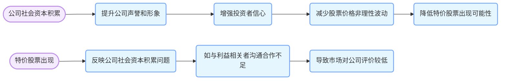

# 特价股票与公司社会资本积累的长期关系

> 关键词：特价股票、公司社会资本积累、长期关系、市场机制、企业价值

> 摘要：本文旨在深入探讨特价股票与公司社会资本积累之间的长期关系。通过对相关核心概念的解析，阐述了特价股票和公司社会资本的原理及架构。运用算法原理和数学模型，从理论层面分析两者的内在联系。结合项目实战案例，详细展示如何在实际中观察和研究这种关系。同时介绍了其实际应用场景，推荐了相关的学习工具、资源和论文著作。最后总结了未来发展趋势与挑战，并对常见问题进行解答，为投资者和企业管理者提供全面的参考和决策依据。

## 1. 背景介绍 
### 1.1 目的和范围
本研究的目的在于揭示特价股票与公司社会资本积累之间长期存在的关联机制。通过对这一关系的深入探究，帮助投资者更好地理解股票价格背后的企业社会因素，为投资决策提供更全面的视角；同时，也为企业管理者认识社会资本积累对公司市场表现的影响提供理论支持，促使企业更加注重社会资本的培育和维护。研究范围涵盖了不同行业、不同规模的上市公司，分析它们在特价股票表现与社会资本积累方面的共性和差异。

### 1.2 预期读者
本文预期读者包括金融投资者、企业管理者、金融分析师、学术研究人员以及对金融市场和企业发展感兴趣的人士。投资者可以从中获取关于特价股票投资的新见解，企业管理者可借鉴相关理论优化企业社会资本积累策略，金融分析师能丰富分析框架，学术研究人员则能为进一步的学术探讨提供参考。

### 1.3 文档结构概述
本文首先介绍了研究的背景信息，包括目的、预期读者和文档结构。接着阐述了特价股票和公司社会资本积累的核心概念及它们之间的联系，通过文本示意图和 Mermaid 流程图进行直观展示。然后详细讲解了分析两者关系的核心算法原理和具体操作步骤，并给出 Python 源代码示例。随后介绍了相关的数学模型和公式，结合实际例子进行说明。在项目实战部分，介绍了开发环境搭建、源代码实现和代码解读。之后探讨了实际应用场景，推荐了学习工具、资源和论文著作。最后总结了未来发展趋势与挑战，解答常见问题，并提供扩展阅读和参考资料。

### 1.4 术语表
#### 1.4.1 核心术语定义
- **特价股票**：指股票价格低于其内在价值的股票。这种价格差异可能是由于市场短期波动、信息不对称、行业周期性等因素导致。
- **公司社会资本**：是指公司通过与社会各方建立的关系网络、声誉、信任等资源所形成的一种无形资本。它包括与股东、客户、供应商、社区、政府等利益相关者之间的良好关系。
- **长期关系**：指在较长的时间跨度内，特价股票的表现与公司社会资本积累之间存在的稳定、持续的相互影响关系。

#### 1.4.2 相关概念解释
- **内在价值**：是指股票所代表的公司的真实价值，通常基于公司的财务状况、盈利能力、发展前景等因素进行评估。
- **利益相关者**：是指与公司存在利益关系的个人或组织，包括股东、债权人、员工、客户、供应商、社区等。他们的行为和态度会对公司的发展产生重要影响。
- **社会资本积累**：是指公司通过不断投入资源、开展活动，建立和维护与利益相关者的良好关系，从而增加公司社会资本的过程。

#### 1.4.3 缩略词列表
- **P/E**：市盈率（Price-to-Earnings Ratio），是指股票价格与每股收益的比率，用于衡量股票的估值水平。
- **ROE**：净资产收益率（Return on Equity），是指公司净利润与股东权益的比率，反映公司运用自有资本的效率。

## 2. 核心概念与联系 

### 核心概念原理
#### 特价股票原理
特价股票的出现往往是由于市场的非理性行为或信息传递的不及时。市场参与者的情绪波动、短期的资金流动等因素可能导致股票价格偏离其内在价值。例如，当市场整体处于恐慌状态时，投资者可能会过度抛售股票，导致一些优质公司的股票价格大幅下跌，形成特价股票。从估值角度来看，当股票的市盈率、市净率等指标低于同行业平均水平时，也可能被视为特价股票。

#### 公司社会资本原理
公司社会资本的形成基于公司与利益相关者之间的互动和合作。公司通过提供优质的产品和服务、履行社会责任、建立良好的企业文化等方式，赢得利益相关者的信任和支持，从而积累社会资本。例如，公司积极参与公益活动，改善社区环境，能够提升公司在社区中的声誉和形象，增强社区对公司的认同感和支持度；公司与供应商建立长期稳定的合作关系，能够获得更优惠的采购价格和更可靠的供应保障，提高公司的运营效率。

### 核心概念架构的文本示意图
特价股票与公司社会资本积累之间存在着复杂的相互关系。一方面，公司社会资本的积累可能对特价股票的形成和表现产生影响。良好的社会资本可以提升公司的声誉和形象，增强投资者对公司的信心，从而减少股票价格的非理性波动，降低出现特价股票的可能性。另一方面，特价股票的出现也可能反映公司社会资本积累过程中存在的问题。例如，如果公司的股票价格长期低于其内在价值，可能意味着公司在与利益相关者的沟通和合作方面存在不足，导致市场对公司的评价较低。

### Mermaid 流程图


## 3. 核心算法原理 & 具体操作步骤 

### 核心算法原理
为了分析特价股票与公司社会资本积累的长期关系，我们可以采用回归分析的方法。回归分析是一种统计方法，用于研究自变量与因变量之间的关系。在本研究中，我们将公司社会资本积累的相关指标作为自变量，特价股票的表现指标作为因变量，建立回归模型来分析两者之间的关系。

### 具体操作步骤
1. **数据收集**：收集上市公司的股票价格数据、财务数据以及社会资本积累相关数据。股票价格数据可以从证券交易所获取，财务数据可以从公司的年报、季报中获取，社会资本积累相关数据可以通过问卷调查、媒体报道分析等方式获取。
2. **变量定义**：定义特价股票的表现指标，如股票价格与内在价值的偏离程度；定义公司社会资本积累的相关指标，如公司的声誉评分、利益相关者满意度等。
3. **数据预处理**：对收集到的数据进行清洗、整理和标准化处理，去除异常值和缺失值，确保数据的质量和一致性。
4. **建立回归模型**：根据数据特点和研究目的，选择合适的回归模型，如线性回归模型、非线性回归模型等。
5. **模型估计和检验**：使用统计软件对回归模型进行估计和检验，评估模型的拟合优度、显著性水平等指标，判断模型的有效性。
6. **结果分析**：根据回归模型的估计结果，分析公司社会资本积累对特价股票表现的影响方向和程度，解释模型的经济意义。

### Python 源代码示例
```python
import pandas as pd
import numpy as np
from sklearn.linear_model import LinearRegression
from sklearn.model_selection import train_test_split
from sklearn.preprocessing import StandardScaler

# 读取数据
data = pd.read_csv('stock_social_capital_data.csv')

# 定义自变量和因变量
X = data[['social_capital_index']]  # 公司社会资本积累指标
y = data['stock_price_deviation']  # 特价股票表现指标

# 数据预处理
scaler = StandardScaler()
X_scaled = scaler.fit_transform(X)

# 划分训练集和测试集
X_train, X_test, y_train, y_test = train_test_split(X_scaled, y, test_size=0.2, random_state=42)

# 建立线性回归模型
model = LinearRegression()

# 模型训练
model.fit(X_train, y_train)

# 模型预测
y_pred = model.predict(X_test)

# 输出模型系数和截距
print('模型系数:', model.coef_)
print('模型截距:', model.intercept_)
```

## 4. 数学模型和公式 & 详细讲解 & 举例说明 

### 数学模型和公式
我们建立的线性回归模型可以表示为：

$$y = \beta_0 + \beta_1x + \epsilon$$

其中，$y$ 表示特价股票的表现指标，如股票价格与内在价值的偏离程度；$x$ 表示公司社会资本积累的相关指标，如公司的声誉评分；$\beta_0$ 是截距项，表示当公司社会资本积累指标为 0 时，特价股票表现指标的取值；$\beta_1$ 是回归系数，表示公司社会资本积累指标每变化一个单位，特价股票表现指标的平均变化量；$\epsilon$ 是随机误差项，反映了模型中未考虑的其他因素对特价股票表现的影响。

### 详细讲解
回归系数 $\beta_1$ 的正负和大小可以反映公司社会资本积累对特价股票表现的影响方向和程度。如果 $\beta_1$ 为正，说明公司社会资本积累的增加会导致特价股票表现指标的提高，即公司社会资本积累有助于减少股票价格与内在价值的偏离程度；如果 $\beta_1$ 为负，说明公司社会资本积累的增加会导致特价股票表现指标的降低，即公司社会资本积累可能会加剧股票价格与内在价值的偏离程度。

### 举例说明
假设我们通过回归分析得到的模型为：

$$y = 0.5 + 0.2x + \epsilon$$

这意味着当公司的社会资本积累指标 $x$ 每增加 1 个单位时，特价股票表现指标 $y$ 平均增加 0.2 个单位。例如，如果公司的声誉评分提高 1 分，股票价格与内在价值的偏离程度可能会平均减少 0.2 个百分点。

## 5. 项目实战：代码实际案例和详细解释说明 

### 5.1  开发环境搭建
为了实现上述代码，我们需要搭建以下开发环境：
1. **Python 环境**：建议使用 Python 3.7 及以上版本。可以从 Python 官方网站（https://www.python.org/downloads/）下载并安装。
2. **数据分析库**：安装 pandas、numpy、scikit-learn 等数据分析库。可以使用 pip 命令进行安装：
```sh
pip install pandas numpy scikit-learn
```
3. **集成开发环境（IDE）**：可以选择 PyCharm、Jupyter Notebook 等 IDE 进行代码开发和调试。

### 5.2  源代码详细实现和代码解读
```python
import pandas as pd
import numpy as np
from sklearn.linear_model import LinearRegression
from sklearn.model_selection import train_test_split
from sklearn.preprocessing import StandardScaler

# 读取数据
data = pd.read_csv('stock_social_capital_data.csv')

# 代码解读：使用 pandas 库的 read_csv 函数读取存储在 CSV 文件中的数据，将其存储为 DataFrame 对象。

# 定义自变量和因变量
X = data[['social_capital_index']]  # 公司社会资本积累指标
y = data['stock_price_deviation']  # 特价股票表现指标

# 代码解读：从 DataFrame 中提取自变量和因变量，分别存储在 X 和 y 中。

# 数据预处理
scaler = StandardScaler()
X_scaled = scaler.fit_transform(X)

# 代码解读：使用 StandardScaler 类对自变量进行标准化处理，将其转换为均值为 0、标准差为 1 的数据，以提高模型的稳定性和收敛速度。

# 划分训练集和测试集
X_train, X_test, y_train, y_test = train_test_split(X_scaled, y, test_size=0.2, random_state=42)

# 代码解读：使用 train_test_split 函数将数据集划分为训练集和测试集，其中测试集占总数据集的 20%。random_state 参数用于保证每次划分的结果一致。

# 建立线性回归模型
model = LinearRegression()

# 代码解读：创建一个线性回归模型对象。

# 模型训练
model.fit(X_train, y_train)

# 代码解读：使用训练集数据对线性回归模型进行训练，学习自变量和因变量之间的关系。

# 模型预测
y_pred = model.predict(X_test)

# 代码解读：使用训练好的模型对测试集数据进行预测，得到预测结果。

# 输出模型系数和截距
print('模型系数:', model.coef_)
print('模型截距:', model.intercept_)

# 代码解读：输出线性回归模型的系数和截距，系数表示自变量对因变量的影响程度，截距表示当自变量为 0 时因变量的取值。
```

### 5.3  代码解读与分析
通过上述代码，我们可以完成对特价股票与公司社会资本积累关系的初步分析。模型系数和截距的输出结果可以帮助我们了解公司社会资本积累对特价股票表现的影响方向和程度。如果模型系数为正且显著，说明公司社会资本积累有助于减少股票价格与内在价值的偏离程度，即有利于提高股票的价值；如果模型系数为负且显著，说明公司社会资本积累可能会加剧股票价格与内在价值的偏离程度，需要进一步分析原因。

同时，我们可以使用更多的评估指标，如均方误差（MSE）、决定系数（$R^2$）等，来评估模型的拟合效果和预测能力。例如，可以使用以下代码计算均方误差和决定系数：
```python
from sklearn.metrics import mean_squared_error, r2_score

mse = mean_squared_error(y_test, y_pred)
r2 = r2_score(y_test, y_pred)

print('均方误差:', mse)
print('决定系数:', r2)
```
均方误差越小，说明模型的预测结果与实际值的误差越小，模型的拟合效果越好；决定系数越接近 1，说明模型能够解释因变量的变异程度越高，模型的预测能力越强。

## 6. 实际应用场景 
### 投资者决策
投资者可以利用特价股票与公司社会资本积累的关系进行投资决策。当发现某只股票价格低于其内在价值，同时该公司具有较高的社会资本积累水平时，投资者可以认为这只股票具有较高的投资价值。因为良好的社会资本可以为公司的长期发展提供支持，有助于提升公司的业绩和市场竞争力，从而推动股票价格回归其内在价值。例如，投资者可以关注那些积极履行社会责任、与利益相关者保持良好关系的公司的特价股票，进行长期投资。

### 企业战略规划
企业管理者可以根据社会资本积累对特价股票表现的影响，制定合理的企业战略。企业可以通过加强与利益相关者的沟通和合作，积极参与社会公益活动，提升公司的社会资本积累水平。这样不仅可以增强公司的声誉和形象，还可以降低股票价格的非理性波动，提高公司的市场价值。例如，企业可以制定社会责任战略，明确在环境保护、员工福利、社区发展等方面的目标和措施，通过实际行动赢得利益相关者的信任和支持。

### 金融监管
金融监管机构可以关注特价股票与公司社会资本积累的关系，加强对市场的监管。如果发现某些公司的股票价格长期低于其内在价值，且与公司社会资本积累不足有关，监管机构可以要求公司加强信息披露，规范公司的经营行为，保护投资者的合法权益。同时，监管机构可以通过制定相关政策，鼓励企业积极积累社会资本，促进金融市场的健康稳定发展。

## 7. 工具和资源推荐
### 7.1 学习资源推荐
#### 7.1.1 书籍推荐
- 《金融市场学》：全面介绍了金融市场的基本概念、运行机制和分析方法，有助于读者了解股票市场的基本知识。
- 《企业社会责任与可持续发展》：深入探讨了企业社会责任的理论和实践，以及企业社会资本积累的重要性和方法。
- 《数据分析实战》：提供了丰富的数据分析案例和实战技巧，帮助读者掌握数据分析的基本方法和工具。

#### 7.1.2 在线课程
- Coursera 平台上的“金融市场分析”课程：由知名高校的教授授课，系统讲解金融市场的分析方法和工具。
- edX 平台上的“企业社会责任与商业伦理”课程：介绍了企业社会责任的相关理论和实践，以及如何将社会责任融入企业战略。
- 网易云课堂上的“Python 数据分析实战”课程：通过实际案例，详细讲解 Python 在数据分析中的应用。

#### 7.1.3 技术博客和网站
- 金融界网站：提供丰富的金融市场资讯和分析报告，有助于读者了解股票市场的动态和趋势。
- 财新网：专注于财经领域的新闻报道和深度分析，提供专业的金融信息和观点。
- 开源中国社区：汇聚了众多开发者和技术爱好者，提供了丰富的技术文章和开源项目，有助于读者学习数据分析和编程技术。

### 7.2 开发工具框架推荐
#### 7.2.1 IDE和编辑器
- PyCharm：一款专业的 Python 集成开发环境，提供了丰富的代码编辑、调试和管理功能，适合大规模项目的开发。
- Jupyter Notebook：一种交互式的开发环境，支持代码、文本、图表等多种元素的混合展示，适合数据分析和实验。
- Visual Studio Code：一款轻量级的代码编辑器，支持多种编程语言和插件扩展，具有良好的开发体验。

#### 7.2.2 调试和性能分析工具
- PDB：Python 自带的调试工具，可以帮助开发者逐行调试代码，查找和解决问题。
- Py-Spy：一款性能分析工具，可以实时监控 Python 程序的性能瓶颈，帮助开发者优化代码。
- cProfile：Python 标准库中的性能分析模块，可以统计程序中各个函数的调用次数和执行时间，帮助开发者找出性能瓶颈。

#### 7.2.3 相关框架和库
- Pandas：一个强大的数据分析库，提供了高效的数据结构和数据处理工具，适合处理和分析结构化数据。
- Numpy：一个用于科学计算的基础库，提供了高效的多维数组对象和数学函数，适合进行数值计算和数据分析。
- Scikit-learn：一个机器学习库，提供了丰富的机器学习算法和工具，适合进行数据挖掘和预测分析。

### 7.3 相关论文著作推荐
#### 7.3.1 经典论文
- “The Social Responsibility of Business Is to Increase Its Profits” by Milton Friedman：这篇论文提出了企业的唯一社会责任是增加利润的观点，引发了关于企业社会责任的广泛讨论。
- “Social Capital in the Creation of Human Capital” by James S. Coleman：该论文阐述了社会资本在人力资本创造中的作用，为研究公司社会资本积累提供了理论基础。
- “The Pricing of Options and Corporate Liabilities” by Fischer Black and Myron Scholes：这篇论文提出了著名的布莱克 - 斯科尔斯期权定价模型，为金融市场的定价理论奠定了基础。

#### 7.3.2 最新研究成果
- 可以关注《Journal of Financial Economics》《Journal of Corporate Finance》《Academy of Management Journal》等学术期刊，了解关于特价股票和公司社会资本积累的最新研究成果。

#### 7.3.3 应用案例分析
- 《哈佛商业评论》上经常刊登一些关于企业社会责任和社会资本积累的应用案例分析，读者可以从中学习到企业在实践中的成功经验和做法。

## 8. 总结：未来发展趋势与挑战
### 未来发展趋势
- **数字化转型推动社会资本积累**：随着数字化技术的不断发展，企业可以通过互联网平台、社交媒体等渠道更加便捷地与利益相关者进行沟通和互动，从而加速社会资本的积累。例如，企业可以通过在线社区了解客户需求，及时反馈和解决问题，提升客户满意度和忠诚度。
- **社会责任投资兴起**：投资者越来越关注企业的社会责任和社会资本积累情况，社会责任投资将成为未来金融市场的一个重要趋势。企业需要更加注重社会资本的培育和维护，以吸引更多的社会责任投资者。
- **跨学科研究加强**：特价股票与公司社会资本积累的研究涉及金融、管理、社会学等多个学科领域，未来跨学科研究将不断加强，为深入理解两者之间的关系提供更全面的视角和方法。

### 挑战
- **数据获取和质量问题**：获取准确、全面的公司社会资本积累数据是研究的关键，但目前相关数据的获取难度较大，且数据质量参差不齐。需要进一步探索有效的数据收集方法和数据质量评估体系。
- **因果关系识别困难**：特价股票与公司社会资本积累之间可能存在复杂的因果关系，很难准确识别两者之间的因果方向和影响程度。需要运用更先进的计量经济学方法和实验设计来解决这一问题。
- **企业短期利益与长期社会资本积累的平衡**：企业在追求短期利润的同时，需要考虑长期社会资本的积累。如何平衡短期利益和长期发展，是企业面临的一个重要挑战。

## 9. 附录：常见问题与解答
### 问题 1：如何衡量公司的社会资本积累水平？
答：衡量公司的社会资本积累水平可以从多个维度进行，如公司的声誉、利益相关者满意度、社会责任履行情况等。可以通过问卷调查、媒体报道分析、行业评级等方式获取相关数据，并构建综合指标体系进行评估。

### 问题 2：特价股票一定是具有投资价值的吗？
答：不一定。特价股票只是股票价格低于其内在价值，但这并不意味着它一定具有投资价值。需要综合考虑公司的基本面、行业前景、社会资本积累等因素。如果公司存在严重的经营问题或社会资本积累不足，即使股票价格低廉，也可能不具有投资价值。

### 问题 3：企业如何平衡短期利益和长期社会资本积累？
答：企业可以制定明确的战略规划，将短期利益和长期社会资本积累纳入战略目标体系。在具体操作中，可以通过合理分配资源，在保证短期利润的前提下，适当投入资源进行社会资本积累。例如，企业可以在产品研发、生产过程中注重环保和社会责任，提高产品质量和企业形象，从而实现短期利益和长期发展的平衡。

## 10. 扩展阅读 & 参考资料
### 扩展阅读
- 《影响力投资：从理念到实践》：深入介绍了影响力投资的概念、方法和实践案例，有助于读者了解社会责任投资的最新发展趋势。
- 《社会资本与经济发展》：探讨了社会资本在经济发展中的作用和机制，为研究公司社会资本积累提供了更广阔的视角。
- 《金融科技前沿》：介绍了金融科技的最新发展动态和应用场景，有助于读者了解数字化技术在金融市场和企业管理中的应用。

### 参考资料
- 证券交易所官方网站，获取股票价格和财务数据。
- 公司年报、季报，获取公司的经营信息和财务状况。
- 相关学术期刊和研究报告，如《金融研究》《管理世界》等，获取专业的学术研究成果和行业分析报告。

作者：AI天才研究院/AI Genius Institute & 禅与计算机程序设计艺术 /Zen And The Art of Computer Programming