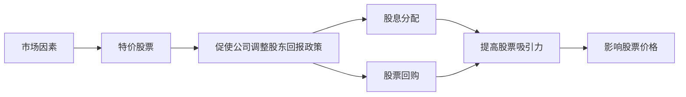

# 特价股票与公司股东回报政策的关联

> 关键词：特价股票、公司股东回报政策、股息政策、股票回购、关联分析

> 摘要：本文深入探讨了特价股票与公司股东回报政策之间的关联。首先介绍了相关背景知识，包括研究目的、预期读者、文档结构和术语表。接着阐述了特价股票和股东回报政策的核心概念及其联系，并给出了相应的文本示意图和 Mermaid 流程图。详细讲解了分析两者关联的核心算法原理和具体操作步骤，通过 Python 源代码进行了说明。还介绍了相关的数学模型和公式，并举例进行详细讲解。通过项目实战，给出了代码实际案例及详细解释。分析了该关联在实际中的应用场景，推荐了学习、开发相关的工具和资源，以及相关的论文著作。最后总结了未来发展趋势与挑战，提供了常见问题解答和扩展阅读参考资料，旨在为投资者和研究者全面理解两者关系提供有价值的参考。

## 1. 背景介绍 
### 1.1 目的和范围
在金融市场中，特价股票往往吸引着众多投资者的目光。同时，公司的股东回报政策是衡量公司价值和对股东关怀程度的重要指标。本研究的目的在于深入探究特价股票与公司股东回报政策之间的内在关联，揭示这种关联对投资者决策和公司战略制定的影响。研究范围涵盖了不同行业、不同规模公司的特价股票特征以及它们所采取的股东回报政策，包括股息分配、股票回购等方面。

### 1.2 预期读者
本文的预期读者包括专业投资者、金融分析师、公司管理层以及对金融市场和公司治理感兴趣的研究者。专业投资者可以通过了解两者的关联，优化投资组合，提高投资收益；金融分析师能够借助研究结果更准确地评估公司价值；公司管理层可以参考研究结论制定更合理的股东回报政策；研究者则可以在已有研究基础上进行更深入的探索。

### 1.3 文档结构概述
本文将按照以下结构展开：首先介绍核心概念，明确特价股票和股东回报政策的定义和相互关系；接着阐述分析两者关联的核心算法原理和具体操作步骤；然后引入数学模型和公式，通过具体例子进行详细讲解；进行项目实战，给出代码实际案例并进行详细解释；分析实际应用场景；推荐相关的学习、开发工具和资源以及论文著作；最后总结未来发展趋势与挑战，提供常见问题解答和扩展阅读参考资料。

### 1.4 术语表
#### 1.4.1 核心术语定义
- **特价股票**：指在市场上价格相对其内在价值被低估的股票。通常由于市场短期波动、行业负面消息、公司暂时困境等因素导致其价格低于合理水平。
- **公司股东回报政策**：公司为了回报股东的投资，所采取的一系列政策和措施，主要包括股息分配政策和股票回购政策。
- **股息**：公司按照一定的比例向股东分配的利润，是股东从公司获得的现金收益。
- **股票回购**：公司从市场上购回自己发行在外的股票，减少流通股数量，从而提高每股价值。

#### 1.4.2 相关概念解释
- **内在价值**：股票的内在价值是根据公司的基本面因素，如盈利能力、资产状况、行业前景等，通过一定的估值方法计算得出的理论价值。
- **股息率**：股息率是股息与股票价格的比率，反映了股东从股息中获得的收益率。
- **市盈率**：市盈率是股票价格与每股收益的比率，是衡量股票估值水平的重要指标。

#### 1.4.3 缩略词列表
- **EPS**：Earnings Per Share，每股收益
- **P/E**：Price-to-Earnings Ratio，市盈率
- **DPS**：Dividend Per Share，每股股息

## 2. 核心概念与联系 
### 核心概念原理
#### 特价股票
特价股票的出现通常是由于市场的非理性行为或公司的短期困境。市场上的投资者情绪、宏观经济环境、行业竞争等因素都可能导致股票价格的波动。当股票价格低于其内在价值时，就形成了特价股票。例如，一家公司由于短期的业绩下滑，市场对其前景产生担忧，导致股票价格大幅下跌，但实际上公司的核心业务仍然具有竞争力，未来有较大的增长潜力，此时该股票就可能成为特价股票。

#### 公司股东回报政策
公司股东回报政策是公司治理的重要组成部分。股息分配政策反映了公司对股东的现金回报意愿和能力。稳定的股息分配可以吸引长期投资者，增强股东对公司的信心。股票回购政策则可以通过减少流通股数量，提高每股收益和每股净资产，从而提升股票的内在价值。例如，一家公司在盈利较好的情况下，可能会选择增加股息分配或进行股票回购，以回报股东。

### 核心概念联系
特价股票与公司股东回报政策之间存在着密切的联系。一方面，公司良好的股东回报政策可以提高股票的吸引力，减少股票被低估的可能性。当公司持续稳定地分配股息或进行股票回购时，投资者会认为该公司具有较高的投资价值，从而愿意以更高的价格购买股票，使股票价格回归到合理水平。另一方面，特价股票的出现可能促使公司调整股东回报政策。当公司股票价格被低估时，公司管理层可能会采取增加股息分配或进行股票回购的措施，向市场传递公司价值被低估的信号，吸引投资者购买股票，推动股票价格上涨。

### 文本示意图
```plaintext
特价股票 <-- 市场因素（情绪、宏观经济、行业竞争等）
         |
         | 可能促使
         |
公司股东回报政策（股息分配、股票回购） --> 影响股票吸引力 --> 影响股票价格
```

### Mermaid 流程图


## 3. 核心算法原理 & 具体操作步骤 
### 核心算法原理
为了分析特价股票与公司股东回报政策的关联，我们可以采用以下步骤：
1. **股票估值**：使用估值模型计算股票的内在价值，判断股票是否为特价股票。常用的估值模型包括股息贴现模型（DDM）、自由现金流贴现模型（DCF）等。
2. **股东回报政策分析**：分析公司的股息分配历史和股票回购情况，计算股息率、股息增长率等指标。
3. **关联分析**：通过统计分析方法，如回归分析，研究特价股票与股东回报政策指标之间的相关性。

### 具体操作步骤及 Python 代码实现

#### 步骤 1：股票估值（使用股息贴现模型）
股息贴现模型的基本公式为：$V = \frac{D_1}{r - g}$，其中 $V$ 为股票的内在价值，$D_1$ 为下一期预计股息，$r$ 为必要收益率，$g$ 为股息增长率。

```python
def ddm_valuation(D1, r, g):
    """
    使用股息贴现模型计算股票的内在价值
    :param D1: 下一期预计股息
    :param r: 必要收益率
    :param g: 股息增长率
    :return: 股票的内在价值
    """
    if r <= g:
        raise ValueError("必要收益率必须大于股息增长率")
    return D1 / (r - g)

# 示例数据
D1 = 2
r = 0.1
g = 0.05

# 计算内在价值
intrinsic_value = ddm_valuation(D1, r, g)
print(f"股票的内在价值为: {intrinsic_value}")
```

#### 步骤 2：股东回报政策分析
计算股息率和股息增长率。

```python
import pandas as pd

def calculate_dividend_yield(dividend_per_share, stock_price):
    """
    计算股息率
    :param dividend_per_share: 每股股息
    :param stock_price: 股票价格
    :return: 股息率
    """
    return dividend_per_share / stock_price

def calculate_dividend_growth_rate(dividends):
    """
    计算股息增长率
    :param dividends: 股息数据（列表）
    :return: 股息增长率
    """
    if len(dividends) < 2:
        return 0
    return (dividends[-1] - dividends[-2]) / dividends[-2]

# 示例数据
dividends = [1.5, 1.8, 2]
stock_price = 20

# 计算股息率
dividend_yield = calculate_dividend_yield(dividends[-1], stock_price)
print(f"股息率为: {dividend_yield * 100:.2f}%")

# 计算股息增长率
dividend_growth_rate = calculate_dividend_growth_rate(dividends)
print(f"股息增长率为: {dividend_growth_rate * 100:.2f}%")
```

#### 步骤 3：关联分析（简单线性回归）
使用 Python 的 `statsmodels` 库进行简单线性回归分析，研究股票价格与股息率之间的关系。

```python
import numpy as np
import statsmodels.api as sm

# 示例数据
stock_prices = np.array([18, 20, 22, 24, 26])
dividend_yields = np.array([0.05, 0.06, 0.07, 0.08, 0.09])

# 添加常数项
X = sm.add_constant(dividend_yields)

# 拟合线性回归模型
model = sm.OLS(stock_prices, X)
results = model.fit()

# 输出回归结果
print(results.summary())
```

## 4. 数学模型和公式 & 详细讲解 & 举例说明 
### 股息贴现模型（DDM）
#### 公式
$V = \frac{D_1}{r - g}$

#### 详细讲解
- $V$：股票的内在价值，即根据公司未来股息分配情况计算得出的理论价格。
- $D_1$：下一期预计股息，是公司预计在下一个股息分配周期向股东支付的每股股息。
- $r$：必要收益率，是投资者要求的最低收益率，反映了投资者对该股票投资的风险补偿要求。
- $g$：股息增长率，是公司股息预计的增长速度，通常根据公司的历史股息增长情况和未来发展前景进行估计。

#### 举例说明
假设一家公司下一期预计股息 $D_1 = 2$ 元，投资者要求的必要收益率 $r = 0.1$，股息增长率 $g = 0.05$。根据股息贴现模型，该股票的内在价值为：

$V = \frac{2}{0.1 - 0.05} = \frac{2}{0.05} = 40$（元）

如果当前股票市场价格低于 40 元，则该股票可能被低估，成为特价股票。

### 简单线性回归模型
#### 公式
$y = \beta_0 + \beta_1x + \epsilon$

#### 详细讲解
- $y$：因变量，在我们的分析中可以是股票价格。
- $x$：自变量，例如股息率。
- $\beta_0$：截距项，表示当自变量 $x$ 为 0 时，因变量 $y$ 的取值。
- $\beta_1$：斜率项，表示自变量 $x$ 每变化一个单位，因变量 $y$ 的平均变化量。
- $\epsilon$：误差项，反映了模型无法解释的随机因素。

#### 举例说明
假设我们有一组股票价格 $y$ 和股息率 $x$ 的数据，通过简单线性回归分析得到回归方程：$y = 10 + 200x$。这意味着当股息率为 0 时，股票价格的预测值为 10 元；股息率每增加 0.01，股票价格平均增加 2 元。

## 5. 项目实战：代码实际案例和详细解释说明 
### 5.1  开发环境搭建
#### 安装 Python
首先需要安装 Python 环境，建议使用 Python 3.7 及以上版本。可以从 Python 官方网站（https://www.python.org/downloads/）下载并安装。

#### 安装必要的库
使用 `pip` 命令安装所需的库，包括 `pandas`、`numpy`、`statsmodels` 等。

```bash
pip install pandas numpy statsmodels
```

### 5.2  源代码详细实现和代码解读
以下是一个完整的项目实战代码示例，用于分析特价股票与公司股东回报政策的关联。

```python
import pandas as pd
import numpy as np
import statsmodels.api as sm

# 步骤 1：模拟数据生成
# 假设我们有 10 家公司的数据
n = 10
np.random.seed(42)

# 生成股票价格
stock_prices = np.random.randint(10, 50, n)

# 生成每股股息
dividends_per_share = np.random.uniform(0.5, 3, n)

# 生成必要收益率
required_returns = np.random.uniform(0.05, 0.15, n)

# 生成股息增长率
dividend_growth_rates = np.random.uniform(0.01, 0.08, n)

# 步骤 2：计算内在价值
def ddm_valuation(D1, r, g):
    if r <= g:
        raise ValueError("必要收益率必须大于股息增长率")
    return D1 / (r - g)

intrinsic_values = []
for D1, r, g in zip(dividends_per_share, required_returns, dividend_growth_rates):
    intrinsic_values.append(ddm_valuation(D1, r, g))

# 步骤 3：判断是否为特价股票
is_bargain_stocks = [price < value for price, value in zip(stock_prices, intrinsic_values)]

# 步骤 4：计算股息率
dividend_yields = [dividend / price for dividend, price in zip(dividends_per_share, stock_prices)]

# 步骤 5：关联分析
# 添加常数项
X = sm.add_constant(dividend_yields)

# 拟合线性回归模型，研究股息率与是否为特价股票之间的关系
model = sm.OLS(is_bargain_stocks, X)
results = model.fit()

# 输出回归结果
print(results.summary())

# 步骤 6：数据可视化（简单示例）
import matplotlib.pyplot as plt

plt.scatter(dividend_yields, is_bargain_stocks)
plt.xlabel('股息率')
plt.ylabel('是否为特价股票（1 是，0 否）')
plt.title('股息率与特价股票的关系')
plt.show()
```

### 5.3  代码解读与分析
#### 数据生成
通过 `numpy` 库生成模拟的股票价格、每股股息、必要收益率和股息增长率数据。这些数据用于后续的计算和分析。

#### 内在价值计算
使用股息贴现模型计算每家公司股票的内在价值。如果股票价格低于内在价值，则判断该股票为特价股票。

#### 股息率计算
计算每家公司的股息率，即每股股息与股票价格的比率。

#### 关联分析
使用简单线性回归模型，研究股息率与是否为特价股票之间的关系。通过 `statsmodels` 库进行模型拟合，并输出回归结果。

#### 数据可视化
使用 `matplotlib` 库绘制散点图，直观展示股息率与是否为特价股票之间的关系。

## 6. 实际应用场景 
### 投资者决策
投资者可以利用对特价股票与公司股东回报政策关联的分析，优化投资组合。当发现一只股票价格被低估且公司具有良好的股东回报政策时，投资者可以考虑买入该股票，以获取长期的投资收益。例如，一家公司的股票价格由于行业短期波动而下跌，但公司一直保持稳定的股息分配和适当的股票回购，投资者可以认为该股票具有投资价值，选择在低价时买入。

### 公司战略制定
公司管理层可以根据股票价格情况和市场对股东回报政策的反应，调整公司的股东回报政策。当公司股票价格被低估时，管理层可以增加股息分配或进行股票回购，向市场传递公司价值被低估的信号，吸引投资者购买股票，推动股票价格上涨。例如，苹果公司在股票价格出现波动时，会适时进行大规模的股票回购，稳定股价，增强投资者信心。

### 金融研究
金融研究者可以通过深入研究特价股票与公司股东回报政策的关联，揭示金融市场的运行规律和公司治理的有效性。研究结果可以为金融理论的发展和政策制定提供参考依据。例如，研究不同行业公司的股东回报政策对特价股票的影响，可以为行业监管和政策制定提供有益的建议。

## 7. 工具和资源推荐
### 7.1 学习资源推荐
#### 7.1.1 书籍推荐
- 《证券分析》（Security Analysis）：由本杰明·格雷厄姆（Benjamin Graham）和戴维·多德（David Dodd）所著，是价值投资的经典之作，详细介绍了股票估值和投资分析的方法。
- 《聪明的投资者》（The Intelligent Investor）：同样是本杰明·格雷厄姆的著作，为普通投资者提供了实用的投资策略和方法，强调了价值投资和风险控制的重要性。
- 《财务报表分析与证券定价》（Financial Statement Analysis and Security Valuation）：由斯蒂芬·佩因曼（Stephen Penman）所著，深入讲解了如何通过分析公司财务报表来评估股票价值。

#### 7.1.2 在线课程
- Coursera 上的“投资学原理”（Principles of Investments）课程：由知名大学教授授课，涵盖了投资组合理论、股票估值、风险管理等方面的内容。
- edX 上的“金融市场”（Financial Markets）课程：由耶鲁大学教授罗伯特·席勒（Robert Shiller）主讲，介绍了金融市场的基本原理和运行机制。
- 中国大学 MOOC 上的“公司金融”课程：许多高校都开设了该课程，系统讲解了公司融资、投资决策、股利政策等方面的知识。

#### 7.1.3 技术博客和网站
- Seeking Alpha：提供了丰富的金融分析文章和研究报告，包括对特价股票和公司股东回报政策的分析。
- Motley Fool：是一个知名的投资网站，为投资者提供股票分析、投资建议和市场评论。
- 雪球网：国内知名的投资交流社区，投资者可以在上面分享投资经验、讨论股票和公司动态。

### 7.2 开发工具框架推荐
#### 7.2.1 IDE和编辑器
- PyCharm：是一款功能强大的 Python 集成开发环境，提供了代码编辑、调试、版本控制等一系列功能，适合专业的 Python 开发者。
- Jupyter Notebook：以交互式的方式编写和运行代码，非常适合数据探索和分析，在金融数据分析中广泛应用。
- Visual Studio Code：是一款轻量级的代码编辑器，支持多种编程语言，通过安装插件可以扩展其功能，方便进行 Python 开发。

#### 7.2.2 调试和性能分析工具
- pdb：Python 自带的调试器，可以帮助开发者在代码运行过程中定位和解决问题。
- cProfile：Python 标准库中的性能分析工具，可以分析代码的运行时间和函数调用情况，帮助优化代码性能。
- Py-Spy：一个轻量级的 Python 性能分析工具，可以实时监控 Python 程序的运行状态，找出性能瓶颈。

#### 7.2.3 相关框架和库
- pandas：是 Python 中用于数据处理和分析的重要库，提供了高效的数据结构和数据操作方法，方便处理金融数据。
- numpy：是 Python 中用于科学计算的基础库，提供了多维数组对象和各种数学函数，在金融计算中广泛应用。
- statsmodels：是 Python 中用于统计建模和计量经济学分析的库，支持线性回归、时间序列分析等多种统计模型。

### 7.3 相关论文著作推荐
#### 7.3.1 经典论文
- Miller, M. H., & Modigliani, F. (1961). Dividend policy, growth, and the valuation of shares. The Journal of Business, 34(4), 411-433. 该论文提出了著名的 MM 股利无关理论，对公司股息政策的研究产生了深远影响。
- Fama, E. F., & French, K. R. (1992). The cross-section of expected stock returns. The Journal of Finance, 47(2), 427-465. 提出了 Fama-French 三因子模型，为股票收益率的解释和预测提供了重要的理论框架。

#### 7.3.2 最新研究成果
- Baker, M., & Wurgler, J. (2004). A catering theory of dividends. The Journal of Finance, 59(3), 1125-1165. 提出了股利迎合理论，从投资者情绪的角度解释了公司的股息政策。
- DeAngelo, H., DeAngelo, L., & Skinner, D. J. (2004). Are dividends disappearing? Dividend concentration and the consolidation of earnings. The Journal of Financial Economics, 72(3), 425-456. 研究了股息分配的集中化现象及其与公司盈利的关系。

#### 7.3.3 应用案例分析
- 《巴菲特致股东的信：股份公司教程》（The Essays of Warren Buffett: Lessons for Corporate America）：收录了巴菲特历年致股东的信，通过实际案例展示了巴菲特的投资理念和对公司股东回报政策的看法。
- 《金融炼金术》（The Alchemy of Finance）：乔治·索罗斯（George Soros）的著作，通过讲述他的投资实践，分析了金融市场的运行规律和投资者心理对市场的影响。

## 8. 总结：未来发展趋势与挑战
### 未来发展趋势
#### 数字化和智能化
随着金融科技的发展，数据分析和人工智能技术将在特价股票和公司股东回报政策分析中得到更广泛的应用。通过大数据分析和机器学习算法，可以更准确地识别特价股票和预测公司股东回报政策的变化。

#### 国际化和全球化
金融市场的国际化和全球化趋势将加强，投资者可以更容易地投资于全球范围内的股票。这将促使公司更加注重股东回报政策的制定，以吸引国际投资者。

#### 可持续发展和社会责任
投资者越来越关注公司的可持续发展和社会责任，公司的股东回报政策也将更多地考虑这些因素。例如，一些公司可能会将部分利润用于环保、公益等项目，同时向股东提供合理的回报。

### 挑战
#### 数据质量和可用性
准确的数据分析依赖于高质量的数据，但金融数据往往存在噪声、缺失值等问题。此外，一些公司的财务数据可能存在造假现象，这给分析特价股票和公司股东回报政策带来了挑战。

#### 市场不确定性
金融市场受到宏观经济环境、政策变化、地缘政治等多种因素的影响，具有高度的不确定性。这使得准确预测特价股票的出现和公司股东回报政策的调整变得困难。

#### 法律法规和监管
不同国家和地区的法律法规和监管政策对公司股东回报政策有不同的规定，这增加了跨国投资和分析的复杂性。同时，监管政策的变化也可能对公司的股东回报政策产生影响。

## 9. 附录：常见问题与解答
### 1. 如何判断一只股票是否为特价股票？
判断一只股票是否为特价股票可以通过多种方法，如估值模型计算内在价值、比较市盈率和市净率等指标与行业平均水平、分析公司的基本面和发展前景等。如果股票价格低于其内在价值，且公司具有良好的盈利能力和发展潜力，则该股票可能为特价股票。

### 2. 公司股东回报政策对股票价格有多大影响？
公司股东回报政策对股票价格有重要影响。稳定的股息分配和适当的股票回购可以提高股票的吸引力，增强投资者信心，从而推动股票价格上涨。但股票价格还受到市场因素、公司业绩等多种因素的综合影响，股东回报政策只是其中之一。

### 3. 股息率越高越好吗？
股息率并不是越高越好。高股息率可能意味着公司缺乏投资机会，将大量利润用于分配股息；也可能是股票价格大幅下跌导致的。投资者需要综合考虑公司的盈利状况、股息分配的可持续性等因素，判断股息率是否合理。

### 4. 股票回购对股东有什么好处？
股票回购可以减少流通股数量，提高每股收益和每股净资产，从而提升股票的内在价值。此外，股票回购还可以向市场传递公司价值被低估的信号，增强投资者信心，推动股票价格上涨。股东可以通过股票价格上涨和股权比例的提高获得收益。

## 10. 扩展阅读 & 参考资料
### 扩展阅读
- 《金融市场与金融机构》（Financial Markets and Institutions）：全面介绍了金融市场的各种参与者、金融工具和金融机构的运作机制。
- 《行为金融学》（Behavioral Finance）：探讨了投资者的心理和行为对金融市场的影响，为理解股票价格波动和公司决策提供了新的视角。
- 《投资银行、对冲基金和私募股权投资》（Investment Banking, Hedge Funds, and Private Equity）：介绍了投资银行、对冲基金和私募股权投资等金融领域的业务模式和运作机制。

### 参考资料
- 各公司的年报和财务报表
- 金融数据提供商，如 Bloomberg、Wind 等提供的数据
- 相关金融学术期刊，如《Journal of Finance》、《Journal of Financial Economics》等发表的研究论文

作者：AI天才研究院/AI Genius Institute & 禅与计算机程序设计艺术 /Zen And The Art of Computer Programming