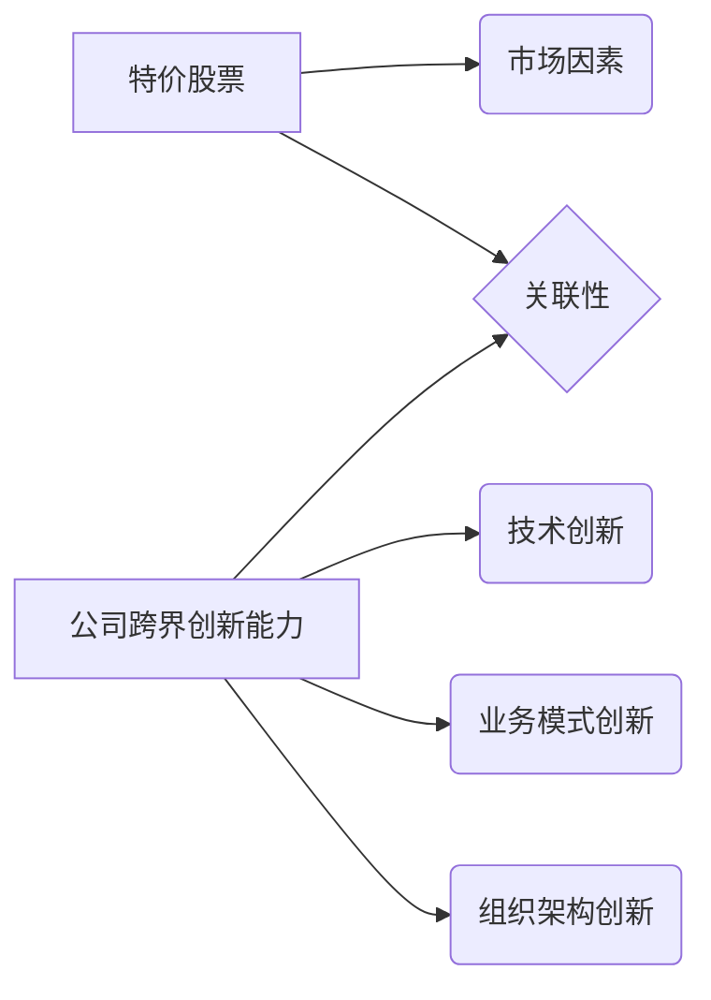

# 特价股票与公司跨界创新能力的关联性研究

> 关键词：特价股票、公司跨界创新能力、关联性、财务分析、市场表现

> 摘要：本文旨在深入研究特价股票与公司跨界创新能力之间的关联性。通过对相关概念的详细阐述、核心算法原理的讲解、数学模型的构建，结合实际案例进行分析，探讨特价股票的特征、公司跨界创新能力的评估方式以及二者之间的内在联系。同时，分析这种关联性在实际应用场景中的体现，推荐相关的学习资源、开发工具和论文著作，最后总结未来发展趋势与挑战，并解答常见问题。

## 1. 背景介绍 
### 1.1 目的和范围
本研究的目的在于揭示特价股票与公司跨界创新能力之间的潜在联系。随着市场竞争的加剧和行业边界的模糊，越来越多的公司开始尝试跨界创新以寻求新的增长点。而特价股票作为市场中价格相对较低的一类股票，其背后的公司是否具备较强的跨界创新能力，以及这种能力如何影响股票价格，是值得深入探究的问题。本研究的范围涵盖了不同行业的上市公司，通过对其财务数据、创新活动等方面的分析，来评估二者之间的关联性。

### 1.2 预期读者
本文预期读者包括金融投资者、证券分析师、企业管理者、学术研究人员以及对金融市场和企业创新感兴趣的人士。投资者可以通过了解这种关联性，更好地进行投资决策；证券分析师可以将其作为分析股票价值的一个重要因素；企业管理者可以从中获取关于跨界创新对公司价值影响的启示；学术研究人员可以在此基础上开展进一步的研究。

### 1.3 文档结构概述
本文首先介绍相关背景信息，包括研究目的、预期读者和文档结构。接着阐述核心概念，如特价股票和公司跨界创新能力的定义和联系，并通过示意图和流程图进行直观展示。然后讲解核心算法原理和具体操作步骤，构建数学模型并举例说明。之后通过实际案例分析，详细解释代码实现和解读。再探讨实际应用场景，推荐相关的工具和资源。最后总结未来发展趋势与挑战，解答常见问题，并提供扩展阅读和参考资料。

### 1.4 术语表
#### 1.4.1 核心术语定义
- **特价股票**：指在股票市场中，价格相对其内在价值或同行业其他股票价格较低的股票。通常可能由于市场短期波动、公司负面消息等因素导致价格下跌，但并不一定反映公司的真实长期价值。
- **公司跨界创新能力**：公司突破自身所在行业的限制，将不同领域的技术、理念、商业模式等进行整合和应用，创造出新的产品、服务或业务模式的能力。

#### 1.4.2 相关概念解释
- **股票内在价值**：股票未来现金流的现值，是评估股票真实价值的重要指标。通常通过对公司的盈利能力、资产质量、发展前景等因素进行综合分析来确定。
- **跨界融合**：不同行业之间相互渗透、相互合作，形成新的产业形态或商业模式的过程。公司跨界创新能力是实现跨界融合的重要驱动力。

#### 1.4.3 缩略词列表
- **PE**：市盈率（Price Earnings Ratio），指股票价格除以每股收益的比率，用于衡量股票的估值水平。
- **ROE**：净资产收益率（Return on Equity），反映股东权益的收益水平，用以衡量公司运用自有资本的效率。

## 2. 核心概念与联系 

### 特价股票的特征
特价股票通常具有以下特征：
- **低市盈率**：PE值相对较低，意味着投资者可以以较低的价格购买到公司的盈利。
- **低市净率**：市净率（PB）是股票价格与每股净资产的比率，特价股票的PB值往往也较低。
- **市场关注度低**：可能由于公司规模较小、行业前景不被看好等原因，导致市场对其关注度较低。

### 公司跨界创新能力的评估维度
公司跨界创新能力可以从以下几个维度进行评估：
- **技术创新**：公司是否在不同领域进行技术研发和应用，如跨行业的技术合作、新技术的引进等。
- **业务模式创新**：是否尝试新的商业模式，如线上线下融合、共享经济模式等。
- **组织架构创新**：公司的组织架构是否具有灵活性和开放性，能够适应跨界创新的需求。

### 特价股票与公司跨界创新能力的联系
特价股票背后的公司如果具备较强的跨界创新能力，可能会为公司带来新的增长点，从而提升公司的价值。一方面，跨界创新可以开拓新的市场，增加公司的收入和利润；另一方面，创新活动也可以提升公司的品牌形象和市场竞争力。然而，跨界创新也存在一定的风险，如果创新失败，可能会导致公司资源的浪费和业绩的下滑，进一步压低股票价格。

### 文本示意图
```plaintext
特价股票 <-- 市场因素（短期波动、负面消息等）
         |
         | 关联性
         |
公司跨界创新能力 --> 技术创新
                      |
                      | 业务模式创新
                      |
                      | 组织架构创新
```

### Mermaid 流程图


## 3. 核心算法原理 & 具体操作步骤 

### 特价股票筛选算法
我们可以通过以下步骤筛选特价股票：
1. **数据收集**：收集上市公司的财务数据，包括市盈率、市净率、每股收益等。
2. **设定筛选条件**：例如，市盈率低于行业平均水平的一定比例，市净率低于某个阈值。
3. **筛选股票**：根据设定的条件筛选出符合要求的特价股票。

以下是使用Python实现的特价股票筛选代码示例：
```python
import pandas as pd

# 假设我们有一个包含股票数据的DataFrame，列名包括 'PE', 'PB'
# 读取股票数据
stock_data = pd.read_csv('stock_data.csv')

# 设定筛选条件
industry_avg_pe = stock_data['PE'].mean()
threshold_pe = industry_avg_pe * 0.8  # 市盈率低于行业平均的80%
threshold_pb = 1.5  # 市净率低于1.5

# 筛选特价股票
bargain_stocks = stock_data[(stock_data['PE'] < threshold_pe) & (stock_data['PB'] < threshold_pb)]

print(bargain_stocks)
```

### 公司跨界创新能力评估算法
评估公司跨界创新能力可以采用综合评分法，具体步骤如下：
1. **确定评估指标**：包括技术创新指标（如研发投入占比、专利数量等）、业务模式创新指标（如新增业务收入占比等）、组织架构创新指标（如跨部门合作项目数量等）。
2. **设定指标权重**：根据各指标的重要性，设定相应的权重。
3. **计算得分**：根据公司的实际数据，计算各指标的得分，并加权求和得到综合得分。

以下是使用Python实现的公司跨界创新能力评估代码示例：
```python
# 假设我们有一个包含公司数据的DataFrame，列名包括 'R&D_ratio', 'Patent_num', 'New_business_ratio', 'Cross_department_projects'
# 读取公司数据
company_data = pd.read_csv('company_data.csv')

# 设定指标权重
weights = {
    'R&D_ratio': 0.3,
    'Patent_num': 0.2,
    'New_business_ratio': 0.3,
    'Cross_department_projects': 0.2
}

# 计算各指标得分
company_data['R&D_score'] = company_data['R&D_ratio'] * weights['R&D_ratio']
company_data['Patent_score'] = company_data['Patent_num'] * weights['Patent_num']
company_data['New_business_score'] = company_data['New_business_ratio'] * weights['New_business_ratio']
company_data['Cross_department_score'] = company_data['Cross_department_projects'] * weights['Cross_department_projects']

# 计算综合得分
company_data['Innovation_score'] = company_data['R&D_score'] + company_data['Patent_score'] + company_data['New_business_score'] + company_data['Cross_department_score']

print(company_data[['Company_name', 'Innovation_score']])
```

## 4. 数学模型和公式 & 详细讲解 & 举例说明 

### 特价股票筛选模型
我们可以使用以下公式来筛选特价股票：
$$
\text{PE} < \text{Industry_avg_PE} \times \alpha \\
\text{PB} < \beta
$$
其中，$\text{PE}$ 是股票的市盈率，$\text{Industry_avg_PE}$ 是行业平均市盈率，$\alpha$ 是市盈率阈值系数，$\beta$ 是市净率阈值。

例如，假设某行业的平均市盈率为 20，我们设定 $\alpha = 0.8$，$\beta = 1.5$。如果某只股票的市盈率为 15，市净率为 1.2，那么它满足特价股票的筛选条件。

### 公司跨界创新能力评估模型
公司跨界创新能力的综合得分可以使用以下公式计算：
$$
\text{Innovation_score} = \sum_{i=1}^{n} w_i \times s_i
$$
其中，$\text{Innovation_score}$ 是公司的跨界创新能力综合得分，$w_i$ 是第 $i$ 个评估指标的权重，$s_i$ 是第 $i$ 个评估指标的得分。

例如，某公司的研发投入占比为 0.1，专利数量为 10，新增业务收入占比为 0.2，跨部门合作项目数量为 5。各指标权重分别为 $w_1 = 0.3$，$w_2 = 0.2$，$w_3 = 0.3$，$w_4 = 0.2$。则各指标得分分别为：
$$
s_1 = 0.1 \times 0.3 = 0.03 \\
s_2 = 10 \times 0.2 = 2 \\
s_3 = 0.2 \times 0.3 = 0.06 \\
s_4 = 5 \times 0.2 = 1
$$
综合得分 $\text{Innovation_score} = 0.03 + 2 + 0.06 + 1 = 3.09$。

## 5. 项目实战：代码实际案例和详细解释说明 

### 5.1  开发环境搭建
为了实现上述代码，我们需要搭建以下开发环境：
- **Python 环境**：建议使用 Python 3.7 及以上版本。
- **数据分析库**：安装 `pandas` 库，用于数据处理和分析。可以使用以下命令进行安装：
```sh
pip install pandas
```

### 5.2  源代码详细实现和代码解读
以下是一个完整的项目实战代码示例，结合特价股票筛选和公司跨界创新能力评估：
```python
import pandas as pd

# 读取股票数据
stock_data = pd.read_csv('stock_data.csv')

# 读取公司数据
company_data = pd.read_csv('company_data.csv')

# 特价股票筛选
industry_avg_pe = stock_data['PE'].mean()
threshold_pe = industry_avg_pe * 0.8  # 市盈率低于行业平均的80%
threshold_pb = 1.5  # 市净率低于1.5

bargain_stocks = stock_data[(stock_data['PE'] < threshold_pe) & (stock_data['PB'] < threshold_pb)]

# 公司跨界创新能力评估
weights = {
    'R&D_ratio': 0.3,
    'Patent_num': 0.2,
    'New_business_ratio': 0.3,
    'Cross_department_projects': 0.2
}

company_data['R&D_score'] = company_data['R&D_ratio'] * weights['R&D_ratio']
company_data['Patent_score'] = company_data['Patent_num'] * weights['Patent_num']
company_data['New_business_score'] = company_data['New_business_ratio'] * weights['New_business_ratio']
company_data['Cross_department_score'] = company_data['Cross_department_projects'] * weights['Cross_department_projects']

company_data['Innovation_score'] = company_data['R&D_score'] + company_data['Patent_score'] + company_data['New_business_score'] + company_data['Cross_department_score']

# 合并特价股票和公司创新能力数据
merged_data = pd.merge(bargain_stocks, company_data, on='Company_name')

# 按创新能力得分排序
sorted_data = merged_data.sort_values(by='Innovation_score', ascending=False)

print(sorted_data[['Company_name', 'PE', 'PB', 'Innovation_score']])
```
### 代码解读与分析
1. **数据读取**：使用 `pandas` 的 `read_csv` 函数读取股票数据和公司数据。
2. **特价股票筛选**：计算行业平均市盈率，设定筛选条件，筛选出符合条件的特价股票。
3. **公司跨界创新能力评估**：设定各指标权重，计算各指标得分和综合得分。
4. **数据合并与排序**：将特价股票数据和公司创新能力数据按公司名称合并，按创新能力得分降序排序。
通过以上步骤，我们可以筛选出具有较高跨界创新能力的特价股票，为投资决策提供参考。

## 6. 实际应用场景 
### 投资决策
投资者可以利用特价股票与公司跨界创新能力的关联性进行投资决策。对于具有较强跨界创新能力的特价股票，投资者可以考虑长期持有，因为这类公司可能在未来实现业绩的大幅增长，从而带动股票价格上涨。例如，一些传统制造业公司通过跨界进入新兴科技领域，如新能源、人工智能等，如果创新成功，将为公司带来新的增长点。

### 企业战略规划
企业管理者可以通过评估自身的跨界创新能力，结合市场上特价股票的情况，制定战略规划。如果企业发现市场上有一些具有潜力的特价股票所属公司与自身业务有一定的互补性，可以考虑进行并购或战略合作，实现资源共享和协同发展。

### 行业研究
学术研究人员和证券分析师可以通过研究特价股票与公司跨界创新能力的关联性，深入了解行业的发展趋势和竞争格局。例如，分析不同行业中特价股票的分布情况和跨界创新的特点，为行业发展提供理论支持和建议。

## 7. 工具和资源推荐
### 7.1 学习资源推荐
#### 7.1.1 书籍推荐
- 《金融市场学》：全面介绍金融市场的基本概念、运行机制和投资策略，为理解股票市场和投资决策提供理论基础。
- 《创新者的窘境》：探讨企业在创新过程中面临的挑战和机遇，对理解公司跨界创新能力有重要启示。
- 《Python 数据分析实战》：详细介绍如何使用 Python 进行数据分析，包括数据处理、可视化和建模等方面的内容。

#### 7.1.2 在线课程
- Coursera 上的“Financial Markets”课程：由耶鲁大学教授开设，系统讲解金融市场的理论和实践。
- edX 上的“Python for Data Science”课程：教授如何使用 Python 进行数据分析和处理。
- 中国大学 MOOC 上的“企业创新管理”课程：介绍企业创新的理论和方法，包括跨界创新的相关内容。

#### 7.1.3 技术博客和网站
- 雪球网：提供股票市场的实时行情、分析和讨论，是投资者交流的重要平台。
- 36氪：关注科技、创新和创业领域，提供最新的行业动态和创新案例。
- 开源中国：提供丰富的技术文章和开源项目，对学习 Python 编程和数据分析有很大帮助。

### 7.2 开发工具框架推荐
#### 7.2.1 IDE和编辑器
- PyCharm：一款专业的 Python 集成开发环境，具有代码编辑、调试、版本控制等功能。
- Jupyter Notebook：一个交互式的开发环境，适合进行数据分析和可视化，支持 Python、R 等多种编程语言。

#### 7.2.2 调试和性能分析工具
- PDB：Python 自带的调试工具，可以帮助开发者定位代码中的问题。
- cProfile：用于分析 Python 代码的性能，找出程序中的瓶颈。

#### 7.2.3 相关框架和库
- Pandas：用于数据处理和分析，提供了高效的数据结构和数据操作方法。
- NumPy：用于科学计算，提供了多维数组和数学函数等功能。
- Matplotlib：用于数据可视化，能够绘制各种类型的图表。

### 7.3 相关论文著作推荐
#### 7.3.1 经典论文
- “The Capital Asset Pricing Model: Theory and Evidence”：该论文提出了资本资产定价模型（CAPM），是现代金融理论的重要基础。
- “Innovation and Entrepreneurship”：探讨了创新和创业的关系，对企业创新管理有重要的理论指导意义。

#### 7.3.2 最新研究成果
- 关注《Journal of Financial Economics》《Management Science》等学术期刊上关于股票市场和企业创新的最新研究成果。

#### 7.3.3 应用案例分析
- 分析一些知名企业的跨界创新案例，如腾讯进入金融科技领域、阿里巴巴进入物流领域等，了解企业在跨界创新过程中的策略和挑战。

## 8. 总结：未来发展趋势与挑战
### 未来发展趋势
- **跨界创新将更加普遍**：随着科技的不断进步和市场竞争的加剧，越来越多的公司将尝试跨界创新，以寻求新的增长点。这将导致特价股票与公司跨界创新能力的关联性更加复杂和多样化。
- **数据分析和人工智能的应用将更加广泛**：利用大数据和人工智能技术，可以更准确地评估公司的跨界创新能力和筛选特价股票，为投资决策提供更科学的依据。
- **行业融合将加速**：不同行业之间的界限将越来越模糊，跨界创新将推动行业融合的加速发展，从而影响股票市场的格局。

### 挑战
- **创新风险**：跨界创新具有较高的风险，公司可能面临技术难题、市场不认可等问题，导致创新失败。这将对公司的业绩和股票价格产生负面影响。
- **数据质量和准确性**：评估公司跨界创新能力和筛选特价股票需要大量的数据，但数据的质量和准确性可能存在问题，这将影响分析结果的可靠性。
- **法律法规和监管**：跨界创新可能涉及到不同行业的法律法规和监管要求，公司需要应对复杂的法律环境，否则可能面临法律风险。

## 9. 附录：常见问题与解答
### 问题 1：如何确定特价股票的筛选条件？
答：特价股票的筛选条件可以根据市场情况和个人投资策略进行调整。一般来说，可以参考行业平均市盈率、市净率等指标，设定一个合理的阈值。同时，还可以结合公司的基本面情况，如盈利能力、资产质量等进行综合判断。

### 问题 2：公司跨界创新能力的评估指标是否可以根据不同行业进行调整？
答：是的，不同行业的特点和发展需求不同，公司跨界创新能力的评估指标也可以相应地进行调整。例如，对于科技行业，可以更加注重技术创新指标；对于传统制造业，可以关注业务模式创新指标。

### 问题 3：如何应对跨界创新的风险？
答：公司可以通过充分的市场调研、技术储备、风险管理等措施来应对跨界创新的风险。同时，投资者在投资具有跨界创新概念的股票时，也应该充分了解公司的创新策略和风险情况，合理配置资产。

## 10. 扩展阅读 & 参考资料
- 《金融投资学》
- 《企业战略管理》
- 各大证券交易所的官方网站
- 知名财经媒体的研究报告

作者：AI天才研究院/AI Genius Institute & 禅与计算机程序设计艺术 /Zen And The Art of Computer Programming