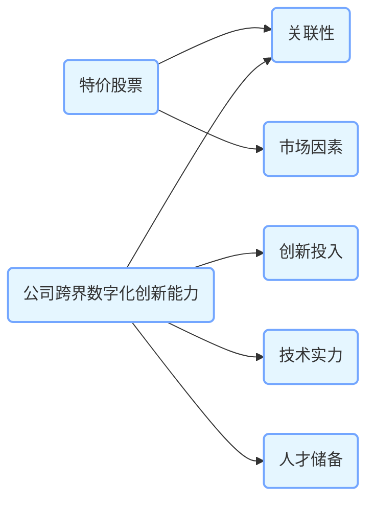

# 特价股票与公司跨界数字化创新能力的关联性研究

> 关键词：特价股票、公司跨界数字化创新能力、关联性、财务指标、市场表现

> 摘要：本文旨在深入研究特价股票与公司跨界数字化创新能力之间的关联性。通过对相关核心概念的阐述、算法原理的分析、数学模型的构建，结合实际案例和应用场景，探讨二者之间的内在联系。文章详细介绍了研究过程中的各个环节，包括背景知识、开发环境搭建、代码实现等，同时推荐了相关的学习资源、开发工具和论文著作。最后总结了未来发展趋势与挑战，并对常见问题进行了解答。

## 1. 背景介绍 
### 1.1 目的和范围
在当今数字化快速发展的时代，公司的跨界数字化创新能力成为影响其市场竞争力和发展潜力的重要因素。而特价股票往往因其价格优势吸引投资者的关注。本研究的目的在于揭示特价股票与公司跨界数字化创新能力之间的关联性，为投资者提供决策参考，同时帮助公司更好地认识自身创新能力对股价的影响。研究范围涵盖了不同行业的上市公司，通过对其财务数据、创新投入、市场表现等多方面的分析来进行深入探究。

### 1.2 预期读者
本文预期读者包括金融投资者、公司管理人员、金融研究人员以及对数字化创新和股票市场感兴趣的人士。对于投资者而言，了解特价股票与公司跨界数字化创新能力的关系有助于做出更明智的投资决策；公司管理人员可以从中获取关于创新能力对股价影响的信息，从而调整公司的战略规划；金融研究人员可以将本文作为进一步研究的参考；而对相关领域感兴趣的人士则可以通过本文了解该领域的基本情况和研究方法。

### 1.3 文档结构概述
本文首先介绍研究的背景信息，包括目的、预期读者和文档结构。接着阐述核心概念，展示其原理和架构，并通过 Mermaid 流程图进行直观呈现。然后详细讲解核心算法原理和具体操作步骤，给出 Python 源代码。之后构建数学模型和公式，并进行详细讲解和举例说明。再通过项目实战，介绍开发环境搭建、源代码实现和代码解读。随后分析实际应用场景，推荐相关的工具和资源，包括学习资源、开发工具框架和论文著作。最后总结未来发展趋势与挑战，解答常见问题，并提供扩展阅读和参考资料。

### 1.4 术语表
#### 1.4.1 核心术语定义
- **特价股票**：指价格相对较低，可能被市场低估的股票。其价格低于同类股票或公司的内在价值。
- **公司跨界数字化创新能力**：公司跨越原有业务领域，利用数字化技术进行创新的能力，包括但不限于引入新的商业模式、开发新的数字化产品或服务等。
- **关联性**：指特价股票与公司跨界数字化创新能力之间的相互关系和影响程度。

#### 1.4.2 相关概念解释
- **数字化转型**：企业利用数字技术对业务进行全面变革，以提高效率、创新能力和竞争力的过程。
- **跨界经营**：企业突破传统业务边界，进入其他行业或领域开展业务的行为。

#### 1.4.3 缩略词列表
- **ROE**：净资产收益率（Return on Equity），衡量公司盈利能力的指标。
- **R&D**：研究与开发（Research and Development），反映公司在创新方面的投入。

## 2. 核心概念与联系 
### 核心概念原理
特价股票的形成可能是由于多种因素，如市场情绪、公司短期业绩不佳等。而公司的跨界数字化创新能力则体现在其是否能够成功进入新的领域并利用数字化手段创造价值。从理论上讲，具有较强跨界数字化创新能力的公司，其未来的增长潜力较大，可能会提升公司的内在价值。当市场未能及时反映这种价值提升时，公司的股票可能会成为特价股票。

### 架构的文本示意图
```plaintext
特价股票 <--关联性--> 公司跨界数字化创新能力
|                      |
|                      |
V                      V
市场因素             创新投入、技术实力、人才储备等
```

### Mermaid 流程图


## 3. 核心算法原理 & 具体操作步骤 
### 核心算法原理
我们可以通过构建一个综合评估模型来衡量公司的跨界数字化创新能力，并结合股票价格等因素来分析二者的关联性。具体步骤如下：
1. **数据收集**：收集公司的财务数据、创新投入数据、市场数据等。
2. **指标构建**：根据收集的数据构建反映公司跨界数字化创新能力的指标，如创新投入占比、数字化业务收入占比等。
3. **模型构建**：使用回归分析等方法构建综合评估模型，将构建的指标与股票价格进行关联分析。

### Python 源代码
```python
import pandas as pd
import numpy as np
from sklearn.linear_model import LinearRegression

# 模拟数据收集
data = {
    'stock_price': [10, 12, 15, 13, 11],
    'innovation_input_ratio': [0.1, 0.15, 0.2, 0.18, 0.12],
    'digital_business_revenue_ratio': [0.2, 0.25, 0.3, 0.28, 0.22]
}
df = pd.DataFrame(data)

# 提取特征和目标变量
X = df[['innovation_input_ratio', 'digital_business_revenue_ratio']]
y = df['stock_price']

# 构建线性回归模型
model = LinearRegression()
model.fit(X, y)

# 输出模型系数
print('模型系数:', model.coef_)
print('模型截距:', model.intercept_)
```

### 具体操作步骤
1. **数据收集**：可以从金融数据库、公司年报等渠道收集相关数据。
2. **数据预处理**：对收集到的数据进行清洗、缺失值处理等操作，确保数据的质量。
3. **指标计算**：根据收集的数据计算反映公司跨界数字化创新能力的指标。
4. **模型训练**：使用构建好的指标和股票价格数据进行模型训练。
5. **模型评估**：使用评估指标（如均方误差、决定系数等）对模型进行评估，确保模型的准确性和可靠性。

## 4. 数学模型和公式 & 详细讲解 & 举例说明 
### 数学模型
我们可以使用线性回归模型来分析特价股票与公司跨界数字化创新能力之间的关联性。线性回归模型的一般形式为：
$$y = \beta_0 + \beta_1x_1 + \beta_2x_2 + \cdots + \beta_nx_n + \epsilon$$
其中，$y$ 表示股票价格，$x_1, x_2, \cdots, x_n$ 表示反映公司跨界数字化创新能力的指标，$\beta_0$ 为截距，$\beta_1, \beta_2, \cdots, \beta_n$ 为回归系数，$\epsilon$ 为误差项。

### 详细讲解
回归系数 $\beta_i$ 表示在其他因素不变的情况下，指标 $x_i$ 每增加一个单位，股票价格 $y$ 的平均变化量。通过估计回归系数，我们可以了解各个指标对股票价格的影响程度。截距 $\beta_0$ 表示当所有指标都为 0 时的股票价格。误差项 $\epsilon$ 表示模型无法解释的随机因素。

### 举例说明
假设我们使用创新投入占比 $x_1$ 和数字化业务收入占比 $x_2$ 作为反映公司跨界数字化创新能力的指标，通过线性回归模型得到的回归方程为：
$$y = 5 + 2x_1 + 3x_2$$
这意味着当创新投入占比增加 1 个单位时，股票价格平均增加 2 个单位；当数字化业务收入占比增加 1 个单位时，股票价格平均增加 3 个单位。当创新投入占比为 0.1，数字化业务收入占比为 0.2 时，预测的股票价格为：
$$y = 5 + 2\times0.1 + 3\times0.2 = 5 + 0.2 + 0.6 = 5.8$$

## 5. 项目实战：代码实际案例和详细解释说明 
### 5.1  开发环境搭建
- **Python 安装**：从 Python 官方网站（https://www.python.org/downloads/）下载并安装 Python 3.x 版本。
- **库安装**：使用 pip 安装所需的库，如 pandas、numpy、sklearn 等。可以使用以下命令进行安装：
```sh
pip install pandas numpy scikit-learn
```

### 5.2  源代码详细实现和代码解读
```python
import pandas as pd
import numpy as np
from sklearn.linear_model import LinearRegression
from sklearn.model_selection import train_test_split
from sklearn.metrics import mean_squared_error

# 读取数据
data = pd.read_csv('stock_data.csv')

# 提取特征和目标变量
X = data[['innovation_input_ratio', 'digital_business_revenue_ratio']]
y = data['stock_price']

# 划分训练集和测试集
X_train, X_test, y_train, y_test = train_test_split(X, y, test_size=0.2, random_state=42)

# 构建线性回归模型
model = LinearRegression()
model.fit(X_train, y_train)

# 预测
y_pred = model.predict(X_test)

# 计算均方误差
mse = mean_squared_error(y_test, y_pred)
print('均方误差:', mse)

# 输出模型系数
print('模型系数:', model.coef_)
print('模型截距:', model.intercept_)
```
### 代码解读
1. **数据读取**：使用 `pandas` 库的 `read_csv` 函数读取存储在 `stock_data.csv` 中的数据。
2. **特征和目标变量提取**：从数据中提取反映公司跨界数字化创新能力的指标作为特征，股票价格作为目标变量。
3. **数据集划分**：使用 `train_test_split` 函数将数据集划分为训练集和测试集，测试集占比为 20%。
4. **模型构建和训练**：使用 `LinearRegression` 类构建线性回归模型，并使用训练集数据进行训练。
5. **预测和评估**：使用训练好的模型对测试集数据进行预测，并计算均方误差来评估模型的性能。
6. **输出模型参数**：输出模型的回归系数和截距。

### 5.3  代码解读与分析
通过上述代码，我们可以看到如何使用 Python 实现对特价股票与公司跨界数字化创新能力关联性的分析。均方误差是衡量模型预测准确性的一个重要指标，均方误差越小，说明模型的预测效果越好。回归系数可以帮助我们了解各个指标对股票价格的影响程度，正的回归系数表示该指标与股票价格呈正相关，负的回归系数表示呈负相关。

## 6. 实际应用场景 
### 投资者决策
投资者可以根据公司的跨界数字化创新能力来评估特价股票的投资价值。如果一家公司具有较强的跨界数字化创新能力，但其股票价格较低，可能是一个潜在的投资机会。投资者可以通过分析公司的创新投入、数字化业务发展情况等指标，结合本文介绍的方法来判断股票是否被低估。

### 公司战略规划
公司管理人员可以通过了解跨界数字化创新能力对股价的影响，制定相应的战略规划。例如，加大在数字化创新方面的投入，积极开展跨界业务，以提升公司的市场竞争力和股价表现。

### 金融研究
金融研究人员可以进一步深入研究特价股票与公司跨界数字化创新能力之间的关系，探索更多的影响因素和分析方法，为金融市场的理论和实践提供参考。

## 7. 工具和资源推荐
### 7.1 学习资源推荐
#### 7.1.1 书籍推荐
- 《金融市场学》：全面介绍金融市场的基本概念、理论和实践，对于理解股票市场有很大帮助。
- 《Python 数据分析实战》：详细介绍如何使用 Python 进行数据分析，包括数据处理、模型构建等内容。
- 《创新管理》：探讨企业创新的理论和方法，有助于了解公司跨界数字化创新的相关知识。

#### 7.1.2 在线课程
- Coursera 上的“金融市场分析”课程：提供系统的金融市场分析知识和方法。
- edX 上的“Python 数据科学”课程：深入讲解 Python 在数据科学领域的应用。
- Udemy 上的“企业创新战略”课程：介绍企业创新的战略规划和实施方法。

#### 7.1.3 技术博客和网站
- 金融界网站：提供丰富的金融市场信息和分析报告。
- 开源中国：有很多关于 Python 编程和数据分析的技术文章和教程。
- 36氪：关注科技创新和创业领域，提供公司跨界数字化创新的相关案例和分析。

### 7.2 开发工具框架推荐
#### 7.2.1 IDE和编辑器
- PyCharm：功能强大的 Python 集成开发环境，提供代码编辑、调试、版本控制等功能。
- Jupyter Notebook：交互式笔记本，适合进行数据分析和模型构建的实验和演示。

#### 7.2.2 调试和性能分析工具
- pdb：Python 内置的调试工具，可以帮助定位代码中的问题。
- cProfile：用于分析 Python 代码的性能，找出性能瓶颈。

#### 7.2.3 相关框架和库
- pandas：用于数据处理和分析，提供高效的数据结构和数据操作方法。
- numpy：提供高性能的多维数组对象和数学函数，是很多数据分析库的基础。
- scikit-learn：用于机器学习算法的实现，包括分类、回归、聚类等算法。

### 7.3 相关论文著作推荐
#### 7.3.1 经典论文
- Fama, E. F., & French, K. R. (1992). The cross-section of expected stock returns. The Journal of Finance, 47(2), 427-465. 该论文提出了著名的 Fama-French 三因子模型，对股票收益率的横截面进行了深入分析。
- Schumpeter, J. A. (1934). The theory of economic development: An inquiry into profits, capital, credit, interest, and the business cycle. Harvard University Press. 熊彼特的经典著作，阐述了创新在经济发展中的重要作用。

#### 7.3.2 最新研究成果
- 关注顶级金融和管理学期刊，如《Journal of Financial Economics》、《Management Science》等，这些期刊会发表关于股票市场和企业创新的最新研究成果。

#### 7.3.3 应用案例分析
- 可以参考一些商业案例分析书籍和网站，如哈佛商业评论案例库，其中有很多关于企业跨界数字化创新和股票市场表现的案例分析。

## 8. 总结：未来发展趋势与挑战
### 未来发展趋势
- **数字化创新加速**：随着科技的不断进步，公司的跨界数字化创新将更加频繁和深入，这将对股票市场产生更深远的影响。
- **数据驱动决策**：投资者和公司管理人员将越来越依赖数据分析来评估公司的跨界数字化创新能力和股票投资价值。
- **跨学科研究增多**：金融、技术、管理等多学科的融合研究将成为未来的发展方向，以更全面地理解特价股票与公司跨界数字化创新能力之间的关系。

### 挑战
- **数据质量和获取难度**：准确评估公司的跨界数字化创新能力需要大量高质量的数据，但数据的获取和清洗可能存在一定的难度。
- **模型复杂性**：随着影响因素的增多，构建准确的评估模型将变得更加复杂，需要考虑更多的因素和交互作用。
- **市场不确定性**：股票市场受到多种因素的影响，市场的不确定性增加了分析特价股票与公司跨界数字化创新能力关联性的难度。

## 9. 附录：常见问题与解答
### 问题 1：如何判断一只股票是否为特价股票？
解答：可以通过比较股票的价格与公司的内在价值、同类股票的价格等方法来判断。常用的指标包括市盈率、市净率等。如果股票的市盈率或市净率明显低于行业平均水平，可能是特价股票。

### 问题 2：公司的跨界数字化创新能力如何衡量？
解答：可以从多个方面进行衡量，如创新投入占比、数字化业务收入占比、专利数量、研发人员占比等。这些指标可以综合反映公司在跨界数字化创新方面的投入和产出。

### 问题 3：线性回归模型是否适用于所有情况？
解答：线性回归模型是一种简单而有效的分析方法，但它假设变量之间存在线性关系。在实际情况中，变量之间的关系可能更为复杂，此时可能需要使用更复杂的模型，如非线性回归模型、机器学习模型等。

### 问题 4：如何提高模型的预测准确性？
解答：可以从以下几个方面入手：收集更多高质量的数据，选择合适的特征和模型，进行模型调优（如调整模型参数），对数据进行预处理（如归一化、标准化）等。

## 10. 扩展阅读 & 参考资料
### 扩展阅读
- 《智能时代》：介绍了人工智能和数字化技术对社会和经济的影响，有助于进一步理解公司跨界数字化创新的背景和趋势。
- 《财务报表分析》：详细讲解如何分析公司的财务报表，对于评估公司的财务状况和内在价值有很大帮助。

### 参考资料
- 金融数据库提供商的官方文档，如 Wind 数据库、东方财富数据库等。
- 公司的年报和公告，可从证券交易所网站获取。
- 相关学术论文和研究报告，可通过学术数据库（如知网、万方、Web of Science 等）查找。

作者：AI天才研究院/AI Genius Institute & 禅与计算机程序设计艺术 /Zen And The Art of Computer Programming