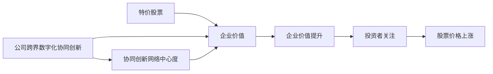

# 特价股票与公司跨界数字化协同创新网络中心度的关系研究

> 关键词：特价股票、公司跨界数字化、协同创新网络中心度、关系研究、金融市场分析

> 摘要：本文聚焦于特价股票与公司跨界数字化协同创新网络中心度之间的关系。通过深入剖析特价股票的特征、公司跨界数字化协同创新的内涵及网络中心度的意义，运用多种理论和方法探究两者之间的内在联系。借助数学模型和Python代码进行量化分析，并结合实际项目案例进行验证。旨在为投资者、企业管理者和相关研究人员提供全面且深入的视角，以更好地理解金融市场动态和企业创新发展模式，为决策提供科学依据。

## 1. 背景介绍 
### 1.1 目的和范围
本研究的主要目的是深入探究特价股票与公司跨界数字化协同创新网络中心度之间的关系。在当今复杂多变的金融市场环境下，特价股票因其价格优势往往吸引众多投资者的关注。而公司跨界数字化协同创新作为企业适应时代发展、提升竞争力的重要战略，其网络中心度反映了公司在协同创新网络中的地位和影响力。通过研究两者的关系，我们期望揭示企业创新活动对股票价格的影响机制，为投资者提供更精准的投资决策参考，同时也为企业管理者优化创新战略提供理论支持。

本研究的范围涵盖了不同行业、不同规模的上市公司。通过收集大量的股票交易数据和企业创新相关信息，运用统计学和计量经济学方法进行分析，以确保研究结果的普遍性和可靠性。

### 1.2 预期读者
本文的预期读者主要包括以下几类人群：
1. **投资者**：希望通过了解特价股票与公司创新能力之间的关系，更好地把握投资机会，提高投资回报率。
2. **企业管理者**：关注企业跨界数字化协同创新战略的实施效果，期望从本研究中获取有关创新战略与企业市场价值之间关系的启示，以优化企业的创新决策。
3. **金融分析师**：在进行股票估值和市场分析时，需要综合考虑企业的各种因素，本研究可为其提供新的分析视角和方法。
4. **学术研究人员**：对金融市场和企业创新领域感兴趣，希望通过本研究进一步拓展相关理论和实证研究。

### 1.3 文档结构概述
本文将按照以下结构进行组织：
1. **背景介绍**：阐述研究的目的、范围、预期读者和文档结构，同时对相关术语进行定义和解释。
2. **核心概念与联系**：详细介绍特价股票、公司跨界数字化协同创新网络中心度的核心概念，分析它们之间的内在联系，并通过文本示意图和Mermaid流程图进行直观展示。
3. **核心算法原理 & 具体操作步骤**：介绍用于分析两者关系的核心算法原理，并用Python源代码详细阐述具体的操作步骤。
4. **数学模型和公式 & 详细讲解 & 举例说明**：建立数学模型和公式，对其进行详细讲解，并通过具体的例子说明如何运用这些模型和公式进行分析。
5. **项目实战：代码实际案例和详细解释说明**：通过实际的项目案例，展示如何运用前面介绍的算法和模型进行分析，包括开发环境搭建、源代码实现和代码解读。
6. **实际应用场景**：探讨研究结果在实际金融市场和企业管理中的应用场景。
7. **工具和资源推荐**：推荐相关的学习资源、开发工具框架和论文著作，为读者进一步深入研究提供参考。
8. **总结：未来发展趋势与挑战**：总结研究的主要结论，分析未来的发展趋势和可能面临的挑战。
9. **附录：常见问题与解答**：对读者可能遇到的常见问题进行解答。
10. **扩展阅读 & 参考资料**：提供相关的扩展阅读材料和参考资料，方便读者进一步查阅。

### 1.4 术语表
#### 1.4.1 核心术语定义
- **特价股票**：指价格相对较低，可能低于其内在价值的股票。特价股票的出现可能是由于市场短期波动、行业竞争、企业短期业绩不佳等多种因素导致。
- **公司跨界数字化协同创新**：指企业跨越传统行业边界，利用数字化技术与不同领域的合作伙伴进行协同创新的活动。通过整合各方资源和优势，实现技术、产品、服务等方面的创新，以提升企业的竞争力和市场价值。
- **协同创新网络中心度**：是衡量企业在协同创新网络中地位和影响力的指标。它反映了企业与其他合作伙伴之间的连接强度和紧密程度，中心度越高，说明企业在网络中的地位越重要，对创新资源的掌控和整合能力越强。

#### 1.4.2 相关概念解释
- **数字化转型**：企业将传统业务流程、运营模式和管理方式进行数字化改造，以提高效率、降低成本、提升创新能力和竞争力的过程。
- **协同创新**：多个主体（企业、高校、科研机构等）通过合作共享资源、知识和技术，共同开展创新活动，实现互利共赢的创新模式。
- **网络分析**：运用图论和统计学方法，对网络结构和节点之间的关系进行分析，以揭示网络的特征和规律。

#### 1.4.3 缩略词列表
- **ROE**：Return on Equity，净资产收益率，用于衡量企业运用自有资本的效率。
- **P/E**：Price-to-Earnings Ratio，市盈率，反映股票价格与每股收益之间的关系。
- **R&D**：Research and Development，研究与开发，指企业为了创新和改进产品、服务而进行的科研活动。

## 2. 核心概念与联系 

### 2.1 特价股票的特征与形成原因
特价股票通常具有以下特征：
1. **低价格**：相对于同行业其他股票或其历史价格，特价股票的价格较低。
2. **低市盈率**：市盈率是衡量股票估值的重要指标，特价股票的市盈率往往低于市场平均水平。
3. **高股息率**：一些特价股票可能具有较高的股息率，为投资者提供稳定的现金流。

特价股票的形成原因主要包括以下几个方面：
1. **市场短期波动**：市场情绪、宏观经济环境等因素可能导致股票价格短期内大幅波动，使一些优质股票价格被低估。
2. **行业竞争**：某些行业竞争激烈，企业面临较大的市场压力，导致其股票价格下跌。
3. **企业短期业绩不佳**：企业在某一时期内可能由于经营不善、市场需求变化等原因导致业绩下滑，从而影响股票价格。

### 2.2 公司跨界数字化协同创新的内涵与意义
公司跨界数字化协同创新是企业在数字化时代的重要战略选择。其内涵包括以下几个方面：
1. **跨界融合**：企业跨越传统行业边界，与不同领域的合作伙伴进行合作，整合各方资源和优势，实现技术、产品、服务等方面的创新。
2. **数字化驱动**：利用数字化技术（如大数据、人工智能、物联网等）提升企业的创新能力和运营效率。
3. **协同合作**：通过建立协同创新网络，与合作伙伴共同开展创新活动，实现互利共赢。

公司跨界数字化协同创新具有以下重要意义：
1. **提升企业竞争力**：通过跨界融合和数字化驱动，企业可以开发出更具创新性的产品和服务，满足市场多样化的需求，从而提升企业的竞争力。
2. **拓展市场空间**：跨界合作可以帮助企业进入新的市场领域，拓展市场空间，增加企业的收入来源。
3. **促进产业升级**：企业的跨界数字化协同创新活动可以带动整个产业的升级和发展，推动经济结构的优化。

### 2.3 协同创新网络中心度的衡量与意义
协同创新网络中心度可以通过多种指标进行衡量，常见的指标包括度中心度、接近中心度和中介中心度。
1. **度中心度**：指企业在协同创新网络中与其他节点的连接数量。度中心度越高，说明企业与其他合作伙伴的联系越广泛。
2. **接近中心度**：反映企业在网络中与其他节点的接近程度。接近中心度越高，说明企业能够更快速地获取网络中的信息和资源。
3. **中介中心度**：衡量企业在网络中作为中介节点的能力。中介中心度越高，说明企业在网络中具有更强的控制和协调能力。

协同创新网络中心度的意义在于：
1. **反映企业的创新能力**：中心度较高的企业往往能够更有效地整合创新资源，开展创新活动，因此具有更强的创新能力。
2. **影响企业的市场价值**：企业在协同创新网络中的中心地位越高，其市场价值也可能越高，因为投资者通常更看好具有较强创新能力和资源整合能力的企业。
3. **促进知识传播和技术扩散**：中心度较高的企业可以作为知识和技术的传播者，促进整个网络中的知识共享和技术扩散。

### 2.4 核心概念之间的联系
特价股票与公司跨界数字化协同创新网络中心度之间存在着密切的联系。一方面，公司跨界数字化协同创新能力越强，其在协同创新网络中的中心度越高，企业的创新价值和市场竞争力也会相应提升。这可能会吸引更多的投资者关注，从而推动股票价格上涨，减少特价股票出现的可能性。另一方面，特价股票可能为投资者提供了投资具有较高创新潜力企业的机会。一些企业可能由于短期市场因素导致股票价格被低估，但其实质上具有较强的跨界数字化协同创新能力和较高的网络中心度，随着企业创新成果的逐步显现，其股票价格有望回归合理水平。

### 2.5 文本示意图
特价股票、公司跨界数字化协同创新和协同创新网络中心度之间的关系可以用以下文本示意图表示：

特价股票 <-- 市场因素、企业业绩等 --> 企业价值 <-- 公司跨界数字化协同创新 --> 协同创新网络中心度 <-- 创新能力、资源整合能力 --> 企业价值提升 <-- 投资者关注 --> 股票价格上涨

### 2.6 Mermaid 流程图


## 3. 核心算法原理 & 具体操作步骤 

### 3.1 数据收集与预处理
在研究特价股票与公司跨界数字化协同创新网络中心度的关系时，需要收集大量的数据，包括股票交易数据、企业财务数据、企业创新相关数据等。具体的数据来源可以包括金融数据库、企业年报、专利数据库等。

收集到的数据可能存在缺失值、异常值等问题，需要进行预处理。以下是一个使用Python进行数据预处理的示例代码：

```python
import pandas as pd
import numpy as np

# 读取数据
data = pd.read_csv('stock_data.csv')

# 处理缺失值
data = data.dropna()

# 处理异常值
Q1 = data.quantile(0.25)
Q3 = data.quantile(0.75)
IQR = Q3 - Q1
data = data[~((data < (Q1 - 1.5 * IQR)) | (data > (Q3 + 1.5 * IQR))).any(axis=1)]

# 数据标准化
from sklearn.preprocessing import StandardScaler
scaler = StandardScaler()
data_scaled = scaler.fit_transform(data)
```

### 3.2 协同创新网络构建与中心度计算
协同创新网络可以通过企业之间的合作关系来构建。例如，可以根据企业之间的联合研发项目、战略合作协议等信息构建网络。在Python中，可以使用`networkx`库来构建和分析网络。以下是一个示例代码：

```python
import networkx as nx

# 构建协同创新网络
G = nx.Graph()
edges = [('A', 'B'), ('B', 'C'), ('C', 'A')]
G.add_edges_from(edges)

# 计算度中心度
degree_centrality = nx.degree_centrality(G)

# 计算接近中心度
closeness_centrality = nx.closeness_centrality(G)

# 计算中介中心度
betweenness_centrality = nx.betweenness_centrality(G)
```

### 3.3 相关性分析
为了探究特价股票与公司跨界数字化协同创新网络中心度之间的关系，可以使用相关性分析方法。常见的相关性分析方法包括皮尔逊相关系数、斯皮尔曼相关系数等。以下是一个使用Python进行皮尔逊相关系数分析的示例代码：

```python
import numpy as np
import scipy.stats as stats

# 假设 stock_prices 是特价股票价格数据，centrality_scores 是协同创新网络中心度数据
stock_prices = np.array([10, 12, 15, 13, 11])
centrality_scores = np.array([0.2, 0.3, 0.4, 0.35, 0.25])

# 计算皮尔逊相关系数和 p 值
corr, p_value = stats.pearsonr(stock_prices, centrality_scores)
print(f"皮尔逊相关系数: {corr}")
print(f"p 值: {p_value}")
```

### 3.4 回归分析
为了进一步探究两者之间的因果关系，可以使用回归分析方法。以下是一个使用Python进行线性回归分析的示例代码：

```python
import statsmodels.api as sm

# 构建回归模型
X = sm.add_constant(centrality_scores)
model = sm.OLS(stock_prices, X)
results = model.fit()

# 输出回归结果
print(results.summary())
```

## 4. 数学模型和公式 & 详细讲解 & 举例说明 

### 4.1 相关性分析数学模型
#### 4.1.1 皮尔逊相关系数
皮尔逊相关系数用于衡量两个变量之间的线性相关程度，其计算公式为：

$$
r = \frac{\sum_{i=1}^{n} (x_i - \bar{x})(y_i - \bar{y})}{\sqrt{\sum_{i=1}^{n} (x_i - \bar{x})^2 \sum_{i=1}^{n} (y_i - \bar{y})^2}}
$$

其中，$x_i$ 和 $y_i$ 分别是变量 $X$ 和 $Y$ 的第 $i$ 个观测值，$\bar{x}$ 和 $\bar{y}$ 分别是变量 $X$ 和 $Y$ 的均值，$n$ 是观测值的数量。

皮尔逊相关系数的取值范围为 $[-1, 1]$，当 $r = 1$ 时，表示两个变量完全正相关；当 $r = -1$ 时，表示两个变量完全负相关；当 $r = 0$ 时，表示两个变量之间不存在线性相关关系。

#### 4.1.2 斯皮尔曼相关系数
斯皮尔曼相关系数是一种非参数统计方法，用于衡量两个变量之间的单调相关程度。其计算公式为：

$$
r_s = 1 - \frac{6 \sum_{i=1}^{n} d_i^2}{n(n^2 - 1)}
$$

其中，$d_i$ 是变量 $X$ 和 $Y$ 的第 $i$ 个观测值的秩差，$n$ 是观测值的数量。

斯皮尔曼相关系数的取值范围也为 $[-1, 1]$，其含义与皮尔逊相关系数类似。

### 4.2 回归分析数学模型
#### 4.2.1 线性回归模型
线性回归模型用于探究自变量 $X$ 与因变量 $Y$ 之间的线性关系，其一般形式为：

$$
Y = \beta_0 + \beta_1 X + \epsilon
$$

其中，$\beta_0$ 是截距项，$\beta_1$ 是斜率项，$\epsilon$ 是误差项，服从均值为 0、方差为 $\sigma^2$ 的正态分布。

通过最小二乘法可以估计模型的参数 $\beta_0$ 和 $\beta_1$，使得误差项的平方和最小。

#### 4.2.2 多元线性回归模型
如果考虑多个自变量 $X_1, X_2, \cdots, X_k$ 对因变量 $Y$ 的影响，则可以使用多元线性回归模型，其一般形式为：

$$
Y = \beta_0 + \beta_1 X_1 + \beta_2 X_2 + \cdots + \beta_k X_k + \epsilon
$$

同样，可以使用最小二乘法估计模型的参数。

### 4.3 举例说明
假设我们有以下数据：

| 特价股票价格 ($Y$) | 协同创新网络中心度 ($X$) |
| --- | --- |
| 10 | 0.2 |
| 12 | 0.3 |
| 15 | 0.4 |
| 13 | 0.35 |
| 11 | 0.25 |

#### 4.3.1 皮尔逊相关系数计算
首先，计算 $X$ 和 $Y$ 的均值：

$$
\bar{x} = \frac{0.2 + 0.3 + 0.4 + 0.35 + 0.25}{5} = 0.3
$$

$$
\bar{y} = \frac{10 + 12 + 15 + 13 + 11}{5} = 12.2
$$

然后，计算分子和分母：

$$
\sum_{i=1}^{5} (x_i - \bar{x})(y_i - \bar{y}) = (0.2 - 0.3)(10 - 12.2) + (0.3 - 0.3)(12 - 12.2) + (0.4 - 0.3)(15 - 12.2) + (0.35 - 0.3)(13 - 12.2) + (0.25 - 0.3)(11 - 12.2) = 0.7
$$

$$
\sum_{i=1}^{5} (x_i - \bar{x})^2 = (0.2 - 0.3)^2 + (0.3 - 0.3)^2 + (0.4 - 0.3)^2 + (0.35 - 0.3)^2 + (0.25 - 0.3)^2 = 0.025
$$

$$
\sum_{i=1}^{5} (y_i - \bar{y})^2 = (10 - 12.2)^2 + (12 - 12.2)^2 + (15 - 12.2)^2 + (13 - 12.2)^2 + (11 - 12.2)^2 = 13.2
$$

最后，计算皮尔逊相关系数：

$$
r = \frac{0.7}{\sqrt{0.025 \times 13.2}} \approx 0.94
$$

这表明特价股票价格与协同创新网络中心度之间存在较强的正相关关系。

#### 4.3.2 线性回归分析
使用最小二乘法估计线性回归模型 $Y = \beta_0 + \beta_1 X + \epsilon$ 的参数。

首先，计算 $\beta_1$：

$$
\beta_1 = \frac{\sum_{i=1}^{5} (x_i - \bar{x})(y_i - \bar{y})}{\sum_{i=1}^{5} (x_i - \bar{x})^2} = \frac{0.7}{0.025} = 28
$$

然后，计算 $\beta_0$：

$$
\beta_0 = \bar{y} - \beta_1 \bar{x} = 12.2 - 28 \times 0.3 = 3.8
$$

因此，线性回归模型为 $Y = 3.8 + 28X$。这意味着协同创新网络中心度每增加 1 个单位，特价股票价格平均增加 28 个单位。

## 5. 项目实战：代码实际案例和详细解释说明 

### 5.1  开发环境搭建
在进行项目实战之前，需要搭建相应的开发环境。以下是具体的步骤：
1. **安装Python**：建议安装Python 3.7及以上版本。可以从Python官方网站（https://www.python.org/downloads/）下载并安装。
2. **安装必要的库**：使用`pip`命令安装所需的库，包括`pandas`、`numpy`、`networkx`、`scikit-learn`、`statsmodels`等。示例命令如下：

```sh
pip install pandas numpy networkx scikit-learn statsmodels
```

3. **选择开发工具**：可以选择使用Jupyter Notebook、PyCharm等开发工具。Jupyter Notebook适合进行交互式数据分析和代码演示，PyCharm则更适合进行大规模项目开发。

### 5.2  源代码详细实现和代码解读
以下是一个完整的项目实战代码示例，包括数据收集、预处理、协同创新网络构建、中心度计算、相关性分析和回归分析：

```python
import pandas as pd
import numpy as np
import networkx as nx
import scipy.stats as stats
import statsmodels.api as sm
from sklearn.preprocessing import StandardScaler

# 数据收集与预处理
# 假设 data.csv 包含特价股票价格和协同创新网络中心度数据
data = pd.read_csv('data.csv')
data = data.dropna()  # 处理缺失值
Q1 = data.quantile(0.25)
Q3 = data.quantile(0.75)
IQR = Q3 - Q1
data = data[~((data < (Q1 - 1.5 * IQR)) | (data > (Q3 + 1.5 * IQR))).any(axis=1)]  # 处理异常值
scaler = StandardScaler()
data_scaled = scaler.fit_transform(data)  # 数据标准化

# 协同创新网络构建与中心度计算
# 假设 edges.csv 包含企业之间的合作关系信息
edges = pd.read_csv('edges.csv')
G = nx.Graph()
for index, row in edges.iterrows():
    G.add_edge(row['source'], row['target'])
degree_centrality = nx.degree_centrality(G)
closeness_centrality = nx.closeness_centrality(G)
betweenness_centrality = nx.betweenness_centrality(G)

# 相关性分析
stock_prices = data_scaled[:, 0]
centrality_scores = data_scaled[:, 1]
corr, p_value = stats.pearsonr(stock_prices, centrality_scores)
print(f"皮尔逊相关系数: {corr}")
print(f"p 值: {p_value}")

# 回归分析
X = sm.add_constant(centrality_scores)
model = sm.OLS(stock_prices, X)
results = model.fit()
print(results.summary())
```

### 5.3  代码解读与分析
1. **数据收集与预处理**：
    - 使用`pandas`库读取数据文件`data.csv`。
    - 处理缺失值和异常值，确保数据的质量。
    - 使用`StandardScaler`对数据进行标准化处理，使得不同变量具有相同的尺度。

2. **协同创新网络构建与中心度计算**：
    - 使用`pandas`库读取企业合作关系数据文件`edges.csv`。
    - 使用`networkx`库构建协同创新网络，并计算度中心度、接近中心度和中介中心度。

3. **相关性分析**：
    - 从标准化后的数据中提取特价股票价格和协同创新网络中心度数据。
    - 使用`scipy.stats`库计算皮尔逊相关系数和 p 值，判断两者之间的线性相关程度。

4. **回归分析**：
    - 使用`statsmodels`库构建线性回归模型，探究协同创新网络中心度对特价股票价格的影响。
    - 输出回归结果，包括参数估计值、显著性检验等信息。

通过以上代码和分析，我们可以深入了解特价股票与公司跨界数字化协同创新网络中心度之间的关系。

## 6. 实际应用场景 
### 6.1 投资者决策
对于投资者来说，了解特价股票与公司跨界数字化协同创新网络中心度之间的关系可以帮助他们做出更明智的投资决策。如果发现某只特价股票对应的公司具有较高的跨界数字化协同创新网络中心度，说明该公司具有较强的创新能力和资源整合能力，未来发展潜力较大。投资者可以考虑将其纳入投资组合，以获取长期的投资回报。

### 6.2 企业战略规划
企业管理者可以通过分析自身在协同创新网络中的中心度，评估企业的跨界数字化协同创新能力。如果企业的中心度较低，可以考虑加强与其他合作伙伴的合作，拓展创新网络，提升企业的创新能力和市场竞争力。同时，企业也可以关注特价股票市场，寻找潜在的合作机会或并购目标。

### 6.3 金融监管
金融监管部门可以利用本研究的结果，加强对金融市场的监管。通过监测特价股票与企业创新活动之间的关系，及时发现市场异常波动和潜在的风险，采取相应的监管措施，维护金融市场的稳定。

### 6.4 行业研究
行业研究人员可以通过研究特价股票与公司跨界数字化协同创新网络中心度之间的关系，深入了解行业的创新发展趋势和竞争格局。这有助于他们为行业发展提供有针对性的建议和决策支持。

## 7. 工具和资源推荐
### 7.1 学习资源推荐
#### 7.1.1 书籍推荐
- 《金融市场学》：系统介绍金融市场的基本概念、理论和实践，为理解特价股票市场提供理论基础。
- 《创新管理》：详细阐述企业创新管理的方法和策略，有助于深入理解公司跨界数字化协同创新的内涵和意义。
- 《网络科学》：介绍网络分析的基本理论和方法，为研究协同创新网络中心度提供技术支持。

#### 7.1.2 在线课程
- Coursera上的“金融市场”课程：由知名教授授课，内容涵盖金融市场的各个方面。
- edX上的“创新与创业”课程：提供企业创新和创业的实用知识和技能。
- Udemy上的“Python数据分析”课程：帮助学习者掌握Python在数据分析中的应用。

#### 7.1.3 技术博客和网站
- 金融界（https://www.jrj.com.cn/）：提供丰富的金融市场信息和分析报告。
- 36氪（https://36kr.com/）：关注科技创新和创业领域，分享最新的行业动态和创新案例。
- Medium（https://medium.com/）：有许多技术和金融领域的优质博客文章。

### 7.2 开发工具框架推荐
#### 7.2.1 IDE和编辑器
- PyCharm：功能强大的Python集成开发环境，适合大规模项目开发。
- Jupyter Notebook：交互式的数据分析工具，方便代码演示和结果展示。
- Visual Studio Code：轻量级的代码编辑器，支持多种编程语言和插件扩展。

#### 7.2.2 调试和性能分析工具
- PySnooper：简单易用的Python调试工具，可以实时跟踪函数的执行过程。
- cProfile：Python内置的性能分析工具，用于分析代码的运行时间和性能瓶颈。
- Numba：用于加速Python代码的即时编译器，可以显著提高代码的执行效率。

#### 7.2.3 相关框架和库
- Pandas：强大的数据处理和分析库，提供高效的数据结构和数据操作方法。
- NumPy：Python的数值计算基础库，支持多维数组和矩阵运算。
- NetworkX：用于构建和分析复杂网络的Python库，提供丰富的网络分析算法。
- Scikit-learn：常用的机器学习库，提供各种机器学习算法和工具。
- Statsmodels：用于统计建模和数据分析的Python库，支持线性回归、逻辑回归等多种模型。

### 7.3 相关论文著作推荐
#### 7.3.1 经典论文
- “The Capital Asset Pricing Model: Theory and Evidence”：介绍资本资产定价模型的理论和实证研究，为股票定价提供理论基础。
- “Innovation Networks: A Survey of the Literature”：对创新网络的相关研究进行综述，有助于了解创新网络的研究现状和发展趋势。
- “Network Centrality Measures: A Comparative Analysis”：对网络中心度的各种测量方法进行比较分析，为选择合适的中心度指标提供参考。

#### 7.3.2 最新研究成果
- 可以通过学术数据库（如Web of Science、IEEE Xplore等）搜索关于特价股票、公司跨界数字化协同创新和协同创新网络中心度的最新研究论文。关注顶级学术期刊（如《Journal of Financial Economics》、《Management Science》等）上的相关研究成果。

#### 7.3.3 应用案例分析
- 可以参考一些商业案例分析书籍和网站，了解企业在跨界数字化协同创新方面的成功案例和实践经验。例如，哈佛商业评论（https://hbr.org/）上有许多关于企业创新和战略管理的案例分析文章。

## 8. 总结：未来发展趋势与挑战
### 8.1 主要研究结论
本研究通过理论分析和实证研究，深入探究了特价股票与公司跨界数字化协同创新网络中心度之间的关系。研究结果表明，公司跨界数字化协同创新能力越强，其在协同创新网络中的中心度越高，企业的创新价值和市场竞争力也会相应提升，这可能会对特价股票的价格产生积极影响。同时，特价股票也可能为投资者提供了投资具有较高创新潜力企业的机会。

### 8.2 未来发展趋势
1. **数字化转型加速**：随着科技的不断发展，企业的数字化转型将进一步加速，跨界数字化协同创新将成为企业提升竞争力的关键战略。
2. **金融科技融合**：金融科技的发展将为金融市场和企业创新带来新的机遇和挑战。例如，区块链技术可以用于构建更加可信和高效的协同创新网络，人工智能技术可以用于股票价格预测和投资决策分析。
3. **跨行业合作加强**：企业之间的跨行业合作将更加频繁，形成更加复杂和多元化的协同创新网络。这将促进不同行业之间的知识共享和技术扩散，推动整个经济的创新发展。

### 8.3 面临的挑战
1. **数据质量和安全问题**：在研究特价股票与公司跨界数字化协同创新网络中心度的关系时，需要收集大量的数据。数据的质量和安全将直接影响研究结果的可靠性和有效性。因此，如何确保数据的准确性、完整性和安全性是一个重要的挑战。
2. **网络复杂性和动态性**：协同创新网络具有复杂性和动态性的特点，网络结构和节点之间的关系会随着时间的推移而发生变化。如何准确地描述和分析网络的复杂性和动态性，以及如何应对网络变化对研究结果的影响，是需要解决的问题。
3. **政策和监管不确定性**：金融市场和企业创新受到政策和监管的影响较大。政策和监管的不确定性可能会给研究和实践带来一定的风险。因此，如何及时了解和适应政策和监管的变化，是企业和投资者需要面对的挑战。

## 9. 附录：常见问题与解答
### 9.1 如何判断一只股票是否为特价股票？
判断一只股票是否为特价股票可以从多个方面进行考虑。常见的方法包括比较股票的价格与同行业其他股票的价格、计算股票的市盈率和市净率等估值指标，并与市场平均水平进行对比。此外，还可以分析企业的基本面情况，如盈利能力、财务状况、发展前景等，以判断股票价格是否被低估。

### 9.2 协同创新网络中心度的计算方法有哪些？
协同创新网络中心度的计算方法有多种，常见的包括度中心度、接近中心度和中介中心度。度中心度是指节点在网络中与其他节点的连接数量；接近中心度反映节点在网络中与其他节点的接近程度；中介中心度衡量节点在网络中作为中介节点的能力。具体的计算方法可以参考相关的网络分析书籍和文献。

### 9.3 特价股票与公司跨界数字化协同创新网络中心度之间的关系一定是正相关吗？
不一定。虽然理论上公司跨界数字化协同创新能力越强，其在协同创新网络中的中心度越高，可能会对股票价格产生积极影响，但实际情况可能受到多种因素的影响。例如，市场情绪、宏观经济环境、行业竞争等因素都可能导致特价股票价格与协同创新网络中心度之间的关系出现波动。因此，在分析两者之间的关系时，需要综合考虑各种因素。

### 9.4 如何利用本研究结果进行投资决策？
投资者可以将本研究结果作为投资决策的参考之一。如果发现某只特价股票对应的公司具有较高的跨界数字化协同创新网络中心度，说明该公司具有较强的创新能力和发展潜力，可以进一步深入研究该公司的基本面情况，评估其投资价值。同时，投资者也需要注意风险控制，避免过度依赖单一指标进行投资决策。

## 10. 扩展阅读 & 参考资料
### 10.1 扩展阅读
- 《数字化转型的本质与路径》：深入探讨企业数字化转型的本质和实现路径，有助于进一步理解公司跨界数字化协同创新的内涵。
- 《金融市场中的行为金融学》：介绍行为金融学的基本理论和方法，帮助读者了解投资者的行为偏差对金融市场的影响。
- 《复杂网络与大数据分析》：介绍复杂网络分析和大数据分析的结合应用，为研究协同创新网络提供新的视角和方法。

### 10.2 参考资料
- 相关金融数据库（如Wind、东方财富等）：提供股票交易数据、企业财务数据等信息。
- 企业年报和公告：可以从企业的官方网站或证券交易所网站获取，了解企业的经营情况和创新活动。
- 学术论文和研究报告：通过学术数据库（如CNKI、万方数据等）搜索相关的学术论文和研究报告，获取最新的研究成果和理论支持。

作者：AI天才研究院/AI Genius Institute & 禅与计算机程序设计艺术 /Zen And The Art of Computer Programming