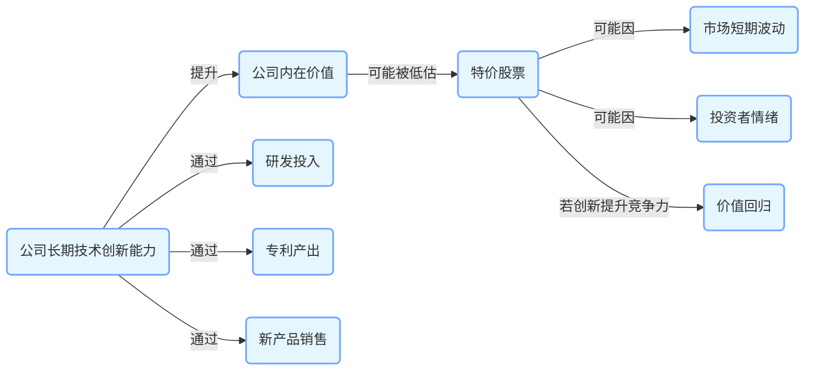

# 特价股票与公司长期技术创新能力的相关性分析

> 关键词：特价股票、公司长期技术创新能力、相关性分析、财务指标、创新指标

> 摘要：本文旨在深入探讨特价股票与公司长期技术创新能力之间的相关性。通过对特价股票的定义、特征以及公司长期技术创新能力的内涵、衡量指标进行详细阐述，运用多种分析方法和数学模型，结合实际案例，揭示两者之间的内在联系。同时，探讨这种相关性在实际投资和企业发展中的应用场景，并提供相关的学习资源、开发工具和研究论文推荐。最后，对未来发展趋势和挑战进行总结，为投资者和企业管理者提供有价值的参考。

## 1. 背景介绍 
### 1.1 目的和范围
本研究的主要目的是探究特价股票与公司长期技术创新能力之间的关联，明确这种相关性是否存在以及其具体表现形式。研究范围涵盖了不同行业、不同规模的上市公司，通过收集和分析这些公司的股票价格数据、财务数据以及技术创新相关数据，来深入挖掘两者之间的关系。

### 1.2 预期读者
本文的预期读者包括投资者、企业管理者、金融分析师、学术研究人员等。对于投资者来说，了解特价股票与公司技术创新能力的相关性有助于做出更明智的投资决策；企业管理者可以从中获得关于企业创新战略和市场价值的启示；金融分析师能够借助研究结果提供更准确的市场分析和投资建议；学术研究人员则可以将其作为进一步研究的参考。

### 1.3 文档结构概述
本文首先对核心概念进行详细解释，明确特价股票和公司长期技术创新能力的定义和内涵，并阐述它们之间的联系。接着介绍用于分析两者相关性的核心算法原理和具体操作步骤，同时给出相应的数学模型和公式，并通过举例进行说明。然后通过实际项目案例，展示如何在实际中应用这些方法进行相关性分析。之后探讨这种相关性在实际中的应用场景，并推荐相关的学习资源、开发工具和研究论文。最后对未来发展趋势和挑战进行总结，并解答常见问题，提供扩展阅读和参考资料。

### 1.4 术语表
#### 1.4.1 核心术语定义
- **特价股票**：指市场价格相对其内在价值或行业平均水平较低的股票。特价股票可能由于市场短期波动、投资者情绪等因素导致价格被低估。
- **公司长期技术创新能力**：是指公司在较长时间内持续投入资源进行技术研发、创新，并将创新成果转化为实际产品或服务，从而提升公司核心竞争力和市场地位的能力。

#### 1.4.2 相关概念解释
- **内在价值**：股票的内在价值是指股票未来现金流的现值，它反映了公司的真实经济价值。内在价值的评估通常基于公司的财务状况、盈利能力、发展前景等因素。
- **技术创新投入**：包括研发费用、研发人员数量等，是衡量公司对技术创新重视程度和投入力度的指标。
- **技术创新产出**：如专利数量、新产品销售额等，反映了公司技术创新的成果和市场转化能力。

#### 1.4.3 缩略词列表
- **R&D**：Research and Development，研发
- **ROE**：Return on Equity，净资产收益率

## 2. 核心概念与联系 

### 2.1 特价股票的概念和特征
特价股票通常具有以下特征：
- **低市盈率（P/E）**：市盈率是股票价格与每股收益的比率，低市盈率意味着股票价格相对较低，可能被市场低估。
- **低市净率（P/B）**：市净率是股票价格与每股净资产的比率，低市净率表示股票价格低于公司的净资产价值。
- **高股息率**：股息率是股息与股票价格的比率，高股息率说明公司在盈利的情况下向股东分配较多的股息，具有一定的投资价值。

### 2.2 公司长期技术创新能力的内涵和衡量指标
公司长期技术创新能力的内涵包括技术研发能力、创新管理能力、创新资源整合能力等方面。衡量指标主要有：
- **研发投入强度**：研发费用占营业收入的比例，反映了公司对技术创新的重视程度和投入力度。
- **专利数量**：专利是公司技术创新成果的重要体现，专利数量越多，说明公司的技术创新能力越强。
- **新产品销售额占比**：新产品销售额占总销售额的比例，反映了公司将创新成果转化为市场价值的能力。

### 2.3 特价股票与公司长期技术创新能力的联系
从理论上讲，具有较强长期技术创新能力的公司，其未来发展潜力较大，内在价值也会不断提升。然而，由于市场的短期波动和投资者的情绪因素，这些公司的股票价格可能会被低估，从而成为特价股票。另一方面，特价股票也可能是由于公司短期经营困难或市场误解导致的，如果公司能够通过技术创新提升自身竞争力，那么这些特价股票也有可能实现价值回归。

### 2.4 核心概念原理和架构的文本示意图
```plaintext
特价股票
|-- 低市盈率
|-- 低市净率
|-- 高股息率

公司长期技术创新能力
|-- 研发投入强度
|-- 专利数量
|-- 新产品销售额占比

相关性
|-- 技术创新提升公司价值，可能形成特价股票
|-- 特价股票公司通过创新实现价值回归
```

### 2.5 Mermaid 流程图


## 3. 核心算法原理 & 具体操作步骤 

### 3.1 相关性分析的算法原理
在分析特价股票与公司长期技术创新能力的相关性时，我们可以使用多种统计方法，如皮尔逊相关系数、斯皮尔曼相关系数等。这里以皮尔逊相关系数为例进行说明。

皮尔逊相关系数用于衡量两个变量之间的线性相关程度，其取值范围为 -1 到 1。当相关系数为 1 时，表示两个变量完全正相关；当相关系数为 -1 时，表示两个变量完全负相关；当相关系数为 0 时，表示两个变量之间不存在线性相关关系。

### 3.2 具体操作步骤
#### 3.2.1 数据收集
收集上市公司的股票价格数据、财务数据以及技术创新相关数据。股票价格数据可以从证券交易所或金融数据提供商处获取；财务数据可以从公司的年报、季报中获取；技术创新相关数据可以从专利局网站、公司公告等渠道获取。

#### 3.2.2 数据预处理
对收集到的数据进行清洗、整理和标准化处理。清洗数据是指去除缺失值、异常值等；整理数据是指将数据按照一定的格式进行排列；标准化处理是指将数据进行归一化处理，使其具有可比性。

#### 3.2.3 计算相关系数
使用 Python 中的 `numpy` 库计算皮尔逊相关系数。以下是具体的 Python 代码：
```python
import numpy as np

# 示例数据
stock_prices = np.array([10, 12, 15, 13, 14])  # 特价股票价格数据
innovation_indicators = np.array([20, 22, 25, 23, 24])  # 公司技术创新指标数据

# 计算皮尔逊相关系数
correlation_coefficient = np.corrcoef(stock_prices, innovation_indicators)[0, 1]

print("皮尔逊相关系数:", correlation_coefficient)
```

#### 3.2.4 结果分析
根据计算得到的相关系数，分析特价股票与公司长期技术创新能力之间的相关性。如果相关系数为正且接近 1，则说明两者之间存在较强的正相关关系；如果相关系数为负且接近 -1，则说明两者之间存在较强的负相关关系；如果相关系数接近 0，则说明两者之间不存在明显的线性相关关系。

## 4. 数学模型和公式 & 详细讲解 & 举例说明 

### 4.1 皮尔逊相关系数的数学模型和公式
皮尔逊相关系数的计算公式为：
$$
r = \frac{\sum_{i=1}^{n}(x_i - \bar{x})(y_i - \bar{y})}{\sqrt{\sum_{i=1}^{n}(x_i - \bar{x})^2 \sum_{i=1}^{n}(y_i - \bar{y})^2}}
$$
其中，$x_i$ 和 $y_i$ 分别是变量 $X$ 和 $Y$ 的第 $i$ 个观测值，$\bar{x}$ 和 $\bar{y}$ 分别是变量 $X$ 和 $Y$ 的均值，$n$ 是观测值的数量。

### 4.2 详细讲解
分子部分 $\sum_{i=1}^{n}(x_i - \bar{x})(y_i - \bar{y})$ 表示变量 $X$ 和 $Y$ 的离差乘积之和，反映了两个变量之间的协同变化程度。分母部分 $\sqrt{\sum_{i=1}^{n}(x_i - \bar{x})^2 \sum_{i=1}^{n}(y_i - \bar{y})^2}$ 是对分子的标准化处理，使得相关系数的取值范围在 -1 到 1 之间。

### 4.3 举例说明
假设有两家公司 A 和 B，我们收集了它们连续 5 年的股票价格和研发投入数据，如下表所示：
| 年份 | 公司 A 股票价格（元） | 公司 A 研发投入（万元） | 公司 B 股票价格（元） | 公司 B 研发投入（万元） |
|------|----------------------|------------------------|----------------------|------------------------|
| 1    | 10                   | 20                     | 15                   | 30                     |
| 2    | 12                   | 22                     | 16                   | 32                     |
| 3    | 15                   | 25                     | 18                   | 35                     |
| 4    | 13                   | 23                     | 17                   | 33                     |
| 5    | 14                   | 24                     | 19                   | 36                     |

我们可以使用上述公式计算公司 A 股票价格与研发投入之间的皮尔逊相关系数：
首先，计算均值：
$\bar{x}_A = \frac{10 + 12 + 15 + 13 + 14}{5} = 12.8$
$\bar{y}_A = \frac{20 + 22 + 25 + 23 + 24}{5} = 22.8$

然后，计算离差乘积之和：
$\sum_{i=1}^{5}(x_{A_i} - \bar{x}_A)(y_{A_i} - \bar{y}_A) = (10 - 12.8)(20 - 22.8) + (12 - 12.8)(22 - 22.8) + (15 - 12.8)(25 - 22.8) + (13 - 12.8)(23 - 22.8) + (14 - 12.8)(24 - 22.8) = 10.4$

接着，计算离差平方和：
$\sum_{i=1}^{5}(x_{A_i} - \bar{x}_A)^2 = (10 - 12.8)^2 + (12 - 12.8)^2 + (15 - 12.8)^2 + (13 - 12.8)^2 + (14 - 12.8)^2 = 10.8$
$\sum_{i=1}^{5}(y_{A_i} - \bar{y}_A)^2 = (20 - 22.8)^2 + (22 - 22.8)^2 + (25 - 22.8)^2 + (23 - 22.8)^2 + (24 - 22.8)^2 = 10.8$

最后，计算相关系数：
$r_A = \frac{10.4}{\sqrt{10.8 \times 10.8}} \approx 0.963$

同理，我们可以计算公司 B 股票价格与研发投入之间的皮尔逊相关系数。通过比较两家公司的相关系数，我们可以分析特价股票与公司长期技术创新能力之间的相关性。

## 5. 项目实战：代码实际案例和详细解释说明 

### 5.1  开发环境搭建
在进行项目实战之前，我们需要搭建相应的开发环境。以下是具体的步骤：
#### 5.1.1 安装 Python
从 Python 官方网站（https://www.python.org/downloads/）下载并安装 Python 3.x 版本。

#### 5.1.2 安装必要的库
使用 `pip` 命令安装以下必要的库：
```sh
pip install numpy pandas matplotlib scikit-learn
```
其中，`numpy` 用于数值计算，`pandas` 用于数据处理，`matplotlib` 用于数据可视化，`scikit-learn` 用于机器学习算法。

### 5.2  源代码详细实现和代码解读
以下是一个完整的 Python 代码示例，用于分析特价股票与公司长期技术创新能力的相关性：
```python
import numpy as np
import pandas as pd
import matplotlib.pyplot as plt
from sklearn.preprocessing import StandardScaler

# 读取数据
data = pd.read_csv('stock_innovation_data.csv')

# 提取特价股票价格和技术创新指标数据
stock_prices = data['stock_price'].values
innovation_indicators = data['innovation_indicator'].values

# 数据标准化处理
scaler = StandardScaler()
stock_prices_scaled = scaler.fit_transform(stock_prices.reshape(-1, 1)).flatten()
innovation_indicators_scaled = scaler.fit_transform(innovation_indicators.reshape(-1, 1)).flatten()

# 计算皮尔逊相关系数
correlation_coefficient = np.corrcoef(stock_prices_scaled, innovation_indicators_scaled)[0, 1]

# 绘制散点图
plt.scatter(stock_prices_scaled, innovation_indicators_scaled)
plt.xlabel('Scaled Stock Prices')
plt.ylabel('Scaled Innovation Indicators')
plt.title(f'Correlation Coefficient: {correlation_coefficient:.2f}')
plt.show()

print("皮尔逊相关系数:", correlation_coefficient)
```
### 代码解读：
1. **数据读取**：使用 `pandas` 库的 `read_csv` 函数读取存储特价股票价格和技术创新指标数据的 CSV 文件。
2. **数据提取**：从读取的数据中提取特价股票价格和技术创新指标数据，并将其转换为 `numpy` 数组。
3. **数据标准化处理**：使用 `sklearn` 库的 `StandardScaler` 类对数据进行标准化处理，使得数据具有可比性。
4. **计算皮尔逊相关系数**：使用 `numpy` 库的 `corrcoef` 函数计算标准化后的数据之间的皮尔逊相关系数。
5. **绘制散点图**：使用 `matplotlib` 库绘制特价股票价格和技术创新指标数据的散点图，并在图中显示相关系数。
6. **输出结果**：打印计算得到的皮尔逊相关系数。

### 5.3  代码解读与分析
通过上述代码，我们可以直观地看到特价股票价格和技术创新指标之间的相关性。如果散点图呈现出明显的线性趋势，且相关系数接近 1 或 -1，则说明两者之间存在较强的相关性；如果散点图比较分散，且相关系数接近 0，则说明两者之间不存在明显的线性相关性。

需要注意的是，皮尔逊相关系数只能衡量两个变量之间的线性相关关系，对于非线性相关关系可能无法准确反映。因此，在实际应用中，我们还可以结合其他方法，如非线性回归分析、机器学习算法等，来更全面地分析特价股票与公司长期技术创新能力之间的相关性。

## 6. 实际应用场景 
### 6.1 投资决策
对于投资者来说，了解特价股票与公司长期技术创新能力的相关性可以帮助他们做出更明智的投资决策。如果发现某只特价股票对应的公司具有较强的长期技术创新能力，那么这只股票可能具有较大的投资价值，因为公司的技术创新能力有望推动其未来业绩增长，从而实现股票价格的上升。相反，如果特价股票对应的公司技术创新能力较弱，那么投资该股票可能面临较大的风险。

### 6.2 企业战略规划
企业管理者可以通过分析特价股票与公司长期技术创新能力的相关性，来制定合理的企业战略规划。如果公司的股票价格被低估，但具有较强的技术创新能力，那么企业可以加大技术创新投入，进一步提升自身竞争力，实现价值回归。同时，企业也可以通过提高市场对其技术创新能力的认知度，来提升股票价格。

### 6.3 金融监管
金融监管机构可以利用特价股票与公司长期技术创新能力的相关性分析，来监测市场的有效性和稳定性。如果发现市场上存在大量特价股票，但这些股票对应的公司技术创新能力较强，可能意味着市场存在信息不对称或投资者情绪过度波动的问题，监管机构可以采取相应的措施来维护市场秩序。

## 7. 工具和资源推荐
### 7.1 学习资源推荐
#### 7.1.1 书籍推荐
- 《证券分析》（Security Analysis）：由本杰明·格雷厄姆（Benjamin Graham）和戴维·多德（David Dodd）所著，是价值投资领域的经典著作，书中介绍了如何分析股票的内在价值，对于理解特价股票的概念和分析方法具有重要的指导意义。
- 《创新者的窘境》（The Innovator's Dilemma）：作者克莱顿·克里斯坦森（Clayton Christensen）深入探讨了公司在技术创新过程中面临的挑战和机遇，对于理解公司长期技术创新能力的内涵和影响因素具有很大的帮助。

#### 7.1.2 在线课程
- Coursera 平台上的“Financial Markets”课程：由耶鲁大学的罗伯特·席勒（Robert Shiller）教授授课，课程涵盖了金融市场的基本原理、股票投资分析等内容，对于学习股票投资和分析方法非常有帮助。
- edX 平台上的“Technological Innovation: Management, Policy, and Strategy”课程：介绍了技术创新的管理、政策和战略等方面的知识，有助于提升对公司长期技术创新能力的理解和分析能力。

#### 7.1.3 技术博客和网站
- Seeking Alpha（https://seekingalpha.com/）：一个提供股票分析、投资建议和市场评论的网站，上面有很多关于特价股票和公司基本面分析的文章。
- TechCrunch（https://techcrunch.com/）：专注于科技行业的新闻和分析，通过关注该网站可以了解科技公司的最新技术创新动态和发展趋势。

### 7.2 开发工具框架推荐
#### 7.2.1 IDE和编辑器
- PyCharm：一款专门为 Python 开发设计的集成开发环境（IDE），具有强大的代码编辑、调试和项目管理功能，适合进行数据分析和机器学习项目的开发。
- Jupyter Notebook：一个基于网页的交互式开发环境，支持 Python、R 等多种编程语言，非常适合进行数据探索和可视化分析。

#### 7.2.2 调试和性能分析工具
- `pdb`：Python 内置的调试器，可以帮助开发者在代码中设置断点、单步执行代码，方便查找和解决代码中的问题。
- `cProfile`：Python 标准库中的性能分析工具，可以分析代码的运行时间和函数调用情况，帮助开发者优化代码性能。

#### 7.2.3 相关框架和库
- `pandas`：一个强大的数据处理和分析库，提供了丰富的数据结构和函数，方便进行数据清洗、整理和分析。
- `numpy`：用于数值计算的基础库，提供了高效的多维数组对象和各种数学函数，是进行数据分析和机器学习的重要工具。
- `scikit-learn`：一个常用的机器学习库，提供了各种机器学习算法和工具，如分类、回归、聚类等，可用于分析特价股票与公司长期技术创新能力的相关性。

### 7.3 相关论文著作推荐
#### 7.3.1 经典论文
- Fama, E. F., & French, K. R. (1992). The cross-section of expected stock returns. The Journal of Finance, 47(2), 427-465. 该论文提出了著名的 Fama-French 三因子模型，用于解释股票回报率的差异，对于理解股票价格的影响因素具有重要意义。
- Porter, M. E. (1990). The competitive advantage of nations. Harvard business school press. 作者迈克尔·波特（Michael Porter）在书中提出了国家竞争优势理论，其中关于企业竞争优势和技术创新的论述对于分析公司长期技术创新能力具有重要的参考价值。

#### 7.3.2 最新研究成果
- 可以通过学术数据库，如 Web of Science、IEEE Xplore、ACM Digital Library 等，搜索关于特价股票、公司技术创新能力和相关性分析的最新研究论文。这些论文通常反映了该领域的最新研究动态和前沿成果。

#### 7.3.3 应用案例分析
- 一些知名的商业杂志，如《哈佛商业评论》（Harvard Business Review）、《麻省理工斯隆管理评论》（MIT Sloan Management Review）等，经常会发表一些关于企业技术创新和市场价值的应用案例分析文章，通过阅读这些文章可以了解实际企业在技术创新和股票市场表现方面的经验和教训。

## 8. 总结：未来发展趋势与挑战
### 8.1 未来发展趋势
- **数据驱动的分析方法将更加普及**：随着大数据技术和人工智能的发展，越来越多的数据将被用于分析特价股票与公司长期技术创新能力的相关性。数据驱动的分析方法将更加精准和高效，为投资者和企业管理者提供更有价值的决策依据。
- **跨学科研究将不断加强**：特价股票与公司长期技术创新能力的相关性分析涉及到金融、经济、管理、技术等多个领域的知识。未来，跨学科研究将不断加强，不同领域的专家将共同合作，从多个角度深入探讨两者之间的关系。
- **技术创新对股票市场的影响将更加显著**：在科技飞速发展的时代，技术创新已经成为推动企业发展和经济增长的重要动力。未来，具有较强技术创新能力的公司将更容易在市场中脱颖而出，其股票价格也将更具竞争力。

### 8.2 挑战
- **数据质量和可得性问题**：分析特价股票与公司长期技术创新能力的相关性需要大量准确、可靠的数据。然而，目前数据的质量和可得性仍然存在一定的问题，如数据缺失、数据错误、数据不完整等，这给分析工作带来了一定的困难。
- **非线性关系和复杂因素的影响**：特价股票与公司长期技术创新能力之间的关系可能不是简单的线性关系，还受到许多复杂因素的影响，如市场情绪、政策法规、行业竞争等。如何准确地捕捉这些非线性关系和复杂因素的影响，是未来研究需要解决的一个重要问题。
- **模型的有效性和适应性问题**：目前用于分析两者相关性的模型大多基于一定的假设和前提条件，这些模型在实际应用中可能存在一定的局限性。如何开发出更加有效和适应不同情况的模型，是未来研究的一个挑战。

## 9. 附录：常见问题与解答
### 9.1 特价股票一定意味着公司具有投资价值吗？
不一定。特价股票可能是由于市场短期波动、投资者情绪等因素导致价格被低估，但这并不一定意味着公司具有投资价值。还需要综合考虑公司的基本面、财务状况、技术创新能力等因素。如果公司的技术创新能力较弱，未来发展前景不佳，那么即使股票价格被低估，也可能不具有投资价值。

### 9.2 如何衡量公司的长期技术创新能力？
可以从多个方面衡量公司的长期技术创新能力，如研发投入强度、专利数量、新产品销售额占比等。研发投入强度反映了公司对技术创新的重视程度和投入力度；专利数量是公司技术创新成果的重要体现；新产品销售额占比反映了公司将创新成果转化为市场价值的能力。

### 9.3 皮尔逊相关系数能完全反映特价股票与公司长期技术创新能力的相关性吗？
不能。皮尔逊相关系数只能衡量两个变量之间的线性相关关系，对于非线性相关关系可能无法准确反映。因此，在实际应用中，还需要结合其他方法，如非线性回归分析、机器学习算法等，来更全面地分析两者之间的相关性。

### 9.4 如何获取特价股票和公司技术创新相关的数据？
特价股票的价格数据可以从证券交易所或金融数据提供商处获取，如东方财富网、同花顺等。公司技术创新相关的数据可以从专利局网站、公司公告、年报、季报等渠道获取。此外，一些专业的金融数据库和研究机构也提供相关的数据和分析报告。

## 10. 扩展阅读 & 参考资料
### 10.1 扩展阅读
- 《聪明的投资者》（The Intelligent Investor）：本杰明·格雷厄姆的另一本经典著作，书中强调了价值投资的理念和方法，对于理解特价股票的投资策略具有重要的启示作用。
- 《技术创新管理》（Managing Technological Innovation）：全面介绍了技术创新管理的理论和方法，对于深入理解公司长期技术创新能力的管理和提升具有很大的帮助。

### 10.2 参考资料
- 证券交易所官方网站，如上海证券交易所（https://www.sse.com.cn/）、深圳证券交易所（https://www.szse.cn/）等，获取股票价格和公司公告等数据。
- 国家知识产权局网站（https://www.cnipa.gov.cn/），获取公司的专利数据。
- 相关的学术期刊和研究报告，如《金融研究》、《管理世界》等，获取关于特价股票和公司技术创新能力的研究成果。

作者：AI天才研究院/AI Genius Institute & 禅与计算机程序设计艺术 /Zen And The Art of Computer Programming