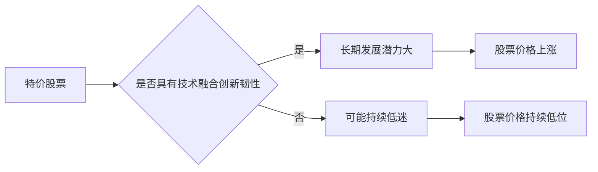

# 特价股票与公司长期技术融合创新韧性的相关性分析

> 关键词：特价股票、技术融合创新韧性、相关性分析、财务指标、创新能力评估

> 摘要：本文旨在深入探讨特价股票与公司长期技术融合创新韧性之间的相关性。通过对特价股票的定义、特征以及公司技术融合创新韧性的内涵、评估方法进行分析，运用多种数据分析方法和数学模型，揭示两者之间潜在的关联。同时结合实际案例进行验证和解读，明确这种相关性在实际投资和企业发展中的应用场景。此外，还推荐了相关的学习资源、开发工具和研究论文，最后对该领域的未来发展趋势和挑战进行了总结和展望。

## 1. 背景介绍 
### 1.1 目的和范围
本研究的主要目的是分析特价股票与公司长期技术融合创新韧性之间的相关性。在当今复杂多变的金融市场和激烈的商业竞争环境中，特价股票往往吸引着投资者的目光，而公司的技术融合创新韧性则是其长期生存和发展的关键因素。明确两者之间的关系，有助于投资者做出更明智的投资决策，也能为企业提升自身竞争力提供参考。

研究范围涵盖了不同行业的上市公司，通过收集和分析这些公司的股票价格数据、财务报表、研发投入、专利情况等多方面信息，来全面探究特价股票与技术融合创新韧性之间的联系。

### 1.2 预期读者
本文的预期读者包括金融投资者、企业管理者、学术研究人员以及对金融市场和企业创新发展感兴趣的人士。对于投资者来说，可以借助本文的研究成果，更好地筛选具有投资价值的特价股票；企业管理者能够从中了解技术融合创新韧性对公司股票价格和市场表现的影响，从而制定更合理的发展战略；学术研究人员可以将本文作为进一步深入研究的基础；而普通读者则可以通过阅读本文，增加对金融市场和企业创新的认识。

### 1.3 文档结构概述
本文将按照以下结构展开：首先介绍核心概念，包括特价股票和公司长期技术融合创新韧性的定义和相关联系；接着阐述用于分析两者相关性的核心算法原理和具体操作步骤，并给出相应的 Python 代码；然后介绍相关的数学模型和公式，并通过具体例子进行说明；之后通过实际项目案例，详细展示代码实现和解读；再探讨这种相关性在实际中的应用场景；随后推荐相关的学习资源、开发工具和研究论文；最后对未来的发展趋势和挑战进行总结，并提供常见问题的解答和扩展阅读资料。

### 1.4 术语表
#### 1.4.1 核心术语定义
- **特价股票**：指在股票市场中，价格相对其内在价值或行业平均水平较低的股票。特价股票可能由于市场短期波动、公司负面消息等原因导致价格下跌，但也可能蕴含着被低估的投资价值。
- **技术融合创新韧性**：公司在长期发展过程中，能够有效整合不同技术资源，进行持续创新，并在面临内外部挑战时保持创新能力和竞争优势的能力。它体现了公司在技术创新方面的稳定性、适应性和可持续性。

#### 1.4.2 相关概念解释
- **股票内在价值**：是指股票未来现金流的现值，它反映了公司的真实价值。评估股票内在价值通常需要考虑公司的盈利能力、资产状况、行业前景等多方面因素。
- **技术融合**：将不同领域的技术进行有机结合，创造出具有新功能、新特性的产品或服务的过程。例如，将人工智能技术与医疗技术融合，开发出智能医疗诊断系统。
- **创新韧性**：类似于技术融合创新韧性，但更侧重于强调创新能力在面对各种困难和挑战时的恢复和适应能力。

#### 1.4.3 缩略词列表
- **ROE**：净资产收益率（Return on Equity），衡量公司运用自有资本的效率。
- **R&D**：研究与开发（Research and Development），指企业为了创新和改进产品、服务而进行的一系列活动。
- **P/E**：市盈率（Price-to-Earnings Ratio），反映股票价格与每股盈利之间的关系。

## 2. 核心概念与联系 

### 2.1 特价股票的概念和特征
特价股票是金融市场中一个常见的概念。从价格角度来看，特价股票的价格通常低于其内在价值。这可能是由于市场的非理性波动、行业周期性低谷、公司短期业绩不佳等原因造成的。例如，在市场恐慌性抛售时，许多优质公司的股票价格也会随之下跌，形成特价股票。

特价股票的特征还包括：较低的市盈率和市净率，这意味着投资者可以以相对较低的价格购买到公司的盈利和资产；较高的股息率，一些特价股票由于价格较低，股息率相对较高，能够为投资者提供稳定的现金流。

### 2.2 公司长期技术融合创新韧性的内涵
公司长期技术融合创新韧性是一个综合性的概念，它涉及到公司的技术创新能力、资源整合能力和应对挑战的能力。

从技术创新能力方面来看，公司需要不断投入研发资源，开发新的技术和产品。例如，苹果公司通过持续的研发投入，不断推出具有创新性的产品，如 iPhone、iPad 等，保持了在全球智能手机和平板电脑市场的领先地位。

资源整合能力是指公司能够将内部和外部的技术资源进行有效整合，实现协同创新。例如，一些科技公司通过并购其他具有先进技术的企业，将其技术与自身的技术进行融合，提升了整体的创新能力。

应对挑战的能力则体现在公司在面临技术变革、市场竞争、政策调整等内外部挑战时，能够迅速调整战略，保持创新活力。例如，传统汽车制造企业在面对新能源汽车的冲击时，通过加大对新能源技术的研发投入，实现了技术转型和创新。

### 2.3 特价股票与公司长期技术融合创新韧性的联系
特价股票与公司长期技术融合创新韧性之间存在着潜在的联系。一方面，具有较强技术融合创新韧性的公司，其长期发展前景较好，即使短期内由于市场原因导致股票价格下跌成为特价股票，但从长期来看，其股票价格有较大的上涨空间。例如，特斯拉公司在发展初期，由于研发投入大、盈利不稳定等原因，股票价格一度较低，但随着其在电动汽车技术和自动驾驶技术方面的不断创新和突破，股票价格大幅上涨。

另一方面，特价股票也可能为投资者提供了挖掘具有技术融合创新韧性公司的机会。一些公司可能由于短期的经营困境或市场误解，导致股票价格被低估，但实际上这些公司具有较强的技术创新能力和资源整合能力，一旦解决了短期问题，就能够展现出强大的发展潜力。

### 2.4 核心概念原理和架构的文本示意图
特价股票与公司长期技术融合创新韧性的关系可以用以下示意图表示：

特价股票（价格低于内在价值）
    |
    | 受多种因素影响
    |
    | 可能反映公司短期困境或市场误解
    |
    | 但可能隐藏具有技术融合创新韧性的公司
    |
    | 技术融合创新韧性强的公司长期有发展潜力
    |
    | 推动股票价格上涨

### 2.5 Mermaid 流程图


## 3. 核心算法原理 & 具体操作步骤 

### 3.1 核心算法原理
为了分析特价股票与公司长期技术融合创新韧性的相关性，我们可以采用多元线性回归分析方法。多元线性回归是一种用于研究多个自变量与一个因变量之间线性关系的统计方法。在本研究中，我们将股票价格作为因变量，将反映公司技术融合创新韧性的多个指标作为自变量，建立多元线性回归模型。

设股票价格为 $y$，反映公司技术融合创新韧性的指标分别为 $x_1, x_2, \cdots, x_n$，则多元线性回归模型可以表示为：

$$y = \beta_0 + \beta_1x_1 + \beta_2x_2 + \cdots + \beta_nx_n + \epsilon$$

其中，$\beta_0$ 是截距项，$\beta_1, \beta_2, \cdots, \beta_n$ 是回归系数，$\epsilon$ 是误差项。

### 3.2 具体操作步骤
#### 3.2.1 数据收集
收集不同公司的股票价格数据、财务报表数据、研发投入数据、专利数量数据等。股票价格数据可以从金融数据提供商（如 Wind、东方财富等）获取，财务报表数据可以从公司的官方网站或证券交易所网站获取，研发投入和专利数量数据可以从相关的统计机构或数据库获取。

#### 3.2.2 数据预处理
对收集到的数据进行清洗和预处理，包括去除缺失值、异常值处理、数据标准化等。例如，对于缺失的研发投入数据，可以采用均值填充或线性插值的方法进行处理；对于异常的股票价格数据，可以采用箱线图法进行识别和处理。

#### 3.2.3 指标选择
选择能够反映公司技术融合创新韧性的指标，如研发投入占比、专利数量、技术人员占比等。同时，选择能够反映股票价格的指标，如收盘价、平均价等。

#### 3.2.4 模型建立
使用 Python 的 `statsmodels` 库建立多元线性回归模型，并对模型进行拟合。

#### 3.2.5 模型评估
使用 $R^2$ 检验、F 检验、t 检验等方法对模型进行评估，判断模型的拟合优度和自变量的显著性。

#### 3.2.6 结果分析
根据模型的回归系数和显著性水平，分析特价股票与公司长期技术融合创新韧性之间的相关性。

### 3.3 Python 源代码实现
```python
import pandas as pd
import statsmodels.api as sm

# 读取数据
data = pd.read_csv('stock_data.csv')

# 提取自变量和因变量
X = data[['R&D_ratio', 'patent_count', 'tech_staff_ratio']]
y = data['stock_price']

# 添加常数项
X = sm.add_constant(X)

# 建立多元线性回归模型
model = sm.OLS(y, X)

# 拟合模型
results = model.fit()

# 输出模型结果
print(results.summary())
```

### 3.4 代码解释
- `pd.read_csv('stock_data.csv')`：读取包含股票价格和相关指标数据的 CSV 文件。
- `X = data[['R&D_ratio', 'patent_count', 'tech_staff_ratio']]`：提取反映公司技术融合创新韧性的指标作为自变量。
- `y = data['stock_price']`：提取股票价格作为因变量。
- `sm.add_constant(X)`：在自变量中添加常数项。
- `sm.OLS(y, X)`：建立多元线性回归模型。
- `model.fit()`：拟合模型。
- `results.summary()`：输出模型的详细结果，包括回归系数、$R^2$ 值、F 检验值等。

## 4. 数学模型和公式 & 详细讲解 & 举例说明 

### 4.1 多元线性回归模型公式
多元线性回归模型的一般形式为：

$$y = \beta_0 + \beta_1x_1 + \beta_2x_2 + \cdots + \beta_nx_n + \epsilon$$

其中，$y$ 是因变量，$x_1, x_2, \cdots, x_n$ 是自变量，$\beta_0$ 是截距项，$\beta_1, \beta_2, \cdots, \beta_n$ 是回归系数，$\epsilon$ 是误差项。

### 4.2 回归系数的含义
回归系数 $\beta_i$ 表示在其他自变量保持不变的情况下，自变量 $x_i$ 每增加一个单位，因变量 $y$ 的平均变化量。例如，在我们的模型中，如果 $\beta_1$ 表示研发投入占比的回归系数，那么 $\beta_1$ 的值表示研发投入占比每增加 1%，股票价格的平均变化量。

### 4.3 $R^2$ 检验
$R^2$ 是衡量回归模型拟合优度的指标，其取值范围为 $[0, 1]$。$R^2$ 值越接近 1，表示模型对数据的拟合效果越好。$R^2$ 的计算公式为：

$$R^2 = 1 - \frac{\sum_{i=1}^{m}(y_i - \hat{y}_i)^2}{\sum_{i=1}^{m}(y_i - \bar{y})^2}$$

其中，$y_i$ 是实际观测值，$\hat{y}_i$ 是模型预测值，$\bar{y}$ 是因变量的平均值。

### 4.4 F 检验
F 检验用于检验整个回归模型的显著性。其原假设为所有回归系数都为 0，即自变量与因变量之间不存在线性关系。F 统计量的计算公式为：

$$F = \frac{\frac{\sum_{i=1}^{m}(\hat{y}_i - \bar{y})^2}{n}}{\frac{\sum_{i=1}^{m}(y_i - \hat{y}_i)^2}{m - n - 1}}$$

其中，$m$ 是样本数量，$n$ 是自变量的数量。如果 F 统计量的值大于临界值，则拒绝原假设，说明回归模型是显著的。

### 4.5 t 检验
t 检验用于检验每个自变量的显著性。其原假设为某个自变量的回归系数为 0，即该自变量与因变量之间不存在线性关系。t 统计量的计算公式为：

$$t = \frac{\hat{\beta}_i}{SE(\hat{\beta}_i)}$$

其中，$\hat{\beta}_i$ 是回归系数的估计值，$SE(\hat{\beta}_i)$ 是回归系数的标准误差。如果 t 统计量的值大于临界值，则拒绝原假设，说明该自变量是显著的。

### 4.6 举例说明
假设我们通过多元线性回归分析得到以下模型结果：

$$y = 10 + 2x_1 + 3x_2 + 1.5x_3 + \epsilon$$

其中，$y$ 是股票价格，$x_1$ 是研发投入占比，$x_2$ 是专利数量，$x_3$ 是技术人员占比。

- 回归系数解释：研发投入占比每增加 1%，股票价格平均增加 2 元；专利数量每增加 1 个，股票价格平均增加 3 元；技术人员占比每增加 1%，股票价格平均增加 1.5 元。
- $R^2$ 检验：假设 $R^2 = 0.8$，说明该模型能够解释 80% 的股票价格变化，拟合效果较好。
- F 检验：假设 F 统计量的值为 20，临界值为 5，由于 20 > 5，所以拒绝原假设，说明回归模型是显著的。
- t 检验：假设 $x_1$ 的 t 统计量的值为 3，临界值为 2，由于 3 > 2，所以拒绝原假设，说明研发投入占比这个自变量是显著的。

## 5. 项目实战：代码实际案例和详细解释说明 

### 5.1 开发环境搭建
#### 5.1.1 安装 Python
首先，需要安装 Python 环境。可以从 Python 官方网站（https://www.python.org/downloads/）下载适合自己操作系统的 Python 安装包，并按照安装向导进行安装。

#### 5.1.2 安装必要的库
使用以下命令安装所需的 Python 库：
```sh
pip install pandas statsmodels
```

### 5.2 源代码详细实现和代码解读
#### 5.2.1 数据准备
假设我们已经收集到了 100 家公司的股票价格、研发投入占比、专利数量和技术人员占比的数据，并保存为 `stock_data.csv` 文件。文件内容如下：

| stock_price | R&D_ratio | patent_count | tech_staff_ratio |
|-------------|-----------|--------------|------------------|
| 50          | 0.05      | 10           | 0.2              |
| 60          | 0.06      | 12           | 0.22             |
|...         |...       |...          |...              |

#### 5.2.2 代码实现
```python
import pandas as pd
import statsmodels.api as sm

# 读取数据
data = pd.read_csv('stock_data.csv')

# 提取自变量和因变量
X = data[['R&D_ratio', 'patent_count', 'tech_staff_ratio']]
y = data['stock_price']

# 添加常数项
X = sm.add_constant(X)

# 建立多元线性回归模型
model = sm.OLS(y, X)

# 拟合模型
results = model.fit()

# 输出模型结果
print(results.summary())
```

#### 5.2.3 代码解读
- `import pandas as pd` 和 `import statsmodels.api as sm`：导入所需的库，`pandas` 用于数据处理，`statsmodels` 用于建立和拟合回归模型。
- `data = pd.read_csv('stock_data.csv')`：读取 CSV 文件中的数据。
- `X = data[['R&D_ratio', 'patent_count', 'tech_staff_ratio']]` 和 `y = data['stock_price']`：分别提取自变量和因变量。
- `X = sm.add_constant(X)`：在自变量中添加常数项，这是因为多元线性回归模型中需要包含截距项。
- `model = sm.OLS(y, X)`：建立普通最小二乘（OLS）回归模型。
- `results = model.fit()`：拟合模型，得到回归结果。
- `print(results.summary())`：输出模型的详细结果，包括回归系数、$R^2$ 值、F 检验值等。

### 5.3 代码解读与分析
#### 5.3.1 回归结果分析
运行上述代码后，会输出回归模型的详细结果。主要关注以下几个方面：
- **回归系数**：每个自变量的回归系数表示该自变量对因变量的影响程度。例如，如果研发投入占比的回归系数为正且显著，说明研发投入占比的增加会导致股票价格的上涨。
- **$R^2$ 值**：$R^2$ 值越接近 1，说明模型对数据的拟合效果越好。如果 $R^2$ 值较低，可能需要考虑添加更多的自变量或采用其他模型。
- **F 检验值**：F 检验用于检验整个回归模型的显著性。如果 F 检验值显著，说明自变量与因变量之间存在线性关系。
- **t 检验值**：t 检验用于检验每个自变量的显著性。如果某个自变量的 t 检验值显著，说明该自变量对因变量有显著影响。

#### 5.3.2 模型评估和改进
根据回归结果，可以对模型进行评估和改进。如果某些自变量的回归系数不显著，可以考虑将其从模型中剔除；如果 $R^2$ 值较低，可以尝试添加更多的自变量或采用非线性模型。

## 6. 实际应用场景 
### 6.1 投资决策
对于投资者来说，分析特价股票与公司长期技术融合创新韧性的相关性可以帮助他们做出更明智的投资决策。当发现一只特价股票对应的公司具有较强的技术融合创新韧性时，投资者可以认为该股票具有较高的投资价值，可能会在未来获得较高的回报。例如，投资者通过研究发现某家科技公司的股票价格由于短期市场波动而下跌成为特价股票，但该公司在人工智能和大数据技术融合方面具有较强的创新能力和研发投入，那么投资者可以考虑买入该股票。

### 6.2 企业战略制定
企业管理者可以根据自身公司的技术融合创新韧性和股票价格情况，制定合理的发展战略。如果公司的股票价格较低，但具有较强的技术融合创新韧性，企业可以加大研发投入，进一步提升创新能力，以提高公司的市场价值和股票价格。例如，一家传统制造业企业发现自己的股票价格被低估，但在智能制造技术融合方面有一定的基础和潜力，那么企业可以制定战略，加大在智能制造领域的研发和应用，推动企业的转型升级。

### 6.3 行业研究和政策制定
行业研究人员可以通过分析特价股票与公司长期技术融合创新韧性的相关性，了解行业内企业的创新能力和发展潜力，为行业发展提供参考。政府部门也可以根据研究结果，制定相关的产业政策，鼓励企业加强技术融合创新，提高行业的整体竞争力。例如，政府可以对具有较强技术融合创新韧性的企业给予税收优惠、财政补贴等支持，促进企业的发展。

## 7. 工具和资源推荐
### 7.1 学习资源推荐
#### 7.1.1 书籍推荐
- 《计量经济学基础》：这本书系统地介绍了计量经济学的基本理论和方法，对于理解多元线性回归等统计分析方法非常有帮助。
- 《金融市场学》：涵盖了金融市场的基本概念、运行机制和投资策略等内容，有助于投资者深入了解股票市场。
- 《创新管理》：阐述了企业创新管理的理论和实践，对于理解公司的技术融合创新韧性有很大的启发。

#### 7.1.2 在线课程
- Coursera 上的“计量经济学”课程：由知名高校的教授授课，内容丰富，讲解详细。
- edX 上的“金融市场分析”课程：提供了金融市场分析的实用方法和工具。
- Udemy 上的“企业创新与战略”课程：帮助学习者了解企业创新的战略规划和实施方法。

#### 7.1.3 技术博客和网站
- 金融界（https://www.jrj.com.cn/）：提供丰富的金融市场资讯和分析报告。
- 雪球网（https://xueqiu.com/）：投资者交流平台，有很多关于股票投资的经验分享和研究分析。
- 36氪（https://36kr.com/）：关注科技创新和创业领域，提供最新的科技动态和企业创新案例。

### 7.2 开发工具框架推荐
#### 7.2.1 IDE和编辑器
- PyCharm：一款专业的 Python 集成开发环境，具有代码编辑、调试、版本控制等功能，非常适合数据分析和机器学习项目。
- Jupyter Notebook：交互式的开发环境，支持 Python 代码的编写、运行和可视化展示，方便进行数据探索和模型验证。

#### 7.2.2 调试和性能分析工具
- IPython：增强的 Python 交互式解释器，提供了丰富的调试和分析功能，如代码调试、性能分析等。
- cProfile：Python 内置的性能分析工具，可以帮助开发者找出代码中的性能瓶颈。

#### 7.2.3 相关框架和库
- Pandas：用于数据处理和分析的 Python 库，提供了高效的数据结构和数据操作方法。
- Statsmodels：用于统计建模和计量分析的 Python 库，支持多种回归模型的建立和拟合。
- Scikit-learn：机器学习库，提供了丰富的机器学习算法和工具，可用于模型评估和预测。

### 7.3 相关论文著作推荐
#### 7.3.1 经典论文
- Fama, E. F., & French, K. R. (1992). The cross-section of expected stock returns. The Journal of Finance, 47(2), 427-465. 这篇论文提出了著名的 Fama-French 三因子模型，对股票收益的横截面进行了深入分析。
- Schumpeter, J. A. (1934). The theory of economic development. Harvard University Press. 熊彼特的经典著作，阐述了创新在经济发展中的重要作用。

#### 7.3.2 最新研究成果
- 关注顶级学术期刊如《Journal of Financial Economics》、《Management Science》等，这些期刊上经常发表关于金融市场和企业创新的最新研究成果。

#### 7.3.3 应用案例分析
- 可以参考一些知名咨询公司的研究报告，如麦肯锡、波士顿咨询等，这些报告通常包含了大量的企业创新和金融市场应用案例分析。

## 8. 总结：未来发展趋势与挑战
### 8.1 未来发展趋势
#### 8.1.1 数据驱动的投资决策
随着大数据和人工智能技术的发展，投资者将越来越依赖数据和模型来分析特价股票与公司长期技术融合创新韧性的相关性，从而做出更精准的投资决策。例如，利用机器学习算法对海量的金融数据和企业创新数据进行分析，挖掘潜在的投资机会。

#### 8.1.2 跨学科研究的深入
该领域的研究将越来越涉及到金融、技术创新、管理学等多个学科的交叉融合。通过跨学科的研究方法，可以更全面地理解特价股票与公司长期技术融合创新韧性之间的关系，为投资和企业发展提供更有价值的建议。

#### 8.1.3 企业对创新韧性的重视
企业将更加重视自身的技术融合创新韧性，将其作为提升竞争力和市场价值的关键因素。未来，企业将加大在研发、人才培养和技术合作等方面的投入，以提高自身的创新能力和应对挑战的能力。

### 8.2 挑战
#### 8.2.1 数据质量和获取难度
准确分析特价股票与公司长期技术融合创新韧性的相关性需要大量高质量的数据。然而，数据的质量和获取难度是一个挑战。例如，一些企业的研发投入和专利数据可能存在不准确或不完整的情况，而且获取某些关键数据可能需要付出较高的成本。

#### 8.2.2 模型的复杂性和不确定性
建立准确的数学模型来描述特价股票与公司长期技术融合创新韧性之间的关系是一项复杂的任务。模型的参数估计和预测结果可能存在一定的不确定性，需要不断地进行优化和验证。

#### 8.2.3 市场的复杂性和波动性
金融市场是复杂多变的，受到多种因素的影响，如宏观经济环境、政策变化、市场情绪等。这些因素增加了分析特价股票与公司长期技术融合创新韧性相关性的难度，也使得投资决策面临更大的风险。

## 9. 附录：常见问题与解答
### 9.1 如何判断一只股票是否为特价股票？
判断一只股票是否为特价股票可以从多个方面进行考虑。首先，可以比较股票的价格与内在价值，内在价值可以通过财务分析、现金流折现等方法进行估算。如果股票价格明显低于内在价值，则可能是特价股票。其次，可以参考同行业其他股票的价格和估值指标，如市盈率、市净率等。如果该股票的估值指标明显低于行业平均水平，也可能是特价股票。

### 9.2 如何评估公司的技术融合创新韧性？
评估公司的技术融合创新韧性可以从以下几个方面入手：研发投入情况，包括研发费用占比、研发人员数量等；专利数量和质量，反映公司的技术创新成果；技术合作和战略联盟，体现公司整合外部技术资源的能力；应对挑战的历史记录，如在技术变革、市场竞争等情况下的表现。

### 9.3 多元线性回归模型的结果是否可靠？
多元线性回归模型的结果可靠性受到多种因素的影响。首先，数据的质量和代表性非常重要，如果数据存在偏差或缺失，可能会影响模型的准确性。其次，模型的假设条件是否满足也会影响结果的可靠性，例如自变量之间是否存在多重共线性等。在使用多元线性回归模型时，需要对模型进行严格的检验和评估，同时结合实际情况进行分析。

### 9.4 特价股票一定具有投资价值吗？
特价股票并不一定具有投资价值。虽然特价股票可能由于市场原因被低估，但也可能是因为公司存在潜在的问题，如经营不善、财务困境等。在投资特价股票时，需要综合考虑公司的基本面、技术融合创新韧性、行业前景等因素，进行全面的分析和评估。

## 10. 扩展阅读 & 参考资料
### 10.1 扩展阅读
- 《聪明的投资者》：本杰明·格雷厄姆的经典著作，介绍了价值投资的理念和方法。
- 《创新者的窘境》：克莱顿·克里斯坦森的著作，探讨了企业在创新过程中面临的挑战和机遇。
- 《大数据时代》：维克托·迈尔 - 舍恩伯格的作品，介绍了大数据的概念、应用和影响。

### 10.2 参考资料
- 金融数据提供商的官方网站，如 Wind、东方财富等，获取股票价格和财务报表数据。
- 国家知识产权局网站，获取企业的专利数据。
- 相关学术期刊和研究报告，如《金融研究》、《管理世界》等，获取最新的研究成果和案例分析。

作者：AI天才研究院/AI Genius Institute & 禅与计算机程序设计艺术 /Zen And The Art of Computer Programming