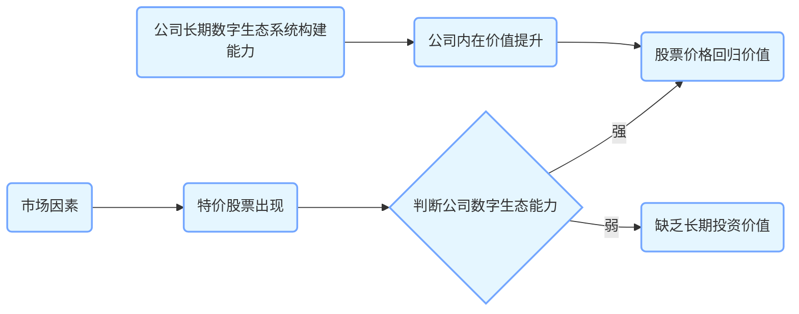

# 特价股票与公司长期数字生态系统构建能力的关系分析

> 关键词：特价股票、公司长期数字生态系统构建能力、股票价值评估、数字生态系统、关系分析

> 摘要：本文旨在深入剖析特价股票与公司长期数字生态系统构建能力之间的关系。通过对相关核心概念的介绍、算法原理的阐述、数学模型的分析，结合实际案例，探讨这种关系对股票投资决策和公司发展的影响。同时，为投资者和企业管理者提供有价值的参考，帮助他们更好地理解市场动态和企业竞争力，以做出更明智的决策。

## 1. 背景介绍 
### 1.1 目的和范围
在当今复杂多变的金融市场中，特价股票往往吸引着众多投资者的目光。然而，判断特价股票是否具有真正的投资价值，不能仅仅依据其价格，还需要综合考虑公司的各种内在因素。公司的长期数字生态系统构建能力作为衡量公司未来发展潜力的重要指标，与特价股票之间存在着潜在的联系。本研究的目的就是系统地分析这种关系，明确其在投资决策和公司战略规划中的重要性。研究范围涵盖了不同行业的上市公司，通过对相关数据的收集和分析，揭示特价股票与公司长期数字生态系统构建能力之间的普遍规律。

### 1.2 预期读者
本文的预期读者主要包括股票投资者、金融分析师、企业管理者以及对金融市场和企业数字化转型感兴趣的研究人员。对于投资者来说，了解这种关系有助于他们筛选出更具投资价值的特价股票；金融分析师可以借助本文的研究方法和结论，为客户提供更专业的投资建议；企业管理者则可以从公司长期数字生态系统构建的角度出发，优化公司战略，提升公司的市场竞争力；研究人员可以将本文作为进一步深入研究的基础。

### 1.3 文档结构概述
本文将按照以下结构进行阐述：首先介绍相关的核心概念，明确特价股票和公司长期数字生态系统构建能力的定义和内涵；接着详细讲解分析这种关系所涉及的核心算法原理和具体操作步骤，并给出相应的 Python 代码示例；然后通过数学模型和公式对这种关系进行量化分析，并举例说明；再通过实际项目案例，展示如何在实际中应用这些理论和方法；之后探讨这种关系在实际中的应用场景；推荐相关的学习资源、开发工具和论文著作；最后总结未来的发展趋势与挑战，并解答一些常见问题，提供扩展阅读和参考资料。

### 1.4 术语表
#### 1.4.1 核心术语定义
- **特价股票**：指在股票市场中，价格相对其内在价值或行业平均水平较低的股票。特价股票可能由于市场短期波动、公司短期负面事件等原因导致价格下跌，但并不一定意味着公司的基本面出现了严重问题。
- **公司长期数字生态系统构建能力**：指公司在长期发展过程中，利用数字技术构建一个涵盖产品研发、生产、销售、客户服务等各个环节的数字化生态系统的能力。这个生态系统能够实现数据的实时共享和流通，提高公司的运营效率和创新能力，增强公司的市场竞争力。

#### 1.4.2 相关概念解释
- **数字生态系统**：是由数字技术驱动的，包含多个相互关联的数字平台、应用程序、数据资源和参与者组成的生态系统。在这个生态系统中，各个参与者通过数据的交互和共享，实现协同创新和价值创造。
- **股票内在价值**：是指股票未来预期现金流的现值，它反映了公司的真实价值。股票内在价值的评估通常需要考虑公司的财务状况、盈利能力、行业前景等多个因素。

#### 1.4.3 缩略词列表
- **PE**：市盈率（Price-to-Earnings Ratio），是指股票价格除以每股收益的比率，用于衡量股票的估值水平。
- **ROE**：净资产收益率（Return on Equity），是指公司净利润与净资产的比率，反映了公司运用自有资本的效率。

## 2. 核心概念与联系 
### 核心概念原理
#### 特价股票原理
特价股票的出现通常是由于市场的非理性因素导致的。市场参与者的情绪波动、信息不对称等因素可能会使股票价格偏离其内在价值。例如，当市场出现恐慌情绪时，投资者可能会大量抛售股票，导致股价下跌，从而出现特价股票。此外，公司短期的负面事件，如业绩下滑、管理层变动等，也可能引发股价的短期下跌，形成特价股票。

#### 公司长期数字生态系统构建能力原理
公司长期数字生态系统构建能力的核心在于利用数字技术实现公司业务的数字化转型。这包括建立数字化的研发平台、生产管理系统、供应链管理系统和客户关系管理系统等。通过这些数字化系统的集成和协同工作，公司能够实现数据的实时共享和流通，提高决策的科学性和准确性，从而提升公司的运营效率和创新能力。例如，公司可以利用大数据分析技术对客户需求进行精准预测，优化产品研发和生产计划；通过物联网技术实现对生产设备的实时监控和管理，提高生产效率和质量。

### 架构的文本示意图
特价股票与公司长期数字生态系统构建能力之间的关系可以用以下文本示意图表示：

特价股票的出现可能是由于市场对公司的短期误解或负面事件的影响，但公司长期数字生态系统构建能力强的公司具有更强的抗风险能力和未来发展潜力。如果公司能够有效利用数字技术构建完善的数字生态系统，提高运营效率和创新能力，那么其内在价值将会逐渐提升，特价股票的价格也有望回归其内在价值。反之，如果公司长期数字生态系统构建能力较弱，即使股票价格暂时处于低位，也可能缺乏长期投资价值。

### Mermaid 流程图


## 3. 核心算法原理 & 具体操作步骤 
### 核心算法原理
为了分析特价股票与公司长期数字生态系统构建能力的关系，我们可以采用多因素评估模型。该模型综合考虑了多个与公司数字生态系统构建能力相关的因素，以及股票的价格和内在价值等因素。具体来说，我们可以通过以下步骤计算一个综合得分，来评估特价股票的投资价值：

1. **选取评估指标**：包括公司的数字化投入、数字化人才储备、数字化业务占比、市盈率、净资产收益率等。
2. **确定指标权重**：根据各个指标的重要性，确定其在综合得分中的权重。
3. **计算各指标得分**：对每个指标进行量化评估，计算其得分。
4. **计算综合得分**：将各指标得分乘以其权重，然后相加得到综合得分。

### 具体操作步骤及 Python 代码实现
```python
import pandas as pd

# 假设我们有以下数据，包含公司名称、数字化投入、数字化人才储备、数字化业务占比、市盈率、净资产收益率
data = {
    '公司名称': ['公司A', '公司B', '公司C'],
    '数字化投入': [1000, 2000, 1500],
    '数字化人才储备': [50, 80, 60],
    '数字化业务占比': [0.3, 0.5, 0.4],
    '市盈率': [10, 15, 12],
    '净资产收益率': [0.15, 0.2, 0.18]
}

df = pd.DataFrame(data)

# 确定指标权重
weights = {
    '数字化投入': 0.2,
    '数字化人才储备': 0.2,
    '数字化业务占比': 0.2,
    '市盈率': -0.1,  # 市盈率越低越好，所以权重为负
    '净资产收益率': 0.3
}

# 数据标准化（这里使用简单的线性归一化）
def normalize(column):
    return (column - column.min()) / (column.max() - column.min())

for column in ['数字化投入', '数字化人才储备', '数字化业务占比', '市盈率', '净资产收益率']:
    df[column] = normalize(df[column])

# 计算综合得分
df['综合得分'] = 0
for column, weight in weights.items():
    df['综合得分'] += df[column] * weight

# 按照综合得分排序
df = df.sort_values(by='综合得分', ascending=False)

print(df)
```

### 代码解释
1. **数据准备**：使用 Pandas 库创建一个包含公司相关信息的 DataFrame。
2. **确定指标权重**：根据各指标的重要性，手动设定权重。
3. **数据标准化**：对各指标数据进行线性归一化处理，将数据范围缩放到 [0, 1] 之间，以便进行比较和计算。
4. **计算综合得分**：根据各指标的得分和权重，计算综合得分。
5. **排序**：按照综合得分对公司进行排序，得分越高的公司，其特价股票可能具有更高的投资价值。

## 4. 数学模型和公式 & 详细讲解 & 举例说明 
### 数学模型和公式
设 $x_1, x_2, \cdots, x_n$ 为选取的评估指标，$w_1, w_2, \cdots, w_n$ 为各指标的权重，且 $\sum_{i=1}^{n} w_i = 1$。则综合得分 $S$ 的计算公式为：

$$S = \sum_{i=1}^{n} w_i x_i$$

其中，$x_i$ 为第 $i$ 个指标的得分，$w_i$ 为第 $i$ 个指标的权重。

### 详细讲解
- **指标选取**：评估指标的选取应全面反映公司的长期数字生态系统构建能力和股票的投资价值。例如，数字化投入反映了公司对数字技术的重视程度和投入力度；数字化人才储备体现了公司在数字领域的创新能力和发展潜力；数字化业务占比则反映了公司业务的数字化程度。市盈率和净资产收益率是衡量股票估值和公司盈利能力的重要指标。
- **指标权重确定**：指标权重的确定需要综合考虑各指标的重要性和相关性。一般来说，与公司长期数字生态系统构建能力密切相关的指标权重应相对较高，而与股票估值相关的指标权重可以根据市场情况和投资者偏好进行调整。
- **指标得分计算**：对于不同类型的指标，需要采用不同的方法进行得分计算。例如，对于数值型指标，可以采用线性归一化的方法将其转换为 [0, 1] 之间的得分；对于非数值型指标，可以采用打分法或专家评估法进行量化。

### 举例说明
假设我们选取了三个评估指标：数字化投入 $x_1$、数字化人才储备 $x_2$ 和市盈率 $x_3$，其权重分别为 $w_1 = 0.3$，$w_2 = 0.4$，$w_3 = 0.3$。有两家公司 A 和 B，其指标得分如下：

| 公司 | 数字化投入得分 $x_1$ | 数字化人才储备得分 $x_2$ | 市盈率得分 $x_3$ |
| ---- | ---- | ---- | ---- |
| A | 0.8 | 0.7 | 0.6 |
| B | 0.6 | 0.8 | 0.7 |

则公司 A 的综合得分 $S_A$ 为：

$$S_A = 0.3 \times 0.8 + 0.4 \times 0.7 + 0.3 \times 0.6 = 0.7$$

公司 B 的综合得分 $S_B$ 为：

$$S_B = 0.3 \times 0.6 + 0.4 \times 0.8 + 0.3 \times 0.7 = 0.71$$

由于 $S_B > S_A$，从综合得分来看，公司 B 的特价股票可能具有更高的投资价值。

## 5. 项目实战：代码实际案例和详细解释说明 
### 5.1  开发环境搭建
#### 安装 Python
首先，需要安装 Python 环境。可以从 Python 官方网站（https://www.python.org/downloads/）下载适合自己操作系统的 Python 版本，并按照安装向导进行安装。

#### 安装必要的库
在安装好 Python 后，需要安装一些必要的库，如 Pandas、Numpy 等。可以使用以下命令进行安装：
```sh
pip install pandas numpy
```

### 5.2  源代码详细实现和代码解读
```python
import pandas as pd
import numpy as np

# 读取数据
data = pd.read_csv('stock_data.csv')

# 数据预处理
# 处理缺失值
data = data.dropna()

# 选取评估指标
selected_columns = ['数字化投入', '数字化人才储备', '数字化业务占比', '市盈率', '净资产收益率']
X = data[selected_columns]

# 数据标准化
def normalize(X):
    return (X - X.min()) / (X.max() - X.min())

X_normalized = normalize(X)

# 确定指标权重
weights = np.array([0.2, 0.2, 0.2, -0.1, 0.3])

# 计算综合得分
scores = np.dot(X_normalized, weights)

# 将综合得分添加到原始数据中
data['综合得分'] = scores

# 按照综合得分排序
data = data.sort_values(by='综合得分', ascending=False)

# 保存结果
data.to_csv('stock_scores.csv', index=False)
```

### 代码解读与分析
1. **数据读取**：使用 Pandas 库的 `read_csv` 函数读取包含股票和公司相关信息的 CSV 文件。
2. **数据预处理**：处理数据中的缺失值，使用 `dropna` 函数删除包含缺失值的行。
3. **选取评估指标**：从数据中选取与公司长期数字生态系统构建能力和股票投资价值相关的指标。
4. **数据标准化**：对选取的指标数据进行线性归一化处理，确保各指标在计算综合得分时具有相同的权重。
5. **确定指标权重**：使用 Numpy 数组定义各指标的权重。
6. **计算综合得分**：使用矩阵乘法计算各公司的综合得分。
7. **排序和保存结果**：将综合得分添加到原始数据中，并按照综合得分对公司进行排序，最后将结果保存到新的 CSV 文件中。

## 6. 实际应用场景 
### 投资者选股
对于股票投资者来说，分析特价股票与公司长期数字生态系统构建能力的关系可以帮助他们筛选出更具投资价值的股票。通过计算综合得分，投资者可以对特价股票进行排序，优先选择综合得分较高的股票进行投资。例如，在市场出现短期波动时，某些股票价格下跌形成特价股票，投资者可以通过评估这些公司的数字生态系统构建能力，判断其是否具有长期投资价值。

### 企业战略规划
对于企业管理者来说，了解公司长期数字生态系统构建能力与股票价格的关系可以帮助他们制定更合理的战略规划。如果公司的数字生态系统构建能力较强，但股票价格却处于低位，企业管理者可以通过加强宣传和沟通，向市场传递公司的价值和发展潜力，提高市场对公司的认可度，从而推动股票价格回归其内在价值。同时，企业管理者还可以根据市场对数字生态系统构建能力的反馈，优化公司的数字化战略，加大在数字技术方面的投入，提升公司的核心竞争力。

### 金融机构风险管理
金融机构在进行股票投资和风险管理时，也可以参考特价股票与公司长期数字生态系统构建能力的关系。通过对投资组合中的股票进行综合评估，金融机构可以更好地了解投资组合的风险和收益特征，及时调整投资策略，降低投资风险。例如，对于数字生态系统构建能力较弱的特价股票，金融机构可以适当降低其在投资组合中的权重，以避免潜在的风险。

## 7. 工具和资源推荐
### 7.1 学习资源推荐
#### 7.1.1 书籍推荐
- 《金融市场学》：全面介绍了金融市场的基本概念、理论和运行机制，对于理解股票市场和投资决策具有重要的指导意义。
- 《数字化转型》：详细阐述了企业数字化转型的战略、方法和实践案例，有助于深入了解公司长期数字生态系统构建的相关知识。
- 《Python 数据分析实战》：通过实际案例介绍了如何使用 Python 进行数据分析和处理，对于学习和应用本文中的算法和代码非常有帮助。

#### 7.1.2 在线课程
- Coursera 上的“金融市场分析”课程：由知名高校的教授授课，系统地讲解了金融市场的分析方法和工具。
- edX 上的“数字化创新与转型”课程：介绍了企业数字化创新和转型的最新趋势和实践经验。
- 网易云课堂上的“Python 数据分析入门”课程：适合初学者学习 Python 数据分析的基础知识和技能。

#### 7.1.3 技术博客和网站
- 雪球网：提供了丰富的股票市场信息和投资者交流平台，可以了解到最新的市场动态和投资策略。
- 36氪：关注科技创新和企业数字化转型，发布了许多关于数字生态系统构建的深度报道和分析文章。
- 开源中国：是国内知名的开源技术社区，提供了大量的 Python 开源项目和代码示例，有助于学习和实践 Python 编程。

### 7.2 开发工具框架推荐
#### 7.2.1 IDE和编辑器
- PyCharm：是一款专业的 Python 集成开发环境，具有代码编辑、调试、自动补全、代码分析等强大功能，适合开发复杂的 Python 项目。
- Jupyter Notebook：是一个交互式的编程环境，支持多种编程语言，特别适合进行数据分析和可视化。可以在浏览器中直接编写和运行代码，方便展示和分享分析结果。
- Visual Studio Code：是一款轻量级的代码编辑器，支持多种编程语言和插件扩展。具有丰富的代码编辑功能和调试工具，适合快速开发和调试 Python 代码。

#### 7.2.2 调试和性能分析工具
- PDB：是 Python 内置的调试器，可以帮助开发者逐行调试代码，查找和解决代码中的问题。
- cProfile：是 Python 标准库中的性能分析工具，可以分析代码的运行时间和函数调用次数，帮助开发者找出代码中的性能瓶颈。
- Py-Spy：是一个轻量级的 Python 性能分析工具，可以实时监控 Python 程序的性能，生成火焰图等可视化报告，方便开发者进行性能优化。

#### 7.2.3 相关框架和库
- Pandas：是一个强大的数据分析库，提供了高效的数据结构和数据处理工具，适合进行数据清洗、分析和可视化。
- Numpy：是 Python 中用于科学计算的基础库，提供了多维数组对象和各种数学函数，可用于进行数值计算和矩阵运算。
- Scikit-learn：是一个常用的机器学习库，提供了丰富的机器学习算法和工具，可用于进行数据挖掘、模型训练和评估等任务。

### 7.3 相关论文著作推荐
#### 7.3.1 经典论文
- Fama, E. F., & French, K. R. (1992). The cross-section of expected stock returns. The Journal of Finance, 47(2), 427-465. 该论文提出了著名的 Fama-French 三因子模型，用于解释股票收益率的横截面差异，对股票投资和资产定价理论产生了深远的影响。
- Brynjolfsson, E., & McAfee, A. (2014). The second machine age: Work, progress, and prosperity in a time of brilliant technologies. W. W. Norton & Company. 本书探讨了数字技术对经济和社会的影响，强调了企业数字化转型的重要性和机遇。

#### 7.3.2 最新研究成果
- 关注《Journal of Financial Economics》、《Review of Financial Studies》等顶级金融学术期刊，这些期刊经常发表关于股票市场和公司财务的最新研究成果。
- 关注知名学术数据库，如 IEEE Xplore、ACM Digital Library 等，这些数据库收录了大量关于数字技术和企业数字化转型的研究论文。

#### 7.3.3 应用案例分析
- 研究一些成功进行数字化转型的企业案例，如亚马逊、阿里巴巴等。这些企业通过构建强大的数字生态系统，实现了业务的快速增长和市场竞争力的提升。可以分析它们的数字化战略、技术应用和商业模式，从中汲取经验和启示。

## 8. 总结：未来发展趋势与挑战
### 未来发展趋势
#### 数字化转型加速
随着数字技术的不断发展和应用，越来越多的公司将加快数字化转型的步伐，加大在数字生态系统构建方面的投入。这将进一步提升公司的运营效率和创新能力，从而影响公司的长期发展和股票价值。

#### 数据驱动的投资决策
投资者将越来越依赖数据和分析工具来进行投资决策。通过对公司长期数字生态系统构建能力的量化评估，投资者可以更准确地判断特价股票的投资价值，提高投资决策的科学性和准确性。

#### 金融科技融合
金融科技的发展将促进金融市场与数字技术的深度融合。例如，利用区块链技术实现股票交易的去中心化和透明化，利用人工智能技术进行股票价格预测和风险评估等。这将为分析特价股票与公司长期数字生态系统构建能力的关系提供更多的技术手段和方法。

### 挑战
#### 数据质量和获取难度
准确评估公司长期数字生态系统构建能力需要大量的高质量数据。然而，目前市场上的数据质量参差不齐，部分数据难以获取和整合。这给分析工作带来了一定的困难，需要投资者和研究人员具备更强的数据处理和分析能力。

#### 技术更新换代快
数字技术的发展日新月异，新的技术和应用不断涌现。公司需要不断跟进和应用这些新技术，以保持其数字生态系统的竞争力。这对公司的技术创新能力和管理能力提出了更高的要求，也增加了投资者评估公司长期数字生态系统构建能力的难度。

#### 市场不确定性
股票市场受到多种因素的影响，如宏观经济环境、政策法规变化、行业竞争等。这些因素的不确定性增加了特价股票投资的风险，也使得分析特价股票与公司长期数字生态系统构建能力的关系变得更加复杂。投资者需要综合考虑各种因素，制定合理的投资策略。

## 9. 附录：常见问题与解答
### 如何确定指标权重？
确定指标权重可以采用多种方法，如主观经验法、层次分析法、熵权法等。主观经验法是根据专家的经验和判断来确定权重；层次分析法是通过建立层次结构模型，对各指标进行两两比较，确定其相对重要性，从而得到权重；熵权法是根据指标数据的信息熵来确定权重，信息熵越小，指标的权重越大。在实际应用中，可以根据具体情况选择合适的方法，也可以将多种方法结合使用。

### 数据标准化的作用是什么？
数据标准化的作用是消除各指标数据的量纲和数量级差异，使不同指标具有可比性。在计算综合得分时，如果不进行数据标准化，数值较大的指标可能会对综合得分产生较大的影响，从而掩盖了其他指标的作用。通过数据标准化，可以将各指标数据转换到相同的尺度上，确保各指标在综合得分计算中具有相同的权重。

### 如何评估数字生态系统构建能力的效果？
可以从多个方面评估数字生态系统构建能力的效果，如运营效率提升、创新能力增强、市场竞争力提高等。具体指标包括生产效率提高、产品研发周期缩短、客户满意度提升、市场份额扩大等。可以通过对比公司在构建数字生态系统前后的相关指标数据，以及与同行业其他公司的比较，来评估数字生态系统构建能力的效果。

## 10. 扩展阅读 & 参考资料
### 扩展阅读
- 《人工智能时代的金融投资》：探讨了人工智能技术在金融投资领域的应用和发展趋势，对于理解数据驱动的投资决策具有重要的参考价值。
- 《工业 4.0：即将来袭的第四次工业革命》：介绍了工业 4.0 的概念、技术和应用，有助于了解企业数字化转型的背景和趋势。

### 参考资料
- Fama, E. F., & French, K. R. (1992). The cross-section of expected stock returns. The Journal of Finance, 47(2), 427-465.
- Brynjolfsson, E., & McAfee, A. (2014). The second machine age: Work, progress, and prosperity in a time of brilliant technologies. W. W. Norton & Company.
- 相关金融和科技领域的学术期刊、报告和新闻文章。

作者：AI天才研究院/AI Genius Institute & 禅与计算机程序设计艺术 /Zen And The Art of Computer Programming