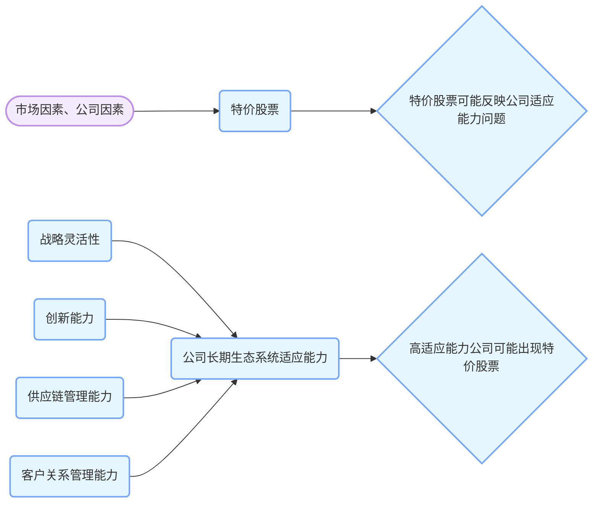

# 特价股票与公司长期生态系统适应能力的关系分析

> 关键词：特价股票、公司长期生态系统适应能力、财务分析、市场竞争、投资策略

> 摘要：本文旨在深入剖析特价股票与公司长期生态系统适应能力之间的关系。通过对相关核心概念的阐述、算法原理的讲解、数学模型的构建以及实际案例的分析，探讨特价股票出现的原因、公司长期生态系统适应能力的评估方法，以及两者之间相互影响的机制。同时，结合实际应用场景，为投资者提供基于这种关系的投资决策参考，并推荐相关的学习资源、开发工具和研究论文，最后对该领域的未来发展趋势与挑战进行总结。

## 1. 背景介绍 
### 1.1 目的和范围
本研究的目的是全面理解特价股票与公司长期生态系统适应能力之间的内在联系，为投资者提供一种新的投资分析视角。范围涵盖了对特价股票的定义、成因分析，公司长期生态系统适应能力的评估指标和方法，以及两者之间的相互作用机制。通过理论分析和实际案例研究，探讨如何利用这种关系进行投资决策，同时分析该领域未来可能的发展方向和面临的挑战。

### 1.2 预期读者
本文预期读者包括投资者、金融分析师、企业管理人员以及对金融市场和企业战略有研究兴趣的学者。对于投资者来说，了解特价股票与公司长期生态系统适应能力的关系有助于制定更合理的投资策略；金融分析师可以将此关系纳入分析框架，提高分析的准确性和全面性；企业管理人员可以从外部视角审视公司的生态系统适应能力，为企业战略调整提供参考；学者则可以在该领域开展更深入的研究。

### 1.3 文档结构概述
本文首先介绍相关背景信息，包括研究目的、预期读者和文档结构。接着阐述核心概念，包括特价股票和公司长期生态系统适应能力的定义和联系，并通过示意图和流程图进行直观展示。然后详细讲解核心算法原理和具体操作步骤，结合 Python 代码进行说明。之后构建数学模型和公式，通过具体例子进行详细讲解。再通过实际项目案例展示如何运用这些理论和方法进行分析，并对代码进行解读。随后探讨实际应用场景，推荐相关的学习资源、开发工具和研究论文。最后总结未来发展趋势与挑战，解答常见问题，并提供扩展阅读和参考资料。

### 1.4 术语表
#### 1.4.1 核心术语定义
- **特价股票**：指市场价格明显低于其内在价值的股票。这种低价可能是由于市场短期波动、行业竞争、公司短期困境等多种因素导致。
- **公司长期生态系统适应能力**：指公司在复杂多变的商业生态系统中，能够持续调整自身战略、业务模式和运营方式，以适应外部环境变化，保持长期生存和发展的能力。

#### 1.4.2 相关概念解释
- **内在价值**：股票的内在价值是指股票所代表的公司的真实价值，通常通过对公司的财务状况、盈利能力、发展前景等因素进行综合评估得出。
- **商业生态系统**：由相互关联的企业、供应商、客户、合作伙伴等组成的一个复杂的经济系统，各参与者之间相互影响、相互依存。

#### 1.4.3 缩略词列表
- **PE**：市盈率（Price-to-Earnings Ratio），是指股票价格除以每股收益的比率，用于衡量股票的估值水平。
- **ROE**：净资产收益率（Return on Equity），是指公司净利润与净资产的比率，反映公司运用自有资本的效率。

## 2. 核心概念与联系 
### 核心概念原理
#### 特价股票
特价股票的出现通常是由于市场的非理性因素导致。市场参与者的情绪波动、短期的供需失衡、行业的负面消息等都可能使股票价格下跌至低于其内在价值的水平。例如，当某个行业受到突发政策的影响，市场恐慌情绪蔓延，投资者纷纷抛售该行业的股票，导致股票价格大幅下跌，从而出现特价股票。

#### 公司长期生态系统适应能力
公司长期生态系统适应能力主要体现在以下几个方面：
- **战略灵活性**：公司能够根据市场变化及时调整战略方向，开拓新的业务领域或调整产品结构。例如，当传统燃油汽车市场逐渐受到新能源汽车的冲击时，一些汽车制造商能够迅速调整战略，加大对新能源汽车的研发和生产投入。
- **创新能力**：通过不断推出新产品、新技术或新的商业模式，保持在市场中的竞争力。例如，苹果公司凭借其强大的创新能力，不断推出具有创新性的产品，如 iPhone、iPad 等，引领了全球消费电子市场的发展。
- **供应链管理能力**：确保原材料的稳定供应和产品的高效生产，降低生产成本，提高产品质量。例如，戴尔公司通过高效的供应链管理，实现了按需生产，降低了库存成本，提高了市场响应速度。
- **客户关系管理能力**：与客户建立长期稳定的合作关系，了解客户需求，提供优质的产品和服务。例如，亚马逊通过其强大的客户关系管理系统，为客户提供个性化的推荐和优质的售后服务，赢得了客户的信任和忠诚度。

### 架构的文本示意图
```plaintext
特价股票与公司长期生态系统适应能力关系架构

特价股票
|-- 市场因素（情绪波动、供需失衡、行业消息）
|-- 公司因素（短期困境、财务问题）

公司长期生态系统适应能力
|-- 战略灵活性
|   |-- 战略调整
|   |-- 业务拓展
|-- 创新能力
|   |-- 产品创新
|   |-- 技术创新
|   |-- 商业模式创新
|-- 供应链管理能力
|   |-- 原材料供应
|   |-- 生产效率
|   |-- 成本控制
|-- 客户关系管理能力
|   |-- 客户需求了解
|   |-- 产品服务质量

两者关系
|-- 高适应能力公司可能出现特价股票（短期市场误判）
|-- 特价股票可能反映公司适应能力问题（长期困境）
```

### Mermaid 流程图


## 3. 核心算法原理 & 具体操作步骤 
### 核心算法原理
为了分析特价股票与公司长期生态系统适应能力的关系，我们可以采用多因素分析方法。具体来说，我们将构建一个综合评估模型，考虑多个因素对特价股票和公司长期生态系统适应能力的影响。这些因素包括财务指标、市场指标、创新指标等。

### 具体操作步骤
#### 步骤 1：数据收集
收集相关公司的财务数据、市场数据和业务数据。财务数据包括营业收入、净利润、资产负债率等；市场数据包括股票价格、市盈率、市净率等；业务数据包括新产品研发投入、市场份额等。

#### 步骤 2：指标计算
根据收集到的数据，计算各种评估指标。例如，计算市盈率（PE）、净资产收益率（ROE）、研发投入占比等。

#### 步骤 3：综合评估模型构建
采用加权平均的方法，将各个指标进行综合评估，得到公司的综合得分。具体公式如下：
$$S = \sum_{i=1}^{n} w_i \times x_i$$
其中，$S$ 为公司的综合得分，$w_i$ 为第 $i$ 个指标的权重，$x_i$ 为第 $i$ 个指标的得分。

#### 步骤 4：特价股票判断
根据公司的综合得分和市场价格，判断股票是否为特价股票。如果股票价格明显低于其综合得分所对应的价值，则认为该股票为特价股票。

#### 步骤 5：公司长期生态系统适应能力评估
根据综合得分，评估公司的长期生态系统适应能力。得分越高，说明公司的适应能力越强。

### Python 源代码实现
```python
import pandas as pd

# 步骤 1：数据收集
data = {
    '营业收入': [1000, 1200, 1500],
    '净利润': [100, 120, 150],
    '资产负债率': [0.5, 0.4, 0.3],
    '股票价格': [20, 25, 30],
    '市盈率': [20, 25, 30],
    '研发投入占比': [0.1, 0.15, 0.2]
}
df = pd.DataFrame(data)

# 步骤 2：指标计算
# 这里可以根据需要添加更多指标计算

# 步骤 3：综合评估模型构建
weights = {
    '营业收入': 0.2,
    '净利润': 0.2,
    '资产负债率': -0.1,
    '市盈率': -0.1,
    '研发投入占比': 0.3
}

def calculate_score(row):
    score = 0
    for key, weight in weights.items():
        score += weight * row[key]
    return score

df['综合得分'] = df.apply(calculate_score, axis=1)

# 步骤 4：特价股票判断
# 假设内在价值为综合得分乘以一个系数
intrinsic_value_factor = 1.5
df['内在价值'] = df['综合得分'] * intrinsic_value_factor
df['是否特价股票'] = df['股票价格'] < df['内在价值']

# 步骤 5：公司长期生态系统适应能力评估
df['适应能力等级'] = pd.cut(df['综合得分'], bins=3, labels=['低', '中', '高'])

print(df)
```

## 4. 数学模型和公式 & 详细讲解 & 举例说明 
### 数学模型
我们构建的综合评估模型可以用以下数学公式表示：
$$S = \sum_{i=1}^{n} w_i \times x_i$$
其中，$S$ 为公司的综合得分，$n$ 为评估指标的数量，$w_i$ 为第 $i$ 个指标的权重，$x_i$ 为第 $i$ 个指标的得分。

### 公式详细讲解
- **指标得分 $x_i$**：每个指标的得分可以根据实际情况进行计算。例如，对于财务指标，可以直接使用其数值；对于市场指标，可以进行标准化处理，使其取值范围在 0 到 1 之间。
- **指标权重 $w_i$**：指标权重反映了该指标在综合评估中的重要程度。权重的确定可以采用专家评估法、层次分析法等方法。权重之和应该为 1。

### 举例说明
假设我们有三个评估指标：营业收入、净利润和研发投入占比，对应的权重分别为 0.3、0.4 和 0.3。某公司的营业收入为 1000 万元，净利润为 100 万元，研发投入占比为 0.1。则该公司的综合得分计算如下：
$$S = 0.3 \times 1000 + 0.4 \times 100 + 0.3 \times 0.1 \times 1000 = 300 + 40 + 30 = 370$$

## 5. 项目实战：代码实际案例和详细解释说明 
### 5.1  开发环境搭建
#### 安装 Python
首先，需要安装 Python 环境。可以从 Python 官方网站（https://www.python.org/downloads/）下载适合自己操作系统的 Python 版本，并按照安装向导进行安装。

#### 安装必要的库
在项目中，我们使用了 `pandas` 库进行数据处理。可以使用以下命令安装 `pandas` 库：
```sh
pip install pandas
```

### 5.2  源代码详细实现和代码解读
```python
import pandas as pd

# 步骤 1：数据收集
data = {
    '营业收入': [1000, 1200, 1500],
    '净利润': [100, 120, 150],
    '资产负债率': [0.5, 0.4, 0.3],
    '股票价格': [20, 25, 30],
    '市盈率': [20, 25, 30],
    '研发投入占比': [0.1, 0.15, 0.2]
}
df = pd.DataFrame(data)
# 解读：使用字典创建一个包含多个指标数据的 DataFrame，方便后续处理。

# 步骤 2：指标计算
# 这里可以根据需要添加更多指标计算

# 步骤 3：综合评估模型构建
weights = {
    '营业收入': 0.2,
    '净利润': 0.2,
    '资产负债率': -0.1,
    '市盈率': -0.1,
    '研发投入占比': 0.3
}
# 解读：定义每个指标的权重，资产负债率和市盈率为负权重，因为它们的值越低越好。

def calculate_score(row):
    score = 0
    for key, weight in weights.items():
        score += weight * row[key]
    return score
# 解读：定义一个函数，用于计算每行数据的综合得分。

df['综合得分'] = df.apply(calculate_score, axis=1)
# 解读：使用 apply 方法将 calculate_score 函数应用到 DataFrame 的每一行，计算综合得分。

# 步骤 4：特价股票判断
# 假设内在价值为综合得分乘以一个系数
intrinsic_value_factor = 1.5
df['内在价值'] = df['综合得分'] * intrinsic_value_factor
df['是否特价股票'] = df['股票价格'] < df['内在价值']
# 解读：计算股票的内在价值，并判断股票价格是否低于内在价值，从而确定是否为特价股票。

# 步骤 5：公司长期生态系统适应能力评估
df['适应能力等级'] = pd.cut(df['综合得分'], bins=3, labels=['低', '中', '高'])
# 解读：使用 cut 方法将综合得分划分为三个等级，评估公司的长期生态系统适应能力。

print(df)
```

### 5.3  代码解读与分析
通过上述代码，我们完成了对特价股票和公司长期生态系统适应能力的综合评估。具体分析如下：
- **数据处理**：使用 `pandas` 库的 `DataFrame` 对数据进行存储和处理，方便进行各种计算和分析。
- **综合评估模型**：通过定义指标权重和计算综合得分，实现了对公司的综合评估。
- **特价股票判断**：通过比较股票价格和内在价值，判断股票是否为特价股票。
- **适应能力评估**：将综合得分划分为不同等级，直观地评估公司的长期生态系统适应能力。

## 6. 实际应用场景 
### 投资者决策
投资者可以利用特价股票与公司长期生态系统适应能力的关系进行投资决策。当发现某只股票为特价股票，且公司具有较强的长期生态系统适应能力时，可以考虑买入该股票。因为从长期来看，公司的适应能力将有助于其克服短期困难，实现价值回归，从而为投资者带来收益。

### 企业战略调整
企业管理人员可以通过分析公司的长期生态系统适应能力和股票价格情况，调整企业战略。如果公司股票价格长期处于低价状态，可能反映出公司在某些方面的适应能力存在问题，企业可以针对性地进行战略调整，提高自身的适应能力。

### 金融机构风险评估
金融机构在进行贷款、投资等业务时，可以考虑公司的长期生态系统适应能力和股票价格情况，评估企业的风险。对于适应能力强但股票价格短期下跌的企业，可以给予一定的支持；对于适应能力弱且股票价格持续低迷的企业，则需要谨慎对待。

## 7. 工具和资源推荐
### 7.1 学习资源推荐
#### 7.1.1 书籍推荐
- 《聪明的投资者》（The Intelligent Investor）：作者本杰明·格雷厄姆（Benjamin Graham），被誉为投资界的圣经，详细介绍了价值投资的理念和方法。
- 《竞争优势：透视企业护城河》（The Little Book That Builds Wealth: The Knockout Formula for Finding Great Investments）：作者帕特·多尔西（Pat Dorsey），深入探讨了企业的竞争优势和护城河，对于理解公司的长期生态系统适应能力有很大帮助。
- 《创新者的窘境》（The Innovator's Dilemma: When New Technologies Cause Great Firms to Fail）：作者克莱顿·克里斯坦森（Clayton M. Christensen），分析了创新对企业的影响，以及企业如何应对创新挑战，提高自身的适应能力。

#### 7.1.2 在线课程
- Coursera 上的“Financial Markets”课程：由耶鲁大学教授罗伯特·席勒（Robert J. Shiller）授课，涵盖了金融市场的基本原理和投资策略。
- edX 上的“Introduction to Corporate Finance”课程：介绍了公司金融的基本概念和方法，对于理解企业的财务状况和战略决策有很大帮助。
- Udemy 上的“Investing for Beginners: Learn How to Invest in the Stock Market”课程：适合初学者，详细介绍了股票投资的基本知识和技巧。

#### 7.1.3 技术博客和网站
- Seeking Alpha：提供了大量的股票分析和投资建议，是投资者获取信息的重要来源。
- Bloomberg：全球知名的金融资讯网站，提供实时的金融市场数据和分析。
- Investopedia：一个专业的金融教育网站，提供各种金融术语的解释和投资知识的学习资源。

### 7.2 开发工具框架推荐
#### 7.2.1 IDE和编辑器
- PyCharm：一款专业的 Python 集成开发环境，提供了丰富的代码编辑、调试和分析功能。
- Jupyter Notebook：一种交互式的编程环境，适合进行数据分析和模型构建。
- Visual Studio Code：一款轻量级的代码编辑器，支持多种编程语言，具有丰富的插件扩展功能。

#### 7.2.2 调试和性能分析工具
- PDB：Python 自带的调试工具，可以帮助开发者定位代码中的问题。
- cProfile：Python 的性能分析工具，可以分析代码的运行时间和资源占用情况。
- Py-Spy：一个跨平台的 Python 性能分析工具，可以实时监测 Python 程序的运行状态。

#### 7.2.3 相关框架和库
- Pandas：用于数据处理和分析的 Python 库，提供了高效的数据结构和数据操作方法。
- NumPy：用于科学计算的 Python 库，提供了高性能的数组和矩阵运算功能。
- Scikit-learn：一个用于机器学习的 Python 库，提供了各种机器学习算法和工具。

### 7.3 相关论文著作推荐
#### 7.3.1 经典论文
- Fama, E. F., & French, K. R. (1992). The cross-section of expected stock returns. Journal of Finance, 47(2), 427-465. 该论文提出了著名的 Fama-French 三因子模型，用于解释股票收益率的横截面差异。
- Porter, M. E. (1979). How competitive forces shape strategy. Harvard Business Review, 57(2), 137-145. 迈克尔·波特（Michael E. Porter）的这篇论文提出了五力模型，用于分析行业竞争格局和企业的竞争战略。

#### 7.3.2 最新研究成果
- 可以关注《Journal of Financial Economics》、《Review of Financial Studies》等金融领域的顶级学术期刊，了解最新的研究成果。

#### 7.3.3 应用案例分析
- 可以参考一些知名投资机构的研究报告，如巴菲特的伯克希尔·哈撒韦公司的年报，分析其投资决策背后的逻辑和对公司长期生态系统适应能力的评估方法。

## 8. 总结：未来发展趋势与挑战
### 未来发展趋势
- **数据驱动的投资决策**：随着大数据和人工智能技术的发展，投资者将越来越依赖数据和模型进行投资决策。通过收集和分析更多的公司数据，包括财务数据、业务数据、市场数据等，可以更准确地评估公司的长期生态系统适应能力和股票的价值。
- **跨学科研究的加强**：特价股票与公司长期生态系统适应能力的研究涉及金融、经济、管理、技术等多个领域。未来，跨学科研究将不断加强，为投资者和企业提供更全面、深入的分析和建议。
- **可持续投资的兴起**：投资者越来越关注企业的社会责任和可持续发展能力。具有较强长期生态系统适应能力的公司通常也更注重可持续发展，未来可持续投资将成为一种重要的投资趋势。

### 挑战
- **数据质量和可靠性**：数据是分析的基础，但数据的质量和可靠性存在一定的问题。例如，公司财务数据可能存在造假的情况，市场数据可能受到操纵的影响。如何获取准确、可靠的数据是一个挑战。
- **模型的复杂性和不确定性**：构建综合评估模型需要考虑多个因素，模型的复杂性增加了模型的不确定性。同时，市场环境是不断变化的，模型的有效性也需要不断验证和调整。
- **市场的非理性行为**：市场参与者的情绪和行为往往是非理性的，这可能导致股票价格与公司的内在价值出现较大偏差。如何在非理性的市场环境中准确判断特价股票和公司的长期生态系统适应能力是一个挑战。

## 9. 附录：常见问题与解答
### 问题 1：如何确定指标的权重？
答：指标权重的确定可以采用多种方法，如专家评估法、层次分析法等。专家评估法是邀请相关领域的专家根据经验和知识对各指标的重要程度进行评估，然后取平均值作为指标的权重。层次分析法是一种系统分析方法，通过构建层次结构模型，比较各指标之间的相对重要性，从而确定指标的权重。

### 问题 2：综合评估模型是否适用于所有行业？
答：综合评估模型的基本原理适用于所有行业，但不同行业的特点和关键指标可能不同。在实际应用中，需要根据行业的特点对指标和权重进行调整，以确保模型的有效性和准确性。

### 问题 3：特价股票一定是值得投资的吗？
答：不一定。特价股票可能是由于市场的短期误判导致价格低于内在价值，但也可能反映了公司存在长期的问题，如适应能力不足、财务困境等。在投资特价股票时，需要综合考虑公司的长期生态系统适应能力、财务状况、行业前景等因素，进行全面的分析和评估。

## 10. 扩展阅读 & 参考资料
### 扩展阅读
- 《金融炼金术》（The Alchemy of Finance）：作者乔治·索罗斯（George Soros），介绍了他的反身性理论和投资哲学。
- 《穷查理宝典：查理·芒格的智慧箴言录》（Poor Charlie's Almanack: The Wit and Wisdom of Charles T. Munger）：收录了查理·芒格（Charlie Munger）的演讲和文章，分享了他的投资经验和人生智慧。

### 参考资料
- 相关上市公司的年报和财务报告。
- 金融数据提供商（如 Wind、东方财富等）提供的数据和研究报告。
- 学术数据库（如 CNKI、Web of Science 等）中的相关学术论文。

作者：AI天才研究院/AI Genius Institute & 禅与计算机程序设计艺术 /Zen And The Art of Computer Programming