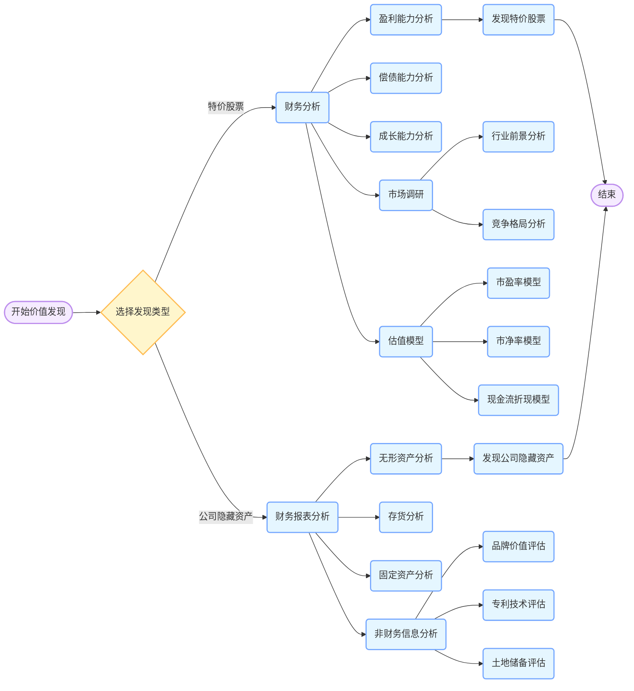

# 特价股票与公司隐藏资产价值发现的方法

> 关键词：特价股票、公司隐藏资产、价值发现、财务分析、投资策略

> 摘要：本文旨在深入探讨特价股票以及公司隐藏资产价值的发现方法。通过介绍相关背景知识，详细阐述核心概念及其联系，分析核心算法原理与操作步骤，运用数学模型和公式进行解释，结合项目实战案例进行代码实现与解读，探讨实际应用场景，推荐学习工具和资源，总结未来发展趋势与挑战等方面，为投资者提供全面、系统的价值发现思路和方法，帮助投资者在股票市场中挖掘潜在的投资机会。

## 1. 背景介绍 
### 1.1 目的和范围
在股票投资领域，寻找特价股票并发现公司隐藏资产价值是投资者追求超额收益的重要途径。特价股票通常指那些市场价格低于其内在价值的股票，而公司隐藏资产则是指未在财务报表中充分体现或被市场低估的资产。本文章的目的是系统地介绍发现特价股票和公司隐藏资产价值的方法，涵盖财务分析、市场调研、数据挖掘等多个方面，旨在为投资者提供全面的理论和实践指导。

### 1.2 预期读者
本文预期读者主要包括股票投资者、金融分析师、投资顾问以及对股票投资和公司价值分析感兴趣的专业人士和爱好者。无论您是新手投资者还是有一定经验的专业人士，都能从本文中获取有价值的信息和方法。

### 1.3 文档结构概述
本文将按照以下结构进行阐述：首先介绍相关背景知识，包括目的、预期读者和文档结构；接着讲解核心概念与联系，通过文本示意图和 Mermaid 流程图进行说明；然后详细阐述核心算法原理和具体操作步骤，并使用 Python 源代码进行演示；再介绍数学模型和公式，并结合实际例子进行讲解；之后通过项目实战案例展示代码实现和详细解释；探讨实际应用场景；推荐学习工具和资源；最后总结未来发展趋势与挑战，并提供常见问题解答和扩展阅读参考资料。

### 1.4 术语表
#### 1.4.1 核心术语定义
- **特价股票**：指市场价格低于其内在价值的股票，投资者可以通过合理的价值评估方法发现这类股票，从而获得潜在的投资收益。
- **公司隐藏资产**：是指未在公司财务报表中充分体现或被市场低估的资产，如品牌价值、专利技术、土地储备等。这些资产可能对公司的未来发展和盈利能力产生重要影响。
- **内在价值**：是指股票或公司的真实价值，通常通过对公司的财务状况、经营业绩、行业前景等因素进行综合分析和评估得出。
- **财务报表**：是公司定期公布的反映其财务状况和经营成果的文件，主要包括资产负债表、利润表和现金流量表。

#### 1.4.2 相关概念解释
- **价值投资**：是一种投资策略，强调通过分析公司的内在价值来选择投资对象，买入被低估的股票并长期持有，等待市场价格回归内在价值，从而获得投资收益。
- **资产负债表分析**：是对公司资产负债表进行深入研究，了解公司的资产结构、负债水平和所有者权益状况，评估公司的财务健康状况和偿债能力。
- **现金流量分析**：是对公司现金流量表进行分析，了解公司的现金流入和流出情况，评估公司的经营活动、投资活动和筹资活动的现金创造能力和资金运用效率。

#### 1.4.3 缩略词列表
- **PE**：市盈率（Price-to-Earnings Ratio），是指股票价格与每股收益的比率，用于衡量股票的估值水平。
- **PB**：市净率（Price-to-Book Ratio），是指股票价格与每股净资产的比率，用于衡量股票的估值水平和公司的净资产价值。
- **DCF**：现金流折现法（Discounted Cash Flow），是一种通过预测公司未来现金流量并将其折现到当前价值的方法，用于评估公司的内在价值。

## 2. 核心概念与联系 

### 核心概念原理
特价股票和公司隐藏资产价值发现的核心原理在于对公司内在价值的准确评估。公司的内在价值是由其未来的盈利能力和资产价值决定的。然而，市场价格往往受到多种因素的影响，如投资者情绪、宏观经济环境等，可能会偏离公司的内在价值。因此，投资者需要通过深入的财务分析、行业研究和市场调研，发现那些市场价格低于内在价值的特价股票，以及未被市场充分认识的公司隐藏资产。

### 架构的文本示意图
```plaintext
价值发现方法
|-- 特价股票发现
|   |-- 财务分析
|   |   |-- 盈利能力分析
|   |   |-- 偿债能力分析
|   |   |-- 成长能力分析
|   |-- 市场调研
|   |   |-- 行业前景分析
|   |   |-- 竞争格局分析
|   |-- 估值模型
|       |-- 市盈率模型
|       |-- 市净率模型
|       |-- 现金流折现模型
|-- 公司隐藏资产发现
|   |-- 财务报表分析
|   |   |-- 无形资产分析
|   |   |-- 存货分析
|   |   |-- 固定资产分析
|   |-- 非财务信息分析
|       |-- 品牌价值评估
|       |-- 专利技术评估
|       |-- 土地储备评估
```

### Mermaid 流程图


## 3. 核心算法原理 & 具体操作步骤 

### 市盈率模型原理及 Python 实现
市盈率（PE）是最常用的股票估值指标之一，它反映了投资者为获得公司每一元盈利所愿意支付的价格。市盈率模型的基本公式为：

$$PE = \frac{P}{EPS}$$

其中，$P$ 是股票价格，$EPS$ 是每股收益。通过比较目标股票的市盈率与同行业其他股票的市盈率，可以判断该股票是否被低估或高估。

以下是使用 Python 实现市盈率计算和比较的代码示例：
```python
# 定义股票数据
stock_prices = [50, 60, 70, 80]
earnings_per_share = [2, 3, 4, 5]

# 计算市盈率
pe_ratios = []
for price, eps in zip(stock_prices, earnings_per_share):
    pe = price / eps
    pe_ratios.append(pe)

# 打印市盈率
for i, pe in enumerate(pe_ratios):
    print(f"股票 {i+1} 的市盈率: {pe}")

# 计算平均市盈率
average_pe = sum(pe_ratios) / len(pe_ratios)
print(f"平均市盈率: {average_pe}")

# 找出被低估的股票
undervalued_stocks = []
for i, pe in enumerate(pe_ratios):
    if pe < average_pe:
        undervalued_stocks.append(i+1)

print(f"被低估的股票: {undervalued_stocks}")
```

### 市净率模型原理及 Python 实现
市净率（PB）是另一个重要的股票估值指标，它反映了投资者为获得公司每一元净资产所愿意支付的价格。市净率模型的基本公式为：

$$PB = \frac{P}{BVPS}$$

其中，$P$ 是股票价格，$BVPS$ 是每股净资产。通过比较目标股票的市净率与同行业其他股票的市净率，可以判断该股票是否被低估或高估。

以下是使用 Python 实现市净率计算和比较的代码示例：
```python
# 定义股票数据
stock_prices = [50, 60, 70, 80]
book_value_per_share = [10, 15, 20, 25]

# 计算市净率
pb_ratios = []
for price, bvps in zip(stock_prices, book_value_per_share):
    pb = price / bvps
    pb_ratios.append(pb)

# 打印市净率
for i, pb in enumerate(pb_ratios):
    print(f"股票 {i+1} 的市净率: {pb}")

# 计算平均市净率
average_pb = sum(pb_ratios) / len(pb_ratios)
print(f"平均市净率: {average_pb}")

# 找出被低估的股票
undervalued_stocks = []
for i, pb in enumerate(pb_ratios):
    if pb < average_pb:
        undervalued_stocks.append(i+1)

print(f"被低估的股票: {undervalued_stocks}")
```

### 现金流折现模型原理及 Python 实现
现金流折现法（DCF）是一种通过预测公司未来现金流量并将其折现到当前价值的方法，用于评估公司的内在价值。现金流折现模型的基本公式为：

$$V = \sum_{t=1}^{n} \frac{CF_t}{(1 + r)^t} + \frac{TV}{(1 + r)^n}$$

其中，$V$ 是公司的内在价值，$CF_t$ 是第 $t$ 期的现金流量，$r$ 是折现率，$TV$ 是终值，$n$ 是预测期数。

以下是使用 Python 实现现金流折现模型的代码示例：
```python
# 定义参数
cash_flows = [100, 120, 140, 160, 180]
discount_rate = 0.1
terminal_value = 2000
n = len(cash_flows)

# 计算现金流现值
present_values = []
for t, cf in enumerate(cash_flows, start=1):
    pv = cf / ((1 + discount_rate) ** t)
    present_values.append(pv)

# 计算终值现值
terminal_value_pv = terminal_value / ((1 + discount_rate) ** n)

# 计算公司内在价值
intrinsic_value = sum(present_values) + terminal_value_pv

print(f"公司内在价值: {intrinsic_value}")
```

### 具体操作步骤
1. **数据收集**：收集目标公司的财务报表、行业数据、市场信息等相关数据。
2. **财务分析**：对公司的盈利能力、偿债能力、成长能力等进行分析，评估公司的财务状况。
3. **估值模型选择**：根据公司的特点和行业情况，选择合适的估值模型，如市盈率模型、市净率模型或现金流折现模型。
4. **模型计算**：使用收集到的数据和选择的估值模型，计算公司的内在价值。
5. **比较分析**：将计算得到的内在价值与市场价格进行比较，判断股票是否被低估或高估。
6. **隐藏资产发现**：通过对公司财务报表和非财务信息的分析，发现公司的隐藏资产，如无形资产、土地储备等。
7. **投资决策**：根据分析结果，做出投资决策，选择具有投资价值的股票。

## 4. 数学模型和公式 & 详细讲解 & 举例说明 

### 市盈率模型
#### 公式
$$PE = \frac{P}{EPS}$$

#### 详细讲解
市盈率反映了投资者为获得公司每一元盈利所愿意支付的价格。一般来说，市盈率越低，股票越被低估，具有更高的投资价值；市盈率越高，股票越被高估，投资风险越大。然而，市盈率的高低也受到行业特点、公司成长前景等因素的影响，因此在使用市盈率进行估值时，需要结合其他指标进行综合分析。

#### 举例说明
假设某公司的股票价格为 50 元，每股收益为 5 元，则该公司的市盈率为：

$$PE = \frac{50}{5} = 10$$

如果同行业其他公司的平均市盈率为 15，则该公司的股票可能被低估，具有一定的投资价值。

### 市净率模型
#### 公式
$$PB = \frac{P}{BVPS}$$

#### 详细讲解
市净率反映了投资者为获得公司每一元净资产所愿意支付的价格。一般来说，市净率越低，股票越被低估，具有更高的投资价值；市净率越高，股票越被高估，投资风险越大。市净率模型适用于那些资产价值对公司盈利能力影响较大的行业，如金融、房地产等。

#### 举例说明
假设某公司的股票价格为 60 元，每股净资产为 20 元，则该公司的市净率为：

$$PB = \frac{60}{20} = 3$$

如果同行业其他公司的平均市净率为 4，则该公司的股票可能被低估，具有一定的投资价值。

### 现金流折现模型
#### 公式
$$V = \sum_{t=1}^{n} \frac{CF_t}{(1 + r)^t} + \frac{TV}{(1 + r)^n}$$

#### 详细讲解
现金流折现模型通过预测公司未来现金流量并将其折现到当前价值，来评估公司的内在价值。其中，$CF_t$ 是第 $t$ 期的现金流量，$r$ 是折现率，$TV$ 是终值，$n$ 是预测期数。折现率反映了投资者对投资风险的要求，一般可以使用资本资产定价模型（CAPM）来确定。终值是指预测期结束后公司的价值，通常可以使用永续增长模型来计算。

#### 举例说明
假设某公司未来 5 年的现金流量分别为 100 万元、120 万元、140 万元、160 万元和 180 万元，折现率为 10%，预测期结束后公司的终值为 2000 万元。则该公司的内在价值为：

$$V = \frac{100}{(1 + 0.1)^1} + \frac{120}{(1 + 0.1)^2} + \frac{140}{(1 + 0.1)^3} + \frac{160}{(1 + 0.1)^4} + \frac{180}{(1 + 0.1)^5} + \frac{2000}{(1 + 0.1)^5}$$

```python
import math

cash_flows = [100, 120, 140, 160, 180]
discount_rate = 0.1
terminal_value = 2000
n = len(cash_flows)

present_values = []
for t, cf in enumerate(cash_flows, start=1):
    pv = cf / ((1 + discount_rate) ** t)
    present_values.append(pv)

terminal_value_pv = terminal_value / ((1 + discount_rate) ** n)

intrinsic_value = sum(present_values) + terminal_value_pv
print(f"公司内在价值: {intrinsic_value} 万元")
```

## 5. 项目实战：代码实际案例和详细解释说明 

### 5.1  开发环境搭建
在进行项目实战之前，需要搭建相应的开发环境。以下是具体的搭建步骤：
1. **安装 Python**：从 Python 官方网站（https://www.python.org/downloads/）下载并安装 Python 3.x 版本。
2. **安装必要的库**：使用以下命令安装所需的库：
```sh
pip install pandas numpy matplotlib requests
```
- `pandas`：用于数据处理和分析。
- `numpy`：用于数值计算。
- `matplotlib`：用于数据可视化。
- `requests`：用于网络请求，获取股票数据。

### 5.2  源代码详细实现和代码解读
以下是一个使用 Python 实现特价股票筛选和公司隐藏资产发现的完整代码示例：
```python
import requests
import pandas as pd
import matplotlib.pyplot as plt

# 获取股票数据
def get_stock_data(symbol):
    url = f"https://api.example.com/stocks/{symbol}"  # 替换为实际的 API 地址
    response = requests.get(url)
    if response.status_code == 200:
        data = response.json()
        return data
    else:
        print(f"获取股票数据失败，状态码: {response.status_code}")
        return None

# 计算市盈率
def calculate_pe(price, eps):
    if eps == 0:
        return None
    return price / eps

# 计算市净率
def calculate_pb(price, bvps):
    if bvps == 0:
        return None
    return price / bvps

# 筛选特价股票
def filter_undervalued_stocks(stocks, pe_threshold=15, pb_threshold=2):
    undervalued_stocks = []
    for stock in stocks:
        price = stock['price']
        eps = stock['eps']
        bvps = stock['bvps']
        pe = calculate_pe(price, eps)
        pb = calculate_pb(price, bvps)
        if pe is not None and pb is not None and pe < pe_threshold and pb < pb_threshold:
            undervalued_stocks.append(stock)
    return undervalued_stocks

# 主函数
def main():
    symbols = ['AAPL', 'GOOG', 'MSFT', 'AMZN']  # 替换为实际的股票代码
    stocks = []
    for symbol in symbols:
        data = get_stock_data(symbol)
        if data is not None:
            stocks.append(data)

    undervalued_stocks = filter_undervalued_stocks(stocks)
    print("被低估的股票:")
    for stock in undervalued_stocks:
        print(f"股票代码: {stock['symbol']}, 价格: {stock['price']}, 市盈率: {calculate_pe(stock['price'], stock['eps'])}, 市净率: {calculate_pb(stock['price'], stock['bvps'])}")

    # 数据可视化
    df = pd.DataFrame(stocks)
    plt.figure(figsize=(10, 6))
    plt.scatter(df['pe'], df['pb'])
    plt.xlabel('市盈率')
    plt.ylabel('市净率')
    plt.title('股票市盈率和市净率分布')
    plt.show()

if __name__ == "__main__":
    main()
```

### 5.3  代码解读与分析
1. **获取股票数据**：`get_stock_data` 函数通过网络请求获取指定股票的相关数据，包括股票价格、每股收益和每股净资产等。
2. **计算市盈率和市净率**：`calculate_pe` 和 `calculate_pb` 函数分别用于计算股票的市盈率和市净率。
3. **筛选特价股票**：`filter_undervalued_stocks` 函数根据设定的市盈率和市净率阈值，筛选出被低估的股票。
4. **主函数**：`main` 函数是程序的入口，它首先获取多个股票的数据，然后调用 `filter_undervalued_stocks` 函数筛选出被低估的股票，并将结果打印输出。最后，使用 `matplotlib` 库将股票的市盈率和市净率进行可视化展示。

通过这个代码示例，我们可以看到如何使用 Python 实现特价股票的筛选和数据可视化，为投资者提供了一种简单有效的价值发现方法。

## 6. 实际应用场景 
### 个人投资者
个人投资者可以使用本文介绍的方法，发现特价股票和公司隐藏资产价值，制定合理的投资策略。通过对公司财务报表的分析和估值模型的应用，个人投资者可以筛选出具有投资价值的股票，降低投资风险，提高投资收益。

### 机构投资者
机构投资者如基金公司、证券公司等，通常需要对大量的股票进行研究和分析，以制定投资组合。本文介绍的方法可以帮助机构投资者快速准确地发现特价股票和公司隐藏资产价值，优化投资组合，提高投资绩效。

### 金融分析师
金融分析师可以使用本文介绍的方法，为客户提供专业的投资建议和研究报告。通过对公司的深入分析和价值评估，金融分析师可以为客户提供有针对性的投资策略，帮助客户实现投资目标。

## 7. 工具和资源推荐
### 7.1 学习资源推荐
#### 7.1.1 书籍推荐
- 《聪明的投资者》（The Intelligent Investor）：本杰明·格雷厄姆（Benjamin Graham）著，被誉为投资领域的圣经，详细介绍了价值投资的理念和方法。
- 《证券分析》（Security Analysis）：本杰明·格雷厄姆和大卫·多德（David Dodd）著，是价值投资的经典著作，对财务分析和估值方法进行了深入探讨。
- 《财务报表分析与证券定价》（Financial Statement Analysis and Security Valuation）：斯蒂芬·彭曼（Stephen Penman）著，系统介绍了财务报表分析和证券定价的理论和方法。

#### 7.1.2 在线课程
- Coursera 上的“投资学原理”（Principles of Investment）：由知名教授授课，涵盖了投资组合理论、资产定价模型等投资领域的基础知识。
- edX 上的“财务报表分析”（Financial Statement Analysis）：帮助学习者掌握财务报表分析的方法和技巧，提高财务分析能力。
- Udemy 上的“价值投资实战”（Value Investing in Practice）：通过实际案例讲解价值投资的方法和策略，具有很强的实践性。

#### 7.1.3 技术博客和网站
- 雪球网（https://xueqiu.com/）：国内知名的投资社区，提供股票行情、财务数据、研究报告等丰富的投资信息，还有众多投资者分享投资经验和观点。
- 东方财富网（https://www.eastmoney.com/）：提供全面的金融信息和数据服务，包括股票、基金、债券等市场的行情、分析和研究报告。
- Seeking Alpha（https://seekingalpha.com/）：国际知名的投资研究网站，汇聚了众多专业分析师和投资者的文章和观点，对全球股票市场进行深入分析和研究。

### 7.2 开发工具框架推荐
#### 7.2.1 IDE和编辑器
- PyCharm：功能强大的 Python 集成开发环境，提供代码编辑、调试、版本控制等丰富的功能，适合专业开发者使用。
- Jupyter Notebook：交互式的开发环境，支持 Python、R 等多种编程语言，方便进行数据探索、分析和可视化。
- Visual Studio Code：轻量级的代码编辑器，支持多种编程语言和插件扩展，具有良好的用户体验和扩展性。

#### 7.2.2 调试和性能分析工具
- PDB：Python 内置的调试器，可用于调试 Python 代码，定位和解决程序中的问题。
- cProfile：Python 标准库中的性能分析工具，可用于分析 Python 程序的性能瓶颈，找出耗时较长的代码段。
- Py-Spy：用于实时分析 Python 程序的性能，以可视化的方式展示程序的运行状态和性能指标。

#### 7.2.3 相关框架和库
- Pandas：用于数据处理和分析的 Python 库，提供了高效的数据结构和数据操作方法，如 DataFrame 和 Series。
- NumPy：用于数值计算的 Python 库，提供了多维数组对象和各种数学函数，是科学计算的基础库。
- Matplotlib：用于数据可视化的 Python 库，提供了丰富的绘图功能，可用于绘制折线图、柱状图、散点图等各种图表。

### 7.3 相关论文著作推荐
#### 7.3.1 经典论文
- “The Cross - Section of Expected Stock Returns”（Eugene F. Fama and Kenneth R. French，1992）：提出了著名的 Fama - French 三因子模型，对股票收益率的影响因素进行了深入研究。
- “Common Risk Factors in the Returns on Stocks and Bonds”（Eugene F. Fama and Kenneth R. French，1993）：进一步扩展了 Fama - French 三因子模型，考虑了市场风险、规模因子和价值因子对股票和债券收益率的影响。
- “Market Efficiency, Long - Term Returns, and Behavioral Finance”（Richard Thaler，1993）：探讨了市场效率和行为金融学的相关问题，对传统金融理论提出了挑战。

#### 7.3.2 最新研究成果
- “Factor Investing in China: A Comprehensive Analysis”（最新研究）：对中国市场的因子投资进行了全面分析，为投资者在新兴市场的投资提供了参考。
- “Machine Learning in Asset Pricing”（最新研究）：探讨了机器学习在资产定价中的应用，为资产定价提供了新的方法和思路。
- “The Impact of ESG Factors on Stock Returns”（最新研究）：研究了环境、社会和治理（ESG）因素对股票收益率的影响，为可持续投资提供了理论支持。

#### 7.3.3 应用案例分析
- 《价值投资案例集》：收集了多个成功的价值投资案例，详细分析了投资者如何发现特价股票和公司隐藏资产价值，制定投资策略并取得良好的投资回报。
- 《投资银行案例分析》：通过对投资银行实际项目的分析，介绍了如何运用财务分析和估值方法进行企业价值评估和投资决策。

## 8. 总结：未来发展趋势与挑战
### 未来发展趋势
- **数据驱动的投资决策**：随着大数据、人工智能和机器学习技术的不断发展，投资者将越来越依赖数据驱动的投资决策方法。通过对海量金融数据的分析和挖掘，投资者可以更准确地发现特价股票和公司隐藏资产价值，提高投资决策的科学性和准确性。
- **跨学科融合**：价值发现将不再局限于传统的财务分析和金融理论，而是与计算机科学、统计学、心理学等多个学科进行深度融合。跨学科的研究和应用将为价值发现带来新的思路和方法。
- **可持续投资**：环境、社会和治理（ESG）因素将越来越受到投资者的关注。未来，投资者在发现特价股票和公司隐藏资产价值时，将更加注重公司的可持续发展能力和社会责任履行情况。

### 挑战
- **数据质量和可靠性**：数据是价值发现的基础，但金融数据的质量和可靠性往往受到多种因素的影响，如数据来源的准确性、数据处理的规范性等。投资者需要花费大量的时间和精力来确保数据的质量和可靠性。
- **模型的局限性**：现有的估值模型和分析方法都存在一定的局限性，无法完全准确地评估公司的内在价值和隐藏资产价值。投资者需要不断改进和完善模型，结合实际情况进行综合分析。
- **市场的不确定性**：股票市场受到宏观经济环境、政策变化、投资者情绪等多种因素的影响，具有高度的不确定性。投资者需要具备较强的风险意识和应对能力，以应对市场的变化和挑战。

## 9. 附录：常见问题与解答
### 如何确定折现率？
折现率反映了投资者对投资风险的要求，一般可以使用资本资产定价模型（CAPM）来确定。CAPM 的公式为：

$$r = r_f + \beta \times (r_m - r_f)$$

其中，$r$ 是折现率，$r_f$ 是无风险利率，$\beta$ 是股票的贝塔系数，$r_m$ 是市场收益率。

### 如何评估公司的隐藏资产价值？
评估公司的隐藏资产价值需要综合考虑多个因素，如无形资产的价值、土地储备的价值、品牌价值等。可以采用专业的评估方法，如收益法、市场法和成本法等，结合公司的实际情况进行评估。

### 价值投资是否适用于所有市场？
价值投资的理念和方法适用于大多数市场，但在不同的市场环境中，其效果可能会有所不同。在新兴市场中，由于市场效率相对较低，价值投资可能更容易发现被低估的股票；而在成熟市场中，市场效率较高，价值投资需要更加深入的研究和分析。

## 10. 扩展阅读 & 参考资料
- 《投资中最简单的事》，邱国鹭著
- 《巴菲特致股东的信：股份公司教程》，沃伦·巴菲特著
- 《金融炼金术》，乔治·索罗斯著
- 中国证券监督管理委员会官方网站（https://www.csrc.gov.cn/）
- 美国证券交易委员会官方网站（https://www.sec.gov/）

作者：AI天才研究院/AI Genius Institute & 禅与计算机程序设计艺术 /Zen And The Art of Computer Programming