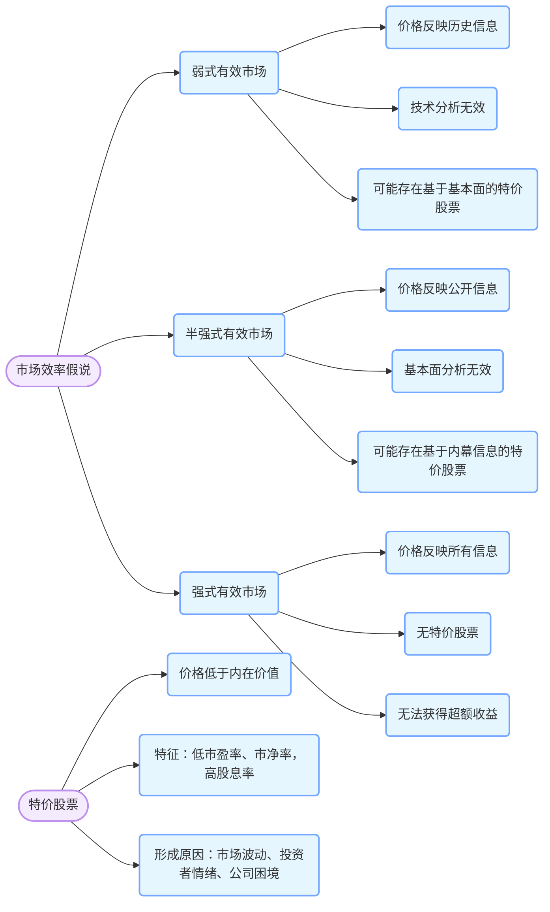

# 特价股票与市场效率假说的关系

> 关键词：特价股票、市场效率假说、有效市场、股票定价、投资策略

> 摘要：本文深入探讨了特价股票与市场效率假说之间的关系。首先介绍了相关的背景知识，包括研究目的、预期读者、文档结构和术语定义。接着阐述了特价股票和市场效率假说的核心概念及其联系，并通过示意图和流程图进行直观展示。详细讲解了与二者相关的核心算法原理及具体操作步骤，运用 Python 代码进行说明。同时给出了相关的数学模型和公式，并举例进行详细解释。通过项目实战展示了如何在实际中应用这些理论，包括开发环境搭建、源代码实现与解读。分析了特价股票与市场效率假说在实际中的应用场景，推荐了相关的学习资源、开发工具和论文著作。最后总结了未来的发展趋势与挑战，并对常见问题进行了解答。

## 1. 背景介绍 
### 1.1 目的和范围
本研究的目的在于全面剖析特价股票与市场效率假说之间的内在联系。在金融市场中，投资者总是希望找到具有投资价值的股票，而特价股票往往被认为是可能带来超额收益的投资标的。市场效率假说则对市场的定价机制和信息有效性进行了阐述。通过研究二者的关系，有助于投资者更好地理解市场，制定合理的投资策略，同时也为金融理论的发展提供参考。

研究范围涵盖了不同类型的金融市场，包括股票市场、债券市场等，但主要聚焦于股票市场。我们将分析在不同市场效率水平下，特价股票的形成机制、特征以及投资机会。

### 1.2 预期读者
本文的预期读者包括金融投资者、金融分析师、金融研究人员以及对金融市场感兴趣的学生和爱好者。对于投资者来说，了解特价股票与市场效率假说的关系可以帮助他们识别潜在的投资机会，提高投资收益。金融分析师可以借助本文的研究成果，为客户提供更专业的投资建议。金融研究人员可以在此基础上进行更深入的学术研究。学生和爱好者则可以通过阅读本文，加深对金融市场基本原理的理解。

### 1.3 文档结构概述
本文将按照以下结构进行阐述：首先介绍相关的背景知识，包括目的、读者、文档结构和术语定义。接着讲解特价股票和市场效率假说的核心概念及其联系，通过示意图和流程图进行直观展示。然后详细介绍核心算法原理和具体操作步骤，运用 Python 代码进行说明。再给出相关的数学模型和公式，并举例进行详细解释。通过项目实战展示如何在实际中应用这些理论，包括开发环境搭建、源代码实现与解读。分析实际应用场景，推荐相关的学习资源、开发工具和论文著作。最后总结未来的发展趋势与挑战，并对常见问题进行解答。

### 1.4 术语表
#### 1.4.1 核心术语定义
- **特价股票**：指市场价格低于其内在价值的股票。内在价值是基于公司的基本面因素，如盈利、资产、现金流等进行评估的理论价值。
- **市场效率假说**：该假说认为金融市场的价格能够充分反映所有可用信息。根据信息的不同层次，可分为弱式有效市场、半强式有效市场和强式有效市场。
- **有效市场**：符合市场效率假说的市场，即市场价格能够迅速、准确地反映所有相关信息。
- **超额收益**：指投资组合的实际收益超过市场平均收益的部分。

#### 1.4.2 相关概念解释
- **信息有效性**：指市场参与者能够及时、准确地获取和利用相关信息。在有效市场中，信息能够迅速反映在股票价格中。
- **基本面分析**：通过研究公司的财务报表、行业前景、宏观经济环境等基本面因素，评估股票的内在价值。
- **技术分析**：通过研究股票价格和成交量的历史数据，预测股票未来的价格走势。

#### 1.4.3 缩略词列表
- **EMH**：Efficient Market Hypothesis，市场效率假说
- **CAPM**：Capital Asset Pricing Model，资本资产定价模型

## 2. 核心概念与联系 
### 2.1 特价股票的概念与特征
特价股票是指那些市场价格低于其内在价值的股票。内在价值的评估通常基于公司的基本面因素，如盈利、资产、现金流等。特价股票可能由于市场的短期波动、投资者的情绪影响、公司的暂时困境等原因而出现。

特价股票的特征包括：较低的市盈率、市净率，较高的股息率等。这些特征表明股票的价格相对较低，具有一定的投资价值。

### 2.2 市场效率假说的类型与含义
市场效率假说根据信息的不同层次，可分为弱式有效市场、半强式有效市场和强式有效市场。

- **弱式有效市场**：市场价格已经反映了所有历史价格和成交量信息。在弱式有效市场中，技术分析无法获得超额收益。
- **半强式有效市场**：市场价格不仅反映了历史信息，还反映了所有公开可用的信息，如公司的财务报表、新闻公告等。在半强式有效市场中，基本面分析也无法获得超额收益。
- **强式有效市场**：市场价格反映了所有信息，包括公开信息和内幕信息。在强式有效市场中，即使是内幕信息也无法获得超额收益。

### 2.3 特价股票与市场效率假说的联系
在不同的市场效率水平下，特价股票的存在和投资机会有所不同。

在弱式有效市场中，虽然技术分析无法获得超额收益，但由于市场价格可能没有完全反映公司的基本面信息，因此可能存在特价股票。投资者可以通过基本面分析来发现这些特价股票，从而获得超额收益。

在半强式有效市场中，由于市场价格已经反映了所有公开信息，因此很难通过基本面分析发现特价股票。但如果投资者能够获得非公开的内幕信息，仍然可能发现特价股票并获得超额收益。

在强式有效市场中，由于市场价格已经反映了所有信息，包括内幕信息，因此不存在特价股票，投资者无法通过任何分析方法获得超额收益。

### 2.4 核心概念原理和架构的文本示意图
```plaintext
市场效率假说
|-- 弱式有效市场
|   |-- 价格反映历史信息
|   |-- 技术分析无效
|   |-- 可能存在基于基本面的特价股票
|-- 半强式有效市场
|   |-- 价格反映公开信息
|   |-- 基本面分析无效
|   |-- 可能存在基于内幕信息的特价股票
|-- 强式有效市场
|   |-- 价格反映所有信息
|   |-- 无特价股票
|   |-- 无法获得超额收益

特价股票
|-- 价格低于内在价值
|-- 特征：低市盈率、市净率，高股息率
|-- 形成原因：市场波动、投资者情绪、公司困境
```

### 2.5 Mermaid 流程图


## 3. 核心算法原理 & 具体操作步骤 
### 3.1 评估股票内在价值的算法原理
评估股票内在价值的方法有很多种，这里我们介绍一种常用的方法——股息贴现模型（Dividend Discount Model，DDM）。

股息贴现模型的基本思想是，股票的内在价值等于其未来所有股息的现值之和。假设股票每年支付的股息为 $D_t$，贴现率为 $r$，则股票的内在价值 $V$ 可以表示为：

$$V = \sum_{t=1}^{\infty} \frac{D_t}{(1 + r)^t}$$

在实际应用中，为了简化计算，我们通常假设股息以固定的增长率 $g$ 增长。则股息贴现模型可以简化为：

$$V = \frac{D_1}{r - g}$$

其中，$D_1$ 为下一年的股息，$r$ 为贴现率，$g$ 为股息增长率。

### 3.2 使用 Python 实现股息贴现模型
```python
def ddm_value(D1, r, g):
    """
    计算股票的内在价值
    :param D1: 下一年的股息
    :param r: 贴现率
    :param g: 股息增长率
    :return: 股票的内在价值
    """
    if r <= g:
        raise ValueError("贴现率必须大于股息增长率")
    return D1 / (r - g)

# 示例参数
D1 = 2.0  # 下一年的股息
r = 0.1  # 贴现率
g = 0.05  # 股息增长率

# 计算内在价值
intrinsic_value = ddm_value(D1, r, g)
print(f"股票的内在价值为: {intrinsic_value}")
```

### 3.3 判断特价股票的具体操作步骤
1. **收集数据**：收集公司的财务报表、股息数据、宏观经济数据等，用于评估股息增长率和贴现率。
2. **计算股息增长率**：可以通过分析公司过去的股息数据，使用线性回归等方法来估计股息增长率。
3. **确定贴现率**：贴现率通常可以使用资本资产定价模型（CAPM）来确定。CAPM 的公式为：

$$r = R_f + \beta (R_m - R_f)$$

其中，$R_f$ 为无风险利率，$\beta$ 为股票的贝塔系数，$R_m$ 为市场收益率。

4. **计算股票的内在价值**：使用股息贴现模型计算股票的内在价值。
5. **比较市场价格和内在价值**：如果市场价格低于内在价值，则认为该股票是特价股票。

### 3.4 Python 代码实现判断特价股票
```python
import numpy as np
import pandas as pd
from sklearn.linear_model import LinearRegression

def calculate_growth_rate(dividends):
    """
    计算股息增长率
    :param dividends: 股息数据
    :return: 股息增长率
    """
    X = np.arange(len(dividends)).reshape(-1, 1)
    y = np.log(dividends)
    model = LinearRegression()
    model.fit(X, y)
    return np.exp(model.coef_[0]) - 1

def capm_rate(Rf, beta, Rm):
    """
    计算贴现率
    :param Rf: 无风险利率
    :param beta: 股票的贝塔系数
    :param Rm: 市场收益率
    :return: 贴现率
    """
    return Rf + beta * (Rm - Rf)

# 示例数据
dividends = np.array([1.5, 1.6, 1.7, 1.8, 1.9])  # 过去五年的股息数据
Rf = 0.03  # 无风险利率
beta = 1.2  # 股票的贝塔系数
Rm = 0.1  # 市场收益率
market_price = 30  # 市场价格

# 计算股息增长率
g = calculate_growth_rate(dividends)
# 计算贴现率
r = capm_rate(Rf, beta, Rm)
# 计算下一年的股息
D1 = dividends[-1] * (1 + g)
# 计算内在价值
intrinsic_value = ddm_value(D1, r, g)

# 判断是否为特价股票
if market_price < intrinsic_value:
    print("该股票是特价股票")
else:
    print("该股票不是特价股票")
```

## 4. 数学模型和公式 & 详细讲解 & 举例说明 
### 4.1 股息贴现模型（DDM）
#### 4.1.1 公式推导
股息贴现模型的基本思想是，股票的内在价值等于其未来所有股息的现值之和。假设股票每年支付的股息为 $D_t$，贴现率为 $r$，则股票的内在价值 $V$ 可以表示为：

$$V = \sum_{t=1}^{\infty} \frac{D_t}{(1 + r)^t}$$

在实际应用中，为了简化计算，我们通常假设股息以固定的增长率 $g$ 增长。即 $D_t = D_0 (1 + g)^t$，其中 $D_0$ 为当前的股息。

将 $D_t = D_0 (1 + g)^t$ 代入上式，得到：

$$V = \sum_{t=1}^{\infty} \frac{D_0 (1 + g)^t}{(1 + r)^t}$$

这是一个等比数列求和的问题，公比为 $\frac{1 + g}{1 + r}$。当 $r > g$ 时，等比数列收敛，其和为：

$$V = \frac{D_0 (1 + g)}{r - g} = \frac{D_1}{r - g}$$

其中，$D_1 = D_0 (1 + g)$ 为下一年的股息。

#### 4.1.2 举例说明
假设某股票当前的股息为 $D_0 = 2$ 元，股息增长率为 $g = 0.05$，贴现率为 $r = 0.1$。则下一年的股息为 $D_1 = D_0 (1 + g) = 2 \times (1 + 0.05) = 2.1$ 元。

根据股息贴现模型，该股票的内在价值为：

$$V = \frac{D_1}{r - g} = \frac{2.1}{0.1 - 0.05} = 42$$ 元

如果该股票的市场价格低于 42 元，则认为该股票是特价股票。

### 4.2 资本资产定价模型（CAPM）
#### 4.2.1 公式推导
资本资产定价模型（CAPM）是一种用于确定资产预期收益率的模型。该模型认为，资产的预期收益率等于无风险利率加上风险溢价。风险溢价是由资产的系统性风险（用贝塔系数 $\beta$ 表示）和市场风险溢价（$R_m - R_f$）决定的。

CAPM 的公式为：

$$r = R_f + \beta (R_m - R_f)$$

其中，$r$ 为资产的预期收益率，$R_f$ 为无风险利率，$\beta$ 为资产的贝塔系数，$R_m$ 为市场收益率。

贝塔系数 $\beta$ 衡量了资产的系统性风险，即资产收益率与市场收益率的相关性。$\beta = 1$ 表示资产的系统性风险与市场平均风险相同；$\beta > 1$ 表示资产的系统性风险高于市场平均风险；$\beta < 1$ 表示资产的系统性风险低于市场平均风险。

#### 4.2.2 举例说明
假设无风险利率 $R_f = 0.03$，市场收益率 $R_m = 0.1$，某股票的贝塔系数 $\beta = 1.2$。则该股票的预期收益率为：

$$r = R_f + \beta (R_m - R_f) = 0.03 + 1.2 \times (0.1 - 0.03) = 0.114$$ 或 11.4%

这意味着投资者投资该股票，预期可以获得 11.4% 的收益率。

### 4.3 市场效率假说的数学表达
市场效率假说虽然没有严格的数学公式，但可以通过一些统计方法来检验。例如，在弱式有效市场中，可以通过检验股票价格的自相关性来判断市场是否有效。如果股票价格的自相关性为零，则认为市场是弱式有效的。

假设 $P_t$ 为股票在 $t$ 时刻的价格，则股票价格的自相关系数 $\rho_k$ 可以表示为：

$$\rho_k = \frac{\text{Cov}(P_t, P_{t - k})}{\sqrt{\text{Var}(P_t) \text{Var}(P_{t - k})}}$$

其中，$\text{Cov}(P_t, P_{t - k})$ 为 $P_t$ 和 $P_{t - k}$ 的协方差，$\text{Var}(P_t)$ 和 $\text{Var}(P_{t - k})$ 分别为 $P_t$ 和 $P_{t - k}$ 的方差。

在弱式有效市场中，对于所有的 $k > 0$，有 $\rho_k = 0$。

## 5. 项目实战：代码实际案例和详细解释说明 
### 5.1  开发环境搭建
#### 5.1.1 安装 Python
首先需要安装 Python 环境。可以从 Python 官方网站（https://www.python.org/downloads/）下载适合自己操作系统的 Python 版本进行安装。建议安装 Python 3.7 及以上版本。

#### 5.1.2 安装必要的库
在本项目中，需要使用一些 Python 库，如 `numpy`、`pandas`、`scikit-learn` 等。可以使用 `pip` 命令进行安装：

```sh
pip install numpy pandas scikit-learn
```

### 5.2  源代码详细实现和代码解读
```python
import numpy as np
import pandas as pd
from sklearn.linear_model import LinearRegression

def calculate_growth_rate(dividends):
    """
    计算股息增长率
    :param dividends: 股息数据
    :return: 股息增长率
    """
    X = np.arange(len(dividends)).reshape(-1, 1)
    y = np.log(dividends)
    model = LinearRegression()
    model.fit(X, y)
    return np.exp(model.coef_[0]) - 1

def capm_rate(Rf, beta, Rm):
    """
    计算贴现率
    :param Rf: 无风险利率
    :param beta: 股票的贝塔系数
    :param Rm: 市场收益率
    :return: 贴现率
    """
    return Rf + beta * (Rm - Rf)

def ddm_value(D1, r, g):
    """
    计算股票的内在价值
    :param D1: 下一年的股息
    :param r: 贴现率
    :param g: 股息增长率
    :return: 股票的内在价值
    """
    if r <= g:
        raise ValueError("贴现率必须大于股息增长率")
    return D1 / (r - g)

# 示例数据
dividends = np.array([1.5, 1.6, 1.7, 1.8, 1.9])  # 过去五年的股息数据
Rf = 0.03  # 无风险利率
beta = 1.2  # 股票的贝塔系数
Rm = 0.1  # 市场收益率
market_price = 30  # 市场价格

# 计算股息增长率
g = calculate_growth_rate(dividends)
# 计算贴现率
r = capm_rate(Rf, beta, Rm)
# 计算下一年的股息
D1 = dividends[-1] * (1 + g)
# 计算内在价值
intrinsic_value = ddm_value(D1, r, g)

# 判断是否为特价股票
if market_price < intrinsic_value:
    print("该股票是特价股票")
else:
    print("该股票不是特价股票")
```

### 5.3  代码解读与分析
#### 5.3.1 股息增长率计算函数 `calculate_growth_rate`
该函数使用线性回归的方法来计算股息增长率。首先将股息数据取对数，然后使用线性回归模型拟合对数股息数据与时间的关系。最后通过指数运算将回归系数转换为股息增长率。

#### 5.3.2 贴现率计算函数 `capm_rate`
该函数根据资本资产定价模型（CAPM）计算贴现率。输入参数包括无风险利率 $R_f$、股票的贝塔系数 $\beta$ 和市场收益率 $R_m$。

#### 5.3.3 内在价值计算函数 `ddm_value`
该函数根据股息贴现模型（DDM）计算股票的内在价值。输入参数包括下一年的股息 $D_1$、贴现率 $r$ 和股息增长率 $g$。如果贴现率小于等于股息增长率，会抛出异常。

#### 5.3.4 主程序
主程序中首先定义了示例数据，包括过去五年的股息数据、无风险利率、股票的贝塔系数、市场收益率和市场价格。然后依次调用上述函数计算股息增长率、贴现率、下一年的股息和内在价值。最后根据市场价格和内在价值的比较结果判断该股票是否为特价股票。

## 6. 实际应用场景 
### 6.1 投资者的投资决策
对于投资者来说，了解特价股票与市场效率假说的关系可以帮助他们制定更合理的投资策略。在弱式有效市场中，投资者可以通过基本面分析来寻找特价股票，进行价值投资。例如，投资者可以关注那些市盈率、市净率较低，股息率较高的股票，通过计算其内在价值，判断是否为特价股票。

在半强式有效市场中，由于公开信息已经反映在股票价格中，投资者需要寻找非公开的信息，或者通过更深入的分析来发现潜在的特价股票。例如，投资者可以关注公司的研发投入、新产品推出等信息，评估公司的未来发展潜力。

在强式有效市场中，由于市场价格已经反映了所有信息，投资者很难通过寻找特价股票来获得超额收益。此时，投资者可以选择被动投资策略，如投资指数基金。

### 6.2 金融分析师的研究工作
金融分析师可以利用特价股票与市场效率假说的理论，为客户提供更专业的投资建议。他们可以通过对市场效率的评估，判断不同市场环境下的投资机会。例如，在弱式有效市场中，金融分析师可以通过基本面分析为客户推荐具有投资价值的特价股票。在半强式有效市场中，金融分析师可以关注市场的热点和趋势，为客户提供更具前瞻性的投资建议。

### 6.3 公司的融资决策
对于公司来说，了解市场效率和特价股票的概念可以帮助他们制定更合理的融资决策。在有效市场中，公司的股票价格能够反映其真实价值，因此公司可以根据市场情况选择合适的融资时机和方式。例如，如果公司认为自己的股票被低估，即存在特价股票的情况，公司可以选择回购股票，以提高股东的价值。如果公司认为自己的股票被高估，公司可以选择发行新股，以筹集更多的资金。

### 6.4 监管机构的市场监管
监管机构可以利用市场效率假说的理论，对金融市场进行监管。在有效市场中，市场价格能够迅速、准确地反映所有信息，因此监管机构可以通过监测市场价格的波动和信息披露情况，判断市场是否存在异常行为。例如，如果发现某只股票的价格出现异常波动，而公司并没有相应的信息披露，监管机构可以进行调查，以确保市场的公平、公正和透明。

## 7. 工具和资源推荐
### 7.1 学习资源推荐
#### 7.1.1 书籍推荐
- 《证券分析》（Security Analysis）：本杰明·格雷厄姆（Benjamin Graham）和大卫·多德（David Dodd）所著，被誉为价值投资的圣经。书中详细介绍了如何通过基本面分析来评估股票的内在价值，寻找特价股票。
- 《聪明的投资者》（The Intelligent Investor）：本杰明·格雷厄姆所著，是一本面向普通投资者的投资指南。书中强调了价值投资的理念和方法，对市场效率和投资风险进行了深入探讨。
- 《漫步华尔街》（A Random Walk Down Wall Street）：伯顿·马尔基尔（Burton Malkiel）所著，介绍了市场效率假说的理论和实证研究。书中通过大量的案例和数据，分析了不同市场效率水平下的投资策略。

#### 7.1.2 在线课程
- Coursera 上的“投资学原理”（Principles of Investing）：该课程由耶鲁大学教授罗伯特·席勒（Robert Shiller）授课，介绍了投资学的基本原理和方法，包括市场效率假说、资产定价模型等内容。
- edX 上的“金融市场”（Financial Markets）：该课程由耶鲁大学教授罗伯特·席勒授课，深入探讨了金融市场的运行机制和投资策略，对市场效率和特价股票的关系进行了详细分析。

#### 7.1.3 技术博客和网站
- Seeking Alpha：一个金融投资领域的博客网站，提供了大量的股票分析和投资建议。网站上的文章来自于专业的金融分析师和投资者，对市场效率和特价股票的研究有很高的参考价值。
- Investopedia：一个金融知识学习网站，提供了丰富的金融术语解释、投资策略分析等内容。网站上的文章通俗易懂，适合初学者学习。

### 7.2 开发工具框架推荐
#### 7.2.1 IDE和编辑器
- PyCharm：一款专业的 Python 集成开发环境（IDE），提供了丰富的代码编辑、调试、版本控制等功能。适合开发复杂的 Python 程序，如股票分析程序。
- Jupyter Notebook：一个交互式的开发环境，支持 Python、R 等多种编程语言。可以方便地进行数据探索、模型开发和可视化展示，适合进行股票数据分析和建模。

#### 7.2.2 调试和性能分析工具
- pdb：Python 自带的调试工具，可以帮助开发者在代码执行过程中进行调试，查找和修复代码中的错误。
- cProfile：Python 自带的性能分析工具，可以帮助开发者分析代码的性能瓶颈，优化代码的执行效率。

#### 7.2.3 相关框架和库
- Pandas：一个强大的数据分析库，提供了高效的数据结构和数据处理工具，适合进行股票数据的清洗、分析和处理。
- NumPy：一个用于科学计算的库，提供了高效的数组操作和数学函数，适合进行股票数据的数值计算和分析。
- Scikit-learn：一个机器学习库，提供了丰富的机器学习算法和工具，适合进行股票价格预测和投资策略优化。

### 7.3 相关论文著作推荐
#### 7.3.1 经典论文
- “Efficient Capital Markets: A Review of Theory and Empirical Work”：尤金·法玛（Eugene F. Fama）所著，该论文首次提出了市场效率假说的概念，并对其进行了系统的阐述和实证研究。
- “The Cross-Section of Expected Stock Returns”：尤金·法玛和肯尼斯·弗伦奇（Kenneth R. French）所著，该论文提出了三因素模型，对股票的预期收益率进行了更准确的解释。

#### 7.3.2 最新研究成果
- “Anomalies and Market Efficiency”：该论文对市场效率假说的最新研究成果进行了综述，分析了市场中存在的各种异常现象及其对市场效率的影响。
- “Machine Learning for Asset Pricing”：该论文探讨了机器学习在资产定价中的应用，提出了一些新的资产定价模型和方法。

#### 7.3.3 应用案例分析
- “Value Investing: The Use of Historical Financial Statement Information to Separate Winners from Losers”：该论文通过实证研究，分析了价值投资策略在不同市场环境下的有效性，为投资者提供了实用的投资建议。
- “Investment Strategies Based on Market Efficiency Hypothesis: A Case Study of Chinese Stock Market”：该论文以中国股票市场为例，分析了市场效率假说在实际应用中的情况，提出了适合中国市场的投资策略。

## 8. 总结：未来发展趋势与挑战
### 8.1 未来发展趋势
#### 8.1.1 市场效率的提升
随着信息技术的不断发展和金融市场的不断完善，市场效率有望进一步提升。信息的传播速度将更快，投资者获取和处理信息的能力将更强，市场价格将更加准确地反映所有可用信息。这将使得寻找特价股票的难度加大，投资者需要更加深入地分析和研究市场。

#### 8.1.2 量化投资的发展
量化投资将成为未来投资的重要趋势。通过运用大数据、人工智能等技术，投资者可以对海量的市场数据进行分析和挖掘，发现潜在的投资机会。量化投资模型可以更加准确地评估股票的内在价值和风险，制定更加科学的投资策略。

#### 8.1.3 跨市场投资的增加
随着全球金融市场的一体化，跨市场投资将越来越普遍。投资者可以通过投资不同国家和地区的股票市场，分散投资风险，获取更高的收益。同时，跨市场投资也需要投资者更加了解不同市场的特点和规则，掌握跨市场投资的技巧和方法。

### 8.2 挑战
#### 8.2.1 信息过载
随着信息技术的发展，投资者面临着海量的市场信息。如何从这些信息中筛选出有价值的信息，成为投资者面临的一大挑战。同时，信息的真实性和可靠性也需要投资者进行仔细甄别。

#### 8.2.2 市场操纵和内幕交易
尽管监管机构不断加强对金融市场的监管，但市场操纵和内幕交易仍然时有发生。这些行为会破坏市场的公平、公正和透明，影响市场效率，给投资者带来损失。投资者需要提高警惕，防范市场操纵和内幕交易的风险。

#### 8.2.3 模型风险
量化投资模型虽然可以提高投资决策的科学性和准确性，但也存在一定的风险。模型的假设条件可能与实际市场情况不符，模型的参数可能需要不断调整和优化。投资者需要充分认识到模型风险，合理运用量化投资模型。

## 9. 附录：常见问题与解答
### 9.1 什么是特价股票？
特价股票是指市场价格低于其内在价值的股票。内在价值是基于公司的基本面因素，如盈利、资产、现金流等进行评估的理论价值。

### 9.2 市场效率假说有哪些类型？
市场效率假说根据信息的不同层次，可分为弱式有效市场、半强式有效市场和强式有效市场。弱式有效市场中，市场价格已经反映了所有历史价格和成交量信息；半强式有效市场中，市场价格不仅反映了历史信息，还反映了所有公开可用的信息；强式有效市场中，市场价格反映了所有信息，包括公开信息和内幕信息。

### 9.3 在不同市场效率水平下，如何寻找特价股票？
在弱式有效市场中，可以通过基本面分析来寻找特价股票，关注那些市盈率、市净率较低，股息率较高的股票。在半强式有效市场中，需要寻找非公开的信息，或者通过更深入的分析来发现潜在的特价股票。在强式有效市场中，很难通过寻找特价股票来获得超额收益，投资者可以选择被动投资策略。

### 9.4 股息贴现模型和资本资产定价模型有什么作用？
股息贴现模型用于评估股票的内在价值，通过计算未来股息的现值之和来确定股票的合理价格。资本资产定价模型用于确定资产的预期收益率，考虑了无风险利率、市场风险溢价和资产的系统性风险。

### 9.5 如何判断一个市场是否有效？
可以通过一些统计方法来判断一个市场是否有效。例如，在弱式有效市场中，可以检验股票价格的自相关性，如果自相关性为零，则认为市场是弱式有效的。在半强式有效市场中，可以检验股票价格对公开信息的反应速度和准确性。在强式有效市场中，很难进行直接的检验，但可以通过观察内幕交易的情况来间接判断。

## 10. 扩展阅读 & 参考资料
- Graham, B., & Dodd, D. (1934). Security Analysis. McGraw-Hill.
- Graham, B. (1949). The Intelligent Investor. Harper & Row.
- Malkiel, B. G. (1973). A Random Walk Down Wall Street. W. W. Norton & Company.
- Fama, E. F. (1970). Efficient Capital Markets: A Review of Theory and Empirical Work. The Journal of Finance, 25(2), 383-417.
- Fama, E. F., & French, K. R. (1992). The Cross-Section of Expected Stock Returns. The Journal of Finance, 47(2), 427-465.

作者：AI天才研究院/AI Genius Institute & 禅与计算机程序设计艺术 /Zen And The Art of Computer Programming