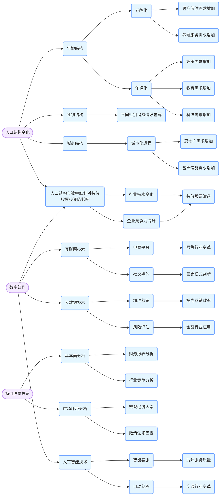

# 特价股票投资中的人口结构数字红利趋势考量

> 关键词：特价股票投资、人口结构、数字红利、趋势考量、投资策略

> 摘要：本文聚焦于特价股票投资领域，深入探讨人口结构与数字红利趋势对其的影响。通过详细分析人口结构变化带来的市场需求转变，以及数字红利在各个行业的渗透和推动作用，阐述如何在特价股票投资中有效考量这些因素。文章介绍了相关核心概念、算法原理、数学模型，并结合实际案例进行说明，同时给出了实际应用场景、工具资源推荐等内容，旨在为投资者提供全面且深入的投资思路和策略，帮助其在复杂的市场环境中把握投资机会，实现资产增值。

## 1. 背景介绍 
### 1.1 目的和范围
在当今复杂多变的金融市场中，特价股票投资一直是投资者关注的焦点。然而，如何准确地选择具有潜力的特价股票并非易事。人口结构的变化和数字红利的兴起，为特价股票投资带来了新的机遇和挑战。本文的目的在于深入研究人口结构数字红利趋势对特价股票投资的影响，为投资者提供科学、系统的投资决策依据。

文章的范围涵盖了人口结构变化的各个方面，包括年龄结构、性别结构、城乡结构等，以及数字红利在不同行业的体现，如科技、医疗、教育等。同时，通过实际案例分析和理论探讨，探讨如何将人口结构数字红利趋势考量融入特价股票投资策略中。

### 1.2 预期读者
本文预期读者主要包括对特价股票投资感兴趣的个人投资者、金融机构的投资分析师、基金经理等。对于想要深入了解人口结构和数字红利对股票投资影响的专业人士和业余投资者，本文提供了有价值的参考和分析。

### 1.3 文档结构概述
本文将按照以下结构进行阐述：首先介绍相关的核心概念和它们之间的联系，包括人口结构、数字红利、特价股票等；接着详细讲解核心算法原理和具体操作步骤，通过 Python 代码进行示例；然后给出相关的数学模型和公式，并进行详细讲解和举例说明；之后通过实际案例展示如何在项目实战中应用这些理论；再探讨实际应用场景；推荐相关的工具和资源；最后总结未来发展趋势与挑战，提供常见问题解答和扩展阅读参考资料。

### 1.4 术语表
#### 1.4.1 核心术语定义
- **特价股票**：指价格相对其内在价值被低估的股票，通常具有较低的市盈率、市净率等指标。
- **人口结构**：是指将人口以不同的标准划分而得到的一种结果，主要包括年龄结构、性别结构、城乡结构、职业结构等。
- **数字红利**：是指由于数字技术的发展和应用，带来的经济增长、效率提升、创新加速等方面的好处。

#### 1.4.2 相关概念解释
- **人口老龄化**：指人口生育率降低和人均寿命延长导致的总人口中因年轻人口数量减少、年长人口数量增加而导致的老年人口比例相应增长的动态。人口老龄化会对消费、医疗、养老等行业产生深远影响。
- **数字化转型**：是指企业或行业利用数字技术对业务流程、产品和服务进行全面改造和升级的过程，以提高效率、降低成本、增强竞争力。

#### 1.4.3 缩略词列表
- **GDP**：国内生产总值（Gross Domestic Product），是一个国家（或地区）所有常住单位在一定时期内生产活动的最终成果。
- **AI**：人工智能（Artificial Intelligence），是研究、开发用于模拟、延伸和扩展人的智能的理论、方法、技术及应用系统的一门新的技术科学。

## 2. 核心概念与联系 

### 核心概念原理
#### 人口结构原理
人口结构的变化是一个长期而复杂的过程，受到多种因素的影响，如出生率、死亡率、移民等。不同的人口结构会导致不同的市场需求和消费模式。例如，随着人口老龄化的加剧，对医疗保健、养老服务等行业的需求会增加；而年轻人口的增长则会带动娱乐、教育、科技等行业的发展。

#### 数字红利原理
数字红利的产生源于数字技术的不断进步和广泛应用。数字技术可以提高生产效率、降低成本、拓展市场、创新商业模式等。例如，互联网、大数据、人工智能等技术的发展，使得企业能够更好地了解消费者需求，提供个性化的产品和服务，从而获得竞争优势。

#### 特价股票原理
特价股票的出现通常是由于市场的短期波动、信息不对称、公司短期业绩不佳等原因导致的。投资者通过深入研究公司的基本面和市场环境，寻找那些被市场低估的股票，以期在未来获得超额收益。

### 架构的文本示意图
```plaintext
人口结构变化
├── 年龄结构
│   ├── 老龄化 -> 医疗保健、养老服务需求增加
│   ├── 年轻化 -> 娱乐、教育、科技需求增加
├── 性别结构
│   ├── 不同性别消费偏好差异
├── 城乡结构
│   ├── 城市化进程 -> 房地产、基础设施需求增加

数字红利
├── 互联网技术
│   ├── 电商平台 -> 零售行业变革
│   ├── 社交媒体 -> 营销模式创新
├── 大数据技术
│   ├── 精准营销 -> 提高营销效率
│   ├── 风险评估 -> 金融行业应用
├── 人工智能技术
│   ├── 智能客服 -> 提升服务质量
│   ├── 自动驾驶 -> 交通行业变革

特价股票投资
├── 基本面分析
│   ├── 财务报表分析
│   ├── 行业竞争分析
├── 市场环境分析
│   ├── 宏观经济因素
│   ├── 政策法规因素

人口结构与数字红利对特价股票投资的影响
├── 人口结构变化 -> 行业需求变化 -> 特价股票筛选
├── 数字红利 -> 企业竞争力提升 -> 特价股票筛选
```

### Mermaid 流程图


## 3. 核心算法原理 & 具体操作步骤 

### 核心算法原理
在特价股票投资中考量人口结构数字红利趋势，我们可以采用多因素综合评估算法。该算法的核心思想是综合考虑人口结构指标、数字红利指标和股票基本面指标，通过加权计算得出每只股票的综合得分，得分越高的股票越具有投资价值。

### 具体操作步骤
#### 步骤 1：数据收集
收集人口结构数据，如不同年龄段人口数量、城乡人口比例等；数字红利相关数据，如企业的数字化投入、数字化业务收入占比等；股票基本面数据，如市盈率、市净率、净利润增长率等。

#### 步骤 2：指标选择与标准化
从收集的数据中选择合适的指标，如人口老龄化率、互联网普及率、净利润增长率等。对这些指标进行标准化处理，以消除不同指标之间的量纲差异。常用的标准化方法有 Z-score 标准化：
$$
z = \frac{x - \mu}{\sigma}
$$
其中，$x$ 是原始数据，$\mu$ 是数据的均值，$\sigma$ 是数据的标准差。

#### 步骤 3：确定权重
根据各个指标对特价股票投资的重要程度，确定每个指标的权重。可以采用专家打分法、层次分析法等方法来确定权重。

#### 步骤 4：计算综合得分
将标准化后的指标值乘以相应的权重，然后相加得到每只股票的综合得分。计算公式如下：
$$
S = \sum_{i=1}^{n} w_i z_i
$$
其中，$S$ 是综合得分，$w_i$ 是第 $i$ 个指标的权重，$z_i$ 是第 $i$ 个指标的标准化值。

#### 步骤 5：筛选股票
根据综合得分对股票进行排序，选择得分较高的股票作为投资候选对象。

### Python 源代码实现
```python
import pandas as pd
import numpy as np

# 步骤 1：数据收集
# 假设已经收集到了以下数据，存储在 CSV 文件中
data = pd.read_csv('stock_data.csv')

# 步骤 2：指标选择与标准化
selected_columns = ['aging_rate', 'internet_penetration', 'pe_ratio', 'net_profit_growth_rate']
selected_data = data[selected_columns]

# Z-score 标准化
standardized_data = (selected_data - selected_data.mean()) / selected_data.std()

# 步骤 3：确定权重
weights = np.array([0.3, 0.2, 0.2, 0.3])

# 步骤 4：计算综合得分
scores = np.dot(standardized_data, weights)
data['score'] = scores

# 步骤 5：筛选股票
top_stocks = data.nlargest(10, 'score')

print(top_stocks)
```

## 4. 数学模型和公式 & 详细讲解 & 举例说明 

### 数学模型
我们构建的多因素综合评估模型可以用以下公式表示：
$$
S = \sum_{i=1}^{n} w_i z_i
$$
其中，$S$ 是股票的综合得分，$w_i$ 是第 $i$ 个指标的权重，$z_i$ 是第 $i$ 个指标的标准化值，$n$ 是指标的数量。

### 详细讲解
- **指标标准化**：由于不同指标的量纲和取值范围不同，直接进行加权计算会导致某些指标的影响过大或过小。因此，需要对指标进行标准化处理，使它们具有相同的量纲和取值范围。Z-score 标准化是一种常用的标准化方法，它将数据转换为均值为 0，标准差为 1 的标准正态分布。
- **权重确定**：权重的确定是模型的关键步骤，它反映了各个指标对特价股票投资的重要程度。权重的确定需要综合考虑多种因素，如市场环境、行业特点、投资者偏好等。可以采用专家打分法、层次分析法等方法来确定权重。
- **综合得分计算**：将标准化后的指标值乘以相应的权重，然后相加得到综合得分。综合得分越高，说明该股票在人口结构数字红利趋势下越具有投资价值。

### 举例说明
假设我们要评估三只股票 A、B、C 的投资价值，选择了三个指标：人口老龄化率、互联网普及率、净利润增长率。指标的权重分别为 0.3、0.2、0.5。原始数据和标准化后的数据如下表所示：

| 股票 | 人口老龄化率（原始） | 人口老龄化率（标准化） | 互联网普及率（原始） | 互联网普及率（标准化） | 净利润增长率（原始） | 净利润增长率（标准化） |
|------|---------------------|------------------------|---------------------|------------------------|---------------------|------------------------|
| A    | 0.15                | 0.5                    | 0.6                 | 0.8                    | 0.2                 | 0.6                    |
| B    | 0.2                 | 0.8                    | 0.5                 | 0.6                    | 0.1                 | 0.3                    |
| C    | 0.1                 | 0.2                    | 0.7                 | 1.0                    | 0.3                 | 0.9                    |

根据综合得分公式，计算三只股票的综合得分：

- 股票 A：$S_A = 0.3 \times 0.5 + 0.2 \times 0.8 + 0.5 \times 0.6 = 0.61$
- 股票 B：$S_B = 0.3 \times 0.8 + 0.2 \times 0.6 + 0.5 \times 0.3 = 0.45$
- 股票 C：$S_C = 0.3 \times 0.2 + 0.2 \times 1.0 + 0.5 \times 0.9 = 0.61$

由于股票 A 和股票 C 的综合得分相同且高于股票 B，因此股票 A 和股票 C 在人口结构数字红利趋势下更具有投资价值。

## 5. 项目实战：代码实际案例和详细解释说明 

### 5.1  开发环境搭建
#### 安装 Python
首先，需要安装 Python 环境。可以从 Python 官方网站（https://www.python.org/downloads/）下载适合自己操作系统的 Python 版本，并按照安装向导进行安装。

#### 安装必要的库
在项目中，我们使用了 Pandas 和 NumPy 库。可以使用以下命令进行安装：
```sh
pip install pandas numpy
```

### 5.2  源代码详细实现和代码解读
```python
import pandas as pd
import numpy as np

# 步骤 1：数据收集
# 假设已经收集到了以下数据，存储在 CSV 文件中
data = pd.read_csv('stock_data.csv')

# 代码解读：使用 Pandas 的 read_csv 函数读取存储在 CSV 文件中的股票数据。

# 步骤 2：指标选择与标准化
selected_columns = ['aging_rate', 'internet_penetration', 'pe_ratio', 'net_profit_growth_rate']
selected_data = data[selected_columns]

# 代码解读：选择需要的指标列，将其存储在 selected_data 中。

# Z-score 标准化
standardized_data = (selected_data - selected_data.mean()) / selected_data.std()

# 代码解读：使用 Z-score 标准化方法对 selected_data 进行标准化处理，得到标准化后的数据 standardized_data。

# 步骤 3：确定权重
weights = np.array([0.3, 0.2, 0.2, 0.3])

# 代码解读：定义各个指标的权重，存储在 weights 数组中。

# 步骤 4：计算综合得分
scores = np.dot(standardized_data, weights)
data['score'] = scores

# 代码解读：使用 NumPy 的 dot 函数计算标准化后的数据与权重的点积，得到综合得分。将综合得分添加到原始数据的新列 'score' 中。

# 步骤 5：筛选股票
top_stocks = data.nlargest(10, 'score')

# 代码解读：使用 Pandas 的 nlargest 函数选择综合得分最高的 10 只股票，存储在 top_stocks 中。

print(top_stocks)
```

### 5.3  代码解读与分析
- **数据读取**：使用 Pandas 的 `read_csv` 函数读取存储在 CSV 文件中的股票数据，方便后续处理。
- **指标选择与标准化**：选择需要的指标列，并使用 Z-score 标准化方法对其进行处理，消除不同指标之间的量纲差异，使数据具有可比性。
- **权重确定**：通过手动定义权重数组 `weights`，确定各个指标对综合得分的影响程度。
- **综合得分计算**：使用 NumPy 的 `dot` 函数计算标准化后的数据与权重的点积，得到每只股票的综合得分。
- **股票筛选**：使用 Pandas 的 `nlargest` 函数选择综合得分最高的 10 只股票，作为投资候选对象。

## 6. 实际应用场景 
### 养老产业股票投资
随着人口老龄化的加剧，养老产业迎来了巨大的发展机遇。投资者可以关注养老服务、老年医疗保健、老年旅游等相关领域的特价股票。通过考量人口老龄化率、老年人口消费能力等人口结构指标，以及企业的数字化养老服务模式、智能化养老设备应用等数字红利指标，筛选出具有投资价值的股票。

### 科技教育股票投资
年轻人口对科技和教育的需求不断增长，科技教育行业发展前景广阔。投资者可以关注在线教育、人工智能教育、科技研发等相关领域的特价股票。考量年轻人口占比、互联网普及率等人口结构指标，以及企业的数字化教学平台、大数据教育分析等数字红利指标，进行股票投资决策。

### 电商零售股票投资
随着互联网的普及和数字化转型的加速，电商零售行业发生了巨大的变革。投资者可以关注电商平台、新零售企业等相关领域的特价股票。考量城乡人口结构、互联网购物渗透率等人口结构指标，以及企业的数字化营销、供应链管理等数字红利指标，选择具有潜力的股票进行投资。

## 7. 工具和资源推荐
### 7.1 学习资源推荐
#### 7.1.1 书籍推荐
- 《聪明的投资者》：本杰明·格雷厄姆著，这本书是价值投资的经典之作，介绍了股票投资的基本原理和方法，对特价股票投资具有重要的指导意义。
- 《人口大逆转》：查尔斯·古德哈特、马诺杰·普拉丹著，深入探讨了人口结构变化对经济和金融市场的影响，为投资者提供了新的视角。
- 《数字经济：从连接到赋能》：陈劲、姜奇平著，详细介绍了数字经济的发展趋势和应用场景，帮助投资者了解数字红利的内涵和价值。

#### 7.1.2 在线课程
- Coursera 上的“投资学原理”：由知名高校教授授课，系统介绍了股票投资的理论和实践，包括基本面分析、技术分析等内容。
- 网易云课堂上的“人口经济学”：讲解了人口结构变化对经济增长、就业、消费等方面的影响，对理解人口结构与股票投资的关系有很大帮助。
- 腾讯课堂上的“数字经济时代的企业转型”：介绍了企业数字化转型的策略和方法，帮助投资者了解数字红利在企业中的应用。

#### 7.1.3 技术博客和网站
- 雪球网：是一个股票投资交流社区，投资者可以在上面分享投资经验、讨论市场行情，获取有关特价股票的信息和分析。
- 东方财富网：提供丰富的金融数据和资讯，包括股票行情、财务报表、行业分析等，为投资者提供了全面的投资参考。
- 艾瑞咨询：专注于互联网和数字经济领域的研究，发布了大量有关数字红利、行业趋势等方面的报告，对投资者了解市场动态有很大帮助。

### 7.2 开发工具框架推荐
#### 7.2.1 IDE和编辑器
- PyCharm：是一款专业的 Python 集成开发环境，具有代码编辑、调试、版本控制等功能，方便开发者进行 Python 代码的编写和管理。
- Jupyter Notebook：是一个交互式的开发环境，支持 Python、R 等多种编程语言，适合进行数据分析和模型验证。

#### 7.2.2 调试和性能分析工具
- Py-Spy：是一个用于 Python 代码性能分析的工具，可以帮助开发者找出代码中的性能瓶颈，提高代码的运行效率。
- pdb：是 Python 内置的调试器，可以在代码中设置断点，逐步执行代码，帮助开发者排查代码中的错误。

#### 7.2.3 相关框架和库
- Pandas：是一个强大的数据处理和分析库，提供了丰富的数据结构和函数，方便开发者进行数据清洗、转换和分析。
- NumPy：是一个用于科学计算的库，提供了高效的多维数组对象和数学函数，为数据分析和模型计算提供了基础支持。

### 7.3 相关论文著作推荐
#### 7.3.1 经典论文
- 《有效市场假说》：尤金·法玛著，提出了有效市场假说，对股票市场的有效性进行了深入探讨，对投资者理解市场行为有重要意义。
- 《资本资产定价模型》：威廉·夏普著，建立了资本资产定价模型，用于解释资产的预期收益率与风险之间的关系，为股票投资提供了理论基础。

#### 7.3.2 最新研究成果
- 《人口结构变化对股票市场的影响机制研究》：探讨了人口结构变化对股票市场的影响路径和机制，为投资者考量人口结构因素提供了理论支持。
- 《数字红利与企业竞争力提升》：研究了数字红利对企业竞争力的影响，分析了企业如何通过数字化转型获得竞争优势，对投资者筛选具有数字红利的特价股票有参考价值。

#### 7.3.3 应用案例分析
- 《某养老企业特价股票投资案例分析》：通过实际案例分析，展示了如何在养老产业股票投资中考量人口结构和数字红利因素，为投资者提供了具体的投资思路和方法。
- 《电商零售企业数字化转型与股票投资价值研究》：分析了电商零售企业数字化转型的过程和效果，以及对股票投资价值的影响，为投资者在电商零售领域的投资决策提供了参考。

## 8. 总结：未来发展趋势与挑战
### 未来发展趋势
- **人口结构持续变化**：随着全球人口出生率的下降和人均寿命的延长，人口老龄化趋势将继续加剧。同时，年轻人口的消费观念和需求也在不断变化，对科技、文化、娱乐等领域的需求将持续增长。这将为相关行业的特价股票投资带来更多机遇。
- **数字红利不断释放**：数字技术的发展日新月异，互联网、大数据、人工智能、区块链等技术将不断渗透到各个行业，推动企业的数字化转型和创新发展。数字红利将成为企业提升竞争力和创造价值的重要驱动力，也为投资者提供了更多的投资选择。
- **投资策略多元化**：投资者将更加注重综合考量人口结构、数字红利等多种因素，采用多元化的投资策略。除了传统的基本面分析和技术分析，还将运用机器学习、深度学习等人工智能技术进行投资决策，提高投资的准确性和效率。

### 挑战
- **数据获取和分析难度大**：人口结构和数字红利相关的数据来源广泛，数据质量参差不齐，获取和整合这些数据需要耗费大量的时间和精力。同时，对这些数据进行深入分析和挖掘，需要具备专业的数据分析和统计知识，对投资者的能力提出了较高的要求。
- **市场不确定性增加**：人口结构变化和数字技术发展具有一定的不确定性，可能会导致市场需求和行业竞争格局发生变化。投资者需要及时调整投资策略，以适应市场的变化，否则可能会面临投资损失。
- **政策法规风险**：政府的政策法规对人口结构和数字经济的发展具有重要影响。政策的调整可能会导致某些行业的发展受到限制，或者为某些行业带来新的机遇。投资者需要密切关注政策法规的变化，及时调整投资组合，以降低政策法规风险。

## 9. 附录：常见问题与解答
### 问题 1：如何获取准确的人口结构和数字红利数据？
答：可以通过政府统计部门发布的统计年鉴、行业协会发布的行业报告、专业的数据提供商等渠道获取人口结构和数字红利相关的数据。同时，也可以利用互联网爬虫技术从相关网站上抓取数据，但需要注意数据的合法性和准确性。

### 问题 2：权重的确定是否有固定的方法？
答：权重的确定没有固定的方法，需要综合考虑多种因素。常用的方法有专家打分法、层次分析法等。专家打分法是邀请相关领域的专家对各个指标的重要程度进行打分，然后取平均值作为权重。层次分析法是通过建立层次结构模型，对指标之间的相对重要性进行比较和判断，从而确定权重。

### 问题 3：如何应对市场不确定性？
答：投资者可以采用多元化的投资策略，分散投资风险。同时，要密切关注市场动态和行业趋势，及时调整投资组合。此外，还可以运用风险管理工具，如止损、套期保值等，降低投资损失。

### 问题 4：数字红利对不同行业的影响程度是否相同？
答：不同行业对数字技术的应用程度和依赖程度不同，因此数字红利对不同行业的影响程度也不同。一般来说，科技、金融、零售等行业对数字技术的应用较为广泛，数字红利对这些行业的影响较大；而传统制造业、农业等行业对数字技术的应用相对较少，数字红利对这些行业的影响相对较小。

## 10. 扩展阅读 & 参考资料
### 扩展阅读
- 《金融市场与金融机构》：介绍了金融市场的基本原理和金融机构的运作模式，帮助读者更好地理解股票投资的市场环境。
- 《机器学习实战》：详细介绍了机器学习的算法和应用，为投资者运用人工智能技术进行投资决策提供了技术支持。

### 参考资料
- 国家统计局官方网站：提供了丰富的人口统计数据和经济数据。
- 艾瑞咨询官方网站：发布了大量有关数字经济和行业趋势的研究报告。
- 雪球网、东方财富网等金融投资网站：提供了股票行情、财务报表、行业分析等信息。

作者：AI天才研究院/AI Genius Institute & 禅与计算机程序设计艺术 /Zen And The Art of Computer Programming