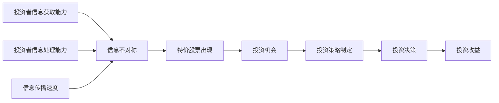

# 特价股票投资中的信息不对称利用策略

> 关键词：特价股票投资、信息不对称、利用策略、市场分析、风险控制

> 摘要：本文围绕特价股票投资中信息不对称的利用策略展开深入探讨。首先介绍了相关背景，包括目的、预期读者、文档结构和术语表。接着阐述了核心概念与联系，分析了信息不对称在股票市场中的原理和架构。详细讲解了核心算法原理和具体操作步骤，并给出了相应的Python代码示例。通过数学模型和公式对投资决策进行量化分析，同时辅以举例说明。在项目实战部分，提供了开发环境搭建、源代码实现和解读。探讨了该策略在实际应用场景中的表现，推荐了学习资源、开发工具框架和相关论文著作。最后总结了未来发展趋势与挑战，解答了常见问题，并提供了扩展阅读和参考资料，旨在为投资者在特价股票投资中更好地利用信息不对称提供全面的指导。

## 1. 背景介绍 
### 1.1 目的和范围
在股票投资领域，特价股票往往具有吸引投资者的潜力。然而，市场中存在的信息不对称现象使得投资者获取和分析信息的能力参差不齐。本文章的目的在于深入研究如何在特价股票投资中有效地利用信息不对称来制定投资策略，提高投资回报率。范围涵盖了信息不对称的概念、产生原因、对特价股票投资的影响，以及具体的利用策略和实践案例等方面。

### 1.2 预期读者
本文主要面向对股票投资感兴趣的个人投资者、金融从业者、投资研究人员等。对于那些希望在特价股票投资中寻找机会，了解如何利用信息优势做出更明智投资决策的人群具有较高的参考价值。

### 1.3 文档结构概述
本文将按照以下结构进行阐述：首先介绍核心概念与联系，帮助读者理解信息不对称和特价股票投资的基本原理；接着讲解核心算法原理和具体操作步骤，通过Python代码实现相关策略；然后利用数学模型和公式对投资决策进行量化分析；在项目实战部分，展示代码的实际应用和详细解读；探讨实际应用场景，为读者提供实际操作的思路；推荐相关的学习资源、开发工具框架和论文著作；最后总结未来发展趋势与挑战，解答常见问题，并提供扩展阅读和参考资料。

### 1.4 术语表
#### 1.4.1 核心术语定义
- **特价股票**：指价格相对其内在价值被低估的股票，通常由于市场情绪、短期业绩波动等原因导致股价低于其实际价值。
- **信息不对称**：在市场交易中，买卖双方掌握的信息存在差异，一方比另一方拥有更多或更准确的信息。
- **投资策略**：投资者为了实现投资目标而采取的一系列投资决策和操作方法。

#### 1.4.2 相关概念解释
- **有效市场假说**：认为在有效市场中，股票价格已经反映了所有可用的信息，投资者无法通过分析信息获得超额收益。然而，信息不对称的存在对这一假说提出了挑战。
- **价值投资**：强调寻找被低估的股票，通过长期持有来获得股票价值回归带来的收益。在信息不对称的情况下，价值投资者可以利用信息优势发现特价股票。

#### 1.4.3 缩略词列表
- **PE**：市盈率（Price-to-Earnings Ratio），用于衡量股票价格与每股盈利之间的关系。
- **PB**：市净率（Price-to-Book Ratio），反映股票价格与每股净资产之间的比例。

## 2. 核心概念与联系 
### 信息不对称原理
在股票市场中，信息不对称主要源于以下几个方面：
- **信息获取渠道差异**：大型机构投资者通常拥有更广泛的信息来源，如专业的研究团队、与上市公司的密切沟通等，而个人投资者往往只能通过公开渠道获取信息。
- **信息处理能力差异**：专业投资者具备更强的数据分析和处理能力，能够从海量信息中提取有价值的内容，而普通投资者可能难以做到。
- **信息传播速度差异**：某些重要信息在传播过程中可能存在时间差，导致部分投资者能够提前获得信息并做出决策。

### 信息不对称与特价股票投资的联系
信息不对称使得特价股票的出现成为可能。当部分投资者掌握了未被市场充分反映的信息时，就有可能发现那些价格被低估的股票。例如，公司内部人士可能提前了解到公司的重大利好消息，但市场尚未得知，此时股票价格可能处于低位，形成特价股票。投资者如果能够利用信息不对称，获取这些有价值的信息，就可以在特价股票投资中获得优势。

### 核心概念架构示意图


## 3. 核心算法原理 & 具体操作步骤 
### 算法原理
在特价股票投资中，我们可以通过构建一个基于信息分析的投资模型来利用信息不对称。具体思路是：首先收集与股票相关的各种信息，包括财务数据、行业动态、新闻报道等；然后对这些信息进行量化处理，提取有价值的特征；最后根据这些特征构建投资决策模型，判断股票是否为特价股票以及是否值得投资。

### Python代码实现
```python
import pandas as pd
import numpy as np
import yfinance as yf

# 收集股票数据
def collect_stock_data(ticker, start_date, end_date):
    data = yf.download(ticker, start=start_date, end=end_date)
    return data

# 计算财务指标
def calculate_financial_metrics(data):
    data['PE'] = data['Close'] / data['Earnings Per Share']
    data['PB'] = data['Close'] / data['Book Value Per Share']
    return data

# 构建投资决策模型
def investment_decision_model(data, pe_threshold, pb_threshold):
    data['is_bargain'] = (data['PE'] < pe_threshold) & (data['PB'] < pb_threshold)
    return data

# 主函数
def main():
    ticker = 'AAPL'
    start_date = '2020-01-01'
    end_date = '2023-01-01'
    pe_threshold = 15
    pb_threshold = 2

    # 收集数据
    stock_data = collect_stock_data(ticker, start_date, end_date)
    # 假设我们已经有了每股收益和每股净资产数据
    stock_data['Earnings Per Share'] = np.random.rand(len(stock_data))
    stock_data['Book Value Per Share'] = np.random.rand(len(stock_data))

    # 计算财务指标
    stock_data = calculate_financial_metrics(stock_data)

    # 做出投资决策
    stock_data = investment_decision_model(stock_data, pe_threshold, pb_threshold)

    print(stock_data[['Close', 'PE', 'PB', 'is_bargain']])

if __name__ == "__main__":
    main()
```

### 具体操作步骤
1. **数据收集**：使用`yfinance`库从雅虎财经获取股票的历史价格数据。同时，需要收集股票的财务数据，如每股收益、每股净资产等。在实际应用中，可以通过专业的金融数据提供商获取更准确的财务数据。
2. **财务指标计算**：根据收集到的数据计算市盈率（PE）和市净率（PB）等财务指标。这些指标可以帮助我们评估股票的估值水平。
3. **投资决策模型构建**：设定市盈率和市净率的阈值，当股票的市盈率和市净率同时低于阈值时，判断该股票为特价股票。
4. **决策执行**：根据投资决策模型的结果，决定是否买入或卖出股票。

## 4. 数学模型和公式 & 详细讲解 & 举例说明 
### 市盈率（PE）模型
市盈率是衡量股票价格与每股盈利之间关系的指标，计算公式为：
$$PE = \frac{P}{EPS}$$
其中，$P$ 表示股票价格，$EPS$ 表示每股收益。

市盈率反映了投资者为获得每股盈利所愿意支付的价格。一般来说，较低的市盈率意味着股票可能被低估，具有投资价值。

### 市净率（PB）模型
市净率是反映股票价格与每股净资产之间比例的指标，计算公式为：
$$PB = \frac{P}{BVPS}$$
其中，$P$ 表示股票价格，$BVPS$ 表示每股净资产。

市净率越低，说明股票价格相对于每股净资产越便宜，可能存在投资机会。

### 举例说明
假设某股票的当前价格为 $P = 50$ 元，每股收益为 $EPS = 5$ 元，每股净资产为 $BVPS = 20$ 元。则该股票的市盈率为：
$$PE = \frac{50}{5} = 10$$
市净率为：
$$PB = \frac{50}{20} = 2.5$$
如果我们设定的市盈率阈值为 15，市净率阈值为 3，那么该股票的市盈率和市净率都低于阈值，我们可以判断该股票为特价股票，具有投资价值。

## 5. 项目实战：代码实际案例和详细解释说明 
### 5.1  开发环境搭建
#### 安装Python
首先需要安装Python环境，建议使用Python 3.7及以上版本。可以从Python官方网站（https://www.python.org/downloads/）下载安装包进行安装。

#### 安装必要的库
在命令行中使用以下命令安装所需的库：
```sh
pip install pandas numpy yfinance
```
- `pandas`：用于数据处理和分析。
- `numpy`：提供了高效的数值计算功能。
- `yfinance`：用于从雅虎财经获取股票数据。

### 5.2  源代码详细实现和代码解读
```python
import pandas as pd
import numpy as np
import yfinance as yf

# 收集股票数据
def collect_stock_data(ticker, start_date, end_date):
    data = yf.download(ticker, start=start_date, end=end_date)
    return data

# 计算财务指标
def calculate_financial_metrics(data):
    data['PE'] = data['Close'] / data['Earnings Per Share']
    data['PB'] = data['Close'] / data['Book Value Per Share']
    return data

# 构建投资决策模型
def investment_decision_model(data, pe_threshold, pb_threshold):
    data['is_bargain'] = (data['PE'] < pe_threshold) & (data['PB'] < pb_threshold)
    return data

# 主函数
def main():
    ticker = 'AAPL'
    start_date = '2020-01-01'
    end_date = '2023-01-01'
    pe_threshold = 15
    pb_threshold = 2

    # 收集数据
    stock_data = collect_stock_data(ticker, start_date, end_date)
    # 假设我们已经有了每股收益和每股净资产数据
    stock_data['Earnings Per Share'] = np.random.rand(len(stock_data))
    stock_data['Book Value Per Share'] = np.random.rand(len(stock_data))

    # 计算财务指标
    stock_data = calculate_financial_metrics(stock_data)

    # 做出投资决策
    stock_data = investment_decision_model(stock_data, pe_threshold, pb_threshold)

    print(stock_data[['Close', 'PE', 'PB', 'is_bargain']])

if __name__ == "__main__":
    main()
```
#### 代码解读
1. **导入库**：导入`pandas`、`numpy`和`yfinance`库，用于数据处理、数值计算和获取股票数据。
2. **收集股票数据**：`collect_stock_data`函数使用`yfinance.download`方法从雅虎财经获取指定股票在指定日期范围内的历史价格数据。
3. **计算财务指标**：`calculate_financial_metrics`函数根据股票价格、每股收益和每股净资产计算市盈率和市净率。
4. **构建投资决策模型**：`investment_decision_model`函数根据设定的市盈率和市净率阈值，判断股票是否为特价股票，并将结果存储在`is_bargain`列中。
5. **主函数**：在`main`函数中，设置股票代码、日期范围、市盈率和市净率阈值，调用上述函数完成数据收集、财务指标计算和投资决策，并打印结果。

### 5.3  代码解读与分析
#### 优点
- **简单易懂**：代码结构清晰，逻辑简单，易于理解和修改。
- **可扩展性**：可以根据需要添加更多的财务指标和投资决策条件，进一步完善投资模型。

#### 缺点
- **数据准确性**：代码中使用了随机生成的每股收益和每股净资产数据，实际应用中需要使用准确的财务数据。
- **单一指标局限性**：仅使用市盈率和市净率作为投资决策的依据，可能存在局限性，需要结合其他指标和信息进行综合分析。

## 6. 实际应用场景 
### 个人投资者
个人投资者可以利用信息不对称在特价股票投资中寻找机会。例如，通过关注公司的新闻报道、行业动态等，获取未被市场充分反映的信息，发现特价股票。同时，可以使用本文介绍的投资决策模型，对股票进行筛选和评估，提高投资决策的准确性。

### 机构投资者
机构投资者拥有更丰富的信息资源和更强的分析能力，可以更好地利用信息不对称。他们可以通过深入的行业研究、与上市公司的沟通等方式，获取独家信息，挖掘特价股票。此外，机构投资者还可以利用量化投资策略，对大量股票进行筛选和分析，提高投资效率。

### 价值投资基金
价值投资基金通常注重寻找被低估的股票，通过长期持有来获得收益。信息不对称对于价值投资基金来说是一个重要的投资机会。基金经理可以利用自己的专业知识和信息优势，发现那些市场尚未发现的特价股票，为基金投资者创造超额收益。

## 7. 工具和资源推荐
### 7.1 学习资源推荐
#### 7.1.1 书籍推荐
- 《聪明的投资者》（The Intelligent Investor）：本杰明·格雷厄姆（Benjamin Graham）著，被誉为投资界的圣经，介绍了价值投资的基本理念和方法。
- 《证券分析》（Security Analysis）：本杰明·格雷厄姆和戴维·多德（David Dodd）著，是价值投资领域的经典著作，详细阐述了股票和债券的分析方法。
- 《财务报表分析与证券定价》（Financial Statement Analysis and Security Valuation）：斯蒂芬·佩因曼（Stephen Penman）著，帮助读者理解财务报表的含义，掌握证券定价的方法。

#### 7.1.2 在线课程
- Coursera上的“投资学原理”（Principles of Investing）：由哥伦比亚大学教授授课，介绍了投资的基本概念、理论和方法。
- edX上的“财务分析与决策”（Financial Analysis and Decision Making）：帮助学习者掌握财务分析的基本技能，做出合理的投资决策。

#### 7.1.3 技术博客和网站
- 雪球（https://xueqiu.com/）：国内知名的投资社区，提供股票行情、资讯、分析和讨论等服务。
- Seeking Alpha（https://seekingalpha.com/）：国外知名的投资研究网站，提供专业的股票分析和投资建议。

### 7.2 开发工具框架推荐
#### 7.2.1 IDE和编辑器
- PyCharm：功能强大的Python集成开发环境，提供代码编辑、调试、版本控制等功能。
- Jupyter Notebook：交互式的开发环境，适合进行数据分析和可视化。

#### 7.2.2 调试和性能分析工具
- pdb：Python自带的调试工具，可以帮助开发者定位代码中的问题。
- cProfile：Python的性能分析工具，用于分析代码的执行时间和资源消耗。

#### 7.2.3 相关框架和库
- Pandas：强大的数据处理和分析库，提供了丰富的数据结构和函数。
- Numpy：高效的数值计算库，用于处理大规模数组和矩阵。
- Scikit-learn：机器学习库，提供了各种机器学习算法和工具。

### 7.3 相关论文著作推荐
#### 7.3.1 经典论文
- Fama, E. F., & French, K. R. (1992). The cross-section of expected stock returns. Journal of Finance, 47(2), 427-465.
- Graham, B., & Dodd, D. L. (1934). Security analysis. McGraw-Hill.

#### 7.3.2 最新研究成果
- Chen, X., Hong, H., & Stein, J. C. (2001). Forecasting crashes: Trading volume, past returns, and conditional skewness in stock prices. Journal of Financial Economics, 61(3), 345-381.
- Barberis, N., & Thaler, R. H. (2003). A survey of behavioral finance. Handbook of the economics of finance, 1, 1053-1128.

#### 7.3.3 应用案例分析
- Greenblatt, J. (2005). The little book that beats the market. Wiley.
- Buffett, W. E. (1984). The superinvestors of Graham-and-Doddsville. Hermes, Columbia Business School.

## 8. 总结：未来发展趋势与挑战
### 未来发展趋势
- **数据驱动的投资决策**：随着大数据和人工智能技术的发展，投资者将越来越依赖数据和算法来做出投资决策。通过对海量信息的分析和挖掘，投资者可以更准确地发现特价股票，提高投资回报率。
- **跨学科融合**：特价股票投资将不再局限于金融领域，而是与计算机科学、统计学、心理学等学科进行深度融合。跨学科的研究和应用将为投资者提供更全面、更深入的分析方法和工具。
- **社会责任投资**：投资者将越来越关注企业的社会责任和可持续发展，将环境、社会和治理（ESG）因素纳入投资决策中。在寻找特价股票时，投资者将更加注重企业的长期价值和社会影响。

### 挑战
- **信息过载**：随着信息传播速度的加快和信息量的爆炸式增长，投资者面临着信息过载的问题。如何从海量信息中筛选出有价值的信息，成为投资者面临的一大挑战。
- **技术壁垒**：数据驱动的投资决策需要投资者具备一定的计算机科学和统计学知识。对于普通投资者来说，掌握这些技术可能存在一定的难度。
- **市场不确定性**：股票市场充满了不确定性，即使投资者利用信息不对称发现了特价股票，也不能保证投资一定成功。市场的波动、宏观经济环境的变化等因素都可能影响股票的价格走势。

## 9. 附录：常见问题与解答
### 如何获取准确的财务数据？
可以通过专业的金融数据提供商，如万得资讯（Wind）、东方财富Choice等获取准确的财务数据。此外，上市公司的官方网站也会公布定期报告，其中包含了详细的财务信息。

### 市盈率和市净率的阈值应该如何设定？
市盈率和市净率的阈值设定没有固定的标准，需要根据不同的行业和市场环境进行调整。一般来说，可以参考同行业其他公司的平均市盈率和市净率，以及历史数据来确定合理的阈值。

### 如何降低投资风险？
可以通过分散投资、控制仓位、设置止损点等方式降低投资风险。同时，要不断学习和积累投资经验，提高自己的分析和判断能力。

## 10. 扩展阅读 & 参考资料
### 扩展阅读
- 《金融炼金术》（The Alchemy of Finance）：乔治·索罗斯（George Soros）著，介绍了反身性理论在金融市场中的应用。
- 《黑天鹅》（The Black Swan）：纳西姆·尼古拉斯·塔勒布（Nassim Nicholas Taleb）著，探讨了极端事件对金融市场的影响。

### 参考资料
- 雅虎财经（https://finance.yahoo.com/）：提供全球股票市场的行情、资讯和数据。
- 中国证券监督管理委员会（https://www.csrc.gov.cn/）：中国证券市场的监管机构，提供上市公司的信息披露和监管政策。

作者：AI天才研究院/AI Genius Institute & 禅与计算机程序设计艺术 /Zen And The Art of Computer Programming