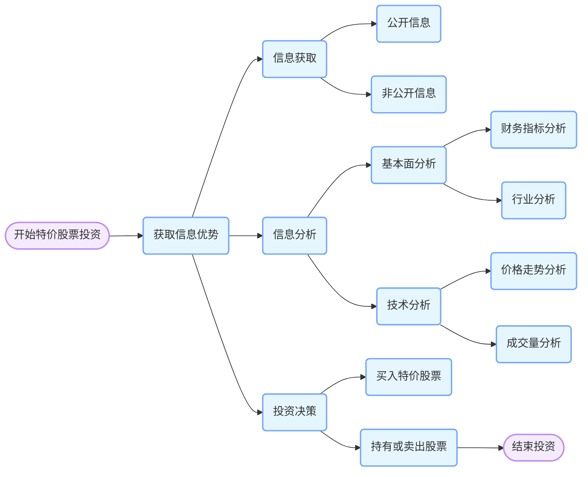

# 特价股票投资中的信息优势如何获取

> 关键词：特价股票投资、信息优势、信息获取途径、数据分析、市场洞察

> 摘要：本文围绕特价股票投资中信息优势的获取展开深入探讨。首先介绍了研究的目的和范围，明确预期读者，概述文档结构并解释相关术语。接着阐述核心概念与联系，包括特价股票、信息优势等概念及其关系，并以示意图和流程图展示。详细讲解获取信息优势的核心算法原理和具体操作步骤，用 Python 代码进行说明。通过数学模型和公式进一步分析信息的价值和影响。结合项目实战，介绍开发环境搭建、源代码实现及代码解读。探讨实际应用场景，推荐学习资源、开发工具框架和相关论文著作。最后总结未来发展趋势与挑战，提供常见问题解答和扩展阅读参考资料，旨在帮助投资者在特价股票投资中有效获取信息优势，做出更明智的投资决策。

## 1. 背景介绍 
### 1.1 目的和范围
在股票投资领域，特价股票往往蕴含着巨大的投资机会。然而，要在特价股票投资中获得成功，关键在于获取信息优势。本文章的目的就是深入探讨如何在特价股票投资中获取信息优势，为投资者提供全面、系统的指导。

本文的范围涵盖了信息优势的各个方面，包括信息的来源、筛选、分析和利用。同时，结合实际案例和代码实现，详细阐述如何运用这些信息进行特价股票的投资决策。

### 1.2 预期读者
本文预期读者主要包括股票投资者，无论是新手投资者还是有一定经验的专业投资者，都可以从本文中获取有价值的信息和投资策略。此外，金融分析师、研究人员以及对股票投资感兴趣的人士也能从本文中得到启发。

### 1.3 文档结构概述
本文将按照以下结构进行阐述：首先介绍相关的核心概念与联系，让读者对特价股票投资和信息优势有清晰的认识；接着讲解获取信息优势的核心算法原理和具体操作步骤，并结合 Python 代码进行说明；然后通过数学模型和公式进一步分析信息的价值和影响；再通过项目实战，详细介绍如何运用所学知识进行实际的投资操作；之后探讨实际应用场景，展示信息优势在不同场景下的应用；推荐相关的学习资源、开发工具框架和论文著作，帮助读者进一步深入学习；最后总结未来发展趋势与挑战，解答常见问题，并提供扩展阅读参考资料。

### 1.4 术语表
#### 1.4.1 核心术语定义
- **特价股票**：指市场价格低于其内在价值的股票。这些股票可能由于各种原因被市场低估，如公司短期业绩不佳、行业负面消息等。
- **信息优势**：投资者在获取、分析和利用与股票相关的信息方面比其他投资者更具优势，从而能够做出更准确的投资决策。
- **内在价值**：股票所代表的公司的真实价值，通常通过对公司的财务状况、行业前景、竞争优势等因素进行综合评估得出。

#### 1.4.2 相关概念解释
- **基本面分析**：通过研究公司的财务报表、经营状况、行业竞争等基本面因素，评估公司的内在价值，从而判断股票是否被低估。
- **技术分析**：通过研究股票的价格走势、成交量等技术指标，预测股票未来的价格走势。
- **市场情绪**：投资者对市场的整体看法和预期，会影响股票的价格波动。

#### 1.4.3 缩略词列表
- **PE**：市盈率（Price-to-Earnings Ratio），指股票价格除以每股收益的比率，用于衡量股票的估值水平。
- **PB**：市净率（Price-to-Book Ratio），指股票价格除以每股净资产的比率，用于衡量股票的投资价值。
- **EPS**：每股收益（Earnings Per Share），指公司净利润除以发行在外的普通股股数，反映公司的盈利能力。

## 2. 核心概念与联系 

### 核心概念原理
在特价股票投资中，有几个核心概念起着关键作用，分别是特价股票、信息优势、基本面分析和技术分析。

特价股票是指市场价格低于其内在价值的股票。其原理在于市场并非总是有效的，由于各种因素的影响，如投资者情绪、短期市场波动、公司突发负面事件等，股票价格可能会偏离其内在价值。当股票价格低于内在价值时，就形成了特价股票。

信息优势是投资者在获取、分析和利用与股票相关的信息方面比其他投资者更具优势。投资者通过收集更多、更准确的信息，并运用有效的分析方法，可以更准确地评估股票的内在价值，从而发现特价股票。

基本面分析是通过研究公司的财务报表、经营状况、行业竞争等基本面因素，评估公司的内在价值。其原理是公司的内在价值决定了股票的长期价格走势，通过对基本面的深入分析，可以了解公司的盈利能力、偿债能力、成长潜力等，从而判断股票是否被低估。

技术分析是通过研究股票的价格走势、成交量等技术指标，预测股票未来的价格走势。其原理是市场行为包含一切信息，股票的价格和成交量反映了市场参与者的心理和行为，通过对历史价格和成交量的分析，可以发现市场的趋势和规律，从而预测未来的价格走势。

### 架构的文本示意图
```plaintext
特价股票投资
|
|-- 信息优势
|   |-- 信息获取
|   |   |-- 公开信息（财报、新闻等）
|   |   |-- 非公开信息（行业调研、专家意见等）
|   |-- 信息分析
|       |-- 基本面分析
|       |   |-- 财务指标分析
|       |   |-- 行业分析
|       |-- 技术分析
|           |-- 价格走势分析
|           |-- 成交量分析
|
|-- 投资决策
|   |-- 买入特价股票
|   |-- 持有或卖出股票
```

### Mermaid 流程图


## 3. 核心算法原理 & 具体操作步骤 

### 核心算法原理
在获取特价股票投资的信息优势过程中，我们可以运用一些核心算法来辅助分析。其中一个重要的算法是基于财务指标的筛选算法。该算法的原理是通过设定一系列的财务指标阈值，筛选出符合条件的股票，这些股票可能是被低估的特价股票。

以下是一个简单的基于市盈率（PE）和市净率（PB）的筛选算法原理：
- 市盈率（PE）是衡量股票估值水平的重要指标，一般来说，较低的 PE 意味着股票可能被低估。
- 市净率（PB）反映了股票价格与每股净资产的关系，较低的 PB 也表示股票可能具有较高的投资价值。

通过设定合理的 PE 和 PB 阈值，筛选出同时满足这两个条件的股票，这些股票可能是特价股票的候选者。

### 具体操作步骤
#### 步骤 1：数据收集
首先，我们需要收集股票的相关财务数据，包括 PE、PB 等指标。可以通过金融数据接口，如 Tushare 等，获取股票的历史财务数据。

#### 步骤 2：设定阈值
根据市场情况和投资策略，设定合理的 PE 和 PB 阈值。例如，我们可以设定 PE 小于 10，PB 小于 1.5。

#### 步骤 3：筛选股票
遍历收集到的股票数据，筛选出同时满足 PE 小于 10 和 PB 小于 1.5 的股票。

#### 步骤 4：进一步分析
对筛选出的股票进行进一步的基本面分析和技术分析，评估其投资价值。

### Python 源代码实现
```python
import tushare as ts

# 设置 Tushare 令牌
ts.set_token('your_token')
pro = ts.pro_api()

def filter_stocks():
    # 获取所有股票的基本信息
    stock_basic = pro.stock_basic(exchange='', list_status='L', fields='ts_code,symbol,name,area,industry,list_date')
    ts_codes = stock_basic['ts_code'].tolist()

    # 存储符合条件的股票
    selected_stocks = []

    for ts_code in ts_codes:
        try:
            # 获取股票的财务指标数据
            df = pro.daily_basic(ts_code=ts_code, fields='ts_code,trade_date,pe_ttm,pb')
            if not df.empty:
                pe_ttm = df['pe_ttm'].iloc[0]
                pb = df['pb'].iloc[0]
                # 设定阈值
                if pe_ttm < 10 and pb < 1.5:
                    selected_stocks.append(ts_code)
        except Exception as e:
            print(f"Error processing {ts_code}: {e}")

    return selected_stocks

if __name__ == "__main__":
    result = filter_stocks()
    print("符合条件的股票代码：", result)
```

### 代码解释
- 首先，我们导入 tushare 库，并设置 Tushare 令牌，以便获取金融数据。
- `filter_stocks` 函数用于筛选符合条件的股票。
    - 我们先获取所有股票的基本信息，得到股票的代码列表。
    - 然后遍历每个股票代码，通过 `pro.daily_basic` 函数获取该股票的财务指标数据，包括 PE 和 PB。
    - 对于每个股票，如果其 PE 小于 10 且 PB 小于 1.5，则将其添加到 `selected_stocks` 列表中。
- 最后，打印出符合条件的股票代码。

## 4. 数学模型和公式 & 详细讲解 & 举例说明 

### 内在价值评估模型
在评估特价股票的内在价值时，常用的数学模型是股息贴现模型（Dividend Discount Model，DDM）。该模型的基本思想是股票的内在价值等于其未来所有股息的现值之和。

#### 公式
$$V = \sum_{t=1}^{\infty} \frac{D_t}{(1 + r)^t}$$

其中：
- $V$ 表示股票的内在价值。
- $D_t$ 表示第 $t$ 期的股息。
- $r$ 表示贴现率，反映了投资者对该股票的预期收益率。

#### 详细讲解
股息贴现模型的核心在于将未来的股息流按照一定的贴现率折现到当前时刻，从而得到股票的内在价值。贴现率 $r$ 通常根据市场利率、股票的风险程度等因素来确定。

如果股票的市场价格低于通过 DDM 模型计算出的内在价值 $V$，则该股票可能是特价股票。

#### 举例说明
假设某股票预计未来每年的股息为 $D = 2$ 元，投资者要求的预期收益率 $r = 0.1$（即 10%）。

根据 DDM 模型，该股票的内在价值为：

$$V = \frac{2}{0.1} = 20 \text{ 元}$$

如果该股票的市场价格为 15 元，低于其内在价值 20 元，则该股票可能是特价股票。

### 市盈率（PE）与内在价值的关系
#### 公式
$$PE = \frac{P}{EPS}$$

其中：
- $PE$ 表示市盈率。
- $P$ 表示股票的市场价格。
- $EPS$ 表示每股收益。

我们可以通过变形得到股票的内在价值估计公式：

$$P = PE \times EPS$$

#### 详细讲解
市盈率是衡量股票估值水平的常用指标。通过与同行业其他股票的市盈率进行比较，我们可以判断该股票是否被低估。

如果某股票的市盈率低于同行业平均市盈率，且其每股收益稳定或有增长趋势，则该股票可能具有较高的投资价值。

#### 举例说明
假设某行业的平均市盈率为 20，某股票的每股收益 $EPS = 1$ 元。

根据公式，该股票的合理价格应该为：

$$P = 20 \times 1 = 20 \text{ 元}$$

如果该股票的市场价格为 15 元，低于其合理价格 20 元，则该股票可能是特价股票。

## 5. 项目实战：代码实际案例和详细解释说明 

### 5.1  开发环境搭建
#### 操作系统
可以选择 Windows、Linux 或 macOS 操作系统，本项目对操作系统没有特殊要求。

#### Python 环境
安装 Python 3.7 及以上版本。可以从 Python 官方网站（https://www.python.org/downloads/）下载并安装。

#### 依赖库安装
本项目需要安装以下依赖库：
- `tushare`：用于获取金融数据。
- `pandas`：用于数据处理和分析。

可以使用以下命令安装依赖库：
```sh
pip install tushare pandas
```

### 5.2  源代码详细实现和代码解读
```python
import tushare as ts
import pandas as pd

# 设置 Tushare 令牌
ts.set_token('your_token')
pro = ts.pro_api()

def get_stock_data(ts_code, start_date, end_date):
    """
    获取指定股票在指定日期范围内的日线数据
    :param ts_code: 股票代码
    :param start_date: 开始日期，格式：YYYYMMDD
    :param end_date: 结束日期，格式：YYYYMMDD
    :return: 日线数据 DataFrame
    """
    df = pro.daily(ts_code=ts_code, start_date=start_date, end_date=end_date)
    return df

def calculate_moving_average(df, window):
    """
    计算指定窗口的移动平均线
    :param df: 日线数据 DataFrame
    :param window: 窗口大小
    :return: 移动平均线 Series
    """
    df['ma'] = df['close'].rolling(window=window).mean()
    return df['ma']

def analyze_stock(ts_code, start_date, end_date, short_window=5, long_window=20):
    """
    分析指定股票在指定日期范围内的走势
    :param ts_code: 股票代码
    :param start_date: 开始日期，格式：YYYYMMDD
    :param end_date: 结束日期，格式：YYYYMMDD
    :param short_window: 短期移动平均线窗口大小
    :param long_window: 长期移动平均线窗口大小
    :return: 分析结果 DataFrame
    """
    df = get_stock_data(ts_code, start_date, end_date)
    df = df.sort_values(by='trade_date')
    df['short_ma'] = calculate_moving_average(df, short_window)
    df['long_ma'] = calculate_moving_average(df, long_window)
    df['signal'] = 0
    df.loc[df['short_ma'] > df['long_ma'], 'signal'] = 1
    df.loc[df['short_ma'] < df['long_ma'], 'signal'] = -1
    return df

if __name__ == "__main__":
    ts_code = '000001.SZ'
    start_date = '20230101'
    end_date = '20231231'
    result = analyze_stock(ts_code, start_date, end_date)
    print(result)
```

### 代码解读与分析
- **`get_stock_data` 函数**：该函数用于获取指定股票在指定日期范围内的日线数据。通过调用 Tushare 的 `pro.daily` 函数，传入股票代码、开始日期和结束日期，返回日线数据的 DataFrame。
- **`calculate_moving_average` 函数**：该函数用于计算指定窗口的移动平均线。通过 `pandas` 的 `rolling` 方法，对收盘价进行滚动计算平均值，得到移动平均线的 Series。
- **`analyze_stock` 函数**：该函数是核心分析函数，用于分析指定股票在指定日期范围内的走势。
    - 首先调用 `get_stock_data` 函数获取日线数据，并按日期排序。
    - 然后分别计算短期移动平均线（`short_ma`）和长期移动平均线（`long_ma`）。
    - 根据短期移动平均线和长期移动平均线的交叉情况，生成交易信号（`signal`）。当短期移动平均线大于长期移动平均线时，信号为 1，表示买入信号；当短期移动平均线小于长期移动平均线时，信号为 -1，表示卖出信号。
- **主程序**：指定股票代码、开始日期和结束日期，调用 `analyze_stock` 函数进行分析，并打印分析结果。

通过这个项目实战，我们可以利用技术分析方法，通过计算移动平均线和生成交易信号，对特价股票的走势进行分析，为投资决策提供参考。

## 6. 实际应用场景 
### 个人投资者
对于个人投资者来说，获取信息优势可以帮助他们在特价股票投资中做出更明智的决策。个人投资者可以通过收集公司的财务报表、行业新闻、分析师报告等公开信息，运用基本面分析和技术分析方法，筛选出被低估的特价股票。

例如，个人投资者可以关注一些业绩稳定但近期股价下跌的公司，通过分析其财务指标和行业前景，判断其是否为特价股票。如果发现某公司的市盈率低于同行业平均水平，且其业务具有增长潜力，那么该股票可能是一个不错的投资选择。

### 机构投资者
机构投资者通常拥有更丰富的资源和专业的分析团队，他们可以通过获取更广泛的信息来获取信息优势。机构投资者除了关注公开信息外，还可以通过进行行业调研、与公司管理层沟通等方式获取非公开信息。

例如，机构投资者可以对某个行业进行深入调研，了解行业的发展趋势、竞争格局等信息。他们还可以与上市公司的管理层进行面对面交流，了解公司的战略规划、业务发展情况等。通过这些信息，机构投资者可以更准确地评估公司的内在价值，发现特价股票。

### 量化投资团队
量化投资团队通过运用计算机算法和数学模型，对大量的股票数据进行分析和处理，获取信息优势。他们可以利用历史数据进行回测，优化投资策略，提高投资收益。

例如，量化投资团队可以开发一个基于多因子模型的选股策略，通过对股票的基本面因子（如市盈率、市净率、净利润增长率等）和技术因子（如移动平均线、成交量等）进行综合分析，筛选出具有投资价值的特价股票。然后，通过自动化交易系统进行实时交易，实现投资策略的快速执行。

## 7. 工具和资源推荐
### 7.1 学习资源推荐
#### 7.1.1 书籍推荐
- 《聪明的投资者》（The Intelligent Investor）：作者是本杰明·格雷厄姆（Benjamin Graham），这本书被誉为投资界的圣经，详细介绍了价值投资的理念和方法，对于学习特价股票投资具有重要的指导意义。
- 《金融炼金术》（The Alchemy of Finance）：作者是乔治·索罗斯（George Soros），书中阐述了索罗斯的反身性理论，对于理解市场的运行机制和投资者的心理具有重要的启示作用。
- 《股票大作手回忆录》（Reminiscences of a Stock Operator）：作者是爱德温·勒菲弗（Edwin Lefèvre），这本书以华尔街大空头杰西·利弗莫尔（Jesse Livermore）的交易经历为蓝本，生动地展现了股票市场的风云变幻和投资的技巧与智慧。

#### 7.1.2 在线课程
- Coursera 上的“投资学原理”（Principles of Investing）：该课程由哥伦比亚大学的教授授课，系统地介绍了投资学的基本原理和方法，包括股票投资、债券投资、资产配置等内容。
- Udemy 上的“量化投资实战”（Quantitative Investing in Practice）：该课程主要介绍了量化投资的基本概念、模型和算法，通过实际案例和代码实现，帮助学员掌握量化投资的技术和方法。

#### 7.1.3 技术博客和网站
- 雪球网（https://xueqiu.com/）：国内知名的投资社区，提供股票、基金、债券等多种投资品种的资讯、分析和讨论。投资者可以在雪球网上关注投资达人的动态，学习他们的投资经验和策略。
- 东方财富网（https://www.eastmoney.com/）：国内领先的财经网站，提供丰富的金融资讯、行情数据、研究报告等内容。投资者可以通过东方财富网获取股票的实时行情、财务数据和分析师评级等信息。

### 7.2 开发工具框架推荐
#### 7.2.1 IDE和编辑器
- PyCharm：一款功能强大的 Python 集成开发环境（IDE），提供代码编辑、调试、版本控制等多种功能，适合开发 Python 程序。
- Jupyter Notebook：一种交互式的开发环境，支持 Python、R 等多种编程语言。Jupyter Notebook 以笔记本的形式展示代码和结果，方便进行数据分析和可视化。

#### 7.2.2 调试和性能分析工具
- pdb：Python 自带的调试工具，可以帮助开发者在程序运行过程中进行调试，查看变量的值、执行流程等。
- cProfile：Python 的性能分析工具，可以统计程序中各个函数的执行时间和调用次数，帮助开发者找出程序的性能瓶颈。

#### 7.2.3 相关框架和库
- Tushare：一个免费、开源的 Python 财经数据接口包，提供丰富的金融数据，包括股票、基金、债券等的历史行情、财务指标、公告信息等。
- Pandas：一个强大的数据处理和分析库，提供了 DataFrame 和 Series 等数据结构，方便进行数据清洗、转换、分析和可视化。
- Numpy：一个用于科学计算的 Python 库，提供了高效的多维数组对象和各种数学函数，常用于数值计算和数据分析。

### 7.3 相关论文著作推荐
#### 7.3.1 经典论文
- Eugene F. Fama, “Efficient Capital Markets: A Review of Theory and Empirical Work,” The Journal of Finance, 1970. 这篇论文提出了有效市场假说（Efficient Markets Hypothesis），对金融市场的有效性进行了系统的阐述和研究。
- Benjamin Graham and David Dodd, “Security Analysis,” McGraw-Hill, 1934. 这本书是价值投资的经典著作，详细介绍了价值投资的理念和方法，对后世的投资理论和实践产生了深远的影响。

#### 7.3.2 最新研究成果
- 关注 SSRN（Social Science Research Network）网站上关于股票投资、信息经济学等领域的最新研究论文。这些论文通常反映了该领域的最新研究动态和前沿成果。
- 定期阅读《Journal of Financial Economics》、《Review of Financial Studies》等金融领域的顶级学术期刊，了解最新的研究进展。

#### 7.3.3 应用案例分析
- 《Value Investing: From Graham to Buffett and Beyond》：这本书通过分析沃伦·巴菲特（Warren Buffett）等价值投资大师的投资案例，深入探讨了价值投资的实践和应用。
- 《The Little Book That Beats the Market》：作者乔尔·格林布拉特（Joel Greenblatt）介绍了一种简单而有效的投资策略，并通过实际案例展示了该策略的应用效果。

## 8. 总结：未来发展趋势与挑战
### 未来发展趋势
#### 数据驱动的投资决策
随着信息技术的不断发展，金融数据的规模和种类不断增加。未来，投资者将越来越依赖数据驱动的投资决策方法，通过对大量的金融数据进行分析和挖掘，获取信息优势，做出更准确的投资决策。

#### 人工智能和机器学习的应用
人工智能和机器学习技术在金融领域的应用将越来越广泛。例如，利用深度学习算法对股票价格进行预测，利用自然语言处理技术对新闻和公告进行情感分析等。这些技术将帮助投资者更快速、更准确地获取和分析信息，提高投资效率和收益。

#### 跨领域融合
特价股票投资将与其他领域进行更深入的融合，如宏观经济分析、行业研究、技术创新等。投资者需要具备更广泛的知识和技能，才能在复杂的市场环境中获取信息优势，做出明智的投资决策。

### 挑战
#### 信息过载
随着信息的爆炸式增长，投资者面临着信息过载的问题。如何从海量的信息中筛选出有价值的信息，成为投资者面临的一大挑战。

#### 数据质量和可靠性
金融数据的质量和可靠性直接影响投资决策的准确性。然而，由于数据来源的多样性和数据采集过程中的误差，数据质量和可靠性难以保证。投资者需要具备数据清洗和验证的能力，以确保使用的数据准确可靠。

#### 市场不确定性
股票市场具有高度的不确定性，受到宏观经济、政策法规、公司业绩等多种因素的影响。即使投资者获取了信息优势，也难以完全预测市场的走势。因此，投资者需要具备风险管理的能力，合理控制投资风险。

## 9. 附录：常见问题与解答
### 问题 1：如何判断一个信息是否具有价值？
解答：判断一个信息是否具有价值可以从以下几个方面考虑：
- **相关性**：信息是否与特价股票投资相关，是否能够影响股票的内在价值或价格走势。
- **准确性**：信息的来源是否可靠，信息内容是否准确无误。
- **时效性**：信息是否及时，是否能够反映当前的市场情况和公司动态。
- **独特性**：信息是否具有独特性，是否能够提供与其他投资者不同的视角和观点。

### 问题 2：获取非公开信息是否合法？
解答：获取非公开信息需要遵守相关的法律法规。在合法合规的前提下，投资者可以通过行业调研、参加公司股东大会等方式获取一些非公开信息。但需要注意的是，利用内幕信息进行交易是违法的行为，会受到法律的制裁。

### 问题 3：如何提高信息分析的能力？
解答：提高信息分析的能力可以从以下几个方面入手：
- **学习专业知识**：学习金融、财务、统计等相关专业知识，掌握信息分析的基本方法和技巧。
- **实践经验积累**：通过实际的投资操作和案例分析，积累信息分析的经验，提高分析问题和解决问题的能力。
- **使用工具和技术**：利用数据分析工具和技术，如 Python、R 等编程语言，以及 Excel、Tableau 等数据分析软件，提高信息分析的效率和准确性。

## 10. 扩展阅读 & 参考资料
### 扩展阅读
- 《投资中最简单的事》，作者邱国鹭，本书介绍了价值投资的简单方法和理念，适合初学者阅读。
- 《财务报表分析与股票估值》，作者郭永清，详细介绍了如何通过分析财务报表来评估股票的投资价值。

### 参考资料
- Tushare 官方文档：https://tushare.pro/document/1
- Pandas 官方文档：https://pandas.pydata.org/docs/
- Numpy 官方文档：https://numpy.org/doc/

作者：AI天才研究院/AI Genius Institute & 禅与计算机程序设计艺术 /Zen And The Art of Computer Programming