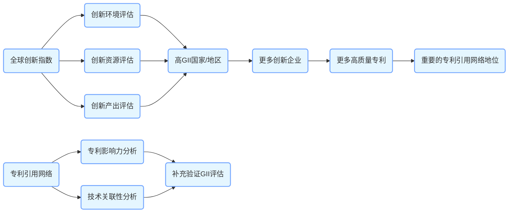

# 特价股票投资中的全球创新指数与专利引用网络分析方法

> 关键词：特价股票投资、全球创新指数、专利引用网络、投资分析、创新评估

> 摘要：本文聚焦于特价股票投资领域，深入探讨全球创新指数与专利引用网络分析方法。首先介绍了相关研究的背景，包括目的、预期读者、文档结构和术语定义。接着阐述了全球创新指数和专利引用网络的核心概念及其联系，并给出相应的示意图和流程图。详细讲解了核心算法原理，用Python代码进行了具体实现。对涉及的数学模型和公式进行了推导和举例说明。通过项目实战，展示了如何运用这些方法进行投资分析，并给出了代码实现和解读。探讨了实际应用场景，推荐了学习、开发相关的工具和资源。最后总结了未来发展趋势与挑战，提供了常见问题解答和扩展阅读参考资料，旨在为投资者提供全面、科学的特价股票投资分析思路和方法。

## 1. 背景介绍 
### 1.1 目的和范围
在股票投资市场中，特价股票往往具有较低的价格，但可能蕴含着巨大的投资潜力。然而，如何准确筛选出具有长期增长价值的特价股票是投资者面临的一大挑战。全球创新指数（Global Innovation Index, GII）衡量了一个国家或地区的创新能力和创新生态系统的优劣，而专利引用网络则反映了企业在技术创新方面的影响力和技术关联性。本研究的目的在于探索如何将全球创新指数和专利引用网络分析方法应用于特价股票投资中，为投资者提供更科学、有效的投资决策依据。

本研究的范围主要涵盖了特价股票的筛选、全球创新指数的解读和应用、专利引用网络的构建与分析，以及如何结合这两种方法进行综合投资分析。

### 1.2 预期读者
本文的预期读者包括股票投资者、投资分析师、金融研究人员以及对创新与投资关系感兴趣的技术爱好者。投资者可以通过本文了解如何利用全球创新指数和专利引用网络来挖掘特价股票的投资价值；投资分析师可以将这些方法应用于实际的投资研究和报告中；金融研究人员可以进一步深入研究相关理论和模型；技术爱好者可以了解创新指标在金融领域的应用。

### 1.3 文档结构概述
本文将按照以下结构进行组织：
1. 背景介绍：阐述研究的目的、范围、预期读者和文档结构，以及相关术语的定义。
2. 核心概念与联系：介绍全球创新指数和专利引用网络的核心概念，分析它们之间的联系，并给出相应的示意图和流程图。
3. 核心算法原理 & 具体操作步骤：详细讲解全球创新指数和专利引用网络分析的核心算法原理，并用Python代码实现具体的操作步骤。
4. 数学模型和公式 & 详细讲解 & 举例说明：推导相关的数学模型和公式，并通过具体例子进行说明。
5. 项目实战：代码实际案例和详细解释说明：通过一个实际的项目案例，展示如何运用全球创新指数和专利引用网络分析方法进行特价股票投资分析，包括开发环境搭建、源代码实现和代码解读。
6. 实际应用场景：探讨全球创新指数和专利引用网络分析方法在特价股票投资中的实际应用场景。
7. 工具和资源推荐：推荐学习、开发相关的工具和资源，包括书籍、在线课程、技术博客、IDE和编辑器、调试和性能分析工具、相关框架和库以及论文著作等。
8. 总结：未来发展趋势与挑战：总结本文的主要内容，分析未来的发展趋势和面临的挑战。
9. 附录：常见问题与解答：解答读者可能遇到的常见问题。
10. 扩展阅读 & 参考资料：提供扩展阅读的建议和参考资料。

### 1.4 术语表
#### 1.4.1 核心术语定义
- **特价股票**：指价格相对较低，可能被市场低估的股票。
- **全球创新指数（GII）**：是衡量一个国家或地区创新能力和创新生态系统的综合指标，由世界知识产权组织（WIPO）等机构发布。
- **专利引用网络**：是由专利之间的引用关系构成的网络，其中节点表示专利，边表示专利之间的引用关系。
- **投资分析**：对投资对象的价值、风险等进行评估和分析的过程。
- **创新评估**：对企业或地区的创新能力、创新成果等进行评价的过程。

#### 1.4.2 相关概念解释
- **创新生态系统**：指由政府、企业、科研机构、高校等创新主体以及创新资源、创新环境等要素相互作用形成的生态系统。
- **专利影响力**：指专利对后续技术发展的影响程度，通常通过专利引用次数等指标来衡量。
- **技术关联性**：指不同技术之间的相互联系和影响程度，在专利引用网络中可以通过节点之间的连接关系来体现。

#### 1.4.3 缩略词列表
- **GII**：Global Innovation Index（全球创新指数）
- **WIPO**：World Intellectual Property Organization（世界知识产权组织）
- **IDE**：Integrated Development Environment（集成开发环境）

## 2. 核心概念与联系 

### 2.1 全球创新指数（GII）
全球创新指数是一个综合性的指标体系，旨在衡量一个国家或地区的创新能力和创新生态系统的优劣。它由多个子指标组成，包括制度、人力资本与研究、基础设施、市场成熟度、商业成熟度、知识与技术产出以及创意产出等方面。每个子指标又包含多个具体的指标，通过加权平均的方法计算得出最终的全球创新指数得分。

全球创新指数的高低反映了一个国家或地区在创新方面的综合实力。较高的指数得分意味着该国家或地区具有良好的创新环境、丰富的创新资源和较高的创新产出能力。在特价股票投资中，我们可以关注那些位于创新指数较高国家或地区的企业，因为这些企业往往具有更好的创新发展潜力，可能会在未来带来更高的投资回报。

### 2.2 专利引用网络
专利引用网络是由专利之间的引用关系构成的网络。在专利申请过程中，申请人通常需要引用相关的现有专利，以说明自己的发明创造的新颖性和创造性。这些引用关系形成了一个复杂的网络，其中节点表示专利，边表示专利之间的引用关系。

专利引用网络可以反映企业在技术创新方面的影响力和技术关联性。一个企业的专利被其他专利频繁引用，说明该企业的技术具有较高的影响力和创新性；而通过分析专利引用网络中的连接关系，可以了解不同企业之间的技术关联性，发现潜在的技术合作机会和竞争关系。

### 2.3 核心概念的联系
全球创新指数和专利引用网络之间存在着密切的联系。一方面，全球创新指数较高的国家或地区通常拥有更多的创新型企业，这些企业会申请更多的专利，并且其专利的质量和影响力也相对较高，从而在专利引用网络中占据更重要的地位。另一方面，专利引用网络中的信息可以为全球创新指数的评估提供补充和验证。通过分析专利引用网络，可以更深入地了解企业的技术创新能力和创新成果，从而更准确地评估一个国家或地区的创新水平。

### 2.4 文本示意图
```plaintext
全球创新指数
|
|-- 制度
|-- 人力资本与研究
|-- 基础设施
|-- 市场成熟度
|-- 商业成熟度
|-- 知识与技术产出
|-- 创意产出

专利引用网络
|
|-- 节点（专利）
|-- 边（引用关系）

全球创新指数与专利引用网络的联系
|
|-- 高GII国家/地区 -> 更多创新企业 -> 更多高质量专利 -> 重要的专利引用网络地位
|-- 专利引用网络信息 -> 补充验证GII评估
```

### 2.5 Mermaid流程图


## 3. 核心算法原理 & 具体操作步骤 

### 3.1 全球创新指数数据处理算法
全球创新指数数据通常以表格形式发布，包含多个子指标和具体指标的得分。我们需要对这些数据进行处理，提取有用信息，并计算综合得分。以下是一个简单的Python代码示例，用于读取全球创新指数数据并计算综合得分：

```python
import pandas as pd

# 读取全球创新指数数据
gii_data = pd.read_csv('gii_data.csv')

# 定义各子指标的权重
weights = {
    '制度': 0.1,
    '人力资本与研究': 0.2,
    '基础设施': 0.15,
    '市场成熟度': 0.15,
    '商业成熟度': 0.1,
    '知识与技术产出': 0.15,
    '创意产出': 0.15
}

# 计算综合得分
def calculate_gii_score(row):
    score = 0
    for sub_index, weight in weights.items():
        score += row[sub_index] * weight
    return score

gii_data['综合得分'] = gii_data.apply(calculate_gii_score, axis=1)

# 输出结果
print(gii_data[['国家/地区', '综合得分']])
```

### 3.2 专利引用网络构建算法
构建专利引用网络的关键是获取专利数据和引用关系数据，并将其转化为图结构。以下是一个使用NetworkX库构建专利引用网络的Python代码示例：

```python
import networkx as nx
import pandas as pd

# 读取专利数据和引用关系数据
patent_data = pd.read_csv('patent_data.csv')
citation_data = pd.read_csv('citation_data.csv')

# 创建有向图
G = nx.DiGraph()

# 添加节点
for index, row in patent_data.iterrows():
    patent_id = row['专利ID']
    G.add_node(patent_id)

# 添加边
for index, row in citation_data.iterrows():
    citing_patent = row['引用专利ID']
    cited_patent = row['被引用专利ID']
    G.add_edge(citing_patent, cited_patent)

# 输出网络信息
print('专利引用网络信息：')
print(nx.info(G))
```

### 3.3 专利影响力分析算法
专利影响力可以通过多种指标来衡量，如专利引用次数、PageRank值等。以下是一个计算专利PageRank值的Python代码示例：

```python
import networkx as nx

# 计算PageRank值
pagerank = nx.pagerank(G)

# 输出前10个最具影响力的专利
top_10_patents = sorted(pagerank.items(), key=lambda item: item[1], reverse=True)[:10]
for patent, score in top_10_patents:
    print(f'专利ID: {patent}, PageRank值: {score}')
```

### 3.4 综合分析算法
在特价股票投资中，我们可以结合全球创新指数和专利引用网络分析结果，筛选出具有投资潜力的企业。以下是一个简单的综合分析算法示例：

```python
# 假设已经计算出每个国家/地区的GII得分和每个企业的专利影响力得分
# 读取企业数据，包含企业所在国家/地区和企业专利ID列表
company_data = pd.read_csv('company_data.csv')

# 定义GII得分阈值和专利影响力得分阈值
gii_threshold = 0.7
patent_influence_threshold = 0.1

# 筛选具有投资潜力的企业
potential_companies = []
for index, row in company_data.iterrows():
    country = row['国家/地区']
    patent_ids = row['专利ID列表'].split(',')
    
    # 获取国家/地区的GII得分
    gii_score = gii_data[gii_data['国家/地区'] == country]['综合得分'].values[0]
    
    # 计算企业的专利影响力得分
    patent_influence_score = 0
    for patent_id in patent_ids:
        if patent_id in pagerank:
            patent_influence_score += pagerank[patent_id]
    
    # 判断是否满足条件
    if gii_score >= gii_threshold and patent_influence_score >= patent_influence_threshold:
        potential_companies.append(row['企业名称'])

# 输出具有投资潜力的企业
print('具有投资潜力的企业：')
for company in potential_companies:
    print(company)
```

## 4. 数学模型和公式 & 详细讲解 & 举例说明 

### 4.1 全球创新指数综合得分计算模型
全球创新指数综合得分是通过对各个子指标得分进行加权平均得到的。假设全球创新指数有 $n$ 个子指标，第 $i$ 个子指标的得分记为 $x_i$，对应的权重记为 $w_i$，则综合得分 $S$ 的计算公式为：

$$S = \sum_{i=1}^{n} w_i x_i$$

其中，$\sum_{i=1}^{n} w_i = 1$。

例如，假设全球创新指数有三个子指标：制度、人力资本与研究、基础设施，其得分分别为 $x_1 = 0.8$，$x_2 = 0.7$，$x_3 = 0.6$，对应的权重分别为 $w_1 = 0.2$，$w_2 = 0.3$，$w_3 = 0.5$，则综合得分 $S$ 为：

$$S = 0.2 \times 0.8 + 0.3 \times 0.7 + 0.5 \times 0.6 = 0.67$$

### 4.2 专利引用网络PageRank算法模型
PageRank算法是一种用于衡量网页重要性的算法，也可以应用于专利引用网络中，用于衡量专利的影响力。PageRank算法的基本思想是：一个专利的重要性不仅取决于引用它的专利数量，还取决于引用它的专利的重要性。

设 $G = (V, E)$ 是一个有向图，其中 $V$ 是节点集合（专利集合），$E$ 是边集合（引用关系集合）。对于节点 $i \in V$，其PageRank值 $PR(i)$ 的计算公式为：

$$PR(i) = (1 - d) + d \sum_{j \in M(i)} \frac{PR(j)}{L(j)}$$

其中，$d$ 是阻尼因子，通常取值为 $0.85$；$M(i)$ 是指向节点 $i$ 的节点集合；$L(j)$ 是节点 $j$ 的出度（即节点 $j$ 引用的专利数量）。

PageRank算法是一个迭代算法，通过不断更新每个节点的PageRank值，直到收敛。以下是一个简单的Python代码示例，用于实现PageRank算法：

```python
import numpy as np

# 定义专利引用网络的邻接矩阵
A = np.array([
    [0, 1, 0],
    [1, 0, 1],
    [0, 1, 0]
])

# 初始化PageRank值
N = A.shape[0]
PR = np.ones(N) / N

# 定义阻尼因子
d = 0.85

# 迭代计算PageRank值
for _ in range(100):
    new_PR = (1 - d) / N + d * np.dot(A.T / np.sum(A, axis=1, keepdims=True), PR)
    if np.linalg.norm(new_PR - PR) < 1e-6:
        break
    PR = new_PR

# 输出PageRank值
print('PageRank值：', PR)
```

### 4.3 综合投资潜力评估模型
在综合投资潜力评估中，我们可以使用一个线性组合模型来综合考虑全球创新指数得分和专利影响力得分。假设企业所在国家/地区的全球创新指数得分为 $GII$，企业的专利影响力得分为 $PI$，则企业的综合投资潜力得分 $IP$ 的计算公式为：

$$IP = \alpha GII + \beta PI$$

其中，$\alpha$ 和 $\beta$ 是权重系数，满足 $\alpha + \beta = 1$。

例如，假设 $\alpha = 0.6$，$\beta = 0.4$，企业所在国家/地区的全球创新指数得分为 $0.8$，企业的专利影响力得分为 $0.7$，则企业的综合投资潜力得分 $IP$ 为：

$$IP = 0.6 \times 0.8 + 0.4 \times 0.7 = 0.76$$

## 5. 项目实战：代码实际案例和详细解释说明 

### 5.1  开发环境搭建
为了实现全球创新指数与专利引用网络分析方法在特价股票投资中的应用，我们需要搭建一个合适的开发环境。以下是具体的搭建步骤：

#### 5.1.1 安装Python
Python是一种广泛使用的编程语言，具有丰富的科学计算和数据分析库。我们可以从Python官方网站（https://www.python.org/downloads/）下载并安装Python 3.x版本。

#### 5.1.2 安装必要的库
我们需要安装一些必要的Python库，包括pandas、networkx、numpy等。可以使用pip命令进行安装：

```sh
pip install pandas networkx numpy
```

#### 5.1.3 准备数据
我们需要准备全球创新指数数据、专利数据和引用关系数据。这些数据可以从相关的官方网站或数据库中获取，保存为CSV文件。

### 5.2  源代码详细实现和代码解读
以下是一个完整的项目实战代码示例，包括全球创新指数数据处理、专利引用网络构建、专利影响力分析和综合投资潜力评估：

```python
import pandas as pd
import networkx as nx
import numpy as np

# 读取全球创新指数数据
gii_data = pd.read_csv('gii_data.csv')

# 定义各子指标的权重
weights = {
    '制度': 0.1,
    '人力资本与研究': 0.2,
    '基础设施': 0.15,
    '市场成熟度': 0.15,
    '商业成熟度': 0.1,
    '知识与技术产出': 0.15,
    '创意产出': 0.15
}

# 计算综合得分
def calculate_gii_score(row):
    score = 0
    for sub_index, weight in weights.items():
        score += row[sub_index] * weight
    return score

gii_data['综合得分'] = gii_data.apply(calculate_gii_score, axis=1)

# 读取专利数据和引用关系数据
patent_data = pd.read_csv('patent_data.csv')
citation_data = pd.read_csv('citation_data.csv')

# 创建有向图
G = nx.DiGraph()

# 添加节点
for index, row in patent_data.iterrows():
    patent_id = row['专利ID']
    G.add_node(patent_id)

# 添加边
for index, row in citation_data.iterrows():
    citing_patent = row['引用专利ID']
    cited_patent = row['被引用专利ID']
    G.add_edge(citing_patent, cited_patent)

# 计算PageRank值
pagerank = nx.pagerank(G)

# 读取企业数据，包含企业所在国家/地区和企业专利ID列表
company_data = pd.read_csv('company_data.csv')

# 定义GII得分阈值和专利影响力得分阈值
gii_threshold = 0.7
patent_influence_threshold = 0.1

# 定义权重系数
alpha = 0.6
beta = 0.4

# 筛选具有投资潜力的企业
potential_companies = []
for index, row in company_data.iterrows():
    country = row['国家/地区']
    patent_ids = row['专利ID列表'].split(',')
    
    # 获取国家/地区的GII得分
    gii_score = gii_data[gii_data['国家/地区'] == country]['综合得分'].values[0]
    
    # 计算企业的专利影响力得分
    patent_influence_score = 0
    for patent_id in patent_ids:
        if patent_id in pagerank:
            patent_influence_score += pagerank[patent_id]
    
    # 计算综合投资潜力得分
    investment_potential_score = alpha * gii_score + beta * patent_influence_score
    
    # 判断是否满足条件
    if gii_score >= gii_threshold and patent_influence_score >= patent_influence_threshold:
        potential_companies.append((row['企业名称'], investment_potential_score))

# 按综合投资潜力得分排序
potential_companies.sort(key=lambda x: x[1], reverse=True)

# 输出具有投资潜力的企业
print('具有投资潜力的企业：')
for company, score in potential_companies:
    print(f'企业名称: {company}, 综合投资潜力得分: {score}')
```

### 5.3  代码解读与分析
#### 5.3.1 全球创新指数数据处理
- 读取全球创新指数数据文件 `gii_data.csv`。
- 定义各子指标的权重。
- 编写 `calculate_gii_score` 函数，用于计算每个国家/地区的综合得分。
- 使用 `apply` 方法将 `calculate_gii_score` 函数应用到每一行数据上，计算综合得分并添加到数据框中。

#### 5.3.2 专利引用网络构建
- 读取专利数据文件 `patent_data.csv` 和引用关系数据文件 `citation_data.csv`。
- 创建一个有向图 `G`。
- 遍历专利数据，将每个专利作为节点添加到图中。
- 遍历引用关系数据，将每条引用关系作为边添加到图中。

#### 5.3.3 专利影响力分析
- 使用 `nx.pagerank` 函数计算专利引用网络中每个专利的PageRank值，作为专利的影响力得分。

#### 5.3.4 综合投资潜力评估
- 读取企业数据文件 `company_data.csv`。
- 定义GII得分阈值和专利影响力得分阈值，以及权重系数 $\alpha$ 和 $\beta$。
- 遍历企业数据，获取企业所在国家/地区的GII得分和企业的专利影响力得分。
- 计算企业的综合投资潜力得分。
- 判断企业是否满足条件，如果满足则将其添加到具有投资潜力的企业列表中。
- 对具有投资潜力的企业列表按综合投资潜力得分进行排序，并输出结果。

## 6. 实际应用场景 
### 6.1 股票筛选
投资者可以使用全球创新指数和专利引用网络分析方法来筛选具有投资潜力的特价股票。通过关注位于创新指数较高国家或地区的企业，以及那些在专利引用网络中具有较高影响力的企业，投资者可以发现那些被市场低估但具有长期增长潜力的股票。

### 6.2 行业分析
分析不同行业的全球创新指数和专利引用网络情况，可以帮助投资者了解各行业的创新水平和发展趋势。例如，某些行业的全球创新指数得分较高，且专利引用网络较为活跃，说明该行业具有较强的创新能力和发展潜力，投资者可以重点关注该行业的特价股票。

### 6.3 风险评估
全球创新指数和专利引用网络分析方法还可以用于评估投资风险。如果一个企业所在国家/地区的全球创新指数较低，或者其专利在专利引用网络中的影响力较小，那么该企业可能面临较大的创新风险和市场竞争压力，投资者需要谨慎考虑投资该企业的股票。

### 6.4 投资组合优化
投资者可以将全球创新指数和专利引用网络分析方法纳入投资组合优化模型中，通过选择具有不同创新特征的股票，构建更加多元化和稳健的投资组合。例如，同时投资于创新指数较高国家/地区的企业和具有较高专利影响力的企业，以降低投资组合的整体风险。

## 7. 工具和资源推荐
### 7.1 学习资源推荐
#### 7.1.1 书籍推荐
- 《创新经济学》：介绍了创新的基本理论和方法，以及创新对经济增长的影响。
- 《网络科学》：详细讲解了网络分析的基本概念、方法和应用，包括专利引用网络分析。
- 《Python数据分析实战》：介绍了使用Python进行数据分析的基本方法和技巧，适合初学者学习。

#### 7.1.2 在线课程
- Coursera上的“Data Science Specialization”：提供了全面的数据分析课程，包括数据处理、可视化、机器学习等内容。
- edX上的“Network Science”：深入讲解了网络科学的理论和方法，以及如何使用Python进行网络分析。
- Udemy上的“Python for Finance: Investment Fundamentals & Data Analytics”：介绍了如何使用Python进行金融数据分析和投资决策。

#### 7.1.3 技术博客和网站
- Towards Data Science：提供了大量关于数据分析、机器学习和人工智能的技术文章和教程。
- DataCamp：提供了丰富的数据分析和编程课程，以及相关的技术博客和文章。
- Kaggle：是一个数据科学竞赛平台，上面有很多关于金融数据分析和投资的案例和数据集，可以供学习者参考和练习。

### 7.2 开发工具框架推荐
#### 7.2.1 IDE和编辑器
- PyCharm：是一款专业的Python集成开发环境，具有强大的代码编辑、调试和项目管理功能。
- Jupyter Notebook：是一个交互式的开发环境，适合进行数据分析和可视化，支持Python、R等多种编程语言。
- Visual Studio Code：是一款轻量级的代码编辑器，支持多种编程语言和插件扩展，具有良好的开发体验。

#### 7.2.2 调试和性能分析工具
- pdb：是Python自带的调试工具，可以帮助开发者定位和解决代码中的问题。
- cProfile：是Python的性能分析工具，可以帮助开发者分析代码的性能瓶颈，优化代码性能。
- Py-Spy：是一个轻量级的Python性能分析工具，可以实时监测Python程序的性能，找出性能瓶颈。

#### 7.2.3 相关框架和库
- pandas：是一个强大的数据分析库，提供了高效的数据结构和数据处理工具，适合进行全球创新指数数据和企业数据的处理。
- networkx：是一个用于复杂网络分析的Python库，可以方便地构建和分析专利引用网络。
- numpy：是一个用于科学计算的Python库，提供了高效的数组操作和数学函数，适合进行PageRank算法等数学计算。

### 7.3 相关论文著作推荐
#### 7.3.1 经典论文
- "The PageRank Citation Ranking: Bringing Order to the Web"：介绍了PageRank算法的基本原理和应用，是网络分析领域的经典论文。
- "Measuring the Economic Impact of Innovation: A Review of the Literature"：对创新的经济影响进行了综述，为创新评估提供了理论基础。
- "Network Analysis in Innovation Studies: A Review and Future Directions"：对网络分析在创新研究中的应用进行了综述，探讨了未来的研究方向。

#### 7.3.2 最新研究成果
- 关注世界知识产权组织（WIPO）发布的全球创新指数报告，了解最新的全球创新趋势和评估方法。
- 查阅学术数据库（如IEEE Xplore、ACM Digital Library等）中的最新研究论文，了解专利引用网络分析和创新投资领域的最新研究成果。

#### 7.3.3 应用案例分析
- 研究一些知名投资机构的投资报告和案例分析，了解他们如何运用创新指标进行股票投资分析和决策。
- 分析一些成功的创新企业的发展历程和创新策略，从中汲取经验和启示。

## 8. 总结：未来发展趋势与挑战
### 8.1 未来发展趋势
#### 8.1.1 数据驱动的投资决策
随着大数据和人工智能技术的发展，未来的投资决策将越来越依赖于数据驱动的分析方法。全球创新指数和专利引用网络分析方法作为数据驱动的投资分析工具，将得到更广泛的应用。投资者可以通过收集和分析更多的创新数据，更准确地评估企业的创新能力和投资潜力，从而做出更科学的投资决策。

#### 8.1.2 跨学科融合
全球创新指数和专利引用网络分析涉及到经济学、管理学、计算机科学、统计学等多个学科领域。未来，这些学科之间的融合将更加深入，形成更加综合和系统的研究方法和理论体系。例如，将机器学习算法应用于专利引用网络分析中，挖掘更多潜在的技术关联和创新趋势；将经济学模型与创新指标相结合，更准确地评估创新对企业价值和市场表现的影响。

#### 8.1.3 全球合作与交流
创新是全球性的活动，各国之间的创新合作和交流日益频繁。未来，全球创新指数和专利引用网络分析将更加注重跨国比较和合作。投资者可以通过比较不同国家和地区的创新指数和专利引用网络情况，发现全球范围内的创新机会和投资热点。同时，国际组织和研究机构也将加强合作，共同推动创新评估和投资分析方法的发展和应用。

### 8.2 挑战
#### 8.2.1 数据质量和可用性
全球创新指数和专利引用网络分析需要大量的数据支持，但数据质量和可用性是一个挑战。创新数据的收集和整理存在一定的难度，不同数据源之间可能存在数据不一致和缺失的问题。此外，专利数据的更新速度较慢，可能无法及时反映企业的最新创新情况。因此，如何提高数据质量和可用性，是未来需要解决的重要问题。

#### 8.2.2 模型的准确性和可靠性
全球创新指数和专利引用网络分析模型的准确性和可靠性直接影响投资决策的效果。目前，这些模型还存在一些局限性，例如模型假设过于简化、指标选取不够合理等。如何提高模型的准确性和可靠性，需要进一步的研究和改进。同时，需要对模型进行严格的验证和评估，确保其在不同市场环境和投资场景下的有效性。

#### 8.2.3 法律法规和政策环境
创新活动受到法律法规和政策环境的影响较大。不同国家和地区的知识产权保护政策、创新激励政策等存在差异，这些差异可能会影响企业的创新行为和专利引用网络的结构。此外，投资活动也受到金融监管政策的约束。因此，如何在复杂的法律法规和政策环境下，合理运用全球创新指数和专利引用网络分析方法进行投资决策，是投资者面临的一个挑战。

## 9. 附录：常见问题与解答
### 9.1 全球创新指数数据从哪里获取？
全球创新指数数据可以从世界知识产权组织（WIPO）的官方网站（https://www.wipo.int/global_innovation_index/en/）获取。该网站每年发布全球创新指数报告，包含了各个国家和地区的创新指数得分和详细的子指标数据。

### 9.2 专利数据和引用关系数据如何获取？
专利数据和引用关系数据可以从专利数据库中获取，例如美国专利商标局（USPTO）数据库、欧洲专利局（EPO）数据库、中国国家知识产权局（CNIPA）数据库等。这些数据库提供了丰富的专利信息，包括专利的基本信息、引用关系等。此外，一些商业数据提供商也提供专利数据服务，如Derwent Innovation、IFI CLAIMS等。

### 9.3 如何选择合适的GII得分阈值和专利影响力得分阈值？
GII得分阈值和专利影响力得分阈值的选择需要根据具体的投资目标和风险偏好来确定。一般来说，较高的阈值可以筛选出创新能力较强、投资潜力较大的企业，但可能会减少可投资的企业数量；较低的阈值可以扩大可投资的企业范围，但可能会引入一些创新能力较弱的企业。投资者可以通过历史数据回测和模拟分析等方法，尝试不同的阈值组合，找到最适合自己的阈值。

### 9.4 专利引用网络分析方法是否适用于所有行业？
专利引用网络分析方法适用于大多数技术密集型行业，如信息技术、生物医药、电子科技等。这些行业的企业通常非常注重技术创新，专利活动较为活跃，专利引用网络能够较好地反映企业的技术创新能力和竞争优势。对于一些非技术密集型行业，如传统制造业、服务业等，专利引用网络分析方法的适用性可能相对较低，投资者可以结合其他指标和方法进行投资分析。

## 10. 扩展阅读 & 参考资料
### 10.1 扩展阅读
- 《创新与创业管理》：深入探讨了创新与创业的理论和实践，对于理解企业的创新战略和商业模式有很大帮助。
- 《金融数据分析与挖掘》：介绍了金融数据分析的方法和技术，包括数据预处理、特征提取、模型构建等内容，适合进一步学习金融数据分析。
- 《复杂网络与社会》：从社会学的角度介绍了复杂网络的理论和应用，对于理解专利引用网络的社会意义和影响有一定的启示。

### 10.2 参考资料
- World Intellectual Property Organization. Global Innovation Index Reports. https://www.wipo.int/global_innovation_index/en/
- Newman, M. E. J. (2010). Networks: An Introduction. Oxford University Press.
- McKinney, W. (2012). Python for Data Analysis: Data Wrangling with Pandas, NumPy, and IPython. O'Reilly Media.

作者：AI天才研究院/AI Genius Institute & 禅与计算机程序设计艺术 /Zen And The Art of Computer Programming