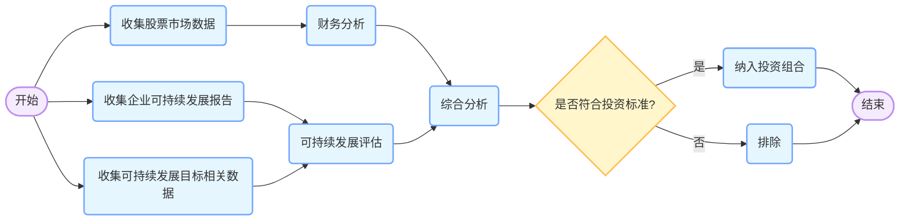

# 特价股票投资中的可持续发展目标整合

> 关键词：特价股票、可持续发展目标、投资策略、财务分析、环境社会治理

> 摘要：本文聚焦于特价股票投资中整合可持续发展目标这一前沿课题。随着全球对可持续发展关注度的不断提升，投资者在追求经济利益的同时，也越来越重视投资的社会和环境影响。文章深入探讨了特价股票的概念与特点，以及可持续发展目标的内涵和重要性。通过分析两者整合的理论基础和现实意义，阐述了如何在特价股票投资中融入可持续发展目标的具体方法和策略。同时，结合实际案例展示了整合实践的效果，并对未来发展趋势和挑战进行了展望，旨在为投资者提供全面且具有操作性的投资思路和方法，促进投资领域的可持续发展。

## 1. 背景介绍 
### 1.1 目的和范围
本研究的目的在于探索如何在特价股票投资过程中有效地整合可持续发展目标。随着金融市场的不断发展和社会对可持续发展理念的日益重视，传统的投资策略正面临着新的挑战和机遇。特价股票投资作为一种常见的投资方式，通常关注股票的价格优势，但往往忽略了企业的可持续发展能力。因此，将可持续发展目标纳入特价股票投资决策中，不仅有助于投资者实现长期的财务回报，还能推动企业和社会的可持续发展。

本研究的范围涵盖了特价股票投资的基本概念、可持续发展目标的主要内容、两者整合的理论依据和实践方法。通过对相关文献的综述和实际案例的分析，探讨如何在投资决策中平衡经济利益和可持续发展的要求，为投资者提供具有可操作性的建议和策略。

### 1.2 预期读者
本文预期读者包括各类投资者，如个人投资者、机构投资者等，他们希望在投资过程中不仅追求经济利益，还关注投资的社会和环境影响。同时，金融行业的从业者，如投资顾问、分析师等，也可以从本文中获取有关特价股票投资和可持续发展目标整合的最新知识和实践经验。此外，对可持续发展和社会责任投资感兴趣的研究人员和学者也可以作为本文的读者群体，通过本文的研究成果进一步深入探讨相关领域的理论和实践问题。

### 1.3 文档结构概述
本文共分为十个部分。第一部分为背景介绍，阐述了研究的目的、范围、预期读者和文档结构概述，并对相关术语进行了定义和解释。第二部分介绍了特价股票和可持续发展目标的核心概念，以及它们之间的联系，并通过文本示意图和 Mermaid 流程图进行了直观展示。第三部分详细讲解了在特价股票投资中整合可持续发展目标的核心算法原理和具体操作步骤，并给出了 Python 源代码示例。第四部分介绍了相关的数学模型和公式，并通过具体例子进行了详细说明。第五部分通过项目实战，展示了在实际投资中如何整合可持续发展目标的代码实现和详细解释。第六部分探讨了整合可持续发展目标在特价股票投资中的实际应用场景。第七部分推荐了相关的学习资源、开发工具框架和论文著作。第八部分总结了未来发展趋势与挑战。第九部分为附录，解答了常见问题。第十部分提供了扩展阅读和参考资料。

### 1.4 术语表
#### 1.4.1 核心术语定义
- **特价股票**：指市场价格相对其内在价值被低估的股票。通常由于市场短期情绪、行业竞争、企业短期困境等因素导致股价低于其应有的价值水平。
- **可持续发展目标**：联合国制定的一系列全球性目标，旨在到 2030 年解决社会、经济和环境等方面的挑战，实现可持续发展。这些目标包括消除贫困、零饥饿、良好健康与福祉、优质教育等 17 个方面。
- **环境社会治理（ESG）**：是一种关注企业环境、社会和治理绩效的投资理念和评价标准。通过对企业在环境保护、社会责任履行和公司治理等方面的表现进行评估，来衡量企业的可持续发展能力。

#### 1.4.2 相关概念解释
- **价值投资**：一种投资策略，强调通过分析股票的内在价值，寻找被市场低估的股票进行投资，以获取长期的资本增值。特价股票投资通常与价值投资理念相关，但在整合可持续发展目标后，会考虑更多的非财务因素。
- **社会责任投资（SRI）**：是一种在投资决策中考虑企业社会责任和可持续发展因素的投资方式。投资者不仅关注财务回报，还关注投资对社会和环境的影响，通过投资符合特定社会和环境标准的企业，推动社会的可持续发展。

#### 1.4.3 缩略词列表
- **ESG**：环境社会治理（Environmental, Social and Governance）
- **SRI**：社会责任投资（Socially Responsible Investment）
- **SDGs**：可持续发展目标（Sustainable Development Goals）

## 2. 核心概念与联系 
### 2.1 特价股票的概念与特点
特价股票是指那些市场价格低于其内在价值的股票。其形成原因多种多样，可能是由于市场的短期波动、投资者的情绪偏见、行业的周期性变化，或者企业自身的短期经营困境等。特价股票的特点包括：
- **价格低估**：这是特价股票的核心特征，其市场价格低于基于公司基本面分析得出的内在价值。
- **投资潜力**：由于价格低估，一旦市场发现其价值，股价可能会出现较大幅度的上涨，为投资者带来较高的回报。
- **风险与机会并存**：特价股票往往伴随着一定的风险，如企业的经营困境可能持续恶化，导致股票价值进一步下降。但同时，也为有眼光的投资者提供了获取超额收益的机会。

### 2.2 可持续发展目标的内涵和重要性
可持续发展目标（SDGs）是联合国在 2015 年通过的《2030 年可持续发展议程》中提出的一系列全球性目标，旨在到 2030 年实现经济、社会和环境的可持续发展。这些目标涵盖了 17 个方面，包括消除贫困、零饥饿、良好健康与福祉、优质教育、性别平等、清洁饮水和卫生设施、廉价和清洁能源等。

可持续发展目标的重要性体现在以下几个方面：
- **推动全球发展**：为全球各国提供了一个共同的发展框架，有助于协调各国的发展战略，促进全球经济、社会和环境的可持续发展。
- **企业社会责任**：要求企业在追求经济利益的同时，也要关注社会和环境问题，履行社会责任，实现可持续发展。
- **投资机会**：可持续发展目标的实现需要大量的投资，这为投资者提供了新的投资机会。同时，投资符合可持续发展目标的企业，也有助于降低投资风险，提高投资的长期回报。

### 2.3 特价股票投资与可持续发展目标的联系
特价股票投资与可持续发展目标之间存在着密切的联系。一方面，可持续发展目标可以为特价股票投资提供新的视角和评估标准。传统的特价股票投资主要关注财务指标，而忽略了企业的社会和环境影响。通过将可持续发展目标纳入投资决策中，可以更全面地评估企业的价值和潜力，发现那些被市场低估但具有良好可持续发展前景的企业。

另一方面，特价股票投资也可以为可持续发展目标的实现提供资金支持。投资者通过投资符合可持续发展目标的特价股票，可以引导资金流向那些致力于解决社会和环境问题的企业，促进企业的可持续发展，从而推动可持续发展目标的实现。

### 2.4 核心概念原理和架构的文本示意图
特价股票投资与可持续发展目标的整合可以看作是一个多维度的决策过程。在这个过程中，投资者需要综合考虑股票的价格、企业的基本面、可持续发展目标的符合程度等多个因素。以下是一个简单的文本示意图：

```plaintext
特价股票投资与可持续发展目标整合决策过程

输入：
- 股票市场数据（价格、财务报表等）
- 企业可持续发展报告
- 可持续发展目标相关数据

处理：
- 财务分析：评估股票的内在价值
- 可持续发展评估：评估企业在环境、社会和治理方面的表现
- 综合分析：结合财务分析和可持续发展评估结果，筛选出符合投资标准的股票

输出：
- 投资组合建议
```

### 2.5 Mermaid 流程图


## 3. 核心算法原理 & 具体操作步骤 
### 3.1 核心算法原理
在特价股票投资中整合可持续发展目标的核心算法原理是通过综合评估股票的财务价值和可持续发展价值，筛选出既具有价格优势又符合可持续发展目标的股票。具体来说，该算法可以分为以下几个步骤：

1. **财务分析**：使用传统的财务分析方法，如市盈率（P/E）、市净率（P/B）、净资产收益率（ROE）等指标，评估股票的内在价值。通过比较股票的市场价格和内在价值，筛选出被低估的股票。

2. **可持续发展评估**：使用环境社会治理（ESG）评估方法，对企业在环境、社会和治理方面的表现进行评估。可以通过收集企业的可持续发展报告、第三方评级机构的评估数据等方式，获取企业的 ESG 信息。根据可持续发展目标的要求，对企业的 ESG 表现进行打分，筛选出符合可持续发展标准的企业。

3. **综合分析**：将财务分析和可持续发展评估的结果进行综合，计算出每个股票的综合得分。可以根据不同的投资目标和风险偏好，为财务指标和可持续发展指标设置不同的权重。选择综合得分较高的股票纳入投资组合。

### 3.2 具体操作步骤
以下是在特价股票投资中整合可持续发展目标的具体操作步骤：

1. **数据收集**：
    - 收集股票市场数据，包括股票价格、财务报表等。
    - 收集企业的可持续发展报告，了解企业在环境、社会和治理方面的表现。
    - 收集可持续发展目标相关数据，如联合国可持续发展目标的指标体系、第三方评级机构的 ESG 评级数据等。

2. **财务分析**：
    - 计算股票的市盈率（P/E）、市净率（P/B）、净资产收益率（ROE）等财务指标。
    - 根据同行业的平均水平和历史数据，评估股票的财务价值。
    - 筛选出市盈率和市净率较低、净资产收益率较高的股票，作为潜在的特价股票。

3. **可持续发展评估**：
    - 对企业的可持续发展报告进行分析，了解企业在环境、社会和治理方面的政策、措施和绩效。
    - 根据第三方评级机构的 ESG 评级数据，对企业的 ESG 表现进行打分。
    - 筛选出 ESG 得分较高的企业，作为符合可持续发展标准的企业。

4. **综合分析**：
    - 为财务指标和可持续发展指标设置不同的权重，例如财务指标权重为 60%，可持续发展指标权重为 40%。
    - 计算每个股票的综合得分，综合得分 = 财务得分 × 财务指标权重 + 可持续发展得分 × 可持续发展指标权重。
    - 选择综合得分较高的股票纳入投资组合。

### 3.3 Python 源代码示例
```python
import pandas as pd
import numpy as np

# 模拟股票市场数据
stock_data = pd.DataFrame({
    '股票代码': ['000001', '000002', '000003', '000004', '000005'],
    '市盈率': [10, 15, 20, 8, 12],
    '市净率': [1.5, 2, 2.5, 1, 1.8],
    '净资产收益率': [0.2, 0.15, 0.1, 0.25, 0.18],
    'ESG 得分': [80, 70, 60, 90, 75]
})

# 财务分析
def financial_analysis(data):
    # 筛选出市盈率低于 15 且市净率低于 2 的股票
    filtered_data = data[(data['市盈率'] < 15) & (data['市净率'] < 2)]
    return filtered_data

# 可持续发展评估
def sustainability_evaluation(data):
    # 筛选出 ESG 得分高于 70 的股票
    filtered_data = data[data['ESG 得分'] > 70]
    return filtered_data

# 综合分析
def comprehensive_analysis(data):
    # 设置财务指标权重和可持续发展指标权重
    financial_weight = 0.6
    sustainability_weight = 0.4
    
    # 计算财务得分和可持续发展得分
    data['财务得分'] = (data['净资产收益率'] / data['市盈率']) * 100
    data['可持续发展得分'] = data['ESG 得分']
    
    # 计算综合得分
    data['综合得分'] = data['财务得分'] * financial_weight + data['可持续发展得分'] * sustainability_weight
    
    # 按综合得分降序排序
    sorted_data = data.sort_values(by='综合得分', ascending=False)
    return sorted_data

# 主函数
def main():
    # 财务分析
    financial_filtered_data = financial_analysis(stock_data)
    
    # 可持续发展评估
    sustainability_filtered_data = sustainability_evaluation(financial_filtered_data)
    
    # 综合分析
    final_data = comprehensive_analysis(sustainability_filtered_data)
    
    print(final_data)

if __name__ == '__main__':
    main()
```

## 4. 数学模型和公式 & 详细讲解 & 举例说明 
### 4.1 财务分析相关公式
#### 4.1.1 市盈率（P/E）
市盈率是指股票价格与每股收益的比率，反映了投资者为获取公司每一元盈利所愿意支付的价格。其计算公式为：
$$P/E = \frac{股票价格}{每股收益}$$
其中，股票价格是指股票在市场上的交易价格，每股收益是指公司净利润除以总股本。

举例说明：假设某股票的市场价格为 20 元，每股收益为 2 元，则该股票的市盈率为：
$$P/E = \frac{20}{2} = 10$$

#### 4.1.2 市净率（P/B）
市净率是指股票价格与每股净资产的比率，反映了投资者为获取公司每一元净资产所愿意支付的价格。其计算公式为：
$$P/B = \frac{股票价格}{每股净资产}$$
其中，每股净资产是指公司净资产除以总股本。

举例说明：假设某股票的市场价格为 15 元，每股净资产为 5 元，则该股票的市净率为：
$$P/B = \frac{15}{5} = 3$$

#### 4.1.3 净资产收益率（ROE）
净资产收益率是指公司净利润与净资产的比率，反映了公司运用自有资本的效率。其计算公式为：
$$ROE = \frac{净利润}{净资产} \times 100\%$$

举例说明：假设某公司的净利润为 1000 万元，净资产为 5000 万元，则该公司的净资产收益率为：
$$ROE = \frac{1000}{5000} \times 100\% = 20\%$$

### 4.2 可持续发展评估相关公式
#### 4.2.1 ESG 得分
ESG 得分是对企业在环境、社会和治理方面表现的综合评估得分。不同的评级机构可能采用不同的评估方法和指标体系，因此 ESG 得分的计算方法也会有所不同。一般来说，ESG 得分是通过对多个指标进行加权平均计算得出的。

假设某评级机构采用以下指标和权重来计算 ESG 得分：
| 指标 | 权重 |
|---|---|
| 环境指标 | 30% |
| 社会指标 | 30% |
| 治理指标 | 40% |

则 ESG 得分的计算公式为：
$$ESG 得分 = 环境指标得分 \times 30\% + 社会指标得分 \times 30\% + 治理指标得分 \times 40\%$$

举例说明：假设某企业的环境指标得分是 80 分，社会指标得分是 70 分，治理指标得分是 90 分，则该企业的 ESG 得分是：
$$ESG 得分 = 80 \times 30\% + 70 \times 30\% + 90 \times 40\% = 24 + 21 + 36 = 81$$

### 4.3 综合分析相关公式
综合得分是将财务得分和可持续发展得分进行加权平均计算得出的，用于综合评估股票的投资价值。其计算公式为：
$$综合得分 = 财务得分 \times 财务指标权重 + 可持续发展