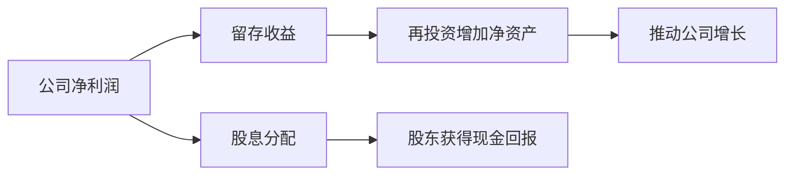

# 特价股票投资中的可持续增长模型应用

> 关键词：特价股票投资、可持续增长模型、股息折现模型、ROE、留存收益率

> 摘要：本文聚焦于特价股票投资中可持续增长模型的应用。首先介绍了背景信息，包括目的范围、预期读者等。接着阐述了核心概念，如可持续增长模型的原理与架构，并通过Mermaid流程图展示。详细讲解了核心算法原理，结合Python代码示例。深入探讨了数学模型和公式，辅以具体例子说明。通过项目实战展示代码实现和解读。分析了实际应用场景，推荐了相关工具和资源。最后总结了未来发展趋势与挑战，解答常见问题并提供扩展阅读与参考资料，旨在为投资者在特价股票投资中合理运用可持续增长模型提供全面且深入的指导。

## 1. 背景介绍 
### 1.1 目的和范围
本文章的主要目的是深入探讨可持续增长模型在特价股票投资领域的应用。在当今复杂多变的金融市场中，投资者面临着众多的股票选择，而特价股票因其价格相对较低，往往具有潜在的投资价值。可持续增长模型作为一种重要的财务分析工具，可以帮助投资者评估公司的长期增长能力和内在价值，从而在特价股票中筛选出具有投资潜力的标的。

本文的范围将涵盖可持续增长模型的基本原理、核心算法、数学模型以及在实际投资中的应用案例。通过对这些内容的详细阐述，为投资者提供一套系统的分析方法和决策依据，使其能够更加科学地进行特价股票投资。

### 1.2 预期读者
本文预期的读者主要包括以下几类人群：
- **个人投资者**：希望通过学习专业的投资分析方法，提高自己在特价股票投资中的决策能力，实现资产的增值。
- **金融从业者**：如股票分析师、投资顾问等，需要深入了解可持续增长模型在实际投资中的应用，为客户提供更专业的投资建议。
- **金融专业学生**：通过阅读本文，加深对财务分析和股票投资理论的理解，为未来从事相关职业打下坚实的基础。

### 1.3 文档结构概述
本文将按照以下结构进行组织：
- **核心概念与联系**：介绍可持续增长模型的基本概念、原理和架构，通过文本示意图和Mermaid流程图进行直观展示。
- **核心算法原理 & 具体操作步骤**：详细讲解可持续增长模型的核心算法，并使用Python源代码进行示例，说明具体的操作步骤。
- **数学模型和公式 & 详细讲解 & 举例说明**：阐述可持续增长模型的数学模型和公式，对其进行详细讲解，并通过具体例子说明如何应用这些公式进行投资分析。
- **项目实战：代码实际案例和详细解释说明**：通过一个实际的项目案例，展示如何使用可持续增长模型进行特价股票投资分析，包括开发环境搭建、源代码实现和代码解读。
- **实际应用场景**：分析可持续增长模型在特价股票投资中的实际应用场景，以及如何根据不同的场景进行投资决策。
- **工具和资源推荐**：推荐一些学习和应用可持续增长模型的工具和资源，包括书籍、在线课程、技术博客、开发工具和相关论文等。
- **总结：未来发展趋势与挑战**：总结可持续增长模型在特价股票投资中的应用现状，分析未来的发展趋势和面临的挑战。
- **附录：常见问题与解答**：解答读者在学习和应用可持续增长模型过程中常见的问题。
- **扩展阅读 & 参考资料**：提供一些扩展阅读的建议和相关的参考资料，供读者进一步深入学习。

### 1.4 术语表
#### 1.4.1 核心术语定义
- **特价股票**：指市场价格相对其内在价值较低的股票，通常具有较高的投资性价比。
- **可持续增长模型**：一种用于评估公司长期增长能力的财务模型，基于公司的净资产收益率（ROE）和留存收益率来计算公司的可持续增长率。
- **股息折现模型（DDM）**：一种股票估值模型，通过将股票未来的股息折现到当前时刻来计算股票的内在价值。
- **净资产收益率（ROE）**：衡量公司盈利能力的指标，反映了公司运用自有资本的效率，计算公式为净利润与平均净资产的比率。
- **留存收益率**：公司留存收益占净利润的比例，反映了公司将利润用于再投资的程度。

#### 1.4.2 相关概念解释
- **内在价值**：股票的真实价值，由公司的基本面因素决定，如盈利能力、资产质量、增长潜力等。
- **增长率**：公司在一定时期内的业绩增长速度，通常用百分比表示。
- **折现率**：将未来的现金流折现到当前时刻所使用的利率，反映了资金的时间价值和投资风险。

#### 1.4.3 缩略词列表
- **ROE**：Return on Equity，净资产收益率
- **DDM**：Dividend Discount Model，股息折现模型

## 2. 核心概念与联系 
### 可持续增长模型原理
可持续增长模型的核心思想是，公司的增长速度受到其盈利能力和留存收益再投资能力的限制。在不发行新股、不改变资本结构的前提下，公司的可持续增长率（Sustainable Growth Rate, SGR）可以通过以下公式计算：

$$SGR = ROE \times b$$

其中，$ROE$ 是净资产收益率，反映了公司运用自有资本的效率；$b$ 是留存收益率，即公司留存收益占净利润的比例。

这个公式的原理在于，公司的净利润可以分为两部分：一部分以股息的形式分配给股东，另一部分则作为留存收益用于再投资。留存收益的再投资会增加公司的净资产，从而推动公司的增长。而 $ROE$ 则衡量了公司利用这些新增净资产创造利润的能力。因此，可持续增长率是公司在现有经营和财务政策下能够实现的最大增长率。

### 架构示意图
以下是可持续增长模型的文本示意图：

```plaintext
                公司净利润
                   |
            +------+------+
            |             |
       股息分配      留存收益
            |             |
            |             +--> 再投资增加净资产
            |                   |
            |                   +--> 推动公司增长
            |
            +--> 股东获得现金回报
```

### Mermaid流程图


### 与其他概念的联系
可持续增长模型与股息折现模型（DDM）密切相关。在DDM中，股票的内在价值取决于其未来股息的现值。而公司的股息增长速度又与可持续增长率相关。如果公司按照可持续增长率增长，那么其股息也会以相同的速度增长。因此，可持续增长模型可以为DDM提供重要的输入参数，帮助投资者更准确地评估股票的内在价值。

此外，可持续增长模型还与公司的财务政策、经营策略等密切相关。公司可以通过调整留存收益率和提高ROE来改变可持续增长率。例如，公司可以通过加大研发投入、优化生产流程等方式提高ROE，从而实现更高的可持续增长。

## 3. 核心算法原理 & 具体操作步骤 

### 核心算法原理
可持续增长模型的核心算法就是计算公司的可持续增长率（SGR），其公式为：

$$SGR = ROE \times b$$

其中，$ROE$ 的计算公式为：

$$ROE = \frac{净利润}{平均净资产}$$

留存收益率 $b$ 的计算公式为：

$$b = 1 - \frac{股息支付率}{100\%}$$

股息支付率是指公司股息占净利润的比例。

### 具体操作步骤
以下是使用可持续增长模型进行特价股票投资分析的具体操作步骤：

1. **收集数据**：收集目标公司的财务报表，包括利润表和资产负债表，从中获取净利润、股息、平均净资产等数据。
2. **计算ROE**：根据上述公式计算公司的ROE。
3. **计算股息支付率和留存收益率**：计算公司的股息支付率，并根据公式计算留存收益率。
4. **计算可持续增长率**：将ROE和留存收益率代入可持续增长模型公式，计算公司的可持续增长率。
5. **评估股票价值**：结合股息折现模型等方法，使用计算得到的可持续增长率评估股票的内在价值。
6. **比较股票价格和内在价值**：将股票的市场价格与计算得到的内在价值进行比较，如果市场价格低于内在价值，则该股票可能是特价股票，具有投资价值。

### Python源代码示例
```python
# 定义计算ROE的函数
def calculate_roe(net_income, average_equity):
    return net_income / average_equity

# 定义计算留存收益率的函数
def calculate_retention_ratio(dividend_payout_ratio):
    return 1 - dividend_payout_ratio

# 定义计算可持续增长率的函数
def calculate_sgr(roe, retention_ratio):
    return roe * retention_ratio

# 示例数据
net_income = 1000000  # 净利润
average_equity = 5000000  # 平均净资产
dividend_payout_ratio = 0.3  # 股息支付率

# 计算ROE
roe = calculate_roe(net_income, average_equity)
print(f"ROE: {roe * 100:.2f}%")

# 计算留存收益率
retention_ratio = calculate_retention_ratio(dividend_payout_ratio)
print(f"留存收益率: {retention_ratio * 100:.2f}%")

# 计算可持续增长率
sgr = calculate_sgr(roe, retention_ratio)
print(f"可持续增长率: {sgr * 100:.2f}%")
```

在上述代码中，我们定义了三个函数分别用于计算ROE、留存收益率和可持续增长率。然后，我们使用示例数据调用这些函数进行计算，并输出计算结果。

## 4. 数学模型和公式 & 详细讲解 & 举例说明 

### 数学模型和公式
#### 可持续增长率公式
$$SGR = ROE \times b$$

#### ROE计算公式
$$ROE = \frac{净利润}{平均净资产}$$

#### 留存收益率计算公式
$$b = 1 - \frac{股息支付率}{100\%}$$

#### 股息折现模型（DDM）公式
对于固定增长的股息折现模型，股票的内在价值 $V$ 可以通过以下公式计算：

$$V = \frac{D_1}{r - g}$$

其中，$D_1$ 是下一期的股息，$r$ 是折现率，$g$ 是股息增长率，在可持续增长模型下，$g$ 等于可持续增长率 $SGR$。

### 详细讲解
- **可持续增长率公式**：该公式表明，公司的可持续增长率取决于其净资产收益率和留存收益率。ROE越高，说明公司利用自有资本创造利润的能力越强；留存收益率越高，说明公司将更多的利润用于再投资，从而推动公司的增长。
- **ROE计算公式**：ROE反映了公司运用自有资本的效率，是衡量公司盈利能力的重要指标。较高的ROE意味着公司能够以较少的净资产创造出较多的净利润。
- **留存收益率计算公式**：留存收益率反映了公司将利润用于再投资的程度。留存收益率越高，公司用于再投资的资金就越多，未来的增长潜力也就越大。
- **股息折现模型公式**：该公式基于现金流折现的原理，将股票未来的股息折现到当前时刻，从而计算出股票的内在价值。在可持续增长模型下，假设股息以可持续增长率 $g$ 固定增长，因此可以使用该公式进行估值。

### 举例说明
假设某公司的净利润为100万元，平均净资产为500万元，股息支付率为40%，折现率为10%。

1. **计算ROE**
$$ROE = \frac{100}{500} = 0.2 = 20\%$$

2. **计算留存收益率**
$$b = 1 - 0.4 = 0.6 = 60\%$$

3. **计算可持续增长率**
$$SGR = 0.2 \times 0.6 = 0.12 = 12\%$$

4. **假设下一期股息 $D_1$ 为1元，计算股票的内在价值**
使用股息折现模型公式：
$$V = \frac{1}{0.1 - 0.12} = -50$$

由于计算结果为负数，这可能是由于假设的折现率和增长率不合理导致的。在实际应用中，需要根据市场情况和公司的实际情况合理选择折现率和增长率。

如果我们调整折现率为15%，则：
$$V = \frac{1}{0.15 - 0.12} = \frac{1}{0.03} \approx 33.33$$

这意味着在当前假设下，该股票的内在价值约为33.33元。如果该股票的市场价格低于33.33元，则可能是特价股票，具有投资价值。

## 5. 项目实战：代码实际案例和详细解释说明 

### 5.1  开发环境搭建
#### 安装Python
首先，需要安装Python编程语言。可以从Python官方网站（https://www.python.org/downloads/）下载适合自己操作系统的Python安装包，并按照安装向导进行安装。

#### 安装必要的库
在本项目中，我们需要使用 `pandas` 和 `numpy` 等库进行数据处理和分析。可以使用以下命令进行安装：

```sh
pip install pandas numpy
```

### 5.2  源代码详细实现和代码解读
```python
import pandas as pd
import numpy as np

# 定义计算ROE的函数
def calculate_roe(net_income, average_equity):
    return net_income / average_equity

# 定义计算留存收益率的函数
def calculate_retention_ratio(dividend_payout_ratio):
    return 1 - dividend_payout_ratio

# 定义计算可持续增长率的函数
def calculate_sgr(roe, retention_ratio):
    return roe * retention_ratio

# 定义计算股票内在价值的函数
def calculate_stock_value(d1, r, g):
    if r <= g:
        raise ValueError("折现率必须大于增长率")
    return d1 / (r - g)

# 示例数据
data = {
    '净利润': [1000000, 1200000, 1300000],
    '平均净资产': [5000000, 5500000, 6000000],
    '股息支付率': [0.3, 0.35, 0.4]
}

df = pd.DataFrame(data)

# 计算ROE
df['ROE'] = df.apply(lambda row: calculate_roe(row['净利润'], row['平均净资产']), axis=1)

# 计算留存收益率
df['留存收益率'] = df['股息支付率'].apply(calculate_retention_ratio)

# 计算可持续增长率
df['可持续增长率'] = df.apply(lambda row: calculate_sgr(row['ROE'], row['留存收益率']), axis=1)

# 假设下一期股息D1为1元，折现率r为15%
d1 = 1
r = 0.15

# 计算股票内在价值
df['股票内在价值'] = df['可持续增长率'].apply(lambda g: calculate_stock_value(d1, r, g))

print(df)
```

### 5.3  代码解读与分析
- **数据处理**：使用 `pandas` 库创建一个包含净利润、平均净资产和股息支付率的DataFrame。
- **函数定义**：定义了计算ROE、留存收益率、可持续增长率和股票内在价值的函数。
- **计算指标**：使用 `apply` 方法对DataFrame中的每一行应用相应的函数，计算ROE、留存收益率、可持续增长率和股票内在价值。
- **结果输出**：将计算结果添加到DataFrame中，并打印输出。

通过这个项目实战，我们可以看到如何使用Python代码实现可持续增长模型，并计算股票的内在价值。在实际应用中，可以根据需要修改示例数据，对不同的公司进行分析。

## 6. 实际应用场景 
### 筛选特价股票
投资者可以使用可持续增长模型对市场上的股票进行筛选，找出那些具有较高可持续增长率但市场价格相对较低的股票，即特价股票。通过比较股票的内在价值和市场价格，投资者可以判断该股票是否被低估，从而做出投资决策。

### 评估公司增长潜力
可持续增长模型可以帮助投资者评估公司的长期增长潜力。如果公司的可持续增长率较高，说明公司在现有经营和财务政策下具有较强的增长能力。投资者可以关注这些公司，并考虑长期投资。

### 制定投资策略
根据可持续增长模型的计算结果，投资者可以制定不同的投资策略。例如，对于可持续增长率较高且稳定的公司，投资者可以采取长期持有策略；对于可持续增长率较低或不稳定的公司，投资者可以采取短期交易策略或回避投资。

### 风险评估
可持续增长模型也可以用于评估投资风险。如果公司的可持续增长率过高，可能意味着公司面临着较大的经营风险或财务风险。投资者需要进一步分析公司的财务状况和经营环境，评估其风险水平。

## 7. 工具和资源推荐
### 7.1 学习资源推荐
#### 7.1.1 书籍推荐
- 《财务报表分析与证券定价》：这本书详细介绍了财务报表分析的方法和技巧，以及如何运用财务数据进行证券定价，对理解可持续增长模型和股票投资分析有很大帮助。
- 《聪明的投资者》：本杰明·格雷厄姆的经典著作，强调了价值投资的理念和方法，对于投资者树立正确的投资观念和运用可持续增长模型进行投资决策具有重要的指导意义。
- 《巴菲特致股东的信：股份公司教程》：这本书收录了巴菲特多年来致股东的信，通过这些信件可以学习到巴菲特的投资哲学和分析方法，对可持续增长模型在投资中的应用有更深入的理解。

#### 7.1.2 在线课程
- Coursera上的“财务分析与决策”课程：由知名大学教授授课，系统地介绍了财务分析的基本概念、方法和工具，包括可持续增长模型的应用。
- edX上的“投资学原理”课程：该课程涵盖了投资学的各个方面，包括股票投资分析和估值方法，对可持续增长模型的讲解深入浅出。

#### 7.1.3 技术博客和网站
- 雪球网：一个专注于股票投资的社区，有很多投资者分享自己的投资经验和分析报告，其中不乏对可持续增长模型的应用案例和讨论。
- 东方财富网：提供丰富的金融数据和资讯，投资者可以在该网站上获取公司的财务报表和相关数据，用于可持续增长模型的计算和分析。

### 7.2 开发工具框架推荐
#### 7.2.1 IDE和编辑器
- PyCharm：一款专业的Python集成开发环境，具有强大的代码编辑、调试和分析功能，适合用于开发和调试与可持续增长模型相关的Python代码。
- Jupyter Notebook：一种交互式的开发环境，支持Python代码的编写、运行和可视化展示，非常适合进行数据探索和分析，在可持续增长模型的研究和实践中应用广泛。

#### 7.2.2 调试和性能分析工具
- pdb：Python自带的调试工具，可以帮助开发者逐行调试代码，找出代码中的错误和问题。
- cProfile：Python的性能分析工具，可以分析代码的运行时间和资源消耗情况，帮助开发者优化代码性能。

#### 7.2.3 相关框架和库
- pandas：一个强大的数据处理和分析库，提供了丰富的数据结构和函数，方便开发者进行数据清洗、转换和分析，在可持续增长模型的数据处理中非常有用。
- numpy：一个用于科学计算的Python库，提供了高效的数组操作和数学函数，在可持续增长模型的计算中可以提高计算效率。

### 7.3 相关论文著作推荐
#### 7.3.1 经典论文
- 《可持续增长率概念的理论分析》：该论文对可持续增长模型的理论基础进行了深入分析，探讨了模型的假设条件和应用范围，为后续的研究和实践提供了重要的理论支持。
- 《股息折现模型的实证研究》：论文通过实证研究的方法，验证了股息折现模型在股票估值中的有效性，并分析了模型的局限性和改进方向，对可持续增长模型与股息折现模型的结合应用有重要的参考价值。

#### 7.3.2 最新研究成果
- 近年来，随着金融科技的发展，一些学者开始将机器学习和人工智能技术应用于可持续增长模型的研究中，提出了一些新的模型和方法。例如，使用深度学习算法预测公司的可持续增长率，提高了预测的准确性和效率。
- 还有一些研究关注可持续增长模型在不同行业和市场环境下的应用差异，为投资者提供了更具针对性的投资建议。

#### 7.3.3 应用案例分析
- 一些金融机构和研究机构会发布关于可持续增长模型应用的案例分析报告，这些报告通过实际案例展示了如何使用可持续增长模型进行股票投资分析和决策，对投资者具有很强的借鉴意义。

## 8. 总结：未来发展趋势与挑战
### 未来发展趋势
- **与科技融合**：随着人工智能、大数据等技术的不断发展，可持续增长模型将与这些技术更加紧密地结合。例如，利用大数据分析公司的经营数据和市场信息，提高可持续增长率的预测准确性；使用人工智能算法优化投资决策，提高投资效率。
- **行业细分应用**：不同行业的公司具有不同的经营特点和增长模式，未来可持续增长模型将更加注重行业细分应用。针对不同行业的特点，开发更加适合的模型和参数，提高模型的适用性和准确性。
- **社会责任投资**：越来越多的投资者开始关注公司的社会责任和可持续发展能力。未来，可持续增长模型可能会纳入更多与社会责任相关的指标，如环境、社会和治理（ESG）指标，以评估公司的综合价值和长期增长潜力。

### 挑战
- **数据质量和可靠性**：可持续增长模型的计算和分析依赖于大量的财务数据和市场信息。然而，数据的质量和可靠性可能存在问题，如数据不准确、不完整等，这会影响模型的计算结果和投资决策的准确性。
- **市场不确定性**：金融市场具有高度的不确定性，公司的经营环境和增长前景可能会受到多种因素的影响，如宏观经济形势、政策变化、行业竞争等。这些不确定性增加了可持续增长率预测的难度，也给投资决策带来了挑战。
- **模型假设的局限性**：可持续增长模型建立在一些假设条件之上，如公司的经营和财务政策保持稳定、股息以固定增长率增长等。然而，在实际情况中，这些假设可能并不成立，从而影响模型的适用性和准确性。

## 9. 附录：常见问题与解答
### 问题1：可持续增长模型是否适用于所有公司？
解答：可持续增长模型并不适用于所有公司。该模型假设公司的经营和财务政策保持稳定，股息以固定增长率增长。对于一些处于快速发展阶段、经营不稳定或财务政策经常变化的公司，该模型的适用性可能会受到限制。

### 问题2：如何确定折现率？
解答：折现率的确定是一个复杂的问题，需要考虑多种因素，如市场利率、投资风险、公司的资本成本等。一般来说，可以参考市场上类似投资的收益率，结合公司的风险水平进行调整。也可以使用资本资产定价模型（CAPM）等方法来计算折现率。

### 问题3：可持续增长率和实际增长率有什么区别？
解答：可持续增长率是公司在现有经营和财务政策下能够实现的最大增长率，是一种理论上的增长率。而实际增长率是公司在实际经营过程中实现的增长率，受到多种因素的影响，可能高于或低于可持续增长率。

### 问题4：如何提高可持续增长率？
解答：可以通过提高净资产收益率（ROE）和留存收益率来提高可持续增长率。提高ROE可以通过优化公司的经营管理、提高盈利能力等方式实现；提高留存收益率可以通过减少股息分配、增加留存收益用于再投资来实现。

## 10. 扩展阅读 & 参考资料
### 扩展阅读
- 《金融炼金术》：乔治·索罗斯的著作，探讨了金融市场的运行规律和投资者的心理行为，对理解金融市场的复杂性和不确定性有很大帮助。
- 《非理性繁荣》：罗伯特·席勒的经典之作，分析了金融市场中的泡沫现象和投资者的非理性行为，为投资者提供了防范风险的启示。

### 参考资料
- 公司的财务报表和年报，可从证券交易所网站、公司官方网站等渠道获取。
- 金融数据提供商，如Wind、东方财富Choice等，提供丰富的金融数据和分析工具。
- 学术期刊和研究报告，如《金融研究》、《会计研究》等，发表了大量关于财务分析和股票投资的研究成果。

作者：AI天才研究院/AI Genius Institute & 禅与计算机程序设计艺术 /Zen And The Art of Computer Programming