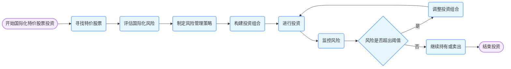

# 特价股票投资中的国际化风险管理

> 关键词：特价股票投资、国际化风险、风险管理、投资策略、金融市场

> 摘要：本文聚焦于特价股票投资中的国际化风险管理问题。随着全球金融市场的不断融合，投资者有更多机会参与国际特价股票投资，但同时也面临着诸多国际化风险。文章深入探讨了特价股票投资的核心概念，分析了相关的风险因素和数学模型，通过实际案例展示了风险管理的具体操作，并介绍了适用的工具和资源。最后对未来发展趋势与挑战进行总结，旨在为投资者在特价股票投资的国际化进程中提供全面且实用的风险管理指导。

## 1. 背景介绍 
### 1.1 目的和范围
在全球经济一体化的大背景下，金融市场的国际化程度日益加深。特价股票由于其价格相对较低，可能蕴含着较高的投资回报潜力，吸引了众多投资者的目光。然而，进行国际化的特价股票投资时，投资者需要面对诸如汇率波动、政治风险、不同国家的市场规则差异等一系列独特的风险。本文的目的在于深入剖析这些国际化风险，并提供有效的风险管理策略和方法，帮助投资者在追求特价股票投资收益的同时，降低风险暴露。

本文的范围涵盖了特价股票投资的基本概念、国际化风险的种类和特点、风险管理的核心算法和数学模型、实际项目案例分析以及相关的工具和资源推荐等方面。

### 1.2 预期读者
本文预期读者主要包括对特价股票投资感兴趣的个人投资者、专业的金融投资机构从业者、金融研究人员以及相关专业的学生。无论是希望通过投资特价股票实现资产增值的个人，还是需要制定投资策略的机构，都可以从本文中获取有价值的信息和指导。

### 1.3 文档结构概述
本文将按照以下结构进行阐述：首先介绍核心概念与联系，明确特价股票投资和国际化风险管理的基本定义和相互关系；接着讲解核心算法原理和具体操作步骤，通过 Python 代码详细说明风险管理的计算方法；然后介绍相关的数学模型和公式，并结合实际例子进行解释；之后通过项目实战案例展示如何在实际投资中应用风险管理策略；再探讨实际应用场景；推荐相关的工具和资源；最后总结未来发展趋势与挑战，并提供常见问题解答和扩展阅读参考资料。

### 1.4 术语表
#### 1.4.1 核心术语定义
- **特价股票**：指价格相对其内在价值或同行业其他股票价格较低的股票。特价股票可能由于公司短期业绩不佳、市场误解、行业周期性等原因导致价格被低估。
- **国际化风险管理**：在国际投资活动中，识别、评估和应对各种风险因素，以降低风险对投资组合的不利影响，确保投资目标的实现。
- **汇率风险**：由于不同国家货币之间汇率波动而导致投资者资产价值发生变化的风险。
- **政治风险**：由于政治局势不稳定、政策变化等政治因素导致投资环境发生变化，从而影响投资收益的风险。
- **市场风险**：指市场价格波动、市场流动性不足等市场因素对投资造成的风险。

#### 1.4.2 相关概念解释
- **投资组合**：投资者将资金分散投资于多种不同的资产或股票，以降低单一资产波动对整体投资的影响。在国际化特价股票投资中，投资组合可能包含来自不同国家和地区的特价股票。
- **风险评估**：对投资过程中可能面临的各种风险进行识别、分析和量化的过程。通过风险评估，投资者可以了解不同风险因素的可能性和影响程度，为制定风险管理策略提供依据。
- **风险对冲**：通过采取相反的投资策略或使用金融衍生品等手段，降低投资组合对特定风险的暴露。例如，利用外汇期货对冲汇率风险。

#### 1.4.3 缩略词列表
- **VAR**：Value at Risk，风险价值，是一种常用的风险度量指标，用于衡量在一定的置信水平下，投资组合在未来一定时期内可能遭受的最大损失。
- **ETF**：Exchange Traded Fund，交易型开放式指数基金，是一种在证券交易所上市交易的开放式基金，通常跟踪特定的指数。

## 2. 核心概念与联系 

### 2.1 特价股票投资的核心原理
特价股票投资的核心原理基于价值投资理论。价值投资者认为，市场有时会对某些股票的价格产生错误定价，导致股票价格低于其内在价值。内在价值是指公司未来现金流的现值，通过对公司的财务状况、行业前景、竞争优势等因素进行分析，可以估算出公司的内在价值。当股票价格低于内在价值时，投资者认为该股票具有投资价值，可能会在未来价格回归内在价值的过程中获得收益。

例如，一家公司由于短期的经营困难导致股价下跌，但其实质上拥有良好的资产、稳定的客户群体和创新的技术。此时，该股票可能成为特价股票，投资者通过分析其内在价值，认为股价被低估，从而选择买入。

### 2.2 国际化风险的种类和特点
#### 2.2.1 汇率风险
汇率风险是国际化投资中最常见的风险之一。当投资者投资于外国股票时，需要将本国货币兑换成外国货币进行交易。在投资期间，汇率的波动会影响投资收益的本币价值。例如，一位美国投资者购买了英国的特价股票，投资时美元兑英镑的汇率为 1:0.7。当投资者卖出股票时，美元兑英镑的汇率变为 1:0.8，即使股票价格在英镑计价下没有变化，投资者在将英镑换回美元时也会遭受损失。

汇率风险具有不确定性和复杂性的特点。汇率受到多种因素的影响，包括宏观经济数据、货币政策、地缘政治等，难以准确预测。

#### 2.2.2 政治风险
政治风险主要包括政治局势不稳定、政策变化、战争、恐怖主义等因素对投资的影响。不同国家的政治环境差异较大，政治风险的表现形式也各不相同。例如，某些国家可能会出台新的税收政策、行业监管政策，限制外资进入或对外国投资者征收高额税费，从而影响投资收益。政治风险具有突发性和不可预测性，一旦发生，可能对投资造成严重的损失。

#### 2.2.3 市场风险
市场风险是指由于市场价格波动、市场流动性不足等因素导致投资价值下降的风险。不同国家的股票市场具有不同的特点和运行规律，市场风险的程度也有所差异。例如，新兴市场国家的股票市场可能波动较大，市场流动性相对较差，投资者在买卖股票时可能面临较大的价格冲击成本。

### 2.3 核心概念的联系
特价股票投资与国际化风险管理密切相关。在进行国际化的特价股票投资时，投资者需要同时考虑股票的特价属性和国际化风险。一方面，特价股票的投资机会可能存在于不同国家和地区的市场中，投资者需要通过国际化投资来扩大投资范围，寻找更多的特价股票。另一方面，国际化投资带来的汇率风险、政治风险和市场风险等可能会抵消特价股票投资的潜在收益。因此，投资者需要运用有效的风险管理策略，在追求特价股票投资收益的同时，降低国际化风险的影响。

### 2.4 文本示意图和 Mermaid 流程图

#### 2.4.1 文本示意图
特价股票投资与国际化风险管理的关系可以用以下示意图表示：

```
             国际化投资
                |
       +--------+--------+
       |                 |
  特价股票选择      国际化风险识别
       |                 |
       +--------+--------+
                |
        风险管理策略制定
                |
       +--------+--------+
       |                 |
  投资组合构建      风险监控与调整
```

#### 2.4.2 Mermaid 流程图


## 3. 核心算法原理 & 具体操作步骤 

### 3.1 风险评估算法 - VAR（风险价值）
VAR 是一种广泛应用的风险度量指标，用于衡量在一定的置信水平下，投资组合在未来一定时期内可能遭受的最大损失。VAR 的计算方法有多种，这里介绍历史模拟法。

#### 3.1.1 历史模拟法的原理
历史模拟法基于历史数据来模拟未来的市场变化。其基本思想是假设未来的市场情况与过去的市场情况相似，通过对历史数据的分析来估计投资组合的潜在损失。具体步骤如下：
1. 收集投资组合中各资产的历史价格数据。
2. 计算各资产的历史收益率。
3. 根据历史收益率生成投资组合的历史收益率序列。
4. 对投资组合的历史收益率序列进行排序。
5. 根据给定的置信水平，确定 VAR 值。例如，在 95% 的置信水平下，VAR 值为排序后收益率序列中第 5% 分位数对应的损失值。

#### 3.1.2 Python 代码实现
```python
import numpy as np
import pandas as pd

# 假设我们有一个包含三只股票的投资组合，其历史价格数据存储在一个 DataFrame 中
# 每列代表一只股票的价格
prices = pd.DataFrame({
    'Stock1': [100, 102, 105, 103, 106],
    'Stock2': [200, 205, 203, 206, 208],
    'Stock3': [300, 302, 305, 303, 306]
})

# 计算各股票的收益率
returns = prices.pct_change().dropna()

# 假设投资组合的权重为 [0.3, 0.4, 0.3]
weights = np.array([0.3, 0.4, 0.3])

# 计算投资组合的历史收益率
portfolio_returns = returns.dot(weights)

# 置信水平为 95%
confidence_level = 0.95

# 计算 VAR 值
var = np.percentile(portfolio_returns, (1 - confidence_level) * 100)

print(f"投资组合在 95% 置信水平下的 VAR 值为: {var:.4f}")
```

### 3.2 风险管理策略 - 风险对冲
风险对冲是一种常用的风险管理策略，通过采取相反的投资策略或使用金融衍生品等手段，降低投资组合对特定风险的暴露。以下以汇率风险对冲为例，介绍具体的操作步骤。

#### 3.2.1 汇率风险对冲的原理
假设一位美国投资者投资了英国的特价股票，为了对冲汇率风险，投资者可以在外汇市场上卖出一定数量的英镑远期合约。如果英镑贬值，股票投资的美元价值会下降，但外汇远期合约会产生盈利，从而抵消部分损失。

#### 3.2.2 Python 代码实现
```python
# 假设投资者投资了 10000 英镑的英国股票
investment_amount_gbp = 10000

# 当前美元兑英镑的汇率
exchange_rate = 1.3

# 投资的美元价值
investment_amount_usd = investment_amount_gbp * exchange_rate

# 假设投资者预计英镑会贬值，决定卖出 10000 英镑的远期合约
forward_contract_amount_gbp = 10000

# 假设远期合约的汇率为 1.25
forward_exchange_rate = 1.25

# 模拟英镑贬值后的汇率
new_exchange_rate = 1.2

# 计算股票投资的美元价值变化
new_investment_amount_usd = investment_amount_gbp * new_exchange_rate
investment_loss_usd = investment_amount_usd - new_investment_amount_usd

# 计算远期合约的盈利
forward_contract_profit_usd = forward_contract_amount_gbp * (forward_exchange_rate - new_exchange_rate)

# 计算总收益变化
total_profit_usd = forward_contract_profit_usd - investment_loss_usd

print(f"股票投资损失: {investment_loss_usd:.2f} 美元")
print(f"远期合约盈利: {forward_contract_profit_usd:.2f} 美元")
print(f"总收益变化: {total_profit_usd:.2f} 美元")
```

## 4. 数学模型和公式 & 详细讲解 & 举例说明 

### 4.1 风险价值（VAR）的数学模型
#### 4.1.1 公式定义
在历史模拟法中，VAR 的计算公式为：
$$VAR = -R_{(1 - c)n}$$
其中，$R_{(1 - c)n}$ 表示投资组合历史收益率序列中第 $(1 - c)n$ 个分位数，$c$ 为置信水平，$n$ 为历史收益率序列的样本数量。

#### 4.1.2 详细讲解
置信水平 $c$ 表示在一定时期内，投资组合的损失不超过 VAR 值的概率。例如，$c = 0.95$ 表示在 95% 的情况下，投资组合的损失不会超过 VAR 值。分位数的计算是将历史收益率序列从小到大排序，然后找到第 $(1 - c)n$ 个位置对应的收益率值。

#### 4.1.3 举例说明
假设我们有一个包含 100 个历史收益率数据的投资组合，置信水平为 95%。则 $(1 - c)n = (1 - 0.95) \times 100 = 5$。将历史收益率序列排序后，第 5 个位置对应的收益率值就是 VAR 值。如果该收益率值为 -0.02，则 VAR 值为 0.02，表示在 95% 的置信水平下，投资组合在未来一定时期内可能遭受的最大损失为 2%。

### 4.2 投资组合收益率的数学模型
#### 4.2.1 公式定义
投资组合的收益率可以通过各资产的收益率和权重来计算。假设投资组合包含 $n$ 种资产，第 $i$ 种资产的权重为 $w_i$，收益率为 $R_i$，则投资组合的收益率 $R_p$ 计算公式为：
$$R_p = \sum_{i = 1}^{n} w_i R_i$$

#### 4.2.2 详细讲解
权重 $w_i$ 表示第 $i$ 种资产在投资组合中所占的比例，$\sum_{i = 1}^{n} w_i = 1$。收益率 $R_i$ 可以通过资产的价格变化来计算，例如，某资产在 $t$ 时刻的价格为 $P_t$，在 $t - 1$ 时刻的价格为 $P_{t - 1}$，则该资产的收益率为 $R_i = \frac{P_t - P_{t - 1}}{P_{t - 1}}$。

#### 4.2.3 举例说明
假设一个投资组合包含三只股票，权重分别为 $w_1 = 0.3$，$w_2 = 0.4$，$w_3 = 0.3$，三只股票的收益率分别为 $R_1 = 0.05$，$R_2 = 0.03$，$R_3 = 0.02$。则投资组合的收益率为：
$$R_p = 0.3 \times 0.05 + 0.4 \times 0.03 + 0.3 \times 0.02 = 0.033$$
即投资组合的收益率为 3.3%。

### 4.3 汇率风险的数学模型
#### 4.3.1 公式定义
假设投资者投资了 $A$ 单位的外国货币资产，当前汇率为 $E_0$（本币/外币），投资的本币价值为 $V_0 = A \times E_0$。一段时间后，汇率变为 $E_1$，投资的本币价值变为 $V_1 = A \times E_1$。则汇率变化导致的投资本币价值变化 $\Delta V$ 为：
$$\Delta V = V_1 - V_0 = A \times (E_1 - E_0)$$

#### 4.3.2 详细讲解
汇率 $E$ 表示单位外币可以兑换的本币数量。当汇率上升时，外币升值，投资的本币价值增加；当汇率下降时，外币贬值，投资的本币价值减少。

#### 4.3.3 举例说明
假设一位美国投资者投资了 1000 欧元的德国股票，当前美元兑欧元的汇率为 $E_0 = 1.1$ 美元/欧元，则投资的美元价值为 $V_0 = 1000 \times 1.1 = 1100$ 美元。一段时间后，美元兑欧元的汇率变为 $E_1 = 1.05$ 美元/欧元，则投资的美元价值变为 $V_1 = 1000 \times 1.05 = 1050$ 美元。汇率变化导致的投资美元价值变化为：
$$\Delta V = 1050 - 1100 = -50$$
即投资者由于汇率变化损失了 50 美元。

## 5. 项目实战：代码实际案例和详细解释说明 

### 5.1  开发环境搭建
#### 5.1.1 安装 Python
首先需要安装 Python 编程语言。可以从 Python 官方网站（https://www.python.org/downloads/）下载适合自己操作系统的 Python 版本进行安装。建议安装 Python 3.7 及以上版本。

#### 5.1.2 安装必要的库
在进行国际化特价股票投资风险管理的代码实现时，需要使用一些 Python 库，如 Pandas、Numpy 等。可以使用以下命令进行安装：
```sh
pip install pandas numpy
```

### 5.2  源代码详细实现和代码解读
以下是一个完整的项目实战代码示例，包括数据获取、风险评估和风险管理策略的应用。

```python
import pandas as pd
import numpy as np
import yfinance as yf

# 定义要投资的股票列表，这里选择了三只不同国家的特价股票
stock_symbols = ['AAPL', 'TSLA', 'BP']

# 获取股票的历史价格数据
start_date = '2020-01-01'
end_date = '2023-01-01'
data = yf.download(stock_symbols, start=start_date, end=end_date)['Close']

# 计算各股票的收益率
returns = data.pct_change().dropna()

# 假设投资组合的权重为 [0.3, 0.4, 0.3]
weights = np.array([0.3, 0.4, 0.3])

# 计算投资组合的历史收益率
portfolio_returns = returns.dot(weights)

# 置信水平为 95%
confidence_level = 0.95

# 计算 VAR 值
var = np.percentile(portfolio_returns, (1 - confidence_level) * 100)

print(f"投资组合在 95% 置信水平下的 VAR 值为: {var:.4f}")

# 假设投资者投资了 10000 美元
investment_amount = 10000

# 计算 VAR 对应的最大损失金额
max_loss = investment_amount * var

print(f"投资组合在 95% 置信水平下的最大可能损失金额为: {max_loss:.2f} 美元")

# 假设投资者想要对冲汇率风险，这里简单模拟一个外汇远期合约对冲
# 假设 AAPL 是美国股票，TSLA 是美国股票，BP 是英国股票
# 假设美元兑英镑的汇率数据可以从某个数据源获取，这里简单模拟
exchange_rates = pd.Series([1.3, 1.28, 1.26, 1.24, 1.22], index=returns.index)

# 计算投资 BP 股票的英镑金额
bp_investment_amount_gbp = investment_amount * weights[2] / exchange_rates.iloc[0]

# 假设投资者卖出了相同金额的英镑远期合约，远期汇率为 1.25
forward_exchange_rate = 1.25

# 模拟汇率变化后的投资价值变化
new_exchange_rate = exchange_rates.iloc[-1]
bp_investment_amount_usd = bp_investment_amount_gbp * new_exchange_rate
bp_investment_loss_usd = investment_amount * weights[2] - bp_investment_amount_usd

# 计算远期合约的盈利
forward_contract_profit_usd = bp_investment_amount_gbp * (forward_exchange_rate - new_exchange_rate)

# 计算总收益变化
total_profit_usd = forward_contract_profit_usd - bp_investment_loss_usd

print(f"投资 BP 股票的损失: {bp_investment_loss_usd:.2f} 美元")
print(f"远期合约的盈利: {forward_contract_profit_usd:.2f} 美元")
print(f"总收益变化: {total_profit_usd:.2f} 美元")
```

### 5.3  代码解读与分析
#### 5.3.1 数据获取
使用 `yfinance` 库从雅虎财经获取三只不同国家特价股票的历史价格数据。`yfinance` 是一个方便的 Python 库，可以轻松获取股票的历史价格、财务数据等信息。

#### 5.3.2 收益率计算
通过 `pct_change()` 方法计算各股票的收益率，并使用 `dropna()` 方法去除缺失值。然后根据投资组合的权重计算投资组合的历史收益率。

#### 5.3.3 风险评估
使用历史模拟法计算投资组合在 95% 置信水平下的 VAR 值，并计算对应的最大可能损失金额。VAR 值可以帮助投资者了解投资组合在一定置信水平下的风险程度。

#### 5.3.4 风险管理策略
模拟了一个外汇远期合约对冲汇率风险的过程。假设投资者投资了英国的 BP 股票，为了对冲汇率风险，卖出了相同金额的英镑远期合约。通过计算股票投资的损失和远期合约的盈利，评估了风险管理策略的效果。

## 6. 实际应用场景 
### 6.1 个人投资者
对于个人投资者来说，国际化特价股票投资可以提供更多的投资机会，分散投资风险。通过合理的风险管理策略，个人投资者可以在追求较高投资回报的同时，降低国际化风险的影响。例如，一位中国个人投资者可以通过投资美国、欧洲等国家的特价股票，实现资产的多元化配置。在投资过程中，使用 VAR 等风险评估工具评估投资组合的风险，使用外汇远期合约等风险管理工具对冲汇率风险。

### 6.2 金融投资机构
金融投资机构通常管理着大量的资金，需要进行更加专业和复杂的风险管理。在国际化特价股票投资中，金融投资机构可以利用先进的量化分析模型和技术，进行风险评估和投资组合优化。例如，使用蒙特卡罗模拟法计算 VAR 值，通过动态调整投资组合的权重来降低风险。同时，金融投资机构还可以利用金融衍生品市场进行风险对冲，如使用外汇期权、股票期货等工具。

### 6.3 跨国企业
跨国企业在进行海外投资和并购时，也会涉及到特价股票投资和国际化风险管理问题。跨国企业可以通过投资海外特价股票，获取战略资源、技术和市场份额。在投资过程中，跨国企业需要考虑汇率风险、政治风险等因素，制定相应的风险管理策略。例如，跨国企业可以通过与当地金融机构合作，进行外汇套期保值，降低汇率风险。

## 7. 工具和资源推荐
### 7.1 学习资源推荐
#### 7.1.1 书籍推荐
- 《聪明的投资者》（The Intelligent Investor）：本杰明·格雷厄姆（Benjamin Graham）著，这本书是价值投资的经典之作，介绍了价值投资的基本原理和方法，对于理解特价股票投资具有重要的指导意义。
- 《金融风险管理师手册》（FRM Handbook）：菲利普·乔瑞（Philippe Jorion）著，全面介绍了金融风险管理的理论和实践，包括风险评估、风险度量、风险对冲等方面的内容。
- 《投资学》（Investments）：滋维·博迪（Zvi Bodie）、亚历克斯·凯恩（Alex Kane）和艾伦·马库斯（Alan Marcus）著，是一本权威的投资学教材，涵盖了投资组合理论、资产定价、风险管理等方面的知识。

#### 7.1.2 在线课程
- Coursera 平台上的“金融风险管理”课程：由知名高校的教授授课，系统介绍了金融风险管理的基本概念、方法和工具。
- edX 平台上的“投资学原理”课程：提供了投资学的基础知识，包括资产配置、股票投资、债券投资等方面的内容。

#### 7.1.3 技术博客和网站
- Seeking Alpha：一个专业的金融投资网站，提供了大量的股票分析、投资策略和市场评论文章。
- Investopedia：一个金融知识学习网站，提供了丰富的金融术语解释、投资教程和市场分析工具。

### 7.2 开发工具框架推荐
#### 7.2.1 IDE和编辑器
- PyCharm：一款专业的 Python 集成开发环境，提供了丰富的代码编辑、调试和分析功能，适合进行 Python 代码的开发。
- Jupyter Notebook：一个交互式的开发环境，支持 Python、R 等多种编程语言，方便进行数据探索、模型开发和结果展示。

#### 7.2.2 调试和性能分析工具
- PDB：Python 自带的调试工具，可以帮助开发者定位代码中的错误和问题。
- cProfile：Python 的性能分析工具，可以分析代码的运行时间和函数调用情况，帮助开发者优化代码性能。

#### 7.2.3 相关框架和库
- Pandas：一个强大的数据分析库，提供了高效的数据结构和数据处理功能，适合进行金融数据的分析和处理。
- Numpy：一个用于科学计算的 Python 库，提供了高效的数组操作和数学函数，是很多数据分析和机器学习库的基础。
- Scikit-learn：一个常用的机器学习库，提供了丰富的机器学习算法和工具，可用于投资组合优化和风险预测等方面。

### 7.3 相关论文著作推荐
#### 7.3.1 经典论文
- Markowitz, H. M. (1952). Portfolio Selection. The Journal of Finance, 7(1), 77-91. 这篇论文提出了现代投资组合理论，奠定了投资组合优化的基础。
- Jorion, P. (1996). Value at Risk: The New Benchmark for Managing Financial Risk. McGraw-Hill. 介绍了风险价值（VAR）的概念和计算方法，是金融风险管理领域的经典著作。

#### 7.3.2 最新研究成果
- 通过 Google Scholar 等学术搜索引擎，可以搜索到关于特价股票投资、国际化风险管理等方面的最新研究论文。关注最新的研究成果可以帮助投资者了解行业的发展动态和前沿技术。

#### 7.3.3 应用案例分析
- 一些金融研究机构和咨询公司会发布关于国际化投资和风险管理的应用案例分析报告。这些报告可以提供实际的投资案例和风险管理策略，对投资者具有重要的参考价值。

## 8. 总结：未来发展趋势与挑战
### 8.1 未来发展趋势
#### 8.1.1 数字化和智能化
随着信息技术的不断发展，金融投资领域将越来越数字化和智能化。投资者可以利用大数据、人工智能等技术进行更加精准的风险评估和投资决策。例如，通过机器学习算法分析海量的金融数据，预测股票价格走势和风险因素；使用智能投顾系统为投资者提供个性化的投资建议和风险管理方案。

#### 8.1.2 绿色投资和社会责任投资
越来越多的投资者开始关注环境保护、社会责任和公司治理（ESG）等因素，绿色投资和社会责任投资将成为未来的发展趋势。在国际化特价股票投资中，投资者可能会更加倾向于投资那些具有良好 ESG 表现的公司，同时也会关注这些公司在不同国家和地区的可持续发展能力。

#### 8.1.3 跨境金融合作加强
随着全球金融市场的进一步融合，跨境金融合作将不断加强。各国金融监管机构之间的协调与合作将更加紧密，为国际化投资提供更加稳定和透明的市场环境。同时，跨境金融产品和服务也将不断创新，为投资者提供更多的投资选择和风险管理工具。

### 8.2 挑战
#### 8.2.1 数据安全和隐私保护
在数字化和智能化的投资环境中，数据安全和隐私保护成为了重要的挑战。投资者的个人信息和交易数据可能会面临被泄露和滥用的风险。因此，需要加强数据安全技术的研发和应用，建立健全的数据安全管理制度，保护投资者的合法权益。

#### 8.2.2 复杂多变的国际政治经济环境
国际政治经济环境复杂多变，汇率波动、贸易摩擦、地缘政治冲突等因素都会对国际化特价股票投资产生影响。投资者需要密切关注国际形势的变化，及时调整投资策略和风险管理方案。

#### 8.2.3 金融科技人才短缺
金融科技的发展需要大量既懂金融又懂技术的复合型人才。目前，金融科技人才短缺的问题比较突出，这在一定程度上制约了金融投资领域的数字化和智能化发展。因此，需要加强金融科技人才的培养和引进，提高行业的整体素质和竞争力。

## 9. 附录：常见问题与解答
### 9.1 什么是特价股票？
特价股票是指价格相对其内在价值或同行业其他股票价格较低的股票。特价股票可能由于公司短期业绩不佳、市场误解、行业周期性等原因导致价格被低估。

### 9.2 为什么要进行国际化特价股票投资？
进行国际化特价股票投资可以扩大投资范围，寻找更多的投资机会。不同国家和地区的股票市场具有不同的特点和发展阶段，可能存在一些被低估的特价股票。同时，国际化投资可以实现资产的多元化配置，降低单一市场波动对投资组合的影响。

### 9.3 国际化投资面临哪些风险？
国际化投资面临的风险主要包括汇率风险、政治风险、市场风险等。汇率风险是由于不同国家货币之间汇率波动而导致投资者资产价值发生变化的风险；政治风险是由于政治局势不稳定、政策变化等政治因素导致投资环境发生变化，从而影响投资收益的风险；市场风险是指市场价格波动、市场流动性不足等市场因素对投资造成的风险。

### 9.4 如何评估国际化投资的风险？
可以使用多种方法评估国际化投资的风险，如风险价值（VAR）、夏普比率、贝塔系数等。VAR 是一种常用的风险度量指标，用于衡量在一定的置信水平下，投资组合在未来一定时期内可能遭受的最大损失；夏普比率用于衡量投资组合的风险调整后收益；贝塔系数用于衡量投资组合相对于市场的波动性。

### 9.5 如何进行风险管理？
风险管理的方法主要包括风险规避、风险降低、风险转移和风险承受等。风险规避是指避免投资高风险的资产；风险降低是指通过分散投资、调整投资组合的权重等方式降低风险；风险转移是指通过购买保险、使用金融衍生品等方式将风险转移给其他方；风险承受是指投资者愿意承担一定的风险，以获取更高的收益。

## 10. 扩展阅读 & 参考资料
### 10.1 扩展阅读
- 《金融炼金术》（The Alchemy of Finance）：乔治·索罗斯（George Soros）著，介绍了作者的投资哲学和金融市场的运作规律。
- 《黑天鹅：如何应对不可预知的未来》（The Black Swan: The Impact of the Highly Improbable）：纳西姆·尼古拉斯·塔勒布（Nassim Nicholas Taleb）著，探讨了不确定性和极端事件对金融市场的影响。

### 10.2 参考资料
- Yahoo Finance：https://finance.yahoo.com/，提供了丰富的金融市场数据和信息。
- Bloomberg：https://www.bloomberg.com/，是全球知名的金融信息提供商，提供了实时的金融市场行情、新闻和分析。

作者：AI天才研究院/AI Genius Institute & 禅与计算机程序设计艺术 /Zen And The Art of Computer Programming