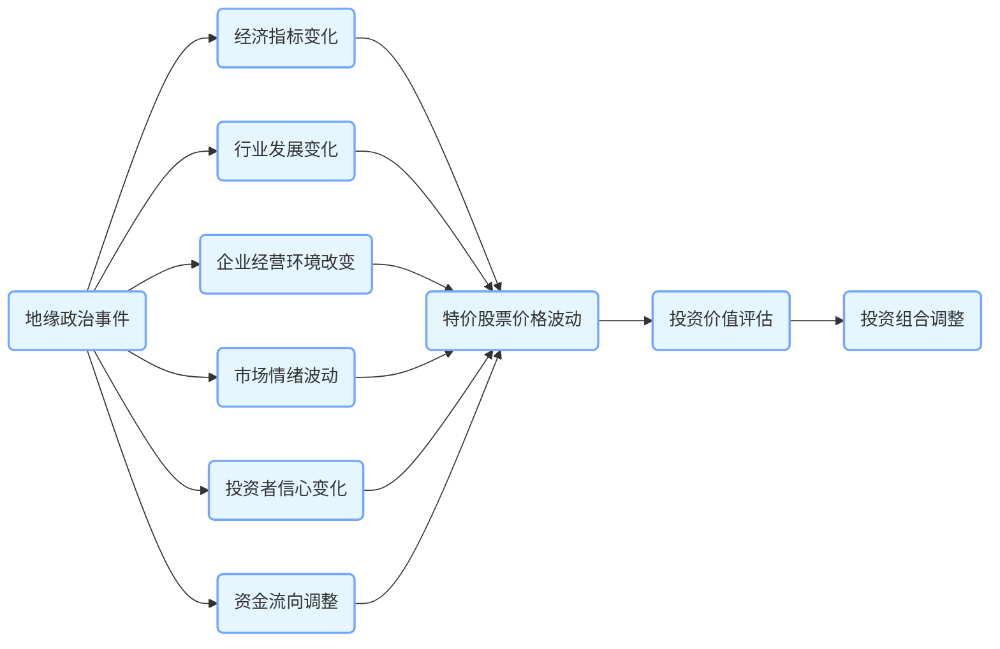

# 特价股票投资中的地缘政治风险动态评估策略

> 关键词：特价股票投资、地缘政治风险、动态评估策略、风险量化、投资决策

> 摘要：本文聚焦于特价股票投资领域，深入探讨地缘政治风险动态评估策略。地缘政治因素对特价股票投资的影响愈发显著，如何有效评估这些风险并制定相应策略成为投资者关注的焦点。文章首先介绍了研究的背景、目的、预期读者等内容，接着阐述了地缘政治风险与特价股票投资相关的核心概念及联系，详细讲解了核心算法原理和具体操作步骤，引入数学模型和公式进行量化分析，通过项目实战展示代码实现和解读，探讨了实际应用场景，推荐了相关工具和资源，最后总结了未来发展趋势与挑战，并对常见问题进行解答，为投资者在特价股票投资中应对地缘政治风险提供全面而深入的指导。

## 1. 背景介绍 
### 1.1 目的和范围
在全球金融市场中，特价股票投资以其潜在的高回报率吸引着众多投资者。然而，地缘政治风险作为一种不可忽视的外部因素，时刻影响着特价股票的价格波动和投资回报。本研究的目的在于构建一套科学有效的地缘政治风险动态评估策略，帮助投资者更好地识别、量化和应对这些风险，从而优化特价股票投资决策。研究范围涵盖了各类地缘政治事件，包括但不限于战争冲突、贸易摩擦、政治动荡等对特价股票市场的影响，以及如何通过动态评估及时调整投资组合。

### 1.2 预期读者
本文的预期读者主要包括专业的股票投资者、金融分析师、投资顾问以及对地缘政治与金融市场关系感兴趣的研究人员。对于投资者而言，掌握地缘政治风险动态评估策略有助于提高投资决策的科学性和准确性；金融分析师可以将此策略应用于市场研究和报告撰写；投资顾问则可以为客户提供更专业的投资建议；研究人员可以在此基础上开展进一步的学术研究。

### 1.3 文档结构概述
本文共分为十个部分。第一部分为背景介绍，阐述研究的目的、范围、预期读者和文档结构；第二部分介绍地缘政治风险与特价股票投资的核心概念及联系，并通过文本示意图和 Mermaid 流程图进行直观展示；第三部分详细讲解核心算法原理和具体操作步骤，结合 Python 源代码进行说明；第四部分引入数学模型和公式，对地缘政治风险进行量化分析，并举例说明；第五部分通过项目实战，展示代码实际案例和详细解释；第六部分探讨地缘政治风险动态评估策略在实际投资中的应用场景；第七部分推荐相关的学习资源、开发工具框架和论文著作；第八部分总结未来发展趋势与挑战；第九部分为附录，解答常见问题；第十部分提供扩展阅读和参考资料。

### 1.4 术语表
#### 1.4.1 核心术语定义
- **特价股票**：指市场价格相对其内在价值较低的股票，通常由于市场情绪、行业困境或短期负面事件等因素导致。
- **地缘政治风险**：由地理位置、政治格局、国际关系等因素引发的不确定性，可能对经济、金融市场产生重大影响。
- **动态评估策略**：一种实时或定期根据最新信息对风险进行评估和调整的方法，以适应不断变化的市场环境。

#### 1.4.2 相关概念解释
- **风险量化**：将地缘政治风险转化为具体的数值或指标，以便进行比较和分析。
- **投资组合优化**：根据风险评估结果，调整投资组合中各类资产的比例，以实现风险和收益的平衡。

#### 1.4.3 缩略词列表
- **GDP**：国内生产总值（Gross Domestic Product）
- **CPI**：消费者物价指数（Consumer Price Index）
- **P/E**：市盈率（Price-to-Earnings Ratio）

## 2. 核心概念与联系 
### 核心概念原理
地缘政治风险对特价股票投资的影响是多方面的。从宏观层面看，地缘政治事件可能导致全球经济增长放缓、贸易受阻、汇率波动等，进而影响整个股票市场的表现。对于特价股票而言，由于其本身的脆弱性，更容易受到地缘政治风险的冲击。例如，一场战争冲突可能导致相关地区的企业生产停滞、供应链中断，使得该地区的特价股票价格大幅下跌。

另一方面，地缘政治风险也可能为特价股票投资带来机会。某些地缘政治事件可能引发市场恐慌，导致部分股票价格过度下跌，形成特价股票。如果投资者能够准确评估风险，抓住这些机会，在风险释放后可能获得较高的回报。

### 架构的文本示意图
```plaintext
地缘政治事件
|
|-- 直接影响
|   |-- 经济指标变化（GDP、CPI 等）
|   |-- 行业发展受阻或机遇
|   |-- 企业经营环境改变
|
|-- 间接影响
|   |-- 市场情绪波动
|   |-- 投资者信心变化
|   |-- 资金流向调整
|
|-- 对特价股票的影响
|   |-- 价格波动
|   |-- 投资价值变化
|   |-- 投资组合风险调整
```

### Mermaid 流程图


## 3. 核心算法原理 & 具体操作步骤 
### 核心算法原理
我们采用基于机器学习的风险评估算法，主要是使用支持向量机（SVM）来对地缘政治风险进行分类和量化。SVM 是一种强大的分类算法，它通过寻找最优的超平面将不同类别的数据分开。在我们的应用中，我们将地缘政治事件分为不同的风险等级，如低风险、中风险和高风险，并使用历史数据对 SVM 模型进行训练。

### 具体操作步骤
1. **数据收集**：收集历史地缘政治事件数据，包括事件的类型、发生时间、影响范围等，以及相应时间段内特价股票的价格数据。
2. **数据预处理**：对收集到的数据进行清洗、归一化等处理，以提高模型的训练效果。
3. **特征提取**：从地缘政治事件数据中提取相关特征，如事件的严重程度、持续时间等，作为 SVM 模型的输入。
4. **模型训练**：使用预处理后的数据对 SVM 模型进行训练，调整模型参数以达到最优性能。
5. **风险评估**：将新的地缘政治事件数据输入到训练好的模型中，得到风险等级预测结果。
6. **投资决策调整**：根据风险评估结果，调整特价股票投资组合。

### Python 源代码实现
```python
import numpy as np
from sklearn import svm
from sklearn.preprocessing import StandardScaler
from sklearn.model_selection import train_test_split

# 示例数据收集和预处理
# 假设 X 是地缘政治事件特征矩阵，y 是对应的风险等级标签
X = np.random.rand(100, 5)  # 100 个样本，每个样本有 5 个特征
y = np.random.randint(0, 3, 100)  # 风险等级分为 0, 1, 2 三类

# 数据标准化
scaler = StandardScaler()
X_scaled = scaler.fit_transform(X)

# 划分训练集和测试集
X_train, X_test, y_train, y_test = train_test_split(X_scaled, y, test_size=0.2, random_state=42)

# 创建 SVM 模型
clf = svm.SVC(kernel='linear')

# 模型训练
clf.fit(X_train, y_train)

# 模型评估
accuracy = clf.score(X_test, y_test)
print(f"模型准确率: {accuracy}")

# 新数据预测
new_data = np.random.rand(1, 5)
new_data_scaled = scaler.transform(new_data)
predicted_risk = clf.predict(new_data_scaled)
print(f"预测的风险等级: {predicted_risk[0]}")
```

## 4. 数学模型和公式 & 详细讲解 & 举例说明 
### 数学模型和公式
在支持向量机（SVM）中，核心的数学模型是寻找一个最优超平面来划分不同类别的数据。对于线性可分的数据，超平面的方程可以表示为：

$$w^T x + b = 0$$

其中，$w$ 是超平面的法向量，$x$ 是数据点，$b$ 是偏置项。SVM 的目标是找到一组 $w$ 和 $b$，使得不同类别的数据点到超平面的间隔最大。这个间隔可以表示为：

$$\frac{2}{\|w\|}$$

为了最大化间隔，我们需要求解以下优化问题：

$$\min_{w, b} \frac{1}{2} \|w\|^2$$

约束条件为：

$$y_i (w^T x_i + b) \geq 1, \quad i = 1, 2, \cdots, n$$

其中，$y_i$ 是数据点 $x_i$ 的类别标签（$y_i \in \{-1, 1\}$），$n$ 是数据点的数量。

对于线性不可分的数据，我们引入松弛变量 $\xi_i$ 来允许一些数据点违反间隔约束：

$$\min_{w, b, \xi} \frac{1}{2} \|w\|^2 + C \sum_{i=1}^{n} \xi_i$$

约束条件为：

$$y_i (w^T x_i + b) \geq 1 - \xi_i, \quad \xi_i \geq 0, \quad i = 1, 2, \cdots, n$$

其中，$C$ 是惩罚参数，用于平衡间隔最大化和分类误差最小化。

### 详细讲解
上述优化问题可以通过拉格朗日乘子法转化为对偶问题进行求解。求解对偶问题得到拉格朗日乘子 $\alpha_i$，然后可以计算出 $w$ 和 $b$ 的值。对于新的数据点 $x$，其分类结果可以通过以下公式判断：

$$\text{sign}(w^T x + b) = \text{sign}\left(\sum_{i=1}^{n} \alpha_i y_i x_i^T x + b\right)$$

### 举例说明
假设我们有两个类别的数据点，分别用红色和蓝色表示。我们的目标是找到一个超平面将这两类数据分开。通过求解 SVM 的优化问题，我们可以得到最优超平面的参数 $w$ 和 $b$。对于一个新的数据点，我们将其代入上述分类公式中，如果结果为正，则将其分类为红色类别；如果结果为负，则将其分类为蓝色类别。

在特价股票投资中，我们可以将不同风险等级的地缘政治事件看作不同类别的数据点，通过 SVM 模型找到一个超平面来划分这些风险等级。对于新的地缘政治事件，我们可以根据其特征计算出分类结果，即风险等级。

## 5. 项目实战：代码实际案例和详细解释说明 
### 5.1  开发环境搭建
为了实现地缘政治风险动态评估策略，我们需要搭建以下开发环境：
- **Python 环境**：建议使用 Python 3.7 及以上版本。可以从 Python 官方网站（https://www.python.org/downloads/）下载安装。
- **开发工具**：推荐使用 Jupyter Notebook 或 PyCharm 等集成开发环境。
- **必要的库**：安装 `numpy`、`pandas`、`scikit-learn` 等库，可以使用以下命令进行安装：
```bash
pip install numpy pandas scikit-learn
```

### 5.2  源代码详细实现和代码解读
```python
import numpy as np
import pandas as pd
from sklearn import svm
from sklearn.preprocessing import StandardScaler
from sklearn.model_selection import train_test_split

# 读取数据
data = pd.read_csv('geopolitical_risk_data.csv')

# 提取特征和标签
X = data.drop('risk_level', axis=1).values
y = data['risk_level'].values

# 数据标准化
scaler = StandardScaler()
X_scaled = scaler.fit_transform(X)

# 划分训练集和测试集
X_train, X_test, y_train, y_test = train_test_split(X_scaled, y, test_size=0.2, random_state=42)

# 创建 SVM 模型
clf = svm.SVC(kernel='rbf', C=1.0, gamma='scale')

# 模型训练
clf.fit(X_train, y_train)

# 模型评估
accuracy = clf.score(X_test, y_test)
print(f"模型准确率: {accuracy}")

# 新数据预测
new_data = np.random.rand(1, X.shape[1])
new_data_scaled = scaler.transform(new_data)
predicted_risk = clf.predict(new_data_scaled)
print(f"预测的风险等级: {predicted_risk[0]}")
```

### 代码解读与分析
1. **数据读取**：使用 `pandas` 库的 `read_csv` 函数读取存储地缘政治风险数据的 CSV 文件。
2. **特征提取和标签分离**：将数据集中除 `risk_level` 列以外的其他列作为特征矩阵 $X$，将 `risk_level` 列作为标签向量 $y$。
3. **数据标准化**：使用 `StandardScaler` 对特征矩阵进行标准化处理，使得每个特征的均值为 0，标准差为 1，以提高模型的训练效果。
4. **划分训练集和测试集**：使用 `train_test_split` 函数将数据集划分为训练集和测试集，测试集占总数据集的 20%。
5. **创建 SVM 模型**：使用 `svm.SVC` 函数创建一个基于径向基函数（RBF）的 SVM 模型，设置惩罚参数 $C$ 为 1.0，核系数 $\gamma$ 为 `scale`。
6. **模型训练**：使用训练集数据对 SVM 模型进行训练。
7. **模型评估**：使用测试集数据评估模型的准确率。
8. **新数据预测**：生成一个随机的新数据点，对其进行标准化处理后输入到训练好的模型中，得到预测的风险等级。

## 6. 实际应用场景 
### 投资组合调整
投资者可以根据地缘政治风险动态评估结果及时调整特价股票投资组合。当评估结果显示地缘政治风险较高时，减少特价股票的持仓比例，增加现金或避险资产的配置；当风险较低时，可以适当增加特价股票的投资。

### 短期交易策略
在短期交易中，地缘政治事件可能引发市场的剧烈波动。投资者可以利用动态评估策略捕捉这些波动带来的交易机会。例如，在风险事件发生前提前布局，在风险释放后及时获利了结。

### 长期投资决策
对于长期投资者而言，地缘政治风险动态评估可以帮助他们筛选出受地缘政治风险影响较小的特价股票，构建更稳健的投资组合。同时，也可以关注那些在风险事件中具有较强抗风险能力的企业，长期持有以获取稳定的回报。

### 风险管理
金融机构和投资顾问可以将地缘政治风险动态评估策略应用于风险管理中。通过对客户投资组合的风险评估，为客户提供个性化的风险管理建议，降低客户的投资风险。

## 7. 工具和资源推荐
### 7.1 学习资源推荐
#### 7.1.1 书籍推荐
- 《金融市场学》：全面介绍金融市场的基本概念、运行机制和投资策略，为理解特价股票投资和地缘政治风险提供理论基础。
- 《机器学习实战》：通过实际案例详细讲解机器学习算法的原理和应用，有助于深入理解支持向量机等核心算法。
- 《地缘政治学：过去、现在和未来》：系统阐述地缘政治的基本理论和发展历程，帮助读者了解地缘政治事件的背景和影响。

#### 7.1.2 在线课程
- Coursera 上的“机器学习”课程：由斯坦福大学教授 Andrew Ng 授课，是学习机器学习的经典课程。
- edX 上的“金融市场分析”课程：提供金融市场分析的专业知识和技能培训。
- Udemy 上的“地缘政治与全球经济”课程：深入探讨地缘政治与全球经济的相互关系。

#### 7.1.3 技术博客和网站
- Medium：上面有许多关于金融科技、机器学习和地缘政治的优质文章。
- Seeking Alpha：专注于金融市场分析和投资研究，提供大量的股票分析和投资建议。
- Geopolitical Futures：专门研究地缘政治的网站，提供地缘政治事件的实时分析和预测。

### 7.2 开发工具框架推荐
#### 7.2.1 IDE和编辑器
- Jupyter Notebook：交互式的开发环境，适合进行数据探索和模型训练。
- PyCharm：功能强大的 Python 集成开发环境，提供代码编辑、调试、版本控制等功能。
- Visual Studio Code：轻量级的代码编辑器，支持多种编程语言和插件扩展。

#### 7.2.2 调试和性能分析工具
- `pdb`：Python 自带的调试工具，用于调试 Python 代码。
- `scikit-learn` 中的 `cross_val_score` 函数：用于模型性能评估和交叉验证。
- `TensorBoard`：用于可视化深度学习模型的训练过程和性能指标。

#### 7.2.3 相关框架和库
- `numpy`：用于数值计算和数组操作。
- `pandas`：用于数据处理和分析。
- `scikit-learn`：提供丰富的机器学习算法和工具。
- `Keras`：简单易用的深度学习框架，可用于构建复杂的模型。

### 7.3 相关论文著作推荐
#### 7.3.1 经典论文
- "The Nature of Statistical Learning Theory" by Vladimir N. Vapnik：支持向量机理论的经典著作，深入阐述了统计学习的基本原理。
- "Geopolitical Risk and Asset Prices" by Dario Caldara and Matteo Iacoviello：研究地缘政治风险对资产价格影响的重要论文。

#### 7.3.2 最新研究成果
- 关注《Journal of Financial Economics》、《Review of Financial Studies》等金融领域顶级期刊，获取地缘政治风险与金融市场相关的最新研究成果。

#### 7.3.3 应用案例分析
- 可以参考一些知名金融机构的研究报告，如摩根大通、高盛等，了解他们在特价股票投资中应对地缘政治风险的实际应用案例。

## 8. 总结：未来发展趋势与挑战
### 未来发展趋势
- **数据驱动的精细化评估**：随着数据收集技术的不断发展和数据量的增加，地缘政治风险动态评估将更加精细化。可以利用更多的数据源，如社交媒体数据、卫星图像数据等，更全面地评估地缘政治事件的影响。
- **人工智能与机器学习的深度融合**：人工智能和机器学习技术将在风险评估中发挥更加重要的作用。除了支持向量机，还可以应用深度学习、强化学习等算法，提高评估的准确性和效率。
- **跨领域研究的加强**：地缘政治风险评估涉及政治学、经济学、金融学等多个领域，未来将加强跨领域研究，整合不同领域的知识和方法，构建更完善的评估体系。

### 挑战
- **数据质量和获取难度**：地缘政治数据的质量参差不齐，且部分数据获取难度较大。如何获取准确、及时、全面的数据是一个挑战。
- **模型的可解释性**：一些复杂的机器学习模型，如深度学习模型，虽然具有较高的预测准确率，但模型的可解释性较差。在投资决策中，投资者需要了解模型的决策依据，因此提高模型的可解释性是一个重要的挑战。
- **地缘政治事件的不确定性**：地缘政治事件具有高度的不确定性，很难准确预测事件的发生和发展。如何在不确定性环境下进行有效的风险评估和投资决策是一个长期的挑战。

## 9. 附录：常见问题与解答
### 1. 地缘政治风险动态评估策略是否适用于所有类型的特价股票？
地缘政治风险动态评估策略适用于大多数类型的特价股票，但不同行业和企业受到地缘政治风险的影响程度可能不同。例如，能源、航空等行业对地缘政治事件较为敏感，而一些内需型的消费行业相对受影响较小。在应用该策略时，需要结合具体行业和企业的特点进行分析。

### 2. 如何判断模型的预测结果是否可靠？
可以通过以下几种方式判断模型的预测结果是否可靠：
- **交叉验证**：使用交叉验证技术评估模型的性能，如 k 折交叉验证，计算模型在不同数据集上的准确率、召回率等指标。
- **与历史数据对比**：将模型的预测结果与历史数据进行对比，观察模型在历史事件中的表现。
- **专家评估**：结合专家的意见和经验，对模型的预测结果进行评估和验证。

### 3. 地缘政治风险动态评估策略需要多长时间更新一次？
更新频率取决于地缘政治事件的发生频率和市场变化情况。一般来说，可以定期（如每月或每季度）对模型进行更新和评估，同时在重大地缘政治事件发生后及时进行调整。

### 4. 如何处理地缘政治数据中的噪声和异常值？
可以采用以下方法处理地缘政治数据中的噪声和异常值：
- **数据清洗**：删除明显错误或不合理的数据点。
- **平滑处理**：使用移动平均、指数平滑等方法对数据进行平滑处理，减少噪声的影响。
- **异常值检测**：使用统计方法或机器学习算法检测异常值，并根据具体情况进行处理，如替换或删除。

## 10. 扩展阅读 & 参考资料
### 扩展阅读
- 《黑天鹅：如何应对不可预知的未来》：探讨了不确定性事件对金融市场的影响，为投资者应对地缘政治风险提供了新的视角。
- 《反脆弱：从不确定性中获益》：介绍了如何在不确定性环境中使投资组合更加稳健，增强反脆弱能力。

### 参考资料
- 相关的金融数据库，如 Bloomberg、Wind 等，提供了丰富的金融市场数据和地缘政治事件信息。
- 各国政府和国际组织发布的报告和统计数据，如世界银行、国际货币基金组织等。

作者：AI天才研究院/AI Genius Institute & 禅与计算机程序设计艺术 /Zen And The Art of Computer Programming