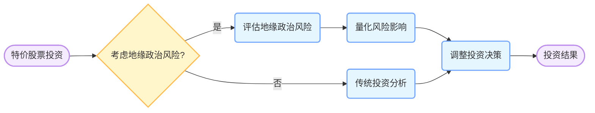

# 特价股票投资中的地缘政治风险评估

> 关键词：特价股票投资、地缘政治风险评估、风险量化、投资决策、经济影响

> 摘要：本文聚焦于特价股票投资中地缘政治风险评估这一关键问题。首先介绍了研究的背景、目的、预期读者和文档结构，明确了核心术语。接着阐述了特价股票投资和地缘政治风险的核心概念及其联系，并给出相应的示意图和流程图。详细讲解了用于评估地缘政治风险的核心算法原理，包括使用 Python 代码实现的具体操作步骤。通过数学模型和公式对风险进行量化，并举例说明。结合项目实战，展示了开发环境搭建、源代码实现及解读。分析了地缘政治风险在特价股票投资中的实际应用场景。推荐了相关的学习资源、开发工具框架和论文著作。最后总结了未来发展趋势与挑战，解答了常见问题，并提供了扩展阅读和参考资料，旨在为投资者在特价股票投资中准确评估地缘政治风险提供全面、专业的指导。

## 1. 背景介绍 
### 1.1 目的和范围
在金融投资领域，特价股票往往因其价格相对较低而吸引众多投资者。然而，特价股票投资面临着诸多风险，其中地缘政治风险是一个不可忽视的重要因素。地缘政治事件的发生可能会对特定地区的经济、企业经营产生重大影响，进而影响特价股票的价值。本文的目的在于深入探讨如何在特价股票投资中准确评估地缘政治风险，为投资者提供科学的评估方法和决策依据。

本文的范围涵盖了地缘政治风险的定义、量化方法，以及如何将这些风险因素纳入特价股票投资决策的过程。通过理论分析和实际案例相结合，旨在为投资者提供一套全面、系统的地缘政治风险评估体系。

### 1.2 预期读者
本文的预期读者主要包括对特价股票投资感兴趣的个人投资者、金融机构的投资经理、金融分析师以及相关领域的研究人员。对于个人投资者，本文可以帮助他们在投资特价股票时更加理性地考虑地缘政治风险因素；对于金融机构的专业人士，本文提供的评估方法和模型可以为他们的投资决策提供参考；对于研究人员，本文可以为相关领域的研究提供新的思路和方法。

### 1.3 文档结构概述
本文将按照以下结构展开：首先介绍特价股票投资和地缘政治风险的核心概念及其联系，通过示意图和流程图帮助读者更好地理解；接着详细讲解用于评估地缘政治风险的核心算法原理，并给出 Python 代码实现的具体操作步骤；然后通过数学模型和公式对风险进行量化，并举例说明；结合项目实战，展示开发环境搭建、源代码实现及解读；分析地缘政治风险在特价股票投资中的实际应用场景；推荐相关的学习资源、开发工具框架和论文著作；最后总结未来发展趋势与挑战，解答常见问题，并提供扩展阅读和参考资料。

### 1.4 术语表
#### 1.4.1 核心术语定义
- **特价股票**：指价格相对较低，通常由于公司业绩不佳、市场负面消息或行业整体低迷等原因导致股价被低估的股票。
- **地缘政治风险**：指由于地理位置、政治格局、国际关系等因素引发的政治不稳定、冲突、政策变化等事件，对经济和金融市场产生的不确定性和潜在负面影响。
- **风险评估**：指对特定风险事件发生的可能性及其可能造成的影响进行分析和量化的过程。

#### 1.4.2 相关概念解释
- **政治不稳定**：包括政府更迭、政治动荡、社会骚乱等情况，这些因素可能导致政策的不确定性增加，影响企业的经营环境。
- **贸易摩擦**：国家之间在贸易政策、关税、市场准入等方面存在的争议和冲突，可能对相关企业的进出口业务和市场份额产生不利影响。
- **制裁措施**：一国或国际组织对另一国实施的经济、贸易、金融等方面的限制措施，可能导致被制裁国家的企业面临经营困难，股价下跌。

#### 1.4.3 缩略词列表
- **GDP**：国内生产总值（Gross Domestic Product）
- **CPI**：消费者物价指数（Consumer Price Index）
- **FDI**：外国直接投资（Foreign Direct Investment）

## 2. 核心概念与联系 

### 2.1 核心概念原理
#### 2.1.1 特价股票投资
特价股票投资的核心原理是基于价值投资理念，即认为市场有时会对某些股票的价值做出错误的评估，导致股价低于其内在价值。投资者通过深入研究公司的基本面、行业前景等因素，寻找被低估的特价股票，在股价回归其内在价值时获得投资收益。然而，特价股票往往伴随着较高的风险，其中地缘政治风险是一个重要的影响因素。

#### 2.1.2 地缘政治风险
地缘政治风险源于国家之间或地区之间的政治、经济、军事等方面的相互关系。政治不稳定、贸易摩擦、制裁措施等地缘政治事件可能导致市场信心下降、汇率波动、原材料供应中断等问题，进而影响企业的经营业绩和股票价格。例如，贸易摩擦可能导致企业的出口受阻，成本上升，利润下降；制裁措施可能限制企业的海外市场拓展和融资渠道。

### 2.2 核心概念联系
特价股票投资和地缘政治风险之间存在着密切的联系。地缘政治风险可能导致某些地区的经济环境恶化，企业经营困难，从而使这些地区的特价股票面临更大的下行风险。另一方面，地缘政治事件也可能为某些特价股票带来投资机会，例如在贸易摩擦中，一些具有替代进口能力的企业可能会受益，其股价可能会上涨。因此，投资者在进行特价股票投资时，需要充分考虑地缘政治风险因素，准确评估其对股票价值的影响。

### 2.3 文本示意图
```plaintext
特价股票投资
    |
    | 受地缘政治风险影响
    V
地缘政治风险
    |
    | 包括多种风险因素
    V
政治不稳定、贸易摩擦、制裁措施等
```

### 2.4 Mermaid 流程图


## 3. 核心算法原理 & 具体操作步骤 

### 3.1 核心算法原理
为了评估特价股票投资中的地缘政治风险，我们可以采用多因素分析法。该方法将地缘政治风险分解为多个具体的风险因素，如政治稳定性、贸易政策、制裁措施等，并为每个因素赋予相应的权重。然后，通过对每个因素进行评分，计算出综合的地缘政治风险得分。最后，根据风险得分调整特价股票的投资价值评估。

### 3.2 具体操作步骤

#### 3.2.1 确定风险因素和权重
首先，我们需要确定影响特价股票投资的地缘政治风险因素。常见的风险因素包括政治稳定性、贸易政策、制裁措施、地区冲突等。然后，根据这些因素对特价股票投资的影响程度，为每个因素赋予相应的权重。例如，我们可以设定政治稳定性的权重为 0.3，贸易政策的权重为 0.2，制裁措施的权重为 0.2，地区冲突的权重为 0.3。

#### 3.2.2 对每个因素进行评分
接下来，我们需要对每个风险因素进行评分。评分可以采用定性和定量相结合的方法。例如，对于政治稳定性因素，我们可以根据政府的支持率、政治事件的发生率等指标进行评分；对于贸易政策因素，我们可以根据关税税率、贸易协定的变化等指标进行评分。评分范围可以设定为 1 - 5 分，分数越高表示风险越大。

#### 3.2.3 计算综合风险得分
根据每个因素的评分和权重，我们可以计算出综合的地缘政治风险得分。计算公式如下：

$$RiskScore = \sum_{i=1}^{n} w_i \times s_i$$

其中，$RiskScore$ 表示综合风险得分，$w_i$ 表示第 $i$ 个风险因素的权重，$s_i$ 表示第 $i$ 个风险因素的评分，$n$ 表示风险因素的数量。

#### 3.2.4 调整投资价值评估
最后，根据综合风险得分调整特价股票的投资价值评估。例如，我们可以设定一个风险调整系数，根据风险得分确定调整系数的大小。然后，将调整系数应用到特价股票的估值模型中，得到调整后的投资价值。

### 3.3 Python 代码实现

```python
# 定义风险因素和权重
risk_factors = ['政治稳定性', '贸易政策', '制裁措施', '地区冲突']
weights = [0.3, 0.2, 0.2, 0.3]

# 输入每个因素的评分
scores = []
for factor in risk_factors:
    score = float(input(f"请输入 {factor} 的评分 (1 - 5): "))
    scores.append(score)

# 计算综合风险得分
risk_score = sum([weights[i] * scores[i] for i in range(len(risk_factors))])

# 输出综合风险得分
print(f"综合地缘政治风险得分: {risk_score}")

# 定义风险调整系数函数
def risk_adjustment_coefficient(risk_score):
    if risk_score < 2:
        return 0.9
    elif risk_score < 3:
        return 0.8
    elif risk_score < 4:
        return 0.7
    else:
        return 0.6

# 计算风险调整系数
adjustment_coefficient = risk_adjustment_coefficient(risk_score)

# 假设原始投资价值为 100
original_value = 100
adjusted_value = original_value * adjustment_coefficient

# 输出调整后的投资价值
print(f"调整后的投资价值: {adjusted_value}")
```

### 3.4 代码解释
- 首先，我们定义了风险因素和相应的权重。
- 然后，通过用户输入获取每个因素的评分。
- 接着，使用列表推导式计算综合风险得分。
- 定义了一个风险调整系数函数，根据风险得分确定调整系数。
- 最后，假设原始投资价值为 100，计算并输出调整后的投资价值。

## 4. 数学模型和公式 & 详细讲解 & 举例说明 

### 4.1 数学模型和公式
#### 4.1.1 综合风险得分计算公式
如前文所述，综合地缘政治风险得分的计算公式为：

$$RiskScore = \sum_{i=1}^{n} w_i \times s_i$$

其中，$RiskScore$ 表示综合风险得分，$w_i$ 表示第 $i$ 个风险因素的权重，$s_i$ 表示第 $i$ 个风险因素的评分，$n$ 表示风险因素的数量。

#### 4.1.2 风险调整系数函数
我们可以根据风险得分定义一个风险调整系数函数，例如：

$$AdjustmentCoefficient = 
\begin{cases}
0.9, & RiskScore < 2 \\
0.8, & 2 \leq RiskScore < 3 \\
0.7, & 3 \leq RiskScore < 4 \\
0.6, & RiskScore \geq 4
\end{cases}$$

#### 4.1.3 调整后的投资价值计算公式
调整后的投资价值计算公式为：

$$AdjustedValue = OriginalValue \times AdjustmentCoefficient$$

其中，$AdjustedValue$ 表示调整后的投资价值，$OriginalValue$ 表示原始投资价值，$AdjustmentCoefficient$ 表示风险调整系数。

### 4.2 详细讲解
- **综合风险得分计算公式**：该公式通过对每个风险因素的评分进行加权求和，得到综合的地缘政治风险得分。权重的设置反映了每个因素对特价股票投资的相对重要性。评分的高低表示该因素所带来的风险程度。
- **风险调整系数函数**：该函数根据综合风险得分确定风险调整系数。风险得分越高，调整系数越低，说明地缘政治风险对投资价值的影响越大。
- **调整后的投资价值计算公式**：该公式将风险调整系数应用到原始投资价值上，得到调整后的投资价值。调整后的投资价值更能反映地缘政治风险对特价股票投资的影响。

### 4.3 举例说明
假设我们有三个风险因素：政治稳定性、贸易政策、制裁措施，其权重分别为 0.3、0.2、0.5。每个因素的评分分别为 3、2、4。

首先，计算综合风险得分：

$$RiskScore = 0.3 \times 3 + 0.2 \times 2 + 0.5 \times 4 = 0.9 + 0.4 + 2 = 3.3$$

然后，根据风险调整系数函数，由于 $3 \leq RiskScore < 4$，调整系数为 0.7。

假设原始投资价值为 200，计算调整后的投资价值：

$$AdjustedValue = 200 \times 0.7 = 140$$

这表明，考虑到地缘政治风险因素后，该特价股票的投资价值从 200 调整为 140。

## 5. 项目实战：代码实际案例和详细解释说明 

### 5.1 开发环境搭建
#### 5.1.1 安装 Python
首先，需要安装 Python 编程语言。可以从 Python 官方网站（https://www.python.org/downloads/）下载适合自己操作系统的 Python 安装包，并按照安装向导进行安装。

#### 5.1.2 安装必要的库
在本项目中，我们只使用了 Python 的内置库，无需安装额外的库。如果需要进行数据处理、可视化等操作，可以安装 Pandas、Matplotlib 等库。安装命令如下：

```sh
pip install pandas matplotlib
```

### 5.2 源代码详细实现和代码解读
```python
# 定义风险因素和权重
risk_factors = ['政治稳定性', '贸易政策', '制裁措施', '地区冲突']
weights = [0.3, 0.2, 0.2, 0.3]

# 输入每个因素的评分
scores = []
for factor in risk_factors:
    score = float(input(f"请输入 {factor} 的评分 (1 - 5): "))
    scores.append(score)

# 计算综合风险得分
risk_score = sum([weights[i] * scores[i] for i in range(len(risk_factors))])

# 输出综合风险得分
print(f"综合地缘政治风险得分: {risk_score}")

# 定义风险调整系数函数
def risk_adjustment_coefficient(risk_score):
    if risk_score < 2:
        return 0.9
    elif risk_score < 3:
        return 0.8
    elif risk_score < 4:
        return 0.7
    else:
        return 0.6

# 计算风险调整系数
adjustment_coefficient = risk_adjustment_coefficient(risk_score)

# 假设原始投资价值为 100
original_value = 100
adjusted_value = original_value * adjustment_coefficient

# 输出调整后的投资价值
print(f"调整后的投资价值: {adjusted_value}")
```

#### 5.2.1 代码功能概述
该代码实现了一个简单的地缘政治风险评估系统，通过输入每个风险因素的评分，计算综合风险得分，并根据风险得分调整特价股票的投资价值。

#### 5.2.2 代码详细解读
- **定义风险因素和权重**：使用列表 `risk_factors` 存储风险因素的名称，使用列表 `weights` 存储相应的权重。
- **输入每个因素的评分**：使用 `for` 循环遍历每个风险因素，通过 `input` 函数获取用户输入的评分，并将其转换为浮点数后添加到列表 `scores` 中。
- **计算综合风险得分**：使用列表推导式和 `sum` 函数计算综合风险得分。
- **输出综合风险得分**：使用 `print` 函数输出综合风险得分。
- **定义风险调整系数函数**：定义一个函数 `risk_adjustment_coefficient`，根据风险得分返回相应的风险调整系数。
- **计算风险调整系数**：调用 `risk_adjustment_coefficient` 函数计算风险调整系数。
- **计算调整后的投资价值**：假设原始投资价值为 100，将其乘以风险调整系数得到调整后的投资价值。
- **输出调整后的投资价值**：使用 `print` 函数输出调整后的投资价值。

### 5.3 代码解读与分析
#### 5.3.1 优点
- **简单易懂**：代码结构清晰，逻辑简单，易于理解和实现。
- **可扩展性**：可以方便地添加或修改风险因素和权重，以适应不同的投资场景。
- **灵活性**：风险调整系数函数可以根据实际情况进行调整，以更准确地反映地缘政治风险对投资价值的影响。

#### 5.3.2 缺点
- **评分主观性**：每个风险因素的评分依赖于用户的主观判断，可能存在一定的误差。
- **缺乏数据支持**：代码中没有考虑实际的经济数据和市场信息，评估结果可能不够准确。
- **局限性**：该方法只考虑了地缘政治风险因素，没有考虑其他因素对特价股票投资的影响。

## 6. 实际应用场景 
### 6.1 国际投资
在进行国际特价股票投资时，投资者需要考虑不同国家和地区的地缘政治风险。例如，在投资新兴市场的特价股票时，政治不稳定、贸易政策变化等地缘政治风险可能会对投资收益产生重大影响。通过对地缘政治风险进行评估，投资者可以选择风险相对较低的国家和地区进行投资，或者采取相应的风险管理措施，如分散投资、套期保值等。

### 6.2 行业投资
某些行业对地缘政治风险更为敏感，如能源、金融、航空等行业。在投资这些行业的特价股票时，投资者需要重点关注地缘政治风险因素。例如，贸易摩擦可能会影响能源行业的进出口业务，制裁措施可能会限制金融机构的海外业务拓展。通过评估地缘政治风险，投资者可以更好地把握行业发展趋势，选择具有投资价值的特价股票。

### 6.3 事件驱动投资
当地缘政治事件发生时，如战争、选举、贸易谈判等，可能会引发市场的波动，为投资者带来投资机会。通过对地缘政治风险进行评估，投资者可以提前预测事件对特价股票的影响，及时调整投资策略。例如，在贸易谈判期间，投资者可以关注相关行业的特价股票，根据谈判结果进行投资决策。

## 7. 工具和资源推荐
### 7.1 学习资源推荐
#### 7.1.1 书籍推荐
- 《金融市场学》：这本书全面介绍了金融市场的基本概念、理论和实践，对于理解特价股票投资和地缘政治风险评估具有重要的参考价值。
- 《地缘政治学：世界政治的地理学》：该书系统阐述了地缘政治的基本理论和分析方法，有助于投资者深入了解地缘政治风险的本质和影响。
- 《投资学》：涵盖了投资的基本原理、方法和策略，对于投资者掌握特价股票投资的技巧和方法具有重要的指导意义。

#### 7.1.2 在线课程
- Coursera 上的“Financial Markets”课程：由耶鲁大学教授罗伯特·席勒（Robert Shiller）主讲，介绍了金融市场的基本原理和投资策略。
- edX 上的“Geopolitics and International Relations”课程：帮助学习者了解地缘政治的基本概念和分析方法。
- Udemy 上的“Stock Market Investing for Beginners”课程：适合初学者学习股票投资的基础知识和技巧。

#### 7.1.3 技术博客和网站
- Seeking Alpha：提供了大量的金融市场分析和投资建议，包括特价股票投资和地缘政治风险评估的相关文章。
- Bloomberg：全球知名的财经媒体，提供实时的金融市场数据和地缘政治新闻，有助于投资者及时了解市场动态。
- Financial Times：英国著名的财经报纸，提供深入的金融市场分析和地缘政治评论。

### 7.2 开发工具框架推荐
#### 7.2.1 IDE和编辑器
- PyCharm：一款专业的 Python 集成开发环境，提供了丰富的代码编辑、调试和分析功能，适合开发地缘政治风险评估系统。
- Jupyter Notebook：一种交互式的开发环境，支持 Python 代码的编写、运行和可视化，方便进行数据分析和模型验证。
- Visual Studio Code：一款轻量级的代码编辑器，支持多种编程语言，具有丰富的插件扩展功能，可用于开发和调试 Python 代码。

#### 7.2.2 调试和性能分析工具
- pdb：Python 内置的调试工具，可以帮助开发者定位代码中的错误和问题。
- cProfile：Python 标准库中的性能分析工具，可以分析代码的运行时间和资源消耗情况，帮助开发者优化代码性能。
- Py-Spy：一个轻量级的 Python 性能分析工具，可以实时监控 Python 程序的运行状态，找出性能瓶颈。

#### 7.2.3 相关框架和库
- Pandas：一个强大的数据处理和分析库，提供了丰富的数据结构和函数，可用于处理和分析地缘政治风险数据。
- NumPy：Python 的科学计算基础库，提供了高效的数组操作和数学函数，可用于实现风险评估模型。
- Matplotlib：一个常用的 Python 绘图库，可用于可视化地缘政治风险数据和评估结果。

### 7.3 相关论文著作推荐
#### 7.3.1 经典论文
- “The Impact of Geopolitical Risks on Financial Markets”：该论文研究了地缘政治风险对金融市场的影响机制，为地缘政治风险评估提供了理论基础。
- “Geopolitical Risk and Stock Market Volatility”：探讨了地缘政治风险与股票市场波动率之间的关系，对于理解地缘政治风险对特价股票投资的影响具有重要意义。
- “Investment Decision - Making under Geopolitical Uncertainty”：研究了在地缘政治不确定性下的投资决策问题，提出了一些有效的投资策略和方法。

#### 7.3.2 最新研究成果
- 近年来，随着地缘政治形势的不断变化，关于地缘政治风险评估的研究也在不断深入。可以通过学术数据库，如 Web of Science、IEEE Xplore 等，搜索最新的研究成果。
- 一些知名的研究机构，如国际货币基金组织（IMF）、世界银行等，也会发布关于地缘政治风险对经济和金融市场影响的研究报告。

#### 7.3.3 应用案例分析
- 一些金融机构和投资公司会发布关于特价股票投资中地缘政治风险评估的应用案例分析报告。这些报告可以帮助投资者了解实际应用中的评估方法和决策过程，借鉴成功的经验和教训。

## 8. 总结：未来发展趋势与挑战
### 8.1 未来发展趋势
#### 8.1.1 数据驱动的风险评估
随着大数据和人工智能技术的不断发展，未来的地缘政治风险评估将更加依赖于数据驱动。通过收集和分析大量的地缘政治数据、经济数据和市场数据，利用机器学习和深度学习算法构建更加准确的风险评估模型。

#### 8.1.2 跨学科研究
地缘政治风险评估涉及到政治学、经济学、金融学等多个学科领域。未来的研究将更加注重跨学科的融合，综合运用不同学科的理论和方法，提高风险评估的准确性和可靠性。

#### 8.1.3 实时监测和预警
为了及时应对地缘政治风险，未来的评估系统将具备实时监测和预警功能。通过实时收集和分析地缘政治事件的信息，及时发现潜在的风险因素，并发出预警信号，帮助投资者做出及时的决策。

### 8.2 挑战
#### 8.2.1 数据质量和获取难度
地缘政治数据的质量和获取难度是影响风险评估准确性的重要因素。由于地缘政治事件的复杂性和不确定性，数据的准确性和完整性难以保证。此外，一些数据可能受到政治因素的影响，获取难度较大。

#### 8.2.2 模型的复杂性和可解释性
随着风险评估模型的不断发展，模型的复杂性也在增加。复杂的模型可能会提高评估的准确性，但也会降低模型的可解释性。投资者需要在模型的准确性和可解释性之间找到平衡。

#### 8.2.3 地缘政治形势的不确定性
地缘政治形势具有高度的不确定性，新的地缘政治事件随时可能发生。这给风险评估带来了很大的挑战，评估模型需要具备较强的适应性和灵活性，能够及时应对新的风险因素。

## 9. 附录：常见问题与解答
### 9.1 如何确定风险因素的权重？
确定风险因素的权重可以采用主观和客观相结合的方法。主观方法可以根据投资者的经验和判断，为每个风险因素赋予相应的权重。客观方法可以通过数据分析和统计方法，如主成分分析、层次分析法等，确定每个风险因素的相对重要性。

### 9.2 评分的准确性如何保证？
评分的准确性可以通过以下方法来保证：
- 参考权威的报告和数据：如国际组织、政府机构发布的地缘政治报告和经济数据。
- 多维度评估：从不同的角度对风险因素进行评估，综合考虑各种因素的影响。
- 专家意见：咨询相关领域的专家，获取他们的意见和建议。

### 9.3 风险调整系数如何调整？
风险调整系数可以根据实际情况进行调整。一般来说，可以根据历史数据和市场经验，确定不同风险得分对应的调整系数。在实际应用中，也可以根据投资者的风险偏好和投资目标，对调整系数进行适当的调整。

### 9.4 该评估方法是否适用于所有类型的特价股票？
该评估方法适用于大多数类型的特价股票，但对于一些特殊行业或特殊情况下的特价股票，可能需要进行适当的调整。例如，对于受政策影响较大的行业，如公用事业、军工等行业，需要重点考虑政策风险因素；对于受国际市场影响较大的行业，如能源、化工等行业，需要重点考虑贸易政策和国际形势的影响。

## 10. 扩展阅读 & 参考资料
### 10.1 扩展阅读
- 《全球政治与安全报告》：每年由中国社会科学院世界经济与政治研究所发布，对全球地缘政治形势进行全面的分析和预测。
- 《地缘政治与大国战略》：深入探讨了地缘政治与大国战略之间的关系，对于理解地缘政治风险的根源和影响具有重要的参考价值。
- 《金融风险管理》：系统介绍了金融风险管理的理论和方法，对于投资者掌握地缘政治风险的管理策略具有重要的指导意义。

### 10.2 参考资料
- 相关的学术论文和研究报告，如发表在《Journal of Financial Economics》、《Review of Financial Studies》等学术期刊上的论文。
- 金融机构和投资公司发布的研究报告和分析报告，如高盛、摩根士丹利等公司的报告。
- 政府机构和国际组织发布的统计数据和政策文件，如国家统计局、国际货币基金组织等发布的数据和文件。

作者：AI天才研究院/AI Genius Institute & 禅与计算机程序设计艺术 /Zen And The Art of Computer Programming