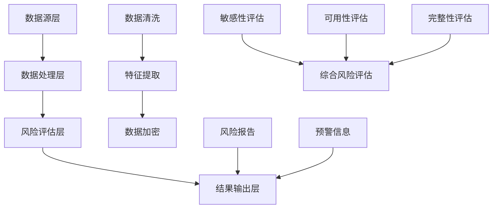

# 特价股票投资中的数据隐私风险评估方法

> 关键词：特价股票投资、数据隐私风险、风险评估方法、机器学习、数据安全

> 摘要：本文聚焦于特价股票投资领域的数据隐私风险评估方法。在当今数字化时代，股票投资数据的隐私保护至关重要。特价股票因其价格特点吸引众多投资者，然而在投资过程中涉及大量敏感数据，这些数据面临着各种隐私风险。文章将详细介绍数据隐私风险的核心概念，阐述相关评估算法原理及具体操作步骤，构建数学模型并进行公式推导与举例说明。通过实际项目案例，展示如何在开发环境中实现风险评估代码，并对代码进行解读与分析。同时，探讨该评估方法在实际应用场景中的作用，推荐相关学习资源、开发工具框架以及论文著作。最后总结未来发展趋势与挑战，为读者全面呈现特价股票投资中数据隐私风险评估的全貌。

## 1. 背景介绍 
### 1.1 目的和范围
在金融市场中，特价股票往往因其较低的价格吸引了众多投资者的关注。随着数字化技术的发展，股票投资活动越来越依赖于数据的收集、存储和分析。然而，这些数据包含了投资者的大量敏感信息，如个人身份、财务状况、交易记录等。数据隐私风险评估对于保护投资者的隐私和权益至关重要。本文的目的在于探讨适用于特价股票投资场景的数据隐私风险评估方法，范围涵盖从数据的获取、处理到存储的整个生命周期，旨在为投资者、金融机构和监管部门提供有效的风险评估工具和策略。

### 1.2 预期读者
本文预期读者包括金融领域的投资者、金融机构的管理人员和技术人员、数据安全专家以及相关监管部门的工作人员。对于投资者而言，了解数据隐私风险评估方法有助于他们在进行特价股票投资时更好地保护个人信息；金融机构的管理人员和技术人员可以借鉴本文的方法来完善自身的数据安全管理体系；数据安全专家可以从技术层面深入研究相关算法和模型；监管部门工作人员则可以依据本文的内容制定更合理的监管政策。

### 1.3 文档结构概述
本文将按照以下结构进行组织：首先介绍核心概念与联系，明确数据隐私风险在特价股票投资中的定义和相关架构；接着阐述核心算法原理和具体操作步骤，通过Python代码详细展示评估过程；然后构建数学模型并进行公式推导和举例说明；再通过项目实战，介绍开发环境搭建、源代码实现和代码解读；之后探讨实际应用场景；推荐相关的工具和资源；最后总结未来发展趋势与挑战，并提供常见问题解答和扩展阅读参考资料。

### 1.4 术语表
#### 1.4.1 核心术语定义
- **特价股票**：指价格相对较低，通常低于市场平均水平或其内在价值的股票。
- **数据隐私风险**：指在数据的收集、存储、处理和传输过程中，由于各种原因导致数据被泄露、篡改或滥用，从而对数据所有者的隐私和权益造成损害的可能性。
- **风险评估**：对可能存在的风险进行识别、分析和评价的过程，以确定风险的程度和影响范围，并制定相应的应对措施。

#### 1.4.2 相关概念解释
- **数据生命周期**：包括数据的产生、收集、存储、处理、传输和销毁等阶段。在每个阶段，数据都可能面临不同的隐私风险。
- **机器学习模型**：一种基于数据进行学习和预测的算法模型，可用于数据隐私风险评估中的特征提取、分类和预测等任务。

#### 1.4.3 缩略词列表
- **API**：Application Programming Interface，应用程序编程接口
- **ML**：Machine Learning，机器学习
- **RNN**：Recurrent Neural Network，循环神经网络

## 2. 核心概念与联系 
### 核心概念原理
在特价股票投资中，数据隐私风险主要源于数据的多源性和复杂性。投资者在进行股票交易时，需要向金融机构提供个人信息和交易数据，这些数据会被存储在数据库中。同时，金融机构为了进行市场分析和投资决策，会收集大量的市场数据和行业信息。这些数据在存储和处理过程中，可能会因为系统漏洞、人为失误或恶意攻击而导致隐私泄露。

数据隐私风险评估的核心原理是通过对数据的敏感性、可用性和完整性进行评估，确定数据面临的潜在风险。敏感性是指数据包含的敏感信息的程度，如个人身份信息、财务信息等；可用性是指数据在需要时能够被正常访问和使用的程度；完整性是指数据的准确性和一致性。

### 架构的文本示意图
```plaintext
特价股票投资数据隐私风险评估架构

数据源层：
|-- 投资者个人信息
|-- 交易记录
|-- 市场数据
|-- 行业信息

数据处理层：
|-- 数据清洗
|-- 特征提取
|-- 数据加密

风险评估层：
|-- 敏感性评估
|-- 可用性评估
|-- 完整性评估
|-- 综合风险评估

结果输出层：
|-- 风险报告
|-- 预警信息
```

### Mermaid 流程图


## 3. 核心算法原理 & 具体操作步骤 
### 核心算法原理
在特价股票投资数据隐私风险评估中，我们可以使用机器学习算法来进行风险预测。这里以逻辑回归算法为例，逻辑回归是一种常用的分类算法，它通过对输入特征进行线性组合，然后使用逻辑函数将结果映射到[0, 1]区间，从而得到一个概率值，用于判断数据是否存在隐私风险。

逻辑回归的数学表达式为：
$$P(y=1|x)=\frac{1}{1 + e^{-(w_0 + w_1x_1 + w_2x_2 + \cdots + w_nx_n)}}$$
其中，$P(y=1|x)$ 表示在给定特征向量 $x=(x_1, x_2, \cdots, x_n)$ 的情况下，数据存在隐私风险的概率；$w_0, w_1, w_2, \cdots, w_n$ 是模型的权重参数。

### 具体操作步骤
1. **数据收集**：收集特价股票投资相关的数据，包括投资者个人信息、交易记录、市场数据等。
2. **数据预处理**：对收集到的数据进行清洗、特征提取和归一化处理，以提高模型的训练效果。
3. **模型训练**：使用逻辑回归算法对预处理后的数据进行训练，得到模型的权重参数。
4. **风险评估**：使用训练好的模型对新的数据进行预测，得到数据存在隐私风险的概率。
5. **结果输出**：根据预测结果，输出风险报告和预警信息。

### Python 源代码实现
```python
import pandas as pd
from sklearn.model_selection import train_test_split
from sklearn.linear_model import LogisticRegression
from sklearn.preprocessing import StandardScaler
from sklearn.metrics import accuracy_score

# 数据收集和预处理
def preprocess_data(data_path):
    # 读取数据
    data = pd.read_csv(data_path)
    # 分离特征和标签
    X = data.drop('risk_label', axis=1)
    y = data['risk_label']
    # 数据归一化
    scaler = StandardScaler()
    X = scaler.fit_transform(X)
    return X, y

# 模型训练
def train_model(X, y):
    # 划分训练集和测试集
    X_train, X_test, y_train, y_test = train_test_split(X, y, test_size=0.2, random_state=42)
    # 创建逻辑回归模型
    model = LogisticRegression()
    # 模型训练
    model.fit(X_train, y_train)
    # 模型评估
    y_pred = model.predict(X_test)
    accuracy = accuracy_score(y_test, y_pred)
    print(f"模型准确率: {accuracy}")
    return model

# 风险评估
def assess_risk(model, new_data):
    # 数据归一化
    scaler = StandardScaler()
    new_data = scaler.fit_transform(new_data)
    # 风险预测
    risk_prob = model.predict_proba(new_data)[:, 1]
    return risk_prob

# 主函数
if __name__ == "__main__":
    data_path = "stock_data.csv"
    X, y = preprocess_data(data_path)
    model = train_model(X, y)
    # 假设新的数据
    new_data = pd.DataFrame({
        'feature1': [1.2, 2.3, 3.4],
        'feature2': [0.5, 0.6, 0.7]
    })
    risk_prob = assess_risk(model, new_data)
    print(f"风险概率: {risk_prob}")
```

## 4. 数学模型和公式 & 详细讲解 & 举例说明 
### 逻辑回归模型的损失函数
逻辑回归模型的训练目标是最小化损失函数，常用的损失函数是对数损失函数（也称为交叉熵损失函数）。对于单个样本 $(x_i, y_i)$，其对数损失函数的表达式为：
$$L(y_i, \hat{y}_i)=-y_i\log(\hat{y}_i)-(1 - y_i)\log(1 - \hat{y}_i)$$
其中，$y_i$ 是样本的真实标签（$y_i\in\{0, 1\}$），$\hat{y}_i$ 是模型预测的概率值。

对于整个训练数据集，对数损失函数的表达式为：
$$J(w)=-\frac{1}{m}\sum_{i=1}^{m}[y_i\log(\hat{y}_i)+(1 - y_i)\log(1 - \hat{y}_i)]$$
其中，$m$ 是训练样本的数量。

### 梯度下降法求解模型参数
为了最小化损失函数 $J(w)$，我们可以使用梯度下降法。梯度下降法的基本思想是沿着损失函数的负梯度方向更新模型的权重参数 $w$。

权重参数的更新公式为：
$$w_j = w_j - \alpha\frac{\partial J(w)}{\partial w_j}$$
其中，$\alpha$ 是学习率，控制每次更新的步长。

对损失函数 $J(w)$ 求偏导数，得到：
$$\frac{\partial J(w)}{\partial w_j}=\frac{1}{m}\sum_{i=1}^{m}(\hat{y}_i - y_i)x_{ij}$$
其中，$x_{ij}$ 是第 $i$ 个样本的第 $j$ 个特征。

### 举例说明
假设我们有一个简单的数据集，包含两个特征 $x_1$ 和 $x_2$，以及一个标签 $y$。数据集如下：

| $x_1$ | $x_2$ | $y$ |
|-------|-------|-----|
| 1     | 2     | 0   |
| 2     | 3     | 1   |
| 3     | 4     | 1   |

我们使用逻辑回归模型对这个数据集进行训练。首先，初始化权重参数 $w_0 = 0$，$w_1 = 0$，$w_2 = 0$，学习率 $\alpha = 0.1$。

对于第一个样本 $(x_1 = 1, x_2 = 2, y = 0)$，计算预测概率：
$$\hat{y}_1=\frac{1}{1 + e^{-(0 + 0\times1 + 0\times2)}} = 0.5$$

计算损失函数：
$$L(y_1, \hat{y}_1)=-0\times\log(0.5)-(1 - 0)\log(1 - 0.5)=-\log(0.5)\approx0.693$$

计算梯度：
$$\frac{\partial J(w)}{\partial w_0}=\frac{1}{3}(0.5 - 0)\times1\approx0.167$$
$$\frac{\partial J(w)}{\partial w_1}=\frac{1}{3}(0.5 - 0)\times1\approx0.167$$
$$\frac{\partial J(w)}{\partial w_2}=\frac{1}{3}(0.5 - 0)\times2\approx0.333$$

更新权重参数：
$$w_0 = 0 - 0.1\times0.167=-0.0167$$
$$w_1 = 0 - 0.1\times0.167=-0.0167$$
$$w_2 = 0 - 0.1\times0.333=-0.0333$$

重复以上步骤，直到损失函数收敛或达到最大迭代次数。

## 5. 项目实战：代码实际案例和详细解释说明 
### 5.1  开发环境搭建
为了实现特价股票投资数据隐私风险评估项目，我们需要搭建以下开发环境：
- **操作系统**：Windows、Linux 或 macOS
- **Python 版本**：Python 3.7 及以上
- **开发工具**：PyCharm、Jupyter Notebook 等
- **依赖库**：pandas、numpy、scikit-learn 等

可以使用以下命令安装所需的依赖库：
```bash
pip install pandas numpy scikit-learn
```

### 5.2  源代码详细实现和代码解读
以下是一个完整的项目代码示例：

```python
import pandas as pd
from sklearn.model_selection import train_test_split
from sklearn.linear_model import LogisticRegression
from sklearn.preprocessing import StandardScaler
from sklearn.metrics import accuracy_score

# 数据收集和预处理
def preprocess_data(data_path):
    # 读取数据
    data = pd.read_csv(data_path)
    # 分离特征和标签
    X = data.drop('risk_label', axis=1)
    y = data['risk_label']
    # 数据归一化
    scaler = StandardScaler()
    X = scaler.fit_transform(X)
    return X, y

# 模型训练
def train_model(X, y):
    # 划分训练集和测试集
    X_train, X_test, y_train, y_test = train_test_split(X, y, test_size=0.2, random_state=42)
    # 创建逻辑回归模型
    model = LogisticRegression()
    # 模型训练
    model.fit(X_train, y_train)
    # 模型评估
    y_pred = model.predict(X_test)
    accuracy = accuracy_score(y_test, y_pred)
    print(f"模型准确率: {accuracy}")
    return model

# 风险评估
def assess_risk(model, new_data):
    # 数据归一化
    scaler = StandardScaler()
    new_data = scaler.fit_transform(new_data)
    # 风险预测
    risk_prob = model.predict_proba(new_data)[:, 1]
    return risk_prob

# 主函数
if __name__ == "__main__":
    data_path = "stock_data.csv"
    X, y = preprocess_data(data_path)
    model = train_model(X, y)
    # 假设新的数据
    new_data = pd.DataFrame({
        'feature1': [1.2, 2.3, 3.4],
        'feature2': [0.5, 0.6, 0.7]
    })
    risk_prob = assess_risk(model, new_data)
    print(f"风险概率: {risk_prob}")
```

### 代码解读与分析
- **数据收集和预处理**：`preprocess_data` 函数负责读取数据文件，并对数据进行清洗、特征提取和归一化处理。使用 `pandas` 库读取 CSV 文件，使用 `StandardScaler` 类对数据进行归一化，以确保不同特征具有相同的尺度。
- **模型训练**：`train_model` 函数使用 `train_test_split` 函数将数据集划分为训练集和测试集，然后使用 `LogisticRegression` 类创建逻辑回归模型，并对模型进行训练。最后，使用 `accuracy_score` 函数评估模型的准确率。
- **风险评估**：`assess_risk` 函数对新的数据进行风险评估。首先对新数据进行归一化处理，然后使用训练好的模型预测数据存在隐私风险的概率。
- **主函数**：在主函数中，调用上述函数完成数据预处理、模型训练和风险评估的整个流程。

## 6. 实际应用场景 
### 投资者角度
投资者在进行特价股票投资时，可以使用数据隐私风险评估方法来评估金融机构的数据安全措施是否可靠。通过了解金融机构的数据隐私风险状况，投资者可以选择更安全的投资平台，保护自己的个人信息和财产安全。

### 金融机构角度
金融机构可以利用数据隐私风险评估方法来完善自身的数据安全管理体系。通过对内部数据进行风险评估，金融机构可以及时发现潜在的安全漏洞，并采取相应的措施进行修复。同时，金融机构还可以向投资者展示其数据安全保障能力，增强投资者的信任。

### 监管部门角度
监管部门可以使用数据隐私风险评估方法来制定更合理的监管政策。通过对金融机构的数据隐私风险进行评估，监管部门可以了解整个行业的数据安全状况，及时发现违规行为，并采取相应的监管措施。

## 7. 工具和资源推荐
### 7.1 学习资源推荐
#### 7.1.1 书籍推荐
- 《Python 机器学习》：本书详细介绍了 Python 在机器学习领域的应用，包括数据预处理、模型训练和评估等内容。
- 《数据隐私与安全》：全面介绍了数据隐私和安全的相关概念、技术和方法，适合对数据隐私风险评估感兴趣的读者。

#### 7.1.2 在线课程
- Coursera 上的“机器学习”课程：由斯坦福大学教授 Andrew Ng 主讲，是机器学习领域的经典课程。
- edX 上的“数据隐私与安全”课程：系统介绍了数据隐私和安全的理论和实践。

#### 7.1.3 技术博客和网站
- Medium：一个技术博客平台，上面有很多关于机器学习、数据安全等领域的优秀文章。
- Kaggle：一个数据科学竞赛平台，提供了大量的数据集和代码示例，有助于学习和实践数据隐私风险评估方法。

### 7.2 开发工具框架推荐
#### 7.2.1 IDE和编辑器
- PyCharm：一款专业的 Python 集成开发环境，提供了丰富的代码编辑、调试和测试功能。
- Jupyter Notebook：一个交互式的笔记本环境，适合进行数据探索和模型实验。

#### 7.2.2 调试和性能分析工具
- Py-Spy：一个 Python 性能分析工具，可以帮助开发者找出代码中的性能瓶颈。
- PDB：Python 自带的调试器，用于调试 Python 代码。

#### 7.2.3 相关框架和库
- Scikit-learn：一个常用的机器学习库，提供了丰富的机器学习算法和工具。
- TensorFlow：一个开源的深度学习框架，可用于构建更复杂的机器学习模型。

### 7.3 相关论文著作推荐
#### 7.3.1 经典论文
- 《Privacy-Preserving Machine Learning》：介绍了隐私保护机器学习的相关理论和方法。
- 《Data Privacy in the Age of Big Data》：探讨了大数据时代数据隐私面临的挑战和解决方案。

#### 7.3.2 最新研究成果
- 可以关注顶级学术会议如 ACM SIGSAC、IEEE S&P 等上发表的关于数据隐私风险评估的最新研究成果。

#### 7.3.3 应用案例分析
- 可以查阅金融行业的相关报告和案例分析，了解数据隐私风险评估在实际应用中的效果和经验。

## 8. 总结：未来发展趋势与挑战
### 未来发展趋势
- **多模态数据融合**：未来的数据隐私风险评估将不仅仅依赖于结构化数据，还将融合文本、图像、音频等多模态数据，以更全面地评估风险。
- **人工智能与隐私保护的融合**：随着人工智能技术的发展，将出现更多基于人工智能的隐私保护技术，如差分隐私、同态加密等，用于增强数据隐私风险评估的效果。
- **行业标准和规范的完善**：随着数据隐私问题的日益重要，行业将制定更加完善的标准和规范，以指导数据隐私风险评估工作的开展。

### 挑战
- **数据质量和可用性**：数据的质量和可用性是影响数据隐私风险评估结果的重要因素。在实际应用中，可能会面临数据缺失、错误和不一致等问题，需要进行有效的数据清洗和预处理。
- **计算资源和时间成本**：一些复杂的机器学习模型和算法需要大量的计算资源和时间来训练和运行，这对于大规模数据的隐私风险评估是一个挑战。
- **法律法规和政策的不确定性**：不同国家和地区的法律法规和政策对于数据隐私的保护要求不同，这给跨国企业和金融机构的数据隐私风险评估带来了不确定性。

## 9. 附录：常见问题与解答
### 问题 1：如何选择合适的特征进行数据隐私风险评估？
解答：选择合适的特征需要考虑数据的敏感性、相关性和可获取性。可以通过领域知识和特征选择算法来筛选出最具代表性的特征。

### 问题 2：逻辑回归模型的准确率不高怎么办？
解答：可以尝试以下方法提高模型的准确率：增加训练数据的数量、调整模型的超参数、尝试其他机器学习算法。

### 问题 3：数据隐私风险评估方法是否适用于所有类型的股票投资？
解答：数据隐私风险评估方法的基本原理适用于所有类型的股票投资，但在具体应用中，需要根据不同类型股票的特点和数据特征进行调整和优化。

## 10. 扩展阅读 & 参考资料
- 《金融科技前沿技术》
- 《数据安全与隐私保护》
- ACM SIGSAC 会议论文集
- IEEE S&P 会议论文集

作者：AI天才研究院/AI Genius Institute & 禅与计算机程序设计艺术 /Zen And The Art of Computer Programming