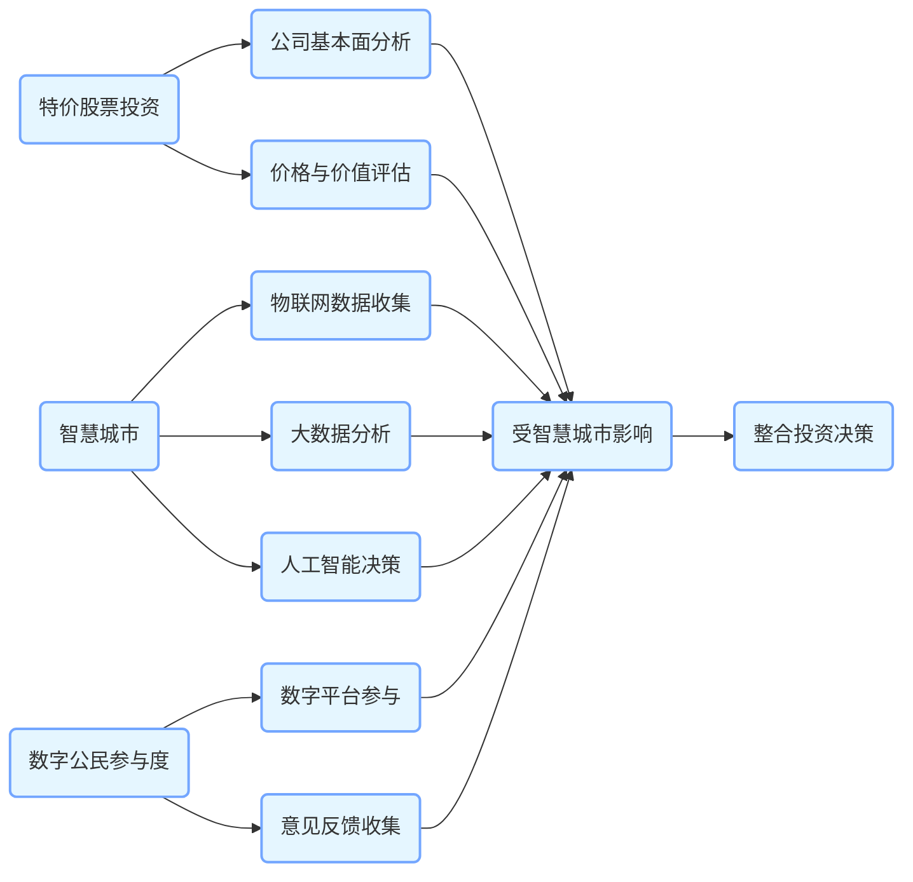

# 特价股票投资中的智慧城市与数字公民参与度整合方法

> 关键词：特价股票投资、智慧城市、数字公民参与度、整合方法、投资策略

> 摘要：本文聚焦于特价股票投资领域，探讨了将智慧城市建设与数字公民参与度进行整合的方法。首先介绍了研究的背景、目的、预期读者等内容，接着阐述了核心概念及其联系，详细讲解了核心算法原理和具体操作步骤，给出了相关数学模型和公式并举例说明。通过项目实战案例展示了如何在实际中运用整合方法，分析了其实际应用场景。同时推荐了相关的学习资源、开发工具框架和论文著作。最后总结了未来发展趋势与挑战，解答了常见问题并提供了扩展阅读和参考资料，旨在为投资者提供全面且深入的思路，以实现更有效的特价股票投资决策。

## 1. 背景介绍 
### 1.1 目的和范围
在当今复杂多变的金融市场中，特价股票投资一直是投资者关注的焦点。同时，智慧城市的建设和数字公民参与度的提升成为城市发展的重要趋势。本研究的目的在于探索如何将智慧城市建设相关企业的特价股票投资与数字公民参与度这两个看似不同的领域进行有效的整合，为投资者提供新的投资策略和方法。研究范围涵盖了智慧城市的各个方面，包括智能交通、智能能源、智能医疗等，以及数字公民在这些领域中的参与方式和程度对特价股票投资的影响。

### 1.2 预期读者
本文预期读者主要包括股票投资者，尤其是对特价股票投资感兴趣的个人和机构投资者；智慧城市领域的研究人员和从业者，他们可以从投资角度深入了解智慧城市建设的市场价值；金融分析师和研究机构人员，为其提供新的分析视角和研究方向；以及对数字公民参与度和城市发展有研究兴趣的学者和相关人员。

### 1.3 文档结构概述
本文将按照以下结构进行阐述：首先介绍核心概念与联系，明确智慧城市、数字公民参与度和特价股票投资的定义和相互关系；接着详细讲解核心算法原理和具体操作步骤，通过Python代码实现相关算法；然后给出数学模型和公式，并举例说明其应用；通过项目实战案例，展示整合方法的实际应用过程和效果；分析该整合方法在实际中的应用场景；推荐相关的学习资源、开发工具框架和论文著作；最后总结未来发展趋势与挑战，解答常见问题并提供扩展阅读和参考资料。

### 1.4 术语表
#### 1.4.1 核心术语定义
- **特价股票投资**：指投资者以相对较低的价格购买具有潜在价值的股票，期望在未来获得较高的投资回报。特价股票可能由于市场短期波动、公司暂时困境等原因而价格低于其内在价值。
- **智慧城市**：利用信息技术和通信技术手段感测、分析、整合城市运行核心系统的各项关键信息，从而对包括民生、环保、公共安全、城市服务、工商业活动在内的各种需求做出智能响应，为人类创造更美好的城市生活。
- **数字公民参与度**：指公民通过数字技术和网络平台参与城市事务、表达意见、提供反馈和参与决策的程度和活跃度。

#### 1.4.2 相关概念解释
- **智能交通**：智慧城市的重要组成部分，通过物联网、大数据、人工智能等技术实现交通系统的智能化管理和优化，提高交通效率和安全性。
- **智能能源**：利用先进的信息技术实现能源的高效生产、传输、分配和消费，促进能源的可持续发展。
- **智能医疗**：将信息技术与医疗服务相结合，实现医疗信息的数字化、医疗过程的智能化，提高医疗服务质量和效率。

#### 1.4.3 缩略词列表
- **AI**：Artificial Intelligence，人工智能
- **IoT**：Internet of Things，物联网
- **Big Data**：大数据

## 2. 核心概念与联系 
### 核心概念原理
#### 特价股票投资原理
特价股票投资的核心原理是基于价值投资理论。投资者通过对公司的基本面分析，包括财务状况、业务模式、市场竞争力等，评估公司的内在价值。当股票价格由于市场因素或其他原因低于其内在价值时，投资者认为这是一个投资机会，购买该股票并等待价格回归其内在价值，从而获得投资收益。

#### 智慧城市原理
智慧城市的建设基于信息技术和通信技术的融合。通过物联网设备收集城市运行的各种数据，如交通流量、能源消耗、环境质量等。利用大数据分析和人工智能算法对这些数据进行处理和分析，从而实现城市的智能化管理和决策。例如，智能交通系统可以根据实时交通数据调整信号灯时间，优化交通流量；智能能源系统可以根据能源消耗情况调整能源供应，提高能源利用效率。

#### 数字公民参与度原理
数字公民参与度的提升依赖于数字技术和网络平台的发展。公民可以通过社交媒体、在线投票系统、政务APP等数字平台参与城市事务的讨论、决策和监督。政府和相关机构可以通过这些平台收集公民的意见和反馈，从而更好地了解公民的需求和意愿，提高城市治理的民主性和科学性。

### 概念架构示意图


### 概念联系分析
特价股票投资、智慧城市和数字公民参与度之间存在着密切的联系。智慧城市的建设会影响相关企业的业务发展和市场竞争力，从而影响其股票的内在价值。例如，一家从事智能交通系统开发的企业，如果其技术能够有效改善城市交通状况，提高交通效率，那么该企业的市场份额可能会增加，股票价值也可能会上升。

数字公民参与度的提升可以为智慧城市建设提供重要的反馈和建议，促进智慧城市的更好发展。同时，公民的参与度也可以反映出城市的活力和发展潜力，对相关企业的发展产生积极影响。投资者在进行特价股票投资时，可以将智慧城市建设和数字公民参与度作为重要的考虑因素，综合评估企业的发展前景和投资价值。

## 3. 核心算法原理 & 具体操作步骤 
### 核心算法原理
我们采用多因素综合评估算法来整合智慧城市和数字公民参与度对特价股票投资的影响。该算法主要包括以下几个步骤：

#### 数据收集
收集与智慧城市建设相关的数据，如智能交通系统的覆盖率、智能能源系统的能源利用率等；收集数字公民参与度的数据，如公民在数字平台上的参与次数、反馈意见的数量等；收集特价股票的相关数据，如股票价格、公司财务报表等。

#### 指标量化
将收集到的数据转化为可量化的指标。例如，将智能交通系统的覆盖率转化为一个百分比指标，将公民在数字平台上的参与次数转化为一个参与度得分。

#### 权重分配
为每个指标分配相应的权重，反映其在综合评估中的重要性。权重的分配可以根据专家意见、历史数据或机器学习算法进行确定。

#### 综合评估
根据指标量化结果和权重分配，计算每个特价股票的综合评估得分。得分越高，说明该股票在考虑智慧城市和数字公民参与度因素后的投资价值越高。

### Python源代码实现
```python
import pandas as pd

# 数据收集和预处理
def collect_and_preprocess_data():
    # 假设从CSV文件中读取数据
    stock_data = pd.read_csv('stock_data.csv')
    smart_city_data = pd.read_csv('smart_city_data.csv')
    citizen_participation_data = pd.read_csv('citizen_participation_data.csv')
    # 合并数据
    merged_data = pd.merge(stock_data, smart_city_data, on='company_id')
    merged_data = pd.merge(merged_data, citizen_participation_data, on='company_id')
    return merged_data

# 指标量化
def quantify_metrics(data):
    # 假设智能交通覆盖率已经是百分比形式，无需处理
    # 对公民参与次数进行标准化处理
    data['citizen_participation_score'] = (data['citizen_participation_count'] - data['citizen_participation_count'].min()) / (
            data['citizen_participation_count'].max() - data['citizen_participation_count'].min())
    return data

# 权重分配
def assign_weights():
    # 假设根据专家意见确定权重
    weights = {
        'smart_transport_coverage': 0.3,
        'smart_energy_efficiency': 0.3,
        'citizen_participation_score': 0.2,
        'stock_price': 0.1,
        'company_profit': 0.1
    }
    return weights

# 综合评估
def comprehensive_evaluation(data, weights):
    data['evaluation_score'] = 0
    for metric, weight in weights.items():
        data['evaluation_score'] += data[metric] * weight
    return data

# 主函数
def main():
    data = collect_and_preprocess_data()
    data = quantify_metrics(data)
    weights = assign_weights()
    data = comprehensive_evaluation(data, weights)
    # 按评估得分排序
    sorted_data = data.sort_values(by='evaluation_score', ascending=False)
    print(sorted_data)

if __name__ == "__main__":
    main()
```

### 具体操作步骤
1. **数据收集**：从各种数据源收集相关数据，如金融数据库、政府统计数据、数字平台记录等，并将其存储在合适的文件格式中，如CSV文件。
2. **数据预处理**：对收集到的数据进行清洗、整理和合并，确保数据的准确性和一致性。
3. **指标量化**：根据数据的特点和分析需求，将数据转化为可量化的指标。
4. **权重分配**：根据专家意见、历史数据或机器学习算法确定每个指标的权重。
5. **综合评估**：根据指标量化结果和权重分配，计算每个特价股票的综合评估得分。
6. **投资决策**：根据综合评估得分对特价股票进行排序，选择得分较高的股票进行投资。

## 4. 数学模型和公式 & 详细讲解 & 举例说明 
### 数学模型
我们的多因素综合评估模型可以用以下公式表示：

$$S = \sum_{i=1}^{n} w_i \times m_i$$

其中，$S$ 表示特价股票的综合评估得分，$w_i$ 表示第 $i$ 个指标的权重，$m_i$ 表示第 $i$ 个指标的量化值，$n$ 表示指标的总数。

### 详细讲解
该公式的核心思想是将各个指标的量化值乘以其对应的权重，然后将所有结果相加，得到一个综合评估得分。权重的作用是反映每个指标在综合评估中的重要性。例如，如果某个指标的权重较高，那么该指标的变化对综合评估得分的影响就较大。

### 举例说明
假设我们有三只特价股票 $A$、$B$、$C$，考虑以下四个指标：智能交通覆盖率 $m_1$、智能能源效率 $m_2$、公民参与度得分 $m_3$ 和股票价格 $m_4$。各指标的权重分别为 $w_1 = 0.3$、$w_2 = 0.3$、$w_3 = 0.2$、$w_4 = 0.2$。各股票的指标量化值如下表所示：

| 股票 | $m_1$ | $m_2$ | $m_3$ | $m_4$ |
|------|-------|-------|-------|-------|
| A    | 0.8   | 0.7   | 0.6   | 0.9   |
| B    | 0.6   | 0.8   | 0.7   | 0.8   |
| C    | 0.7   | 0.6   | 0.8   | 0.7   |

根据上述公式，计算各股票的综合评估得分：

- 股票 $A$ 的综合评估得分：
$$S_A = 0.3 \times 0.8 + 0.3 \times 0.7 + 0.2 \times 0.6 + 0.2 \times 0.9 = 0.75$$

- 股票 $B$ 的综合评估得分：
$$S_B = 0.3 \times 0.6 + 0.3 \times 0.8 + 0.2 \times 0.7 + 0.2 \times 0.8 = 0.72$$

- 股票 $C$ 的综合评估得分：
$$S_C = 0.3 \times 0.7 + 0.3 \times 0.6 + 0.2 \times 0.8 + 0.2 \times 0.7 = 0.7$$

根据计算结果，股票 $A$ 的综合评估得分最高，说明在考虑智慧城市和数字公民参与度因素后，股票 $A$ 的投资价值相对较高。

## 5. 项目实战：代码实际案例和详细解释说明 
### 5.1  开发环境搭建
#### 操作系统
本项目可以在Windows、Linux或macOS等主流操作系统上进行开发。

#### Python环境
安装Python 3.x版本，建议使用Anaconda来管理Python环境。Anaconda是一个开源的Python发行版本，包含了Python解释器和许多常用的科学计算库。

#### 安装依赖库
在命令行中使用以下命令安装项目所需的依赖库：
```sh
pip install pandas
```

### 5.2  源代码详细实现和代码解读
```python
import pandas as pd

# 数据收集和预处理
def collect_and_preprocess_data():
    # 假设从CSV文件中读取数据
    stock_data = pd.read_csv('stock_data.csv')
    smart_city_data = pd.read_csv('smart_city_data.csv')
    citizen_participation_data = pd.read_csv('citizen_participation_data.csv')
    # 合并数据
    merged_data = pd.merge(stock_data, smart_city_data, on='company_id')
    merged_data = pd.merge(merged_data, citizen_participation_data, on='company_id')
    return merged_data

# 指标量化
def quantify_metrics(data):
    # 假设智能交通覆盖率已经是百分比形式，无需处理
    # 对公民参与次数进行标准化处理
    data['citizen_participation_score'] = (data['citizen_participation_count'] - data['citizen_participation_count'].min()) / (
            data['citizen_participation_count'].max() - data['citizen_participation_count'].min())
    return data

# 权重分配
def assign_weights():
    # 假设根据专家意见确定权重
    weights = {
        'smart_transport_coverage': 0.3,
        'smart_energy_efficiency': 0.3,
        'citizen_participation_score': 0.2,
        'stock_price': 0.1,
        'company_profit': 0.1
    }
    return weights

# 综合评估
def comprehensive_evaluation(data, weights):
    data['evaluation_score'] = 0
    for metric, weight in weights.items():
        data['evaluation_score'] += data[metric] * weight
    return data

# 主函数
def main():
    data = collect_and_preprocess_data()
    data = quantify_metrics(data)
    weights = assign_weights()
    data = comprehensive_evaluation(data, weights)
    # 按评估得分排序
    sorted_data = data.sort_values(by='evaluation_score', ascending=False)
    print(sorted_data)

if __name__ == "__main__":
    main()
```

#### 代码解读
1. **数据收集和预处理**：`collect_and_preprocess_data` 函数从CSV文件中读取股票数据、智慧城市数据和公民参与度数据，并将它们合并成一个数据集。使用 `pandas` 库的 `read_csv` 函数读取CSV文件，使用 `merge` 函数合并数据集。
2. **指标量化**：`quantify_metrics` 函数对公民参与次数进行标准化处理，将其转化为一个介于0和1之间的得分。使用 `pandas` 库的数学运算功能实现标准化处理。
3. **权重分配**：`assign_weights` 函数根据专家意见确定每个指标的权重，返回一个字典。
4. **综合评估**：`comprehensive_evaluation` 函数根据指标量化结果和权重分配，计算每个特价股票的综合评估得分。使用 `pandas` 库的循环和数学运算功能实现综合评估。
5. **主函数**：`main` 函数调用上述函数完成数据收集、预处理、指标量化、权重分配和综合评估，并按评估得分对股票进行排序，最后打印排序结果。

### 5.3  代码解读与分析
#### 优点
- **模块化设计**：代码采用模块化设计，将不同的功能封装在不同的函数中，提高了代码的可读性和可维护性。
- **数据处理方便**：使用 `pandas` 库进行数据处理，提供了丰富的数据操作功能，如数据读取、合并、标准化等，简化了数据处理过程。
- **可扩展性**：可以很容易地添加新的指标和权重，或者修改现有的指标量化方法和权重分配策略，以适应不同的投资需求。

#### 缺点
- **数据依赖**：代码依赖于特定格式的CSV文件，数据的准确性和完整性对结果有重要影响。如果数据存在错误或缺失，可能会导致评估结果不准确。
- **权重确定主观性**：权重的确定采用专家意见，具有一定的主观性。不同的专家可能会给出不同的权重，从而影响评估结果。

#### 改进建议
- **数据验证和清洗**：在数据收集和预处理阶段，增加数据验证和清洗步骤，确保数据的准确性和完整性。
- **机器学习确定权重**：可以使用机器学习算法，如线性回归、决策树等，根据历史数据自动确定每个指标的权重，减少主观性。

## 6. 实际应用场景 
### 个人投资者
个人投资者可以使用本文介绍的整合方法，在特价股票投资中考虑智慧城市建设和数字公民参与度因素。通过分析相关企业在智慧城市领域的发展前景和公民的参与度，选择具有潜力的特价股票进行投资。例如，投资者可以关注从事智能交通系统开发的企业，如果该城市的智能交通覆盖率不断提高，且公民对交通改善的参与度较高，那么该企业的股票可能具有较高的投资价值。

### 机构投资者
机构投资者如基金公司、证券公司等，可以将该整合方法应用于投资组合管理中。通过综合评估智慧城市相关企业的特价股票，构建多元化的投资组合，降低投资风险。同时，机构投资者还可以利用自身的研究资源和数据分析能力，进一步优化指标量化方法和权重分配策略，提高投资决策的准确性。

### 政府和政策制定者
政府和政策制定者可以将数字公民参与度纳入智慧城市建设的评估体系中。通过鼓励公民参与智慧城市建设，提高公民的满意度和获得感。同时，政府可以根据本文介绍的整合方法，分析智慧城市建设对相关企业股票市场的影响，制定更加科学合理的产业政策，促进智慧城市的健康发展。

### 智慧城市企业
智慧城市企业可以利用该整合方法了解自身在市场中的投资价值。通过提高自身在智慧城市领域的技术水平和市场竞争力，以及积极引导公民参与，提升企业的综合评估得分，吸引更多的投资者。同时，企业还可以根据公民的反馈和建议，不断优化产品和服务，提高企业的发展质量。

## 7. 工具和资源推荐
### 7.1 学习资源推荐
#### 7.1.1 书籍推荐
- 《价值投资：从格雷厄姆到巴菲特》：介绍了价值投资的基本理论和方法，为特价股票投资提供了理论基础。
- 《智慧城市：技术与应用》：详细阐述了智慧城市的概念、技术和应用场景，帮助读者了解智慧城市建设的相关知识。
- 《数字公民：互联网时代的公民身份与参与》：探讨了数字公民的概念、权利和参与方式，对理解数字公民参与度有很大帮助。

#### 7.1.2 在线课程
- Coursera上的“金融市场与投资策略”课程：讲解了金融市场的基本原理和投资策略，适合初学者学习。
- edX上的“智慧城市技术与管理”课程：介绍了智慧城市的技术架构和管理方法，对深入了解智慧城市有很大帮助。
- Udemy上的“Python数据分析实战”课程：通过实际案例学习Python在数据分析中的应用，有助于掌握本文中的代码实现。

#### 7.1.3 技术博客和网站
- 东方财富网：提供丰富的股票市场数据和分析报告，是投资者获取股票信息的重要渠道。
- 智慧城市网：专注于智慧城市领域的新闻、技术和案例分享，为读者提供最新的智慧城市动态。
- 数据科学家社区Kaggle：提供大量的数据分析和机器学习案例，有助于提高数据分析能力。

### 7.2 开发工具框架推荐
#### 7.2.1 IDE和编辑器
- PyCharm：一款专业的Python集成开发环境，提供丰富的代码编辑、调试和项目管理功能。
- Jupyter Notebook：一个交互式的编程环境，适合进行数据分析和代码演示。
- Visual Studio Code：一款轻量级的代码编辑器，支持多种编程语言和插件扩展。

#### 7.2.2 调试和性能分析工具
- PySnooper：一个简单易用的Python调试工具，可以自动打印函数的调用过程和变量的值。
- cProfile：Python标准库中的性能分析工具，可以分析代码的运行时间和函数调用次数。
- memory_profiler：一个Python内存分析工具，可以分析代码的内存使用情况。

#### 7.2.3 相关框架和库
- Pandas：一个强大的数据分析库，提供了丰富的数据结构和数据操作功能，适合进行数据处理和分析。
- NumPy：一个用于科学计算的Python库，提供了高效的数组操作和数学函数，是数据分析和机器学习的基础库。
- Scikit-learn：一个常用的机器学习库，提供了各种机器学习算法和工具，可用于权重分配和模型优化。

### 7.3 相关论文著作推荐
#### 7.3.1 经典论文
- 《Security Analysis》（《证券分析》）：本杰明·格雷厄姆和戴维·多德著，被誉为价值投资的圣经，对特价股票投资有重要的指导意义。
- 《The Digital Divide: Civic Engagement, Information Poverty, and the Internet Worldwide》（《数字鸿沟：全球范围内的公民参与、信息贫困与互联网》）：探讨了数字公民参与度与社会发展的关系，是研究数字公民参与度的经典论文。
- 《Smart Cities: A Definition》（《智慧城市：定义》）：对智慧城市的概念进行了深入探讨，为智慧城市的研究和实践提供了理论基础。

#### 7.3.2 最新研究成果
- 关注顶级学术期刊如《Journal of Urban Technology》（《城市技术杂志》）、《IEEE Transactions on Smart Grid》（《IEEE智能电网汇刊》）等，获取智慧城市领域的最新研究成果。
- 关注金融领域的学术期刊如《Journal of Finance》（《金融杂志》）、《Review of Financial Studies》（《金融研究评论》）等，获取特价股票投资的最新研究进展。

#### 7.3.3 应用案例分析
- 研究国内外智慧城市建设的成功案例，如新加坡的智慧城市建设、巴塞罗那的智能交通系统等，了解智慧城市建设的实际应用和效果。
- 分析一些成功的特价股票投资案例，如巴菲特的投资案例，学习投资策略和方法。

## 8. 总结：未来发展趋势与挑战
### 未来发展趋势
#### 技术创新推动
随着人工智能、物联网、大数据等技术的不断发展，智慧城市的建设将不断升级和完善。智能交通、智能能源、智能医疗等领域将出现更多的创新应用，为相关企业带来更多的发展机遇，也为特价股票投资提供更多的选择。

#### 数字公民参与度提升
数字技术的普及和网络平台的发展将进一步提高数字公民的参与度。公民将更加积极地参与城市事务的讨论、决策和监督，政府和相关机构也将更加重视公民的意见和反馈。这将促进智慧城市的更加人性化和可持续发展，同时也为特价股票投资提供了新的分析视角。

#### 投资策略多元化
投资者将越来越重视智慧城市和数字公民参与度等因素对特价股票投资的影响，投资策略将更加多元化。除了传统的基本面分析和技术分析，投资者还将结合智慧城市的发展趋势和数字公民的参与情况进行综合评估，制定更加科学合理的投资决策。

### 挑战
#### 数据质量和安全问题
智慧城市建设和数字公民参与度的分析需要大量的数据支持，但数据的质量和安全问题是一个挑战。数据可能存在错误、缺失或不完整的情况，影响分析结果的准确性。同时，数据的安全和隐私保护也是一个重要问题，需要采取有效的措施来保障数据的安全。

#### 指标量化和权重确定的主观性
指标量化和权重确定是整合方法中的关键环节，但目前的方法存在一定的主观性。不同的专家和投资者可能会给出不同的指标量化方法和权重分配策略，导致评估结果的差异。如何减少主观性，提高评估结果的客观性和准确性是一个需要解决的问题。

#### 市场不确定性
股票市场本身具有不确定性，受到宏观经济环境、政策变化、行业竞争等多种因素的影响。即使考虑了智慧城市和数字公民参与度等因素，也不能完全消除投资风险。投资者需要具备较强的风险意识和风险管理能力，以应对市场的不确定性。

## 9. 附录：常见问题与解答
### 1. 如何获取准确的智慧城市和数字公民参与度数据？
可以从政府部门、行业协会、研究机构等获取智慧城市建设的相关数据，如智能交通覆盖率、智能能源利用率等。数字公民参与度数据可以从数字平台运营商、社交媒体公司等获取公民的参与次数、反馈意见等信息。同时，也可以利用网络爬虫技术从公开网站上收集相关数据，但需要注意数据的合法性和准确性。

### 2. 权重分配是否可以根据市场情况动态调整？
可以。在实际应用中，可以根据市场情况、行业发展趋势和投资者的风险偏好等因素动态调整权重分配。例如，当智慧城市建设处于快速发展阶段时，可以适当提高智慧城市相关指标的权重；当市场波动较大时，可以提高股票价格等风险指标的权重。

### 3. 该整合方法是否适用于所有类型的特价股票？
该整合方法主要适用于与智慧城市建设相关的特价股票。因为这些股票的价值受到智慧城市建设和数字公民参与度的影响较大。对于与智慧城市建设无关的特价股票，该方法可能不适用，需要采用其他的投资分析方法。

### 4. 如何评估数字公民参与度对股票投资的实际影响？
可以通过历史数据的分析和实证研究来评估数字公民参与度对股票投资的实际影响。例如，分析公民参与度较高的城市中相关企业的股票表现，与公民参与度较低的城市进行对比。同时，也可以通过建立计量经济模型，控制其他因素的影响，单独分析数字公民参与度对股票价格和投资收益的影响。

## 10. 扩展阅读 & 参考资料
### 扩展阅读
- 《智能城市的崛起》：深入探讨了智能城市的发展历程、技术应用和未来趋势，提供了更广阔的视角。
- 《金融科技与投资创新》：介绍了金融科技在投资领域的应用和创新，为特价股票投资提供了新的思路。
- 《公民参与：理论与实践》：详细阐述了公民参与的理论和实践方法，有助于深入理解数字公民参与度。

### 参考资料
- [1] Graham, B., & Dodd, D. L. (1934). Security Analysis. McGraw-Hill.
- [2] Norris, P. (2001). The Digital Divide: Civic Engagement, Information Poverty, and the Internet Worldwide. Cambridge University Press.
- [3] Giffinger, R., Fertner, C., Kramar, H., Kalasek, R., Pichler-Milanovic, N., & Meijers, E. (2007). Smart Cities: A Definition. Centre of Regional Science.
- [4] McKinsey Global Institute. (2018). Smart cities: Digital solutions for a more livable future.
- [5] World Bank. (2019). Digital Dividends. World Bank Publications.

作者：AI天才研究院/AI Genius Institute & 禅与计算机程序设计艺术 /Zen And The Art of Computer Programming