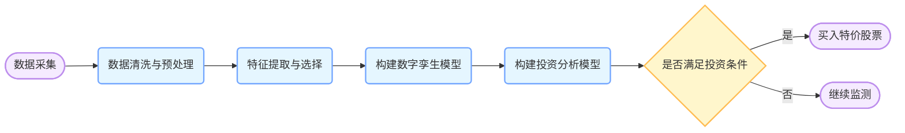

# 特价股票投资中的智慧城市与数字孪生整合方法

> 关键词：特价股票投资、智慧城市、数字孪生、整合方法、投资策略

> 摘要：本文聚焦于特价股票投资领域，深入探讨了智慧城市与数字孪生的整合方法。在当今数字化时代，智慧城市建设和数字孪生技术发展迅速，二者的结合为特价股票投资带来了新的机遇和挑战。文章详细介绍了相关核心概念、算法原理、数学模型，通过项目实战案例展示整合方法的具体应用，分析了实际应用场景，推荐了学习资源、开发工具和相关论文著作，最后总结了未来发展趋势与挑战，并对常见问题进行了解答。旨在为投资者和相关技术人员提供全面且深入的参考，以更好地把握特价股票投资中智慧城市与数字孪生整合的机会。

## 1. 背景介绍 
### 1.1 目的和范围
本文章的主要目的是研究在特价股票投资场景下，如何将智慧城市与数字孪生进行有效整合。随着科技的不断进步，智慧城市和数字孪生逐渐成为热门领域，其发展对相关企业的股价产生着重要影响。特价股票往往具有价格相对较低但潜在价值较高的特点，通过整合智慧城市和数字孪生的理念与技术，可以挖掘这些特价股票的投资价值，为投资者提供更科学的投资策略。

文章的范围涵盖了智慧城市和数字孪生的核心概念、整合所需的算法原理、相关数学模型，以及通过实际项目案例展示整合方法的应用。同时，还探讨了该整合方法在实际投资中的应用场景，推荐了相关的学习资源、开发工具和研究论文。

### 1.2 预期读者
本文预期读者包括对特价股票投资感兴趣的个人投资者、专业投资机构的分析师和投资经理。同时，从事智慧城市和数字孪生技术研究与开发的技术人员、相关领域的学者也可以从本文中获得关于技术应用和投资方向的启发。此外，对于关注城市发展和数字化转型的政府部门工作人员，本文也能提供一定的参考价值。

### 1.3 文档结构概述
本文将按照以下结构进行阐述：首先介绍智慧城市与数字孪生的核心概念及其联系，通过文本示意图和 Mermaid 流程图进行直观展示；接着详细讲解实现整合的核心算法原理，并给出 Python 源代码进行说明；然后介绍相关的数学模型和公式，并举例说明其应用；通过一个项目实战案例，展示整合方法的具体实现过程，包括开发环境搭建、源代码实现和代码解读；分析该整合方法在实际投资中的应用场景；推荐相关的学习资源、开发工具和研究论文；最后总结未来发展趋势与挑战，解答常见问题，并提供扩展阅读和参考资料。

### 1.4 术语表
#### 1.4.1 核心术语定义
- **特价股票**：指价格相对较低，通常低于其内在价值或行业平均估值的股票。这类股票可能由于市场短期波动、公司短期困境等原因导致价格下跌，但具有潜在的投资价值。
- **智慧城市**：利用物联网、云计算、大数据、人工智能等新一代信息技术，对城市的各类资源进行全面感知、整合和分析，实现城市运行的智能化、高效化和可持续发展。它涵盖了城市的交通、能源、环境、公共安全等多个领域。
- **数字孪生**：通过数字化技术创建物理实体的虚拟映射，实时反映物理实体的状态、行为和性能。数字孪生模型可以对物理实体进行仿真、优化和预测，为决策提供支持。
- **整合方法**：指将智慧城市和数字孪生的理念、技术和数据进行有机结合，应用于特价股票投资分析和决策过程的方法。

#### 1.4.2 相关概念解释
- **投资策略**：投资者为实现投资目标而制定的一系列投资计划和方法，包括资产配置、选股标准、买卖时机等。
- **数据挖掘**：从大量数据中发现有价值的信息和知识的过程，常用的技术包括分类、聚类、关联规则挖掘等。
- **机器学习**：让计算机通过数据学习模式和规律，并进行预测和决策的技术。常见的机器学习算法包括决策树、神经网络、支持向量机等。

#### 1.4.3 缩略词列表
- **IoT**：Internet of Things，物联网
- **AI**：Artificial Intelligence，人工智能
- **ML**：Machine Learning，机器学习
- **GIS**：Geographic Information System，地理信息系统

## 2. 核心概念与联系 
### 核心概念原理
#### 智慧城市原理
智慧城市的核心原理是通过物联网技术将城市中的各种设备和传感器连接起来，实时采集城市运行的数据，如交通流量、能源消耗、环境质量等。这些数据通过网络传输到数据中心，利用云计算和大数据技术进行存储、处理和分析。然后，借助人工智能和机器学习算法对数据进行挖掘和分析，提取有价值的信息和知识，为城市管理者提供决策支持，实现城市的智能化管理和服务。

例如，在交通领域，通过安装在道路上的传感器和摄像头，可以实时监测交通流量和车辆行驶状态。利用这些数据，交通管理部门可以优化交通信号控制，引导车辆合理行驶，缓解交通拥堵。

#### 数字孪生原理
数字孪生的原理是建立物理实体的数字化模型，该模型与物理实体在结构、功能和行为上具有高度的一致性。通过传感器实时采集物理实体的状态数据，并将其反馈到数字孪生模型中，使模型能够实时反映物理实体的真实状态。同时，数字孪生模型可以对物理实体进行仿真和预测，分析其在不同条件下的性能和行为，为优化物理实体的设计和运行提供依据。

例如，在工业生产中，数字孪生模型可以实时监测设备的运行状态，预测设备的故障发生时间，提前进行维护和保养，减少设备停机时间，提高生产效率。

### 架构的文本示意图
```plaintext
智慧城市与数字孪生整合架构

数据源层：
    - 智慧城市传感器网络（交通、能源、环境等传感器）
    - 企业财务数据、市场行情数据
    - 社交媒体数据、新闻资讯数据

数据传输层：
    - 物联网通信协议（MQTT、CoAP 等）
    - 互联网传输协议（HTTP、TCP/IP 等）

数据处理层：
    - 云计算平台（AWS、阿里云等）
    - 大数据处理框架（Hadoop、Spark 等）
    - 数据挖掘和机器学习算法库（Scikit-learn、TensorFlow 等）

模型构建层：
    - 数字孪生模型（城市基础设施、企业运营等模型）
    - 投资分析模型（选股模型、风险评估模型等）

应用层：
    - 特价股票投资决策支持系统
    - 智慧城市管理与服务系统
```

### Mermaid 流程图


## 3. 核心算法原理 & 具体操作步骤 
### 核心算法原理
在特价股票投资中，将智慧城市与数字孪生整合的核心算法主要包括数据挖掘算法和机器学习算法。

#### 数据挖掘算法
数据挖掘算法用于从海量的智慧城市和金融数据中提取有价值的信息和知识。常用的数据挖掘算法包括关联规则挖掘、聚类分析和分类算法。

- **关联规则挖掘**：通过分析数据之间的关联关系，发现不同变量之间的潜在联系。例如，分析智慧城市中的交通流量数据和相关企业的股价数据，找出两者之间的关联规则，为投资决策提供参考。
- **聚类分析**：将数据对象按照相似性进行分组，使得同一组内的数据对象具有较高的相似性，不同组之间的数据对象具有较大的差异性。在特价股票投资中，可以将股票按照行业、财务指标、与智慧城市的关联程度等进行聚类，以便更好地进行分析和比较。
- **分类算法**：根据数据对象的特征将其划分为不同的类别。例如，将股票分为具有投资价值的特价股票和不具有投资价值的股票，为投资者提供明确的投资建议。

#### 机器学习算法
机器学习算法用于构建投资分析模型，对特价股票的投资价值进行预测和评估。常用的机器学习算法包括决策树、神经网络和支持向量机。

- **决策树**：决策树是一种基于树结构进行决策的算法。它通过对数据进行划分，构建决策树模型，根据不同的特征条件进行决策。在特价股票投资中，决策树可以根据股票的财务指标、市场行情、与智慧城市的关联程度等特征，判断股票是否具有投资价值。
- **神经网络**：神经网络是一种模仿人类神经系统的计算模型，它由大量的神经元组成，可以自动学习数据中的复杂模式和规律。在特价股票投资中，神经网络可以对股票的历史数据进行学习和分析，预测股票的未来走势。
- **支持向量机**：支持向量机是一种用于分类和回归分析的机器学习算法。它通过寻找最优的超平面，将不同类别的数据分开。在特价股票投资中，支持向量机可以根据股票的特征数据，将其分类为具有投资价值和不具有投资价值的股票。

### 具体操作步骤
#### 数据采集
收集智慧城市相关的数据，包括交通流量、能源消耗、环境质量等数据，以及金融市场数据，包括股票价格、成交量、财务报表等数据。可以通过传感器网络、政府部门、金融机构等渠道获取数据。

#### 数据清洗与预处理
对采集到的数据进行清洗和预处理，去除噪声数据、缺失值和异常值。同时，对数据进行标准化和归一化处理，使得不同特征的数据具有相同的尺度，便于后续的分析和建模。

#### 特征提取与选择
从清洗后的数据中提取有价值的特征，例如股票的市盈率、市净率、与智慧城市相关业务的占比等。然后，通过特征选择算法，选择对投资决策影响较大的特征，减少数据维度，提高模型的效率和准确性。

#### 构建数字孪生模型
根据智慧城市的实际情况，构建城市基础设施、企业运营等数字孪生模型。通过传感器实时采集物理实体的状态数据，并将其反馈到数字孪生模型中，使模型能够实时反映物理实体的真实状态。

#### 构建投资分析模型
利用机器学习算法，如决策树、神经网络和支持向量机，构建投资分析模型。将提取的特征数据作为输入，股票的投资价值作为输出，对模型进行训练和优化。

#### 投资决策
将实时采集的数据输入到投资分析模型中，得到股票的投资价值预测结果。根据预测结果，判断股票是否具有投资价值，做出投资决策。

### Python 源代码示例
```python
import pandas as pd
from sklearn.model_selection import train_test_split
from sklearn.tree import DecisionTreeClassifier
from sklearn.preprocessing import StandardScaler
from sklearn.metrics import accuracy_score

# 数据采集（假设数据已经存储在 CSV 文件中）
data = pd.read_csv('stock_data.csv')

# 数据清洗与预处理
data = data.dropna()  # 去除缺失值
X = data.drop('investment_value', axis=1)  # 特征数据
y = data['investment_value']  # 目标数据

# 特征标准化
scaler = StandardScaler()
X_scaled = scaler.fit_transform(X)

# 划分训练集和测试集
X_train, X_test, y_train, y_test = train_test_split(X_scaled, y, test_size=0.2, random_state=42)

# 构建决策树模型
model = DecisionTreeClassifier()
model.fit(X_train, y_train)

# 模型预测
y_pred = model.predict(X_test)

# 模型评估
accuracy = accuracy_score(y_test, y_pred)
print(f"模型准确率: {accuracy}")
```

## 4. 数学模型和公式 & 详细讲解 & 举例说明 
### 关联规则挖掘的数学模型和公式
关联规则挖掘的目标是发现数据集中不同项之间的关联关系。常用的关联规则挖掘算法是 Apriori 算法，其核心概念包括支持度、置信度和提升度。

#### 支持度（Support）
支持度表示项集在数据集中出现的频率。对于项集 $X$ 和 $Y$，支持度的计算公式为：
$$
Support(X \cup Y) = \frac{\text{包含 } X \text{ 和 } Y \text{ 的事务数}}{\text{总事务数}}
$$

例如，在一个股票交易数据集中，有 1000 条交易记录，其中同时包含股票 A 和股票 B 的交易记录有 200 条，则股票 A 和股票 B 的支持度为：
$$
Support(A \cup B) = \frac{200}{1000} = 0.2
$$

#### 置信度（Confidence）
置信度表示在包含项集 $X$ 的事务中，同时包含项集 $Y$ 的比例。置信度的计算公式为：
$$
Confidence(X \rightarrow Y) = \frac{Support(X \cup Y)}{Support(X)}
$$

例如，在上述股票交易数据集中，包含股票 A 的交易记录有 300 条，则股票 A 到股票 B 的置信度为：
$$
Confidence(A \rightarrow B) = \frac{0.2}{0.3} \approx 0.67
$$

#### 提升度（Lift）
提升度用于衡量项集 $X$ 和 $Y$ 之间的关联程度。提升度的计算公式为：
$$
Lift(X \rightarrow Y) = \frac{Confidence(X \rightarrow Y)}{Support(Y)}
$$

例如，在上述股票交易数据集中，包含股票 B 的交易记录有 400 条，则股票 A 到股票 B 的提升度为：
$$
Lift(A \rightarrow B) = \frac{0.67}{0.4} \approx 1.67
$$

当提升度大于 1 时，说明项集 $X$ 和 $Y$ 之间存在正关联关系；当提升度等于 1 时，说明项集 $X$ 和 $Y$ 之间相互独立；当提升度小于 1 时，说明项集 $X$ 和 $Y$ 之间存在负关联关系。

### 决策树的数学模型和公式
决策树是一种基于树结构进行决策的算法。决策树的构建过程主要包括特征选择和树的生成。常用的特征选择方法是信息增益和基尼指数。

#### 信息增益（Information Gain）
信息增益用于衡量特征对数据集分类的贡献程度。信息增益的计算公式为：
$$
IG(D, A) = H(D) - H(D|A)
$$
其中，$IG(D, A)$ 表示特征 $A$ 对数据集 $D$ 的信息增益，$H(D)$ 表示数据集 $D$ 的信息熵，$H(D|A)$ 表示在特征 $A$ 给定的条件下，数据集 $D$ 的条件熵。

信息熵的计算公式为：
$$
H(D) = -\sum_{i=1}^{n} p_i \log_2 p_i
$$
其中，$p_i$ 表示数据集 $D$ 中第 $i$ 类样本的比例。

条件熵的计算公式为：
$$
H(D|A) = \sum_{j=1}^{m} \frac{|D_j|}{|D|} H(D_j)
$$
其中，$D_j$ 表示数据集 $D$ 中特征 $A$ 取值为第 $j$ 个值的子集，$|D_j|$ 表示子集 $D_j$ 的样本数，$|D|$ 表示数据集 $D$ 的样本数。

#### 基尼指数（Gini Index）
基尼指数用于衡量数据集的不纯度。基尼指数的计算公式为：
$$
Gini(D) = 1 - \sum_{i=1}^{n} p_i^2
$$
其中，$p_i$ 表示数据集 $D$ 中第 $i$ 类样本的比例。

在决策树的构建过程中，选择信息增益或基尼指数最大的特征作为当前节点的划分特征，递归地构建决策树。

### 举例说明
假设有一个股票投资数据集，包含以下特征：市盈率、市净率、与智慧城市相关业务的占比，以及投资价值（有投资价值和无投资价值）。

#### 关联规则挖掘举例
通过关联规则挖掘，发现市盈率低于 10 且与智慧城市相关业务的占比高于 50% 的股票，与有投资价值的股票之间存在较强的关联关系。支持度为 0.15，置信度为 0.8，提升度为 1.5。这表明在满足市盈率低于 10 且与智慧城市相关业务的占比高于 50% 的股票中，有 80% 的股票具有投资价值，且这种关联关系是显著的。

#### 决策树举例
使用决策树算法对股票投资数据集进行建模。在构建决策树的过程中，通过计算信息增益，选择与智慧城市相关业务的占比作为根节点的划分特征。根据与智慧城市相关业务的占比将数据集划分为不同的子集，然后在每个子集中继续选择信息增益最大的特征进行划分，直到满足停止条件。最终得到的决策树可以根据股票的特征数据，判断股票是否具有投资价值。

## 5. 项目实战：代码实际案例和详细解释说明 
### 5.1  开发环境搭建
#### 操作系统
可以选择 Windows、Linux 或 macOS 操作系统。建议使用 Linux 系统，如 Ubuntu，因为它在数据处理和机器学习方面具有良好的支持。

#### Python 环境
安装 Python 3.7 或更高版本。可以从 Python 官方网站（https://www.python.org/downloads/）下载并安装 Python。

#### 虚拟环境
为了避免不同项目之间的依赖冲突，建议使用虚拟环境。可以使用 `venv` 或 `conda` 来创建虚拟环境。

使用 `venv` 创建虚拟环境的命令如下：
```bash
python -m venv stock_env
source stock_env/bin/activate  # 在 Linux 或 macOS 上
stock_env\Scripts\activate  # 在 Windows 上
```

#### 安装依赖库
在虚拟环境中安装所需的依赖库，包括 `pandas`、`numpy`、`scikit-learn`、`matplotlib` 等。可以使用 `pip` 进行安装：
```bash
pip install pandas numpy scikit-learn matplotlib
```

### 5.2  源代码详细实现和代码解读
```python
import pandas as pd
import numpy as np
from sklearn.model_selection import train_test_split
from sklearn.ensemble import RandomForestClassifier
from sklearn.preprocessing import StandardScaler
from sklearn.metrics import accuracy_score, classification_report
import matplotlib.pyplot as plt

# 数据加载
data = pd.read_csv('stock_data.csv')

# 数据探索
print("数据基本信息：")
data.info()

# 数据预处理
# 处理缺失值
data = data.dropna()

# 分离特征和目标变量
X = data.drop('investment_value', axis=1)
y = data['investment_value']

# 特征标准化
scaler = StandardScaler()
X_scaled = scaler.fit_transform(X)

# 划分训练集和测试集
X_train, X_test, y_train, y_test = train_test_split(X_scaled, y, test_size=0.2, random_state=42)

# 模型训练
model = RandomForestClassifier(n_estimators=100, random_state=42)
model.fit(X_train, y_train)

# 模型预测
y_pred = model.predict(X_test)

# 模型评估
accuracy = accuracy_score(y_test, y_pred)
print(f"模型准确率: {accuracy}")

# 分类报告
print("分类报告：")
print(classification_report(y_test, y_pred))

# 特征重要性分析
feature_importances = model.feature_importances_
feature_names = X.columns

# 绘制特征重要性柱状图
plt.figure(figsize=(10, 6))
plt.bar(feature_names, feature_importances)
plt.xlabel('特征')
plt.ylabel('重要性')
plt.title('特征重要性分析')
plt.xticks(rotation=45)
plt.show()
```

### 代码解读与分析
#### 数据加载与探索
```python
data = pd.read_csv('stock_data.csv')
print("数据基本信息：")
data.info()
```
使用 `pandas` 库的 `read_csv` 函数读取存储在 `stock_data.csv` 文件中的股票数据，并使用 `info` 方法查看数据的基本信息，包括数据的行数、列数、数据类型等。

#### 数据预处理
```python
data = data.dropna()
X = data.drop('investment_value', axis=1)
y = data['investment_value']
scaler = StandardScaler()
X_scaled = scaler.fit_transform(X)
```
- `dropna` 方法用于去除数据中的缺失值。
- 将特征数据和目标变量分离，`investment_value` 作为目标变量，其余列作为特征数据。
- 使用 `StandardScaler` 对特征数据进行标准化处理，使得不同特征的数据具有相同的尺度。

#### 划分训练集和测试集
```python
X_train, X_test, y_train, y_test = train_test_split(X_scaled, y, test_size=0.2, random_state=42)
```
使用 `train_test_split` 函数将数据集划分为训练集和测试集，测试集占总数据集的 20%。

#### 模型训练与预测
```python
model = RandomForestClassifier(n_estimators=100, random_state=42)
model.fit(X_train, y_train)
y_pred = model.predict(X_test)
```
- 使用 `RandomForestClassifier` 构建随机森林分类模型，设置树的数量为 100。
- 使用训练集数据对模型进行训练。
- 使用训练好的模型对测试集数据进行预测。

#### 模型评估
```python
accuracy = accuracy_score(y_test, y_pred)
print(f"模型准确率: {accuracy}")
print("分类报告：")
print(classification_report(y_test, y_pred))
```
- 使用 `accuracy_score` 计算模型的准确率。
- 使用 `classification_report` 生成分类报告，包括精确率、召回率、F1 值等评估指标。

#### 特征重要性分析
```python
feature_importances = model.feature_importances_
feature_names = X.columns
plt.figure(figsize=(10, 6))
plt.bar(feature_names, feature_importances)
plt.xlabel('特征')
plt.ylabel('重要性')
plt.title('特征重要性分析')
plt.xticks(rotation=45)
plt.show()
```
- 获取随机森林模型中每个特征的重要性得分。
- 使用 `matplotlib` 库绘制特征重要性柱状图，直观展示每个特征对模型的重要程度。

## 6. 实际应用场景 
### 投资决策支持
在特价股票投资中，通过整合智慧城市和数字孪生的方法，可以为投资者提供更全面、准确的投资决策支持。例如，通过分析智慧城市的发展规划和建设进度，结合数字孪生模型对相关企业的运营状况进行实时监测和预测，筛选出具有投资价值的特价股票。同时，利用机器学习算法对股票的投资价值进行评估和排序，为投资者提供投资建议。

### 风险评估与管理
智慧城市和数字孪生的整合可以帮助投资者更好地评估和管理投资风险。通过数字孪生模型对企业的生产运营、市场竞争等方面进行仿真和预测，提前发现潜在的风险因素。同时，结合智慧城市的宏观数据，如经济发展趋势、政策法规变化等，对投资组合的风险进行评估和调整，降低投资风险。

### 企业价值评估
对于从事智慧城市相关业务的企业，数字孪生模型可以实时反映企业的资产状况、生产效率、市场竞争力等方面的信息，为投资者提供更准确的企业价值评估依据。通过分析企业在智慧城市建设中的角色和贡献，结合数字孪生模型的预测结果，评估企业的未来发展潜力和投资价值。

### 行业趋势分析
通过整合智慧城市和金融市场的数据，利用数据挖掘和机器学习算法，可以分析智慧城市相关行业的发展趋势。例如，预测某个地区智慧城市建设的重点领域和发展方向，以及相关行业的市场规模和增长速度。投资者可以根据行业趋势分析结果，调整投资策略，提前布局具有发展潜力的行业和企业。

## 7. 工具和资源推荐
### 7.1 学习资源推荐
#### 7.1.1 书籍推荐
- 《智慧城市：技术与应用》：本书详细介绍了智慧城市的概念、技术架构和应用案例，涵盖了物联网、云计算、大数据、人工智能等关键技术在智慧城市建设中的应用。
- 《数字孪生：从原理到实践》：深入讲解了数字孪生的原理、建模方法和应用场景，通过实际案例展示了数字孪生在工业制造、城市管理等领域的应用。
- 《Python 机器学习》：全面介绍了 Python 在机器学习领域的应用，包括数据处理、模型构建、算法优化等方面的知识和技巧。

#### 7.1.2 在线课程
- Coursera 上的“Data Science Specialization”：该课程由多所知名大学的教授联合授课，涵盖了数据科学的各个方面，包括数据处理、机器学习、深度学习等。
- edX 上的“Artificial Intelligence”：这门课程介绍了人工智能的基本概念、算法和应用，适合初学者和有一定基础的学习者。
- 中国大学 MOOC 上的“智慧城市概论”：由国内高校的专家授课，系统地介绍了智慧城市的理论、技术和实践。

#### 7.1.3 技术博客和网站
- Medium：上面有很多关于智慧城市、数字孪生和机器学习的技术文章和案例分享，作者来自全球各地的技术专家和从业者。
- Towards Data Science：专注于数据科学和机器学习领域的技术博客，提供了丰富的教程、案例和研究成果。
- 智慧城市网：专门介绍智慧城市建设的新闻、技术和应用案例，是了解智慧城市发展动态的重要渠道。

### 7.2 开发工具框架推荐
#### 7.2.1 IDE和编辑器
- PyCharm：一款专业的 Python 集成开发环境，提供了丰富的代码编辑、调试、测试等功能，适合开发大型 Python 项目。
- Jupyter Notebook：一种交互式的开发环境，支持代码、文本、图像等多种形式的展示，方便进行数据探索和模型验证。
- Visual Studio Code：一款轻量级的代码编辑器，支持多种编程语言，具有丰富的插件扩展功能，适合快速开发和调试代码。

#### 7.2.2 调试和性能分析工具
- PDB：Python 自带的调试器，可以帮助开发者定位和解决代码中的问题。
- cProfile：Python 的性能分析工具，可以分析代码的运行时间和函数调用情况，找出性能瓶颈。
- TensorBoard：用于可视化深度学习模型的训练过程和性能指标，帮助开发者优化模型。

#### 7.2.3 相关框架和库
- Pandas：用于数据处理和分析的 Python 库，提供了高效的数据结构和数据操作方法。
- NumPy：Python 的数值计算库，支持多维数组和矩阵运算，是许多机器学习库的基础。
- Scikit-learn：一个简单易用的机器学习库，提供了各种机器学习算法和工具，如分类、回归、聚类等。
- TensorFlow：一个开源的深度学习框架，广泛应用于图像识别、自然语言处理等领域。

### 7.3 相关论文著作推荐
#### 7.3.1 经典论文
- “Building the Internet of Things with MQTT”：介绍了 MQTT 协议在物联网中的应用，为智慧城市的数据传输提供了重要的技术支持。
- “A Survey on Digital Twin: Technologies, Application and Industrial Practices”：对数字孪生的技术、应用和工业实践进行了全面的综述，是了解数字孪生领域的经典论文。
- “Machine Learning for Stock Price Prediction”：探讨了机器学习算法在股票价格预测中的应用，为特价股票投资提供了理论依据。

#### 7.3.2 最新研究成果
- 关注顶级学术会议，如 ACM SIGKDD、IEEE ICDM 等，这些会议上发表的论文通常代表了数据挖掘和机器学习领域的最新研究成果。
- 查阅知名学术期刊，如《Journal of Artificial Intelligence Research》、《ACM Transactions on Intelligent Systems and Technology》等，获取最新的研究动态。

#### 7.3.3 应用案例分析
- 《智慧城市应用案例集》：收集了国内外多个智慧城市建设的成功案例，包括交通、能源、环境等领域的应用案例，为智慧城市的实践提供了参考。
- 《数字孪生在工业制造中的应用案例》：介绍了数字孪生技术在工业制造领域的实际应用案例，展示了数字孪生在提高生产效率、降低成本等方面的优势。

## 8. 总结：未来发展趋势与挑战
### 未来发展趋势
#### 技术融合加深
智慧城市和数字孪生技术将与人工智能、区块链、5G 等新兴技术进一步融合，形成更加智能化、高效化的城市管理和投资决策体系。例如，利用人工智能算法对数字孪生模型进行优化和预测，利用区块链技术保障数据的安全和可信，利用 5G 技术实现数据的高速传输和实时交互。

#### 应用场景拓展
智慧城市与数字孪生的整合应用场景将不断拓展，除了投资决策、风险评估等领域，还将应用于城市规划、环境保护、公共安全等更多领域。例如，通过数字孪生模型对城市的生态环境进行实时监测和模拟，为城市的可持续发展提供决策支持。

#### 数据共享与开放
随着智慧城市建设的推进，政府和企业将更加注重数据的共享与开放。通过建立数据共享平台，实现不同部门和企业之间的数据流通和共享，为智慧城市和数字孪生的整合提供更丰富的数据资源。

### 挑战
#### 数据安全与隐私保护
在智慧城市和数字孪生的整合过程中，涉及大量的个人和企业敏感数据，如财务信息、地理位置信息等。如何保障数据的安全和隐私，防止数据泄露和滥用，是面临的重要挑战之一。

#### 技术标准与规范缺乏
目前，智慧城市和数字孪生领域的技术标准和规范还不够完善，不同企业和机构开发的系统和模型之间缺乏兼容性和互操作性。这给数据的整合和共享带来了困难，也影响了技术的推广和应用。

#### 人才短缺
智慧城市与数字孪生的整合需要具备跨学科知识和技能的人才，包括计算机科学、城市规划、金融投资等领域的知识。目前，这类复合型人才相对短缺，制约了该领域的发展。

## 9. 附录：常见问题与解答
### 问题 1：什么是特价股票？
特价股票是指价格相对较低，通常低于其内在价值或行业平均估值的股票。这类股票可能由于市场短期波动、公司短期困境等原因导致价格下跌，但具有潜在的投资价值。

### 问题 2：智慧城市与数字孪生的整合有什么意义？
智慧城市与数字孪生的整合可以为特价股票投资提供更全面、准确的信息和分析工具。通过数字孪生模型对智慧城市中的企业和基础设施进行实时监测和预测，投资者可以更好地了解企业的运营状况和发展潜力，从而做出更明智的投资决策。

### 问题 3：如何选择适合的机器学习算法？
选择适合的机器学习算法需要考虑多个因素，包括数据的特点、问题的类型、模型的复杂度等。例如，如果数据量较小且特征较少，可以选择简单的决策树算法；如果数据量较大且特征复杂，可以选择神经网络或支持向量机等算法。同时，还可以通过交叉验证等方法对不同的算法进行评估和比较，选择性能最优的算法。

### 问题 4：如何保障数据的安全和隐私？
保障数据的安全和隐私可以采取以下措施：
- 采用加密技术对数据进行加密存储和传输，防止数据在传输和存储过程中被窃取和篡改。
- 建立严格的访问控制机制，对数据的访问进行权限管理，只有授权人员才能访问敏感数据。
- 定期对数据进行备份，防止数据丢失和损坏。
- 加强员工的安全意识培训，提高员工对数据安全和隐私保护的重视程度。

### 问题 5：如何获取智慧城市和金融市场的数据？
可以通过以下途径获取智慧城市和金融市场的数据：
- 政府部门：政府部门通常会发布一些与智慧城市建设相关的数据，如城市规划、交通流量、环境质量等数据。可以通过政府网站或相关部门的公开数据平台获取这些数据。
- 金融机构：金融机构会提供股票价格、成交量、财务报表等金融市场数据。可以通过金融数据提供商，如 Wind、东方财富等获取这些数据。
- 传感器网络：在智慧城市建设中，会安装大量的传感器来采集城市运行的数据。可以通过与相关企业或机构合作，获取这些传感器数据。
- 社交媒体和新闻资讯平台：社交媒体和新闻资讯平台上会发布一些与智慧城市和金融市场相关的信息和数据。可以通过网络爬虫技术从这些平台上抓取相关数据。

## 10. 扩展阅读 & 参考资料
### 扩展阅读
- 《智能城市：创新引领未来城市发展》
- 《数字孪生技术与应用实践》
- 《量化投资：策略与技术》

### 参考资料
- 相关学术论文和研究报告
- 行业标准和规范文件
- 政府发布的智慧城市建设规划和政策文件

作者：AI天才研究院/AI Genius Institute & 禅与计算机程序设计艺术 /Zen And The Art of Computer Programming