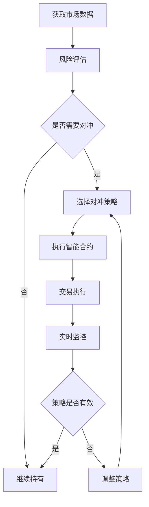

# 特价股票投资中的智能合约自动化风险对冲策略

> 关键词：特价股票投资、智能合约、自动化风险对冲、策略设计、应用场景

> 摘要：本文聚焦于特价股票投资领域，深入探讨了如何运用智能合约实现自动化风险对冲策略。首先介绍了相关背景，包括目的、预期读者、文档结构和术语表。接着阐述了核心概念与联系，展示了其原理和架构的文本示意图及Mermaid流程图。详细讲解了核心算法原理并给出Python源代码示例，同时给出了数学模型和公式进行说明。通过项目实战，展示了开发环境搭建、源代码实现及解读。分析了实际应用场景，推荐了学习资源、开发工具框架和相关论文著作。最后总结了未来发展趋势与挑战，并提供了常见问题解答和扩展阅读参考资料。

## 1. 背景介绍 
### 1.1 目的和范围
在股票市场中，特价股票往往具有价格相对较低、潜在收益较高但同时风险也较大的特点。本研究的目的是设计一种基于智能合约的自动化风险对冲策略，以降低特价股票投资过程中的风险，提高投资的稳定性和收益的可预测性。

研究范围涵盖了特价股票的特征分析、智能合约的原理和应用、风险对冲策略的设计与实现，以及该策略在实际投资场景中的应用和效果评估。

### 1.2 预期读者
本文预期读者包括股票投资者，特别是对特价股票投资感兴趣的个人和机构投资者；区块链技术开发者和研究人员，关注智能合约在金融领域的应用；金融分析师和风险管理专家，希望探索新的风险对冲方法。

### 1.3 文档结构概述
本文将按照以下结构进行阐述：首先介绍相关核心概念与联系，让读者对特价股票、智能合约和风险对冲有清晰的认识；接着详细讲解核心算法原理和具体操作步骤，并给出Python代码示例；然后给出数学模型和公式进行理论支持；通过项目实战展示该策略的实际应用和代码实现；分析实际应用场景；推荐相关的学习资源、开发工具框架和论文著作；最后总结未来发展趋势与挑战，提供常见问题解答和扩展阅读参考资料。

### 1.4 术语表
#### 1.4.1 核心术语定义
- **特价股票**：指市场价格相对其内在价值或同行业其他股票价格较低的股票，可能由于公司短期业绩不佳、市场情绪等因素导致。
- **智能合约**：是一种以信息化方式传播、验证或执行合同的计算机协议。智能合约允许在没有第三方的情况下进行可信交易，这些交易可追踪且不可逆转。
- **风险对冲**：是指通过投资或购买与标的资产收益波动负相关的某种资产或衍生产品，来冲销标的资产潜在的风险损失的一种风险管理策略。

#### 1.4.2 相关概念解释
- **区块链**：是一个分布式的共享账本和数据库，具有去中心化、不可篡改、全程留痕、可以追溯、集体维护、公开透明等特点。智能合约通常基于区块链技术实现。
- **衍生品**：是一种金融工具，其价值取决于一种或多种基础资产，如股票、债券、商品等。常见的衍生品包括期货、期权等，可用于风险对冲。

#### 1.4.3 缩略词列表
- **ETF**：交易型开放式指数基金（Exchange Traded Fund）
- **OTC**：场外交易市场（Over - The - Counter）

## 2. 核心概念与联系 

### 核心概念原理
#### 特价股票
特价股票的形成原因较为复杂。一方面，公司可能面临短期的经营困境，如产品销售不畅、管理层变动等，导致市场对其未来预期悲观，股价下跌。另一方面，市场整体情绪低迷或行业竞争加剧也可能使部分股票价格被低估。投资者购买特价股票的动机在于期望公司未来经营状况改善，股价回升，从而获得超额收益。

#### 智能合约
智能合约基于区块链技术，其原理是将合约条款以代码的形式编写，并部署到区块链网络上。当满足预设的条件时，合约会自动执行相应的操作，无需人工干预。例如，在股票投资中，可以编写智能合约来自动执行买入、卖出或风险对冲操作。

#### 风险对冲
风险对冲的原理是通过构建投资组合，使不同资产之间的收益波动相互抵消。在特价股票投资中，可以通过购买与特价股票收益负相关的资产，如看跌期权、反向ETF等，来降低特价股票价格下跌带来的损失。

### 架构的文本示意图
```plaintext
特价股票投资风险对冲系统
|
|-- 数据源
|   |-- 股票市场数据（价格、成交量等）
|   |-- 宏观经济数据
|   |-- 公司财务数据
|
|-- 智能合约层
|   |-- 风险评估合约
|   |-- 交易执行合约
|   |-- 对冲策略合约
|
|-- 交易执行层
|   |-- 股票交易接口
|   |-- 衍生品交易接口
|
|-- 监控与反馈层
|   |-- 实时监控
|   |-- 策略调整
```

### Mermaid 流程图


## 3. 核心算法原理 & 具体操作步骤 

### 核心算法原理
本策略的核心算法基于风险评估和对冲策略选择。风险评估主要通过计算特价股票的波动率、贝塔系数等指标来衡量其风险程度。对冲策略选择则根据风险评估结果和市场情况，选择合适的对冲工具和比例。

### 具体操作步骤
1. **数据获取**：从股票市场数据源获取特价股票的历史价格、成交量等数据，以及宏观经济数据和公司财务数据。
2. **风险评估**：计算特价股票的波动率、贝塔系数等风险指标。
3. **对冲策略选择**：根据风险评估结果，选择合适的对冲工具，如看跌期权、反向ETF等，并确定对冲比例。
4. **智能合约编写**：将对冲策略以智能合约的形式编写，并部署到区块链网络上。
5. **交易执行**：当满足智能合约预设的条件时，自动执行交易操作。
6. **实时监控**：实时监控投资组合的风险状况和市场情况，根据监控结果调整策略。

### Python源代码示例
```python
import pandas as pd
import numpy as np
import yfinance as yf

# 步骤1：数据获取
def get_stock_data(ticker, start_date, end_date):
    data = yf.download(ticker, start=start_date, end=end_date)
    return data

# 步骤2：风险评估
def calculate_volatility(data):
    returns = data['Close'].pct_change()
    volatility = returns.std() * np.sqrt(252)
    return volatility

def calculate_beta(data, market_data):
    returns = data['Close'].pct_change()
    market_returns = market_data['Close'].pct_change()
    covariance = np.cov(returns[1:], market_returns[1:])[0, 1]
    market_variance = np.var(market_returns[1:])
    beta = covariance / market_variance
    return beta

# 步骤3：对冲策略选择
def select_hedge_strategy(volatility, beta):
    if volatility > 0.3 and beta > 1:
        # 高风险情况，选择看跌期权对冲
        return 'Put Option'
    elif volatility > 0.2 and beta > 0.8:
        # 中等风险情况，选择反向ETF对冲
        return 'Inverse ETF'
    else:
        # 低风险情况，不进行对冲
        return 'No Hedge'

# 示例调用
ticker = 'AAPL'
market_ticker = '^GSPC'
start_date = '2020-01-01'
end_date = '2021-01-01'

stock_data = get_stock_data(ticker, start_date, end_date)
market_data = get_stock_data(market_ticker, start_date, end_date)

volatility = calculate_volatility(stock_data)
beta = calculate_beta(stock_data, market_data)

hedge_strategy = select_hedge_strategy(volatility, beta)
print(f'Volatility: {volatility}, Beta: {beta}, Hedge Strategy: {hedge_strategy}')
```

## 4. 数学模型和公式 & 详细讲解 & 举例说明 

### 波动率计算
波动率是衡量股票价格波动程度的指标，通常使用年化标准差来计算。计算公式如下：
$$\sigma_{annual} = \sigma_{daily} \times \sqrt{T}$$
其中，$\sigma_{annual}$ 是年化波动率，$\sigma_{daily}$ 是日收益率的标准差，$T$ 是一年的交易日数量，通常取252。

**举例说明**：假设某特价股票的日收益率标准差为0.02，则其年化波动率为：
$$\sigma_{annual} = 0.02 \times \sqrt{252} \approx 0.317$$

### 贝塔系数计算
贝塔系数衡量了股票收益率相对于市场收益率的敏感性。计算公式如下：
$$\beta = \frac{Cov(R_i, R_m)}{Var(R_m)}$$
其中，$\beta$ 是贝塔系数，$Cov(R_i, R_m)$ 是股票 $i$ 的收益率与市场收益率的协方差，$Var(R_m)$ 是市场收益率的方差。

**举例说明**：假设某特价股票的收益率与市场收益率的协方差为0.001，市场收益率的方差为0.0008，则该股票的贝塔系数为：
$$\beta = \frac{0.001}{0.0008} = 1.25$$

### 对冲比例计算
对冲比例是指用于对冲的资产价值与特价股票投资价值的比例。在使用看跌期权进行对冲时，对冲比例可以根据期权的Delta值来确定。Delta值表示期权价格对标的资产价格变动的敏感性。计算公式如下：
$$Hedge Ratio = - \Delta \times \frac{V_{stock}}{V_{option}}$$
其中，$Hedge Ratio$ 是对冲比例，$\Delta$ 是期权的Delta值，$V_{stock}$ 是特价股票的投资价值，$V_{option}$ 是期权的价值。

**举例说明**：假设某特价股票的投资价值为100,000元，看跌期权的Delta值为 - 0.5，期权价值为10,000元，则对冲比例为：
$$Hedge Ratio = - (-0.5) \times \frac{100000}{10000} = 5$$
这意味着需要购买价值5倍于期权价值的看跌期权来进行对冲。

## 5. 项目实战：代码实际案例和详细解释说明 

### 5.1  开发环境搭建
#### 安装Python
首先需要安装Python 3.x版本。可以从Python官方网站（https://www.python.org/downloads/）下载并安装。

#### 安装必要的库
使用pip命令安装所需的库，包括`pandas`、`numpy`、`yfinance`等。
```sh
pip install pandas numpy yfinance
```

#### 区块链开发环境
如果要实现智能合约，还需要搭建区块链开发环境。以以太坊为例，可以使用Ganache作为本地测试网络，Truffle作为开发框架。

### 5.2  源代码详细实现和代码解读
```python
import pandas as pd
import numpy as np
import yfinance as yf
from web3 import Web3

# 步骤1：数据获取
def get_stock_data(ticker, start_date, end_date):
    data = yf.download(ticker, start=start_date, end=end_date)
    return data

# 步骤2：风险评估
def calculate_volatility(data):
    returns = data['Close'].pct_change()
    volatility = returns.std() * np.sqrt(252)
    return volatility

def calculate_beta(data, market_data):
    returns = data['Close'].pct_change()
    market_returns = market_data['Close'].pct_change()
    covariance = np.cov(returns[1:], market_returns[1:])[0, 1]
    market_variance = np.var(market_returns[1:])
    beta = covariance / market_variance
    return beta

# 步骤3：对冲策略选择
def select_hedge_strategy(volatility, beta):
    if volatility > 0.3 and beta > 1:
        # 高风险情况，选择看跌期权对冲
        return 'Put Option'
    elif volatility > 0.2 and beta > 0.8:
        # 中等风险情况，选择反向ETF对冲
        return 'Inverse ETF'
    else:
        # 低风险情况，不进行对冲
        return 'No Hedge'

# 步骤4：智能合约编写（简化示例）
def deploy_smart_contract(hedge_strategy):
    # 连接到以太坊网络
    w3 = Web3(Web3.HTTPProvider('http://127.0.0.1:7545'))
    # 这里省略合约编译、部署等详细步骤
    print(f'Deploying smart contract for {hedge_strategy}')
    return True

# 示例调用
ticker = 'AAPL'
market_ticker = '^GSPC'
start_date = '2020-01-01'
end_date = '2021-01-01'

stock_data = get_stock_data(ticker, start_date, end_date)
market_data = get_stock_data(market_ticker, start_date, end_date)

volatility = calculate_volatility(stock_data)
beta = calculate_beta(stock_data, market_data)

hedge_strategy = select_hedge_strategy(volatility, beta)
print(f'Volatility: {volatility}, Beta: {beta}, Hedge Strategy: {hedge_strategy}')

if hedge_strategy!= 'No Hedge':
    deployed = deploy_smart_contract(hedge_strategy)
    if deployed:
        print('Smart contract deployed successfully')
```

### 5.3  代码解读与分析
1. **数据获取部分**：使用`yfinance`库从雅虎财经获取特价股票和市场指数的历史数据。
2. **风险评估部分**：通过计算波动率和贝塔系数来评估特价股票的风险程度。
3. **对冲策略选择部分**：根据波动率和贝塔系数的结果，选择合适的对冲策略。
4. **智能合约部分**：使用`web3.py`库连接到以太坊网络，并部署智能合约。这里只是一个简化示例，实际开发中需要进行合约编译、部署等详细操作。

## 6. 实际应用场景 
### 个人投资者
个人投资者在投资特价股票时，由于资金和专业知识有限，面临较高的风险。使用智能合约自动化风险对冲策略，可以降低投资风险，提高投资的稳定性。例如，个人投资者可以通过智能合约自动购买看跌期权或反向ETF来对冲特价股票价格下跌的风险。

### 机构投资者
机构投资者通常管理着大量的资金，投资组合较为复杂。在投资特价股票时，需要更精确的风险控制。智能合约自动化风险对冲策略可以帮助机构投资者实时监控风险，并根据市场情况自动调整对冲策略。例如，基金公司可以使用智能合约来管理其特价股票投资组合的风险。

### 金融机构
金融机构如证券公司、银行等可以将智能合约自动化风险对冲策略应用于其客户服务中。为客户提供更专业的投资建议和风险对冲方案，提高客户满意度和忠诚度。例如，证券公司可以为客户开发基于智能合约的风险对冲产品。

## 7. 工具和资源推荐
### 7.1 学习资源推荐
#### 7.1.1 书籍推荐
- 《智能合约：原理、设计与应用》：全面介绍了智能合约的原理、设计方法和实际应用案例。
- 《股票投资学》：系统讲解了股票投资的基本理论和方法，包括风险评估和对冲策略。
- 《区块链技术原理与应用》：深入探讨了区块链技术的原理和应用，对理解智能合约的底层技术有很大帮助。

#### 7.1.2 在线课程
- Coursera上的“区块链基础”课程：介绍了区块链的基本概念、技术原理和应用场景。
- Udemy上的“Python金融数据分析”课程：教授如何使用Python进行金融数据的获取、分析和可视化。
- edX上的“金融风险管理”课程：系统学习金融风险评估和管理的方法和工具。

#### 7.1.3 技术博客和网站
- Medium：有很多关于区块链、智能合约和金融科技的优质博客文章。
- CoinDesk：专注于区块链和加密货币领域的新闻和技术分析。
- Seeking Alpha：提供股票投资分析和研究报告，对特价股票投资有一定的参考价值。

### 7.2 开发工具框架推荐
#### 7.2.1 IDE和编辑器
- PyCharm：功能强大的Python集成开发环境，适合开发Python代码。
- Visual Studio Code：轻量级的代码编辑器，支持多种编程语言和插件扩展。
- Remix：专门用于以太坊智能合约开发的在线编辑器。

#### 7.2.2 调试和性能分析工具
- Ganache：以太坊本地测试网络，用于智能合约的调试和测试。
- Truffle：以太坊开发框架，提供合约编译、部署、测试等功能。
- Py-Spy：Python性能分析工具，可用于分析Python代码的性能瓶颈。

#### 7.2.3 相关框架和库
- Web3.py：Python库，用于与以太坊区块链进行交互。
- Pandas：Python数据分析库，用于金融数据的处理和分析。
- NumPy：Python科学计算库，提供高效的数组操作和数学函数。

### 7.3 相关论文著作推荐
#### 7.3.1 经典论文
- “The Pricing of Options and Corporate Liabilities”（Black - Scholes期权定价模型）：奠定了期权定价的理论基础。
- “Capital Asset Pricing Model”（资本资产定价模型）：提出了风险与收益的关系模型。

#### 7.3.2 最新研究成果
- 关于区块链在金融风险管理中的应用研究，如“Blockchain - Based Risk Management in Financial Markets”。
- 智能合约在股票投资风险对冲中的实证研究，如“Automated Risk Hedging Strategies for Stock Investments Using Smart Contracts”。

#### 7.3.3 应用案例分析
- 一些金融机构或投资公司在实际应用智能合约进行风险对冲的案例分析报告，可从相关金融研究机构的网站获取。

## 8. 总结：未来发展趋势与挑战
### 未来发展趋势
- **技术融合**：智能合约将与人工智能、大数据等技术深度融合，实现更精准的风险评估和对冲策略选择。例如，利用人工智能算法对市场数据进行分析，预测股票价格走势，从而优化对冲策略。
- **应用拓展**：智能合约自动化风险对冲策略将不仅仅应用于股票投资领域，还将拓展到债券、期货、外汇等其他金融市场，为投资者提供更全面的风险管理方案。
- **监管完善**：随着智能合约在金融领域的广泛应用，监管机构将出台更加完善的法律法规，规范智能合约的开发和使用，保障投资者的合法权益。

### 挑战
- **技术难题**：智能合约的开发和部署需要具备较高的技术水平，同时区块链技术的性能和可扩展性也是制约其应用的关键因素。例如，以太坊网络的交易拥堵和高昂的手续费问题。
- **法律合规**：智能合约的法律地位和法律效力在不同国家和地区存在差异，需要解决法律合规问题，确保智能合约的执行具有合法性和可强制执行性。
- **市场波动**：股票市场的波动具有不确定性，即使采用了风险对冲策略，也不能完全消除投资风险。因此，需要不断优化对冲策略，提高应对市场波动的能力。

## 9. 附录：常见问题与解答
### 智能合约是否安全可靠？
智能合约基于区块链技术，具有去中心化、不可篡改等特点，在一定程度上保证了合约的安全性和可靠性。但是，智能合约的代码可能存在漏洞，需要进行严格的代码审计和测试。

### 如何选择合适的对冲工具？
选择合适的对冲工具需要考虑特价股票的风险程度、市场情况和投资者的风险偏好等因素。一般来说，高风险情况可以选择看跌期权等衍生工具进行对冲，中等风险情况可以选择反向ETF等。

### 智能合约的部署和维护成本高吗？
智能合约的部署和维护成本与所使用的区块链平台和开发工具有关。例如，以太坊网络的交易手续费可能较高，需要根据实际情况进行评估。

## 10. 扩展阅读 & 参考资料
### 扩展阅读
- 《金融科技前沿：区块链与智能合约》
- 《量化投资：策略与技术》

### 参考资料
- Yahoo Finance API文档
- Web3.py官方文档
- 以太坊官方文档

作者：AI天才研究院/AI Genius Institute & 禅与计算机程序设计艺术 /Zen And The Art of Computer Programming