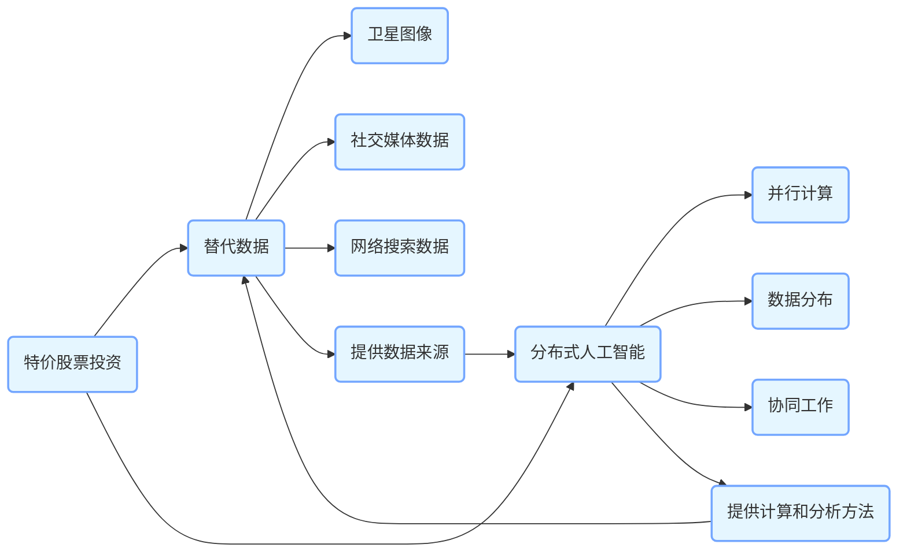

# 特价股票投资中的替代数据分析与分布式人工智能应用

> 关键词：特价股票投资、替代数据、分布式人工智能、数据分析、股票预测

> 摘要：本文聚焦于特价股票投资领域，深入探讨替代数据分析与分布式人工智能的应用。首先介绍相关背景知识，包括目的、预期读者等。接着阐述核心概念及联系，分析核心算法原理并给出Python实现步骤。通过数学模型和公式详细讲解，结合项目实战展示代码案例及解读。探讨实际应用场景，推荐相关工具和资源。最后总结未来发展趋势与挑战，提供常见问题解答和参考资料，旨在为投资者和技术人员提供全面的技术支持和决策依据。

## 1. 背景介绍 
### 1.1 目的和范围
在股票投资领域，特价股票由于其价格相对较低，往往蕴含着较高的投资潜力，但同时也伴随着更大的风险。传统的股票分析方法主要依赖于财务报表、市场指数等公开数据，然而这些数据往往具有滞后性，难以准确捕捉市场的实时变化和潜在机会。替代数据的出现为特价股票投资提供了新的视角和分析手段。替代数据是指除传统金融数据之外的各种数据来源，如卫星图像、社交媒体数据、网络搜索数据等，这些数据能够反映出更广泛的市场信息和经济趋势。

分布式人工智能则为处理大规模的替代数据提供了强大的计算能力和智能分析方法。通过将计算任务分布到多个节点上进行并行处理，分布式人工智能能够显著提高数据处理的效率和准确性，从而更好地挖掘替代数据中的价值信息。本文的目的在于深入探讨替代数据分析与分布式人工智能在特价股票投资中的应用，研究如何利用这些技术提高投资决策的准确性和收益率，同时降低投资风险。

本文的范围涵盖了替代数据的概念、来源和处理方法，分布式人工智能的基本原理和算法，以及如何将两者结合应用于特价股票投资的各个环节，包括股票筛选、风险评估、投资组合优化等。

### 1.2 预期读者
本文预期读者包括股票投资者、金融分析师、数据科学家、人工智能研究人员以及对金融科技和投资领域感兴趣的技术爱好者。对于股票投资者和金融分析师，本文将提供一种新的投资分析思路和方法，帮助他们更好地理解市场动态和挖掘投资机会；对于数据科学家和人工智能研究人员，本文将介绍替代数据和分布式人工智能在金融领域的具体应用场景和挑战，为他们的研究提供参考；对于技术爱好者，本文将展示金融科技领域的前沿技术和创新应用，激发他们的学习兴趣和探索欲望。

### 1.3 文档结构概述
本文将按照以下结构进行组织：
1. **背景介绍**：介绍本文的目的、范围、预期读者和文档结构概述，以及相关术语的定义和解释。
2. **核心概念与联系**：阐述替代数据、分布式人工智能的核心概念和原理，以及它们在特价股票投资中的联系和应用。
3. **核心算法原理 & 具体操作步骤**：详细介绍替代数据分析和分布式人工智能的核心算法原理，并给出Python源代码实现和具体操作步骤。
4. **数学模型和公式 & 详细讲解 & 举例说明**：通过数学模型和公式对替代数据分析和分布式人工智能的原理进行详细讲解，并结合实际案例进行说明。
5. **项目实战：代码实际案例和详细解释说明**：通过一个实际的项目案例，展示替代数据分析和分布式人工智能在特价股票投资中的具体应用，包括开发环境搭建、源代码实现和代码解读。
6. **实际应用场景**：探讨替代数据分析和分布式人工智能在特价股票投资中的实际应用场景，如股票筛选、风险评估、投资组合优化等。
7. **工具和资源推荐**：推荐相关的学习资源、开发工具框架和论文著作，帮助读者进一步深入学习和研究。
8. **总结：未来发展趋势与挑战**：总结替代数据分析和分布式人工智能在特价股票投资中的应用现状和未来发展趋势，分析面临的挑战和解决方案。
9. **附录：常见问题与解答**：提供常见问题的解答，帮助读者解决在学习和应用过程中遇到的问题。
10. **扩展阅读 & 参考资料**：提供相关的扩展阅读材料和参考资料，方便读者进一步深入学习和研究。

### 1.4 术语表
#### 1.4.1 核心术语定义
- **特价股票**：指价格相对较低的股票，通常具有较高的投资潜力和风险。
- **替代数据**：除传统金融数据之外的各种数据来源，如卫星图像、社交媒体数据、网络搜索数据等，能够反映出更广泛的市场信息和经济趋势。
- **分布式人工智能**：将人工智能算法分布到多个节点上进行并行处理，以提高计算效率和准确性的技术。
- **数据分析**：对数据进行收集、整理、分析和解释的过程，以发现数据中的规律和价值信息。
- **股票预测**：通过对历史数据和市场信息的分析，预测股票价格的未来走势。

#### 1.4.2 相关概念解释
- **大数据**：指海量、高增长率和多样化的信息资产，需要新处理模式才能具有更强的决策力、洞察发现力和流程优化能力。
- **机器学习**：一门多领域交叉学科，涉及概率论、统计学、逼近论、凸分析、算法复杂度理论等多门学科。它专门研究计算机怎样模拟或实现人类的学习行为，以获取新的知识或技能，重新组织已有的知识结构使之不断改善自身的性能。
- **深度学习**：机器学习的一个分支领域，它试图使用包含复杂结构或由多重非线性变换构成的多个处理层对数据进行高层抽象的算法。

#### 1.4.3 缩略词列表
- **AI**：Artificial Intelligence，人工智能
- **ML**：Machine Learning，机器学习
- **DL**：Deep Learning，深度学习
- **Hadoop**：一个由Apache基金会所开发的分布式系统基础架构，用于存储和处理大规模数据。
- **Spark**：一个快速、通用的集群计算系统，用于大规模数据处理和分析。

## 2. 核心概念与联系 

### 替代数据的概念和原理
替代数据是指除传统金融数据（如财务报表、市场指数等）之外的各种数据来源。这些数据可以从多个渠道获取，包括但不限于以下几种：
- **卫星图像**：通过分析卫星图像可以获取关于企业的生产活动、物流情况、库存水平等信息。例如，通过观察某工厂的停车场车辆数量和货物运输情况，可以推断该企业的生产和销售状况。
- **社交媒体数据**：社交媒体平台上的用户言论和情绪可以反映出公众对某只股票或某个行业的看法和预期。例如，通过分析推特上关于某公司的讨论热度和情感倾向，可以预测该公司股票的短期走势。
- **网络搜索数据**：网络搜索数据可以反映出公众对某只股票或某个行业的关注度和兴趣程度。例如，通过分析谷歌搜索趋势中关于某公司的搜索量变化，可以预测该公司股票的市场需求。

替代数据的原理在于，这些非传统数据能够反映出更广泛的市场信息和经济趋势，从而为股票投资提供更全面的分析视角。传统金融数据往往具有滞后性，而替代数据可以实时反映市场的变化和潜在机会。

### 分布式人工智能的概念和原理
分布式人工智能是将人工智能算法分布到多个节点上进行并行处理的技术。其核心思想是通过将计算任务分解为多个子任务，并将这些子任务分配到不同的计算节点上进行并行处理，从而提高计算效率和准确性。

分布式人工智能的原理基于以下几个方面：
- **并行计算**：多个计算节点同时处理不同的子任务，从而大大缩短计算时间。
- **数据分布**：将大规模的数据分布到多个节点上进行存储和处理，避免单个节点的存储和计算瓶颈。
- **协同工作**：各个计算节点之间通过网络进行通信和协作，共同完成复杂的计算任务。

常见的分布式人工智能框架包括Hadoop、Spark等。这些框架提供了分布式存储、分布式计算和分布式机器学习等功能，能够支持大规模数据的处理和分析。

### 替代数据与分布式人工智能在特价股票投资中的联系
在特价股票投资中，替代数据和分布式人工智能有着密切的联系。替代数据为分布式人工智能提供了丰富的数据来源，而分布式人工智能则为替代数据的处理和分析提供了强大的计算能力和智能分析方法。

具体来说，替代数据的大规模和多样性使得传统的数据分析方法难以处理，而分布式人工智能的并行计算和数据分布特性能够有效地解决这个问题。通过将替代数据分布到多个节点上进行存储和处理，并利用分布式人工智能算法对数据进行分析和挖掘，可以快速准确地提取出有价值的信息，从而为特价股票投资决策提供支持。

### 文本示意图
```plaintext
特价股票投资
|
|-- 替代数据
|   |-- 卫星图像
|   |-- 社交媒体数据
|   |-- 网络搜索数据
|
|-- 分布式人工智能
|   |-- 并行计算
|   |-- 数据分布
|   |-- 协同工作
|
|-- 联系
|   |-- 替代数据为分布式人工智能提供数据来源
|   |-- 分布式人工智能为替代数据处理提供计算能力和分析方法
```

### Mermaid流程图


## 3. 核心算法原理 & 具体操作步骤 

### 替代数据分析的核心算法原理
替代数据分析的核心算法主要包括数据清洗、特征提取和模型训练三个步骤。

#### 数据清洗
数据清洗是指对原始数据进行预处理，去除噪声、缺失值和异常值等，以提高数据的质量和可用性。常见的数据清洗方法包括：
- **缺失值处理**：可以采用删除缺失值、填充缺失值（如均值填充、中位数填充等）等方法。
- **异常值处理**：可以采用基于统计的方法（如Z-score法、IQR法等）或基于机器学习的方法（如聚类算法、孤立森林等）来检测和处理异常值。

#### 特征提取
特征提取是指从原始数据中提取出有价值的特征，以便后续的模型训练。常见的特征提取方法包括：
- **统计特征提取**：如均值、方差、标准差等。
- **文本特征提取**：如词频-逆文档频率（TF-IDF）、词嵌入等。
- **图像特征提取**：如尺度不变特征变换（SIFT）、加速稳健特征（SURF）等。

#### 模型训练
模型训练是指使用清洗和提取后的特征数据来训练机器学习或深度学习模型，以预测股票价格或评估股票风险。常见的模型包括：
- **线性回归模型**：用于预测股票价格的线性变化趋势。
- **逻辑回归模型**：用于分类股票的涨跌情况。
- **决策树模型**：用于分析股票的特征重要性和决策规则。
- **神经网络模型**：如多层感知机（MLP）、循环神经网络（RNN）、长短期记忆网络（LSTM）等，用于处理复杂的时间序列数据和非线性关系。

### 分布式人工智能的核心算法原理
分布式人工智能的核心算法主要包括分布式机器学习和分布式深度学习两个方面。

#### 分布式机器学习
分布式机器学习是指将机器学习算法分布到多个节点上进行并行处理的技术。常见的分布式机器学习算法包括：
- **分布式梯度下降算法**：通过将梯度计算任务分布到多个节点上进行并行计算，从而加速模型训练过程。
- **分布式随机森林算法**：通过将决策树的训练任务分布到多个节点上进行并行计算，从而提高随机森林模型的训练效率和准确性。

#### 分布式深度学习
分布式深度学习是指将深度学习算法分布到多个节点上进行并行处理的技术。常见的分布式深度学习算法包括：
- **数据并行算法**：将训练数据分布到多个节点上，每个节点独立计算梯度，然后将梯度汇总到主节点进行参数更新。
- **模型并行算法**：将深度学习模型的不同层分布到多个节点上，每个节点负责计算一部分模型参数的梯度，然后将梯度汇总到主节点进行参数更新。

### Python源代码实现和具体操作步骤

#### 数据清洗示例
```python
import pandas as pd
import numpy as np

# 生成示例数据
data = {
    'col1': [1, 2, np.nan, 4, 5],
    'col2': [6, np.nan, 8, 9, 10],
    'col3': [11, 12, 13, np.nan, 15]
}
df = pd.DataFrame(data)

# 处理缺失值：均值填充
df.fillna(df.mean(), inplace=True)

# 处理异常值：Z-score法
z_scores = np.abs((df - df.mean()) / df.std())
df = df[(z_scores < 3).all(axis=1)]

print(df)
```

#### 特征提取示例
```python
from sklearn.feature_extraction.text import TfidfVectorizer

# 生成示例文本数据
corpus = [
    'This is the first document.',
    'This document is the second document.',
    'And this is the third one.',
    'Is this the first document?'
]

# 提取文本特征：TF-IDF
vectorizer = TfidfVectorizer()
X = vectorizer.fit_transform(corpus)

print(X.toarray())
```

#### 模型训练示例
```python
from sklearn.linear_model import LinearRegression
from sklearn.model_selection import train_test_split
from sklearn.metrics import mean_squared_error

# 生成示例数据
X = np.array([[1], [2], [3], [4], [5]])
y = np.array([2, 4, 6, 8, 10])

# 划分训练集和测试集
X_train, X_test, y_train, y_test = train_test_split(X, y, test_size=0.2, random_state=42)

# 训练线性回归模型
model = LinearRegression()
model.fit(X_train, y_train)

# 预测并评估模型
y_pred = model.predict(X_test)
mse = mean_squared_error(y_test, y_pred)

print('Mean Squared Error:', mse)
```

#### 分布式机器学习示例（使用Dask）
```python
import dask.array as da
from dask_ml.linear_model import LinearRegression

# 生成示例数据
X = da.random.random((1000, 10), chunks=(100, 10))
y = da.random.random(1000, chunks=(100,))

# 训练分布式线性回归模型
model = LinearRegression()
model.fit(X, y)

print('Coefficients:', model.coef_)
```

## 4. 数学模型和公式 & 详细讲解 & 举例说明 

### 线性回归模型
线性回归模型是一种用于预测连续变量的统计模型，其基本形式为：
$$y = \beta_0 + \beta_1x_1 + \beta_2x_2 + \cdots + \beta_nx_n + \epsilon$$
其中，$y$ 是因变量，$x_1, x_2, \cdots, x_n$ 是自变量，$\beta_0, \beta_1, \beta_2, \cdots, \beta_n$ 是模型的系数，$\epsilon$ 是误差项。

线性回归模型的目标是通过最小化误差项的平方和来估计模型的系数，即最小化以下损失函数：
$$J(\beta) = \frac{1}{2m}\sum_{i=1}^{m}(y^{(i)} - \hat{y}^{(i)})^2$$
其中，$m$ 是样本数量，$y^{(i)}$ 是第 $i$ 个样本的真实值，$\hat{y}^{(i)}$ 是第 $i$ 个样本的预测值。

可以使用梯度下降算法来求解最小化损失函数的问题，梯度下降算法的更新公式为：
$$\beta_j := \beta_j - \alpha\frac{\partial J(\beta)}{\partial \beta_j}$$
其中，$\alpha$ 是学习率，$\frac{\partial J(\beta)}{\partial \beta_j}$ 是损失函数关于 $\beta_j$ 的偏导数。

### 举例说明
假设有一组数据，包含房屋面积和房屋价格两个变量，我们希望通过线性回归模型来预测房屋价格。

| 房屋面积 ($x$) | 房屋价格 ($y$) |
| --- | --- |
| 100 | 200000 |
| 150 | 300000 |
| 200 | 400000 |
| 250 | 500000 |
| 300 | 600000 |

我们可以使用Python代码来实现线性回归模型：
```python
import numpy as np

# 输入数据
X = np.array([100, 150, 200, 250, 300])
y = np.array([200000, 300000, 400000, 500000, 600000])

# 数据预处理
X = X.reshape(-1, 1)

# 训练线性回归模型
from sklearn.linear_model import LinearRegression
model = LinearRegression()
model.fit(X, y)

# 预测