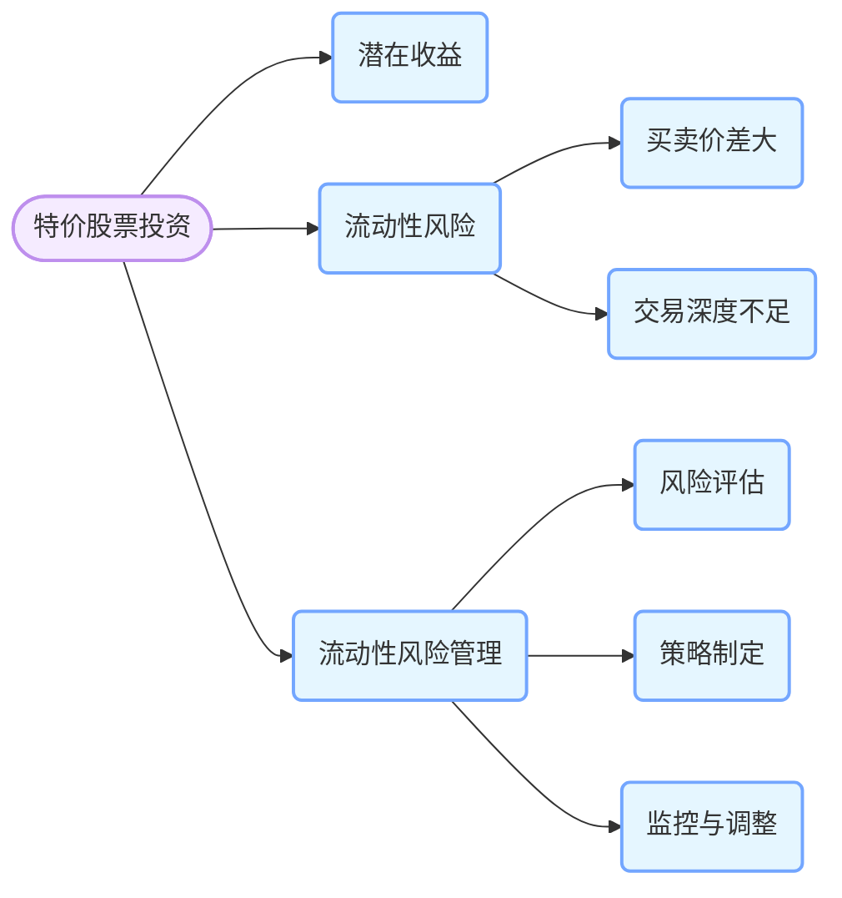

# 特价股票投资中的流动性风险管理

> 关键词：特价股票、流动性风险、风险管理、投资策略、市场分析

> 摘要：本文聚焦于特价股票投资中的流动性风险管理。首先介绍了特价股票投资及流动性风险的背景知识，明确文章的目的、范围和预期读者。接着阐述了相关核心概念及其联系，通过Mermaid流程图进行清晰展示。详细讲解了核心算法原理，并给出Python源代码示例。运用数学模型和公式对流动性风险进行量化分析，并举例说明。通过项目实战展示代码实现和解读。探讨了特价股票投资流动性风险管理在不同场景下的实际应用。推荐了学习资源、开发工具框架和相关论文著作。最后总结了未来发展趋势与挑战，解答常见问题，并提供扩展阅读和参考资料，旨在为投资者在特价股票投资中有效管理流动性风险提供全面且深入的指导。

## 1. 背景介绍 
### 1.1 目的和范围
在金融市场中，特价股票由于其价格相对较低，往往吸引了众多投资者的关注。然而，特价股票投资伴随着较高的流动性风险，即投资者在需要买卖股票时，可能无法以合理的价格迅速成交。本文的目的在于深入探讨特价股票投资中的流动性风险管理问题，旨在为投资者提供全面的理论知识、实用的分析方法和有效的管理策略，帮助他们在追求特价股票潜在收益的同时，尽可能降低流动性风险带来的损失。

文章的范围涵盖了特价股票和流动性风险的基本概念、核心算法原理、数学模型分析、项目实战案例、实际应用场景以及相关的工具和资源推荐等方面，力求为读者呈现一个完整的特价股票投资流动性风险管理体系。

### 1.2 预期读者
本文预期读者主要包括对特价股票投资感兴趣的个人投资者、金融机构的投资经理和分析师、金融专业的学生以及从事金融研究的学者。对于个人投资者，文章可以帮助他们更好地理解特价股票投资的风险特征，掌握流动性风险管理的方法，从而做出更明智的投资决策；金融机构的专业人员可以从中获取新的分析思路和管理策略，优化投资组合；金融专业的学生和研究学者则可以将其作为学习和研究金融市场风险的参考资料。

### 1.3 文档结构概述
本文将按照以下结构进行组织：首先介绍相关背景知识，包括目的、范围、预期读者和术语表；接着阐述核心概念及其联系，通过文本示意图和Mermaid流程图进行清晰展示；然后详细讲解核心算法原理，并给出Python源代码示例；运用数学模型和公式对流动性风险进行量化分析，并举例说明；通过项目实战展示代码实现和解读；探讨实际应用场景；推荐学习资源、开发工具框架和相关论文著作；最后总结未来发展趋势与挑战，解答常见问题，并提供扩展阅读和参考资料。

### 1.4 术语表
#### 1.4.1 核心术语定义
- **特价股票**：指市场价格相对较低的股票，通常由于公司业绩不佳、行业前景不明朗、市场情绪等因素导致股价处于低位。
- **流动性风险**：指金融资产持有者在需要变现时，无法以合理的价格迅速成交的风险。在股票投资中，表现为买卖价差过大、交易深度不足等情况。
- **买卖价差**：指股票买入价和卖出价之间的差额，是衡量股票流动性的重要指标之一。买卖价差越大，说明股票的流动性越差。
- **交易深度**：指在一定价格范围内，市场能够容纳的交易量。交易深度越大，说明市场能够承受较大的交易量而不会对价格产生较大影响，股票的流动性越好。

#### 1.4.2 相关概念解释
- **流动性溢价**：由于流动性较差的资产需要投资者承担更高的风险，因此在定价时会给予一定的补偿，即流动性溢价。在特价股票投资中，流动性溢价表现为投资者要求更高的预期收益率。
- **市场冲击成本**：指投资者在进行大额交易时，由于交易行为对市场价格产生的影响而导致的额外成本。在流动性较差的市场中，市场冲击成本较高。

#### 1.4.3 缩略词列表
- **VWAP**：Volume - Weighted Average Price，成交量加权平均价格，是一种常用的交易成本衡量指标。
- **ADV**：Average Daily Volume，平均每日成交量，反映股票的日均交易活跃程度。

## 2. 核心概念与联系 
### 核心概念原理
特价股票投资和流动性风险管理涉及多个核心概念，它们之间相互关联，共同影响着投资决策和风险控制。

特价股票的吸引力在于其潜在的价格上涨空间。由于价格较低，一旦公司基本面改善或市场环境好转，股价可能会出现较大幅度的上涨，为投资者带来丰厚的回报。然而，特价股票往往伴随着较高的流动性风险。这是因为市场对这类股票的关注度较低，买卖双方的交易意愿不强烈，导致交易不活跃，买卖价差较大，交易深度不足。

流动性风险的存在会对投资产生多方面的影响。首先，较高的买卖价差会增加交易成本，降低投资收益。其次，在需要快速变现时，由于交易深度不足，可能无法以合理的价格卖出股票，导致投资者遭受损失。因此，在特价股票投资中，必须对流动性风险进行有效的管理。

### 架构的文本示意图
```plaintext
特价股票投资
|
|-- 潜在收益：价格上涨空间
|
|-- 流动性风险
|   |
|   |-- 买卖价差大
|   |-- 交易深度不足
|
|-- 流动性风险管理
|   |
|   |-- 风险评估
|   |-- 策略制定
|   |-- 监控与调整
```

### Mermaid流程图


## 3. 核心算法原理 & 具体操作步骤 
### 核心算法原理
在特价股票投资的流动性风险管理中，一个重要的目标是评估股票的流动性水平，并根据评估结果制定相应的投资策略。这里我们介绍一种基于成交量和买卖价差的流动性评估算法。

该算法的基本思想是综合考虑股票的成交量和买卖价差，计算一个流动性指标。成交量越大，说明股票的交易越活跃；买卖价差越小，说明股票的流动性越好。通过将这两个因素结合起来，可以更全面地评估股票的流动性。

### 具体操作步骤
1. **数据收集**：收集特价股票的历史交易数据，包括每日成交量、买入价和卖出价。
2. **计算买卖价差**：对于每个交易日，计算买入价和卖出价之间的差额，即买卖价差。
3. **计算成交量加权平均买卖价差**：将每个交易日的买卖价差乘以该日的成交量，然后求和，再除以总成交量，得到成交量加权平均买卖价差（VWAP - Spread）。
4. **计算流动性指标**：将成交量加权平均买卖价差取倒数，得到流动性指标。流动性指标越大，说明股票的流动性越好。

### Python源代码示例
```python
import pandas as pd

def calculate_liquidity_metric(data):
    """
    计算流动性指标
    :param data: 包含日期、成交量、买入价、卖出价的DataFrame
    :return: 流动性指标
    """
    # 计算买卖价差
    data['spread'] = data['ask_price'] - data['bid_price']
    # 计算成交量加权平均买卖价差
    vwap_spread = (data['spread'] * data['volume']).sum() / data['volume'].sum()
    # 计算流动性指标
    liquidity_metric = 1 / vwap_spread
    return liquidity_metric

# 示例数据
data = pd.DataFrame({
    'date': ['2023-01-01', '2023-01-02', '2023-01-03'],
    'volume': [1000, 2000, 1500],
    'bid_price': [9.9, 9.8, 9.95],
    'ask_price': [10.1, 10.2, 10.05]
})

# 计算流动性指标
liquidity = calculate_liquidity_metric(data)
print(f"流动性指标: {liquidity}")
```

在上述代码中，我们定义了一个`calculate_liquidity_metric`函数，用于计算流动性指标。首先，我们计算每个交易日的买卖价差，然后计算成交量加权平均买卖价差，最后取倒数得到流动性指标。通过调用这个函数，我们可以对给定的特价股票数据进行流动性评估。

## 4. 数学模型和公式 & 详细讲解 & 举例说明 
### 数学模型和公式
#### 买卖价差
买卖价差 $S$ 可以表示为：
$$S = A - B$$
其中，$A$ 为卖出价，$B$ 为买入价。

#### 成交量加权平均买卖价差（VWAP - Spread）
设 $S_i$ 为第 $i$ 个交易日的买卖价差，$V_i$ 为第 $i$ 个交易日的成交量，$n$ 为交易日的总数，则成交量加权平均买卖价差 $VWAP - S$ 为：
$$VWAP - S=\frac{\sum_{i = 1}^{n}S_iV_i}{\sum_{i = 1}^{n}V_i}$$

#### 流动性指标
流动性指标 $L$ 为成交量加权平均买卖价差的倒数：
$$L=\frac{1}{VWAP - S}$$

### 详细讲解
- **买卖价差**：买卖价差反映了投资者在交易股票时需要支付的额外成本。买卖价差越大，投资者的交易成本越高，股票的流动性越差。
- **成交量加权平均买卖价差**：通过对每个交易日的买卖价差进行成交量加权，考虑了不同交易日成交量的差异，更准确地反映了股票在一段时间内的平均买卖价差情况。
- **流动性指标**：流动性指标是成交量加权平均买卖价差的倒数，指标值越大，说明股票的流动性越好。这是因为当买卖价差较小时，其倒数会较大，意味着股票的交易成本较低，交易更活跃。

### 举例说明
假设我们有某特价股票在三个交易日的交易数据如下：

| 日期 | 成交量 | 买入价 | 卖出价 |
|------|--------|--------|--------|
| 2023 - 01 - 01 | 1000 | 9.9 | 10.1 |
| 2023 - 01 - 02 | 2000 | 9.8 | 10.2 |
| 2023 - 01 - 03 | 1500 | 9.95 | 10.05 |

1. **计算买卖价差**
    - 2023 - 01 - 01：$S_1 = 10.1 - 9.9 = 0.2$
    - 2023 - 01 - 02：$S_2 = 10.2 - 9.8 = 0.4$
    - 2023 - 01 - 03：$S_3 = 10.05 - 9.95 = 0.1$

2. **计算成交量加权平均买卖价差**
$$\sum_{i = 1}^{3}S_iV_i=0.2\times1000 + 0.4\times2000+0.1\times1500=200 + 800 + 150 = 1150$$
$$\sum_{i = 1}^{3}V_i=1000 + 2000+1500 = 4500$$
$$VWAP - S=\frac{1150}{4500}\approx0.256$$

3. **计算流动性指标**
$$L=\frac{1}{0.256}\approx3.906$$

通过以上计算，我们得到了该特价股票的流动性指标约为 3.906。这个指标可以帮助我们评估该股票的流动性水平，并与其他股票进行比较。

## 5. 项目实战：代码实际案例和详细解释说明 
### 5.1  开发环境搭建
在进行特价股票投资流动性风险管理的项目实战时，我们需要搭建相应的开发环境。以下是具体步骤：

#### 安装Python
Python是一种功能强大且易于学习的编程语言，广泛应用于数据分析和金融领域。我们可以从Python官方网站（https://www.python.org/downloads/）下载并安装适合自己操作系统的Python版本。建议安装Python 3.7及以上版本。

#### 安装必要的库
在Python中，有许多库可以帮助我们进行数据处理、分析和可视化。在本项目中，我们需要安装以下库：
- **pandas**：用于数据处理和分析。
- **numpy**：用于数值计算。
- **matplotlib**：用于数据可视化。

可以使用以下命令来安装这些库：
```sh
pip install pandas numpy matplotlib
```

### 5.2  源代码详细实现和代码解读
以下是一个完整的项目实战代码示例，用于对特价股票的流动性进行评估和分析：

```python
import pandas as pd
import numpy as np
import matplotlib.pyplot as plt

def calculate_liquidity_metric(data):
    """
    计算流动性指标
    :param data: 包含日期、成交量、买入价、卖出价的DataFrame
    :return: 流动性指标
    """
    # 计算买卖价差
    data['spread'] = data['ask_price'] - data['bid_price']
    # 计算成交量加权平均买卖价差
    vwap_spread = (data['spread'] * data['volume']).sum() / data['volume'].sum()
    # 计算流动性指标
    liquidity_metric = 1 / vwap_spread
    return liquidity_metric

def analyze_liquidity_over_time(data):
    """
    分析流动性随时间的变化
    :param data: 包含日期、成交量、买入价、卖出价的DataFrame
    :return: 包含流动性指标的DataFrame
    """
    liquidity_data = []
    for i in range(30, len(data)):
        subset = data.iloc[i - 30:i]
        liquidity = calculate_liquidity_metric(subset)
        liquidity_data.append({
            'date': data.iloc[i]['date'],
            'liquidity': liquidity
        })
    liquidity_df = pd.DataFrame(liquidity_data)
    return liquidity_df

def plot_liquidity(liquidity_df):
    """
    绘制流动性随时间的变化图
    :param liquidity_df: 包含流动性指标的DataFrame
    """
    plt.figure(figsize=(12, 6))
    plt.plot(liquidity_df['date'], liquidity_df['liquidity'])
    plt.title('Liquidity over Time')
    plt.xlabel('Date')
    plt.ylabel('Liquidity Metric')
    plt.xticks(rotation=45)
    plt.show()

# 读取示例数据
data = pd.read_csv('stock_data.csv')

# 计算流动性指标
liquidity = calculate_liquidity_metric(data)
print(f"Overall Liquidity Metric: {liquidity}")

# 分析流动性随时间的变化
liquidity_df = analyze_liquidity_over_time(data)

# 绘制流动性随时间的变化图
plot_liquidity(liquidity_df)
```

### 代码解读与分析
#### `calculate_liquidity_metric`函数
该函数用于计算流动性指标。首先，计算每个交易日的买卖价差，然后计算成交量加权平均买卖价差，最后取倒数得到流动性指标。

#### `analyze_liquidity_over_time`函数
该函数用于分析流动性随时间的变化。通过滑动窗口的方式，每次取30天的数据计算流动性指标，并将结果存储在一个列表中。最后，将列表转换为DataFrame并返回。

#### `plot_liquidity`函数
该函数用于绘制流动性随时间的变化图。使用`matplotlib`库将流动性指标随日期的变化情况可视化，帮助我们直观地观察流动性的变化趋势。

#### 主程序部分
首先，读取示例数据文件`stock_data.csv`。然后，调用`calculate_liquidity_metric`函数计算整体的流动性指标并打印输出。接着，调用`analyze_liquidity_over_time`函数分析流动性随时间的变化，并将结果存储在`liquidity_df`中。最后，调用`plot_liquidity`函数绘制流动性随时间的变化图。

通过这个项目实战，我们可以对特价股票的流动性进行全面的评估和分析，为投资决策提供有力的支持。

## 6. 实际应用场景 
### 个人投资者
对于个人投资者来说，在进行特价股票投资时，流动性风险管理至关重要。个人投资者通常资金规模较小，风险承受能力相对较低。如果投资的特价股票流动性较差，在需要变现时可能无法及时卖出，导致资金被套牢。

例如，小李是一位个人投资者，他购买了一只特价股票。一段时间后，由于家庭突发情况，他需要资金。然而，该股票的买卖价差非常大，交易深度不足，他很难以合理的价格卖出股票，最终不得不以较低的价格出售，遭受了较大的损失。

因此，个人投资者在选择特价股票时，应该充分考虑股票的流动性。可以通过分析股票的成交量、买卖价差等指标来评估流动性水平。同时，合理控制投资比例，避免将过多资金投入到流动性较差的股票中。

### 金融机构
金融机构在进行投资组合管理时，也需要关注特价股票的流动性风险。金融机构通常管理着大量的资金，其投资决策会对市场产生较大的影响。如果金融机构持有大量流动性较差的特价股票，在市场出现波动时，可能会面临较大的变现压力。

例如，某基金公司持有大量某只特价股票。当市场行情不佳时，投资者纷纷赎回基金份额，基金公司需要卖出股票来筹集资金。但由于该股票流动性较差，大量卖出会导致股价大幅下跌，进一步增加了基金公司的损失。

为了管理流动性风险，金融机构可以采用多元化投资策略，分散投资于不同流动性水平的股票。同时，建立完善的流动性风险管理体系，实时监控投资组合的流动性状况，及时调整投资策略。

### 监管机构
监管机构在维护金融市场稳定方面发挥着重要作用。特价股票投资中的流动性风险可能会引发市场的不稳定，因此监管机构需要对相关市场进行监管。

监管机构可以制定相关的法律法规和政策，规范特价股票的交易行为。例如，要求上市公司及时披露财务信息，提高市场透明度，增强投资者对特价股票的了解。同时，加强对证券公司等金融机构的监管，要求其建立健全的流动性风险管理机制，防范系统性风险。

## 7. 工具和资源推荐
### 7.1 学习资源推荐
#### 7.1.1 书籍推荐
- 《金融市场与金融机构》：这本书全面介绍了金融市场的各种组成部分和金融机构的运作方式，对于理解特价股票投资和流动性风险具有重要的参考价值。
- 《投资学》：涵盖了投资的基本理论、方法和策略，包括股票投资、风险管理等内容，是投资领域的经典教材。
- 《量化投资：策略与技术》：介绍了量化投资的基本概念、方法和技术，对于运用量化手段进行特价股票投资的流动性风险管理具有指导意义。

#### 7.1.2 在线课程
- Coursera上的“Financial Markets”课程：由耶鲁大学教授罗伯特·席勒（Robert Shiller）授课，讲解了金融市场的基本原理和投资策略。
- edX上的“Investment Management”课程：提供了投资管理的全面知识，包括资产配置、风险管理等内容。
- 中国大学MOOC上的“金融风险管理”课程：结合中国金融市场的实际情况，介绍了金融风险管理的理论和方法。

#### 7.1.3 技术博客和网站
- Seeking Alpha：提供了大量的金融市场分析和投资研究文章，包括特价股票的分析和评论。
- Bloomberg：全球知名的金融信息服务提供商，提供实时的金融市场数据、新闻和分析。
- 雪球：国内知名的投资社区，投资者可以在上面交流投资经验、分享研究成果。

### 7.2 开发工具框架推荐
#### 7.2.1 IDE和编辑器
- PyCharm：一款专业的Python集成开发环境，具有代码编辑、调试、版本控制等功能，适合进行数据分析和金融编程。
- Jupyter Notebook：一种交互式的开发环境，支持Python等多种编程语言，方便进行数据探索和可视化。
- Visual Studio Code：一款轻量级的代码编辑器，具有丰富的插件生态系统，可以用于Python开发和数据分析。

#### 7.2.2 调试和性能分析工具
- pdb：Python自带的调试工具，可以帮助开发者逐步执行代码，查找和解决问题。
- cProfile：Python标准库中的性能分析工具，可以分析代码的运行时间和函数调用情况，帮助优化代码性能。
- Py-Spy：一个基于采样的Python性能分析工具，可以实时分析Python程序的性能瓶颈。

#### 7.2.3 相关框架和库
- Pandas：用于数据处理和分析的Python库，提供了高效的数据结构和数据分析工具。
- Numpy：用于数值计算的Python库，提供了高性能的多维数组对象和数学函数。
- Matplotlib：用于数据可视化的Python库，可以绘制各种类型的图表，帮助直观展示数据。

### 7.3 相关论文著作推荐
#### 7.3.1 经典论文
- “The Cost of Capital, Corporation Finance and the Theory of Investment” by Franco Modigliani and Merton H. Miller：该论文提出了著名的MM定理，对现代金融理论的发展产生了深远影响。
- “On the Pricing of Corporate Debt: The Risk Structure of Interest Rates” by Robert C. Merton：介绍了期权定价理论在公司债务定价中的应用，为信用风险评估提供了重要的理论基础。
- “Liquidity Preference as Behavior Towards Risk” by John Maynard Keynes：探讨了流动性偏好与风险行为之间的关系，对理解金融市场中的流动性现象具有重要意义。

#### 7.3.2 最新研究成果
- 关注顶级金融学术期刊，如《Journal of Finance》、《Review of Financial Studies》等，这些期刊发表了大量关于金融市场、投资和风险管理的最新研究成果。
- 参加金融学术会议，如美国金融协会（AFA）年会、西部金融协会（WFA）年会等，与国内外的学者和专家交流最新的研究进展。

#### 7.3.3 应用案例分析
- 研究金融机构的年度报告和风险管理报告，了解它们在特价股票投资和流动性风险管理方面的实践经验和案例。
- 关注金融媒体的报道，如《金融时报》、《华尔街日报》等，获取实际市场中的投资案例和分析。

## 8. 总结：未来发展趋势与挑战
### 未来发展趋势
#### 量化分析的应用将更加广泛
随着金融科技的不断发展，量化分析在特价股票投资的流动性风险管理中的应用将越来越广泛。投资者可以利用大数据、人工智能等技术，对海量的市场数据进行分析，更准确地评估股票的流动性风险，制定更优化的投资策略。

#### 跨市场和跨境投资增加
随着全球金融市场的一体化程度不断提高，投资者将更加关注跨市场和跨境的特价股票投资机会。这将带来更多的流动性风险管理挑战，需要投资者考虑不同市场的法律法规、交易规则和市场环境等因素。

#### 监管要求将更加严格
为了维护金融市场的稳定，监管机构将对特价股票投资的流动性风险管理提出更加严格的要求。金融机构需要建立更加完善的风险管理体系，加强对流动性风险的监测和控制。

### 挑战
#### 数据质量和可用性
量化分析依赖于大量的高质量数据。然而，在特价股票市场中，数据的质量和可用性可能存在问题。一些小市值的特价股票可能缺乏完整的历史交易数据，这会影响流动性风险评估的准确性。

#### 市场不确定性增加
金融市场充满了不确定性，特价股票市场更是如此。宏观经济环境的变化、政策调整、公司基本面的变化等因素都可能导致股票的流动性发生突然变化，增加了流动性风险管理的难度。

#### 技术更新换代快
金融科技的发展日新月异，新的技术和方法不断涌现。投资者需要不断学习和更新自己的知识和技能，以适应技术的发展和市场的变化。

## 9. 附录：常见问题与解答
### 问题1：如何判断一只特价股票的流动性是否足够？
解答：可以通过以下几个指标来判断特价股票的流动性：
- **成交量**：成交量越大，说明股票的交易越活跃，流动性越好。可以关注股票的平均每日成交量，并与同行业的其他股票进行比较。
- **买卖价差**：买卖价差越小，说明股票的流动性越好。可以观察股票的实时买卖价差，并分析其历史变化情况。
- **交易深度**：交易深度可以通过观察盘口数据来判断。盘口上的买卖挂单数量越多，说明交易深度越大，股票的流动性越好。

### 问题2：在特价股票投资中，如何降低流动性风险？
解答：可以采取以下措施降低流动性风险：
- **分散投资**：不要将所有资金集中投资于一只或几只流动性较差的特价股票，而是分散投资于不同行业、不同市值的股票，以降低单一股票流动性风险对投资组合的影响。
- **合理控制仓位**：根据自己的风险承受能力和投资目标，合理控制特价股票的投资仓位。避免过度投资流动性较差的股票。
- **关注市场动态**：及时关注市场的宏观经济环境、政策变化和公司基本面等信息，以便在市场出现不利变化时，能够及时调整投资策略。

### 问题3：量化分析在特价股票投资流动性风险管理中的优势是什么？
解答：量化分析在特价股票投资流动性风险管理中具有以下优势：
- **准确性高**：通过对大量历史数据的分析和建模，量化分析可以更准确地评估股票的流动性风险，为投资决策提供更科学的依据。
- **效率高**：量化分析可以自动化地处理大量数据，快速生成分析结果，提高投资决策的效率。
- **客观性强**：量化分析基于数据和模型，不受主观因素的影响，能够提供客观的投资建议。

## 10. 扩展阅读 & 参考资料
### 扩展阅读
- 《金融炼金术》：乔治·索罗斯（George Soros）的著作，介绍了他的投资哲学和交易策略，对于理解金融市场的运行机制和投资心理具有重要的启示。
- 《聪明的投资者》：本杰明·格雷厄姆（Benjamin Graham）的经典著作，强调了价值投资的理念和方法，对于特价股票投资具有重要的指导意义。
- 《黑天鹅：如何应对不可预知的未来》：纳西姆·尼古拉斯·塔勒布（Nassim Nicholas Taleb）的著作，探讨了不确定性和风险管理的问题，提醒投资者要关注市场中的极端事件。

### 参考资料
- 中国证券监督管理委员会官方网站：提供了中国证券市场的相关法律法规、政策文件和市场数据等信息。
- 上海证券交易所和深圳证券交易所官方网站：提供了股票交易的实时行情、上市公司公告等信息。
- 国际货币基金组织（IMF）和世界银行的官方网站：提供了全球金融市场的宏观经济数据和研究报告等信息。

作者：AI天才研究院/AI Genius Institute & 禅与计算机程序设计艺术 /Zen And The Art of Computer Programming