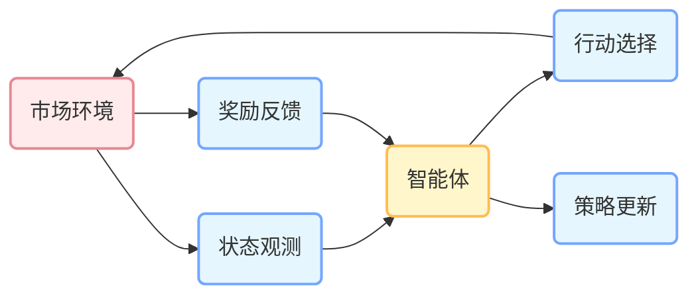

# 特价股票投资中的深度强化学习模型构建与优化

> 关键词：特价股票投资、深度强化学习、模型构建、模型优化、金融市场

> 摘要：本文聚焦于特价股票投资领域，深入探讨了如何运用深度强化学习技术构建和优化投资模型。首先介绍了相关背景知识，包括研究目的、预期读者、文档结构等。接着阐述了深度强化学习在股票投资中的核心概念及联系，给出了原理和架构的示意图与流程图。详细讲解了核心算法原理，并通过 Python 代码展示具体操作步骤。从数学角度分析了相关模型和公式，并举例说明。通过项目实战给出代码实际案例及详细解释。探讨了该模型在实际投资场景中的应用，推荐了相关学习资源、开发工具框架和论文著作。最后总结了未来发展趋势与挑战，并对常见问题进行了解答。

## 1. 背景介绍 
### 1.1 目的和范围
在金融市场中，特价股票往往蕴含着潜在的投资机会，但同时也伴随着较高的风险。传统的投资分析方法在处理复杂多变的市场信息时存在一定的局限性。深度强化学习作为一种强大的机器学习技术，能够通过智能体与环境的交互不断学习最优策略，为特价股票投资提供了新的思路和方法。本文的目的在于深入研究如何构建和优化基于深度强化学习的特价股票投资模型，以提高投资决策的准确性和收益率。范围涵盖了从核心概念的介绍到实际应用场景的探讨，以及相关工具和资源的推荐等方面。

### 1.2 预期读者
本文预期读者主要包括金融领域的投资者、量化分析师、机器学习和人工智能领域的研究人员和开发者，以及对特价股票投资和深度强化学习感兴趣的学生和爱好者。这些读者可能具有不同程度的金融和技术背景，本文将尽量以通俗易懂的方式进行讲解，同时也会深入探讨技术细节，以满足不同层次读者的需求。

### 1.3 文档结构概述
本文将按照以下结构进行组织：首先介绍背景知识，包括研究目的、预期读者和文档结构等；接着阐述深度强化学习在特价股票投资中的核心概念及联系，给出原理和架构的示意图与流程图；详细讲解核心算法原理，并通过 Python 代码展示具体操作步骤；从数学角度分析相关模型和公式，并举例说明；通过项目实战给出代码实际案例及详细解释；探讨该模型在实际投资场景中的应用；推荐相关学习资源、开发工具框架和论文著作；最后总结未来发展趋势与挑战，并对常见问题进行解答。

### 1.4 术语表
#### 1.4.1 核心术语定义
- **特价股票**：指价格相对其内在价值被低估的股票，通常具有较低的市盈率、市净率等估值指标。
- **深度强化学习**：一种将深度学习与强化学习相结合的技术，通过神经网络学习最优策略，以最大化长期累积奖励。
- **智能体（Agent）**：在深度强化学习中，智能体是能够感知环境状态并采取行动的实体，其目标是通过与环境的交互学习最优策略。
- **环境（Environment）**：智能体所处的外部世界，智能体的行动会影响环境状态，并从环境中获得奖励反馈。
- **状态（State）**：环境在某一时刻的特征描述，智能体根据当前状态选择行动。
- **行动（Action）**：智能体在某一状态下采取的决策，如买入、卖出或持有股票。
- **奖励（Reward）**：环境根据智能体的行动给予的反馈信号，用于评估行动的好坏，智能体的目标是最大化长期累积奖励。

#### 1.4.2 相关概念解释
- **策略（Policy）**：智能体选择行动的规则，通常表示为从状态到行动的映射。在深度强化学习中，策略可以通过神经网络进行参数化。
- **值函数（Value Function）**：用于评估在某一状态下采取某一行动或遵循某一策略的长期价值。常见的值函数包括状态值函数 $V(s)$ 和动作值函数 $Q(s,a)$。
- **经验回放（Experience Replay）**：一种用于解决深度强化学习中数据相关性问题的技术，将智能体与环境的交互经验存储在经验池中，训练时随机从经验池中采样数据进行学习。
- **探索与利用（Exploration vs. Exploitation）**：在深度强化学习中，智能体需要在探索新的行动以发现更好的策略和利用已有的经验之间进行平衡。

#### 1.4.3 缩略词列表
- **DQN**：Deep Q-Network，深度 Q 网络，一种基于深度强化学习的算法。
- **A2C**：Advantage Actor-Critic，优势演员 - 评论家算法，结合了策略梯度和值函数的强化学习算法。
- **PPO**：Proximal Policy Optimization，近端策略优化算法，一种高效的策略优化算法。

## 2. 核心概念与联系 

### 深度强化学习在特价股票投资中的原理
在特价股票投资中，深度强化学习的基本原理是将投资决策过程视为一个智能体与金融市场环境的交互过程。智能体（投资者或投资模型）通过观察市场状态（如股票价格、成交量、基本面指标等），选择合适的行动（买入、卖出或持有股票），并根据行动的结果从环境中获得奖励（如投资收益）。智能体的目标是通过不断与环境交互，学习到一个最优策略，使得长期累积奖励最大化。

### 架构示意图
以下是一个简化的深度强化学习在特价股票投资中的架构示意图：



### 流程图解释
1. **状态观测**：智能体从市场环境中获取当前的状态信息，包括股票价格、成交量、基本面指标等。
2. **行动选择**：智能体根据当前状态，依据其内部的策略选择一个行动，如买入、卖出或持有股票。
3. **环境响应**：智能体的行动会影响市场环境，环境根据行动的结果给出相应的奖励反馈，如投资收益。
4. **策略更新**：智能体根据奖励反馈更新其内部的策略，以提高未来的决策质量。

### 核心概念之间的联系
- 状态是智能体进行决策的依据，不同的状态会导致智能体选择不同的行动。
- 行动会改变环境状态，并影响奖励的获取。
- 奖励是智能体评估行动好坏的依据，智能体通过最大化长期累积奖励来优化策略。
- 策略决定了智能体在不同状态下的行动选择，策略的优化是深度强化学习的核心目标。

## 3. 核心算法原理 & 具体操作步骤 

### 深度 Q 网络（DQN）算法原理
深度 Q 网络（DQN）是一种基于值函数的深度强化学习算法，其核心思想是使用神经网络来近似动作值函数 $Q(s,a)$。动作值函数表示在状态 $s$ 下采取行动 $a$ 并遵循最优策略的预期累积奖励。

DQN 的目标是通过最小化损失函数来学习最优的动作值函数。损失函数通常定义为预测的动作值与目标动作值之间的均方误差：

$$L(\theta) = \mathbb{E}_{(s,a,r,s') \sim U(D)}[(y - Q(s,a;\theta))^2]$$

其中，$\theta$ 是神经网络的参数，$U(D)$ 表示从经验池 $D$ 中均匀采样，$y$ 是目标动作值，定义为：

$$y = r + \gamma \max_{a'} Q(s',a';\theta^-)$$

其中，$r$ 是即时奖励，$\gamma$ 是折扣因子，$\theta^-$ 是目标网络的参数。

### Python 代码实现
```python
import numpy as np
import torch
import torch.nn as nn
import torch.optim as optim
import random

# 定义 Q 网络
class QNetwork(nn.Module):
    def __init__(self, state_size, action_size):
        super(QNetwork, self).__init__()
        self.fc1 = nn.Linear(state_size, 64)
        self.fc2 = nn.Linear(64, 64)
        self.fc3 = nn.Linear(64, action_size)

    def forward(self, x):
        x = torch.relu(self.fc1(x))
        x = torch.relu(self.fc2(x))
        return self.fc3(x)

# 定义 DQN 智能体
class DQNAgent:
    def __init__(self, state_size, action_size):
        self.state_size = state_size
        self.action_size = action_size
        self.memory = []
        self.gamma = 0.95  # 折扣因子
        self.epsilon = 1.0  # 探索率
        self.epsilon_min = 0.01
        self.epsilon_decay = 0.995
        self.learning_rate = 0.001
        self.model = QNetwork(state_size, action_size)
        self.target_model = QNetwork(state_size, action_size)
        self.optimizer = optim.Adam(self.model.parameters(), lr=self.learning_rate)
        self.criterion = nn.MSELoss()

    def remember(self, state, action, reward, next_state, done):
        self.memory.append((state, action, reward, next_state, done))

    def act(self, state):
        if np.random.rand() <= self.epsilon:
            return random.randrange(self.action_size)
        state = torch.FloatTensor(state).unsqueeze(0)
        q_values = self.model(state)
        action = torch.argmax(q_values, dim=1).item()
        return action

    def replay(self, batch_size):
        if len(self.memory) < batch_size:
            return
        minibatch = random.sample(self.memory, batch_size)
        for state, action, reward, next_state, done in minibatch:
            state = torch.FloatTensor(state).unsqueeze(0)
            next_state = torch.FloatTensor(next_state).unsqueeze(0)
            target = self.model(state).clone()
            if done:
                target[0][action] = reward
            else:
                t = self.target_model(next_state).detach()
                target[0][action] = reward + self.gamma * torch.max(t).item()
            self.optimizer.zero_grad()
            output = self.model(state)
            loss = self.criterion(output, target)
            loss.backward()
            self.optimizer.step()
        if self.epsilon > self.epsilon_min:
            self.epsilon *= self.epsilon_decay

    def update_target_model(self):
        self.target_model.load_state_dict(self.model.state_dict())
```

### 具体操作步骤
1. **初始化智能体**：创建 DQNAgent 实例，初始化 Q 网络和目标网络的参数。
2. **与环境交互**：智能体根据当前状态选择行动，与环境进行交互，获取奖励和下一个状态。
3. **记忆经验**：将当前状态、行动、奖励、下一个状态和是否结束的信息存储在经验池中。
4. **经验回放**：从经验池中随机采样一批数据，计算损失并更新 Q 网络的参数。
5. **更新目标网络**：定期将 Q 网络的参数复制到目标网络中。

## 4. 数学模型和公式 & 详细讲解 & 举例说明 

### 马尔可夫决策过程（MDP）
在特价股票投资中，深度强化学习问题可以建模为一个马尔可夫决策过程（MDP）。MDP 由一个四元组 $(S, A, P, R)$ 定义：
- $S$ 是状态空间，表示所有可能的市场状态。
- $A$ 是行动空间，表示智能体可以采取的所有行动，如买入、卖出或持有股票。
- $P(s'|s,a)$ 是状态转移概率，表示在状态 $s$ 下采取行动 $a$ 后转移到状态 $s'$ 的概率。
- $R(s,a,s')$ 是奖励函数，表示在状态 $s$ 下采取行动 $a$ 并转移到状态 $s'$ 时获得的奖励。

### 贝尔曼方程
贝尔曼方程是强化学习中的核心方程，用于描述状态值函数和动作值函数的递归关系。对于动作值函数 $Q(s,a)$，贝尔曼方程可以表示为：

$$Q(s,a) = \mathbb{E}_{s' \sim P(s'|s,a)}[R(s,a,s') + \gamma \max_{a'} Q(s',a')]$$

其中，$\gamma$ 是折扣因子，用于权衡即时奖励和未来奖励的重要性。

### 策略梯度定理
策略梯度算法是一类直接优化策略的强化学习算法。策略梯度定理表明，策略的性能关于策略参数 $\theta$ 的梯度可以表示为：

$$\nabla_{\theta} J(\theta) = \mathbb{E}_{\tau \sim \pi_{\theta}(\tau)}[\sum_{t=0}^{T} \nabla_{\theta} \log \pi_{\theta}(a_t|s_t) A^{\pi}(s_t,a_t)]$$

其中，$J(\theta)$ 是策略的性能指标，$\tau$ 是一个轨迹，$\pi_{\theta}(\tau)$ 是轨迹的概率分布，$\pi_{\theta}(a_t|s_t)$ 是在状态 $s_t$ 下采取行动 $a_t$ 的概率，$A^{\pi}(s_t,a_t)$ 是优势函数，表示在状态 $s_t$ 下采取行动 $a_t$ 相对于平均行动的优势。

### 举例说明
假设我们有一个简单的股票投资环境，状态空间 $S = \{s_1, s_2\}$，行动空间 $A = \{a_1, a_2\}$，状态转移概率和奖励函数如下：

| $s$ | $a$ | $s'$ | $P(s'|s,a)$ | $R(s,a,s')$ |
| --- | --- | --- | --- | --- |
| $s_1$ | $a_1$ | $s_1$ | 0.7 | 1 |
| $s_1$ | $a_1$ | $s_2$ | 0.3 | -1 |
| $s_1$ | $a_2$ | $s_1$ | 0.2 | 2 |
| $s_1$ | $a_2$ | $s_2$ | 0.8 | -2 |
| $s_2$ | $a_1$ | $s_1$ | 0.4 | 3 |
| $s_2$ | $a_1$ | $s_2$ | 0.6 | -3 |
| $s_2$ | $a_2$ | $s_1$ | 0.1 | 4 |
| $s_2$ | $a_2$ | $s_2$ | 0.9 | -4 |

假设折扣因子 $\gamma = 0.9$，我们可以使用贝尔曼方程计算动作值函数 $Q(s,a)$。

以状态 $s_1$ 为例，当采取行动 $a_1$ 时：

$$Q(s_1,a_1) = 0.7 \times (1 + 0.9 \max_{a'} Q(s_1,a')) + 0.3 \times (-1 + 0.9 \max_{a'} Q(s_2,a'))$$

我们可以通过迭代求解贝尔曼方程来得到最优的动作值函数和策略。

## 5. 项目实战：代码实际案例和详细解释说明 

### 5.1  开发环境搭建
#### 安装 Python
首先，确保你已经安装了 Python 3.6 或更高版本。你可以从 Python 官方网站（https://www.python.org/downloads/）下载并安装。

#### 安装必要的库
我们需要安装一些必要的 Python 库，包括 PyTorch、NumPy、Pandas 等。可以使用以下命令进行安装：

```sh
pip install torch numpy pandas
```

### 5.2  源代码详细实现和代码解读
以下是一个完整的特价股票投资深度强化学习项目的代码示例：

```python
import numpy as np
import pandas as pd
import torch
import torch.nn as nn
import torch.optim as optim
import random

# 定义 Q 网络
class QNetwork(nn.Module):
    def __init__(self, state_size, action_size):
        super(QNetwork, self).__init__()
        self.fc1 = nn.Linear(state_size, 64)
        self.fc2 = nn.Linear(64, 64)
        self.fc3 = nn.Linear(64, action_size)

    def forward(self, x):
        x = torch.relu(self.fc1(x))
        x = torch.relu(self.fc2(x))
        return self.fc3(x)

# 定义 DQN 智能体
class DQNAgent:
    def __init__(self, state_size, action_size):
        self.state_size = state_size
        self.action_size = action_size
        self.memory = []
        self.gamma = 0.95  # 折扣因子
        self.epsilon = 1.0  # 探索率
        self.epsilon_min = 0.01
        self.epsilon_decay = 0.995
        self.learning_rate = 0.001
        self.model = QNetwork(state_size, action_size)
        self.target_model = QNetwork(state_size, action_size)
        self.optimizer = optim.Adam(self.model.parameters(), lr=self.learning_rate)
        self.criterion = nn.MSELoss()

    def remember(self, state, action, reward, next_state, done):
        self.memory.append((state, action, reward, next_state, done))

    def act(self, state):
        if np.random.rand() <= self.epsilon:
            return random.randrange(self.action_size)
        state = torch.FloatTensor(state).unsqueeze(0)
        q_values = self.model(state)
        action = torch.argmax(q_values, dim=1).item()
        return action

    def replay(self, batch_size):
        if len(self.memory) < batch_size:
            return
        minibatch = random.sample(self.memory, batch_size)
        for state, action, reward, next_state, done in minibatch:
            state = torch.FloatTensor(state).unsqueeze(0)
            next_state = torch.FloatTensor(next_state).unsqueeze(0)
            target = self.model(state).clone()
            if done:
                target[0][action] = reward
            else:
                t = self.target_model(next_state).detach()
                target[0][action] = reward + self.gamma * torch.max(t).item()
            self.optimizer.zero_grad()
            output = self.model(state)
            loss = self.criterion(output, target)
            loss.backward()
            self.optimizer.step()
        if self.epsilon > self.epsilon_min:
            self.epsilon *= self.epsilon_decay

    def update_target_model(self):
        self.target_model.load_state_dict(self.model.state_dict())

# 定义股票投资环境
class StockEnv:
    def __init__(self, data):
        self.data = data
        self.state_size = len(data.columns)
        self.action_size = 3  # 买入、卖出、持有
        self.index = 0
        self.balance = 10000
        self.shares = 0

    def reset(self):
        self.index = 0
        self.balance = 10000
        self.shares = 0
        return self.data.iloc[self.index].values

    def step(self, action):
        current_price = self.data.iloc[self.index]['Close']
        next_price = self.data.iloc[self.index + 1]['Close']

        if action == 0:  # 买入
            if self.balance >= current_price:
                num_shares = self.balance // current_price
                self.shares += num_shares
                self.balance -= num_shares * current_price
        elif action == 1:  # 卖出
            if self.shares > 0:
                self.balance += self.shares * current_price
                self.shares = 0

        reward = (self.shares * (next_price - current_price))
        self.index += 1
        done = self.index == len(self.data) - 1
        next_state = self.data.iloc[self.index].values
        return next_state, reward, done, {}

# 主函数
def main():
    # 加载股票数据
    data = pd.read_csv('stock_data.csv')
    env = StockEnv(data)
    state_size = env.state_size
    action_size = env.action_size
    agent = DQNAgent(state_size, action_size)

    EPISODES = 100
    batch_size = 32

    for e in range(EPISODES):
        state = env.reset()
        total_reward = 0
        done = False
        while not done:
            action = agent.act(state)
            next_state, reward, done, _ = env.step(action)
            agent.remember(state, action, reward, next_state, done)
            agent.replay(batch_size)
            state = next_state
            total_reward += reward
        agent.update_target_model()
        print(f'Episode: {e + 1}/{EPISODES}, Total Reward: {total_reward}')

if __name__ == "__main__":
    main()
```

### 5.3  代码解读与分析
1. **Q 网络定义**：`QNetwork` 类定义了一个简单的三层全连接神经网络，用于近似动作值函数。
2. **DQN 智能体定义**：`DQNAgent` 类实现了 DQN 算法的核心逻辑，包括经验记忆、行动选择、经验回放和目标网络更新等功能。
3. **股票投资环境定义**：`StockEnv` 类定义了一个简单的股票投资环境，包括状态重置、行动执行和奖励计算等功能。
4. **主函数**：`main` 函数是程序的入口，负责加载股票数据、初始化环境和智能体，并进行训练。

在训练过程中，智能体通过与环境的交互不断学习最优策略，目标是最大化总奖励。随着训练的进行，智能体的探索率逐渐降低，更多地利用已有的经验进行决策。

## 6. 实际应用场景 
### 个人投资者
对于个人投资者来说，深度强化学习模型可以帮助他们更准确地判断特价股票的投资时机，提高投资收益率。通过分析大量的历史数据和实时市场信息，模型可以学习到股票价格的变化规律和投资策略，为投资者提供决策建议。

### 量化投资机构
量化投资机构可以利用深度强化学习模型开发自动化的投资策略，实现大规模的股票投资组合管理。模型可以根据市场情况实时调整投资组合，降低风险，提高收益。

### 金融研究机构
金融研究机构可以使用深度强化学习模型进行金融市场的实证研究，探索股票价格的形成机制和市场效率。通过对不同模型和策略的比较和分析，为金融理论的发展提供实证支持。

## 7. 工具和资源推荐
### 7.1 学习资源推荐
#### 7.1.1 书籍推荐
- 《强化学习：原理与Python实现》：本书系统地介绍了强化学习的基本原理和算法，并通过 Python 代码进行了详细的实现和讲解。
- 《深度学习》：由 Ian Goodfellow、Yoshua Bengio 和 Aaron Courville 合著，是深度学习领域的经典教材，涵盖了深度神经网络的原理、训练方法和应用等方面的内容。
- 《Python 金融实战》：本书介绍了如何使用 Python 进行金融数据分析、建模和投资策略开发，对于将深度强化学习应用于金融领域具有很好的参考价值。

#### 7.1.2 在线课程
- Coursera 上的“强化学习专项课程”：由 David Silver 教授主讲，系统地介绍了强化学习的基本概念、算法和应用。
- edX 上的“深度学习微硕士项目”：包含了深度学习的各个方面的内容，包括深度强化学习。
- 吴恩达的“机器学习”和“深度学习”课程：是机器学习和深度学习领域的经典课程，对于初学者来说是很好的入门资源。

#### 7.1.3 技术博客和网站
- OpenAI Blog：OpenAI 官方博客，发布了许多关于深度强化学习的最新研究成果和应用案例。
- DeepMind Blog：DeepMind 官方博客，分享了深度强化学习在游戏、机器人等领域的最新进展。
- Towards Data Science：一个数据科学和机器学习领域的博客平台，有许多关于深度强化学习的优质文章。

### 7.2 开发工具框架推荐
#### 7.2.1 IDE和编辑器
- PyCharm：一款功能强大的 Python 集成开发环境，提供了代码编辑、调试、版本控制等功能，适合开发深度强化学习项目。
- Jupyter Notebook：一种交互式的编程环境，适合进行数据分析、模型实验和可视化。
- Visual Studio Code：一款轻量级的代码编辑器，支持多种编程语言和插件，可用于开发深度强化学习项目。

#### 7.2.2 调试和性能分析工具
- TensorBoard：TensorFlow 提供的可视化工具，可以用于监控模型的训练过程、可视化损失函数和指标等。
- PyTorch Profiler：PyTorch 提供的性能分析工具，可以帮助开发者分析模型的性能瓶颈，优化代码。
- cProfile：Python 内置的性能分析工具，可以用于分析 Python 代码的执行时间和调用关系。

#### 7.2.3 相关框架和库
- PyTorch：一个开源的深度学习框架，提供了丰富的神经网络模块和优化算法，适合开发深度强化学习模型。
- TensorFlow：另一个流行的深度学习框架，具有强大的分布式训练和部署能力。
- Stable Baselines3：一个基于 PyTorch 的深度强化学习库，提供了多种经典的强化学习算法的实现，方便开发者快速上手。

### 7.3 相关论文著作推荐
#### 7.3.1 经典论文
- "Playing Atari with Deep Reinforcement Learning"：由 DeepMind 团队发表的论文，首次提出了深度 Q 网络（DQN）算法，开启了深度强化学习的新时代。
- "Asynchronous Methods for Deep Reinforcement Learning"：提出了异步优势演员 - 评论家（A3C）算法，提高了深度强化学习的训练效率。
- "Proximal Policy Optimization Algorithms"：介绍了近端策略优化（PPO）算法，是一种高效的策略优化算法。

#### 7.3.2 最新研究成果
- 关注 arXiv 预印本平台上关于深度强化学习和金融领域的最新研究论文，了解该领域的前沿动态。
- 参加国际机器学习会议（ICML）、神经信息处理系统大会（NeurIPS）等顶级学术会议，获取最新的研究成果。

#### 7.3.3 应用案例分析
- 阅读金融科技公司和量化投资机构发布的技术报告和案例分析，了解深度强化学习在实际投资中的应用经验和效果。

## 8. 总结：未来发展趋势与挑战
### 未来发展趋势
- **多模态数据融合**：未来的深度强化学习模型将不仅考虑股票价格和成交量等传统数据，还将融合新闻舆情、社交媒体数据、宏观经济数据等多模态数据，以更全面地理解市场环境，提高投资决策的准确性。
- **与其他技术的融合**：深度强化学习将与区块链、物联网、自然语言处理等技术相结合，创造出更加智能和高效的金融投资解决方案。例如，利用区块链技术实现交易的透明性和安全性，利用物联网技术获取实时的市场数据。
- **自适应策略优化**：模型将具备更强的自适应能力，能够根据市场环境的变化实时调整投资策略。例如，在市场波动较大时，自动降低风险偏好；在市场趋势明显时，加大投资力度。

### 挑战
- **数据质量和隐私问题**：深度强化学习模型需要大量的高质量数据进行训练，但金融数据往往存在噪声、缺失值和异常值等问题，影响模型的性能。此外，数据隐私和安全也是一个重要的挑战，如何在保护用户隐私的前提下合理利用数据是一个亟待解决的问题。
- **模型可解释性**：深度强化学习模型通常是黑盒模型，难以解释其决策过程和依据。在金融投资领域，模型的可解释性尤为重要，投资者需要了解模型为什么做出这样的决策，以便做出合理的投资决策。
- **市场不确定性**：金融市场具有高度的不确定性和复杂性，股票价格受到多种因素的影响，如宏观经济环境、政策变化、公司基本面等。深度强化学习模型难以完全捕捉这些因素的变化，因此在实际应用中可能会面临一定的风险。

## 9. 附录：常见问题与解答
### 问题 1：深度强化学习模型在特价股票投资中的准确率如何？
答：深度强化学习模型的准确率受到多种因素的影响，如数据质量、模型结构、训练参数等。在实际应用中，模型的准确率通常不会达到 100%，但可以通过不断优化模型和调整参数来提高准确率。此外，需要注意的是，金融市场具有高度的不确定性，即使模型的准确率较高，也不能保证每次投资都能获得收益。

### 问题 2：如何选择合适的深度强化学习算法？
答：选择合适的深度强化学习算法需要考虑多个因素，如问题的复杂性、数据的规模、计算资源等。对于简单的问题，可以选择基于值函数的算法，如 DQN；对于复杂的问题，可以选择基于策略梯度的算法，如 A2C、PPO 等。此外，还可以参考相关的研究论文和实践经验，选择在类似问题上表现较好的算法。

### 问题 3：深度强化学习模型需要多少数据进行训练？
答：深度强化学习模型需要大量的数据进行训练，以学习到足够的模式和规律。具体需要多少数据取决于问题的复杂性和模型的结构。一般来说，数据量越大，模型的性能越好。但需要注意的是，数据量过大也可能导致过拟合问题，因此需要进行适当的数据预处理和模型正则化。

### 问题 4：如何评估深度强化学习模型在特价股票投资中的性能？
答：可以使用多种指标来评估深度强化学习模型在特价股票投资中的性能，如收益率、夏普比率、最大回撤等。收益率反映了模型的盈利能力，夏普比率衡量了模型在承担单位风险时的收益能力，最大回撤表示模型在投资过程中可能遭受的最大损失。此外，还可以进行回测实验，将模型的投资策略应用于历史数据，评估其在不同市场环境下的表现。

## 10. 扩展阅读 & 参考资料
- [1] Sutton, R. S., & Barto, A. G. (2018). Reinforcement learning: An introduction. MIT press.
- [2] Goodfellow, I., Bengio, Y., & Courville, A. (2016). Deep learning. MIT press.
- [3] Mnih, V., Kavukcuoglu, K., Silver, D., Rusu, A. A., Veness, J., Bellemare, M. G.,... & Petersen, S. (2015). Human-level control through deep reinforcement learning. Nature, 518(7540), 529-533.
- [4] Schulman, J., Wolski, F., Dhariwal, P., Radford, A., & Klimov, O. (2017). Proximal policy optimization algorithms. arXiv preprint arXiv:1707.06347.

作者：AI天才研究院/AI Genius Institute & 禅与计算机程序设计艺术 /Zen And The Art of Computer Programming