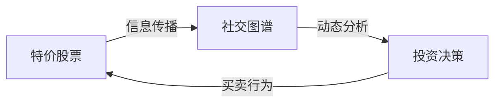

# 特价股票投资中的社交图谱动态分析与应用

> 关键词：特价股票、社交图谱、动态分析、投资决策、信息传播

> 摘要：本文聚焦于特价股票投资领域，深入探讨社交图谱动态分析的原理、方法及其在实际投资中的应用。通过对社交图谱的构建、分析和挖掘，揭示其在信息传播、投资者情绪感知等方面的重要作用，为投资者提供新的决策依据和投资策略。详细阐述了相关核心概念、算法原理、数学模型，并结合实际案例进行说明，同时介绍了该领域的实际应用场景、工具和资源，最后对未来发展趋势与挑战进行总结与展望。

## 1. 背景介绍 
### 1.1 目的和范围
在金融市场中，特价股票往往蕴含着投资机会，但同时也伴随着较高的风险。社交网络的发展使得投资者之间的信息交流日益频繁，形成了复杂的社交图谱。本研究的目的在于利用社交图谱的动态分析，深入了解投资者之间的关系、信息传播路径以及市场情绪的变化，从而为特价股票投资提供更准确的决策支持。研究范围涵盖社交图谱的构建、动态分析方法的研究、以及这些方法在特价股票投资中的应用。

### 1.2 预期读者
本文预期读者包括金融投资者、金融分析师、金融科技从业者、相关领域的研究人员以及对金融市场和社交网络分析感兴趣的爱好者。

### 1.3 文档结构概述
本文首先介绍背景信息，包括目的、预期读者和文档结构概述等。接着阐述核心概念与联系，包括社交图谱、特价股票等概念及其相互关系，并给出相应的示意图和流程图。然后详细讲解核心算法原理和具体操作步骤，结合Python源代码进行说明。之后介绍数学模型和公式，并通过举例进行详细讲解。再通过项目实战展示代码实际案例和详细解释。随后探讨实际应用场景，推荐相关工具和资源。最后总结未来发展趋势与挑战，提供常见问题与解答以及扩展阅读和参考资料。

### 1.4 术语表
#### 1.4.1 核心术语定义
- **特价股票**：指市场价格相对其内在价值或行业平均水平较低的股票，通常具有一定的投资吸引力。
- **社交图谱**：描述社交网络中个体（投资者）之间关系的图结构，节点表示个体，边表示个体之间的关系，如关注、交流等。
- **动态分析**：对社交图谱随时间变化的特征和规律进行研究和分析的过程。
- **信息传播**：在社交网络中，信息从一个节点传递到其他节点的过程。
- **投资者情绪**：投资者对市场和特定股票的乐观、悲观等心理状态。

#### 1.4.2 相关概念解释
- **社交网络**：由多个个体通过各种关系连接而成的网络结构，在金融领域中，投资者通过社交平台、论坛等形成社交网络。
- **图论**：研究图的性质和应用的数学分支，是分析社交图谱的重要理论基础。
- **数据挖掘**：从大量数据中发现有价值信息和知识的过程，用于挖掘社交图谱中的潜在规律。

#### 1.4.3 缩略词列表
- **SNA**：Social Network Analysis（社交网络分析）
- **NLP**：Natural Language Processing（自然语言处理）

## 2. 核心概念与联系 
### 2.1 核心概念原理
#### 2.1.1 特价股票
特价股票的出现可能是由于市场短期波动、公司暂时的经营困境、行业竞争等多种因素导致。投资者通过对公司基本面、财务状况、行业前景等多方面的分析，判断股票是否被低估，从而寻找投资机会。

#### 2.1.2 社交图谱
社交图谱是社交网络的图形化表示，它反映了投资者之间的关系和互动。在金融社交网络中，投资者可以通过关注、评论、分享等行为与其他投资者建立联系。社交图谱中的节点代表投资者，边代表投资者之间的关系，边的权重可以表示关系的强度，如互动的频率、交流的深度等。

#### 2.1.3 动态分析
社交图谱是随时间动态变化的，投资者之间的关系会不断调整，信息也在不断传播和更新。动态分析通过对不同时间点的社交图谱进行比较和分析，挖掘出社交图谱的演变规律，如节点的增加或减少、边的变化、信息传播路径的改变等。

### 2.2 核心概念的联系
社交图谱中的信息传播会影响投资者的情绪和决策，进而影响特价股票的市场表现。例如，当某个投资者在社交网络中分享了关于某只特价股票的利好信息，该信息可能会在社交图谱中迅速传播，引起其他投资者的关注和兴趣，导致更多的投资者买入该股票，从而推动股价上涨。反之，负面信息的传播可能会导致股价下跌。

### 2.3 文本示意图
特价股票、社交图谱和动态分析之间的关系可以用以下示意图表示：

特价股票 <---- 信息传播 ----> 社交图谱 ---- 动态分析 ----> 投资决策

### 2.4 Mermaid 流程图


## 3. 核心算法原理 & 具体操作步骤 
### 3.1 社交图谱构建算法
#### 3.1.1 数据收集
首先需要从金融社交平台、论坛、新闻网站等数据源收集投资者的行为数据，包括关注关系、评论、分享等信息。可以使用网络爬虫技术进行数据收集，以下是一个简单的Python网络爬虫示例：

```python
import requests
from bs4 import BeautifulSoup

url = 'https://example.com/financial-forum'
response = requests.get(url)
soup = BeautifulSoup(response.text, 'html.parser')

# 提取关注关系、评论等信息
# 这里只是示例，实际需要根据具体网站结构进行解析
follow_relations = []
comments = []
# 解析关注关系
follow_elements = soup.find_all('a', class_='follow-link')
for element in follow_elements:
    follower = element.get('data-follower')
    following = element.get('data-following')
    follow_relations.append((follower, following))

# 解析评论
comment_elements = soup.find_all('div', class_='comment')
for element in comment_elements:
    comment_text = element.get_text()
    comments.append(comment_text)
```

#### 3.1.2 图构建
将收集到的数据转换为图结构。可以使用Python的`networkx`库来构建社交图谱，以下是示例代码：

```python
import networkx as nx

# 创建一个有向图
G = nx.DiGraph()

# 添加节点和边
for follower, following in follow_relations:
    G.add_edge(follower, following)

# 可以根据需要添加节点和边的属性，如评论信息等
for comment in comments:
    # 这里可以根据评论内容进行进一步处理，如关联到相应的节点等
    pass
```

### 3.2 动态分析算法
#### 3.2.1 时间切片
将时间划分为不同的切片，对每个时间切片内的社交图谱进行分析。例如，可以按天、周、月等时间间隔进行切片。

```python
# 假设数据有时间戳信息
time_slices = {}
for timestamp, data in data_with_timestamp:
    time_slice_key = timestamp.strftime('%Y-%m-%d')
    if time_slice_key not in time_slices:
        time_slices[time_slice_key] = []
    time_slices[time_slice_key].append(data)

# 对每个时间切片构建社交图谱
graphs = {}
for time_slice_key, slice_data in time_slices.items():
    G_slice = nx.DiGraph()
    # 根据切片数据构建图
    for follower, following in slice_data:
        G_slice.add_edge(follower, following)
    graphs[time_slice_key] = G_slice
```

#### 3.2.2 图特征分析
对每个时间切片的社交图谱进行特征分析，如节点度、聚类系数、中心性等。

```python
for time_slice_key, G_slice in graphs.items():
    # 计算节点度
    degrees = dict(G_slice.degree())
    # 计算聚类系数
    clustering_coefficients = nx.clustering(G_slice)
    # 计算中心性
    betweenness_centrality = nx.betweenness_centrality(G_slice)

    print(f"Time slice: {time_slice_key}")
    print(f"Degrees: {degrees}")
    print(f"Clustering coefficients: {clustering_coefficients}")
    print(f"Betweenness centrality: {betweenness_centrality}")
```

#### 3.2.3 信息传播分析
使用传染病模型等方法分析信息在社交图谱中的传播过程。以下是一个简单的SIR（Susceptible - Infected - Recovered）模型示例：

```python
import numpy as np

# 初始化参数
N = 1000  # 总节点数
I0 = 10  # 初始感染节点数
beta = 0.2  # 感染率
gamma = 0.1  # 恢复率
t = np.linspace(0, 100, 100)

# 初始化状态
S = np.zeros(len(t))
I = np.zeros(len(t))
R = np.zeros(len(t))
S[0] = N - I0
I[0] = I0
R[0] = 0

# 迭代计算
for i in range(1, len(t)):
    dS = -beta * S[i - 1] * I[i - 1] / N
    dI = beta * S[i - 1] * I[i - 1] / N - gamma * I[i - 1]
    dR = gamma * I[i - 1]
    S[i] = S[i - 1] + dS
    I[i] = I[i - 1] + dI
    R[i] = R[i - 1] + dR

# 绘制结果
import matplotlib.pyplot as plt
plt.plot(t, S, label='Susceptible')
plt.plot(t, I, label='Infected')
plt.plot(t, R, label='Recovered')
plt.xlabel('Time')
plt.ylabel('Number of nodes')
plt.legend()
plt.show()
```

## 4. 数学模型和公式 & 详细讲解 & 举例说明 
### 4.1 图论基础公式
#### 4.1.1 节点度
节点的度是指与该节点相连的边的数量。对于有向图，节点的度分为入度和出度。入度表示指向该节点的边的数量，出度表示从该节点出发的边的数量。节点 $v$ 的入度 $d_{in}(v)$ 和出度 $d_{out}(v)$ 的计算公式分别为：

$$d_{in}(v) = \sum_{u \in V} A_{uv}$$

$$d_{out}(v) = \sum_{u \in V} A_{vu}$$

其中 $A$ 是图的邻接矩阵，$V$ 是图的节点集合。

**举例**：假设有一个有向图，其邻接矩阵为：

$$A = \begin{bmatrix}
0 & 1 & 0 \\
0 & 0 & 1 \\
1 & 0 & 0
\end{bmatrix}$$

对于节点 $v_1$，其入度 $d_{in}(v_1) = A_{21} + A_{31} = 0 + 1 = 1$，出度 $d_{out}(v_1) = A_{12} + A_{13} = 1 + 0 = 1$。

#### 4.1.2 聚类系数
聚类系数衡量了节点的邻居之间相互连接的紧密程度。节点 $v$ 的聚类系数 $C(v)$ 的计算公式为：

$$C(v) = \frac{2e_v}{k_v(k_v - 1)}$$

其中 $e_v$ 是节点 $v$ 的邻居之间的边的数量，$k_v$ 是节点 $v$ 的度。

**举例**：假设有一个节点 $v$ 有 3 个邻居，其邻居之间有 2 条边。则该节点的度 $k_v = 3$，$e_v = 2$，聚类系数 $C(v) = \frac{2 \times 2}{3 \times (3 - 1)} = \frac{4}{6} = \frac{2}{3}$。

#### 4.1.3 中心性
中心性用于衡量节点在图中的重要性。常见的中心性指标包括介数中心性、接近中心性等。介数中心性 $B(v)$ 的计算公式为：

$$B(v) = \sum_{s \neq v \neq t \in V} \frac{\sigma_{st}(v)}{\sigma_{st}}$$

其中 $\sigma_{st}$ 是节点 $s$ 到节点 $t$ 的最短路径数量，$\sigma_{st}(v)$ 是节点 $s$ 到节点 $t$ 经过节点 $v$ 的最短路径数量。

### 4.2 信息传播模型公式
#### 4.2.1 SIR 模型
SIR 模型将节点分为易感者（Susceptible）、感染者（Infected）和恢复者（Recovered）三类。其微分方程模型如下：

$$\frac{dS}{dt} = -\beta \frac{S I}{N}$$

$$\frac{dI}{dt} = \beta \frac{S I}{N} - \gamma I$$

$$\frac{dR}{dt} = \gamma I$$

其中 $S$ 表示易感者数量，$I$ 表示感染者数量，$R$ 表示恢复者数量，$N = S + I + R$ 是总节点数，$\beta$ 是感染率，$\gamma$ 是恢复率。

**举例**：假设初始时 $S = 990$，$I = 10$，$R = 0$，$\beta = 0.2$，$\gamma = 0.1$，$N = 1000$。在 $t = 1$ 时刻，根据上述公式计算：

$$\frac{dS}{dt} = -0.2 \times \frac{990 \times 10}{1000} = -1.98$$

$$\frac{dI}{dt} = 0.2 \times \frac{990 \times 10}{1000} - 0.1 \times 10 = 1.98 - 1 = 0.98$$

$$\frac{dR}{dt} = 0.1 \times 10 = 1$$

则 $S(1) = S(0) + \frac{dS}{dt} = 990 - 1.98 = 988.02$，$I(1) = I(0) + \frac{dI}{dt} = 10 + 0.98 = 10.98$，$R(1) = R(0) + \frac{dR}{dt} = 0 + 1 = 1$。

## 5. 项目实战：代码实际案例和详细解释说明 
### 5.1  开发环境搭建
#### 5.1.1 安装 Python
首先需要安装 Python 环境，建议使用 Python 3.7 及以上版本。可以从 Python 官方网站（https://www.python.org/downloads/）下载并安装。

#### 5.1.2 安装必要的库
使用 `pip` 安装以下必要的库：

```sh
pip install requests beautifulsoup4 networkx numpy matplotlib
```

### 5.2  源代码详细实现和代码解读
#### 5.2.1 数据收集模块
```python
import requests
from bs4 import BeautifulSoup

def collect_data(url):
    response = requests.get(url)
    soup = BeautifulSoup(response.text, 'html.parser')

    follow_relations = []
    comments = []

    # 解析关注关系
    follow_elements = soup.find_all('a', class_='follow-link')
    for element in follow_elements:
        follower = element.get('data-follower')
        following = element.get('data-following')
        if follower and following:
            follow_relations.append((follower, following))

    # 解析评论
    comment_elements = soup.find_all('div', class_='comment')
    for element in comment_elements:
        comment_text = element.get_text()
        comments.append(comment_text)

    return follow_relations, comments
```

**代码解读**：该函数通过 `requests` 库发送 HTTP 请求获取网页内容，使用 `BeautifulSoup` 库解析网页。然后提取关注关系和评论信息，将关注关系存储为元组列表，评论信息存储为字符串列表。

#### 5.2.2 图构建模块
```python
import networkx as nx

def build_graph(follow_relations):
    G = nx.DiGraph()
    for follower, following in follow_relations:
        G.add_edge(follower, following)
    return G
```

**代码解读**：该函数使用 `networkx` 库创建一个有向图，并根据关注关系列表添加节点和边。

#### 5.2.3 动态分析模块
```python
import numpy as np
import matplotlib.pyplot as plt

def dynamic_analysis(graphs):
    results = {}
    for time_slice_key, G_slice in graphs.items():
        degrees = dict(G_slice.degree())
        clustering_coefficients = nx.clustering(G_slice)
        betweenness_centrality = nx.betweenness_centrality(G_slice)

        results[time_slice_key] = {
            'degrees': degrees,
            'clustering_coefficients': clustering_coefficients,
            'betweenness_centrality': betweenness_centrality
        }

    # 绘制节点度随时间的变化
    time_slices = sorted(graphs.keys())
    nodes = list(graphs[time_slices[0]].nodes())
    node_degrees = {node: [] for node in nodes}
    for time_slice_key in time_slices:
        degrees = results[time_slice_key]['degrees']
        for node in nodes:
            if node in degrees:
                node_degrees[node].append(degrees[node])
            else:
                node_degrees[node].append(0)

    for node, degrees in node_degrees.items():
        plt.plot(time_slices, degrees, label=node)
    plt.xlabel('Time slice')
    plt.ylabel('Degree')
    plt.legend()
    plt.show()

    return results
```

**代码解读**：该函数对每个时间切片的社交图谱进行特征分析，计算节点度、聚类系数和介数中心性，并将结果存储在字典中。同时，绘制节点度随时间的变化曲线。

### 5.3  代码解读与分析
通过上述代码，我们可以完成从数据收集、图构建到动态分析的整个流程。数据收集模块从网页中提取关注关系和评论信息，为后续的图构建提供数据基础。图构建模块将关注关系转换为图结构，方便进行图分析。动态分析模块对不同时间切片的图进行特征分析，揭示社交图谱的动态变化规律。通过绘制节点度随时间的变化曲线，我们可以直观地观察到节点在社交网络中的影响力变化情况。

## 6. 实际应用场景 
### 6.1 投资决策支持
通过对社交图谱的动态分析，可以了解投资者之间的信息传播路径和市场情绪的变化。例如，如果某只特价股票的利好信息在社交网络中迅速传播，且传播范围不断扩大，同时相关的投资者情绪呈现乐观状态，那么可以考虑增加对该股票的投资。反之，如果负面信息传播迅速，投资者情绪悲观，则应谨慎投资或减少持仓。

### 6.2 风险预警
社交图谱的动态变化可以反映市场的潜在风险。例如，当某个关键投资者在社交网络中突然发布大量负面信息，且该信息在社交图谱中快速传播，可能预示着相关股票存在较大的风险。通过实时监测社交图谱的动态变化，可以及时发现风险信号，采取相应的风险控制措施。

### 6.3 市场趋势预测
分析社交图谱中信息传播的模式和趋势，可以预测市场的未来走势。例如，如果在一段时间内，关于某一行业的特价股票的讨论热度不断上升，且信息传播呈现出积极的趋势，可能预示着该行业的股票市场将迎来上涨行情。

### 6.4 投资者关系管理
金融机构可以通过分析社交图谱，了解投资者之间的关系和互动情况，从而更好地进行投资者关系管理。例如，识别出在社交网络中具有较高影响力的投资者，与他们建立良好的沟通和合作关系，通过他们传播正面信息，提升金融机构的品牌形象和市场认可度。

## 7. 工具和资源推荐
### 7.1 学习资源推荐
#### 7.1.1 书籍推荐
- 《社交网络分析：方法与应用》：全面介绍社交网络分析的理论、方法和应用，是学习社交图谱分析的经典教材。
- 《Python 数据分析实战》：详细讲解使用 Python 进行数据分析的方法和技巧，对于实现社交图谱的动态分析具有重要的参考价值。
- 《金融市场学》：帮助读者深入了解金融市场的运行机制和投资原理，为将社交图谱分析应用于金融投资提供理论基础。

#### 7.1.2 在线课程
- Coursera 上的“Social Network Analysis”：由知名教授授课，系统地介绍社交网络分析的基本概念、方法和工具。
- edX 上的“Python for Data Science”：提供丰富的 Python 数据分析实践案例，有助于提高读者的编程和数据分析能力。
- 中国大学 MOOC 上的“金融投资学”：讲解金融投资的基本理论和方法，结合实际案例进行分析，帮助读者更好地理解金融市场。

#### 7.1.3 技术博客和网站
- Medium 上的“Towards Data Science”：分享最新的数据科学和机器学习技术文章，包括社交网络分析的相关内容。
- 博客园：有许多开发者分享的关于 Python 编程、数据分析和金融科技的经验和技巧。
- 金融界网站：提供丰富的金融市场资讯和数据，有助于了解金融市场的动态和趋势。

### 7.2 开发工具框架推荐
#### 7.2.1 IDE和编辑器
- PyCharm：功能强大的 Python 集成开发环境，提供代码编辑、调试、版本控制等功能，提高开发效率。
- Jupyter Notebook：交互式的开发环境，适合进行数据分析和实验，方便展示代码和结果。
- Visual Studio Code：轻量级的代码编辑器，支持多种编程语言，有丰富的插件扩展功能。

#### 7.2.2 调试和性能分析工具
- pdb：Python 自带的调试器，可以帮助开发者定位和解决代码中的问题。
- cProfile：Python 的性能分析工具，用于分析代码的执行时间和资源消耗情况，优化代码性能。
- Memory Profiler：用于分析 Python 代码的内存使用情况，帮助开发者发现内存泄漏等问题。

#### 7.2.3 相关框架和库
- NetworkX：用于构建、分析和可视化复杂网络的 Python 库，是进行社交图谱分析的重要工具。
- NLTK：自然语言处理工具包，可用于对社交网络中的文本信息进行处理和分析，如情感分析、关键词提取等。
- Scikit-learn：机器学习库，提供了丰富的机器学习算法和工具，可用于对社交图谱数据进行分类、聚类等分析。

### 7.3 相关论文著作推荐
#### 7.3.1 经典论文
- “The Structure and Function of Complex Networks”：介绍复杂网络的结构和功能，为社交图谱的研究提供了理论基础。
- “Information Diffusion in Social Networks”：深入研究信息在社交网络中的传播机制和规律。
- “Social Network Analysis and Financial Markets”：探讨社交网络分析在金融市场中的应用和价值。

#### 7.3.2 最新研究成果
- 关注顶级学术期刊如《Journal of Financial Economics》、《Management Science》等，了解社交图谱在金融投资领域的最新研究成果。
- 参加国际学术会议如 ACM SIGKDD、WWW 等，获取该领域的前沿研究动态。

#### 7.3.3 应用案例分析
- 研究金融机构和投资公司的实际应用案例，了解他们如何利用社交图谱分析进行投资决策和风险管理。
- 分析知名金融科技企业的相关报告和案例，学习他们在社交图谱分析方面的实践经验和创新方法。

## 8. 总结：未来发展趋势与挑战
### 8.1 未来发展趋势
#### 8.1.1 多源数据融合
未来的社交图谱动态分析将融合更多来源的数据，如新闻媒体、社交媒体、公司公告等，以更全面地了解市场信息和投资者情绪。通过多源数据的融合，可以提高分析的准确性和可靠性。

#### 8.1.2 人工智能与机器学习的深度应用
人工智能和机器学习技术将在社交图谱动态分析中发挥越来越重要的作用。例如，使用深度学习模型对社交网络中的文本信息进行情感分析和语义理解，使用强化学习算法优化投资决策策略。

#### 8.1.3 实时分析与决策支持
随着金融市场的快速变化，实时分析和决策支持将成为未来的发展方向。通过实时监测社交图谱的动态变化，及时提供投资决策建议，帮助投资者抓住市场机会。

#### 8.1.4 跨领域融合
社交图谱动态分析将与其他领域如心理学、社会学、行为经济学等进行更深入的融合。通过跨领域的研究，可以更好地理解投资者的行为和决策机制，提高投资决策的科学性和有效性。

### 8.2 挑战
#### 8.2.1 数据质量和隐私问题
社交网络中的数据存在噪声、虚假信息等问题，数据质量的参差不齐会影响分析结果的准确性。同时，数据隐私保护也是一个重要的问题，在收集和使用社交网络数据时，需要遵守相关法律法规，保护用户的隐私。

#### 8.2.2 算法复杂度和计算资源
随着社交网络规模的不断扩大，社交图谱的动态分析算法复杂度也会增加，对计算资源的需求也会越来越高。如何在有限的计算资源下实现高效的分析是一个挑战。

#### 8.2.3 模型的可解释性
人工智能和机器学习模型在社交图谱动态分析中取得了较好的效果，但这些模型往往是黑盒模型，缺乏可解释性。在金融投资领域，模型的可解释性非常重要，投资者需要了解模型的决策依据，以便做出合理的投资决策。

#### 8.2.4 市场的不确定性
金融市场具有高度的不确定性，社交图谱中的信息和投资者情绪也会受到多种因素的影响。如何在复杂多变的市场环境中准确地分析和应用社交图谱的动态信息，是一个需要不断探索和研究的问题。

## 9. 附录：常见问题与解答
### 9.1 如何选择合适的数据源？
选择数据源时，需要考虑数据的准确性、完整性、及时性和相关性。可以选择权威的金融社交平台、新闻网站、公司公告等数据源。同时，要对数据源进行评估和筛选，确保数据的质量。

### 9.2 如何处理社交网络中的噪声和虚假信息？
可以使用数据清洗和预处理技术，如去除重复信息、过滤低质量信息等。同时，可以使用机器学习和自然语言处理技术对信息进行分类和识别，识别出虚假信息并进行过滤。

### 9.3 如何提高社交图谱动态分析的准确性？
可以采用多源数据融合、优化算法模型、增加数据样本等方法提高分析的准确性。同时，要不断验证和评估分析结果，根据实际情况进行调整和优化。

### 9.4 社交图谱动态分析结果是否可以直接作为投资决策的依据？
社交图谱动态分析结果可以作为投资决策的参考依据，但不能直接作为投资决策的唯一依据。金融市场受到多种因素的影响，投资决策还需要结合公司基本面分析、宏观经济环境等因素进行综合考虑。

## 10. 扩展阅读 & 参考资料
### 10.1 扩展阅读
- 《复杂网络理论及其应用》：深入介绍复杂网络的理论和应用，有助于进一步理解社交图谱的本质和特点。
- 《行为金融学》：探讨投资者的行为和心理对金融市场的影响，为社交图谱分析在金融投资中的应用提供了理论支持。
- 《大数据时代：生活、工作与思维的大变革》：介绍大数据的概念、技术和应用，了解大数据在金融领域的应用前景和挑战。

### 10.2 参考资料
- 相关的学术论文、研究报告和书籍，如前面推荐的经典论文、最新研究成果和书籍等。
- 金融市场的官方数据和公告，如证券交易所的公告、公司的财务报表等。
- 社交网络平台的相关文档和数据接口说明，用于了解数据收集和处理的方法和规范。

作者：AI天才研究院/AI Genius Institute & 禅与计算机程序设计艺术 /Zen And The Art of Computer Programming