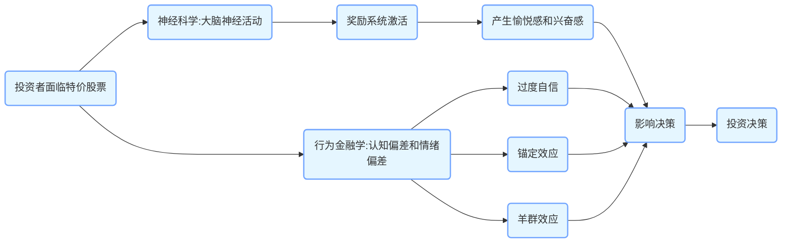

# 特价股票投资中的神经科学与行为金融学应用

> 关键词：特价股票投资、神经科学、行为金融学、投资者行为、决策模型

> 摘要：本文旨在探讨神经科学与行为金融学在特价股票投资中的应用。通过对神经科学和行为金融学核心概念的剖析，阐述其原理和内在联系。深入讲解相关算法原理，并结合数学模型和公式进行详细说明。通过项目实战案例，展示如何将理论应用于实际投资决策中。同时，分析实际应用场景，推荐相关学习资源、开发工具和论文著作。最后总结未来发展趋势与挑战，为投资者和研究者提供全面的参考和指导。

## 1. 背景介绍 
### 1.1 目的和范围
本研究的目的在于深入探讨神经科学与行为金融学在特价股票投资领域的应用。随着金融市场的不断发展，传统的金融理论在解释投资者行为和市场异常现象时存在一定的局限性。神经科学和行为金融学的兴起为理解投资者的决策过程提供了新的视角。本研究将涵盖神经科学和行为金融学的基本概念、相关算法原理、数学模型以及实际应用案例，旨在为投资者提供更全面、科学的投资决策依据。

### 1.2 预期读者
本文预期读者包括金融投资者、金融从业者、学术研究人员以及对神经科学和行为金融学感兴趣的人士。对于投资者而言，本文将帮助他们更好地理解自身的投资行为，提高投资决策的科学性；对于金融从业者，有助于他们为客户提供更专业的投资建议；对于学术研究人员，可作为进一步深入研究的参考资料。

### 1.3 文档结构概述
本文共分为十个部分。第一部分为背景介绍，阐述研究的目的、范围、预期读者和文档结构概述；第二部分介绍核心概念与联系，包括神经科学和行为金融学的基本概念、原理以及它们之间的联系；第三部分讲解核心算法原理和具体操作步骤，通过 Python 源代码详细阐述相关算法；第四部分介绍数学模型和公式，并进行详细讲解和举例说明；第五部分为项目实战，包括开发环境搭建、源代码实现和代码解读；第六部分分析实际应用场景；第七部分推荐相关的工具和资源；第八部分总结未来发展趋势与挑战；第九部分为附录，解答常见问题；第十部分提供扩展阅读和参考资料。

### 1.4 术语表
#### 1.4.1 核心术语定义
- **特价股票**：指价格相对其内在价值被低估的股票。
- **神经科学**：是一门研究神经系统结构、功能、发育、遗传学、生物化学、生理学、药理学及病理学的科学，在金融领域主要用于研究投资者的大脑活动和决策机制。
- **行为金融学**：是将心理学、行为科学、社会学等理论融入到金融学中，研究金融市场中投资者的决策行为和市场异常现象的学科。
- **投资者行为偏差**：指投资者在决策过程中由于认知、情感等因素的影响而产生的偏离理性决策的行为。

#### 1.4.2 相关概念解释
- **认知偏差**：是指人们在认识事物过程中，由于认知能力的局限和认知方式的不当而产生的偏差。在投资决策中，常见的认知偏差包括过度自信、锚定效应、羊群效应等。
- **情绪偏差**：是指投资者在决策过程中受到情绪的影响而产生的偏差。例如，恐惧和贪婪情绪会导致投资者做出非理性的买卖决策。
- **神经经济学**：是神经科学、经济学和心理学的交叉学科，主要研究人类决策过程中的神经机制和经济行为。

#### 1.4.3 缩略词列表
- **EEG**：脑电图（Electroencephalogram），是一种通过记录大脑电活动来研究大脑功能的技术。
- **fMRI**：功能磁共振成像（Functional Magnetic Resonance Imaging），是一种通过检测大脑血液流动变化来研究大脑活动的技术。

## 2. 核心概念与联系 

### 神经科学与投资者决策
神经科学主要研究人类大脑的结构和功能，以及神经系统如何影响人类的行为和决策。在特价股票投资中，神经科学可以帮助我们理解投资者的决策过程。人类的决策过程不仅仅是基于理性的分析，还受到大脑中神经递质和神经网络的影响。

例如，当投资者面对特价股票时，大脑中的奖励系统会被激活。奖励系统主要包括多巴胺能神经元，当投资者预期从投资中获得收益时，多巴胺会释放，从而产生愉悦感和兴奋感。这种神经机制会影响投资者的决策，可能导致投资者过度乐观，高估特价股票的潜在收益。

### 行为金融学与投资者行为偏差
行为金融学认为，投资者并非完全理性的经济人，他们的决策会受到认知偏差和情绪偏差的影响。在特价股票投资中，常见的行为偏差包括：
- **过度自信**：投资者往往高估自己的投资能力和对市场的判断，认为自己能够准确地识别特价股票并获得超额收益。
- **锚定效应**：投资者在决策时会受到初始信息的影响，将股票的当前价格锚定在过去的某个价格水平上，而忽视了股票的内在价值。
- **羊群效应**：投资者倾向于跟随市场中的大多数人进行投资决策，而不考虑自己的独立判断。当市场上出现对特价股票的追捧时，很多投资者会盲目跟风买入。

### 神经科学与行为金融学的联系
神经科学和行为金融学之间存在着密切的联系。神经科学为行为金融学提供了生物学基础，解释了投资者行为偏差产生的神经机制。例如，过度自信可能与大脑中前额叶皮质的活动异常有关，前额叶皮质在决策和自我评估中起着重要作用。行为金融学则为神经科学提供了研究的应用场景，通过对投资者行为的观察和分析，可以进一步验证神经科学的理论和假设。

以下是神经科学与行为金融学在特价股票投资中联系的 Mermaid 流程图：


## 3. 核心算法原理 & 具体操作步骤 

### 基于行为金融学的投资者行为建模算法
我们可以通过构建一个基于行为金融学的投资者行为模型来预测投资者在特价股票投资中的决策。以下是一个简化的 Python 实现：

```python
import numpy as np

# 定义投资者行为偏差参数
overconfidence_factor = 1.2  # 过度自信因子
anchoring_factor = 0.8  # 锚定效应因子
herding_factor = 0.9  # 羊群效应因子

# 定义股票信息
stock_price = 50  # 当前股票价格
intrinsic_value = 60  # 股票内在价值
market_trend = 0.7  # 市场趋势（0-1 之间，越大表示市场越乐观）

# 计算投资者对股票价值的感知
perceived_value = (intrinsic_value * overconfidence_factor + stock_price * anchoring_factor) / 2

# 计算羊群效应影响
herding_influence = market_trend * herding_factor

# 计算投资决策概率
investment_probability = (perceived_value - stock_price) / perceived_value * herding_influence

print(f"投资决策概率: {investment_probability}")
```

### 具体操作步骤
1. **数据收集**：收集股票的相关信息，包括当前价格、内在价值、市场趋势等。同时，根据历史数据或实验研究确定投资者行为偏差参数，如过度自信因子、锚定效应因子和羊群效应因子。
2. **计算投资者对股票价值的感知**：根据行为金融学的原理，考虑过度自信和锚定效应的影响，计算投资者对股票价值的感知。
3. **计算羊群效应影响**：根据市场趋势和羊群效应因子，计算羊群效应对投资决策的影响。
4. **计算投资决策概率**：综合考虑投资者对股票价值的感知和羊群效应影响，计算投资决策概率。
5. **决策判断**：根据投资决策概率，投资者可以做出是否投资的决策。例如，如果投资决策概率大于某个阈值（如 0.5），则考虑投资；否则，不投资。

## 4. 数学模型和公式 & 详细讲解 & 举例说明 

### 投资者对股票价值的感知模型
投资者对股票价值的感知 $V_p$ 可以用以下公式表示：

$$V_p = \frac{V_i \times \alpha + P \times \beta}{2}$$

其中，$V_i$ 是股票的内在价值，$\alpha$ 是过度自信因子，$P$ 是股票的当前价格，$\beta$ 是锚定效应因子。

**详细讲解**：过度自信因子 $\alpha$ 反映了投资者高估股票内在价值的程度，$\alpha$ 越大，投资者越过度自信。锚定效应因子 $\beta$ 反映了投资者对股票当前价格的依赖程度，$\beta$ 越大，投资者越容易受到当前价格的影响。通过加权平均的方式计算投资者对股票价值的感知，综合考虑了过度自信和锚定效应的影响。

**举例说明**：假设股票的内在价值 $V_i = 60$，过度自信因子 $\alpha = 1.2$，股票的当前价格 $P = 50$，锚定效应因子 $\beta = 0.8$，则投资者对股票价值的感知为：

$$V_p = \frac{60 \times 1.2 + 50 \times 0.8}{2} = \frac{72 + 40}{2} = 56$$

### 羊群效应影响模型
羊群效应影响 $H$ 可以用以下公式表示：

$$H = T \times \gamma$$

其中，$T$ 是市场趋势（0 - 1 之间，越大表示市场越乐观），$\gamma$ 是羊群效应因子。

**详细讲解**：市场趋势 $T$ 反映了市场的整体情绪，羊群效应因子 $\gamma$ 反映了投资者跟随市场趋势的程度。当市场趋势乐观且羊群效应因子较大时，羊群效应影响较大，投资者更容易跟随市场趋势进行投资决策。

**举例说明**：假设市场趋势 $T = 0.7$，羊群效应因子 $\gamma = 0.9$，则羊群效应影响为：

$$H = 0.7 \times 0.9 = 0.63$$

### 投资决策概率模型
投资决策概率 $P_d$ 可以用以下公式表示：

$$P_d = \frac{V_p - P}{V_p} \times H$$

其中，$V_p$ 是投资者对股票价值的感知，$P$ 是股票的当前价格，$H$ 是羊群效应影响。

**详细讲解**：$\frac{V_p - P}{V_p}$ 反映了投资者认为股票被低估的程度，$H$ 反映了羊群效应的影响。两者相乘得到投资决策概率，综合考虑了股票的低估程度和羊群效应的影响。

**举例说明**：假设投资者对股票价值的感知 $V_p = 56$，股票的当前价格 $P = 50$，羊群效应影响 $H = 0.63$，则投资决策概率为：

$$P_d = \frac{56 - 50}{56} \times 0.63 = \frac{6}{56} \times 0.63 \approx 0.0675$$

## 5. 项目实战：代码实际案例和详细解释说明 

### 5.1  开发环境搭建
为了实现上述算法，我们需要搭建一个 Python 开发环境。以下是具体步骤：
1. **安装 Python**：从 Python 官方网站（https://www.python.org/downloads/）下载并安装 Python 3.x 版本。
2. **安装开发工具**：推荐使用 PyCharm 或 Jupyter Notebook 作为开发工具。PyCharm 是一款功能强大的 Python 集成开发环境，Jupyter Notebook 则适合进行交互式编程和数据分析。
3. **安装必要的库**：我们需要安装 NumPy 库来进行数值计算。可以使用以下命令进行安装：
```sh
pip install numpy
```

### 5.2  源代码详细实现和代码解读
以下是一个完整的 Python 代码示例，实现了基于行为金融学的投资者行为建模和投资决策概率计算：

```python
import numpy as np

# 定义投资者行为偏差参数
overconfidence_factor = 1.2  # 过度自信因子
anchoring_factor = 0.8  # 锚定效应因子
herding_factor = 0.9  # 羊群效应因子

# 定义股票信息列表，包含多只股票的信息
stocks = [
    {
        "stock_price": 50,
        "intrinsic_value": 60,
        "market_trend": 0.7
    },
    {
        "stock_price": 40,
        "intrinsic_value": 50,
        "market_trend": 0.6
    },
    {
        "stock_price": 70,
        "intrinsic_value": 80,
        "market_trend": 0.8
    }
]

# 计算每只股票的投资决策概率
for stock in stocks:
    stock_price = stock["stock_price"]
    intrinsic_value = stock["intrinsic_value"]
    market_trend = stock["market_trend"]

    # 计算投资者对股票价值的感知
    perceived_value = (intrinsic_value * overconfidence_factor + stock_price * anchoring_factor) / 2

    # 计算羊群效应影响
    herding_influence = market_trend * herding_factor

    # 计算投资决策概率
    investment_probability = (perceived_value - stock_price) / perceived_value * herding_influence

    print(f"股票价格: {stock_price}, 内在价值: {intrinsic_value}, 市场趋势: {market_trend}")
    print(f"投资决策概率: {investment_probability}")
    print("-" * 30)
```

### 5.3  代码解读与分析
1. **导入必要的库**：导入 NumPy 库用于数值计算。
2. **定义投资者行为偏差参数**：定义过度自信因子、锚定效应因子和羊群效应因子，这些参数可以根据实际情况进行调整。
3. **定义股票信息列表**：使用字典列表存储多只股票的信息，包括当前价格、内在价值和市场趋势。
4. **循环计算每只股票的投资决策概率**：对于每只股票，根据上述数学模型和公式计算投资者对股票价值的感知、羊群效应影响和投资决策概率。
5. **输出结果**：打印每只股票的相关信息和投资决策概率。

通过这个代码示例，我们可以看到如何将行为金融学的理论应用于实际的投资决策中。投资者可以根据投资决策概率来评估每只股票的投资价值，从而做出更科学的投资决策。

## 6. 实际应用场景 
### 投资者自我认知与决策优化
投资者可以利用神经科学和行为金融学的知识，了解自己在投资决策过程中的行为偏差。例如，通过分析自己在面对特价股票时的情绪反应和决策过程，识别自己是否存在过度自信、锚定效应或羊群效应等偏差。然后，投资者可以采取相应的措施来调整自己的决策行为，避免因行为偏差而做出错误的投资决策。

### 金融机构投资策略制定
金融机构可以将神经科学和行为金融学的研究成果应用于投资策略的制定。例如，通过分析投资者的行为偏差和市场情绪，开发出更符合投资者心理的投资产品和策略。金融机构还可以利用神经科学技术，如脑电图和功能磁共振成像，研究投资者的大脑活动，进一步了解投资者的决策机制，为投资策略的优化提供依据。

### 市场监管与风险防范
市场监管机构可以借助神经科学和行为金融学的知识，加强对市场异常行为的监测和分析。例如，当市场出现过度投机或羊群效应时，监管机构可以及时采取措施进行干预，防范系统性金融风险。同时，监管机构可以通过投资者教育，提高投资者的风险意识和理性投资能力，促进金融市场的健康稳定发展。

## 7. 工具和资源推荐
### 7.1 学习资源推荐
#### 7.1.1 书籍推荐
- 《思考，快与慢》（丹尼尔·卡尼曼著）：这本书介绍了人类思维的两种模式——快思考和慢思考，以及它们在决策过程中的作用，对理解投资者的行为偏差有很大帮助。
- 《行为金融学》（饶育蕾、盛虎著）：系统地介绍了行为金融学的基本理论和方法，是学习行为金融学的经典教材。
- 《神经经济学分析基础》（保罗·W·格莱姆齐等著）：探讨了神经科学和经济学的交叉领域，为理解投资者的决策神经机制提供了理论基础。

#### 7.1.2 在线课程
- Coursera 上的“Behavioral Finance”课程：由知名教授授课，介绍了行为金融学的基本概念、理论和应用。
- edX 上的“Neuroscience and Society”课程：涵盖了神经科学的基本原理和在社会各个领域的应用，包括金融领域。

#### 7.1.3 技术博客和网站
- Seeking Alpha（https://seekingalpha.com/）：提供了丰富的金融市场分析和投资研究文章，其中不乏关于行为金融学和特价股票投资的内容。
- Behavioral Finance Network（https://www.behavioralfinance.net/）：专注于行为金融学的研究和交流，提供了