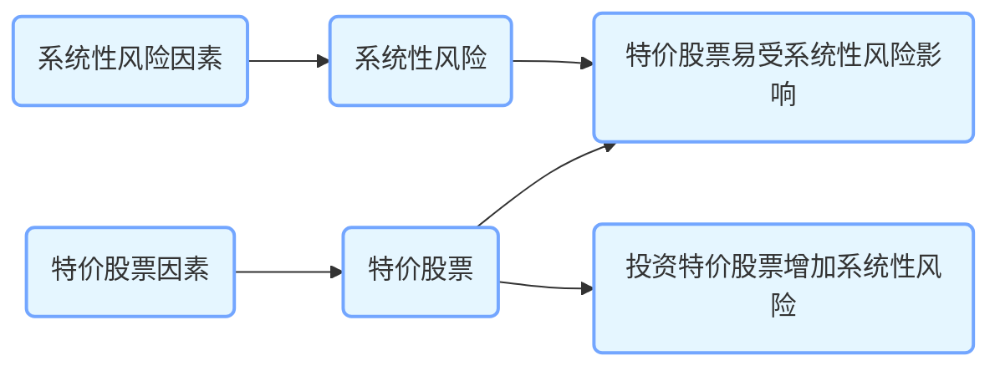

# 特价股票投资中的系统性风险管理方法

> 关键词：特价股票、系统性风险、风险管理方法、投资策略、市场波动

> 摘要：本文聚焦于特价股票投资中的系统性风险管理方法。首先介绍了研究的背景、目的、预期读者等内容。接着阐述了特价股票和系统性风险的核心概念及联系，通过详细的算法原理、数学模型和公式进行深入剖析。以实际案例展示了如何在项目实战中运用这些方法进行风险管理，包括开发环境搭建、源代码实现和解读。同时探讨了特价股票投资中系统性风险管理方法的实际应用场景，推荐了相关的学习资源、开发工具框架和论文著作。最后总结了未来发展趋势与挑战，并给出常见问题解答和扩展阅读参考资料，旨在为投资者在特价股票投资中有效管理系统性风险提供全面且深入的指导。

## 1. 背景介绍 
### 1.1 目的和范围
在金融市场中，特价股票由于其价格相对较低，往往吸引着众多投资者的目光。然而，投资特价股票并非没有风险，其中系统性风险更是影响投资成败的关键因素。系统性风险是指由整体政治、经济、社会等环境因素对证券价格所造成的影响，这种风险无法通过分散投资来消除。本文章的目的在于深入探讨特价股票投资中系统性风险管理的有效方法，帮助投资者识别、评估和应对系统性风险，从而提高投资的安全性和收益率。

本文的范围涵盖了特价股票的定义、系统性风险的来源和特征、风险管理的核心算法和数学模型，以及如何在实际投资项目中运用这些方法进行风险管理。同时，还会介绍相关的学习资源、开发工具和论文著作，为投资者和研究者提供全面的参考。

### 1.2 预期读者
本文预期读者主要包括以下几类人群：
1. **个人投资者**：对特价股票投资感兴趣，希望了解如何管理系统性风险以保护自己的投资本金和获取合理收益的普通投资者。
2. **金融从业者**：包括股票分析师、投资顾问、基金经理等，他们需要深入了解特价股票投资中的系统性风险管理方法，以便为客户提供更专业的投资建议和管理投资组合。
3. **研究者**：从事金融投资、风险管理等领域研究的学者和研究人员，他们可以从本文中获取相关的理论和实践知识，为进一步的研究提供参考。
4. **技术开发者**：对金融科技感兴趣，希望将风险管理算法和模型应用到实际软件开发中的程序员和软件架构师。

### 1.3 文档结构概述
本文将按照以下结构进行组织：
1. **背景介绍**：阐述研究的目的、范围、预期读者和文档结构概述，并对相关术语进行定义和解释。
2. **核心概念与联系**：介绍特价股票和系统性风险的核心概念，分析它们之间的联系，并通过文本示意图和 Mermaid 流程图进行可视化展示。
3. **核心算法原理 & 具体操作步骤**：详细讲解用于管理系统性风险的核心算法原理，并给出具体的操作步骤和 Python 源代码示例。
4. **数学模型和公式 & 详细讲解 & 举例说明**：建立数学模型和公式来描述系统性风险和风险管理方法，并通过具体的例子进行详细讲解。
5. **项目实战：代码实际案例和详细解释说明**：通过一个实际的项目案例，展示如何在特价股票投资中运用风险管理方法进行投资决策，包括开发环境搭建、源代码实现和代码解读。
6. **实际应用场景**：探讨特价股票投资中系统性风险管理方法的实际应用场景，如投资组合优化、风险预警等。
7. **工具和资源推荐**：推荐相关的学习资源、开发工具框架和论文著作，帮助读者进一步深入学习和研究。
8. **总结：未来发展趋势与挑战**：总结本文的主要内容，分析未来特价股票投资中系统性风险管理的发展趋势和面临的挑战。
9. **附录：常见问题与解答**：列出常见的问题并给出解答，帮助读者解决在学习和实践过程中遇到的问题。
10. **扩展阅读 & 参考资料**：提供相关的扩展阅读材料和参考资料，方便读者进一步深入学习和研究。

### 1.4 术语表
#### 1.4.1 核心术语定义
1. **特价股票**：指价格相对较低，通常低于其内在价值或市场平均水平的股票。特价股票可能由于公司业绩不佳、行业前景不明朗、市场情绪等因素导致价格下跌。
2. **系统性风险**：又称市场风险，是指由整体政治、经济、社会等环境因素对证券价格所造成的影响。系统性风险包括宏观经济波动、利率变动、通货膨胀、政策变化等，这些因素会影响整个市场，无法通过分散投资来消除。
3. **风险管理**：指识别、评估和应对风险的过程，旨在降低风险对投资组合的影响，保护投资者的本金和收益。风险管理包括风险识别、风险评估、风险控制和风险监测等环节。
4. **投资组合**：指投资者将资金分散投资于不同的资产，如股票、债券、基金等，以降低单一资产的风险。投资组合的目的是在风险和收益之间找到平衡，实现投资目标。

#### 1.4.2 相关概念解释
1. **内在价值**：指股票的真实价值，是根据公司的基本面因素，如盈利能力、资产质量、现金流等，通过一定的估值方法计算得出的价值。内在价值是判断股票是否被低估或高估的重要依据。
2. **市场情绪**：指投资者对市场的看法和预期，会影响投资者的投资决策和股票价格。市场情绪通常受到宏观经济数据、政策变化、公司业绩等因素的影响。
3. **风险溢价**：指投资者为承担风险而要求获得的额外收益。风险溢价是衡量风险和收益关系的重要指标，通常与系统性风险成正比。

#### 1.4.3 缩略词列表
1. **VAR**：Value at Risk，风险价值，是一种常用的风险管理工具，用于衡量在一定的置信水平下，投资组合在未来一段时间内可能遭受的最大损失。
2. **CAPM**：Capital Asset Pricing Model，资本资产定价模型，是一种用于计算资产预期收益率的模型，考虑了系统性风险和市场风险溢价。
3. **ETF**：Exchange Traded Fund，交易型开放式指数基金，是一种可以在证券交易所上市交易的开放式基金，通常跟踪特定的指数。

## 2. 核心概念与联系 

### 2.1 特价股票的核心概念
特价股票是指那些在市场上价格相对较低的股票。其价格低廉可能源于多种因素。从公司层面来看，可能是公司近期业绩不佳，如连续几个季度净利润下滑、市场份额被竞争对手抢占等。例如，某传统制造业公司由于技术创新不足，产品竞争力下降，导致业绩大幅下滑，其股票价格也随之走低，成为特价股票。

从行业角度分析，某些行业可能处于衰退期，行业整体前景不明朗，使得该行业内的股票普遍价格较低。比如，随着新能源汽车的崛起，传统燃油汽车行业面临巨大挑战，一些传统燃油汽车制造企业的股票可能沦为特价股票。

此外，市场情绪也会对股票价格产生影响。当市场出现恐慌情绪时，投资者往往会大量抛售股票，导致股票价格过度下跌，一些原本具有投资价值的股票也可能成为特价股票。

### 2.2 系统性风险的核心概念
系统性风险是由宏观层面的因素引起的，影响整个金融市场的风险。宏观经济波动是系统性风险的重要来源之一。当经济处于衰退期时，企业的盈利能力下降，消费者的消费能力也会减弱，这会导致股票市场整体下跌。例如，2008 年全球金融危机爆发，全球经济陷入衰退，股票市场大幅下跌，几乎所有股票都受到了影响。

利率变动也是系统性风险的重要因素。当利率上升时，企业的融资成本增加，投资和生产活动受到抑制，股票市场也会受到负面影响。同时，利率上升会使得债券等固定收益类产品的吸引力增加，投资者会将资金从股票市场转移到债券市场，导致股票价格下跌。

政策变化同样会带来系统性风险。政府的财政政策、货币政策、产业政策等的调整，都会对股票市场产生重大影响。例如，政府出台严格的环保政策，可能会对一些高污染、高能耗的企业造成巨大冲击，其股票价格也会受到影响。

### 2.3 特价股票与系统性风险的联系
特价股票由于其价格较低，往往更容易受到系统性风险的影响。当系统性风险发生时，市场整体下跌，特价股票的价格可能会进一步下跌，甚至可能导致公司面临破产清算的风险。

另一方面，投资特价股票也可能会增加投资者面临的系统性风险。因为特价股票通常具有较高的波动性和不确定性，当市场出现不利变化时，特价股票的价格波动幅度可能会更大，从而增加了投资组合的系统性风险。

### 2.4 文本示意图
```plaintext
特价股票
|
|--公司层面因素（业绩不佳、技术创新不足等）
|--行业层面因素（行业衰退、竞争加剧等）
|--市场情绪因素（恐慌抛售等）

系统性风险
|
|--宏观经济波动（经济衰退、通货膨胀等）
|--利率变动（利率上升、下降等）
|--政策变化（财政政策、货币政策等）

特价股票与系统性风险的联系
|
|--特价股票易受系统性风险影响
|--投资特价股票增加系统性风险
```

### 2.5 Mermaid 流程图


## 3. 核心算法原理 & 具体操作步骤 

### 3.1 风险价值（VAR）算法原理
风险价值（VAR）是一种常用的风险管理工具，用于衡量在一定的置信水平下，投资组合在未来一段时间内可能遭受的最大损失。其基本思想是通过对投资组合的历史收益率进行统计分析，建立收益率的概率分布模型，然后根据置信水平确定相应的分位数，该分位数对应的损失值即为 VAR。

### 3.2 具体操作步骤
1. **数据收集**：收集特价股票的历史价格数据，计算其收益率。收益率的计算公式为：
   $R_t=\frac{P_t - P_{t-1}}{P_{t-1}}$
   其中，$R_t$ 表示第 $t$ 期的收益率，$P_t$ 表示第 $t$ 期的股票价格，$P_{t-1}$ 表示第 $t-1$ 期的股票价格。

2. **收益率分布估计**：根据收集到的历史收益率数据，选择合适的概率分布模型进行拟合，如正态分布、t 分布等。可以使用最大似然估计等方法来估计分布的参数。

3. **确定置信水平和时间期限**：根据投资者的风险偏好和投资目标，确定置信水平和时间期限。常见的置信水平有 95%、99% 等，时间期限可以是一天、一周、一个月等。

4. **计算 VAR**：根据估计的收益率分布和确定的置信水平，计算相应的分位数，该分位数对应的损失值即为 VAR。例如，在 95% 的置信水平下，VAR 表示在未来一段时间内，投资组合有 95% 的可能性损失不会超过该值。

### 3.3 Python 源代码实现
```python
import numpy as np
import pandas as pd
import matplotlib.pyplot as plt
from scipy.stats import norm

# 生成示例数据
np.random.seed(0)
prices = np.cumprod(1 + np.random.normal(0, 0.01, 100))
returns = np.diff(prices) / prices[:-1]

# 确定置信水平和时间期限
confidence_level = 0.95
time_horizon = 1

# 计算 VAR
mu = np.mean(returns)
sigma = np.std(returns)
z_score = norm.ppf(1 - confidence_level)
var = - (mu * time_horizon + z_score * sigma * np.sqrt(time_horizon))

print(f"在 {confidence_level * 100}% 的置信水平下，VAR 为: {var:.4f}")

# 绘制收益率分布图
plt.hist(returns, bins=30, density=True, alpha=0.7)
xmin, xmax = plt.xlim()
x = np.linspace(xmin, xmax, 100)
p = norm.pdf(x, mu, sigma)
plt.plot(x, p, 'k', linewidth=2)
plt.title('收益率分布')
plt.xlabel('收益率')
plt.ylabel('概率密度')
plt.show()
```

### 3.4 代码解释
1. **数据生成**：使用 `numpy` 生成示例的股票价格数据，并计算收益率。
2. **确定置信水平和时间期限**：设置置信水平为 95%，时间期限为 1 天。
3. **计算 VAR**：根据正态分布的性质，计算 VAR。首先计算收益率的均值和标准差，然后根据置信水平确定对应的 z 分数，最后计算 VAR。
4. **绘制收益率分布图**：使用 `matplotlib` 绘制收益率的直方图，并拟合正态分布曲线，直观展示收益率的分布情况。

## 4. 数学模型和公式 & 详细讲解 & 举例说明 

### 4.1 资本资产定价模型（CAPM）
#### 4.1.1 数学模型和公式
资本资产定价模型（CAPM）用于计算资产的预期收益率，考虑了系统性风险和市场风险溢价。其公式为：
$$E(R_i)=R_f+\beta_i\times[E(R_m)-R_f]$$
其中，$E(R_i)$ 表示资产 $i$ 的预期收益率，$R_f$ 表示无风险收益率，$\beta_i$ 表示资产 $i$ 的贝塔系数，$E(R_m)$ 表示市场组合的预期收益率。

#### 4.1.2 详细讲解
- **无风险收益率 $R_f$**：通常可以用国债收益率来近似表示，它代表了投资者在无风险情况下的收益水平。
- **贝塔系数 $\beta_i$**：衡量了资产 $i$ 的收益率对市场组合收益率变动的敏感程度。$\beta_i>1$ 表示资产 $i$ 的收益率波动比市场组合更大，风险更高；$\beta_i<1$ 表示资产 $i$ 的收益率波动比市场组合更小，风险更低；$\beta_i = 1$ 表示资产 $i$ 的收益率波动与市场组合相同。
- **市场风险溢价 $E(R_m)-R_f$**：表示投资者为承担市场风险而要求获得的额外收益。

#### 4.1.3 举例说明
假设无风险收益率 $R_f = 3\%$，市场组合的预期收益率 $E(R_m)=10\%$，某特价股票的贝塔系数 $\beta_i = 1.2$。则该特价股票的预期收益率为：
$$E(R_i)=3\%+1.2\times(10\%-3\%)=3\% + 8.4\% = 11.4\%$$

### 4.2 投资组合的方差和标准差
#### 4.2.1 数学模型和公式
假设投资组合由 $n$ 种资产组成，每种资产的权重为 $w_i$，收益率为 $R_i$，则投资组合的预期收益率 $E(R_p)$ 为：
$$E(R_p)=\sum_{i=1}^{n}w_i\times E(R_i)$$
投资组合的方差 $\sigma_p^2$ 为：
$$\sigma_p^2=\sum_{i=1}^{n}\sum_{j=1}^{n}w_i\times w_j\times\sigma_{ij}$$
其中，$\sigma_{ij}$ 表示资产 $i$ 和资产 $j$ 的协方差。投资组合的标准差 $\sigma_p$ 为方差的平方根。

#### 4.2.2 详细讲解
- **投资组合的预期收益率**：是各资产预期收益率的加权平均值，权重为各资产在投资组合中的比例。
- **投资组合的方差**：考虑了资产之间的协方差，反映了投资组合收益率的波动程度。协方差 $\sigma_{ij}$ 衡量了资产 $i$ 和资产 $j$ 的收益率之间的相关性。当 $\sigma_{ij}>0$ 时，资产 $i$ 和资产 $j$ 的收益率呈正相关；当 $\sigma_{ij}<0$ 时，资产 $i$ 和资产 $j$ 的收益率呈负相关；当 $\sigma_{ij}=0$ 时，资产 $i$ 和资产 $j$ 的收益率不相关。
- **投资组合的标准差**：是衡量投资组合风险的重要指标，标准差越大，投资组合的风险越高。

#### 4.2.3 举例说明
假设投资组合由两种资产 A 和 B 组成，资产 A 的权重 $w_A = 0.6$，预期收益率 $E(R_A)=12\%$，标准差 $\sigma_A = 0.2$；资产 B 的权重 $w_B = 0.4$，预期收益率 $E(R_B)=8\%$，标准差 $\sigma_B = 0.15$，资产 A 和资产 B 的协方差 $\sigma_{AB}=0.02$。

首先计算投资组合的预期收益率：
$$E(R_p)=0.6\times12\% + 0.4\times8\% = 7.2\% + 3.2\% = 10.4\%$$

然后计算投资组合的方差：
$$\sigma_p^2=0.6^2\times0.2^2 + 0.4^2\times0.15^2 + 2\times0.6\times0.4\times0.02 = 0.0144 + 0.0036 + 0.0096 = 0.0276$$

最后计算投资组合的标准差：
$$\sigma_p=\sqrt{0.0276}\approx0.166$$

## 5. 项目实战：代码实际案例和详细解释说明 

### 5.1  开发环境搭建
#### 5.1.1 安装 Python
首先需要安装 Python 环境，建议使用 Python 3.7 及以上版本。可以从 Python 官方网站（https://www.python.org/downloads/）下载适合自己操作系统的安装包，按照安装向导进行安装。

#### 5.1.2 安装必要的库
在特价股票投资的系统性风险管理项目中，需要使用一些 Python 库，如 `pandas`、`numpy`、`matplotlib`、`scipy` 等。可以使用 `pip` 命令进行安装：
```sh
pip install pandas numpy matplotlib scipy
```

#### 5.1.3 数据获取
可以从金融数据网站，如雅虎财经、Tushare 等获取特价股票的历史价格数据。以 Tushare 为例，需要先注册账号并获取 token，然后安装 Tushare 库：
```sh
pip install tushare
```

### 5.2  源代码详细实现和代码解读
```python
import tushare as ts
import pandas as pd
import numpy as np
import matplotlib.pyplot as plt
from scipy.stats import norm

# 设置 Tushare token
ts.set_token('your_token')
pro = ts.pro_api()

# 获取特价股票历史数据
def get_stock_data(stock_code, start_date, end_date):
    df = pro.daily(ts_code=stock_code, start_date=start_date, end_date=end_date)
    df = df.sort_values('trade_date')
    df['trade_date'] = pd.to_datetime(df['trade_date'])
    df.set_index('trade_date', inplace=True)
    return df

# 计算收益率
def calculate_returns(prices):
    returns = prices['close'].pct_change().dropna()
    return returns

# 计算 VAR
def calculate_var(returns, confidence_level=0.95, time_horizon=1):
    mu = np.mean(returns)
    sigma = np.std(returns)
    z_score = norm.ppf(1 - confidence_level)
    var = - (mu * time_horizon + z_score * sigma * np.sqrt(time_horizon))
    return var

# 主函数
def main():
    stock_code = '600519.SH'  # 示例股票代码
    start_date = '20200101'
    end_date = '20231231'

    # 获取股票数据
    stock_data = get_stock_data(stock_code, start_date, end_date)

    # 计算收益率
    returns = calculate_returns(stock_data)

    # 计算 VAR
    var = calculate_var(returns)

    print(f"在 95% 的置信水平下，VAR 为: {var:.4f}")

    # 绘制收益率分布图
    plt.hist(returns, bins=30, density=True, alpha=0.7)
    xmin, xmax = plt.xlim()
    x = np.linspace(xmin, xmax, 100)
    p = norm.pdf(x, np.mean(returns), np.std(returns))
    plt.plot(x, p, 'k', linewidth=2)
    plt.title('收益率分布')
    plt.xlabel('收益率')
    plt.ylabel('概率密度')
    plt.show()

if __name__ == "__main__":
    main()
```

### 5.3  代码解读与分析
1. **数据获取**：使用 `tushare` 库从 Tushare 平台获取特价股票的历史价格数据，并进行排序和索引设置。
2. **收益率计算**：根据获取的股票收盘价数据，计算每日收益率。
3. **VAR 计算**：根据收益率数据，使用正态分布假设计算 VAR。
4. **结果展示**：打印 VAR 值，并绘制收益率的直方图和拟合的正态分布曲线，直观展示收益率的分布情况。

通过这个项目实战，我们可以看到如何运用 Python 进行特价股票投资中的系统性风险管理，包括数据获取、收益率计算、VAR 计算和结果可视化等步骤。

## 6. 实际应用场景 
### 6.1 投资组合优化
在构建投资组合时，投资者可以运用系统性风险管理方法来优化投资组合。通过计算不同特价股票的贝塔系数、预期收益率和风险价值等指标，投资者可以选择合适的股票进行组合，以降低投资组合的系统性风险。例如，投资者可以选择贝塔系数较低的特价股票与其他资产进行组合，从而在保证一定收益率的前提下，降低投资组合的整体风险。

### 6.2 风险预警
系统性风险管理方法可以用于风险预警。通过实时监测市场的宏观经济指标、利率变动、政策变化等因素，以及特价股票的价格波动情况，投资者可以及时发现潜在的系统性风险。当风险指标达到一定阈值时，发出预警信号，提醒投资者采取相应的措施，如调整投资组合、减少仓位等，以避免损失。

### 6.3 投资决策辅助
在进行特价股票投资决策时，系统性风险管理方法可以为投资者提供重要的参考。投资者可以根据计算得到的预期收益率、风险价值等指标，评估投资的风险和收益情况，从而做出更加理性的投资决策。例如，如果某特价股票的预期收益率较高，但风险价值也较大，投资者需要谨慎考虑是否投资该股票。

### 6.4 绩效评估
系统性风险管理方法还可以用于投资绩效评估。通过比较投资组合的实际收益率与预期收益率，以及实际风险与预期风险，投资者可以评估投资组合的绩效。如果投资组合的实际收益率高于预期收益率，且实际风险低于预期风险，则说明投资组合的绩效较好；反之，则需要对投资策略进行调整。

## 7. 工具和资源推荐
### 7.1 学习资源推荐
#### 7.1.1 书籍推荐
1. 《聪明的投资者》（The Intelligent Investor）：作者是本杰明·格雷厄姆（Benjamin Graham），这本书被誉为投资界的圣经，详细介绍了价值投资的理念和方法，对于理解特价股票投资和风险管理具有重要的指导意义。
2. 《金融市场与金融机构》（Financial Markets and Institutions）：作者是弗雷德里克·S·米什金（Frederic S. Mishkin），该书全面介绍了金融市场和金融机构的基本知识，包括股票市场、债券市场、风险管理等内容，是学习金融投资的经典教材。
3. 《风险管理与金融机构》（Risk Management and Financial Institutions）：作者是约翰·C·赫尔（John C. Hull），这本书深入探讨了金融机构的风险管理方法和技术，包括市场风险、信用风险、操作风险等方面的内容，对于理解系统性风险管理具有重要的参考价值。

#### 7.1.2 在线课程
1. Coursera 上的“投资学原理”（Principles of Investing）课程：由耶鲁大学教授罗伯特·席勒（Robert Shiller）主讲，该课程介绍了投资的基本原理和方法，包括资产定价、投资组合理论、风险管理等内容。
2. edX 上的“金融市场”（Financial Markets）课程：由耶鲁大学教授罗伯特·席勒（Robert Shiller）主讲，该课程深入探讨了金融市场的运行机制和风险管理方法，对于理解系统性风险和投资决策具有重要的帮助。
3. 中国大学 MOOC 上的“金融风险管理”课程：由复旦大学教授刘红忠主讲，该课程系统介绍了金融风险管理的理论和方法，包括市场风险、信用风险、操作风险等方面的内容。

#### 7.1.3 技术博客和网站
1. 雪球（https://xueqiu.com/）：国内知名的财经社交平台，提供股票行情、财经新闻、投资分析等内容，投资者可以在上面交流投资经验和分享投资观点。
2. 东方财富网（https://www.eastmoney.com/）：国内大型的财经网站，提供股票、基金、债券等金融产品的行情数据、财经新闻、研究报告等内容，是投资者获取财经信息的重要渠道。
3. Seeking Alpha（https://seekingalpha.com/）：国外知名的财经网站，提供股票分析、投资策略、财经新闻等内容，有很多专业的投资者和分析师在上面发表文章和观点。

### 7.2 开发工具框架推荐
#### 7.2.1 IDE和编辑器
1. PyCharm：一款专业的 Python 集成开发环境（IDE），提供代码编辑、调试、版本控制等功能，适合开发大型的 Python 项目。
2. Jupyter Notebook：一种交互式的开发环境，支持 Python、R 等多种编程语言，适合进行数据探索、模型开发和结果展示等工作。
3. Visual Studio Code：一款轻量级的代码编辑器，支持多种编程语言和插件扩展，具有丰富的功能和良好的用户体验。

#### 7.2.2 调试和性能分析工具
1. PDB：Python 自带的调试工具，可以在代码中设置断点，逐步执行代码，查看变量的值和程序的执行流程。
2. cProfile：Python 自带的性能分析工具，可以分析代码的运行时间和函数调用情况，帮助开发者找出代码中的性能瓶颈。
3. Py-Spy：一款轻量级的 Python 性能分析工具，可以实时监控 Python 程序的运行情况，找出性能问题。

#### 7.2.3 相关框架和库
1. Pandas：一个强大的数据分析库，提供了数据结构和数据处理工具，适合进行金融数据的处理和分析。
2. Numpy：一个用于科学计算的 Python 库，提供了高效的数组操作和数学函数，是很多数据分析和机器学习库的基础。
3. Scikit-learn：一个常用的机器学习库，提供了各种机器学习算法和工具，适合进行投资组合优化、风险预测等工作。

### 7.3 相关论文著作推荐
#### 7.3.1 经典论文
1. “Capital Asset Prices: A Theory of Market Equilibrium Under Conditions of Risk”（资本资产定价：风险条件下的市场均衡理论）：作者是威廉·夏普（William Sharpe），该论文提出了资本资产定价模型（CAPM），为资产定价和风险管理提供了重要的理论基础。
2. “The Arbitrage Pricing Theory of Capital Asset Pricing”（资本资产定价的套利定价理论）：作者是斯蒂芬·罗斯（Stephen Ross），该论文提出了套利定价理论（APT），是对 CAPM 的进一步扩展和完善。
3. “On the Pricing of Corporate Debt: The Risk Structure of Interest Rates”（关于公司债务定价：利率的风险结构）：作者是罗伯特·默顿（Robert Merton），该论文提出了期权定价理论在公司债务定价中的应用，为信用风险管理提供了重要的理论支持。

#### 7.3.2 最新研究成果
1. 关注《Journal of Finance》、《Review of Financial Studies》、《Journal of Financial Economics》等国际顶级金融学术期刊，这些期刊上发表了很多关于金融投资和风险管理的最新研究成果。
2. 关注国内的《金融研究》、《经济研究》等学术期刊，这些期刊上也发表了很多国内学者关于金融投资和风险管理的研究成果。

#### 7.3.3 应用案例分析
1. 《金融风险管理案例分析》：该书收集了大量的金融风险管理案例，包括市场风险、信用风险、操作风险等方面的案例，通过对这些案例的分析，可以帮助读者更好地理解和应用风险管理方法。
2. 一些金融机构和咨询公司发布的研究报告和案例分析，如麦肯锡、波士顿咨询等公司的报告，这些报告通常会结合实际案例，分析金融市场的趋势和风险管理的策略。

## 8. 总结：未来发展趋势与挑战
### 8.1 未来发展趋势
#### 8.1.1 智能化风险管理
随着人工智能和机器学习技术的不断发展，智能化风险管理将成为未来特价股票投资中系统性风险管理的重要趋势。通过运用深度学习、强化学习等技术，可以对大量的金融数据进行分析和挖掘，建立更加准确的风险预测模型，实现对系统性风险的实时监测和预警。

#### 8.1.2 多元化风险管理策略
未来，投资者将采用更加多元化的风险管理策略，不仅仅局限于传统的风险价值（VAR）、资本资产定价模型（CAPM）等方法。例如，投资者可能会结合量化投资、对冲基金等策略，通过分散投资、套期保值等方式来降低系统性风险。

#### 8.1.3 跨市场风险管理
随着金融市场的全球化和互联互通，跨市场风险管理将变得越来越重要。投资者需要考虑不同市场之间的相关性和联动性，对全球范围内的系统性风险进行综合管理。例如，当美国股市出现大幅下跌时，可能会对全球其他股市产生影响，投资者需要及时调整投资组合，降低风险。

#### 8.1.4 环境、社会和治理（ESG）因素纳入风险管理
越来越多的投资者开始关注环境、社会和治理（ESG）因素对投资的影响。未来，ESG 因素将被纳入系统性风险管理体系中，投资者将更加注重投资的可持续性和社会责任。例如，一些环保政策的出台可能会对某些高污染、高能耗的特价股票产生负面影响，投资者需要提前考虑这些因素，降低投资风险。

### 8.2 挑战
#### 8.2.1 数据质量和可用性
智能化风险管理需要大量的高质量金融数据作为支撑。然而，金融数据的质量和可用性存在一定的问题，如数据缺失、数据错误、数据不一致等。这些问题会影响风险预测模型的准确性和可靠性，给风险管理带来挑战。

#### 8.2.2 模型的复杂性和可解释性
随着风险管理模型的不断复杂化，模型的可解释性变得越来越重要。一些深度学习模型虽然具有较高的预测准确性，但模型的内部结构和决策过程往往难以理解。这使得投资者在使用这些模型进行风险管理时，难以判断模型的可靠性和合理性，增加了决策的难度。

#### 8.2.3 市场的不确定性和波动性
金融市场具有高度的不确定性和波动性，系统性风险的发生往往难以预测。例如，突发的自然灾害、政治事件、经济危机等都可能导致市场的剧烈波动，给投资者带来巨大的损失。如何在不确定的市场环境中有效地管理系统性风险，是投资者面临的重要挑战。

#### 8.2.4 监管要求的变化
金融市场的监管要求不断变化，投资者需要及时了解和遵守相关的监管规定。例如，一些监管政策可能会对投资组合的配置、杠杆率等方面进行限制，这会影响投资者的风险管理策略和投资决策。投资者需要密切关注监管要求的变化，及时调整风险管理策略，以确保合规经营。

## 9. 附录：常见问题与解答
### 9.1 什么是特价股票？
特价股票是指价格相对较低，通常低于其内在价值或市场平均水平的股票。特价股票可能由于公司业绩不佳、行业前景不明朗、市场情绪等因素导致价格下跌。

### 9.2 什么是系统性风险？
系统性风险又称市场风险，是指由整体政治、经济、社会等环境因素对证券价格所造成的影响。系统性风险包括宏观经济波动、利率变动、通货膨胀、政策变化等，这些因素会影响整个市场，无法通过分散投资来消除。

### 9.3 如何衡量系统性风险？
常见的衡量系统性风险的指标包括贝塔系数、风险价值（VAR）等。贝塔系数衡量了资产的收益率对市场组合收益率变动的敏感程度；风险价值（VAR）用于衡量在一定的置信水平下，投资组合在未来一段时间内可能遭受的最大损失。

### 9.4 如何管理特价股票投资中的系统性风险？
可以采用多种方法来管理特价股票投资中的系统性风险，如分散投资、套期保值、风险价值（VAR）管理、资本资产定价模型（CAPM）应用等。投资者可以根据自己的风险偏好和投资目标，选择合适的风险管理方法。

### 9.5 投资特价股票一定能获得高收益吗？
不一定。虽然特价股票价格相对较低，可能存在一定的投资机会，但也伴随着较高的风险。特价股票可能由于公司基本面问题、行业竞争加剧等原因，导致价格继续下跌，甚至可能导致公司破产清算。因此，投资者在投资特价股票时，需要充分考虑风险因素，做好风险管理。

## 10. 扩展阅读 & 参考资料
### 10.1 扩展阅读
1. 《漫步华尔街》（A Random Walk Down Wall Street）：作者是伯顿·马尔基尔（Burton Malkiel），该书介绍了随机漫步理论和有效市场假说，对于理解股票市场的运行机制和投资策略具有重要的启示。
2. 《黑天鹅：如何应对不可预知的未来》（The Black Swan: The Impact of the Highly Improbable）：作者是纳西姆·尼古拉斯·塔勒布（Nassim Nicholas Taleb），该书探讨了极端事件对金融市场和投资决策的影响，提醒投资者要关注不确定性和风险。
3. 《非理性繁荣》（Irrational Exuberance）：作者是罗伯特·席勒（Robert Shiller），该书分析了股票市场的泡沫现象和投资者的非理性行为，对于理解市场情绪和投资心理具有重要的参考价值。

### 10.2 参考资料
1. 中国证券监督管理委员会官方网站（https://www.csrc.gov.cn/）：提供了证券市场的相关政策法规、监管动态等信息。
2. 中国人民银行官方网站（https://www.pbc.gov.cn/）：提供了货币政策、金融统计等方面的信息，对于了解宏观经济形势和利率变动具有重要的参考价值。
3. 国际货币基金组织（IMF）官方网站（https://www.imf.org/）：提供了全球经济形势、金融稳定等方面的研究报告和数据，对于了解全球金融市场和系统性风险具有重要的参考价值。

作者：AI天才研究院/AI Genius Institute & 禅与计算机程序设计艺术 /Zen And The Art of Computer Programming