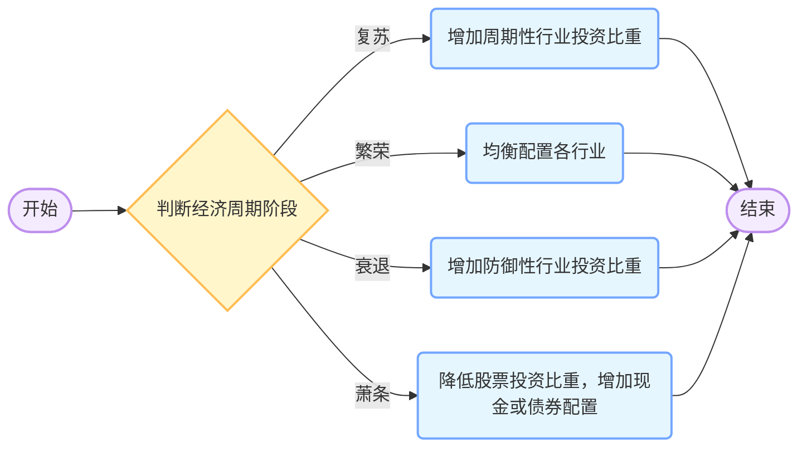

# 特价股票投资中的行业轮动策略

> 关键词：特价股票、行业轮动策略、股票投资、市场周期、资产配置

> 摘要：本文聚焦于特价股票投资中的行业轮动策略，深入探讨了该策略的核心概念、算法原理、数学模型，并结合实际案例进行详细分析。旨在帮助投资者理解行业轮动策略在特价股票投资中的应用，掌握其操作步骤和要点，以提高投资收益并降低风险。同时，介绍了相关的工具和资源，对未来发展趋势与挑战进行了总结，还提供了常见问题解答和扩展阅读资料。

## 1. 背景介绍 
### 1.1 目的和范围
在股票投资领域，寻找特价股票并通过有效的策略实现收益最大化是投资者的重要目标。行业轮动策略作为一种重要的投资策略，旨在根据不同行业在经济周期中的表现差异，动态调整投资组合，从而捕捉市场机会。本文的目的是深入研究特价股票投资中的行业轮动策略，详细阐述其原理、操作方法和实际应用，为投资者提供全面的理论指导和实践参考。范围涵盖了行业轮动策略的基本概念、核心算法、数学模型、实际案例分析以及相关工具和资源推荐等方面。

### 1.2 预期读者
本文预期读者包括对股票投资感兴趣的个人投资者、专业投资机构的研究人员和投资经理、金融领域的学生和学者等。无论是初涉投资领域的新手，还是有一定经验的投资者，都可以从本文中获取有关特价股票投资和行业轮动策略的有价值信息，提升自己的投资知识和技能。

### 1.3 文档结构概述
本文将按照以下结构进行阐述：首先介绍行业轮动策略的核心概念和相关联系，包括原理和架构的文本示意图及 Mermaid 流程图；接着详细讲解核心算法原理和具体操作步骤，并使用 Python 源代码进行说明；然后介绍数学模型和公式，并通过举例进行详细讲解；再通过实际案例展示行业轮动策略在特价股票投资中的应用，包括开发环境搭建、源代码实现和代码解读；之后探讨行业轮动策略的实际应用场景；推荐相关的工具和资源；最后总结未来发展趋势与挑战，提供常见问题解答和扩展阅读资料。

### 1.4 术语表
#### 1.4.1 核心术语定义
- **特价股票**：指那些价格相对其内在价值被低估的股票，通常具有较低的市盈率、市净率等估值指标。
- **行业轮动策略**：根据经济周期的不同阶段，在不同行业之间进行资产配置调整的投资策略，以获取超越市场平均水平的收益。
- **经济周期**：指经济活动沿着经济发展的总体趋势所经历的有规律的扩张和收缩，一般分为复苏、繁荣、衰退和萧条四个阶段。
- **资产配置**：指投资者根据自身的风险承受能力和投资目标，将资金分配到不同的资产类别（如股票、债券、现金等）和不同的行业中。

#### 1.4.2 相关概念解释
- **行业表现差异**：不同行业在经济周期的不同阶段具有不同的表现。例如，在经济复苏阶段，周期性行业（如钢铁、汽车等）通常表现较好；而在经济衰退阶段，防御性行业（如医药、消费等）相对更具稳定性。
- **估值指标**：用于评估股票或行业价值的指标，常见的有市盈率（PE）、市净率（PB）、股息率等。估值指标可以帮助投资者判断股票或行业是否被低估或高估。
- **动量效应**：指在一定时间内，表现好的股票或行业往往会继续表现好，而表现差的股票或行业往往会继续表现差的现象。行业轮动策略可以利用动量效应来选择投资的行业。

#### 1.4.3 缩略词列表
- **PE**：市盈率（Price-to-Earnings Ratio）
- **PB**：市净率（Price-to-Book Ratio）
- **GDP**：国内生产总值（Gross Domestic Product）

## 2. 核心概念与联系 

### 核心概念原理
行业轮动策略的核心原理基于经济周期理论和行业表现的差异性。经济周期的不同阶段对各个行业的影响不同，导致不同行业在不同时期的盈利能力和市场表现存在差异。投资者可以通过分析经济周期的变化，预测不同行业的未来表现，从而在不同行业之间进行资产配置的调整，以获取更高的投资收益。

例如，在经济复苏阶段，随着经济的逐渐好转，企业的生产和销售活动增加，对原材料和能源的需求也相应增加。因此，周期性行业（如钢铁、化工、有色金属等）的业绩往往会率先改善，股价也会随之上涨。此时，投资者可以增加对周期性行业的投资比重。

而在经济衰退阶段，消费者的消费意愿下降，对非必需品的需求减少。此时，防御性行业（如医药、食品饮料、公用事业等）由于其产品和服务的需求相对稳定，受经济衰退的影响较小，股价相对较为稳定。投资者可以将资金从周期性行业转移到防御性行业，以降低投资组合的风险。

### 架构的文本示意图
```plaintext
经济周期分析
|
|-- 复苏阶段
|   |-- 周期性行业表现好
|   |   |-- 增加周期性行业投资比重
|   |
|   |-- 防御性行业表现一般
|       |-- 减少防御性行业投资比重
|
|-- 繁荣阶段
|   |-- 各行业普遍表现好
|   |   |-- 均衡配置各行业
|
|-- 衰退阶段
|   |-- 防御性行业表现好
|   |   |-- 增加防御性行业投资比重
|   |
|   |-- 周期性行业表现差
|       |-- 减少周期性行业投资比重
|
|-- 萧条阶段
|   |-- 各行业普遍表现差
|   |   |-- 降低股票投资比重，增加现金或债券配置
```

### Mermaid 流程图


## 3. 核心算法原理 & 具体操作步骤 

### 核心算法原理
行业轮动策略的核心算法主要基于对经济周期的判断和行业表现的评估。常见的方法包括宏观经济指标分析、行业估值分析和行业动量分析等。

#### 宏观经济指标分析
通过分析一系列宏观经济指标（如 GDP 增长率、通货膨胀率、利率等）来判断经济周期的阶段。例如，当 GDP 增长率开始上升、通货膨胀率较低、利率处于下降趋势时，通常意味着经济处于复苏阶段；而当 GDP 增长率开始下降、通货膨胀率较高、利率处于上升趋势时，可能意味着经济进入衰退阶段。

#### 行业估值分析
使用估值指标（如 PE、PB 等）来评估不同行业的估值水平。当某个行业的估值指标低于历史平均水平时，说明该行业可能被低估，具有投资价值；反之，当某个行业的估值指标高于历史平均水平时，说明该行业可能被高估，存在投资风险。

#### 行业动量分析
通过计算不同行业在一定时间内的收益率，来评估行业的动量效应。选择收益率较高的行业进行投资，以利用行业的上涨趋势。

### 具体操作步骤
#### 步骤 1：数据收集
收集宏观经济指标数据（如 GDP 增长率、通货膨胀率、利率等）、行业估值数据（如 PE、PB 等）和行业收益率数据。可以从金融数据提供商（如 Wind、Bloomberg 等）或政府统计部门获取相关数据。

#### 步骤 2：经济周期判断
根据收集到的宏观经济指标数据，使用合适的方法（如移动平均法、趋势分析等）判断当前经济所处的周期阶段。

#### 步骤 3：行业评估
根据经济周期阶段，对不同行业进行评估。在复苏阶段，重点关注周期性行业的估值和动量；在衰退阶段，重点关注防御性行业的估值和动量。

#### 步骤 4：资产配置调整
根据行业评估结果，调整投资组合中不同行业的投资比重。增加表现较好的行业的投资比重，减少表现较差的行业的投资比重。

#### 步骤 5：定期监控和调整
定期（如每月或每季度）监控宏观经济指标和行业表现的变化，根据新的情况及时调整投资组合。

### Python 源代码实现
```python
import pandas as pd
import numpy as np

# 模拟宏观经济指标数据
gdp_growth = np.array([1.2, 1.5, 1.8, 2.0, 1.6, 1.2, 0.8, 0.5])
inflation = np.array([1.0, 1.2, 1.5, 1.8, 2.0, 2.2, 2.5, 2.8])
interest_rate = np.array([3.0, 2.8, 2.5, 2.2, 2.0, 2.2, 2.5, 2.8])

# 模拟行业估值数据
industry_pe = {
    '周期性行业': np.array([10, 12, 15, 18, 20, 18, 15, 12]),
    '防御性行业': np.array([20, 22, 25, 28, 30, 28, 25, 22])
}

# 模拟行业收益率数据
industry_returns = {
    '周期性行业': np.array([0.05, 0.08, 0.1, 0.12, 0.08, 0.05, 0.02, -0.02]),
    '防御性行业': np.array([0.03, 0.05, 0.06, 0.08, 0.1, 0.08, 0.06, 0.05])
}

# 步骤 2：经济周期判断
def judge_economic_cycle(gdp_growth, inflation, interest_rate):
    if gdp_growth[-1] > gdp_growth[-2] and inflation[-1] < 2.0 and interest_rate[-1] < interest_rate[-2]:
        return '复苏'
    elif gdp_growth[-1] > 2.0 and inflation[-1] > 2.0 and interest_rate[-1] > interest_rate[-2]:
        return '繁荣'
    elif gdp_growth[-1] < gdp_growth[-2] and inflation[-1] > 2.0 and interest_rate[-1] > interest_rate[-2]:
        return '衰退'
    else:
        return '萧条'

cycle = judge_economic_cycle(gdp_growth, inflation, interest_rate)
print(f'当前经济周期阶段：{cycle}')

# 步骤 3：行业评估
def evaluate_industries(cycle, industry_pe, industry_returns):
    if cycle == '复苏':
        # 关注周期性行业
        pe = industry_pe['周期性行业'][-1]
        return_rate = industry_returns['周期性行业'][-1]
        if pe < np.mean(industry_pe['周期性行业']) and return_rate > 0:
            return '周期性行业'
        else:
            return '防御性行业'
    elif cycle == '衰退':
        # 关注防御性行业
        pe = industry_pe['防御性行业'][-1]
        return_rate = industry_returns['防御性行业'][-1]
        if pe < np.mean(industry_pe['防御性行业']) and return_rate > 0:
            return '防御性行业'
        else:
            return '周期性行业'
    else:
        # 繁荣和萧条阶段，简单均衡配置
        return '均衡配置'

best_industry = evaluate_industries(cycle, industry_pe, industry_returns)
print(f'当前最佳投资行业：{best_industry}')

# 步骤 4：资产配置调整
def adjust_asset_allocation(best_industry):
    if best_industry == '周期性行业':
        allocation = {'周期性行业': 0.8, '防御性行业': 0.2}
    elif best_industry == '防御性行业':
        allocation = {'周期性行业': 0.2, '防御性行业': 0.8}
    else:
        allocation = {'周期性行业': 0.5, '防御性行业': 0.5}
    return allocation

allocation = adjust_asset_allocation(best_industry)
print(f'调整后的资产配置：{allocation}')
```

## 4. 数学模型和公式 & 详细讲解 & 举例说明 

### 宏观经济指标分析模型
#### GDP 增长率趋势分析
可以使用移动平均法来分析 GDP 增长率的趋势。移动平均法是一种常用的平滑技术，通过计算一定时期内数据的平均值来消除数据的波动，从而更清晰地显示数据的趋势。

设 $GDP_t$ 表示第 $t$ 期的 GDP 增长率，$n$ 表示移动平均的期数，则第 $t$ 期的 $n$ 期移动平均值 $MA_t$ 计算公式为：

$$MA_t = \frac{GDP_{t - n + 1} + GDP_{t - n + 2} + \cdots + GDP_t}{n}$$

例如，假设我们使用 3 期移动平均法来分析 GDP 增长率的趋势，已知最近 5 期的 GDP 增长率分别为 $1.2\%$、$1.5\%$、$1.8\%$、$2.0\%$、$1.6\%$，则第 3 期的 3 期移动平均值为：

$$MA_3 = \frac{1.2 + 1.5 + 1.8}{3} = 1.5\%$$

第 4 期的 3 期移动平均值为：

$$MA_4 = \frac{1.5 + 1.8 + 2.0}{3} \approx 1.77\%$$

第 5 期的 3 期移动平均值为：

$$MA_5 = \frac{1.8 + 2.0 + 1.6}{3} = 1.8\%$$

通过观察移动平均值的变化趋势，我们可以判断 GDP 增长率是上升还是下降，从而辅助判断经济周期的阶段。

#### 通货膨胀率和利率的综合分析
可以使用综合指标来分析通货膨胀率和利率的变化情况。例如，我们可以定义一个经济压力指标 $EP$：

$$EP = \alpha \times Inflation + \beta \times InterestRate$$

其中，$\alpha$ 和 $\beta$ 是权重系数，$Inflation$ 表示通货膨胀率，$InterestRate$ 表示利率。

假设 $\alpha = 0.6$，$\beta = 0.4$，当前通货膨胀率为 $2.0\%$，利率为 $2.2\%$，则经济压力指标为：

$$EP = 0.6 \times 2.0 + 0.4 \times 2.2 = 2.08\%$$

当 $EP$ 较高时，说明经济面临较大的压力，可能处于衰退阶段；当 $EP$ 较低时，说明经济压力较小，可能处于复苏阶段。

### 行业估值分析模型
#### 市盈率（PE）分析
市盈率是衡量股票或行业估值水平的常用指标，计算公式为：

$$PE = \frac{股价}{每股收益}$$

对于行业来说，可以计算行业内所有股票的平均市盈率。假设一个行业内有 $n$ 只股票，第 $i$ 只股票的股价为 $P_i$，每股收益为 $E_i$，则该行业的平均市盈率 $PE_{industry}$ 为：

$$PE_{industry} = \frac{\sum_{i = 1}^{n} P_i}{\sum_{i = 1}^{n} E_i}$$

例如，一个行业内有 3 只股票，股价分别为 $10$ 元、$12$ 元、$15$ 元，每股收益分别为 $1$ 元、$1.2$ 元、$1.5$ 元，则该行业的平均市盈率为：

$$PE_{industry} = \frac{10 + 12 + 15}{1 + 1.2 + 1.5} \approx 11.11$$

通过比较行业的当前市盈率与历史平均市盈率，可以判断该行业是否被低估或高估。如果当前市盈率低于历史平均市盈率，则说明该行业可能被低估，具有投资价值；反之，如果当前市盈率高于历史平均市盈率，则说明该行业可能被高估，存在投资风险。

#### 市净率（PB）分析
市净率也是衡量股票或行业估值水平的重要指标，计算公式为：

$$PB = \frac{股价}{每股净资产}$$

同样，对于行业来说，可以计算行业内所有股票的平均市净率。假设一个行业内有 $n$ 只股票，第 $i$ 只股票的股价为 $P_i$，每股净资产为 $B_i$，则该行业的平均市净率 $PB_{industry}$ 为：

$$PB_{industry} = \frac{\sum_{i = 1}^{n} P_i}{\sum_{i = 1}^{n} B_i}$$

市净率分析的方法与市盈率类似，通过比较行业的当前市净率与历史平均市净率，来判断该行业的估值水平。

### 行业动量分析模型
#### 行业收益率计算
行业收益率可以通过计算行业内所有股票的加权平均收益率来得到。假设一个行业内有 $n$ 只股票，第 $i$ 只股票的权重为 $w_i$（通常根据股票的市值来确定），收益率为 $r_i$，则该行业的收益率 $R_{industry}$ 为：

$$R_{industry} = \sum_{i = 1}^{n} w_i \times r_i$$

例如，一个行业内有 3 只股票，权重分别为 $0.3$、$0.3$、$0.4$，收益率分别为 $0.05$、$0.08$、$0.1$，则该行业的收益率为：

$$R_{industry} = 0.3 \times 0.05 + 0.3 \times 0.08 + 0.4 \times 0.1 = 0.081$$

#### 动量效应分析
可以通过比较不同行业在一定时间内的收益率来分析行业的动量效应。选择收益率较高的行业进行投资，以利用行业的上涨趋势。例如，我们计算了两个行业 A 和 B 在过去 3 个月的收益率分别为 $0.1$ 和 $0.05$，则说明行业 A 的动量更强，更适合投资。

## 5. 项目实战：代码实际案例和详细解释说明 

### 5.1  开发环境搭建
#### 操作系统
可以选择 Windows、Linux 或 macOS 操作系统。建议使用较新版本的操作系统，以确保软件的兼容性和稳定性。

#### Python 环境
安装 Python 3.7 及以上版本。可以从 Python 官方网站（https://www.python.org/downloads/）下载安装包进行安装。安装完成后，建议使用虚拟环境来管理项目的依赖包，以避免不同项目之间的依赖冲突。可以使用 `venv` 或 `conda` 来创建虚拟环境。

#### 依赖包安装
在虚拟环境中安装所需的依赖包，主要包括 `pandas`、`numpy`、`matplotlib` 等。可以使用 `pip` 命令进行安装：

```sh
pip install pandas numpy matplotlib
```

### 5.2  源代码详细实现和代码解读
```python
import pandas as pd
import numpy as np
import matplotlib.pyplot as plt

# 步骤 1：数据收集
# 假设我们从 CSV 文件中读取宏观经济指标数据和行业收益率数据
macro_data = pd.read_csv('macro_data.csv')
industry_returns = pd.read_csv('industry_returns.csv')

# 步骤 2：经济周期判断
def judge_economic_cycle(macro_data):
    gdp_growth = macro_data['GDP增长率'].values
    inflation = macro_data['通货膨胀率'].values
    interest_rate = macro_data['利率'].values
    
    current_gdp_growth = gdp_growth[-1]
    prev_gdp_growth = gdp_growth[-2]
    current_inflation = inflation[-1]
    current_interest_rate = interest_rate[-1]
    prev_interest_rate = interest_rate[-2]
    
    if current_gdp_growth > prev_gdp_growth and current_inflation < 2.0 and current_interest_rate < prev_interest_rate:
        return '复苏'
    elif current_gdp_growth > 2.0 and current_inflation > 2.0 and current_interest_rate > prev_interest_rate:
        return '繁荣'
    elif current_gdp_growth < prev_gdp_growth and current_inflation > 2.0 and current_interest_rate > prev_interest_rate:
        return '衰退'
    else:
        return '萧条'

cycle = judge_economic_cycle(macro_data)
print(f'当前经济周期阶段：{cycle}')

# 步骤 3：行业评估
def evaluate_industries(cycle, industry_returns):
    if cycle == '复苏':
        # 关注周期性行业
        periodic_returns = industry_returns['周期性行业'].values
        defensive_returns = industry_returns['防御性行业'].values
        if periodic_returns[-1] > defensive_returns[-1]:
            return '周期性行业'
        else:
            return '防御性行业'
    elif cycle == '衰退':
        # 关注防御性行业
        periodic_returns = industry_returns['周期性行业'].values
        defensive_returns = industry_returns['防御性行业'].values
        if defensive_returns[-1] > periodic_returns[-1]:
            return '防御性行业'
        else:
            return '周期性行业'
    else:
        # 繁荣和萧条阶段，简单均衡配置
        return '均衡配置'

best_industry = evaluate_industries(cycle, industry_returns)
print(f'当前最佳投资行业：{best_industry}')

# 步骤 4：资产配置调整
def adjust_asset_allocation(best_industry):
    if best_industry == '周期性行业':
        allocation = {'周期性行业': 0.8, '防御性行业': 0.2}
    elif best_industry == '防御性行业':
        allocation = {'周期性行业': 0.2, '防御性行业': 0.8}
    else:
        allocation = {'周期性行业': 0.5, '防御性行业': 0.5}
    return allocation

allocation = adjust_asset_allocation(best_industry)
print(f'调整后的资产配置：{allocation}')

# 步骤 5：定期监控和调整
# 模拟定期监控，这里假设每月监控一次
for i in range(12):
    # 模拟新数据的到来
    new_macro_data = pd.read_csv(f'macro_data_{i + 1}.csv')
    new_industry_returns = pd.read_csv(f'industry_returns_{i + 1}.csv')
    
    cycle = judge_economic_cycle(new_macro_data)
    best_industry = evaluate_industries(cycle, new_industry_returns)
    allocation = adjust_asset_allocation(best_industry)
    
    print(f'第 {i + 1} 个月：')
    print(f'当前经济周期阶段：{cycle}')
    print(f'当前最佳投资行业：{best_industry}')
    print(f'调整后的资产配置：{allocation}')

# 可视化行业收益率
plt.figure(figsize=(10, 6))
plt.plot(industry_returns['周期性行业'], label='周期性行业')
plt.plot(industry_returns['防御性行业'], label='防御性行业')
plt.xlabel('时间')
plt.ylabel('收益率')
plt.title('行业收益率变化')
plt.legend()
plt.show()
```

### 5.3  代码解读与分析
#### 数据收集部分
通过 `pandas` 库的 `read_csv` 函数从 CSV 文件中读取宏观经济指标数据和行业收益率数据。在实际应用中，数据可以来自金融数据提供商的 API 或数据库。

#### 经济周期判断部分
定义了 `judge_economic_cycle` 函数，根据 GDP 增长率、通货膨胀率和利率的变化情况来判断当前经济所处的周期阶段。该函数通过比较当前值和前一期的值，并结合一定的阈值条件来进行判断。

#### 行业评估部分
定义了 `evaluate_industries` 函数，根据经济周期阶段来评估不同行业的表现。在复苏阶段，比较周期性行业和防御性行业的收益率，选择收益率较高的行业；在衰退阶段，同样比较两个行业的收益率，选择更稳定的防御性行业；在繁荣和萧条阶段，进行均衡配置。

#### 资产配置调整部分
定义了 `adjust_asset_allocation` 函数，根据最佳投资行业来调整资产配置。如果最佳投资行业是周期性行业，则将 80% 的资金分配到周期性行业，20% 的资金分配到防御性行业；反之，如果最佳投资行业是防御性行业，则将 80% 的资金分配到防御性行业，20% 的资金分配到周期性行业；如果是均衡配置，则将资金平均分配到两个行业。

#### 定期监控和调整部分
通过循环模拟每月监控一次数据，每次读取新的宏观经济指标数据和行业收益率数据，重新判断经济周期阶段、评估行业表现和调整资产配置。

#### 可视化部分
使用 `matplotlib` 库绘制行业收益率的变化曲线，直观地展示周期性行业和防御性行业的收益率随时间的变化情况。

## 6. 实际应用场景 
### 个人投资者
对于个人投资者来说，行业轮动策略可以帮助他们在不同的经济周期中调整投资组合，提高投资收益。例如，在经济复苏阶段，个人投资者可以增加对周期性行业（如钢铁、汽车等）的投资比重，以获取行业上涨带来的收益；而在经济衰退阶段，将资金转移到防御性行业（如医药、消费等），以降低投资组合的风险。

### 专业投资机构
专业投资机构（如基金公司、证券公司等）可以运用行业轮动策略来管理大规模的资产。通过深入研究宏观经济和行业动态，投资机构可以更准确地判断经济周期阶段和行业表现，制定更合理的资产配置方案，为客户创造更高的回报。

### 量化投资策略
行业轮动策略可以与量化投资技术相结合，开发出基于数据驱动的量化投资策略。通过建立数学模型和算法，对宏观经济指标、行业估值和行业动量等数据进行分析和处理，实现自动化的资产配置调整。这种量化投资策略可以提高投资决策的效率和准确性，减少人为因素的干扰。

## 7. 工具和资源推荐
### 7.1 学习资源推荐
#### 7.1.1 书籍推荐
- 《聪明的投资者》（The Intelligent Investor）：作者是本杰明·格雷厄姆（Benjamin Graham），这本书是价值投资的经典之作，介绍了投资的基本原则和方法，对理解股票投资和行业轮动策略有很大的帮助。
- 《周期》（Mastering the Market Cycle）：作者是霍华德·马克斯（Howard Marks），书中深入探讨了经济周期、市场周期和投资周期的特点和规律，为投资者运用行业轮动策略提供了重要的理论基础。
- 《金融市场技术分析》（Technical Analysis of the Financial Markets）：作者是约翰·墨菲（John J. Murphy），这本书介绍了技术分析的基本方法和工具，包括趋势分析、指标分析等，对分析行业和股票的走势有很大的帮助。

#### 7.1.2 在线课程
- Coursera 上的“投资学原理”（Principles of Investing）：该课程由宾夕法尼亚大学沃顿商学院的教授授课，介绍了投资的基本概念、理论和方法，包括资产配置、行业分析等内容。
- edX 上的“金融市场与投资”（Financial Markets and Investment）：该课程由哥伦比亚大学的教授授课，深入探讨了金融市场的运作机制和投资策略，对理解行业轮动策略有一定的参考价值。
- 中国大学 MOOC 上的“证券投资学”：该课程由国内高校的教授授课，结合中国证券市场的实际情况，介绍了证券投资的基本知识和方法，包括行业分析和投资组合管理等内容。

#### 7.1.3 技术博客和网站
- 雪球（https://xueqiu.com/）：国内知名的财经社区，提供股票、基金等投资产品的行情数据、分析报告和投资者交流平台。投资者可以在雪球上关注行业动态、学习投资经验和分享投资观点。
- 东方财富网（https://www.eastmoney.com/）：国内领先的财经网站，提供丰富的金融信息和数据服务，包括宏观经济指标、行业数据、公司财报等。投资者可以通过东方财富网获取行业轮动策略所需的相关数据。
- Seeking Alpha（https://seekingalpha.com/）：国外知名的财经网站，提供全球金融市场的分析报告、投资建议和专家观点。该网站上有很多关于行业轮动策略和股票投资的文章，对投资者有一定的启发和参考作用。

### 7.2 开发工具框架推荐
#### 7.2.1 IDE和编辑器
- PyCharm：一款专业的 Python 集成开发环境（IDE），提供丰富的代码编辑、调试、测试等功能，适合开发复杂的 Python 程序。
- Jupyter Notebook：一种交互式的开发环境，支持 Python、R 等多种编程语言。Jupyter Notebook 以笔记本的形式展示代码和运行结果，方便进行数据探索、模型开发和结果展示。
- Visual Studio Code：一款轻量级的代码编辑器，支持多种编程语言和插件扩展。Visual Studio Code 具有简洁的界面和强大的功能，适合快速开发和调试 Python 代码。

#### 7.2.2 调试和性能分析工具
- pdb：Python 内置的调试器，可以帮助开发者逐行调试代码，查找和解决代码中的问题。
- cProfile：Python 标准库中的性能分析工具，可以统计代码的运行时间和函数调用次数，帮助开发者找出代码中的性能瓶颈。
- Py-Spy：一款轻量级的 Python 性能分析工具，可以实时监控 Python 程序的运行状态，分析函数的执行时间和 CPU 使用率。

#### 7.2.3 相关框架和库
- pandas：Python 中用于数据处理和分析的强大库，提供了 DataFrame 和 Series 等数据结构，方便进行数据的读取、清洗、转换和分析。
- numpy：Python 中用于科学计算的基础库，提供了高效的多维数组对象和各种数学函数，是许多数据分析和机器学习库的基础。
- scikit-learn：Python 中常用的机器学习库，提供了丰富的机器学习算法和工具，如分类、回归、聚类等。在行业轮动策略中，可以使用 scikit-learn 进行数据建模和预测。

### 7.3 相关论文著作推荐
#### 7.3.1 经典论文
- Fama, E. F., & French, K. R. (1993). Common risk factors in the returns on stocks and bonds. Journal of Financial Economics, 33(1), 3-56. 该论文提出了著名的 Fama-French 三因子模型，对股票收益率的影响因素进行了深入研究，为行业轮动策略提供了重要的理论基础。
- Moskowitz, T. J., Ooi, Y. H., & Pedersen, L. H. (2012). Time series momentum. Journal of Financial Economics, 104(2), 228-250. 该论文研究了时间序列动量效应，即资产的过去收益率对未来收益率的预测作用，对行业轮动策略中的动量分析有一定的参考价值。

#### 7.3.2 最新研究成果
- Hong, H., & Stein, J. C. (2019). Disagreement and the stock market. Annual Review of Financial Economics, 11, 1-25. 该论文研究了投资者之间的意见分歧对股票市场的影响，为理解行业轮动策略中的市场行为提供了新的视角。
- Barroso, P., & Santa-Clara, P. (2015). Momentum has its moments. Journal of Financial Economics, 116(1), 111-120. 该论文对动量策略的有效性和风险进行了深入研究，为行业轮动策略中的动量分析提供了更深入的理论支持。

#### 7.3.3 应用案例分析
- Campbell, J. Y., & Vuolteenaho, T. (2004). Bad beta, good beta. American Economic Review, 94(5), 1249-1275. 该论文通过实证分析，研究了不同行业的系统性风险和非系统性风险，为行业轮动策略中的资产配置提供了实际案例和经验教训。

## 8. 总结：未来发展趋势与挑战
### 未来发展趋势
#### 数据驱动的智能化
随着大数据、人工智能和机器学习技术的不断发展，行业轮动策略将越来越依赖于数据驱动的智能化分析。通过收集和分析更多的宏观经济数据、行业数据和企业数据，运用先进的算法和模型，可以更准确地判断经济周期阶段和行业表现，实现更精准的资产配置调整。

#### 多策略融合
未来的行业轮动策略可能会与其他投资策略（如价值投资、成长投资、量化投资等）进行融合，形成更加多元化和综合性的投资策略。通过结合不同策略的优势，可以提高投资组合的风险收益比，降低单一策略的局限性。

#### 全球视野
随着全球经济一体化的加速，投资者将越来越关注全球市场的行业轮动机会。未来的行业轮动策略将不再局限于国内市场，而是会拓展到全球范围内，考虑不同国家和地区的经济周期差异和行业发展趋势，实现更广泛的资产配置。

### 挑战
#### 经济周期预测的不确定性
准确预测经济周期的阶段是行业轮动策略成功的关键，但经济周期受到多种因素的影响，如政策变化、自然灾害、国际形势等，具有很大的不确定性。因此，如何提高经济周期预测的准确性是行业轮动策略面临的一个重要挑战。

#### 行业变化的复杂性
随着科技的不断进步和社会的发展，行业结构和竞争格局也在不断发生变化。一些新兴行业（如人工智能、新能源、生物医药等）的崛起和传统行业的转型，使得行业表现的预测更加复杂。投资者需要不断学习和更新知识，以适应行业变化的挑战。

#### 市场情绪和噪音的干扰
股票市场受到市场情绪和噪音的影响较大，投资者的情绪波动和非理性行为可能导致市场价格偏离其内在价值。在行业轮动策略中，如何过滤市场情绪和噪音的干扰，准确判断行业的真实价值和趋势，是一个需要解决的问题。

## 9. 附录：常见问题与解答
### 问题 1：行业轮动策略适合所有投资者吗？
解答：行业轮动策略并不适合所有投资者。该策略需要投资者具备一定的宏观经济分析能力和行业研究能力，能够准确判断经济周期阶段和行业表现。对于缺乏相关知识和经验的投资者来说，可能难以实施该策略。此外，行业轮动策略需要频繁调整投资组合，可能会产生较高的交易成本和税收负担。因此，投资者在选择投资策略时，应根据自己的风险承受能力、投资目标和投资经验来综合考虑。

### 问题 2：如何确定经济周期的阶段？
解答：确定经济周期的阶段可以通过分析一系列宏观经济指标来实现，如 GDP 增长率、通货膨胀率、利率、失业率等。常用的方法包括趋势分析、移动平均法、经济指标综合分析等。此外，还可以参考专业机构和专家的研究报告和观点，但需要注意的是，经济周期的判断具有一定的主观性和不确定性，投资者应结合多种方法和信息进行综合判断。

### 问题 3：行业轮动策略的风险如何控制？
解答：行业轮动策略的风险控制可以从以下几个方面入手：一是合理配置资产，避免过度集中投资于某一个行业；二是设置止损点，当投资组合的损失达到一定程度时，及时止损，避免损失进一步扩大；三是定期监控和调整投资组合，根据市场变化及时调整行业配置；四是进行风险分散，不仅可以在不同行业之间进行分散投资，还可以在不同资产类别（如股票、债券、现金等）之间进行分散投资。

### 问题 4：行业轮动策略的交易频率应该如何确定？
解答：行业轮动策略的交易频率应根据市场情况和投资者的投资目标来确定。一般来说，在经济周期变化较为明显的时期，可以适当增加交易频率，及时调整投资组合；而在市场波动较小、经济周期相对稳定的时期，可以适当降低交易频率，减少交易成本。此外，投资者还应考虑自己的投资经验和风险承受能力，避免过度交易带来的风险。

## 10. 扩展阅读 & 参考资料
### 扩展阅读
- 《投资最重要的事》（The Most Important Thing Illuminated）：作者是霍华德·马克斯（Howard Marks），这本书深入探讨了投资的核心要点和风险控制方法，对投资者理解行业轮动策略和股票投资有很大的启发。
- 《漫步华尔街》（A Random Walk Down Wall Street）：作者是伯顿·马尔基尔（Burton G. Malkiel），书中介绍了股票市场的运作机制和投资策略，对行业轮动策略的理论基础和实践应用进行了深入分析。
- 《量化投资：策略与技术》：作者是丁鹏，这本书系统介绍了量化投资的基本概念、方法和技术，包括行业轮动策略的量化实现，对从事量化投资的读者有很大的帮助。

### 参考资料
- 国家统计局官方网站（https://data.stats.gov.cn/）：提供了丰富的宏观经济数据，如 GDP 增长率、通货膨胀率、利率等，是研究经济周期和行业轮动策略的重要数据来源。
- 中国证券监督管理委员会官方网站（https://www.csrc.gov.cn/）：提供了证券市场的监管政策、法律法规和市场数据等信息，对了解股票市场和行业动态有很大的帮助。
- 金融数据提供商（如 Wind、Bloomberg 等）：提供了全面的金融数据和分析工具，包括宏观经济数据、行业数据、公司财报等，是专业投资者和研究人员进行行业轮动策略研究的重要工具。

作者：AI天才研究院/AI Genius Institute & 禅与计算机程序设计艺术 /Zen And The Art of Computer Programming