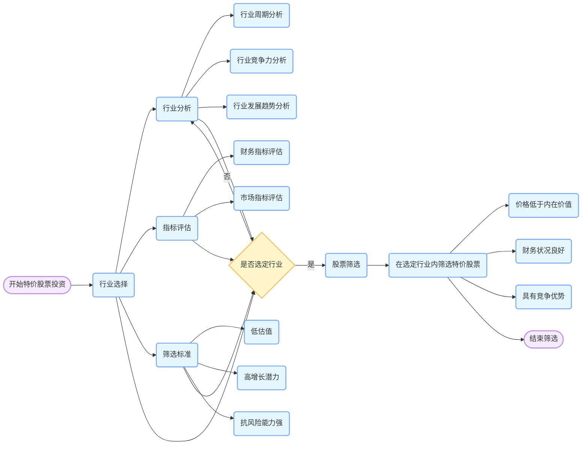

# 特价股票投资中的行业选择考虑

> 关键词：特价股票投资、行业选择、投资分析、财务指标、市场趋势

> 摘要：本文聚焦于特价股票投资中的行业选择问题。首先介绍了研究此问题的背景、目的、预期读者等信息。接着阐述了特价股票、行业选择等核心概念及其联系，给出了相关的原理和架构示意图与流程图。详细讲解了用于行业选择的核心算法原理，并通过Python代码进行说明。深入探讨了涉及的数学模型和公式，结合实际例子进行解释。通过项目实战展示了开发环境搭建、源代码实现及解读。分析了特价股票投资行业选择在不同场景下的实际应用。推荐了学习资源、开发工具框架以及相关论文著作。最后总结了未来发展趋势与挑战，提供常见问题解答和扩展阅读参考资料，旨在为投资者在特价股票投资的行业选择方面提供全面、深入的指导。

## 1. 背景介绍 
### 1.1 目的和范围
在股票投资领域，特价股票往往因其价格相对较低而吸引众多投资者的目光。然而，并非所有特价股票都具有投资价值，行业选择在其中起着至关重要的作用。本文章的目的在于深入探讨在特价股票投资过程中，如何进行有效的行业选择。范围涵盖了不同行业的特点、影响行业发展的因素、用于评估行业的方法和指标等方面，旨在帮助投资者筛选出具有潜力的行业，提高特价股票投资的成功率。

### 1.2 预期读者
本文的预期读者主要包括对股票投资有一定了解，希望进一步提升投资技能的个人投资者；从事金融投资领域工作，需要对特价股票投资进行深入研究的专业人士；以及金融相关专业的学生，用于学习和研究股票投资中的行业分析方法。

### 1.3 文档结构概述
本文将按照以下结构展开：首先介绍核心概念，明确特价股票和行业选择的定义及它们之间的联系；接着阐述用于行业选择的核心算法原理和具体操作步骤，并给出Python代码示例；然后介绍相关的数学模型和公式，结合实际例子进行详细讲解；通过项目实战展示如何在实际中运用这些方法进行行业选择；分析特价股票投资行业选择在不同场景下的实际应用；推荐学习资源、开发工具框架和相关论文著作；最后总结未来发展趋势与挑战，提供常见问题解答和扩展阅读参考资料。

### 1.4 术语表
#### 1.4.1 核心术语定义
- **特价股票**：指价格相对其内在价值或行业平均价格较低的股票。这种低价可能是由于市场短期波动、公司暂时困境或行业整体低迷等原因导致。
- **行业选择**：在股票投资中，根据各种因素和指标，从众多行业中筛选出具有投资潜力的行业的过程。
- **内在价值**：股票所代表的公司的真实价值，通常通过对公司的财务状况、盈利能力、发展前景等因素进行综合评估得出。

#### 1.4.2 相关概念解释
- **行业周期**：每个行业都有其自身的发展周期，包括初创期、成长期、成熟期和衰退期。不同阶段的行业具有不同的特点和投资风险。
- **行业壁垒**：阻止新企业进入某一行业的障碍，如技术壁垒、资金壁垒、政策壁垒等。高行业壁垒可以保护现有企业的市场份额和利润。
- **市场趋势**：指市场价格和交易活动的总体走向，包括上升趋势、下降趋势和横盘趋势。了解市场趋势对于判断行业的投资时机至关重要。

#### 1.4.3 缩略词列表
- **PE**：市盈率（Price-to-Earnings Ratio），指股票价格除以每股收益的比率，用于衡量股票的估值水平。
- **PB**：市净率（Price-to-Book Ratio），指股票价格除以每股净资产的比率，反映了股票价格相对于公司净资产的倍数。
- **ROE**：净资产收益率（Return on Equity），指净利润与平均股东权益的百分比，衡量公司运用自有资本的效率。

## 2. 核心概念与联系 
### 核心概念原理
特价股票投资中的行业选择基于以下原理：不同行业在经济发展过程中具有不同的表现和前景。一些行业可能处于快速发展阶段，具有较高的增长率和盈利能力；而另一些行业可能面临竞争激烈、市场饱和或技术变革的挑战。通过对行业的深入分析，投资者可以找到那些具有潜力的行业，在这些行业中选择特价股票，从而提高投资回报的可能性。

行业的发展受到多种因素的影响，包括宏观经济环境、政策法规、技术创新、消费者需求等。例如，在经济增长时期，消费、科技等行业往往表现较好；而在经济衰退时期，防御性行业如医药、公用事业等可能更具稳定性。

### 架构的文本示意图
```plaintext
特价股票投资
|
|-- 行业选择
|   |-- 行业分析
|   |   |-- 行业周期分析
|   |   |-- 行业竞争力分析
|   |   |-- 行业发展趋势分析
|   |
|   |-- 指标评估
|   |   |-- 财务指标（PE、PB、ROE等）
|   |   |-- 市场指标（成交量、换手率等）
|   |
|   |-- 筛选标准
|       |-- 低估值
|       |-- 高增长潜力
|       |-- 抗风险能力强
|
|-- 股票筛选
|   |-- 在选定行业内筛选特价股票
|   |   |-- 价格低于内在价值
|   |   |-- 财务状况良好
|   |   |-- 具有竞争优势
```

### Mermaid 流程图


## 3. 核心算法原理 & 具体操作步骤 
### 核心算法原理
在特价股票投资的行业选择中，我们可以采用多指标综合评估的算法。该算法的核心思想是通过对多个指标进行量化评估，然后根据一定的权重计算每个行业的综合得分，得分越高的行业越具有投资潜力。

具体来说，我们选取财务指标（如PE、PB、ROE）和市场指标（如成交量、换手率）作为评估指标。对于每个指标，我们设定一个标准值或参考范围，将每个行业的指标值与标准值进行比较，得到该指标的得分。然后根据各个指标的重要性赋予相应的权重，计算出每个行业的综合得分。

### 具体操作步骤
1. **数据收集**：收集各个行业的财务数据和市场数据，包括PE、PB、ROE、成交量、换手率等。
2. **指标标准化**：将收集到的指标数据进行标准化处理，消除不同指标之间的量纲差异。可以使用Z-score标准化方法，公式为：
   $$Z = \frac{X - \mu}{\sigma}$$
   其中，$X$ 是原始指标值，$\mu$ 是该指标的均值，$\sigma$ 是该指标的标准差。
3. **指标得分计算**：根据标准化后的指标值，计算每个行业在每个指标上的得分。可以采用线性映射的方法，将指标值映射到0 - 100分的范围内。例如，对于PE指标，假设标准值范围是10 - 20，当某个行业的PE值为15时，其得分可以计算为：
   $$Score_{PE} = \frac{15 - 10}{20 - 10} \times 100 = 50$$
4. **权重设定**：根据各个指标的重要性，设定相应的权重。例如，财务指标的权重可以设定为0.6，市场指标的权重可以设定为0.4。
5. **综合得分计算**：根据各个指标的得分和权重，计算每个行业的综合得分。公式为：
   $$Score_{total} = \sum_{i=1}^{n} w_i \times Score_i$$
   其中，$w_i$ 是第 $i$ 个指标的权重，$Score_i$ 是第 $i$ 个指标的得分。
6. **行业排序**：根据综合得分对各个行业进行排序，得分越高的行业越具有投资潜力。

### Python源代码实现
```python
import pandas as pd
import numpy as np

# 示例数据：假设有三个行业，每个行业有PE、PB、ROE、成交量、换手率五个指标
data = {
    '行业': ['行业A', '行业B', '行业C'],
    'PE': [12, 18, 22],
    'PB': [1.5, 2.0, 2.5],
    'ROE': [15, 20, 18],
    '成交量': [10000, 15000, 20000],
    '换手率': [2, 3, 4]
}
df = pd.DataFrame(data)

# 指标标准化
def z_score_standardization(data):
    return (data - data.mean()) / data.std()

for column in df.columns[1:]:
    df[column] = z_score_standardization(df[column])

# 指标得分计算
def calculate_score(data, min_val, max_val):
    return ((data - min_val) / (max_val - min_val)) * 100

# 假设PE的标准值范围是10 - 20
df['PE_score'] = calculate_score(df['PE'], df['PE'].min(), df['PE'].max())
# 假设PB的标准值范围是1 - 3
df['PB_score'] = calculate_score(df['PB'], df['PB'].min(), df['PB'].max())
# 假设ROE的标准值范围是10 - 25
df['ROE_score'] = calculate_score(df['ROE'], df['ROE'].min(), df['ROE'].max())
# 假设成交量的标准值范围是5000 - 25000
df['成交量_score'] = calculate_score(df['成交量'], df['成交量'].min(), df['成交量'].max())
# 假设换手率的标准值范围是1 - 5
df['换手率_score'] = calculate_score(df['换手率'], df['换手率'].min(), df['换手率'].max())

# 权重设定
weights = {
    'PE_score': 0.15,
    'PB_score': 0.15,
    'ROE_score': 0.3,
    '成交量_score': 0.2,
    '换手率_score': 0.2
}

# 综合得分计算
df['综合得分'] = 0
for column, weight in weights.items():
    df['综合得分'] += df[column] * weight

# 行业排序
df = df.sort_values(by='综合得分', ascending=False)

print(df)
```

## 4. 数学模型和公式 & 详细讲解 & 举例说明 
### 数学模型和公式
#### 1. Z-score标准化公式
$$Z = \frac{X - \mu}{\sigma}$$
其中，$Z$ 是标准化后的指标值，$X$ 是原始指标值，$\mu$ 是该指标的均值，$\sigma$ 是该指标的标准差。

**详细讲解**：Z-score标准化的目的是将不同量纲的指标转化为具有相同量纲的标准指标，便于进行比较和计算。通过减去均值并除以标准差，使得标准化后的指标均值为0，标准差为1。

**举例说明**：假设我们有三个行业的PE值分别为10、15、20。首先计算均值 $\mu = \frac{10 + 15 + 20}{3} = 15$，标准差 $\sigma = \sqrt{\frac{(10 - 15)^2 + (15 - 15)^2 + (20 - 15)^2}{3}} \approx 4.08$。对于PE值为10的行业，标准化后的Z值为 $Z = \frac{10 - 15}{4.08} \approx -1.23$。

#### 2. 指标得分计算公式
$$Score = \frac{X - X_{min}}{X_{max} - X_{min}} \times 100$$
其中，$Score$ 是指标得分，$X$ 是标准化后的指标值，$X_{min}$ 是该指标的最小值，$X_{max}$ 是该指标的最大值。

**详细讲解**：该公式将标准化后的指标值线性映射到0 - 100分的范围内，便于直观地比较各个行业在不同指标上的表现。

**举例说明**：假设标准化后的PE值范围是 -1.23 - 1.23，某个行业的标准化PE值为0。则该行业的PE得分 $Score_{PE} = \frac{0 - (-1.23)}{1.23 - (-1.23)} \times 100 = 50$。

#### 3. 综合得分计算公式
$$Score_{total} = \sum_{i=1}^{n} w_i \times Score_i$$
其中，$Score_{total}$ 是综合得分，$w_i$ 是第 $i$ 个指标的权重，$Score_i$ 是第 $i$ 个指标的得分。

**详细讲解**：综合得分是通过对各个指标的得分进行加权求和得到的，权重反映了各个指标在评估中的重要性。

**举例说明**：假设某个行业的PE得分是50，权重是0.15；PB得分是60，权重是0.15；ROE得分是70，权重是0.3；成交量得分是80，权重是0.2；换手率得分是90，权重是0.2。则该行业的综合得分 $Score_{total} = 0.15 \times 50 + 0.15 \times 60 + 0.3 \times 70 + 0.2 \times 80 + 0.2 \times 90 = 72.5$。

## 5. 项目实战：代码实际案例和详细解释说明 
### 5.1  开发环境搭建
#### 安装Python
首先需要安装Python，建议使用Python 3.7及以上版本。可以从Python官方网站（https://www.python.org/downloads/）下载对应操作系统的安装包，按照安装向导进行安装。

#### 安装必要的库
在项目中，我们使用了 `pandas` 和 `numpy` 库。可以使用以下命令进行安装：
```sh
pip install pandas numpy
```

### 5.2  源代码详细实现和代码解读
```python
import pandas as pd
import numpy as np

# 示例数据：假设有三个行业，每个行业有PE、PB、ROE、成交量、换手率五个指标
data = {
    '行业': ['行业A', '行业B', '行业C'],
    'PE': [12, 18, 22],
    'PB': [1.5, 2.0, 2.5],
    'ROE': [15, 20, 18],
    '成交量': [10000, 15000, 20000],
    '换手率': [2, 3, 4]
}
df = pd.DataFrame(data)

# 代码解读：使用字典创建数据，然后使用pandas的DataFrame将数据转换为表格形式，方便后续处理。

# 指标标准化
def z_score_standardization(data):
    return (data - data.mean()) / data.std()

for column in df.columns[1:]:
    df[column] = z_score_standardization(df[column])

# 代码解读：定义了一个z_score_standardization函数，用于对数据进行Z-score标准化。通过循环遍历除行业名称外的所有列，对每列数据进行标准化处理。

# 指标得分计算
def calculate_score(data, min_val, max_val):
    return ((data - min_val) / (max_val - min_val)) * 100

# 假设PE的标准值范围是10 - 20
df['PE_score'] = calculate_score(df['PE'], df['PE'].min(), df['PE'].max())
# 假设PB的标准值范围是1 - 3
df['PB_score'] = calculate_score(df['PB'], df['PB'].min(), df['PB'].max())
# 假设ROE的标准值范围是10 - 25
df['ROE_score'] = calculate_score(df['ROE'], df['ROE'].min(), df['ROE'].max())
# 假设成交量的标准值范围是5000 - 25000
df['成交量_score'] = calculate_score(df['成交量'], df['成交量'].min(), df['成交量'].max())
# 假设换手率的标准值范围是1 - 5
df['换手率_score'] = calculate_score(df['换手率'], df['换手率'].min(), df['换手率'].max())

# 代码解读：定义了一个calculate_score函数，用于计算指标得分。根据假设的标准值范围，对每个指标计算得分，并添加到DataFrame中。

# 权重设定
weights = {
    'PE_score': 0.15,
    'PB_score': 0.15,
    'ROE_score': 0.3,
    '成交量_score': 0.2,
    '换手率_score': 0.2
}

# 代码解读：使用字典设定各个指标的权重。

# 综合得分计算
df['综合得分'] = 0
for column, weight in weights.items():
    df['综合得分'] += df[column] * weight

# 代码解读：初始化综合得分为0，然后通过循环遍历权重字典，将每个指标的得分乘以相应的权重并累加到综合得分中。

# 行业排序
df = df.sort_values(by='综合得分', ascending=False)

print(df)

# 代码解读：使用sort_values方法对DataFrame按照综合得分进行降序排序，最后打印排序后的结果。
```

### 5.3  代码解读与分析
通过上述代码，我们实现了特价股票投资中行业选择的多指标综合评估算法。首先收集了各个行业的指标数据，然后对数据进行标准化处理，消除了不同指标之间的量纲差异。接着计算了每个行业在各个指标上的得分，并根据设定的权重计算了综合得分。最后对行业进行排序，得分越高的行业越具有投资潜力。

需要注意的是，代码中的标准值范围和权重是假设的，实际应用中需要根据具体情况进行调整。同时，数据的准确性和完整性对评估结果有重要影响，建议使用可靠的数据源。

## 6. 实际应用场景 
### 个人投资者
对于个人投资者来说，在进行特价股票投资时，行业选择可以帮助他们缩小投资范围，提高投资效率。通过分析不同行业的发展趋势和财务状况，个人投资者可以选择那些具有潜力的行业，在这些行业中寻找特价股票。例如，在科技行业快速发展的时期，个人投资者可以关注科技行业中的特价股票，如一些新兴的科技公司，这些公司可能由于市场认知度不高或短期业绩波动而导致股价较低，但具有较高的成长潜力。

### 机构投资者
机构投资者通常管理着大量的资金，行业选择对于他们来说尤为重要。机构投资者可以通过深入的行业研究和分析，构建投资组合，分散投资风险。例如，一家基金公司可以根据不同行业的特点和市场趋势，将资金分配到多个行业，同时在每个行业中选择具有代表性的特价股票。这样可以在保证投资收益的同时，降低单一行业波动带来的风险。

### 金融分析师
金融分析师需要为客户提供专业的投资建议，行业选择是他们工作的重要组成部分。通过对各个行业的宏观经济环境、政策法规、技术创新等因素进行分析，金融分析师可以预测行业的发展趋势，为客户推荐具有投资价值的行业和股票。例如，在新能源汽车行业兴起的背景下，金融分析师可以分析该行业的市场规模、竞争格局、技术发展等情况，为客户提供关于新能源汽车行业特价股票的投资建议。

## 7. 工具和资源推荐
### 7.1 学习资源推荐
#### 7.1.1 书籍推荐
- 《聪明的投资者》（The Intelligent Investor）：作者本杰明·格雷厄姆（Benjamin Graham）是价值投资的奠基人，本书介绍了价值投资的基本理念和方法，对于理解特价股票投资有很大帮助。
- 《金融炼金术》（The Alchemy of Finance）：作者乔治·索罗斯（George Soros）通过自己的投资实践，阐述了反身性理论，对投资者理解市场趋势和行业发展有深刻的启示。
- 《行业分析与公司估值》：本书详细介绍了行业分析的方法和公司估值的模型，对于在特价股票投资中进行行业选择和股票估值具有重要的参考价值。

#### 7.1.2 在线课程
- Coursera上的“投资学原理”（Principles of Investing）：该课程由知名教授授课，系统地介绍了投资学的基本原理和方法，包括行业分析和股票投资。
- edX上的“金融市场”（Financial Markets）：课程涵盖了金融市场的各个方面，对于理解行业发展和市场趋势有很大帮助。
- 网易云课堂上的“股票投资实战教程”：课程结合实际案例，详细讲解了股票投资的技巧和方法，包括特价股票投资中的行业选择。

#### 7.1.3 技术博客和网站
- 雪球网（https://xueqiu.com/）：是一个股票投资社区，提供了丰富的股票资讯、行业分析和投资者交流平台。
- 东方财富网（https://www.eastmoney.com/）：提供全面的金融信息和数据，包括行业动态、公司财报等，对于行业分析和股票投资有很大帮助。
- 金融界（https://www.jrj.com.cn/）：提供金融市场的实时行情、分析报告和投资策略，是投资者获取信息的重要渠道。

### 7.2 开发工具框架推荐
#### 7.2.1 IDE和编辑器
- PyCharm：是一款专业的Python集成开发环境，提供了丰富的代码编辑、调试和分析功能，适合进行Python数据分析和算法实现。
- Jupyter Notebook：是一个交互式的开发环境，支持Python、R等多种编程语言，方便进行数据探索和可视化分析。
- Visual Studio Code：是一款轻量级的代码编辑器，支持多种编程语言和插件扩展，具有良好的代码编辑体验。

#### 7.2.2 调试和性能分析工具
- pdb：是Python自带的调试工具，可以在代码中设置断点，逐步执行代码，帮助开发者定位问题。
- cProfile：是Python的性能分析工具，可以分析代码的执行时间和函数调用情况，帮助开发者优化代码性能。
- Py-Spy：是一个用于Python程序的性能分析工具，可以实时监控Python程序的CPU使用情况和函数调用栈，方便开发者发现性能瓶颈。

#### 7.2.3 相关框架和库
- pandas：是Python中用于数据处理和分析的强大库，提供了数据结构和数据分析工具，方便进行数据清洗、转换和统计分析。
- numpy：是Python中用于科学计算的基础库，提供了高效的数组操作和数学函数，对于数值计算和数据分析非常有用。
- scikit-learn：是Python中用于机器学习的库，提供了各种机器学习算法和工具，如分类、回归、聚类等，可以用于行业分析和股票预测。

### 7.3 相关论文著作推荐
#### 7.3.1 经典论文
- Fama, Eugene F., and Kenneth R. French. "Common risk factors in the returns on stocks and bonds." Journal of Financial Economics 33.1 (1993): 3-56. 该论文提出了Fama-French三因子模型，用于解释股票收益率的变化，对于理解行业和股票的风险与收益关系有重要意义。
- Sharpe, William F. "Capital asset prices: A theory of market equilibrium under conditions of risk." The journal of finance 19.3 (1964): 425-442. 该论文提出了资本资产定价模型（CAPM），为资产定价和投资组合理论奠定了基础。

#### 7.3.2 最新研究成果
- Hong, Harrison, and Jeremy C. Stein. "Differences of opinion, short-sales constraints, and market crashes." The Review of Financial Studies 14.2 (2001): 487-525. 该论文研究了市场中投资者意见分歧和卖空限制对市场崩溃的影响，对于理解市场波动和行业风险有一定的参考价值。
- Barberis, Nicholas, and Richard H. Thaler. "A survey of behavioral finance." Handbook of the economics of finance 1 (2003): 1053-1128. 该论文对行为金融学进行了综述，探讨了投资者的心理和行为对金融市场的影响，对于理解行业选择和股票投资中的非理性因素有帮助。

#### 7.3.3 应用案例分析
- Damodaran, Aswath. "Damodaran on Valuation: Security Analysis for Investment and Corporate Finance." Wiley, 2012. 本书通过大量的实际案例，介绍了公司估值的方法和应用，对于在特价股票投资中进行行业选择和股票估值具有重要的参考价值。
- Greenwald, Bruce C. N., et al. "Value Investing: From Graham to Buffett and Beyond." Wiley, 2001. 本书结合了格雷厄姆和巴菲特的价值投资理念，通过实际案例分析了如何在不同行业中寻找具有投资价值的股票。

## 8. 总结：未来发展趋势与挑战
### 未来发展趋势
#### 科技驱动行业变革
随着科技的不断进步，新兴科技行业如人工智能、大数据、云计算、区块链等将继续快速发展。这些行业具有较高的创新性和成长性，可能会涌现出更多具有投资价值的特价股票。同时，科技的应用也将推动传统行业的转型升级，如制造业的智能化、金融行业的数字化等，为投资者带来新的投资机会。

#### 绿色投资兴起
在全球气候变化和可持续发展的背景下，绿色投资将成为未来的重要趋势。新能源、环保、节能等行业将受到更多的关注和支持，相关的特价股票可能具有较大的投资潜力。投资者在进行行业选择时，需要考虑行业的环保和可持续发展因素。

#### 全球化与区域化并存
全球化趋势使得资本和信息在全球范围内流动更加便捷，投资者可以更容易地投资于不同国家和地区的行业和股票。同时，区域化经济合作也在不断加强，如“一带一路”倡议等，为相关地区的行业发展带来机遇。投资者需要关注全球和区域经济的发展动态，把握不同地区的行业投资机会。

### 挑战
#### 市场不确定性增加
全球经济和政治环境的不确定性增加，如贸易摩擦、地缘政治冲突、疫情等，会对各个行业的发展产生影响。投资者在进行行业选择时，需要更加关注宏观经济和政策变化，及时调整投资策略。

#### 数据质量和分析难度
随着数据量的不断增加，数据的质量和分析难度也在提高。投资者需要获取准确、及时、全面的数据，并运用有效的分析方法进行行业分析。同时，数据的安全性和隐私保护也是需要关注的问题。

#### 行业竞争加剧
各个行业的竞争日益激烈，新兴行业不断涌现，传统行业也在不断创新和转型。投资者需要准确判断行业的竞争格局和企业的竞争优势，避免投资于竞争激烈、前景不佳的行业和企业。

## 9. 附录：常见问题与解答
### 问题1：如何确定指标的标准值范围和权重？
标准值范围和权重的确定需要综合考虑多个因素。标准值范围可以参考行业的历史数据、同行业的平均水平或市场的普遍认知。例如，对于PE指标，一般认为10 - 20是一个较为合理的范围，但不同行业可能会有所差异。权重的确定可以根据投资者的投资目标、风险偏好和对各个指标的重视程度来进行。例如，如果投资者更注重公司的盈利能力，可以适当提高ROE指标的权重。

### 问题2：特价股票是否一定具有投资价值？
特价股票并不一定具有投资价值。特价股票可能是由于公司基本面恶化、行业前景不佳或市场情绪等原因导致价格下跌。投资者在选择特价股票时，需要对公司的财务状况、行业发展趋势、竞争优势等进行深入分析，判断其是否具有投资潜力。

### 问题3：如何处理数据缺失的情况？
如果遇到数据缺失的情况，可以采用以下方法进行处理：
- 删除缺失数据：如果缺失数据的比例较小，可以直接删除包含缺失数据的样本。
- 填充缺失数据：可以使用均值、中位数或其他统计量来填充缺失数据。也可以使用机器学习算法进行数据填充，如线性回归、决策树等。

### 问题4：行业选择是否是投资成功的唯一因素？
行业选择是投资成功的重要因素之一，但不是唯一因素。除了行业选择外，投资者还需要关注公司的基本面、管理层能力、估值水平、市场情绪等因素。同时，合理的投资组合配置和风险管理也是投资成功的关键。

## 10. 扩展阅读 & 参考资料
### 扩展阅读
- 《彼得·林奇的成功投资》（One Up on Wall Street）：作者彼得·林奇（Peter Lynch）是著名的基金经理，本书分享了他的投资经验和选股方法，对于投资者在特价股票投资中进行行业选择和股票筛选有很大的启发。
- 《战胜华尔街》（Beating the Street）：彼得·林奇的另一本著作，进一步阐述了他的投资理念和实践经验，包括如何挖掘具有潜力的行业和公司。
- 《漫步华尔街》（A Random Walk Down Wall Street）：作者伯顿·马尔基尔（Burton Malkiel）探讨了股票市场的随机性和有效性，对于投资者理解市场和进行投资决策有一定的参考价值。

### 参考资料
- 上海证券交易所官方网站（https://www.sse.com.cn/）：提供上海证券交易所的相关信息和数据，包括上市公司公告、行业统计等。
- 深圳证券交易所官方网站（https://www.szse.cn/）：提供深圳证券交易所的相关信息和数据，对于研究国内股票市场和行业发展有重要参考价值。
- 中国证券监督管理委员会官方网站（https://www.csrc.gov.cn/）：提供证券市场的监管政策、法规和相关信息，对于了解证券市场的运行和行业规范有帮助。

作者：AI天才研究院/AI Genius Institute & 禅与计算机程序设计艺术 /Zen And The Art of Computer Programming