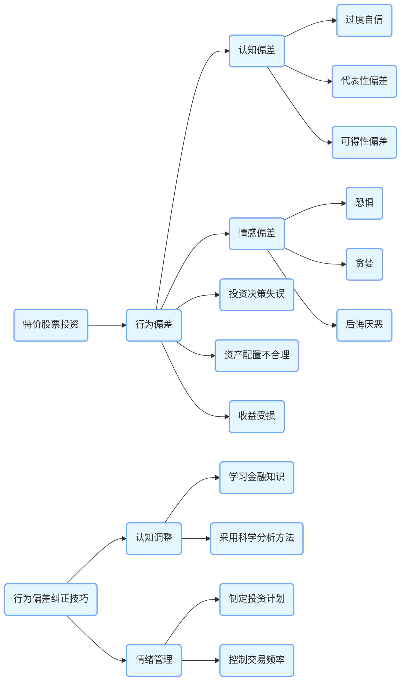

# 特价股票投资中的行为偏差纠正技巧

> 关键词：特价股票、投资行为偏差、纠正技巧、行为金融学、投资决策

> 摘要：本文聚焦于特价股票投资领域，深入探讨投资者在该过程中常出现的行为偏差及其纠正技巧。首先介绍了行为偏差产生的背景和对投资决策的影响，阐述了相关核心概念及其联系。接着详细讲解了分析行为偏差的核心算法原理与操作步骤，并运用数学模型和公式进行深入剖析。通过项目实战案例展示如何在实际投资中识别和纠正行为偏差。同时，介绍了特价股票投资行为偏差相关的实际应用场景、推荐了学习和开发所需的工具与资源。最后对未来投资领域中行为偏差纠正的发展趋势与挑战进行总结，为投资者在特价股票投资中做出更理性的决策提供全面而深入的指导。

## 1. 背景介绍 
### 1.1 目的和范围
在股票投资市场中，特价股票往往因其价格相对较低而吸引众多投资者的关注。然而，投资者在对特价股票进行投资决策时，常常受到各种行为偏差的影响，导致投资结果不尽如人意。本文的目的在于深入研究特价股票投资中常见的行为偏差，并提供有效的纠正技巧，帮助投资者在这一领域做出更理性、更科学的投资决策。范围涵盖了行为偏差的产生原因、表现形式、对投资决策的影响以及具体的纠正方法等方面。

### 1.2 预期读者
本文预期读者主要包括对股票投资有兴趣的个人投资者，尤其是关注特价股票投资的人群。同时，也适用于金融从业者、投资顾问以及对行为金融学领域感兴趣的研究人员，他们可以从本文中获取关于特价股票投资行为偏差的深入分析和实用的纠正策略。

### 1.3 文档结构概述
本文首先介绍相关背景信息，包括目的、预期读者和文档结构等内容。接着阐述核心概念与联系，帮助读者理解行为偏差的本质。然后详细讲解核心算法原理与具体操作步骤，以及相关的数学模型和公式。通过项目实战案例，展示如何在实际投资中应用这些理论和方法。之后介绍实际应用场景，为读者提供更直观的认识。再推荐相关的工具和资源，方便读者进一步学习和实践。最后对未来发展趋势与挑战进行总结，并提供常见问题解答和扩展阅读参考资料。

### 1.4 术语表
#### 1.4.1 核心术语定义
- **特价股票**：指市场价格相对其内在价值或行业平均水平较低的股票，通常可能由于公司短期业绩不佳、市场情绪波动等原因导致价格被低估。
- **行为偏差**：投资者在投资决策过程中，由于认知、情感、心理等因素的影响，偏离了理性决策的标准，做出非理性的投资行为。
- **行为金融学**：将心理学、行为科学等理论与金融学相结合的学科，研究投资者在金融市场中的决策行为和心理特征，以及这些因素对金融市场的影响。

#### 1.4.2 相关概念解释
- **认知偏差**：是行为偏差的一种，指投资者在获取、处理和解释信息时，由于认知能力的局限或思维方式的缺陷，产生的系统性偏差。例如，过度自信、代表性偏差等。
- **情感偏差**：由投资者的情绪和情感因素引起的偏差，如恐惧、贪婪等情绪会影响投资者的决策。当市场下跌时，投资者可能因恐惧而过度抛售股票；当市场上涨时，可能因贪婪而追高买入。

#### 1.4.3 缩略词列表
- **EMH**：有效市场假说（Efficient Market Hypothesis），认为市场价格已经反映了所有可用的信息，投资者无法通过分析信息获得超额收益。
- **BPT**：行为投资组合理论（Behavioral Portfolio Theory），考虑了投资者的心理因素和行为偏差，对传统投资组合理论进行了改进。

## 2. 核心概念与联系 

### 核心概念原理
在特价股票投资中，行为偏差是影响投资者决策的重要因素。行为偏差的产生源于投资者的认知和情感因素。认知偏差主要是由于投资者的信息处理能力有限，在面对大量复杂的信息时，往往采用简化的思维模式，从而导致决策偏差。例如，代表性偏差就是投资者根据股票的某些特征或过去的表现，简单地推断其未来的走势，而忽略了其他重要信息。

情感偏差则是由投资者的情绪波动引起的。当投资者处于恐惧、贪婪等强烈情绪状态时，会影响其对风险和收益的判断。在特价股票投资中，投资者可能因为恐惧错过低价买入的机会，或者因为贪婪而过度持有已经上涨的股票，导致损失。

行为金融学认为，投资者并非完全理性的经济人，而是受到各种心理因素的影响。这些行为偏差会导致股票价格偏离其内在价值，从而为理性投资者提供了获取超额收益的机会。

### 架构的文本示意图
```plaintext
特价股票投资行为偏差体系
|-- 行为偏差来源
|   |-- 认知偏差
|   |   |-- 过度自信
|   |   |-- 代表性偏差
|   |   |-- 可得性偏差
|   |-- 情感偏差
|   |   |-- 恐惧
|   |   |-- 贪婪
|   |   |-- 后悔厌恶
|-- 行为偏差影响
|   |-- 投资决策失误
|   |-- 资产配置不合理
|   |-- 收益受损
|-- 行为偏差纠正技巧
|   |-- 认知调整
|   |   |-- 学习金融知识
|   |   |-- 采用科学分析方法
|   |-- 情绪管理
|   |   |-- 制定投资计划
|   |   |-- 控制交易频率
```

### Mermaid 流程图


## 3. 核心算法原理 & 具体操作步骤 

### 核心算法原理
我们可以通过构建一个简单的行为偏差分析模型来识别和纠正投资者在特价股票投资中的行为偏差。该模型主要基于机器学习中的分类算法，将投资者的行为数据进行分类，判断其是否存在行为偏差，并进一步分析偏差的类型。

以下是一个使用 Python 实现的简单示例，使用决策树分类算法：

```python
import pandas as pd
from sklearn.tree import DecisionTreeClassifier
from sklearn.model_selection import train_test_split
from sklearn.metrics import accuracy_score

# 假设我们有以下特征数据和标签数据
# 特征数据：投资者的交易频率、平均持仓时间、投资收益率等
# 标签数据：是否存在行为偏差（0 表示不存在，1 表示存在）
data = {
    '交易频率': [10, 5, 8, 3, 12],
    '平均持仓时间': [30, 60, 45, 90, 20],
    '投资收益率': [0.1, 0.2, 0.15, 0.25, 0.05],
    '是否存在行为偏差': [1, 0, 1, 0, 1]
}

df = pd.DataFrame(data)

# 提取特征和标签
X = df[['交易频率', '平均持仓时间', '投资收益率']]
y = df['是否存在行为偏差']

# 划分训练集和测试集
X_train, X_test, y_train, y_test = train_test_split(X, y, test_size=0.2, random_state=42)

# 创建决策树分类器
clf = DecisionTreeClassifier()

# 训练模型
clf.fit(X_train, y_train)

# 预测
y_pred = clf.predict(X_test)

# 计算准确率
accuracy = accuracy_score(y_test, y_pred)
print(f"模型准确率: {accuracy}")
```

### 具体操作步骤
1. **数据收集**：收集投资者的行为数据，包括交易频率、平均持仓时间、投资收益率、买卖时机等信息。这些数据可以从投资者的交易记录、账户信息等渠道获取。
2. **数据预处理**：对收集到的数据进行清洗、整理和标准化处理。去除缺失值、异常值，将数据转换为适合模型输入的格式。
3. **特征选择**：从预处理后的数据中选择与行为偏差相关的特征，如上述示例中的交易频率、平均持仓时间和投资收益率。
4. **模型训练**：使用训练数据对分类模型进行训练，调整模型参数，使其能够准确地识别行为偏差。
5. **模型评估**：使用测试数据对训练好的模型进行评估，计算模型的准确率、召回率、F1 值等指标，评估模型的性能。
6. **偏差纠正**：根据模型的预测结果，对存在行为偏差的投资者提供相应的纠正建议。例如，如果模型判断投资者存在过度交易的行为偏差，可以建议其控制交易频率，制定合理的投资计划。

## 4. 数学模型和公式 & 详细讲解 & 举例说明 

### 决策树分类算法的数学原理
决策树是一种基于树结构进行决策的分类算法。其基本思想是通过对特征空间的划分，将数据集逐步分割成不同的子集，使得每个子集内的样本具有较高的同质性。决策树的构建过程主要基于信息增益、信息增益比、基尼指数等指标来选择最优的划分特征和划分点。

#### 信息增益
信息增益是衡量特征对分类任务的重要性的指标。设数据集 $D$ 的信息熵为 $H(D)$，特征 $A$ 对数据集 $D$ 的信息增益为 $g(D, A)$，其计算公式为：

$$g(D, A) = H(D) - H(D|A)$$

其中，$H(D)$ 表示数据集 $D$ 的信息熵，计算公式为：

$$H(D) = -\sum_{k=1}^{K}p_k\log_2p_k$$

$p_k$ 表示数据集 $D$ 中第 $k$ 类样本的比例，$K$ 表示类别数。

$H(D|A)$ 表示在特征 $A$ 给定的条件下，数据集 $D$ 的条件熵，计算公式为：

$$H(D|A) = \sum_{i=1}^{n}\frac{|D_i|}{|D|}H(D_i)$$

$|D|$ 表示数据集 $D$ 的样本数，$|D_i|$ 表示特征 $A$ 取值为第 $i$ 个值的样本数，$H(D_i)$ 表示特征 $A$ 取值为第 $i$ 个值的样本子集的信息熵。

#### 举例说明
假设有一个数据集 $D$ 包含 10 个样本，分为两类（正类和负类），其中正类样本有 6 个，负类样本有 4 个。则数据集 $D$ 的信息熵为：

$$H(D) = -\frac{6}{10}\log_2\frac{6}{10} - \frac{4}{10}\log_2\frac{4}{10} \approx 0.971$$

假设存在一个特征 $A$，有两个取值 $A_1$ 和 $A_2$，其中 $A_1$ 对应的样本有 6 个，正类样本 4 个，负类样本 2 个；$A_2$ 对应的样本有 4 个，正类样本 2 个，负类样本 2 个。

则 $H(D_1) = -\frac{4}{6}\log_2\frac{4}{6} - \frac{2}{6}\log_2\frac{2}{6} \approx 0.918$，$H(D_2) = -\frac{2}{4}\log_2\frac{2}{4} - \frac{2}{4}\log_2\frac{2}{4} = 1$。

$$H(D|A) = \frac{6}{10}H(D_1) + \frac{4}{10}H(D_2) = \frac{6}{10} \times 0.918 + \frac{4}{10} \times 1 \approx 0.951$$

特征 $A$ 对数据集 $D$ 的信息增益为：

$$g(D, A) = H(D) - H(D|A) = 0.971 - 0.951 = 0.02$$

通过计算不同特征的信息增益，选择信息增益最大的特征作为当前节点的划分特征，递归地构建决策树。

## 5. 项目实战：代码实际案例和详细解释说明 

### 5.1  开发环境搭建
- **Python 环境**：建议使用 Python 3.7 及以上版本。可以从 Python 官方网站（https://www.python.org/downloads/） 下载并安装。
- **开发工具**：推荐使用 PyCharm 或 Jupyter Notebook 作为开发工具。PyCharm 是一款功能强大的 Python 集成开发环境，提供了丰富的代码编辑、调试和项目管理功能；Jupyter Notebook 则适合进行交互式的代码开发和数据分析。
- **第三方库安装**：在命令行中使用以下命令安装所需的第三方库：
```sh
pip install pandas scikit-learn
```

### 5.2  源代码详细实现和代码解读
以下是一个更完整的特价股票投资行为偏差分析项目的代码示例：

```python
import pandas as pd
from sklearn.tree import DecisionTreeClassifier
from sklearn.model_selection import train_test_split
from sklearn.metrics import accuracy_score, classification_report
from sklearn.preprocessing import StandardScaler

# 模拟数据生成
def generate_data():
    data = {
        '交易频率': [10, 5, 8, 3, 12, 7, 4, 9, 6, 11],
        '平均持仓时间': [30, 60, 45, 90, 20, 50, 70, 40, 80, 35],
        '投资收益率': [0.1, 0.2, 0.15, 0.25, 0.05, 0.18, 0.22, 0.12, 0.28, 0.08],
        '是否存在行为偏差': [1, 0, 1, 0, 1, 0, 0, 1, 0, 1]
    }
    return pd.DataFrame(data)

# 数据预处理
def preprocess_data(df):
    X = df[['交易频率', '平均持仓时间', '投资收益率']]
    y = df['是否存在行为偏差']

    # 数据标准化
    scaler = StandardScaler()
    X_scaled = scaler.fit_transform(X)

    return X_scaled, y

# 模型训练和评估
def train_and_evaluate(X, y):
    X_train, X_test, y_train, y_test = train_test_split(X, y, test_size=0.2, random_state=42)

    clf = DecisionTreeClassifier()
    clf.fit(X_train, y_train)

    y_pred = clf.predict(X_test)

    accuracy = accuracy_score(y_test, y_pred)
    report = classification_report(y_test, y_pred)

    print(f"模型准确率: {accuracy}")
    print("分类报告:")
    print(report)

    return clf

# 主函数
def main():
    df = generate_data()
    X, y = preprocess_data(df)
    model = train_and_evaluate(X, y)

if __name__ == "__main__":
    main()
```

### 代码解读与分析
1. **数据生成**：`generate_data` 函数模拟生成了一个包含投资者行为数据的 DataFrame，包括交易频率、平均持仓时间、投资收益率和是否存在行为偏差等特征。
2. **数据预处理**：`preprocess_data` 函数对数据进行预处理，提取特征和标签，并使用 `StandardScaler` 对特征数据进行标准化处理，使得不同特征具有相同的尺度，有助于提高模型的性能。
3. **模型训练和评估**：`train_and_evaluate` 函数将数据集划分为训练集和测试集，使用决策树分类器进行训练，并对模型进行评估。计算模型的准确率和分类报告，分类报告中包含了精确率、召回率、F1 值等指标，能够更全面地评估模型的性能。
4. **主函数**：`main` 函数调用上述函数，完成数据生成、预处理、模型训练和评估的整个流程。

通过这个项目实战，我们可以看到如何使用 Python 和机器学习算法来分析投资者在特价股票投资中的行为偏差，为进一步的偏差纠正提供依据。

## 6