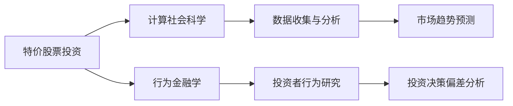

# 特价股票投资中的计算社会科学与行为金融学应用

> 关键词：特价股票投资、计算社会科学、行为金融学、投资决策、市场行为分析

> 摘要：本文深入探讨了在特价股票投资领域中计算社会科学与行为金融学的应用。通过结合这两个跨学科领域的理论与方法，旨在揭示投资者行为模式、市场情绪以及社会因素对特价股票投资的影响机制。详细阐述了相关核心概念、算法原理、数学模型，并结合实际案例进行分析，为投资者提供更全面、科学的投资决策依据，同时展望了该领域未来的发展趋势与面临的挑战。

## 1. 背景介绍 
### 1.1 目的和范围
特价股票投资一直是金融市场中备受关注的领域，投资者试图通过寻找价格被低估的股票来获取超额收益。然而，传统的金融理论往往假设投资者是完全理性的，这与实际市场中的投资者行为存在较大偏差。计算社会科学和行为金融学的兴起为理解特价股票投资提供了新的视角和方法。

本文的目的在于系统地探讨计算社会科学与行为金融学在特价股票投资中的应用，包括如何运用这些理论和方法分析投资者行为、预测市场趋势以及制定投资策略。范围涵盖了从理论基础到实际应用的各个方面，旨在为投资者、金融从业者和研究人员提供有价值的参考。

### 1.2 预期读者
本文的预期读者包括但不限于以下几类人群：
- **投资者**：希望通过了解计算社会科学和行为金融学的应用，提升自己在特价股票投资中的决策能力。
- **金融从业者**：如分析师、交易员等，需要深入理解市场行为和投资者心理，以更好地为客户提供服务。
- **研究人员**：对计算社会科学、行为金融学以及金融市场行为研究感兴趣的学者和研究人员。
- **学生**：金融、经济、计算机科学等相关专业的学生，通过阅读本文可以拓宽知识面，了解跨学科领域的研究动态。

### 1.3 文档结构概述
本文将按照以下结构进行组织：
- **核心概念与联系**：介绍计算社会科学、行为金融学以及特价股票投资的核心概念，并阐述它们之间的联系。
- **核心算法原理 & 具体操作步骤**：详细讲解用于分析投资者行为和市场趋势的核心算法，并给出具体的操作步骤。
- **数学模型和公式 & 详细讲解 & 举例说明**：建立数学模型来描述投资者行为和市场动态，并通过具体例子进行说明。
- **项目实战：代码实际案例和详细解释说明**：通过实际的代码案例，展示如何运用计算社会科学和行为金融学的方法进行特价股票投资分析。
- **实际应用场景**：探讨计算社会科学和行为金融学在特价股票投资中的实际应用场景。
- **工具和资源推荐**：推荐相关的学习资源、开发工具和研究论文。
- **总结：未来发展趋势与挑战**：总结本文的主要内容，展望该领域未来的发展趋势，并分析面临的挑战。
- **附录：常见问题与解答**：解答读者在阅读过程中可能遇到的常见问题。
- **扩展阅读 & 参考资料**：提供相关的扩展阅读材料和参考资料。

### 1.4 术语表
#### 1.4.1 核心术语定义
- **特价股票**：指价格相对于其内在价值被低估的股票。
- **计算社会科学**：运用计算方法和技术来研究社会现象和社会行为的学科。
- **行为金融学**：结合心理学、社会学等学科的理论和方法，研究投资者在金融市场中的行为和决策过程的学科。
- **投资者情绪**：指投资者对市场和股票的乐观或悲观态度。
- **市场异象**：指金融市场中出现的与传统金融理论不符的现象。

#### 1.4.2 相关概念解释
- **羊群行为**：指投资者在决策过程中受到其他投资者的影响，盲目跟随他人的投资决策。
- **过度自信**：指投资者高估自己的投资能力和判断准确性。
- **锚定效应**：指投资者在决策过程中过于依赖最初获得的信息，而忽视后续信息的影响。

#### 1.4.3 缩略词列表
- **AI**：Artificial Intelligence，人工智能
- **ML**：Machine Learning，机器学习
- **NLP**：Natural Language Processing，自然语言处理

## 2. 核心概念与联系 
### 2.1 计算社会科学
计算社会科学是一门跨学科的研究领域，它结合了计算机科学、统计学、社会学、心理学等多个学科的理论和方法，旨在通过大规模数据的收集、分析和建模，揭示社会现象和社会行为的规律。在特价股票投资中，计算社会科学可以用于收集和分析投资者的行为数据、社交媒体数据、新闻报道等，以了解投资者的情绪和行为模式，预测市场趋势。

### 2.2 行为金融学
行为金融学是金融学的一个重要分支，它突破了传统金融理论中投资者完全理性的假设，认为投资者在决策过程中会受到心理、情感和社会因素的影响，从而导致投资决策的偏差。行为金融学研究的主要内容包括投资者的认知偏差、情绪波动、羊群行为等，以及这些因素对金融市场的影响。在特价股票投资中，行为金融学可以帮助投资者更好地理解市场异象，把握投资机会。

### 2.3 特价股票投资
特价股票投资是指投资者通过寻找价格被低估的股票，以低于其内在价值的价格买入，等待股票价格回归其内在价值时卖出，从而获取超额收益的投资策略。传统的特价股票投资方法主要基于基本面分析，通过对公司的财务报表、行业前景等进行分析，评估股票的内在价值。然而，随着计算社会科学和行为金融学的发展，投资者可以结合这些理论和方法，从更广泛的角度来寻找特价股票。

### 2.4 核心概念的联系
计算社会科学和行为金融学在特价股票投资中相互补充、相互促进。计算社会科学为行为金融学提供了大规模数据和先进的分析工具，使得行为金融学的研究更加深入和准确。例如，通过社交媒体数据和新闻报道的分析，可以实时了解投资者的情绪和市场热点，为行为金融学的研究提供实证依据。行为金融学则为计算社会科学的应用提供了理论指导，帮助投资者更好地理解数据背后的行为动机和市场机制。例如，根据行为金融学的理论，可以解释投资者的羊群行为和过度自信等现象，从而更好地预测市场趋势。

### 2.5 文本示意图
```plaintext
             特价股票投资
               |
       +-------+-------+
       |               |
计算社会科学       行为金融学
  |                   |
  |                   |
数据收集与分析      投资者行为研究
  |                   |
  |                   |
市场趋势预测      投资决策偏差分析
```

### 2.6 Mermaid 流程图


## 3. 核心算法原理 & 具体操作步骤 
### 3.1 投资者情绪分析算法
#### 3.1.1 算法原理
投资者情绪分析是计算社会科学在特价股票投资中的重要应用之一。其基本原理是通过对社交媒体数据、新闻报道等文本信息进行分析，提取其中与投资者情绪相关的词汇和语句，然后运用自然语言处理技术对这些信息进行分类和量化，从而得到投资者的情绪指数。

#### 3.1.2 Python 源代码实现
```python
import pandas as pd
from textblob import TextBlob

def sentiment_analysis(text):
    """
    对输入的文本进行情绪分析
    :param text: 输入的文本
    :return: 情绪极性值，范围在 -1 到 1 之间，-1 表示消极，1 表示积极
    """
    blob = TextBlob(text)
    return blob.sentiment.polarity

# 示例数据
data = {
    'news': [
        '股票市场前景乐观，预计将迎来上涨行情。',
        '公司业绩不佳，股价可能下跌。',
        '行业竞争激烈，投资需谨慎。'
    ]
}
df = pd.DataFrame(data)

# 进行情绪分析
df['sentiment'] = df['news'].apply(sentiment_analysis)

print(df)
```

#### 3.1.3 具体操作步骤
1. **数据收集**：从社交媒体平台、新闻网站等渠道收集与股票相关的文本信息。
2. **数据预处理**：对收集到的文本信息进行清洗和预处理，包括去除噪声、分词、词性标注等。
3. **情绪分析**：运用自然语言处理技术对预处理后的文本信息进行情绪分析，得到情绪极性值。
4. **情绪指数计算**：根据情绪极性值计算投资者的情绪指数，可以采用简单平均、加权平均等方法。

### 3.2 羊群行为检测算法
#### 3.2.1 算法原理
羊群行为检测是行为金融学在特价股票投资中的重要应用之一。其基本原理是通过分析投资者的交易行为数据，判断投资者是否存在羊群行为。常用的方法包括计算投资者的交易相关性、买卖方向一致性等指标。

#### 3.2.2 Python 源代码实现
```python
import numpy as np

def herding_behavior_detection(transaction_data):
    """
    羊群行为检测
    :param transaction_data: 投资者的交易行为数据，二维数组，每行表示一个投资者的交易记录
    :return: 羊群行为指标，值越大表示羊群行为越明显
    """
    num_investors = transaction_data.shape[0]
    num_stocks = transaction_data.shape[1]
    
    # 计算交易相关性矩阵
    correlation_matrix = np.corrcoef(transaction_data)
    
    # 计算羊群行为指标
    herding_index = np.mean(correlation_matrix[np.triu_indices(num_investors, k=1)])
    
    return herding_index

# 示例数据
transaction_data = np.array([
    [1, 0, 1],
    [1, 1, 0],
    [0, 1, 1]
])

herding_index = herding_behavior_detection(transaction_data)
print("羊群行为指标:", herding_index)
```

#### 3.2.3 具体操作步骤
1. **数据收集**：从证券交易所、金融机构等渠道收集投资者的交易行为数据。
2. **数据预处理**：对收集到的交易行为数据进行清洗和预处理，包括去除异常值、缺失值处理等。
3. **指标计算**：计算投资者的交易相关性、买卖方向一致性等指标。
4. **羊群行为判断**：根据计算得到的指标值，判断投资者是否存在羊群行为。

## 4. 数学模型和公式 & 详细讲解 & 举例说明 
### 4.1 投资者情绪指数模型
#### 4.1.1 数学模型
投资者情绪指数可以采用加权平均的方法进行计算，公式如下：
$$SI = \frac{\sum_{i=1}^{n} w_i \times s_i}{\sum_{i=1}^{n} w_i}$$
其中，$SI$ 表示投资者情绪指数，$n$ 表示文本信息的数量，$w_i$ 表示第 $i$ 条文本信息的权重，$s_i$ 表示第 $i$ 条文本信息的情绪极性值。

#### 4.1.2 详细讲解
权重 $w_i$ 可以根据文本信息的来源、影响力等因素进行确定。例如，来自权威媒体的新闻报道的权重可以设置得较高，而来自普通用户的社交媒体帖子的权重可以设置得较低。情绪极性值 $s_i$ 可以通过自然语言处理技术进行计算，范围在 -1 到 1 之间，-1 表示消极，1 表示积极。

#### 4.1.3 举例说明
假设我们收集到了三条与股票相关的文本信息，其情绪极性值和权重分别如下：
| 文本信息 | 情绪极性值 $s_i$ | 权重 $w_i$ |
| ---- | ---- | ---- |
| 股票市场前景乐观，预计将迎来上涨行情。 | 0.8 | 0.6 |
| 公司业绩不佳，股价可能下跌。 | -0.6 | 0.3 |
| 行业竞争激烈，投资需谨慎。 | -0.2 | 0.1 |

则投资者情绪指数为：
$$SI = \frac{0.6 \times 0.8 + 0.3 \times (-0.6) + 0.1 \times (-0.2)}{0.6 + 0.3 + 0.1} = \frac{0.48 - 0.18 - 0.02}{1} = 0.28$$

### 4.2 羊群行为指标模型
#### 4.2.1 数学模型
羊群行为指标可以采用交易相关性矩阵的平均值进行计算，公式如下：
$$HI = \frac{\sum_{i=1}^{n-1} \sum_{j=i+1}^{n} r_{ij}}{\frac{n(n - 1)}{2}}$$
其中，$HI$ 表示羊群行为指标，$n$ 表示投资者的数量，$r_{ij}$ 表示第 $i$ 个投资者和第 $j$ 个投资者的交易相关性。

#### 4.2.2 详细讲解
交易相关性 $r_{ij}$ 可以通过计算两个投资者的交易记录的相关系数得到。相关系数的范围在 -1 到 1 之间，-1 表示完全负相关，1 表示完全正相关。羊群行为指标 $HI$ 的值越大，表示投资者之间的交易行为越相似，羊群行为越明显。

#### 4.2.3 举例说明
假设我们有三个投资者，他们的交易记录如下：
| 投资者 | 股票 1 | 股票 2 | 股票 3 |
| ---- | ---- | ---- | ---- |
| 投资者 1 | 1 | 0 | 1 |
| 投资者 2 | 1 | 1 | 0 |
| 投资者 3 | 0 | 1 | 1 |

则交易相关性矩阵为：
$$
\begin{bmatrix}
1 & 0.5 & 0.5 \\
0.5 & 1 & 0.5 \\
0.5 & 0.5 & 1
\end{bmatrix}
$$

羊群行为指标为：
$$HI = \frac{0.5 + 0.5 + 0.5}{\frac{3 \times (3 - 1)}{2}} = \frac{1.5}{3} = 0.5$$

## 5. 项目实战：代码实际案例和详细解释说明 
### 5.1  开发环境搭建
#### 5.1.1 安装 Python
首先，需要安装 Python 开发环境。可以从 Python 官方网站（https://www.python.org/downloads/） 下载适合自己操作系统的 Python 安装包，并按照安装向导进行安装。

#### 5.1.2 安装必要的库
在安装好 Python 后，需要安装一些必要的库，包括 pandas、textblob 等。可以使用以下命令进行安装：
```sh
pip install pandas textblob
```

### 5.2  源代码详细实现和代码解读
#### 5.2.1 数据收集与预处理
```python
import pandas as pd

# 模拟数据收集
data = {
    'news': [
        '股票市场前景乐观，预计将迎来上涨行情。',
        '公司业绩不佳，股价可能下跌。',
        '行业竞争激烈，投资需谨慎。'
    ]
}
df = pd.DataFrame(data)

# 数据预处理：去除空格
df['news'] = df['news'].str.strip()

print(df)
```
代码解读：
- 首先，我们模拟了一个包含新闻文本信息的数据集，并将其存储在一个 DataFrame 中。
- 然后，使用 `str.strip()` 方法去除新闻文本中的空格。

#### 5.2.2 投资者情绪分析
```python
from textblob import TextBlob

def sentiment_analysis(text):
    """
    对输入的文本进行情绪分析
    :param text: 输入的文本
    :return: 情绪极性值，范围在 -1 到 1 之间，-1 表示消极，1 表示积极
    """
    blob = TextBlob(text)
    return blob.sentiment.polarity

# 进行情绪分析
df['sentiment'] = df['news'].apply(sentiment_analysis)

print(df)
```
代码解读：
- 定义了一个 `sentiment_analysis` 函数，用于对输入的文本进行情绪分析。
- 使用 `apply` 方法将 `sentiment_analysis` 函数应用到 DataFrame 的每一行，计算每条新闻的情绪极性值。

#### 5.2.3 羊群行为检测
```python
import numpy as np

def herding_behavior_detection(transaction_data):
    """
    羊群行为检测
    :param transaction_data: 投资者的交易行为数据，二维数组，每行表示一个投资者的交易记录
    :return: 羊群行为指标，值越大表示羊群行为越明显
    """
    num_investors = transaction_data.shape[0]
    num_stocks = transaction_data.shape[1]
    
    # 计算交易相关性矩阵
    correlation_matrix = np.corrcoef(transaction_data)
    
    # 计算羊群行为指标
    herding_index = np.mean(correlation_matrix[np.triu_indices(num_investors, k=1)])
    
    return herding_index

# 示例数据
transaction_data = np.array([
    [1, 0, 1],
    [1, 1, 0],
    [0, 1, 1]
])

herding_index = herding_behavior_detection(transaction_data)
print("羊群行为指标:", herding_index)
```
代码解读：
- 定义了一个 `herding_behavior_detection` 函数，用于检测投资者的羊群行为。
- 在函数内部，首先计算投资者的交易相关性矩阵，然后计算羊群行为指标。
- 最后，使用示例数据调用 `herding_behavior_detection` 函数，计算羊群行为指标。

### 5.3  代码解读与分析
#### 5.3.1 投资者情绪分析代码解读
- `TextBlob` 是一个简单易用的自然语言处理库，它提供了丰富的文本分析功能，包括情绪分析、词性标注等。
- `sentiment.polarity` 属性返回的是文本的情绪极性值，范围在 -1 到 1 之间，-1 表示消极，1 表示积极。

#### 5.3.2 羊群行为检测代码解读
- `np.corrcoef` 函数用于计算矩阵的相关系数矩阵。
- `np.triu_indices` 函数用于获取矩阵的上三角元素的索引。
- 通过计算相关系数矩阵的上三角元素的平均值，得到羊群行为指标。

#### 5.3.3 代码分析
通过以上代码，我们可以实现对投资者情绪和羊群行为的分析。投资者情绪分析可以帮助我们了解市场的情绪氛围，而羊群行为检测可以帮助我们发现投资者的行为模式。这些信息对于特价股票投资决策具有重要的参考价值。

## 6. 实际应用场景 
### 6.1 投资决策辅助
计算社会科学和行为金融学的方法可以帮助投资者更好地理解市场行为和投资者心理，从而为投资决策提供辅助。例如，通过投资者情绪分析，投资者可以了解市场的情绪氛围，判断市场是处于乐观还是悲观状态，从而决定是否买入或卖出股票。通过羊群行为检测，投资者可以发现市场中的羊群行为，避免盲目跟随他人的投资决策。

### 6.2 市场趋势预测
计算社会科学和行为金融学的方法可以用于预测市场趋势。例如，通过分析社交媒体数据和新闻报道，投资者可以了解市场热点和投资者情绪的变化，从而预测市场的走势。通过分析投资者的交易行为数据，投资者可以发现市场中的趋势和规律，从而制定相应的投资策略。

### 6.3 风险评估与管理
计算社会科学和行为金融学的方法可以帮助投资者评估和管理投资风险。例如，通过投资者情绪分析，投资者可以了解市场的情绪波动，判断市场是否存在过度乐观或过度悲观的情况，从而调整自己的投资组合。通过羊群行为检测，投资者可以发现市场中的系统性风险，采取相应的风险控制措施。

### 6.4 投资策略优化
计算社会科学和行为金融学的方法可以用于优化投资策略。例如，通过分析投资者的行为模式和市场情绪，投资者可以发现传统投资策略中存在的不足之处，从而对投资策略进行优化。通过结合计算社会科学和行为金融学的方法，投资者可以开发出更加个性化、智能化的投资策略。

## 7. 工具和资源推荐
### 7.1 学习资源推荐
#### 7.1.1 书籍推荐
- 《行为金融学》：理查德·泰勒（Richard Thaler）著，系统地介绍了行为金融学的理论和方法。
- 《计算社会科学》：邓肯·沃茨（Duncan Watts）著，介绍了计算社会科学的基本概念和应用。
- 《金融心理学》：拉斯·特维德（Lars Tvede）著，探讨了投资者的心理和行为对金融市场的影响。

#### 7.1.2 在线课程
- Coursera 上的 “Behavioral Finance” 课程：由知名教授授课，深入讲解行为金融学的理论和应用。
- edX 上的 “Computational Social Science” 课程：介绍计算社会科学的基本概念和方法。
- 中国大学 MOOC 上的 “金融市场与机构” 课程：涵盖了金融市场的基本理论和投资者行为分析。

#### 7.1.3 技术博客和网站
- Medium 上的金融科技相关博客：提供了最新的金融科技研究成果和应用案例。
- 金融界网站：提供了丰富的金融市场资讯和分析报告。
- 雪球网：一个投资者社区，提供了投资者的交流和分享平台。

### 7.2 开发工具框架推荐
#### 7.2.1 IDE和编辑器
- PyCharm：一款功能强大的 Python 集成开发环境，适合开发 Python 程序。
- Jupyter Notebook：一个交互式的开发环境，适合进行数据分析和实验。
- Visual Studio Code：一款轻量级的代码编辑器，支持多种编程语言。

#### 7.2.2 调试和性能分析工具
- pdb：Python 自带的调试工具，用于调试 Python 程序。
- cProfile：Python 自带的性能分析工具，用于分析 Python 程序的性能。
- Spyder：一个集成了调试和性能分析功能的 Python 开发环境。

#### 7.2.3 相关框架和库
- pandas：一个强大的数据分析库，用于数据处理和分析。
- textblob：一个简单易用的自然语言处理库，用于文本分析。
- numpy：一个科学计算库，用于处理数组和矩阵运算。

### 7.3 相关论文著作推荐
#### 7.3.1 经典论文
- “Prospect Theory: An Analysis of Decision under Risk”：丹尼尔·卡尼曼（Daniel Kahneman）和阿莫斯·特沃斯基（Amos Tversky）著，提出了前景理论，为行为金融学的发展奠定了基础。
- “A Behavioral Model of Rational Choice”：赫伯特·西蒙（Herbert Simon）著，提出了有限理性理论，对传统的理性决策模型进行了修正。
- “The Limits of Arbitrage”：安德烈·施莱弗（Andrei Shleifer）和罗伯特·维什尼（Robert Vishny）著，探讨了套利的局限性，解释了市场异象的存在。

#### 7.3.2 最新研究成果
- 关注顶级金融学期刊，如《Journal of Finance》、《Review of Financial Studies》等，获取最新的行为金融学和计算社会科学研究成果。
- 参加金融学术会议，如美国金融协会年会（AFA）、西部金融协会年会（WFA）等，了解最新的研究动态。

#### 7.3.3 应用案例分析
- 研究机构和咨询公司发布的金融市场研究报告，包含了大量的应用案例和分析。
- 上市公司的年报和季报，提供了公司的财务信息和经营情况，有助于分析投资者的行为和市场趋势。

## 8. 总结：未来发展趋势与挑战
### 8.1 未来发展趋势
#### 8.1.1 跨学科融合加深
计算社会科学和行为金融学的跨学科融合将不断加深，未来将结合更多的学科知识和技术手段，如人工智能、大数据、区块链等，为特价股票投资提供更加全面、深入的分析和决策支持。

#### 8.1.2 智能化投资决策
随着人工智能技术的发展，智能化投资决策将成为未来的发展趋势。通过构建智能投资决策系统，结合计算社会科学和行为金融学的方法，实现对市场行为和投资者心理的实时监测和分析，为投资者提供更加个性化、智能化的投资建议。

#### 8.1.3 数据驱动的投资策略
数据驱动的投资策略将越来越受到重视。通过收集和分析大量的市场数据、投资者行为数据、社交媒体数据等，挖掘数据背后的规律和价值，开发出更加有效的投资策略。

### 8.2 面临的挑战
#### 8.2.1 数据质量和隐私问题
计算社会科学和行为金融学的应用需要大量的数据支持，然而数据质量和隐私问题是当前面临的主要挑战之一。如何确保数据的准确性、完整性和可靠性，以及如何保护投资者的隐私，是需要解决的重要问题。

#### 8.2.2 模型的有效性和稳定性
计算社会科学和行为金融学的模型往往比较复杂，其有效性和稳定性需要进一步验证和提高。如何构建更加准确、稳定的模型，以及如何对模型进行评估和优化，是需要解决的关键问题。

#### 8.2.3 投资者教育和意识提升
计算社会科学和行为金融学的应用需要投资者具备一定的知识和技能，然而目前投资者的教育水平和意识还存在不足。如何加强投资者教育，提高投资者的意识和能力，是需要解决的重要问题。

## 9. 附录：常见问题与解答
### 9.1 计算社会科学和行为金融学有什么区别？
计算社会科学主要运用计算方法和技术来研究社会现象和社会行为，侧重于数据的收集、分析和建模。行为金融学则主要结合心理学、社会学等学科的理论和方法，研究投资者在金融市场中的行为和决策过程，侧重于投资者的心理和行为分析。

### 9.2 如何应用计算社会科学和行为金融学进行特价股票投资？
可以通过以下步骤应用计算社会科学和行为金融学进行特价股票投资：
1. 收集和分析投资者的行为数据、社交媒体数据、新闻报道等，了解投资者的情绪和行为模式。
2. 运用行为金融学的理论和方法，分析投资者的认知偏差、情绪波动、羊群行为等，把握市场异象。
3. 结合计算社会科学和行为金融学的方法，建立数学模型和投资策略，进行投资决策。

### 9.3 计算社会科学和行为金融学的应用有哪些局限性？
计算社会科学和行为金融学的应用存在以下局限性：
1. 数据质量和隐私问题：数据的准确性、完整性和可靠性可能存在问题，同时投资者的隐私需要得到保护。
2. 模型的有效性和稳定性：模型往往比较复杂，其有效性和稳定性需要进一步验证和提高。
3. 投资者的非理性行为：投资者的行为往往受到心理、情感和社会因素的影响，难以完全用模型进行预测和解释。

## 10. 扩展阅读 & 参考资料
### 10.1 扩展阅读
- 《非理性繁荣》：罗伯特·席勒（Robert Shiller）著，探讨了金融市场中的非理性行为和泡沫现象。
- 《思考，快与慢》：丹尼尔·卡尼曼（Daniel Kahneman）著，介绍了人类思维的两种模式及其对决策的影响。
- 《金融炼金术》：乔治·索罗斯（George Soros）著，阐述了索罗斯的投资哲学和方法。

### 10.2 参考资料
- 相关学术期刊和会议论文，如《Journal of Finance》、《Review of Financial Studies》、AFA、WFA 等。
- 金融机构和研究机构发布的研究报告和分析文章。
- 上市公司的年报和季报。

作者：AI天才研究院/AI Genius Institute & 禅与计算机程序设计艺术 /Zen And The Art of Computer Programming