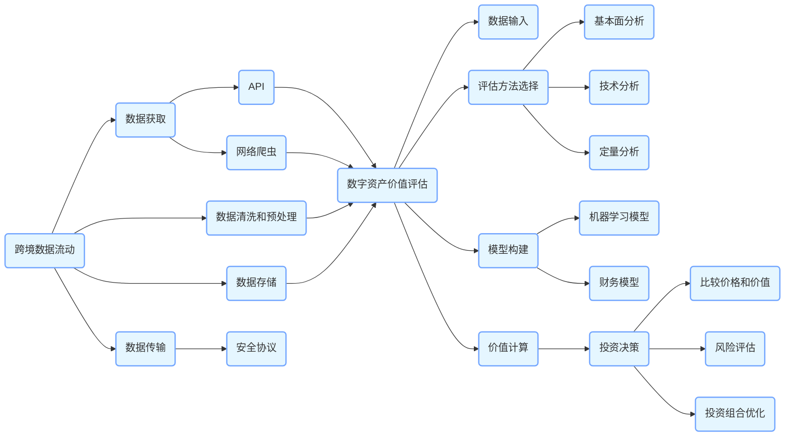

# 特价股票投资中的跨境数据流动与数字资产价值评估策略

> 关键词：特价股票投资、跨境数据流动、数字资产价值评估、投资策略、数据安全

> 摘要：本文聚焦于特价股票投资领域，深入探讨跨境数据流动与数字资产价值评估策略。随着全球化和数字化的发展，跨境数据流动为特价股票投资带来了新的机遇和挑战，同时数字资产价值评估对于准确把握投资机会至关重要。文章首先介绍了相关背景，包括目的范围、预期读者等；接着阐述核心概念及联系，详细讲解核心算法原理和具体操作步骤，并给出数学模型和公式；通过项目实战案例展示如何应用这些策略；分析实际应用场景；推荐相关工具和资源；最后总结未来发展趋势与挑战，提供常见问题解答和扩展阅读参考资料，旨在为投资者和相关从业者提供全面、深入的技术和策略指导。

## 1. 背景介绍 
### 1.1 目的和范围
在当今全球化的金融市场中，特价股票投资吸引了众多投资者的目光。跨境数据流动为投资者获取更广泛的市场信息提供了可能，而准确评估数字资产价值则是做出明智投资决策的关键。本文的目的在于深入分析跨境数据流动在特价股票投资中的作用，以及如何制定有效的数字资产价值评估策略。范围涵盖了从数据获取、处理到资产价值评估的整个过程，以及相关的投资决策制定。

### 1.2 预期读者
本文预期读者包括专业的股票投资者、金融分析师、投资顾问、金融科技从业者以及对特价股票投资和数字资产评估感兴趣的研究人员。对于那些希望在跨境市场中寻找特价股票投资机会，并掌握数字资产价值评估方法的人士具有较高的参考价值。

### 1.3 文档结构概述
本文将按照以下结构进行阐述：首先介绍核心概念与联系，明确相关术语和概念；接着详细讲解核心算法原理和具体操作步骤，通过 Python 代码进行演示；给出数学模型和公式，并举例说明；通过项目实战展示代码的实际应用和详细解释；分析实际应用场景；推荐相关的工具和资源；最后总结未来发展趋势与挑战，提供常见问题解答和扩展阅读参考资料。

### 1.4 术语表
#### 1.4.1 核心术语定义
- **特价股票**：指市场价格低于其内在价值的股票，通常具有一定的投资潜力。
- **跨境数据流动**：数据在不同国家或地区之间的传输和交换，包括市场数据、公司财务数据等。
- **数字资产**：以数字形式存在的资产，如股票、债券、基金等金融资产，以及数据、算法等非金融资产。
- **价值评估**：对资产的内在价值进行评估，以确定其是否被低估或高估。

#### 1.4.2 相关概念解释
- **数据挖掘**：从大量数据中提取有价值信息的过程，常用于分析市场趋势和公司基本面。
- **机器学习**：让计算机通过数据学习模式和规律，用于预测股票价格和评估资产价值。
- **大数据**：海量、多样化的数据集合，跨境数据流动产生了大量的大数据，为投资分析提供了丰富的信息。

#### 1.4.3 缩略词列表
- **API**：Application Programming Interface，应用程序编程接口，用于获取跨境数据。
- **AI**：Artificial Intelligence，人工智能，在数字资产价值评估中广泛应用。
- **ML**：Machine Learning，机器学习，是 AI 的一个重要分支。

## 2. 核心概念与联系 
### 核心概念原理
在特价股票投资中，跨境数据流动和数字资产价值评估是两个核心概念。跨境数据流动使得投资者能够获取全球范围内的市场信息，包括不同国家和地区的经济数据、公司财务报表、行业动态等。这些数据对于分析特价股票的潜在价值至关重要。

数字资产价值评估则是基于获取的数据，运用各种方法和模型来确定股票的内在价值。常见的评估方法包括基本面分析、技术分析和定量分析等。基本面分析主要关注公司的财务状况、行业竞争力等因素；技术分析则通过研究股票价格和交易量的历史数据来预测未来走势；定量分析则运用数学模型和算法来评估资产价值。

### 架构的文本示意图
```plaintext
跨境数据流动
    |
    |--数据获取（API、网络爬虫等）
    |--数据清洗和预处理
    |--数据存储（数据库）
    |
    |--数据传输（安全协议）
    |
    V
数字资产价值评估
    |
    |--数据输入（跨境数据）
    |--评估方法选择（基本面分析、技术分析、定量分析等）
    |--模型构建（机器学习模型、财务模型等）
    |--价值计算
    |
    V
投资决策
    |
    |--比较市场价格和评估价值
    |--风险评估
    |--投资组合优化
```

### Mermaid 流程图


## 3. 核心算法原理 & 具体操作步骤 
### 核心算法原理
在数字资产价值评估中，我们可以使用机器学习算法来预测股票价格和评估资产价值。这里以线性回归算法为例，线性回归是一种简单而有效的机器学习算法，用于建立自变量和因变量之间的线性关系。

线性回归的数学模型可以表示为：

$$y = \beta_0 + \beta_1x_1 + \beta_2x_2 + \cdots + \beta_nx_n + \epsilon$$

其中，$y$ 是因变量（如股票价格），$x_1, x_2, \cdots, x_n$ 是自变量（如公司财务指标、市场数据等），$\beta_0, \beta_1, \beta_2, \cdots, \beta_n$ 是回归系数，$\epsilon$ 是误差项。

### 具体操作步骤
#### 步骤 1：数据获取
使用 API 或网络爬虫从跨境数据源获取相关数据，例如雅虎财经 API 可以获取股票的历史价格和财务数据。

```python
import yfinance as yf

# 获取某只股票的历史数据
ticker = 'AAPL'  # 苹果公司股票代码
data = yf.download(ticker, start='2020-01-01', end='2023-01-01')
print(data.head())
```

#### 步骤 2：数据清洗和预处理
对获取的数据进行清洗，处理缺失值、异常值等，并进行特征工程，选择合适的自变量。

```python
import pandas as pd
import numpy as np

# 处理缺失值
data = data.dropna()

# 选择特征
features = ['Open', 'High', 'Low', 'Volume']
X = data[features]
y = data['Close']
```

#### 步骤 3：模型训练
将数据划分为训练集和测试集，使用训练集训练线性回归模型。

```python
from sklearn.model_selection import train_test_split
from sklearn.linear_model import LinearRegression

# 划分训练集和测试集
X_train, X_test, y_train, y_test = train_test_split(X, y, test_size=0.2, random_state=42)

# 训练线性回归模型
model = LinearRegression()
model.fit(X_train, y_train)
```

#### 步骤 4：模型评估
使用测试集评估模型的性能，常用的评估指标包括均方误差（MSE）、均方根误差（RMSE）和决定系数（$R^2$）。

```python
from sklearn.metrics import mean_squared_error, r2_score

# 预测测试集
y_pred = model.predict(X_test)

# 计算评估指标
mse = mean_squared_error(y_test, y_pred)
rmse = np.sqrt(mse)
r2 = r2_score(y_test, y_pred)

print(f'MSE: {mse}')
print(f'RMSE: {rmse}')
print(f'R^2: {r2}')
```

#### 步骤 5：价值评估
使用训练好的模型对新的股票数据进行价值评估。

```python
# 假设获取了新的股票数据
new_data = pd.DataFrame({
    'Open': [150],
    'High': [155],
    'Low': [148],
    'Volume': [1000000]
})

# 预测股票价格
predicted_price = model.predict(new_data)
print(f'Predicted price: {predicted_price[0]}')
```

## 4. 数学模型和公式 & 详细讲解 & 举例说明 
### 线性回归模型
线性回归模型的数学表达式为：

$$y = \beta_0 + \beta_1x_1 + \beta_2x_2 + \cdots + \beta_nx_n + \epsilon$$

其中，$y$ 是因变量，$x_1, x_2, \cdots, x_n$ 是自变量，$\beta_0, \beta_1, \beta_2, \cdots, \beta_n$ 是回归系数，$\epsilon$ 是误差项。

回归系数的估计通常使用最小二乘法，即通过最小化误差平方和来求解回归系数。误差平方和的表达式为：

$$SSE = \sum_{i=1}^{m}(y_i - \hat{y}_i)^2$$

其中，$y_i$ 是实际观测值，$\hat{y}_i$ 是预测值。

最小二乘法的目标是找到一组回归系数 $\beta_0, \beta_1, \beta_2, \cdots, \beta_n$，使得 $SSE$ 最小。通过对 $SSE$ 求偏导数并令其等于 0，可以得到回归系数的估计值。

### 举例说明
假设我们有以下数据集：

| $x_1$ | $x_2$ | $y$ |
|-------|-------|-----|
| 1     | 2     | 3   |
| 2     | 3     | 5   |
| 3     | 4     | 7   |

我们可以使用线性回归模型来建立 $y$ 与 $x_1$ 和 $x_2$ 之间的关系。假设模型为：

$$y = \beta_0 + \beta_1x_1 + \beta_2x_2 + \epsilon$$

使用最小二乘法求解回归系数，得到：

$$\hat{\beta} = (X^TX)^{-1}X^Ty$$

其中，$X$ 是自变量矩阵，$y$ 是因变量向量。

```python
import numpy as np

# 自变量矩阵
X = np.array([[1, 1, 2], [1, 2, 3], [1, 3, 4]])
# 因变量向量
y = np.array([3, 5, 7])

# 求解回归系数
beta_hat = np.linalg.inv(X.T.dot(X)).dot(X.T).dot(y)
print(f'回归系数: {beta_hat}')
```

通过上述代码，我们可以得到回归系数的估计值。将这些系数代入线性回归模型，就可以对新的数据进行预测。

### 评估指标
在评估线性回归模型的性能时，常用的指标包括均方误差（MSE）、均方根误差（RMSE）和决定系数（$R^2$）。

均方误差的计算公式为：

$$MSE = \frac{1}{m}\sum_{i=1}^{m}(y_i - \hat{y}_i)^2$$

均方根误差的计算公式为：

$$RMSE = \sqrt{MSE}$$

决定系数的计算公式为：

$$R^2 = 1 - \frac{\sum_{i=1}^{m}(y_i - \hat{y}_i)^2}{\sum_{i=1}^{m}(y_i - \bar{y})^2}$$

其中，$\bar{y}$ 是 $y$ 的平均值。

MSE 和 RMSE 衡量了模型预测值与实际值之间的平均误差，值越小表示模型性能越好。$R^2$ 衡量了模型对数据的拟合程度，取值范围在 0 到 1 之间，值越接近 1 表示模型拟合效果越好。

## 5. 项目实战：代码实际案例和详细解释说明 
### 5.1  开发环境搭建
为了实现特价股票投资中的跨境数据流动与数字资产价值评估策略，我们需要搭建以下开发环境：

#### 编程语言
选择 Python 作为开发语言，因为 Python 具有丰富的数据分析和机器学习库，适合处理跨境数据和进行数字资产价值评估。

#### 开发工具
可以使用 Jupyter Notebook 或 PyCharm 作为开发工具。Jupyter Notebook 适合进行交互式开发和数据分析，而 PyCharm 则是一个功能强大的 Python 集成开发环境。

#### 库和框架
安装以下必要的 Python 库：
- `yfinance`：用于获取股票的历史数据和财务信息。
- `pandas`：用于数据处理和分析。
- `numpy`：用于数值计算。
- `scikit-learn`：用于机器学习模型的训练和评估。

可以使用以下命令安装这些库：

```bash
pip install yfinance pandas numpy scikit-learn
```

### 5.2  源代码详细实现和代码解读
以下是一个完整的项目实战代码示例，包括数据获取、数据处理、模型训练和价值评估：

```python
import yfinance as yf
import pandas as pd
import numpy as np
from sklearn.model_selection import train_test_split
from sklearn.linear_model import LinearRegression
from sklearn.metrics import mean_squared_error, r2_score

# 步骤 1：数据获取
ticker = 'AAPL'  # 苹果公司股票代码
data = yf.download(ticker, start='2020-01-01', end='2023-01-01')

# 步骤 2：数据清洗和预处理
data = data.dropna()
features = ['Open', 'High', 'Low', 'Volume']
X = data[features]
y = data['Close']

# 步骤 3：划分训练集和测试集
X_train, X_test, y_train, y_test = train_test_split(X, y, test_size=0.2, random_state=42)

# 步骤 4：模型训练
model = LinearRegression()
model.fit(X_train, y_train)

# 步骤 5：模型评估
y_pred = model.predict(X_test)
mse = mean_squared_error(y_test, y_pred)
rmse = np.sqrt(mse)
r2 = r2_score(y_test, y_pred)

print(f'MSE: {mse}')
print(f'RMSE: {rmse}')
print(f'R^2: {r2}')

# 步骤 6：价值评估
new_data = pd.DataFrame({
    'Open': [150],
    'High': [155],
    'Low': [148],
    'Volume': [1000000]
})

predicted_price = model.predict(new_data)
print(f'Predicted price: {predicted_price[0]}')
```

### 代码解读与分析
#### 数据获取
使用 `yfinance` 库的 `download` 函数获取苹果公司股票的历史数据，时间范围从 2020 年 1 月 1 日到 2023 年 1 月 1 日。

#### 数据清洗和预处理
使用 `dropna` 函数删除数据中的缺失值，选择 `Open`、`High`、`Low` 和 `Volume` 作为自变量，`Close` 作为因变量。

#### 划分训练集和测试集
使用 `train_test_split` 函数将数据划分为训练集和测试集，测试集占总数据的 20%。

#### 模型训练
使用 `LinearRegression` 类创建线性回归模型，并使用训练集数据进行训练。

#### 模型评估
使用测试集数据进行预测，并计算均方误差（MSE）、均方根误差（RMSE）和决定系数（$R^2$），评估模型的性能。

#### 价值评估
创建一个新的数据样本，使用训练好的模型进行预测，得到预测的股票价格。

## 6. 实际应用场景 
### 跨境投资决策
投资者可以利用跨境数据流动获取全球不同市场的特价股票信息，通过数字资产价值评估策略筛选出具有投资潜力的股票。例如，投资者可以关注新兴市场的特价股票，结合当地的经济数据和公司基本面进行价值评估，做出跨境投资决策。

### 量化投资策略
量化投资机构可以将跨境数据和数字资产价值评估模型融入量化投资策略中。通过建立复杂的数学模型和算法，对大量的跨境数据进行分析和处理，生成投资信号，实现自动化的投资交易。

### 风险评估与管理
在特价股票投资中，风险评估与管理至关重要。跨境数据流动可以提供更多的市场信息，帮助投资者评估投资风险。通过数字资产价值评估模型，投资者可以分析股票的内在价值和市场价格之间的差异，判断投资的风险程度，并采取相应的风险管理措施，如分散投资、设置止损点等。

### 金融科技服务
金融科技公司可以开发基于跨境数据流动和数字资产价值评估的金融服务产品。例如，提供智能投资顾问服务，根据投资者的风险偏好和投资目标，利用数字资产价值评估模型为投资者推荐合适的特价股票投资组合。

## 7. 工具和资源推荐
### 7.1 学习资源推荐
#### 7.1.1 书籍推荐
- 《Python 数据分析实战》：介绍了 Python 在数据分析领域的应用，包括数据处理、可视化和机器学习等方面的知识。
- 《机器学习实战》：通过实际案例详细讲解了机器学习算法的原理和应用，适合初学者入门。
- 《金融市场技术分析》：经典的技术分析书籍，介绍了股票市场的技术分析方法和工具。

#### 7.1.2 在线课程
- Coursera 上的“机器学习”课程：由斯坦福大学教授 Andrew Ng 授课，是机器学习领域的经典课程。
- edX 上的“Python 数据科学导论”课程：介绍了 Python 在数据科学中的应用，包括数据处理、数据分析和机器学习等方面的内容。
- Udemy 上的“股票投资分析实战”课程：结合实际案例讲解股票投资分析的方法和技巧。

#### 7.1.3 技术博客和网站
- Medium：一个技术博客平台，有很多关于数据分析、机器学习和金融科技的优质文章。
- Towards Data Science：专注于数据科学和机器学习领域的博客，提供了很多实用的技术教程和案例分析。
- Seeking Alpha：一个金融市场分析网站，提供了大量的股票分析和投资建议。

### 7.2 开发工具框架推荐
#### 7.2.1 IDE和编辑器
- Jupyter Notebook：一个交互式的开发环境，适合进行数据分析和模型开发。
- PyCharm：一个功能强大的 Python 集成开发环境，提供了代码编辑、调试、版本控制等功能。
- Visual Studio Code：一个轻量级的代码编辑器，支持多种编程语言和插件扩展。

#### 7.2.2 调试和性能分析工具
- `pdb`：Python 自带的调试工具，可以帮助开发者定位代码中的问题。
- `cProfile`：Python 的性能分析工具，可以分析代码的运行时间和资源消耗情况。
- `Scikit-learn` 中的 `GridSearchCV`：用于模型调优和参数搜索，可以提高模型的性能。

#### 7.2.3 相关框架和库
- `yfinance`：用于获取股票的历史数据和财务信息。
- `pandas`：用于数据处理和分析，提供了丰富的数据结构和函数。
- `numpy`：用于数值计算，提供了高效的数组操作和数学函数。
- `scikit-learn`：用于机器学习模型的训练和评估，提供了多种机器学习算法和工具。

### 7.3 相关论文著作推荐
#### 7.3.1 经典论文
- Fama, E. F., & French, K. R. (1992). The cross-section of expected stock returns. The Journal of Finance, 47(2), 427-465. 该论文提出了 Fama-French 三因子模型，用于解释股票收益率的横截面差异。
- Sharpe, W. F. (1964). Capital asset prices: A theory of market equilibrium under conditions of risk. The Journal of Finance, 19(3), 425-442. 该论文提出了资本资产定价模型（CAPM），用于评估资产的预期收益率。

#### 7.3.2 最新研究成果
- 关注顶级金融和计算机科学期刊，如 The Journal of Financial Economics、Journal of Machine Learning Research 等，了解跨境数据流动和数字资产价值评估领域的最新研究进展。

#### 7.3.3 应用案例分析
- 研究一些知名投资机构的投资报告和案例分析，了解他们在特价股票投资中如何应用跨境数据和数字资产价值评估策略。

## 8. 总结：未来发展趋势与挑战
### 未来发展趋势
#### 数据驱动的投资决策
随着跨境数据流动的不断增加和数字资产的日益丰富，未来的投资决策将更加依赖于数据驱动。投资者将利用大数据、人工智能和机器学习等技术，对海量的跨境数据进行分析和挖掘，以获取更准确的投资信息和决策依据。

#### 跨领域融合
跨境数据流动和数字资产价值评估将与金融科技、区块链、物联网等领域进行更深入的融合。例如，区块链技术可以提高跨境数据的安全性和可信度，物联网技术可以提供更多的实时市场数据，为投资分析提供更丰富的信息。

#### 个性化投资服务
投资者的需求越来越多样化和个性化，未来的投资服务将更加注重个性化定制。金融科技公司将利用数字资产价值评估模型和人工智能算法，根据投资者的风险偏好、投资目标和财务状况，为投资者提供个性化的投资建议和投资组合。

### 挑战
#### 数据安全和隐私问题
跨境数据流动涉及到不同国家和地区的数据安全和隐私法规，投资者需要确保数据的安全和合规使用。同时，数字资产的价值评估也需要保护投资者的隐私信息，避免数据泄露和滥用。

#### 数据质量和一致性
跨境数据的来源广泛，数据质量和一致性可能存在差异。投资者需要对数据进行清洗、预处理和验证，以确保数据的准确性和可靠性。此外，不同国家和地区的会计制度和统计标准也可能导致数据的不一致性，需要进行适当的调整和转换。

#### 模型的准确性和可靠性
数字资产价值评估模型的准确性和可靠性是投资决策的关键。然而，市场环境复杂多变，模型可能无法完全捕捉到所有的市场因素和风险。投资者需要不断优化和改进模型，提高模型的适应性和预测能力。

## 9. 附录：常见问题与解答
### 问题 1：如何确保跨境数据的安全传输？
解答：可以使用安全协议，如 SSL/TLS 协议，对数据进行加密传输。同时，选择可靠的数据源和数据传输平台，确保数据在传输过程中不被篡改和泄露。

### 问题 2：数字资产价值评估模型的准确性如何保证？
解答：可以通过以下方法提高模型的准确性：选择合适的评估方法和模型，使用高质量的训练数据，进行模型调优和参数搜索，定期对模型进行评估和更新。

### 问题 3：跨境数据流动是否受到法律法规的限制？
解答：是的，不同国家和地区对跨境数据流动有不同的法律法规限制。投资者需要了解并遵守相关的法律法规，确保数据的合规使用。

### 问题 4：如何选择适合的特价股票进行投资？
解答：可以通过跨境数据流动获取市场信息，使用数字资产价值评估模型筛选出价格低于内在价值的股票。同时，结合公司的基本面、行业前景和市场趋势等因素进行综合分析，做出投资决策。

## 10. 扩展阅读 & 参考资料
### 扩展阅读
- 《金融数据分析与挖掘》：深入介绍了金融数据的分析和挖掘方法，包括时间序列分析、机器学习在金融领域的应用等。
- 《智能投资：从理论到实践》：探讨了智能投资的概念、方法和实践案例，对特价股票投资有一定的参考价值。

### 参考资料
- Yahoo Finance API 文档：https://pypi.org/project/yfinance/
- Scikit-learn 官方文档：https://scikit-learn.org/stable/
- Pandas 官方文档：https://pandas.pydata.org/

作者：AI天才研究院/AI Genius Institute & 禅与计算机程序设计艺术 /Zen And The Art of Computer Programming