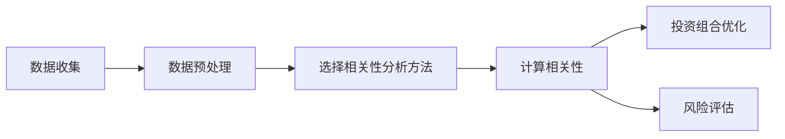

# 特价股票投资中的跨资产类别相关性分析

> 关键词：特价股票、跨资产类别、相关性分析、投资策略、风险评估

> 摘要：本文聚焦于特价股票投资中的跨资产类别相关性分析。在投资领域，了解不同资产类别之间的相关性对于构建合理的投资组合、降低风险以及提高收益具有至关重要的意义。通过对特价股票与其他资产类别的相关性研究，能够帮助投资者更全面地认识市场动态，制定出更科学有效的投资策略。文章将详细介绍相关核心概念、算法原理、数学模型，并结合项目实战案例进行深入分析，探讨其在实际应用中的场景，同时推荐相关工具和资源，最后总结未来发展趋势与挑战。

## 1. 背景介绍 
### 1.1 目的和范围
本研究的主要目的是深入分析特价股票投资中跨资产类别之间的相关性。通过对这种相关性的研究，投资者可以更好地理解不同资产之间的相互影响，从而优化投资组合，降低投资风险，提高投资回报率。研究范围涵盖了常见的资产类别，如股票、债券、大宗商品、房地产等，以及特价股票与这些资产之间的相关性分析。

### 1.2 预期读者
本文预期读者包括专业的投资者、投资分析师、金融从业者以及对投资领域感兴趣的研究人员。对于希望深入了解跨资产类别投资策略和风险评估的人士，本文将提供有价值的参考。

### 1.3 文档结构概述
本文首先介绍背景信息，包括研究目的、预期读者和文档结构。接着阐述核心概念与联系，通过文本示意图和 Mermaid 流程图展示相关原理和架构。然后详细讲解核心算法原理和具体操作步骤，并结合 Python 源代码进行说明。随后介绍数学模型和公式，并举例说明。通过项目实战案例，展示代码的实际应用和详细解释。之后探讨实际应用场景，推荐相关工具和资源。最后总结未来发展趋势与挑战，并提供常见问题与解答以及扩展阅读和参考资料。

### 1.4 术语表
#### 1.4.1 核心术语定义
- **特价股票**：指价格相对其内在价值被低估的股票，通常具有较低的市盈率、市净率等估值指标。
- **跨资产类别**：涉及不同类型的资产，如股票、债券、大宗商品、房地产等。
- **相关性分析**：用于衡量两个或多个变量之间的关联程度，在投资领域中，用于分析不同资产类别之间的价格波动关系。

#### 1.4.2 相关概念解释
- **投资组合**：由多种资产组成的集合，投资者通过合理配置不同资产，以实现风险分散和收益最大化的目标。
- **风险评估**：对投资过程中可能面临的风险进行评估和分析，包括市场风险、信用风险、流动性风险等。

#### 1.4.3 缩略词列表
- **VAR**：Value at Risk，风险价值，用于衡量在一定的置信水平下，投资组合在未来一段时间内可能遭受的最大损失。
- **CAPM**：Capital Asset Pricing Model，资本资产定价模型，用于描述资产预期收益率与风险之间的关系。

## 2. 核心概念与联系 

### 核心概念原理
在特价股票投资的跨资产类别相关性分析中，核心概念包括特价股票、其他资产类别以及它们之间的相关性。特价股票由于其价格被低估，往往具有一定的投资价值。而不同的资产类别，如股票、债券、大宗商品等，在市场中受到不同因素的影响，其价格波动具有各自的特点。

相关性分析的原理是通过统计方法来衡量不同资产类别之间价格波动的关联程度。正相关表示两种资产的价格波动方向相同，负相关表示价格波动方向相反，而零相关则表示两者之间没有明显的关联。

### 架构的文本示意图
特价股票投资的跨资产类别相关性分析架构可以描述如下：

首先，收集不同资产类别的历史价格数据，包括特价股票和其他资产（如债券、大宗商品等）。然后，对这些数据进行预处理，如清洗、归一化等操作。接着，选择合适的相关性分析方法，如皮尔逊相关系数、斯皮尔曼相关系数等，计算不同资产之间的相关性。最后，根据相关性分析结果，进行投资组合的优化和风险评估。

### Mermaid 流程图


## 3. 核心算法原理 & 具体操作步骤 

### 皮尔逊相关系数算法原理
皮尔逊相关系数是一种常用的衡量两个变量之间线性相关性的统计指标。其计算公式为：

$$\rho_{X,Y}=\frac{\text{cov}(X,Y)}{\sigma_X\sigma_Y}$$

其中，$\text{cov}(X,Y)$ 是变量 $X$ 和 $Y$ 的协方差，$\sigma_X$ 和 $\sigma_Y$ 分别是变量 $X$ 和 $Y$ 的标准差。

### Python 源代码实现
```python
import numpy as np

def pearson_correlation(x, y):
    """
    计算皮尔逊相关系数
    :param x: 第一个变量的数据
    :param y: 第二个变量的数据
    :return: 皮尔逊相关系数
    """
    cov = np.cov(x, y)[0][1]
    std_x = np.std(x)
    std_y = np.std(y)
    if std_x * std_y == 0:
        return 0
    return cov / (std_x * std_y)

# 示例数据
x = np.array([1, 2, 3, 4, 5])
y = np.array([2, 4, 6, 8, 10])

# 计算皮尔逊相关系数
corr = pearson_correlation(x, y)
print("皮尔逊相关系数:", corr)
```

### 具体操作步骤
1. **数据收集**：从金融数据提供商或相关数据库中获取不同资产类别的历史价格数据。
2. **数据预处理**：对收集到的数据进行清洗，去除缺失值和异常值。然后对数据进行归一化处理，以消除不同资产价格尺度的影响。
3. **选择相关性分析方法**：根据数据的特点和分析目的，选择合适的相关性分析方法，如皮尔逊相关系数、斯皮尔曼相关系数等。
4. **计算相关性**：使用选定的方法计算不同资产之间的相关性。
5. **结果分析**：根据计算得到的相关性结果，分析不同资产之间的关联程度，并据此进行投资组合的优化和风险评估。

## 4. 数学模型和公式 & 详细讲解 & 举例说明 

### 皮尔逊相关系数公式详细讲解
皮尔逊相关系数 $\rho_{X,Y}$ 的取值范围在 $[-1, 1]$ 之间。当 $\rho_{X,Y}=1$ 时，表示两个变量之间存在完全正相关关系，即一个变量的增加会导致另一个变量的增加；当 $\rho_{X,Y}=-1$ 时，表示两个变量之间存在完全负相关关系，即一个变量的增加会导致另一个变量的减少；当 $\rho_{X,Y}=0$ 时，表示两个变量之间不存在线性相关关系。

### 斯皮尔曼相关系数公式
斯皮尔曼相关系数是一种非参数统计方法，用于衡量两个变量之间的单调相关性。其计算公式为：

$$r_s = 1 - \frac{6\sum_{i=1}^{n}d_i^2}{n(n^2 - 1)}$$

其中，$d_i$ 是第 $i$ 个观测值的秩差，$n$ 是观测值的数量。

### 举例说明
假设我们有两种资产 $A$ 和 $B$ 的历史价格数据，如下表所示：

| 时间 | 资产 A 价格 | 资产 B 价格 |
|------|-------------|-------------|
| 1    | 100         | 200         |
| 2    | 110         | 220         |
| 3    | 120         | 240         |
| 4    | 130         | 260         |
| 5    | 140         | 280         |

我们可以使用皮尔逊相关系数来计算这两种资产之间的相关性。

```python
import numpy as np

# 资产 A 和 B 的价格数据
asset_a = np.array([100, 110, 120, 130, 140])
asset_b = np.array([200, 220, 240, 260, 280])

# 计算皮尔逊相关系数
corr = pearson_correlation(asset_a, asset_b)
print("资产 A 和 B 的皮尔逊相关系数:", corr)
```

在这个例子中，由于资产 A 和 B 的价格呈现出完全的线性关系，因此计算得到的皮尔逊相关系数为 1，表示两者之间存在完全正相关关系。

## 5. 项目实战：代码实际案例和详细解释说明 

### 5.1  开发环境搭建
在进行跨资产类别相关性分析的项目实战之前，需要搭建相应的开发环境。以下是具体步骤：

1. **安装 Python**：建议使用 Python 3.7 及以上版本，可以从 Python 官方网站（https://www.python.org/downloads/）下载并安装。
2. **安装必要的库**：使用 `pip` 命令安装以下库：
    - `pandas`：用于数据处理和分析。
    - `numpy`：用于数值计算。
    - `matplotlib`：用于数据可视化。
    - `yfinance`：用于获取金融数据。

```bash
pip install pandas numpy matplotlib yfinance
```

### 5.2  源代码详细实现和代码解读
以下是一个完整的项目实战代码示例，用于分析特价股票与其他资产类别的相关性：

```python
import yfinance as yf
import pandas as pd
import numpy as np
import matplotlib.pyplot as plt

# 定义资产列表，包括特价股票和其他资产
assets = ['AAPL', 'SPY', 'GLD', 'TLT']

# 获取历史价格数据
start_date = '2020-01-01'
end_date = '2021-12-31'
data = yf.download(assets, start=start_date, end=end_date)['AdjClose']

# 计算收益率
returns = data.pct_change().dropna()

# 计算相关性矩阵
correlation_matrix = returns.corr()

# 绘制相关性矩阵热力图
plt.figure(figsize=(10, 8))
plt.imshow(correlation_matrix, cmap='coolwarm', interpolation='nearest')
plt.colorbar()
plt.xticks(range(len(correlation_matrix.columns)), correlation_matrix.columns, rotation=45)
plt.yticks(range(len(correlation_matrix.columns)), correlation_matrix.columns)
plt.title('Correlation Matrix of Assets')
plt.show()

# 打印相关性矩阵
print(correlation_matrix)
```

### 代码解读与分析
1. **数据获取**：使用 `yfinance` 库从雅虎财经获取指定资产的历史价格数据。
2. **收益率计算**：使用 `pct_change()` 方法计算资产的日收益率，并去除缺失值。
3. **相关性矩阵计算**：使用 `corr()` 方法计算资产收益率之间的相关性矩阵。
4. **可视化**：使用 `matplotlib` 库绘制相关性矩阵的热力图，直观地展示不同资产之间的相关性。
5. **结果输出**：打印相关性矩阵，方便进一步分析。

通过这个项目实战，我们可以清晰地看到不同资产之间的相关性，从而为投资组合的优化提供参考。

## 6. 实际应用场景 
### 投资组合优化
在构建投资组合时，了解不同资产类别之间的相关性可以帮助投资者实现风险分散。通过选择相关性较低的资产进行组合，可以降低投资组合的整体风险。例如，当股票市场表现不佳时，债券等其他资产可能表现相对稳定，从而平衡投资组合的收益。

### 风险评估
跨资产类别相关性分析可以用于评估投资组合的风险。通过分析不同资产之间的相关性，可以预测在市场波动时投资组合的表现。例如，如果两种资产之间存在高度正相关关系，那么在市场下跌时，这两种资产的价格可能同时下跌，从而增加投资组合的风险。

### 资产配置决策
根据不同资产类别之间的相关性，投资者可以做出更合理的资产配置决策。例如，如果发现特价股票与大宗商品之间存在负相关关系，那么在投资组合中适当配置大宗商品可以降低特价股票投资的风险。

## 7. 工具和资源推荐
### 7.1 学习资源推荐
#### 7.1.1 书籍推荐
- 《金融市场与金融机构》：全面介绍金融市场和金融机构的基本知识，包括不同资产类别的特点和投资策略。
- 《投资学》：详细阐述投资理论和实践，包括资产定价、投资组合管理等内容。
- 《量化投资：策略与技术》：介绍量化投资的基本概念和方法，包括相关性分析在投资中的应用。

#### 7.1.2 在线课程
- Coursera 上的“金融市场”课程：由知名教授授课，系统讲解金融市场的基本原理和投资策略。
- edX 上的“投资组合理论与风险分析”课程：深入探讨投资组合管理和风险评估的方法。

#### 7.1.3 技术博客和网站
- 雪球网：提供丰富的金融资讯和投资分析，有很多关于跨资产类别投资的讨论和分享。
- 金融界网站：提供全面的金融市场数据和分析报告，有助于了解不同资产类别的动态。

### 7.2 开发工具框架推荐
#### 7.2.1 IDE和编辑器
- PyCharm：功能强大的 Python 集成开发环境，提供代码编辑、调试、版本控制等功能。
- Jupyter Notebook：交互式的开发环境，适合进行数据分析和可视化，方便代码的编写和展示。

#### 7.2.2 调试和性能分析工具
- `pdb`：Python 自带的调试工具，可以帮助开发者定位代码中的问题。
- `cProfile`：用于分析 Python 代码的性能，找出性能瓶颈。

#### 7.2.3 相关框架和库
- `pandas`：用于数据处理和分析，提供了丰富的数据结构和方法。
- `numpy`：用于数值计算，提供了高效的数组操作和数学函数。
- `scipy`：包含了许多科学计算和统计分析的工具，如相关性分析、回归分析等。

### 7.3 相关论文著作推荐
#### 7.3.1 经典论文
- Markowitz, H. M. (1952). Portfolio Selection. The Journal of Finance, 7(1), 77-91. 这篇论文提出了现代投资组合理论，奠定了投资组合优化的基础。
- Sharpe, W. F. (1964). Capital Asset Prices: A Theory of Market Equilibrium Under Conditions of Risk. The Journal of Finance, 19(3), 425-442. 该论文提出了资本资产定价模型（CAPM），用于描述资产预期收益率与风险之间的关系。

#### 7.3.2 最新研究成果
可以通过学术数据库（如 Web of Science、IEEE Xplore 等）搜索关于跨资产类别相关性分析的最新研究成果，了解该领域的前沿动态。

#### 7.3.3 应用案例分析
一些金融机构和研究机构会发布关于跨资产类别投资的应用案例分析报告，可以从中学习实际应用中的经验和方法。

## 8. 总结：未来发展趋势与挑战
### 未来发展趋势
- **数据驱动的投资决策**：随着金融数据的不断丰富和数据分析技术的不断发展，未来的投资决策将更加依赖于数据和量化分析。跨资产类别相关性分析将在其中发挥重要作用，帮助投资者更准确地把握市场动态。
- **多资产融合投资**：投资者将越来越倾向于进行多资产融合投资，通过配置不同资产类别来实现风险分散和收益最大化。跨资产类别相关性分析将为这种投资策略提供重要的支持。
- **人工智能和机器学习的应用**：人工智能和机器学习技术将在跨资产类别相关性分析中得到更广泛的应用。例如，使用深度学习模型来预测不同资产之间的相关性，提高投资决策的准确性。

### 挑战
- **数据质量和可靠性**：金融数据的质量和可靠性对相关性分析结果的准确性有很大影响。数据缺失、错误和异常值等问题需要得到有效的处理。
- **市场环境变化**：市场环境是不断变化的，不同资产之间的相关性也会随之变化。如何及时捕捉这种变化并调整投资策略是一个挑战。
- **模型复杂性和解释性**：随着分析方法的不断发展，模型的复杂性也在增加。如何在保证模型准确性的同时，提高模型的解释性，让投资者能够理解和信任分析结果，是一个需要解决的问题。

## 9. 附录：常见问题与解答
### 问题 1：什么是特价股票？
特价股票是指价格相对其内在价值被低估的股票。通常可以通过市盈率、市净率等估值指标来判断一只股票是否为特价股票。

### 问题 2：如何选择合适的相关性分析方法？
选择合适的相关性分析方法需要考虑数据的特点和分析目的。如果数据服从正态分布，且希望衡量线性相关性，可以选择皮尔逊相关系数；如果数据不服从正态分布，或者希望衡量单调相关性，可以选择斯皮尔曼相关系数。

### 问题 3：相关性分析结果是否具有稳定性？
相关性分析结果会受到市场环境和数据样本的影响，因此不具有绝对的稳定性。投资者需要定期更新数据并重新进行分析，以适应市场的变化。

### 问题 4：跨资产类别相关性分析在投资中的作用是什么？
跨资产类别相关性分析可以帮助投资者优化投资组合、评估投资风险和做出合理的资产配置决策。通过了解不同资产之间的相关性，投资者可以实现风险分散，提高投资回报率。

## 10. 扩展阅读 & 参考资料
- 陈雨露. 《国际金融》. 中国人民大学出版社.
- 约翰·C·赫尔. 《期权、期货及其他衍生品》. 机械工业出版社.
- 雅虎财经（https://finance.yahoo.com/）
- 雪球网（https://xueqiu.com/）
- 金融界网站（https://www.jrj.com.cn/）

作者：AI天才研究院/AI Genius Institute & 禅与计算机程序设计艺术 /Zen And The Art of Computer Programming