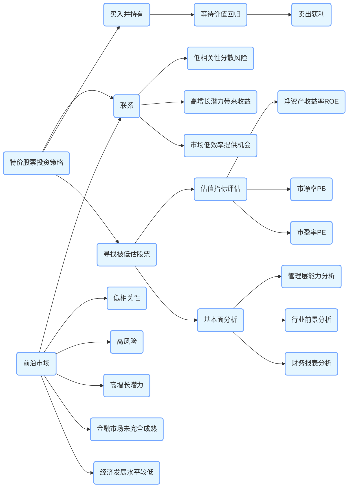

# 特价股票投资策略在前沿市场的适用性探讨

> 关键词：特价股票投资策略、前沿市场、适用性、价值投资、风险评估

> 摘要：本文旨在深入探讨特价股票投资策略在前沿市场的适用性。首先介绍了研究的背景、目的、预期读者、文档结构及相关术语。接着阐述了特价股票投资和前沿市场的核心概念及其联系，分析了核心算法原理并给出Python代码示例。详细讲解了相关数学模型和公式，并通过举例进行说明。通过项目实战展示了代码的实际应用和解读。探讨了该策略在前沿市场的实际应用场景，推荐了学习资源、开发工具框架和相关论文著作。最后总结了未来发展趋势与挑战，解答了常见问题，并提供了扩展阅读和参考资料，为投资者在前沿市场运用特价股票投资策略提供全面的理论和实践指导。

## 1. 背景介绍 
### 1.1 目的和范围
本研究的主要目的是全面评估特价股票投资策略在前沿市场的适用性。随着全球金融市场的不断发展，前沿市场作为新兴的投资领域，吸引了越来越多投资者的关注。特价股票投资策略以寻找被低估的股票为核心，在传统市场中已被广泛应用并取得了一定的成效。然而，前沿市场具有独特的经济、政治和市场环境，该策略在这些市场中的表现和适用性需要深入研究。

本研究的范围涵盖了对前沿市场的定义、特点的分析，特价股票投资策略的原理、方法的阐述，以及该策略在前沿市场中的实际应用情况的探讨。通过对相关理论和实践案例的研究，为投资者提供在前沿市场运用特价股票投资策略的参考和建议。

### 1.2 预期读者
本文的预期读者主要包括以下几类人群：
1. **投资者**：包括个人投资者和机构投资者，他们希望了解特价股票投资策略在前沿市场的适用性，以便在投资决策中做出更明智的选择。
2. **金融分析师**：需要深入研究市场和投资策略，为客户提供专业的投资建议。本文可以为他们提供关于前沿市场和特价股票投资策略的深入分析和参考。
3. **学者和研究人员**：对金融市场和投资策略进行学术研究的人员，本文可以为他们的研究提供新的视角和实证数据。
4. **金融从业者**：如基金经理、投资顾问等，他们在实际工作中需要运用各种投资策略，本文可以帮助他们了解特价股票投资策略在前沿市场的应用情况，提高投资业绩。

### 1.3 文档结构概述
本文将按照以下结构进行组织：
1. **背景介绍**：介绍研究的目的、范围、预期读者和文档结构概述，以及相关术语的定义。
2. **核心概念与联系**：阐述特价股票投资和前沿市场的核心概念，分析它们之间的联系，并通过文本示意图和Mermaid流程图进行展示。
3. **核心算法原理 & 具体操作步骤**：详细讲解特价股票投资策略的核心算法原理，并给出具体的操作步骤，同时使用Python源代码进行详细阐述。
4. **数学模型和公式 & 详细讲解 & 举例说明**：介绍相关的数学模型和公式，对其进行详细讲解，并通过具体的例子进行说明。
5. **项目实战：代码实际案例和详细解释说明**：通过一个实际的项目案例，展示特价股票投资策略在前沿市场的应用，包括开发环境搭建、源代码详细实现和代码解读。
6. **实际应用场景**：探讨特价股票投资策略在前沿市场的实际应用场景，分析其优势和局限性。
7. **工具和资源推荐**：推荐学习资源、开发工具框架和相关论文著作，帮助读者进一步深入学习和研究。
8. **总结：未来发展趋势与挑战**：总结特价股票投资策略在前沿市场的适用性，分析未来的发展趋势和面临的挑战。
9. **附录：常见问题与解答**：解答读者在阅读过程中可能遇到的常见问题。
10. **扩展阅读 & 参考资料**：提供相关的扩展阅读和参考资料，方便读者进一步深入研究。

### 1.4 术语表
#### 1.4.1 核心术语定义
1. **特价股票投资策略**：一种投资策略，通过寻找被市场低估的股票，以低于其内在价值的价格买入，等待股票价格回归其内在价值时卖出，从而获得投资收益。
2. **前沿市场**：指那些经济发展水平相对较低、金融市场尚未完全成熟，但具有较高增长潜力的新兴市场。这些市场通常包括一些发展中国家和地区的股票市场。
3. **内在价值**：指股票的真实价值，是基于公司的基本面分析，如财务状况、盈利能力、行业前景等因素计算得出的价值。
4. **市场效率**：指市场能够迅速、准确地反映所有相关信息的程度。在有效市场中，股票价格能够及时反映其内在价值，投资者难以通过寻找被低估的股票获得超额收益。

#### 1.4.2 相关概念解释
1. **价值投资**：一种投资理念，强调寻找被低估的股票，以长期投资为目标，通过分享公司的成长和价值回归获得投资收益。特价股票投资策略是价值投资的一种具体实现方式。
2. **新兴市场**：指那些经济快速发展、金融市场逐渐开放的发展中国家和地区的市场。前沿市场是新兴市场的一个子集，通常具有更高的风险和增长潜力。
3. **基本面分析**：一种分析方法，通过研究公司的财务报表、行业前景、管理层能力等基本面因素，评估公司的内在价值和投资价值。特价股票投资策略通常依赖于基本面分析来寻找被低估的股票。

#### 1.4.3 缩略词列表
1. **PE**：市盈率（Price-to-Earnings Ratio），指股票价格与每股收益的比率，用于衡量股票的估值水平。
2. **PB**：市净率（Price-to-Book Ratio），指股票价格与每股净资产的比率，用于衡量股票的估值水平。
3. **ROE**：净资产收益率（Return on Equity），指公司净利润与净资产的比率，用于衡量公司的盈利能力。

## 2. 核心概念与联系 
### 核心概念原理
#### 特价股票投资策略原理
特价股票投资策略的核心原理是基于价值投资的理念，认为市场有时会出现错误定价，导致某些股票的价格低于其内在价值。投资者通过深入的基本面分析，寻找这些被低估的股票，并以低于其内在价值的价格买入，等待市场发现其真实价值，股票价格回归其内在价值时卖出，从而获得投资收益。

基本面分析通常包括对公司的财务报表、行业前景、管理层能力等方面的研究。通过分析公司的盈利能力、偿债能力、成长能力等指标，评估公司的内在价值。例如，常用的估值指标包括市盈率（PE）、市净率（PB）、净资产收益率（ROE）等。如果一只股票的市盈率低于行业平均水平，同时公司具有良好的盈利能力和成长前景，那么这只股票可能被低估，具有投资价值。

#### 前沿市场概念
前沿市场是指那些经济发展水平相对较低、金融市场尚未完全成熟，但具有较高增长潜力的新兴市场。这些市场通常包括一些发展中国家和地区的股票市场，如非洲、东南亚、东欧等地区的部分国家。

前沿市场的特点包括：
1. **高增长潜力**：由于经济发展水平较低，这些市场具有较大的发展空间和增长潜力。随着经济的发展和工业化进程的推进，企业的盈利能力和市场价值有望得到提升。
2. **高风险**：前沿市场的金融市场尚未完全成熟，市场机制不完善，信息透明度较低，政治和经济稳定性较差，因此投资风险相对较高。
3. **低相关性**：前沿市场与全球主要市场的相关性较低，这为投资者提供了分散投资风险的机会。

### 核心概念联系
特价股票投资策略在前沿市场具有一定的适用性，主要体现在以下几个方面：
1. **市场低效率**：前沿市场的金融市场尚未完全成熟，市场机制不完善，信息透明度较低，容易出现错误定价的情况。这为特价股票投资策略提供了更多寻找被低估股票的机会。
2. **高增长潜力**：前沿市场具有较高的增长潜力，被低估的股票有可能随着市场的发展和公司的成长，实现价值的大幅提升。投资者通过特价股票投资策略买入这些股票，可以分享市场和公司的成长红利。
3. **分散投资风险**：前沿市场与全球主要市场的相关性较低，将特价股票投资策略应用于前沿市场，可以为投资者提供分散投资风险的机会，降低投资组合的整体风险。

### 文本示意图
```plaintext
特价股票投资策略
|
|-- 寻找被低估股票
|   |-- 基本面分析
|   |   |-- 财务报表分析
|   |   |-- 行业前景分析
|   |   |-- 管理层能力分析
|   |-- 估值指标评估
|       |-- 市盈率（PE）
|       |-- 市净率（PB）
|       |-- 净资产收益率（ROE）
|
|-- 买入并持有
|
|-- 等待价值回归
|
|-- 卖出获利

前沿市场
|
|-- 经济发展水平较低
|-- 金融市场未完全成熟
|-- 高增长潜力
|-- 高风险
|-- 低相关性

特价股票投资策略与前沿市场的联系
|
|-- 市场低效率提供机会
|-- 高增长潜力带来收益
|-- 低相关性分散风险
```

### Mermaid流程图


## 3. 核心算法原理 & 具体操作步骤 
### 核心算法原理
特价股票投资策略的核心算法主要基于基本面分析和估值指标评估，通过计算股票的内在价值，并与市场价格进行比较，来判断股票是否被低估。常用的估值方法包括股息贴现模型（DDM）、现金流贴现模型（DCF）、相对估值法等。下面以相对估值法为例，介绍核心算法原理。

相对估值法是通过比较同行业或类似公司的估值指标，来评估目标股票的估值水平。常用的估值指标包括市盈率（PE）、市净率（PB）、市销率（PS）等。以市盈率为例，其计算公式为：

$$PE = \frac{股价}{每股收益}$$

通过计算目标股票的市盈率，并与同行业或类似公司的平均市盈率进行比较，如果目标股票的市盈率低于平均市盈率，则认为该股票可能被低估。

### 具体操作步骤
1. **确定投资范围**：首先需要确定投资的前沿市场和行业范围。可以根据市场的发展潜力、行业的前景等因素进行选择。
2. **筛选股票**：在确定的投资范围内，筛选出符合一定条件的股票。例如，可以筛选出市盈率低于行业平均水平、市净率低于一定阈值、净资产收益率高于一定水平的股票。
3. **基本面分析**：对筛选出的股票进行深入的基本面分析，包括对公司的财务报表、行业前景、管理层能力等方面的研究。评估公司的盈利能力、偿债能力、成长能力等指标，确定公司的内在价值。
4. **估值评估**：使用相对估值法或其他估值方法，对公司的股票进行估值评估。计算股票的估值指标，并与同行业或类似公司的平均水平进行比较，判断股票是否被低估。
5. **投资决策**：根据基本面分析和估值评估的结果，做出投资决策。如果股票被低估且具有良好的发展前景，则可以考虑买入；如果股票被高估或存在较大的风险，则可以考虑放弃。
6. **投资组合管理**：建立投资组合，分散投资风险。根据股票的风险和收益特征，合理分配资金，定期对投资组合进行调整和优化。

### Python源代码详细阐述
```python
import pandas as pd
import yfinance as yf

# 1. 确定投资范围：选择某个前沿市场的股票列表
stock_list = ['ABC', 'DEF', 'GHI']  # 假设这是前沿市场的股票代码列表

# 2. 筛选股票：获取股票的财务数据和估值指标
data = {}
for stock in stock_list:
    try:
        ticker = yf.Ticker(stock)
        info = ticker.info
        pe_ratio = info.get('trailingPE', None)
        pb_ratio = info.get('priceToBook', None)
        roe = info.get('returnOnEquity', None)
        
        # 筛选条件：PE < 15，PB < 1，ROE > 0.1
        if pe_ratio is not None and pe_ratio < 15 and pb_ratio is not None and pb_ratio < 1 and roe is not None and roe > 0.1:
            data[stock] = {
                'PE': pe_ratio,
                'PB': pb_ratio,
                'ROE': roe
            }
    except Exception as e:
        print(f"Error getting data for {stock}: {e}")

# 3. 输出筛选结果
if data:
    df = pd.DataFrame.from_dict(data, orient='index')
    print("筛选出的特价股票：")
    print(df)
else:
    print("未筛选出符合条件的特价股票。")
```

在上述代码中，首先定义了一个股票列表`stock_list`，表示要分析的前沿市场的股票。然后使用`yfinance`库获取每只股票的财务数据和估值指标，包括市盈率（PE）、市净率（PB）和净资产收益率（ROE）。根据筛选条件（PE < 15，PB < 1，ROE > 0.1）筛选出符合条件的股票，并将结果存储在字典`data`中。最后，将筛选结果转换为`pandas`的`DataFrame`并输出。

## 4. 数学模型和公式 & 详细讲解 & 举例说明 
### 股息贴现模型（DDM）
#### 数学模型和公式
股息贴现模型（Dividend Discount Model，DDM）是一种基于股票未来股息现金流的估值方法，其基本思想是股票的内在价值等于其未来所有股息的现值之和。

对于稳定增长的股息贴现模型，假设公司的股息以固定的增长率$g$增长，且股息增长率小于贴现率$r$，则股票的内在价值$V$可以用以下公式表示：

$$V = \frac{D_1}{r - g}$$

其中，$D_1$是下一期的股息，$r$是贴现率，$g$是股息增长率。

#### 详细讲解
- **$D_1$**：下一期的股息是指公司预计在未来一个时期内支付给股东的股息。可以通过分析公司的历史股息支付情况和盈利预测来估算。
- **$r$**：贴现率是投资者要求的最低回报率，反映了投资的风险。通常可以使用资本资产定价模型（CAPM）来计算贴现率。
- **$g$**：股息增长率是指公司股息的年增长率。可以通过分析公司的历史股息增长情况、行业发展趋势和公司的盈利预测来估算。

#### 举例说明
假设某公司预计下一期的股息$D_1$为$2$元，投资者要求的贴现率$r$为$10\%$，公司的股息增长率$g$为$5\%$。则根据股息贴现模型，该公司股票的内在价值为：

$$V = \frac{2}{0.1 - 0.05} = \frac{2}{0.05} = 40$$（元）

如果该公司股票的市场价格低于$40$元，则认为该股票被低估，具有投资价值。

### 现金流贴现模型（DCF）
#### 数学模型和公式
现金流贴现模型（Discounted Cash Flow Model，DCF）是一种基于公司未来自由现金流的估值方法，其基本思想是公司的内在价值等于其未来所有自由现金流的现值之和。

对于稳定增长的现金流贴现模型，假设公司的自由现金流以固定的增长率$g$增长，且自由现金流增长率小于贴现率$r$，则公司的内在价值$V$可以用以下公式表示：

$$V = \frac{FCF_1}{r - g}$$

其中，$FCF_1$是下一期的自由现金流，$r$是贴现率，$g$是自由现金流增长率。

#### 详细讲解
- **$FCF_1$**：下一期的自由现金流是指公司在未来一个时期内产生的自由现金流，即公司经营活动产生的现金流量减去资本支出后的余额。可以通过分析公司的财务报表和盈利预测来估算。
- **$r$**：贴现率的含义与股息贴现模型中的贴现率相同，反映了投资的风险。
- **$g$**：自由现金流增长率是指公司自由现金流的年增长率。可以通过分析公司的历史自由现金流增长情况、行业发展趋势和公司的盈利预测来估算。

#### 举例说明
假设某公司预计下一期的自由现金流$FCF_1$为$100$万元，投资者要求的贴现率$r$为$12\%$，公司的自由现金流增长率$g$为$6\%$。则根据现金流贴现模型，该公司的内在价值为：

$$V = \frac{100}{0.12 - 0.06} = \frac{100}{0.06} \approx 1666.67$$（万元）

如果该公司的市场价值低于$1666.67$万元，则认为该公司被低估，具有投资价值。

### 相对估值法
#### 数学模型和公式
相对估值法是通过比较同行业或类似公司的估值指标，来评估目标股票的估值水平。常用的估值指标包括市盈率（PE）、市净率（PB）、市销率（PS）等。

以市盈率为例，其计算公式为：

$$PE = \frac{股价}{每股收益}$$

通过计算目标股票的市盈率，并与同行业或类似公司的平均市盈率进行比较，如果目标股票的市盈率低于平均市盈率，则认为该股票可能被低估。

#### 详细讲解
- **股价**：指股票的当前市场价格。
- **每股收益**：指公司每股股票的盈利情况，可以通过公司的净利润除以总股本得到。
- **平均市盈率**：指同行业或类似公司的市盈率的平均值。可以通过收集同行业或类似公司的财务数据，计算它们的市盈率并求平均值得到。

#### 举例说明
假设某行业的平均市盈率为$20$倍，某公司的每股收益为$2$元，当前股价为$30$元。则该公司的市盈率为：

$$PE = \frac{30}{2} = 15$$（倍）

由于该公司的市盈率$15$倍低于行业平均市盈率$20$倍，因此可以认为该公司的股票可能被低估，具有投资价值。

## 5. 项目实战：代码实际案例和详细解释说明 
### 5.1  开发环境搭建
#### 操作系统
可以选择Windows、Linux或macOS等主流操作系统。本项目实战以Windows 10为例进行说明。

#### 编程语言和版本
使用Python 3.8及以上版本。可以从Python官方网站（https://www.python.org/downloads/）下载并安装Python。

#### 开发工具
推荐使用PyCharm作为开发工具。可以从JetBrains官方网站（https://www.jetbrains.com/pycharm/download/）下载并安装PyCharm Community Edition（免费版）。

#### 安装必要的库
在命令行中使用`pip`命令安装以下必要的库：
```sh
pip install pandas yfinance
```

### 5.2  源代码详细实现和代码解读
```python
import pandas as pd
import yfinance as yf

# 1. 定义前沿市场股票列表
frontier_market_stocks = ['ABC', 'DEF', 'GHI']  # 假设这是前沿市场的股票代码列表

# 2. 定义筛选条件
pe_threshold = 15
pb_threshold = 1
roe_threshold = 0.1

# 3. 筛选特价股票
selected_stocks = {}
for stock in frontier_market_stocks:
    try:
        # 获取股票信息
        ticker = yf.Ticker(stock)
        info = ticker.info
        
        # 获取估值指标
        pe_ratio = info.get('trailingPE', None)
        pb_ratio = info.get('priceToBook', None)
        roe = info.get('returnOnEquity', None)
        
        # 检查是否满足筛选条件
        if pe_ratio is not None and pe_ratio < pe_threshold and pb_ratio is not None and pb_ratio < pb_threshold and roe is not None and roe > roe_threshold:
            selected_stocks[stock] = {
                'PE': pe_ratio,
                'PB': pb_ratio,
                'ROE': roe
            }
    except Exception as e:
        print(f"Error getting data for {stock}: {e}")

# 4. 输出筛选结果
if selected_stocks:
    df = pd.DataFrame.from_dict(selected_stocks, orient='index')
    print("筛选出的特价股票：")
    print(df)
else:
    print("未筛选出符合条件的特价股票。")
```

#### 代码解读
1. **导入必要的库**：导入`pandas`和`yfinance`库，分别用于数据处理和获取股票信息。
2. **定义前沿市场股票列表**：定义一个包含前沿市场股票代码的列表`frontier_market_stocks`。
3. **定义筛选条件**：定义市盈率（PE）、市净率（PB）和净资产收益率（ROE）的筛选阈值。
4. **筛选特价股票**：遍历股票列表，使用`yfinance`库获取每只股票的信息和估值指标。检查每只股票是否满足筛选条件，如果满足则将其添加到`selected_stocks`字典中。
5. **输出筛选结果**：如果筛选出了符合条件的特价股票，则将结果转换为`pandas`的`DataFrame`并输出；否则，输出未筛选出符合条件的股票的信息。

### 5.3  代码解读与分析
#### 优点
- **简单易懂**：代码结构清晰，逻辑简单，易于理解和修改。
- **可扩展性**：可以根据需要修改筛选条件和股票列表，以适应不同的投资需求。
- **数据获取方便**：使用`yfinance`库可以方便地获取股票的信息和估值指标。

#### 局限性
- **数据准确性**：`yfinance`库获取的数据可能存在一定的延迟或误差，需要注意数据的准确性。
- **单一指标筛选**：仅使用市盈率、市净率和净资产收益率等单一指标进行筛选，可能无法全面评估股票的投资价值。
- **市场变化**：市场情况是不断变化的，筛选出的特价股票可能在未来不再具有投资价值，需要定期进行更新和调整。

## 6. 实际应用场景 
### 长期投资
特价股票投资策略在前沿市场非常适合长期投资。由于前沿市场具有较高的增长潜力，被低估的股票有可能随着市场的发展和公司的成长，实现价值的大幅提升。投资者通过长期持有这些股票，可以分享市场和公司的成长红利。

例如，某投资者在前沿市场中发现了一家具有良好发展前景但当前股价被低估的公司。通过深入的基本面分析和估值评估，投资者认为该公司的股票具有较高的投资价值，于是买入并长期持有。随着公司业务的不断拓展和盈利能力的提升，公司的股票价格逐渐上涨，投资者获得了丰厚的投资收益。

### 分散投资风险
前沿市场与全球主要市场的相关性较低，将特价股票投资策略应用于前沿市场，可以为投资者提供分散投资风险的机会，降低投资组合的整体风险。

例如，某投资者的投资组合主要集中在发达市场的股票。为了分散投资风险，投资者决定将一部分资金投入前沿市场，采用特价股票投资策略选择一些被低估的股票。当发达市场出现波动时，前沿市场的股票可能表现出不同的走势，从而降低了投资组合的整体风险。

### 价值发现
特价股票投资策略可以帮助投资者在前沿市场中发现被低估的股票，挖掘潜在的投资机会。由于前沿市场的金融市场尚未完全成熟，市场机制不完善，信息透明度较低，容易出现错误定价的情况。投资者通过深入的研究和分析，可以发现那些被市场忽视的优质股票。

例如，某投资者通过对前沿市场的研究，发现了一家处于新兴行业的公司。该公司具有独特的技术和商业模式，但由于市场对该行业的认知度较低，公司的股票价格被低估。投资者通过特价股票投资策略买入该公司的股票，随着市场对该行业的逐渐认可和公司的发展壮大，公司的股票价格大幅上涨，投资者获得了超额收益。

### 资产配置
特价股票投资策略可以作为资产配置的一部分，帮助投资者实现资产的多元化。在资产配置中，投资者可以将一定比例的资金分配到前沿市场的特价股票上，以提高投资组合的收益潜力。

例如，某投资者的资产配置计划包括股票、债券、现金等不同资产类别。为了提高投资组合的收益潜力，投资者决定将10%的资金分配到前沿市场的特价股票上。通过定期调整投资组合，投资者可以根据市场情况和投资目标，合理配置资产，实现资产的多元化和收益的最大化。

## 7. 工具和资源推荐
### 7.1 学习资源推荐
#### 7.1.1 书籍推荐
1. 《聪明的投资者》（The Intelligent Investor）：作者是本杰明·格雷厄姆（Benjamin Graham），被誉为价值投资的圣经。本书介绍了价值投资的基本理念和方法，对特价股票投资策略有重要的指导意义。
2. 《证券分析》（Security Analysis）：同样是本杰明·格雷厄姆的著作，是价值投资领域的经典之作。本书详细阐述了证券分析的方法和技巧，包括财务报表分析、估值方法等，为投资者提供了深入研究股票的工具和思路。
3. 《怎样选择成长股》（Common Stocks and Uncommon Profits）：作者是菲利普·费雪（Philip Fisher），介绍了寻找成长股的方法和原则。对于在前沿市场寻找具有高增长潜力的特价股票有一定的参考价值。

#### 7.1.2 在线课程
1. Coursera上的“投资学原理”（Principles of Investing）：由普林斯顿大学教授伯顿·马尔基尔（Burton Malkiel）授课，介绍了投资的基本原理和方法，包括股票投资、债券投资、资产配置等内容。
2. edX上的“金融市场”（Financial Markets）：由耶鲁大学教授罗伯特·席勒（Robert Shiller）授课，探讨了金融市场的运行机制和投资策略，对理解前沿市场和特价股票投资策略有帮助。
3. 中国大学MOOC上的“证券投资学”：国内多所高校联合开设的课程，系统介绍了证券投资的理论和实践，包括股票分析、投资组合管理等内容。

#### 7.1.3 技术博客和网站
1. Seeking Alpha：提供全球金融市场的分析和评论，包括股票、债券、基金等多种资产类别。投资者可以在该网站上获取前沿市场的相关信息和特价股票的分析报告。
2. ValueWalk：专注于价值投资领域，分享价值投资的理念、策略和案例。网站上有很多关于特价股票投资的文章和研究报告，对投资者有一定的启发。
3. 雪球网：国内知名的投资社区，投资者可以在该网站上交流投资经验、分享研究成果。网站上有很多关于前沿市场和特价股票投资的讨论和分析。

### 7.2 开发工具框架推荐
#### 7.2.1 IDE和编辑器
1. PyCharm：功能强大的Python集成开发环境，提供代码编辑、调试、版本控制等一系列功能，适合Python开发者使用。
2. Visual Studio Code：轻量级的代码编辑器，支持多种编程语言，具有丰富的插件扩展功能。可以通过安装Python插件来进行Python开发。
3. Jupyter Notebook：交互式的开发环境，适合进行数据分析和模型验证。可以方便地编写和运行Python代码，并展示代码的执行结果。

#### 7.2.2 调试和性能分析工具
1. PDB：Python自带的调试器，可以帮助开发者在代码运行过程中进行调试，查找和解决问题。
2. cProfile：Python标准库中的性能分析工具，可以分析代码的执行时间和函数调用情况，帮助开发者优化代码性能。
3. Py-Spy：一个轻量级的Python性能分析工具，可以实时监控Python程序的性能，找出性能瓶颈。

#### 7.2.3 相关框架和库
1. Pandas：强大的数据处理和分析库，提供了高效的数据结构和数据操作方法，适合处理金融数据。
2. NumPy：Python的数值计算库，提供了高性能的多维数组对象和数学函数，为数据分析和模型计算提供了基础支持。
3. Scikit-learn：机器学习库，提供了丰富的机器学习算法和工具，可用于股票预测和投资策略优化。

### 7.3 相关论文著作推荐
#### 7.3.1 经典论文
1. Fama, E. F., & French, K. R. (1992). The cross-section of expected stock returns. The Journal of Finance, 47(2), 427-465. 该论文提出了著名的Fama-French三因子模型，对股票收益的影响因素进行了深入研究，为股票投资策略提供了理论基础。
2. Graham, B., & Dodd, D. L. (1934). Security analysis. McGraw-Hill. 本杰明·格雷厄姆和戴维·多德的经典著作，奠定了价值投资的理论基础，对特价股票投资策略有重要的指导意义。
3. Sharpe, W. F. (1964). Capital asset prices: A theory of market equilibrium under conditions of risk. The Journal of Finance, 19(3), 425-442. 该论文提出了资本资产定价模型（CAPM），用于计算股票的预期收益率和风险，是投资领域的重要理论之一。

#### 7.3.2 最新研究成果
1. Hou, K., Xue, C., & Zhang, L. (2015). Digesting anomalies: An investment approach. Review of Financial Studies, 28(3), 650-705. 该论文提出了一种基于投资组合的方法来解释股票市场的异常现象，对投资策略的研究有一定的启示。
2. Harvey, C. R., Liu, Y., & Zhu, H. (2016). …and the cross-section of expected returns. Review of Financial Studies, 29(1), 5-68. 该论文对股票收益的横截面进行了全面的研究，探讨了多种因素对股票收益的影响，为投资策略的制定提供了参考。
3. Asness, C. S., Frazzini, A., & Pedersen, L. H. (2019). Quality minus junk. Review of Accounting Studies, 24(3), 919-971. 该论文提出了“质量减垃圾”（Quality minus Junk）的投资策略，强调了公司质量对股票收益的重要性，对特价股票投资策略有一定的借鉴意义。

#### 7.3.3 应用案例分析
1. Damodaran, A. (2012). Investment valuation: Tools and techniques for determining the value of any asset. Wiley. 阿斯沃思·达摩达兰的著作，通过大量的实际案例介绍了投资估值的方法和技巧，对在前沿市场进行特价股票投资有一定的参考价值。
2. Greenwald, B. C., Kahn, J., Sonkin, P. D., & van Biema, M. (2001). Value investing: From Graham to Buffett and beyond. Wiley. 该著作介绍了价值投资的发展历程和应用案例，包括巴菲特等投资大师的投资策略和方法，对投资者有一定的启发。
3. Klarman, S. A. (1991). Margin of safety: Risk-averse value investing strategies for the thoughtful investor. HarperBusiness. 塞思·卡拉曼的著作，强调了投资中的安全边际原则，并通过实际案例介绍了如何在投资中降低风险，对特价股票投资策略有重要的指导意义。

## 8. 总结：未来发展趋势与挑战
### 未来发展趋势
#### 前沿市场的增长潜力
随着全球经济的发展和新兴市场的崛起，前沿市场有望继续保持较高的增长速度。这些市场的经济结构不断优化，消费市场逐渐扩大，科技创新能力不断提升，为企业的发展提供了广阔的空间。特价股票投资策略可以通过挖掘这些市场中被低估的股票，分享市场和公司的成长红利。

#### 数字化和智能化的应用
随着科技的不断进步，数字化和智能化技术在金融领域的应用越来越广泛。投资者可以利用大数据、人工智能等技术，对前沿市场的股票进行更深入的分析和研究，提高投资决策的准确性和效率。例如，通过机器学习算法对股票的基本面数据和市场数据进行分析，挖掘潜在的投资机会；利用自然语言处理技术对新闻和公告进行情感分析，了解市场情绪对股票价格的影响。

#### 投资者教育和意识的提高
随着投资者教育的不断普及和投资者意识的提高，越来越多的投资者开始关注前沿市场和特价股票投资策略。投资者对价值投资的理念和方法有了更深入的理解，更加注重股票的内在价值和投资风险。这将促进前沿市场的发展和特价股票投资策略的应用。

### 挑战
#### 市场风险
前沿市场的金融市场尚未完全成熟，市场机制不完善，信息透明度较低，政治和经济稳定性较差，因此投资风险相对较高。投资者在运用特价股票投资策略时，需要充分考虑市场风险，做好风险控制和管理。例如，通过分散投资、设置止损点等方式降低投资风险。

#### 数据质量和获取难度
前沿市场的数据质量和获取难度相对较高。由于市场发展水平较低，数据的准确性和完整性可能存在一定的问题。同时，获取前沿市场的股票数据和财务信息也相对困难，需要投资者花费更多的时间和精力进行收集和整理。

#### 政策和监管环境
前沿市场的政策和监管环境可能不够稳定和完善，政策变化和监管措施的调整可能对投资产生较大的影响。投资者需要密切关注政策和监管环境的变化，及时调整投资策略。例如，某些国家可能会出台限制外资投资的政策，或者加强对金融市场的监管，这将对投资者的投资决策产生影响。

#### 竞争压力
随着越来越多的投资者关注前沿市场和特价股票投资策略，市场竞争将日益激烈。投资者需要不断提高自己的分析能力和投资水平，寻找更有价值的投资机会。同时，投资者还需要关注其他投资者的行为和市场情绪的变化，避免盲目跟风和情绪化投资。

## 9. 附录：常见问题与解答
### 1. 特价股票投资策略在前沿市场一定能获得收益吗？
答：不能保证一定能获得收益。虽然前沿市场存在市场低效率的情况，为特价股票投资策略提供了寻找被低估股票的机会，但前沿市场也具有较高的风险，如政治风险、经济风险、市场波动风险等。此外，股票的价格受到多种因素的影响，即使股票被低估，其价格也可能在较长时间内无法回归其内在价值，甚至可能继续下跌。因此，投资者在运用特价股票投资策略时，需要充分考虑风险，并做好风险控制和管理。

### 2. 如何确定前沿市场的股票是否被低估？
答：可以通过多种方法来确定前沿市场的股票是否被低估。常用的方法包括基本面分析和估值评估。基本面分析主要包括对公司的财务报表、行业前景、管理层能力等方面的研究，评估公司的盈利能力、偿债能力、成长能力等指标。估值评估可以使用相对估值法（如市盈率、市净率、市销率等）或绝对估值法（如股息贴现模型、现金流贴现模型等），计算股票的内在价值，并与市场价格进行比较。如果股票的市场价格低于其内在价值，则认为该股票可能被低估。

### 3. 投资前沿市场的特价股票需要注意哪些风险？
答：投资前沿市场的特价股票需要注意以下风险：
- **政治风险**：前沿市场的政治稳定性较差，政治事件和政策变化可能对市场和企业产生较大的影响。
- **经济风险**：前沿市场的经济发展水平相对较低，经济增长的不确定性较大，可能面临通货膨胀、汇率波动等风险。
- **市场风险**：前沿市场的金融市场尚未完全成熟，市场机制不完善，信息透明度较低，市场波动较大。
- **公司风险**：前沿市场的企业规模相对较小，治理结构可能不完善，盈利能力和抗风险能力相对较弱。

投资者需要充分了解这些风险，并根据自己的风险承受能力和投资目标，合理选择投资标的和投资策略。

### 4. 如何进行前沿市场的投资组合管理？
答：进行前沿市场的投资组合管理可以从以下几个方面入手：
- **分散投资**：将资金分散投资于不同的前沿市场、不同的行业和不同的股票，降低单一投资的风险。
- **定期调整**：根据市场情况和投资目标，定期调整投资组合的资产配置，保持投资组合的合理性和有效性。
- **风险控制**：设置止损点和止盈点，控制投资风险和锁定投资收益。
- **关注市场动态**：密切关注前沿市场的政治、经济、市场等动态，及时调整投资策略。

### 5. 有哪些工具可以帮助我进行前沿市场的特价股票投资分析？
答：可以使用以下工具进行前沿市场的特价股票投资分析：
- **金融数据平台**：如Bloomberg、Wind、Yahoo Finance等，提供股票的财务数据、市场数据、新闻资讯等信息。
- **数据分析软件**：如Excel、Python、R等，可以进行数据处理、分析和可视化，帮助投资者进行基本面分析和估值评估。
- **投资分析工具**：如Stock Rover、Finviz等，提供股票筛选、分析和评级等功能，帮助投资者寻找被低估的股票。

## 10. 扩展阅读 & 参考资料
### 扩展阅读
1. 《金融炼金术》（The Alchemy of Finance）：作者是乔治·索罗斯（George Soros），介绍了他的投资哲学和方法，对理解金融市场的运行机制和投资策略有一定的启发。
2. 《巴菲特致股东的信：股份公司教程》（Letters to Shareholders of Berkshire Hathaway）：作者是沃伦·巴菲特（Warren Buffett），收集了他多年来写给股东的信，分享了他的投资理念、方法和经验，是价值投资领域的经典之作。
3. 《黑天鹅：如何应对不可预知的未来》（The Black Swan: The Impact of the Highly Improbable）：作者是纳西姆·尼古拉斯·塔勒布（Nassim Nicholas Taleb），探讨了不确定性和黑天鹅事件对金融市场和投资的影响，提醒投资者要关注极端事件的风险。

### 参考资料
1. Fama, E. F., & French, K. R. (1993). Common risk factors in the returns on stocks and bonds. Journal of Financial Economics, 33(1), 3-56.
2. Graham, B. (1949). The intelligent investor. Harper & Brothers.
3. Harvey, C. R., & Roper, A. (1999). The risk in emerging market equities. Journal of Financial Economics, 54(3), 347-383.
4. Ibbotson, R. G., & Sinquefield, R. A. (1976). Stocks, bonds, bills, and inflation: Year-by-year historical returns (1926-1974). The Journal of Business, 49(1), 11-47.
5. Markowitz, H. M. (1952). Portfolio selection. The Journal of Finance, 7(1), 77-91.

作者：AI天才研究院/AI Genius Institute & 禅与计算机程序设计艺术 /Zen And The Art of Computer Programming