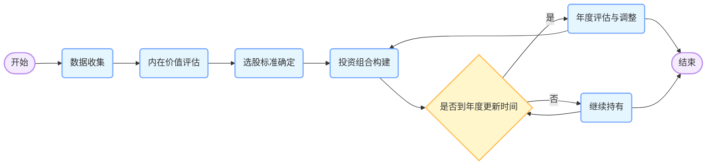

# 特价股票投资组合的年度更新策略

> 关键词：特价股票、投资组合、年度更新策略、财务分析、市场趋势

> 摘要：本文聚焦于特价股票投资组合的年度更新策略，旨在为投资者提供一套系统且有效的方法来优化投资组合。首先介绍了该策略研究的背景、目的、预期读者和文档结构，接着阐述了特价股票、投资组合等核心概念及其联系，详细讲解了核心算法原理和具体操作步骤，包括使用 Python 代码进行演示。同时给出了相关的数学模型和公式，并通过实际案例进行说明。在项目实战部分，介绍了开发环境搭建、源代码实现和代码解读。还探讨了该策略的实际应用场景，推荐了学习资源、开发工具框架以及相关论文著作。最后总结了未来发展趋势与挑战，并提供了常见问题解答和扩展阅读参考资料。

## 1. 背景介绍 
### 1.1 目的和范围
在股票投资领域，特价股票往往因其价格相对内在价值被低估而具有投资潜力。然而，市场环境不断变化，投资组合需要定期更新以适应新的市场情况，从而实现投资收益的最大化和风险的有效控制。本文的目的是提供一种针对特价股票投资组合的年度更新策略，涵盖从选股标准到组合调整的全过程。范围包括对特价股票的筛选、财务分析、市场趋势判断以及投资组合的动态平衡等方面。

### 1.2 预期读者
本文预期读者主要包括个人投资者、投资机构的分析师和投资组合经理等。对于个人投资者，能够帮助他们构建和管理自己的特价股票投资组合；对于投资机构的专业人员，可作为参考，为其投资决策提供新思路和方法。

### 1.3 文档结构概述
本文将首先介绍相关的核心概念和它们之间的联系，接着阐述核心算法原理和具体操作步骤，并给出相应的 Python 代码。然后讲解数学模型和公式，并举例说明。通过项目实战部分展示代码的实际应用和详细解读。探讨该策略的实际应用场景，推荐相关的学习资源、开发工具框架和论文著作。最后总结未来发展趋势与挑战，提供常见问题解答和扩展阅读参考资料。

### 1.4 术语表
#### 1.4.1 核心术语定义
- **特价股票**：指股票价格低于其内在价值的股票。内在价值通常通过对公司的财务状况、盈利能力、行业地位等多方面进行分析评估得出。
- **投资组合**：由多种不同的股票或其他资产组成的集合，目的是通过分散投资降低风险并实现一定的收益目标。
- **年度更新策略**：每年对投资组合进行一次全面的评估和调整，以适应市场变化和公司基本面的改变。

#### 1.4.2 相关概念解释
- **内在价值评估**：通过对公司的财务报表、行业前景、竞争优势等因素进行分析，估算公司的真实价值。常见的方法包括现金流折现法、市盈率法等。
- **市场趋势**：指股票市场在一段时间内的总体走势，可分为上升趋势、下降趋势和盘整趋势。市场趋势对投资组合的表现有重要影响。
- **风险分散**：通过投资多种不同的股票或资产，降低单一股票或资产波动对投资组合整体价值的影响。

#### 1.4.3 缩略词列表
- **PE**：市盈率（Price-to-Earnings Ratio），是指股票价格除以每股收益的比率，用于衡量股票的估值水平。
- **PB**：市净率（Price-to-Book Ratio），是指股票价格除以每股净资产的比率，反映了股票价格相对于公司净资产的倍数。
- **DCF**：现金流折现法（Discounted Cash Flow），是一种通过估算公司未来现金流并将其折现到当前价值的方法来评估公司内在价值。

## 2. 核心概念与联系 

### 核心概念原理
#### 特价股票
特价股票的核心在于其价格与内在价值的偏离。当市场对公司的短期业绩或前景过度悲观时，可能导致股票价格低于其实际价值。投资者通过深入研究公司的基本面，发现这种价格低估的机会，从而获得潜在的投资回报。

#### 投资组合
投资组合的原理基于风险分散理论。不同的股票具有不同的风险和收益特征，通过将多种股票组合在一起，可以降低单一股票波动对整体投资组合的影响。合理的投资组合应该根据投资者的风险偏好、投资目标和市场情况进行构建。

#### 年度更新策略
年度更新策略的核心是定期对投资组合进行评估和调整，以适应市场环境的变化和公司基本面的改变。随着时间的推移，一些原本被低估的股票可能已经实现了价值回归，而新的低估机会可能会出现。因此，每年对投资组合进行更新可以确保其始终保持在最优状态。

### 架构的文本示意图
```plaintext
特价股票投资组合年度更新策略架构

|-- 数据收集
|   |-- 公司财务数据
|   |-- 市场行情数据
|   |-- 行业数据
|
|-- 内在价值评估
|   |-- 现金流折现法
|   |-- 市盈率法
|   |-- 市净率法
|
|-- 选股标准确定
|   |-- 价格低于内在价值
|   |-- 财务指标良好
|   |-- 行业前景乐观
|
|-- 投资组合构建
|   |-- 风险分散原则
|   |-- 资产配置比例确定
|
|-- 年度评估与调整
|   |-- 市场趋势分析
|   |-- 公司基本面变化监测
|   |-- 投资组合再平衡
```

### Mermaid 流程图


## 3. 核心算法原理 & 具体操作步骤 

### 核心算法原理
#### 内在价值评估算法
- **现金流折现法（DCF）**：该方法基于公司未来的现金流来估算其内在价值。核心思想是将公司未来每年的自由现金流折现到当前时刻，然后求和得到公司的内在价值。公式为：
$$V = \sum_{t=1}^{n} \frac{FCF_t}{(1 + r)^t} + \frac{TV}{(1 + r)^n}$$
其中，$V$ 表示公司的内在价值，$FCF_t$ 表示第 $t$ 年的自由现金流，$r$ 表示折现率，$n$ 表示预测期数，$TV$ 表示终值。

- **市盈率法**：通过比较公司的市盈率与同行业平均市盈率来判断股票是否被低估。公式为：
$$V = EPS \times PE_{avg}$$
其中，$V$ 表示股票的内在价值，$EPS$ 表示每股收益，$PE_{avg}$ 表示同行业平均市盈率。

#### 选股算法
根据内在价值评估结果，筛选出价格低于内在价值的股票。同时，还可以结合财务指标（如净利润增长率、资产负债率等）和行业前景进行综合评估，确定最终的选股名单。

#### 投资组合优化算法
使用现代投资组合理论（MPT）来优化投资组合。该理论通过计算不同股票之间的协方差和预期收益率，确定最优的资产配置比例，以实现风险最小化和收益最大化的目标。

### 具体操作步骤
#### 步骤 1：数据收集
使用 Python 的 `pandas` 和 `yfinance` 库收集公司的财务数据、市场行情数据和行业数据。以下是示例代码：
```python
import pandas as pd
import yfinance as yf

# 定义股票代码列表
tickers = ['AAPL', 'MSFT', 'GOOG']

# 收集市场行情数据
data = yf.download(tickers, start='2020-01-01', end='2023-01-01')

# 收集公司财务数据
for ticker in tickers:
    stock = yf.Ticker(ticker)
    financials = stock.financials
    balance_sheet = stock.balance_sheet
    cashflow = stock.cashflow
```

#### 步骤 2：内在价值评估
使用上述的内在价值评估算法对每只股票进行评估。以下是现金流折现法的示例代码：
```python
def dcf_valuation(fcf, growth_rate, discount_rate, years):
    value = 0
    for i in range(1, years + 1):
        fcf_next = fcf * (1 + growth_rate) ** i
        discounted_fcf = fcf_next / ((1 + discount_rate) ** i)
        value += discounted_fcf
    # 计算终值
    terminal_value = fcf * (1 + growth_rate) ** years / (discount_rate - growth_rate)
    discounted_terminal_value = terminal_value / ((1 + discount_rate) ** years)
    value += discounted_terminal_value
    return value

# 示例参数
fcf = 100  # 初始自由现金流
growth_rate = 0.05  # 增长率
discount_rate = 0.1  # 折现率
years = 5  # 预测期数

intrinsic_value = dcf_valuation(fcf, growth_rate, discount_rate, years)
print(f"内在价值: {intrinsic_value}")
```

#### 步骤 3：选股
根据内在价值评估结果，筛选出价格低于内在价值的股票。以下是示例代码：
```python
# 假设已经有了股票的内在价值和当前价格
intrinsic_values = {'AAPL': 150, 'MSFT': 200, 'GOOG': 250}
current_prices = {'AAPL': 120, 'MSFT': 220, 'GOOG': 230}

selected_stocks = []
for ticker in tickers:
    if current_prices[ticker] < intrinsic_values[ticker]:
        selected_stocks.append(ticker)

print(f"选中的股票: {selected_stocks}")
```

#### 步骤 4：投资组合构建
使用现代投资组合理论来确定最优的资产配置比例。可以使用 `scipy.optimize` 库来实现优化。以下是示例代码：
```python
import numpy as np
from scipy.optimize import minimize

# 假设已经有了股票的预期收益率和协方差矩阵
expected_returns = np.array([0.1, 0.12, 0.15])
cov_matrix = np.array([[0.01, 0.005, 0.003],
                       [0.005, 0.02, 0.006],
                       [0.003, 0.006, 0.03]])

# 定义目标函数：最小化投资组合的方差
def portfolio_variance(weights, cov_matrix):
    return np.dot(weights.T, np.dot(cov_matrix, weights))

# 约束条件：权重之和为 1
constraints = ({'type': 'eq', 'fun': lambda x: np.sum(x) - 1})

# 权重范围：0 到 1
bounds = [(0, 1) for _ in range(len(expected_returns))]

# 初始权重
initial_weights = np.ones(len(expected_returns)) / len(expected_returns)

# 优化
result = minimize(portfolio_variance, initial_weights, args=(cov_matrix,), constraints=constraints, bounds=bounds)

optimal_weights = result.x
print(f"最优权重: {optimal_weights}")
```

#### 步骤 5：年度评估与调整
每年对投资组合进行评估，根据市场趋势和公司基本面的变化调整投资组合。可以重复上述步骤 1 到 4 来更新投资组合。

## 4. 数学模型和公式 & 详细讲解 & 举例说明 

### 内在价值评估模型
#### 现金流折现法（DCF）
公式：
$$V = \sum_{t=1}^{n} \frac{FCF_t}{(1 + r)^t} + \frac{TV}{(1 + r)^n}$$
详细讲解：
- $FCF_t$ 表示第 $t$ 年的自由现金流，自由现金流是指公司在满足了所有运营和资本支出后剩余的现金流量，反映了公司实际可用于分配给股东或进行再投资的现金数量。
- $r$ 表示折现率，折现率反映了资金的时间价值和投资的风险程度。一般可以使用加权平均资本成本（WACC）作为折现率。
- $n$ 表示预测期数，通常根据公司的业务特点和行业发展情况确定。
- $TV$ 表示终值，是指预测期结束后公司的持续价值。终值的计算方法有多种，常见的是使用永续增长模型：
$$TV = \frac{FCF_{n+1}}{r - g}$$
其中，$FCF_{n+1}$ 表示预测期结束后下一年的自由现金流，$g$ 表示永续增长率。

举例说明：
假设一家公司的初始自由现金流为 $100$ 万元，预计未来 5 年的自由现金流增长率为 $5\%$，折现率为 $10\%$，永续增长率为 $3\%$。则：
- 第 1 年的自由现金流：$FCF_1 = 100 \times (1 + 0.05) = 105$ 万元
- 第 2 年的自由现金流：$FCF_2 = 105 \times (1 + 0.05) = 110.25$ 万元
- 第 3 年的自由现金流：$FCF_3 = 110.25 \times (1 + 0.05) = 115.76$ 万元
- 第 4 年的自由现金流：$FCF_4 = 115.76 \times (1 + 0.05) = 121.55$ 万元
- 第 5 年的自由现金流：$FCF_5 = 121.55 \times (1 + 0.05) = 127.63$ 万元
- 终值：$TV = \frac{127.63 \times (1 + 0.03)}{0.1 - 0.03} = 1877.71$ 万元
- 内在价值：
$$V = \frac{105}{(1 + 0.1)^1} + \frac{110.25}{(1 + 0.1)^2} + \frac{115.76}{(1 + 0.1)^3} + \frac{121.55}{(1 + 0.1)^4} + \frac{127.63}{(1 + 0.1)^5} + \frac{1877.71}{(1 + 0.1)^5} \approx 1423.67$$ 万元

#### 市盈率法
公式：
$$V = EPS \times PE_{avg}$$
详细讲解：
- $EPS$ 表示每股收益，是指公司净利润除以总股本得到的每股盈利金额，反映了公司的盈利能力。
- $PE_{avg}$ 表示同行业平均市盈率，市盈率是衡量股票估值水平的常用指标，同行业平均市盈率可以作为参考，判断目标股票的估值是否合理。

举例说明：
假设一家公司的每股收益为 $2$ 元，同行业平均市盈率为 $15$ 倍。则该股票的内在价值为：
$V = 2 \times 15 = 30$ 元

### 投资组合优化模型
#### 现代投资组合理论（MPT）
目标函数：最小化投资组合的方差
$$\min_{w} \sigma_p^2 = w^T \Sigma w$$
约束条件：
$$\sum_{i=1}^{n} w_i = 1$$
$$0 \leq w_i \leq 1, i = 1, 2, \cdots, n$$
详细讲解：
- $w$ 表示投资组合中各资产的权重向量，$w_i$ 表示第 $i$ 种资产的权重。
- $\Sigma$ 表示资产收益率的协方差矩阵，反映了各资产之间的相关性。
- $\sigma_p^2$ 表示投资组合的方差，衡量了投资组合的风险。

举例说明：
假设有两种股票 A 和 B，预期收益率分别为 $10\%$ 和 $12\%$，收益率的协方差矩阵为：
$$\Sigma = \begin{bmatrix} 0.01 & 0.005 \\ 0.005 & 0.02 \end{bmatrix}$$
设股票 A 的权重为 $w_1$，股票 B 的权重为 $w_2 = 1 - w_1$。则投资组合的方差为：
$$\sigma_p^2 = w_1^2 \times 0.01 + 2 \times w_1 \times (1 - w_1) \times 0.005 + (1 - w_1)^2 \times 0.02$$
通过求导或使用优化算法可以找到使 $\sigma_p^2$ 最小的 $w_1$ 和 $w_2$ 值。

## 5. 项目实战：代码实际案例和详细解释说明 

### 5.1  开发环境搭建
#### 安装 Python
首先需要安装 Python 环境，建议使用 Python 3.7 及以上版本。可以从 Python 官方网站（https://www.python.org/downloads/） 下载并安装。

#### 安装必要的库
使用 `pip` 命令安装所需的库：
```sh
pip install pandas yfinance scipy numpy matplotlib
```
- `pandas`：用于数据处理和分析。
- `yfinance`：用于获取股票市场行情数据。
- `scipy`：用于优化算法。
- `numpy`：用于数值计算。
- `matplotlib`：用于数据可视化。

### 5.2  源代码详细实现和代码解读
```python
import pandas as pd
import yfinance as yf
import numpy as np
from scipy.optimize import minimize
import matplotlib.pyplot as plt

# 步骤 1：数据收集
tickers = ['AAPL', 'MSFT', 'GOOG']
start_date = '2020-01-01'
end_date = '2023-01-01'

data = yf.download(tickers, start=start_date, end=end_date)
prices = data['AdjClose']

# 步骤 2：计算收益率
returns = prices.pct_change().dropna()

# 步骤 3：计算预期收益率和协方差矩阵
expected_returns = returns.mean()
cov_matrix = returns.cov()

# 步骤 4：定义目标函数和约束条件
def portfolio_variance(weights, cov_matrix):
    return np.dot(weights.T, np.dot(cov_matrix, weights))

constraints = ({'type': 'eq', 'fun': lambda x: np.sum(x) - 1})
bounds = [(0, 1) for _ in range(len(expected_returns))]
initial_weights = np.ones(len(expected_returns)) / len(expected_returns)

# 步骤 5：优化投资组合
result = minimize(portfolio_variance, initial_weights, args=(cov_matrix,), constraints=constraints, bounds=bounds)
optimal_weights = result.x

# 步骤 6：计算最优投资组合的预期收益率和风险
optimal_portfolio_return = np.dot(optimal_weights, expected_returns)
optimal_portfolio_risk = np.sqrt(portfolio_variance(optimal_weights, cov_matrix))

# 步骤 7：可视化结果
plt.figure(figsize=(10, 6))
plt.bar(tickers, optimal_weights)
plt.title('Optimal Portfolio Weights')
plt.xlabel('Stocks')
plt.ylabel('Weights')
plt.show()

print(f"最优权重: {optimal_weights}")
print(f"最优投资组合预期收益率: {optimal_portfolio_return}")
print(f"最优投资组合风险: {optimal_portfolio_risk}")
```

### 5.3  代码解读与分析
#### 数据收集
使用 `yfinance` 库下载指定股票在指定时间范围内的调整后收盘价数据。

#### 计算收益率
使用 `pct_change()` 方法计算每日收益率，并去除缺失值。

#### 计算预期收益率和协方差矩阵
通过计算收益率的均值得到预期收益率，使用 `cov()` 方法计算收益率的协方差矩阵。

#### 定义目标函数和约束条件
目标函数是最小化投资组合的方差，约束条件是权重之和为 1，权重范围在 0 到 1 之间。

#### 优化投资组合
使用 `scipy.optimize.minimize()` 函数进行优化，找到使投资组合方差最小的权重。

#### 计算最优投资组合的预期收益率和风险
根据最优权重计算最优投资组合的预期收益率和风险。

#### 可视化结果
使用 `matplotlib` 库绘制最优投资组合的权重柱状图。

## 6. 实际应用场景 
### 个人投资者
个人投资者可以使用该策略构建和管理自己的特价股票投资组合。通过定期更新投资组合，适应市场变化，提高投资收益。例如，一位上班族可以在业余时间使用该策略，选择一些被低估的股票进行投资，通过分散投资降低风险。

### 投资机构
投资机构可以将该策略作为投资决策的参考，为客户构建定制化的投资组合。投资经理可以根据客户的风险偏好和投资目标，调整选股标准和资产配置比例。同时，投资机构可以利用自身的研究资源和专业能力，对投资组合进行更深入的分析和监控。

### 量化投资团队
量化投资团队可以将该策略进行量化实现，通过自动化交易系统进行投资组合的更新和调整。量化模型可以根据实时市场数据和公司财务数据，快速做出投资决策，提高投资效率和准确性。

## 7. 工具和资源推荐
### 7.1 学习资源推荐
#### 7.1.1 书籍推荐
- 《聪明的投资者》（The Intelligent Investor）：本杰明·格雷厄姆（Benjamin Graham）著，被誉为投资领域的圣经，介绍了价值投资的基本理念和方法。
- 《证券分析》（Security Analysis）：本杰明·格雷厄姆和大卫·多德（David Dodd）著，是价值投资的经典著作，详细讲解了股票和债券的分析方法。
- 《漫步华尔街》（A Random Walk Down Wall Street）：伯顿·马尔基尔（Burton Malkiel）著，介绍了有效市场假说和投资组合理论，对投资者有很大的启发。

#### 7.1.2 在线课程
- Coursera 上的“投资学原理”（Principles of Investing）课程：由知名教授授课，系统介绍了投资学的基本概念和方法。
- edX 上的“金融市场”（Financial Markets）课程：耶鲁大学教授罗伯特·席勒（Robert Shiller）主讲，涵盖了金融市场的各个方面。

#### 7.1.3 技术博客和网站
- 雪球（https://xueqiu.com/）：国内知名的投资社区，提供股票行情、财经新闻、投资分析等内容。
- Seeking Alpha（https://seekingalpha.com/）：国外的投资研究网站，有大量的股票分析文章和投资策略分享。

### 7.2 开发工具框架推荐
#### 7.2.1 IDE和编辑器
- PyCharm：功能强大的 Python 集成开发环境，提供代码编辑、调试、版本控制等功能。
- Jupyter Notebook：交互式编程环境，适合进行数据分析和模型开发，方便展示代码和结果。

#### 7.2.2 调试和性能分析工具
- PDB：Python 自带的调试工具，可以帮助开发者定位和解决代码中的问题。
- cProfile：Python 的性能分析工具，可以分析代码的运行时间和函数调用情况，帮助优化代码性能。

#### 7.2.3 相关框架和库
- Pandas：强大的数据处理和分析库，提供了丰富的数据结构和函数，方便进行数据清洗、转换和分析。
- Numpy：用于数值计算的基础库，提供了高效的数组操作和数学函数。
- Scikit-learn：机器学习库，提供了各种机器学习算法和工具，可用于股票预测和投资组合优化。

### 7.3 相关论文著作推荐
#### 7.3.1 经典论文
- “The Capital Asset Pricing Model: Theory and Evidence”：由 Eugene F. Fama 和 Kenneth R. French 发表，介绍了资本资产定价模型（CAPM）的理论和实证研究。
- “Common Risk Factors in the Returns on Stocks and Bonds”：同样由 Eugene F. Fama 和 Kenneth R. French 发表，提出了三因子模型，对投资组合理论有重要影响。

#### 7.3.2 最新研究成果
- 关注顶级金融学术期刊，如《Journal of Finance》、《Review of Financial Studies》等，了解最新的投资研究成果。
- 参加金融学术会议，如美国金融协会年会（AFA Annual Meeting），与业内专家交流最新的研究进展。

#### 7.3.3 应用案例分析
- 可以参考一些投资机构的研究报告和案例分析，了解他们在特价股票投资组合管理方面的实践经验。
- 分析一些知名投资者的投资策略和案例，如巴菲特的价值投资策略，从中获取灵感和启示。

## 8. 总结：未来发展趋势与挑战
### 未来发展趋势
#### 数据驱动的投资决策
随着大数据和人工智能技术的发展，未来的投资决策将更加依赖于数据和模型。投资者可以利用海量的市场数据、公司财务数据和社交媒体数据等，进行更准确的股票估值和市场趋势预测。

#### 量化投资的普及
量化投资将越来越普及，通过算法和模型进行自动化交易和投资组合管理。量化模型可以快速处理大量数据，做出及时的投资决策，提高投资效率和准确性。

#### 可持续投资的兴起
投资者对环境、社会和治理（ESG）因素的关注度越来越高，可持续投资将成为未来的发展趋势。在构建特价股票投资组合时，投资者将更加注重公司的 ESG 表现。

### 挑战
#### 数据质量和可靠性
数据的质量和可靠性是数据驱动投资决策的关键。不准确或不完整的数据可能导致错误的投资决策。因此，如何获取高质量的数据并进行有效的数据清洗和预处理是一个挑战。

#### 模型的复杂性和可解释性
量化模型的复杂性不断增加，这使得模型的可解释性变得困难。投资者需要在追求模型准确性的同时，保证模型的可解释性，以便更好地理解投资决策的依据。

#### 市场的不确定性和波动性
股票市场具有高度的不确定性和波动性，即使使用先进的投资策略和模型，也难以完全预测市场的变化。投资者需要具备应对市场风险的能力，及时调整投资组合。

## 9. 附录：常见问题与解答
### 问题 1：如何确定折现率？
折现率的确定需要考虑多个因素，如无风险利率、市场风险溢价、公司的风险特征等。一般可以使用加权平均资本成本（WACC）作为折现率，WACC 的计算公式为：
$$WACC = w_d \times r_d \times (1 - T) + w_e \times r_e$$
其中，$w_d$ 和 $w_e$ 分别表示债务和股权的权重，$r_d$ 表示债务成本，$r_e$ 表示股权成本，$T$ 表示税率。

### 问题 2：如何选择合适的选股标准？
选股标准的选择应根据投资者的投资目标、风险偏好和市场情况进行调整。除了价格低于内在价值外，还可以考虑财务指标（如净利润增长率、资产负债率等）、行业前景、公司治理等因素。

### 问题 3：投资组合多久更新一次比较合适？
一般建议每年对投资组合进行一次全面的评估和调整。但在市场发生重大变化或公司基本面出现明显改变时，也可以及时调整投资组合。

### 问题 4：如何评估投资组合的绩效？
可以使用多种指标来评估投资组合的绩效，如夏普比率（Sharpe Ratio）、特雷诺比率（Treynor Ratio）、詹森阿尔法（Jensen's Alpha）等。这些指标可以综合考虑投资组合的收益和风险，帮助投资者评估投资组合的表现。

## 10. 扩展阅读 & 参考资料
### 扩展阅读
- 《金融炼金术》（The Alchemy of Finance）：乔治·索罗斯（George Soros）著，介绍了他的反身性理论和投资实践。
- 《黑天鹅》（The Black Swan）：纳西姆·尼古拉斯·塔勒布（Nassim Nicholas Taleb）著，探讨了极端事件对金融市场的影响。

### 参考资料
- 金融数据提供商：雅虎财经（https://finance.yahoo.com/）、彭博（https://www.bloomberg.com/）等。
- 学术数据库：Web of Science、EBSCOhost 等，可获取相关的学术论文和研究报告。

作者：AI天才研究院/AI Genius Institute & 禅与计算机程序设计艺术 /Zen And The Art of Computer Programming