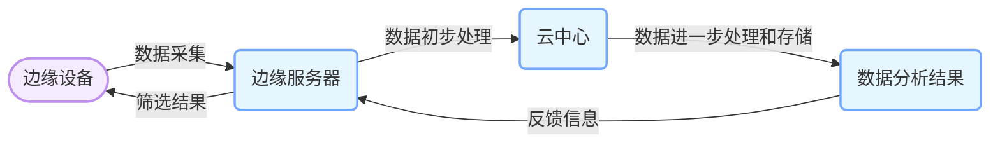
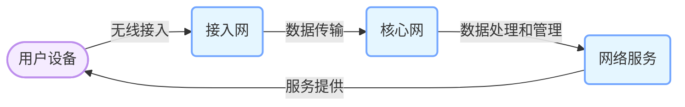

# 特价股票筛选中的边缘计算和5G技术应用

> 关键词：特价股票筛选、边缘计算、5G技术、金融科技、实时数据分析

> 摘要：本文聚焦于特价股票筛选领域，深入探讨边缘计算和5G技术的应用。首先介绍相关背景知识，包括目的范围、预期读者等。接着阐述边缘计算和5G的核心概念及联系，分析其原理和架构。详细讲解用于特价股票筛选的核心算法原理，结合Python代码进行说明。引入数学模型和公式，并举例解释。通过项目实战，给出代码实际案例和详细解读。探讨这些技术在特价股票筛选中的实际应用场景，推荐相关工具和资源。最后总结未来发展趋势与挑战，解答常见问题并提供扩展阅读和参考资料，旨在为金融科技领域利用边缘计算和5G技术进行特价股票筛选提供全面的技术指导和理论支持。

## 1. 背景介绍 
### 1.1 目的和范围
在金融市场中，特价股票筛选是投资者获取潜在高收益的重要手段。传统的股票筛选方式往往存在数据处理速度慢、实时性差等问题，难以满足投资者对快速准确筛选特价股票的需求。边缘计算和5G技术的出现为解决这些问题提供了新的途径。本文的目的在于探讨如何将边缘计算和5G技术应用于特价股票筛选中，提高筛选的效率和准确性。范围涵盖边缘计算和5G技术的基本原理、在特价股票筛选中的应用算法、实际案例分析以及相关工具和资源的推荐。

### 1.2 预期读者
本文预期读者包括金融科技领域的从业者，如股票分析师、投资顾问、金融软件开发工程师等；对金融科技和新兴技术应用感兴趣的研究人员；以及希望利用新技术提升股票投资效率的个人投资者。

### 1.3 文档结构概述
本文将按照以下结构进行阐述：首先介绍边缘计算和5G技术的核心概念与联系，包括其原理和架构；接着详细讲解用于特价股票筛选的核心算法原理和具体操作步骤，并给出Python源代码；引入数学模型和公式，结合实际例子进行详细说明；通过项目实战展示代码的实际应用和详细解读；探讨边缘计算和5G技术在特价股票筛选中的实际应用场景；推荐相关的学习资源、开发工具框架和论文著作；最后总结未来发展趋势与挑战，解答常见问题并提供扩展阅读和参考资料。

### 1.4 术语表
#### 1.4.1 核心术语定义
- **边缘计算**：是一种将计算和数据存储靠近数据源的分布式计算范式，旨在减少数据传输延迟，提高系统的响应速度和效率。
- **5G技术**：第五代移动通信技术，具有高速率、低延迟、大容量等特点，能够实现海量数据的快速传输。
- **特价股票**：指价格相对其内在价值被低估的股票，具有潜在的投资价值。
- **股票筛选**：根据一定的条件和标准，从众多股票中挑选出符合要求的股票的过程。

#### 1.4.2 相关概念解释
- **分布式计算**：将一个复杂的计算任务分解为多个子任务，分布在不同的计算节点上并行执行，以提高计算效率。
- **数据传输延迟**：指数据从发送端传输到接收端所花费的时间，是衡量数据传输效率的重要指标。
- **内在价值**：股票的真实价值，通常通过对公司的财务状况、行业前景等因素进行分析评估得出。

#### 1.4.3 缩略词列表
- **EC**：Edge Computing（边缘计算）
- **5G**：Fifth Generation Mobile Communication Technology（第五代移动通信技术）

## 2. 核心概念与联系 
### 2.1 边缘计算原理和架构
边缘计算的核心思想是将计算和数据存储靠近数据源，减少数据传输到云端的延迟。其架构通常包括边缘设备、边缘服务器和云中心。边缘设备如传感器、智能终端等负责采集数据；边缘服务器部署在靠近数据源的地方，对数据进行初步处理和分析；云中心则负责对边缘服务器上传的数据进行进一步的处理和存储。

边缘计算的优点在于能够提高系统的响应速度，降低网络带宽需求，增强数据安全性。例如，在股票交易场景中，边缘计算可以在本地对股票交易数据进行实时分析，快速筛选出特价股票，而无需将大量数据传输到云端进行处理。

下面是边缘计算架构的文本示意图：
```plaintext
+-------------------+
|      云中心       |
+-------------------+
       |
       | 数据上传/下发
       v
+-------------------+
|    边缘服务器     |
+-------------------+
       |
       | 数据采集/处理
       v
+-------------------+
|    边缘设备       |
| （如传感器、终端） |
+-------------------+
```

使用Mermaid绘制的流程图如下：


### 2.2 5G技术原理和架构
5G技术基于新的无线接入技术和核心网架构，实现了高速率、低延迟、大容量的数据传输。其关键技术包括毫米波通信、大规模MIMO、网络切片等。

5G网络架构主要由接入网、核心网和用户设备组成。接入网负责将用户设备连接到网络，核心网则负责处理和管理网络中的数据流量。5G技术的低延迟特性使得实时数据传输成为可能，为金融市场的实时交易和数据分析提供了有力支持。

下面是5G技术架构的文本示意图：
```plaintext
+-------------------+
|      用户设备     |
+-------------------+
       |
       | 无线接入
       v
+-------------------+
|      接入网       |
+-------------------+
       |
       | 数据传输
       v
+-------------------+
|      核心网       |
+-------------------+
```

使用Mermaid绘制的流程图如下：


### 2.3 边缘计算和5G技术的联系
边缘计算和5G技术相互补充，共同推动了金融科技领域的发展。5G技术的高速率和低延迟特性为边缘计算提供了强大的网络支持，使得边缘设备能够快速地与边缘服务器和云中心进行数据交互。边缘计算则可以减轻5G网络的带宽压力，通过在本地对数据进行处理和分析，减少需要传输到云端的数据量。

在特价股票筛选中，5G技术确保了股票交易数据能够实时准确地传输到边缘设备和边缘服务器，边缘计算则可以在本地对这些数据进行快速筛选和分析，及时发现特价股票，为投资者提供决策支持。

## 3. 核心算法原理 & 具体操作步骤 
### 3.1 算法原理
在特价股票筛选中，我们可以使用基于机器学习的算法，如决策树算法。决策树算法是一种基于树结构进行决策的算法，它通过对数据的特征进行分析和比较，构建一棵决策树，根据树的节点进行决策。

具体来说，我们可以将股票的各种特征，如市盈率、市净率、股息率等作为输入，通过决策树算法构建一个分类模型，将股票分为特价股票和非特价股票。

### 3.2 具体操作步骤
1. **数据收集**：收集股票的历史交易数据和财务数据，包括市盈率、市净率、股息率等特征。
2. **数据预处理**：对收集到的数据进行清洗、归一化等处理，去除噪声和异常值，使数据具有可比性。
3. **模型训练**：使用决策树算法对预处理后的数据进行训练，构建分类模型。
4. **模型评估**：使用测试数据对训练好的模型进行评估，计算模型的准确率、召回率等指标。
5. **股票筛选**：将实时的股票数据输入到训练好的模型中，根据模型的输出结果筛选出特价股票。

### 3.3 Python源代码实现
```python
import pandas as pd
from sklearn.tree import DecisionTreeClassifier
from sklearn.model_selection import train_test_split
from sklearn.metrics import accuracy_score

# 数据收集和预处理
def data_preprocessing(file_path):
    data = pd.read_csv(file_path)
    # 假设数据集中包含 'PE_ratio', 'PB_ratio', 'Dividend_yield' 等特征列和 'is_bargain' 目标列
    X = data[['PE_ratio', 'PB_ratio', 'Dividend_yield']]
    y = data['is_bargain']
    # 数据归一化处理
    X = (X - X.mean()) / X.std()
    return X, y

# 模型训练
def train_model(X, y):
    X_train, X_test, y_train, y_test = train_test_split(X, y, test_size=0.2, random_state=42)
    model = DecisionTreeClassifier()
    model.fit(X_train, y_train)
    y_pred = model.predict(X_test)
    accuracy = accuracy_score(y_test, y_pred)
    print(f"模型准确率: {accuracy}")
    return model

# 股票筛选
def stock_screening(model, new_data):
    new_data = (new_data - new_data.mean()) / new_data.std()
    result = model.predict(new_data)
    return result

# 主函数
if __name__ == "__main__":
    file_path = "stock_data.csv"
    X, y = data_preprocessing(file_path)
    model = train_model(X, y)
    # 假设 new_data 是实时的股票数据
    new_data = pd.DataFrame({
        'PE_ratio': [10, 15, 20],
        'PB_ratio': [1.2, 1.5, 1.8],
        'Dividend_yield': [0.03, 0.02, 0.01]
    })
    screening_result = stock_screening(model, new_data)
    print(f"筛选结果: {screening_result}")
```

### 3.4 代码解释
- `data_preprocessing` 函数：用于读取股票数据文件，提取特征和目标列，并对数据进行归一化处理。
- `train_model` 函数：将数据分为训练集和测试集，使用决策树算法进行模型训练，并计算模型的准确率。
- `stock_screening` 函数：将实时的股票数据进行归一化处理，输入到训练好的模型中进行筛选，返回筛选结果。
- 主函数：调用上述函数完成数据预处理、模型训练和股票筛选的整个流程。

## 4. 数学模型和公式 & 详细讲解 & 举例说明 
### 4.1 决策树算法的数学模型
决策树算法的核心是构建一棵决策树，决策树由节点和边组成。节点分为内部节点和叶节点，内部节点表示一个特征的判断条件，叶节点表示一个分类结果。

决策树的构建过程通常基于信息增益、信息增益率或基尼指数等指标。以信息增益为例，信息增益的计算公式如下：
$$
IG(D, A) = H(D) - H(D|A)
$$
其中，$IG(D, A)$ 表示特征 $A$ 对数据集 $D$ 的信息增益，$H(D)$ 表示数据集 $D$ 的信息熵，$H(D|A)$ 表示在特征 $A$ 给定的条件下数据集 $D$ 的条件熵。

### 4.2 信息熵和条件熵的计算公式
信息熵的计算公式为：
$$
H(D) = -\sum_{k=1}^{K}p_k\log_2p_k
$$
其中，$K$ 表示数据集 $D$ 中类别的数量，$p_k$ 表示第 $k$ 类样本在数据集 $D$ 中所占的比例。

条件熵的计算公式为：
$$
H(D|A) = \sum_{i=1}^{V}\frac{|D_i|}{|D|}H(D_i)
$$
其中，$V$ 表示特征 $A$ 取值的数量，$D_i$ 表示特征 $A$ 取值为第 $i$ 个值的样本子集，$|D_i|$ 表示 $D_i$ 的样本数量，$|D|$ 表示数据集 $D$ 的样本数量。

### 4.3 举例说明
假设有一个包含 10 个样本的数据集 $D$，其中 6 个样本属于类别 1，4 个样本属于类别 2。则数据集 $D$ 的信息熵为：
$$
H(D) = -\frac{6}{10}\log_2\frac{6}{10} - \frac{4}{10}\log_2\frac{4}{10} \approx 0.971
$$
假设特征 $A$ 有两个取值，取值为 $A_1$ 的样本有 5 个，其中 3 个属于类别 1，2 个属于类别 2；取值为 $A_2$ 的样本有 5 个，其中 3 个属于类别 1，2 个属于类别 2。则特征 $A$ 取值为 $A_1$ 的样本子集 $D_1$ 的信息熵为：
$$
H(D_1) = -\frac{3}{5}\log_2\frac{3}{5} - \frac{2}{5}\log_2\frac{2}{5} \approx 0.971
$$
特征 $A$ 取值为 $A_2$ 的样本子集 $D_2$ 的信息熵为：
$$
H(D_2) = -\frac{3}{5}\log_2\frac{3}{5} - \frac{2}{5}\log_2\frac{2}{5} \approx 0.971
$$
则特征 $A$ 对数据集 $D$ 的条件熵为：
$$
H(D|A) = \frac{5}{10}H(D_1) + \frac{5}{10}H(D_2) = 0.971
$$
特征 $A$ 对数据集 $D$ 的信息增益为：
$$
IG(D, A) = H(D) - H(D|A) = 0.971 - 0.971 = 0
$$

## 5. 项目实战：代码实际案例和详细解释说明 
### 5.1  开发环境搭建
#### 5.1.1 安装Python
首先需要安装Python环境，建议使用Python 3.7及以上版本。可以从Python官方网站（https://www.python.org/downloads/）下载安装包进行安装。

#### 5.1.2 安装必要的库
使用以下命令安装项目所需的库：
```sh
pip install pandas scikit-learn
```
### 5.2  源代码详细实现和代码解读
```python
import pandas as pd
from sklearn.tree import DecisionTreeClassifier
from sklearn.model_selection import train_test_split
from sklearn.metrics import accuracy_score

# 数据收集和预处理
def data_preprocessing(file_path):
    data = pd.read_csv(file_path)
    # 假设数据集中包含 'PE_ratio', 'PB_ratio', 'Dividend_yield' 等特征列和 'is_bargain' 目标列
    X = data[['PE_ratio', 'PB_ratio', 'Dividend_yield']]
    y = data['is_bargain']
    # 数据归一化处理
    X = (X - X.mean()) / X.std()
    return X, y

# 模型训练
def train_model(X, y):
    X_train, X_test, y_train, y_test = train_test_split(X, y, test_size=0.2, random_state=42)
    model = DecisionTreeClassifier()
    model.fit(X_train, y_train)
    y_pred = model.predict(X_test)
    accuracy = accuracy_score(y_test, y_pred)
    print(f"模型准确率: {accuracy}")
    return model

# 股票筛选
def stock_screening(model, new_data):
    new_data = (new_data - new_data.mean()) / new_data.std()
    result = model.predict(new_data)
    return result

# 主函数
if __name__ == "__main__":
    file_path = "stock_data.csv"
    X, y = data_preprocessing(file_path)
    model = train_model(X, y)
    # 假设 new_data 是实时的股票数据
    new_data = pd.DataFrame({
        'PE_ratio': [10, 15, 20],
        'PB_ratio': [1.2, 1.5, 1.8],
        'Dividend_yield': [0.03, 0.02, 0.01]
    })
    screening_result = stock_screening(model, new_data)
    print(f"筛选结果: {screening_result}")
```

### 5.2.1 代码解读
- **数据收集和预处理**：`data_preprocessing` 函数使用 `pandas` 库读取股票数据文件，提取特征列和目标列，并对特征数据进行归一化处理，以确保不同特征具有相同的尺度。
- **模型训练**：`train_model` 函数使用 `sklearn` 库的 `train_test_split` 函数将数据分为训练集和测试集，使用 `DecisionTreeClassifier` 构建决策树模型，并进行训练。最后使用测试集评估模型的准确率。
- **股票筛选**：`stock_screening` 函数将实时的股票数据进行归一化处理，输入到训练好的模型中进行筛选，返回筛选结果。
- **主函数**：调用上述函数完成数据预处理、模型训练和股票筛选的整个流程。

### 5.3  代码解读与分析
#### 5.3.1 数据预处理的重要性
数据预处理是机器学习项目中非常重要的一步，它可以提高模型的性能和稳定性。在本项目中，对特征数据进行归一化处理可以避免某些特征因为数值范围过大而对模型产生过大的影响。

#### 5.3.2 模型评估的意义
使用测试集对模型进行评估可以了解模型的泛化能力，即模型在未见过的数据上的表现。在本项目中，通过计算模型的准确率，可以判断模型是否能够准确地筛选出特价股票。

#### 5.3.3 实时数据处理
在实际应用中，需要实时获取股票数据并进行筛选。可以使用5G技术确保数据的实时传输，使用边缘计算在本地对数据进行处理和筛选，提高筛选的效率。

## 6. 实际应用场景 
### 6.1 个人投资者
对于个人投资者来说，边缘计算和5G技术可以帮助他们实时获取股票市场的最新信息，快速筛选出特价股票。例如，个人投资者可以使用智能终端设备，通过5G网络实时接收股票交易数据，利用边缘计算在本地对数据进行分析和筛选，及时发现具有投资价值的特价股票。

### 6.2 金融机构
金融机构如证券公司、基金公司等可以利用边缘计算和5G技术提高股票筛选的效率和准确性。例如，证券公司可以在交易服务器上部署边缘计算设备，对大量的股票交易数据进行实时处理和分析，为客户提供更准确的投资建议。基金公司可以利用这些技术优化投资组合，提高基金的收益率。

### 6.3 股票交易系统
在股票交易系统中，边缘计算和5G技术可以实现实时的交易决策和风险控制。例如，交易系统可以根据实时的股票数据和预设的筛选条件，自动筛选出特价股票，并及时进行交易。同时，通过边缘计算对交易数据进行实时分析，可以及时发现潜在的风险，采取相应的风险控制措施。

## 7. 工具和资源推荐
### 7.1 学习资源推荐
#### 7.1.1 书籍推荐
- 《Python机器学习实战》：本书详细介绍了Python在机器学习领域的应用，包括数据预处理、模型训练、模型评估等内容，适合初学者入门。
- 《金融科技：框架与实践》：该书系统地介绍了金融科技的各个方面，包括边缘计算、5G技术在金融领域的应用，对于理解金融科技的发展趋势和应用场景有很大帮助。

#### 7.1.2 在线课程
- Coursera上的“机器学习”课程：由斯坦福大学教授Andrew Ng授课，是机器学习领域的经典课程，涵盖了机器学习的基本概念、算法和应用。
- edX上的“金融科技基础”课程：该课程介绍了金融科技的基本概念和技术，包括边缘计算、区块链、人工智能等在金融领域的应用。

#### 7.1.3 技术博客和网站
- Medium：是一个技术博客平台，上面有很多关于金融科技、机器学习等领域的优质文章。
- 机器之心：专注于人工智能和机器学习领域的资讯和技术分享，提供了很多前沿的技术文章和案例分析。

### 7.2 开发工具框架推荐
#### 7.2.1 IDE和编辑器
- PyCharm：是一款专业的Python集成开发环境，具有代码编辑、调试、版本控制等功能，适合Python开发。
- Jupyter Notebook：是一个交互式的开发环境，支持Python、R等多种编程语言，适合进行数据探索和模型实验。

#### 7.2.2 调试和性能分析工具
- Py-Spy：是一个用于Python程序性能分析的工具，可以帮助开发者找出程序中的性能瓶颈。
- pdb：是Python自带的调试工具，可以在代码中设置断点，逐步执行代码，方便调试。

#### 7.2.3 相关框架和库
- Pandas：是一个用于数据处理和分析的Python库，提供了丰富的数据结构和数据操作方法。
- Scikit-learn：是一个用于机器学习的Python库，包含了各种机器学习算法和工具，方便开发者进行模型训练和评估。

### 7.3 相关论文著作推荐
#### 7.3.1 经典论文
- “A Decision-Theoretic Generalization of On-Line Learning and an Application to Boosting”：该论文介绍了决策树算法和提升算法的理论基础，对于理解决策树算法的原理和应用有很大帮助。
- “5G for Vertical Industries: Requirements, Design Principles, and Business Models”：该论文探讨了5G技术在垂直行业中的应用需求、设计原则和商业模式，对于了解5G技术在金融领域的应用有参考价值。

#### 7.3.2 最新研究成果
- 可以关注IEEE、ACM等计算机领域的顶级会议和期刊，如IEEE Transactions on Mobile Computing、ACM SIGKDD Conference on Knowledge Discovery and Data Mining等，获取边缘计算和5G技术在金融领域的最新研究成果。

#### 7.3.3 应用案例分析
- 可以参考金融科技公司的官方网站和行业报告，了解边缘计算和5G技术在特价股票筛选和金融交易中的实际应用案例。

## 8. 总结：未来发展趋势与挑战
### 8.1 未来发展趋势
- **智能化程度不断提高**：随着人工智能技术的不断发展，边缘计算和5G技术在特价股票筛选中的应用将更加智能化。例如，使用深度学习算法可以对股票数据进行更深入的分析和挖掘，提高筛选的准确性和效率。
- **与其他技术融合发展**：边缘计算和5G技术将与区块链、物联网等技术融合发展，为金融市场带来更多的创新应用。例如，区块链技术可以提高股票交易的安全性和透明度，物联网技术可以实时获取更多的股票相关数据。
- **应用场景不断拓展**：除了特价股票筛选，边缘计算和5G技术还将在金融风险管理、投资组合优化等领域得到更广泛的应用。

### 8.2 挑战
- **数据安全和隐私问题**：边缘计算和5G技术使得大量的金融数据在网络中传输和处理，数据安全和隐私问题成为了一个重要的挑战。需要采取有效的措施，如加密技术、访问控制等，保障数据的安全和隐私。
- **技术标准和规范不完善**：目前边缘计算和5G技术在金融领域的应用还缺乏统一的技术标准和规范，这给技术的推广和应用带来了一定的困难。需要相关部门和行业组织加强合作，制定统一的技术标准和规范。
- **人才短缺**：边缘计算和5G技术在金融领域的应用需要既懂金融又懂技术的复合型人才，目前这类人才相对短缺。需要加强人才培养和引进，提高行业的整体技术水平。

## 9. 附录：常见问题与解答
### 9.1 边缘计算和云计算有什么区别？
边缘计算将计算和数据存储靠近数据源，减少数据传输延迟，适用于对实时性要求较高的场景；云计算将计算和数据存储集中在云端，适用于对计算资源要求较高的场景。

### 9.2 5G技术对股票筛选有什么作用？
5G技术具有高速率、低延迟的特点，可以确保股票交易数据实时准确地传输到边缘设备和边缘服务器，为实时筛选特价股票提供了有力支持。

### 9.3 如何评估决策树模型的性能？
可以使用准确率、召回率、F1值等指标评估决策树模型的性能。准确率表示模型预测正确的样本占总样本的比例；召回率表示模型正确预测为正类的样本占实际正类样本的比例；F1值是准确率和召回率的调和平均数。

### 9.4 如何提高特价股票筛选的准确性？
可以从以下几个方面提高特价股票筛选的准确性：收集更多的高质量数据，选择合适的算法和模型，进行充分的模型训练和评估，结合专业的金融知识和经验进行分析。

## 10. 扩展阅读 & 参考资料
### 10.1 扩展阅读
- 《人工智能：现代方法》：该书全面介绍了人工智能的基本概念、算法和应用，对于深入理解人工智能技术有很大帮助。
- 《区块链技术指南》：了解区块链技术的原理和应用，有助于理解区块链与边缘计算、5G技术在金融领域的融合发展。

### 10.2 参考资料
- IEEE Transactions on Mobile Computing：该期刊发表了很多关于移动计算、边缘计算等领域的研究论文。
- ACM SIGKDD Conference on Knowledge Discovery and Data Mining：该会议是数据挖掘领域的顶级会议，收录了很多关于机器学习、数据挖掘算法的最新研究成果。

作者：AI天才研究院/AI Genius Institute & 禅与计算机程序设计艺术 /Zen And The Art of Computer Programming