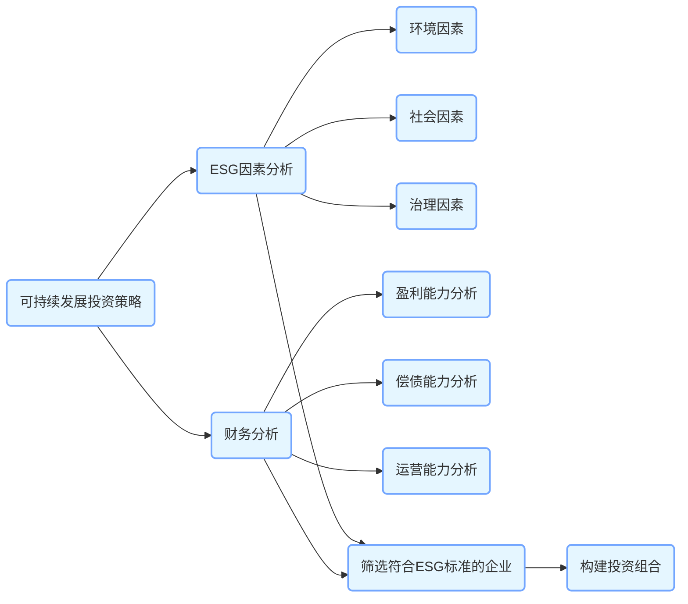

# 玛丽·巴芙的可持续发展投资策略

> 关键词：玛丽·巴芙、可持续发展投资、投资策略、ESG、财务分析

> 摘要：本文深入探讨了玛丽·巴芙的可持续发展投资策略。首先介绍了可持续发展投资在当前金融市场的背景，明确了文章的目的、范围、预期读者和文档结构。接着详细阐述了玛丽·巴芙投资策略中的核心概念，包括可持续发展、ESG因素等，并给出了相关的原理和架构示意图。通过Python代码对其核心算法原理及具体操作步骤进行了讲解，同时运用数学模型和公式进行深入分析并举例说明。在项目实战部分，展示了如何搭建开发环境、实现源代码并进行解读。还探讨了该投资策略的实际应用场景，推荐了相关的学习资源、开发工具框架以及论文著作。最后总结了其未来发展趋势与挑战，解答了常见问题并提供了扩展阅读和参考资料，旨在帮助读者全面理解和应用玛丽·巴芙的可持续发展投资策略。

## 1. 背景介绍 
### 1.1 目的和范围
随着全球对环境、社会和治理（ESG）问题的关注度不断提高，可持续发展投资逐渐成为金融领域的热门话题。玛丽·巴芙作为可持续发展投资领域的专家，她的投资策略具有重要的参考价值。本文的目的在于深入剖析玛丽·巴芙的可持续发展投资策略，详细解释其核心概念、算法原理、数学模型，并通过项目实战展示其应用，同时探讨其在实际场景中的应用以及未来发展趋势。文章的范围涵盖了从理论基础到实际操作的各个方面，旨在为投资者、金融从业者和对可持续发展投资感兴趣的人士提供全面而深入的了解。

### 1.2 预期读者
本文预期读者包括但不限于：
1. 专业投资者：希望通过了解玛丽·巴芙的可持续发展投资策略，优化自己的投资组合，实现可持续的投资回报。
2. 金融从业者：如基金经理、分析师等，可借鉴该策略完善自身的投资分析方法和决策流程。
3. 学者和研究人员：对可持续发展投资领域进行学术研究，可将本文作为参考资料，深入探讨相关理论和实践。
4. 普通投资者：对可持续发展投资有兴趣，希望学习专业的投资策略，提升自己的投资能力。

### 1.3 文档结构概述
本文将按照以下结构进行组织：
1. 背景介绍：阐述文章的目的、范围、预期读者和文档结构，以及相关术语的定义。
2. 核心概念与联系：介绍玛丽·巴芙可持续发展投资策略中的核心概念，如可持续发展、ESG因素等，并展示其原理和架构。
3. 核心算法原理 & 具体操作步骤：通过Python代码详细讲解核心算法原理和具体操作步骤。
4. 数学模型和公式 & 详细讲解 & 举例说明：运用数学模型和公式对投资策略进行深入分析，并举例说明。
5. 项目实战：代码实际案例和详细解释说明，包括开发环境搭建、源代码实现和代码解读。
6. 实际应用场景：探讨该投资策略在不同场景下的应用。
7. 工具和资源推荐：推荐相关的学习资源、开发工具框架和论文著作。
8. 总结：未来发展趋势与挑战：总结玛丽·巴芙可持续发展投资策略的未来发展趋势和面临的挑战。
9. 附录：常见问题与解答：解答读者在阅读过程中可能遇到的常见问题。
10. 扩展阅读 & 参考资料：提供相关的扩展阅读材料和参考资料。

### 1.4 术语表
#### 1.4.1 核心术语定义
1. **可持续发展投资（Sustainable Investing）**：指在投资决策过程中，不仅考虑财务回报，还综合考虑环境、社会和治理（ESG）因素，以实现长期的、可持续的投资回报。
2. **ESG因素**：
    - **环境（Environmental）**：涉及企业对环境的影响，如气候变化、资源利用、污染防治等。
    - **社会（Social）**：关注企业与社会的关系，包括员工权益、社区关系、产品安全等。
    - **治理（Governance）**：主要考察企业的治理结构、董事会独立性、高管薪酬等方面。
3. **财务分析**：对企业的财务状况进行评估，包括盈利能力、偿债能力、运营能力等方面的分析。

#### 1.4.2 相关概念解释
1. **筛选策略**：在投资过程中，根据一定的标准筛选出符合要求的投资标的。例如，基于ESG标准筛选出环境友好、社会责任感强、治理良好的企业。
2. **整合策略**：将ESG因素纳入传统的财务分析中，综合评估企业的投资价值。
3. **积极股东策略**：投资者通过参与企业的决策过程，如投票、与管理层沟通等，推动企业改善ESG表现。

#### 1.4.3 缩略词列表
1. **ESG**：环境、社会和治理（Environmental, Social, and Governance）
2. **ROE**：净资产收益率（Return on Equity）
3. **ROA**：总资产收益率（Return on Assets）
4. **PE**：市盈率（Price-to-Earnings Ratio）

## 2. 核心概念与联系 
玛丽·巴芙的可持续发展投资策略核心在于将可持续发展理念与传统投资分析相结合，通过综合考虑ESG因素和财务因素，筛选出具有长期投资价值的企业。

### 核心概念原理
1. **可持续发展理念**：可持续发展强调经济、社会和环境的协调发展。在投资领域，可持续发展投资旨在支持那些在实现自身经济利益的同时，也能为社会和环境带来积极影响的企业。这种理念认为，长期来看，具有良好ESG表现的企业更有可能实现稳定的财务增长，因为它们能够更好地应对环境和社会风险，赢得消费者和投资者的信任。
2. **ESG因素分析**：ESG因素是评估企业可持续发展能力的重要指标。环境因素反映了企业对自然资源的利用效率和对环境的影响程度；社会因素体现了企业在员工关系、社区参与等方面的表现；治理因素则关乎企业的决策机制、内部控制等方面的有效性。通过对ESG因素的分析，可以识别出企业潜在的风险和机会。
3. **财务分析**：传统的财务分析仍然是投资决策的重要依据。玛丽·巴芙的策略中，会对企业的盈利能力、偿债能力、运营能力等进行深入分析，以评估企业的财务健康状况。例如，通过分析净资产收益率（ROE）、总资产收益率（ROA）等指标，了解企业的盈利水平；通过分析资产负债率等指标，评估企业的偿债能力。

### 架构示意图


该示意图展示了玛丽·巴芙可持续发展投资策略的架构。首先，从ESG因素和财务因素两个方面对企业进行分析。ESG因素包括环境、社会和治理三个子因素，财务因素包括盈利能力、偿债能力和运营能力分析。通过对这两个方面的分析，筛选出符合ESG标准且财务状况良好的企业，最后构建投资组合。

## 3. 核心算法原理 & 具体操作步骤 
### 核心算法原理
玛丽·巴芙的可持续发展投资策略的核心算法可以概括为以下几个步骤：
1. **数据收集**：收集企业的ESG数据和财务数据。ESG数据可以从专业的ESG评级机构获取，财务数据可以从企业的财务报表中获取。
2. **ESG评分计算**：根据收集到的ESG数据，为每个企业计算ESG评分。评分方法可以采用加权平均法，根据不同的ESG因素赋予不同的权重。
3. **财务指标计算**：计算企业的各项财务指标，如ROE、ROA、PE等。
4. **筛选企业**：根据ESG评分和财务指标，筛选出符合要求的企业。例如，选择ESG评分高于一定阈值且ROE高于行业平均水平的企业。
5. **构建投资组合**：根据筛选出的企业，按照一定的权重构建投资组合。权重的确定可以根据企业的市值、财务状况等因素进行调整。

### 具体操作步骤（Python代码实现）
```python
import pandas as pd
import numpy as np

# 步骤1：数据收集
# 假设已经收集到了企业的ESG数据和财务数据，并存储在CSV文件中
esg_data = pd.read_csv('esg_data.csv')
financial_data = pd.read_csv('financial_data.csv')

# 步骤2：ESG评分计算
# 假设ESG数据包含环境、社会、治理三个指标，分别赋予权重0.3、0.3、0.4
esg_data['ESG_score'] = 0.3 * esg_data['Environmental'] + 0.3 * esg_data['Social'] + 0.4 * esg_data['Governance']

# 步骤3：财务指标计算
# 计算ROE和PE
financial_data['ROE'] = financial_data['Net_Income'] / financial_data['Shareholders_Equity']
financial_data['PE'] = financial_data['Stock_Price'] / financial_data['Earnings_Per_Share']

# 步骤4：筛选企业
# 合并ESG数据和财务数据
merged_data = pd.merge(esg_data, financial_data, on='Company_ID')

# 筛选ESG评分高于70且ROE高于行业平均水平的企业
industry_avg_roe = merged_data['ROE'].mean()
selected_companies = merged_data[(merged_data['ESG_score'] > 70) & (merged_data['ROE'] > industry_avg_roe)]

# 步骤5：构建投资组合
# 假设按照市值权重构建投资组合
total_market_cap = selected_companies['Market_Cap'].sum()
selected_companies['Weight'] = selected_companies['Market_Cap'] / total_market_cap

print(selected_companies[['Company_ID', 'ESG_score', 'ROE', 'Weight']])
```

### 代码解释
1. **数据收集**：使用`pandas`库读取存储在CSV文件中的ESG数据和财务数据。
2. **ESG评分计算**：根据环境、社会、治理三个指标的权重，计算每个企业的ESG评分。
3. **财务指标计算**：计算企业的ROE和PE指标。
4. **筛选企业**：将ESG数据和财务数据合并，筛选出ESG评分高于70且ROE高于行业平均水平的企业。
5. **构建投资组合**：按照企业的市值权重计算每个企业在投资组合中的权重。

## 4. 数学模型和公式 & 详细讲解 & 举例说明 
### 数学模型和公式
1. **ESG评分计算**：
   假设企业的环境指标为 $E$，社会指标为 $S$，治理指标为 $G$，对应的权重分别为 $w_E$、$w_S$、$w_G$，则企业的ESG评分 $ESG_{score}$ 计算公式为：
   $$ESG_{score} = w_E \times E + w_S \times S + w_G \times G$$
   其中，$w_E + w_S + w_G = 1$。

2. **净资产收益率（ROE）计算**：
   净资产收益率是衡量企业盈利能力的重要指标，计算公式为：
   $$ROE = \frac{Net Income}{Shareholders' Equity}$$
   其中，$Net Income$ 为企业的净利润，$Shareholders' Equity$ 为股东权益。

3. **市盈率（PE）计算**：
   市盈率是衡量股票估值的常用指标，计算公式为：
   $$PE = \frac{Stock Price}{Earnings Per Share}$$
   其中，$Stock Price$ 为股票价格，$Earnings Per Share$ 为每股收益。

4. **投资组合权重计算**：
   假设投资组合中有 $n$ 个企业，第 $i$ 个企业的市值为 $MC_i$，则第 $i$ 个企业在投资组合中的权重 $w_i$ 计算公式为：
   $$w_i = \frac{MC_i}{\sum_{j=1}^{n} MC_j}$$

### 详细讲解
1. **ESG评分计算**：通过加权平均的方法计算ESG评分，能够综合考虑不同ESG因素的重要性。权重的确定可以根据投资者的偏好和对不同因素的重视程度进行调整。
2. **ROE计算**：ROE反映了企业运用自有资本获取收益的能力。ROE越高，说明企业的盈利能力越强。
3. **PE计算**：PE反映了市场对企业盈利的预期。一般来说，PE较高的股票可能被市场高估，而PE较低的股票可能被市场低估。
4. **投资组合权重计算**：按照市值权重构建投资组合，能够使投资组合更倾向于市值较大的企业，这些企业通常具有更强的市场竞争力和稳定性。

### 举例说明
假设某企业的环境指标 $E = 80$，社会指标 $S = 70$，治理指标 $G = 90$，权重分别为 $w_E = 0.3$、$w_S = 0.3$、$w_G = 0.4$，则该企业的ESG评分计算如下：
$$ESG_{score} = 0.3 \times 80 + 0.3 \times 70 + 0.4 \times 90 = 24 + 21 + 36 = 81$$

假设该企业的净利润为 $1000$ 万元，股东权益为 $5000$ 万元，则ROE计算如下：
$$ROE = \frac{1000}{5000} = 0.2 = 20\%$$

假设该企业的股票价格为 $20$ 元，每股收益为 $2$ 元，则PE计算如下：
$$PE = \frac{20}{2} = 10$$

假设投资组合中有三个企业，市值分别为 $MC_1 = 2000$ 万元，$MC_2 = 3000$ 万元，$MC_3 = 5000$ 万元，则各企业在投资组合中的权重计算如下：
$$w_1 = \frac{2000}{2000 + 3000 + 5000} = 0.2$$
$$w_2 = \frac{3000}{2000 + 3000 + 5000} = 0.3$$
$$w_3 = \frac{5000}{2000 + 3000 + 5000} = 0.5$$

## 5. 项目实战：代码实际案例和详细解释说明 
### 5.1  开发环境搭建
为了实现玛丽·巴芙的可持续发展投资策略，我们需要搭建一个Python开发环境。以下是具体的搭建步骤：
1. **安装Python**：从Python官方网站（https://www.python.org/downloads/）下载并安装Python 3.x版本。
2. **安装必要的库**：使用`pip`命令安装以下必要的库：
   ```sh
   pip install pandas numpy
   ```
   - `pandas`：用于数据处理和分析。
   - `numpy`：用于数值计算。

### 5.2  源代码详细实现和代码解读
```python
import pandas as pd
import numpy as np

# 步骤1：数据收集
# 假设已经收集到了企业的ESG数据和财务数据，并存储在CSV文件中
esg_data = pd.read_csv('esg_data.csv')
financial_data = pd.read_csv('financial_data.csv')

# 代码解读：使用pandas的read_csv函数读取CSV文件，将ESG数据和财务数据存储在DataFrame对象中。

# 步骤2：ESG评分计算
# 假设ESG数据包含环境、社会、治理三个指标，分别赋予权重0.3、0.3、0.4
esg_data['ESG_score'] = 0.3 * esg_data['Environmental'] + 0.3 * esg_data['Social'] + 0.4 * esg_data['Governance']

# 代码解读：根据环境、社会、治理三个指标的权重，计算每个企业的ESG评分，并将结果存储在新的列ESG_score中。

# 步骤3：财务指标计算
# 计算ROE和PE
financial_data['ROE'] = financial_data['Net_Income'] / financial_data['Shareholders_Equity']
financial_data['PE'] = financial_data['Stock_Price'] / financial_data['Earnings_Per_Share']

# 代码解读：根据ROE和PE的计算公式，分别计算每个企业的ROE和PE指标，并将结果存储在新的列中。

# 步骤4：筛选企业
# 合并ESG数据和财务数据
merged_data = pd.merge(esg_data, financial_data, on='Company_ID')

# 筛选ESG评分高于70且ROE高于行业平均水平的企业
industry_avg_roe = merged_data['ROE'].mean()
selected_companies = merged_data[(merged_data['ESG_score'] > 70) & (merged_data['ROE'] > industry_avg_roe)]

# 代码解读：使用pandas的merge函数将ESG数据和财务数据按照Company_ID进行合并。计算行业平均ROE，然后筛选出ESG评分高于70且ROE高于行业平均水平的企业。

# 步骤5：构建投资组合
# 假设按照市值权重构建投资组合
total_market_cap = selected_companies['Market_Cap'].sum()
selected_companies['Weight'] = selected_companies['Market_Cap'] / total_market_cap

print(selected_companies[['Company_ID', 'ESG_score', 'ROE', 'Weight']])

# 代码解读：计算筛选出的企业的总市值，然后根据市值权重计算每个企业在投资组合中的权重，并将结果存储在新的列Weight中。最后打印出企业ID、ESG评分、ROE和权重信息。
```

### 5.3  代码解读与分析
通过以上代码，我们实现了玛丽·巴芙可持续发展投资策略的核心步骤。首先，我们收集了企业的ESG数据和财务数据，并进行了预处理。然后，计算了企业的ESG评分和财务指标，筛选出符合要求的企业。最后，按照市值权重构建了投资组合。

代码的优点在于使用了`pandas`和`numpy`库，这些库提供了高效的数据处理和计算功能，使得代码简洁易懂。同时，代码的结构清晰，每个步骤都有明确的注释，便于理解和维护。

然而，代码也存在一些局限性。例如，ESG数据和财务数据的收集和处理可能存在误差，权重的确定也可能具有主观性。在实际应用中，需要进一步优化数据来源和权重确定方法，以提高投资策略的准确性和可靠性。

## 6. 实际应用场景 
玛丽·巴芙的可持续发展投资策略在多个实际应用场景中具有重要价值：
1. **个人投资者**：个人投资者可以运用该策略构建自己的投资组合，实现财务回报和社会价值的双赢。通过筛选出具有良好ESG表现和财务状况的企业，投资者可以降低投资风险，同时支持可持续发展的企业。
2. **机构投资者**：如养老基金、保险公司等机构投资者，通常具有长期投资的目标和社会责任。玛丽·巴芙的投资策略可以帮助他们筛选出符合可持续发展标准的企业，优化投资组合，提高长期投资回报。
3. **企业社会责任投资**：企业可以将该策略应用于自身的投资决策中，通过投资具有良好ESG表现的企业，实现企业社会责任的履行和自身价值的提升。
4. **金融机构**：银行、证券公司等金融机构可以将该策略纳入投资咨询服务中，为客户提供更加全面和专业的投资建议。同时，金融机构也可以通过支持可持续发展投资，提升自身的社会形象和品牌价值。

## 7. 工具和资源推荐
### 7.1 学习资源推荐
#### 7.1.1 书籍推荐
1. 《可持续投资：环境、社会和治理因素的整合》（*Sustainable Investing: Integrating Environmental, Social, and Governance Factors*）：这本书全面介绍了可持续投资的理论和实践，包括ESG因素的分析方法、投资策略的制定等内容。
2. 《金融与可持续发展》（*Finance and Sustainable Development*）：探讨了金融在可持续发展中的作用，以及如何通过金融手段推动可持续发展目标的实现。
3. 《ESG投资：从理论到实践》（*ESG Investing: From Theory to Practice*）：详细介绍了ESG投资的概念、方法和案例，对于理解和应用玛丽·巴芙的投资策略具有重要参考价值。

#### 7.1.2 在线课程
1. Coursera上的“可持续金融与投资”（*Sustainable Finance and Investing*）课程：由知名教授授课，涵盖了可持续金融的基本概念、投资策略和风险管理等内容。
2. edX上的“ESG投资与风险管理”（*ESG Investing and Risk Management*）课程：深入探讨了ESG因素在投资决策中的应用和风险管理方法。

#### 7.1.3 技术博客和网站
1. 可持续投资论坛（*Sustainable Investment Forum*）：提供了最新的可持续投资资讯、研究报告和行业动态。
2. ESG Investor：专注于ESG投资领域，发布了大量关于ESG投资策略、案例分析和市场趋势的文章。

### 7.2 开发工具框架推荐
#### 7.2.1 IDE和编辑器
1. PyCharm：一款专业的Python集成开发环境，提供了丰富的代码编辑、调试和项目管理功能。
2. Jupyter Notebook：一种交互式的开发环境，适合进行数据探索和分析，方便展示代码和结果。

#### 7.2.2 调试和性能分析工具
1. `pdb`：Python内置的调试工具，可以帮助开发者定位和解决代码中的问题。
2. `cProfile`：Python标准库中的性能分析工具，可以分析代码的运行时间和函数调用情况。

#### 7.2.3 相关框架和库
1. `pandas`：用于数据处理和分析，提供了高效的数据结构和数据操作方法。
2. `numpy`：用于数值计算，提供了丰富的数学函数和数组操作功能。
3. `scikit-learn`：一个强大的机器学习库，可以用于构建和评估投资模型。

### 7.3 相关论文著作推荐
#### 7.3.1 经典论文
1. “Does the Stock Market Fully Value Intangibles? Employee Satisfaction and Equity Prices” by Alex Edmans：研究了员工满意度与股票价格之间的关系，强调了社会因素在投资决策中的重要性。
2. “Corporate Social Responsibility and Financial Performance: Correlation or Misspecification?” by Robert G. Eccles, Ioannis Ioannou, and George Serafeim：探讨了企业社会责任与财务绩效之间的关系，为可持续发展投资提供了理论支持。

#### 7.3.2 最新研究成果
1. 关注《Journal of Sustainable Finance & Investment》《Review of Finance》等学术期刊，这些期刊经常发表关于可持续发展投资的最新研究成果。
2. 参加相关的学术会议和研讨会，如可持续金融与投资国际会议（*International Conference on Sustainable Finance and Investment*），了解最新的研究动态和趋势。

#### 7.3.3 应用案例分析
1. 国际金融公司（IFC）发布的可持续投资案例研究报告，介绍了不同行业和地区的可持续投资实践和经验。
2. 各大资产管理公司的年度报告和研究报告，其中包含了许多关于可持续发展投资策略的应用案例和分析。

## 8. 总结：未来发展趋势与挑战
### 未来发展趋势
1. **市场规模持续增长**：随着全球对可持续发展的关注度不断提高，可持续发展投资市场规模有望继续扩大。越来越多的投资者将把ESG因素纳入投资决策中，推动可持续发展投资成为主流投资策略。
2. **数据和分析工具的不断完善**：随着ESG数据的不断丰富和分析工具的不断发展，投资者将能够更加准确地评估企业的ESG表现和投资价值。例如，人工智能和大数据技术的应用将有助于提高ESG数据的收集和分析效率。
3. **监管政策的加强**：各国政府和监管机构将加强对可持续发展投资的监管，推动企业提高ESG信息披露的质量和透明度。这将有助于投资者更好地了解企业的ESG状况，做出更加明智的投资决策。
4. **跨领域融合**：可持续发展投资将与其他领域，如绿色金融、社会责任投资等进行更深入的融合，形成更加多元化和综合性的投资策略。

### 挑战
1. **ESG数据质量和可比性问题**：目前，ESG数据的质量和可比性存在一定问题。不同的ESG评级机构可能采用不同的评估方法和标准，导致同一企业的ESG评分存在差异。这给投资者的决策带来了一定的困难。
2. **投资回报与可持续发展目标的平衡**：在追求可持续发展目标的同时，投资者也希望获得合理的投资回报。如何在两者之间找到平衡，是可持续发展投资面临的一个重要挑战。
3. **投资者教育和意识提升**：尽管可持续发展投资的概念已经逐渐普及，但仍有许多投资者对ESG因素的重要性认识不足。提高投资者的教育水平和意识，是推动可持续发展投资市场发展的关键。
4. **企业ESG表现的评估和监督**：如何准确评估企业的ESG表现，并对企业进行有效的监督，确保企业真正履行可持续发展责任，是一个需要解决的问题。

## 9. 附录：常见问题与解答
### 1. 什么是可持续发展投资？
可持续发展投资是指在投资决策过程中，不仅考虑财务回报，还综合考虑环境、社会和治理（ESG）因素，以实现长期的、可持续的投资回报。

### 2. 为什么要将ESG因素纳入投资决策中？
将ESG因素纳入投资决策中可以帮助投资者识别企业潜在的风险和机会。具有良好ESG表现的企业更有可能实现稳定的财务增长，因为它们能够更好地应对环境和社会风险，赢得消费者和投资者的信任。

### 3. 如何获取企业的ESG数据？
企业的ESG数据可以从专业的ESG评级机构获取，如MSCI、Sustainalytics等。此外，企业的官方网站、社会责任报告等也可能包含相关的ESG信息。

### 4. 玛丽·巴芙的可持续发展投资策略适用于所有投资者吗？
玛丽·巴芙的投资策略具有一定的通用性，但并不是适用于所有投资者。不同的投资者具有不同的投资目标、风险承受能力和投资期限，需要根据自身情况进行调整和优化。

### 5. 如何评估投资组合的可持续发展表现？
可以通过计算投资组合的ESG评分、分析投资组合中企业的ESG表现等方式来评估投资组合的可持续发展表现。此外，还可以关注投资组合的社会和环境影响，如碳排放减少、社会贡献等。

## 10. 扩展阅读 & 参考资料
### 扩展阅读
1. 《绿色金融：理论与实践》：深入探讨了绿色金融的概念、发展现状和实践案例，对于理解可持续发展投资在金融领域的应用具有重要意义。
2. 《社会影响力投资：改变世界的投资方式》：介绍了社会影响力投资的理念和实践，为投资者提供了一种新的投资视角。

### 参考资料
1. MSCI ESG Research：提供了全球企业的ESG评级和研究报告。
2. Sustainalytics：专业的ESG研究和评级机构，其研究成果在投资领域具有较高的权威性。
3. 国际金融公司（IFC）：发布了大量关于可持续发展投资的研究报告和案例分析。

作者：AI天才研究院/AI Genius Institute & 禅与计算机程序设计艺术 /Zen And The Art of Computer Programming