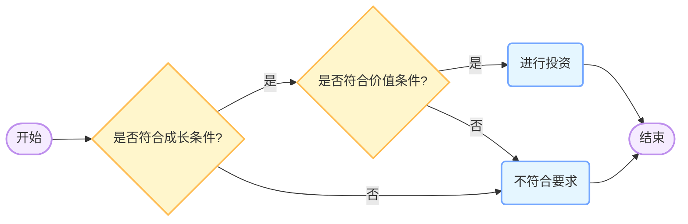

# 玛丽·巴芙的成长型价值投资法

> 关键词：玛丽·巴芙、成长型价值投资法、价值投资、成长股、投资策略

> 摘要：本文深入探讨了玛丽·巴芙的成长型价值投资法。详细介绍了该投资法产生的背景，阐述了其核心概念、算法原理、数学模型等内容。通过项目实战案例，展示了如何运用该投资法进行实际操作。同时，分析了该投资法的实际应用场景，推荐了相关的学习资源、开发工具和论文著作。最后总结了其未来发展趋势与挑战，并提供了常见问题解答和扩展阅读参考资料，旨在帮助投资者更好地理解和运用这一独特的投资方法。

## 1. 背景介绍 
### 1.1 目的和范围
本文的目的在于全面、深入地剖析玛丽·巴芙的成长型价值投资法。通过详细讲解该投资法的核心概念、算法原理、实际应用等方面，为投资者提供一个系统的学习和实践指南。范围涵盖了该投资法的理论基础、操作步骤、实际案例分析以及相关的学习资源和工具推荐等内容。

### 1.2 预期读者
预期读者主要包括对价值投资感兴趣的个人投资者、金融从业者、投资研究人员以及相关专业的学生。无论是初学者希望了解基本的投资方法，还是有一定经验的投资者寻求优化投资策略，都能从本文中获得有价值的信息。

### 1.3 文档结构概述
本文首先介绍玛丽·巴芙的成长型价值投资法的背景信息，包括目的、预期读者和文档结构。接着阐述核心概念与联系，呈现其原理和架构。然后详细讲解核心算法原理和具体操作步骤，并给出数学模型和公式。通过项目实战案例，展示该投资法在实际中的应用。之后分析实际应用场景，推荐相关的学习资源、开发工具和论文著作。最后总结未来发展趋势与挑战，提供常见问题解答和扩展阅读参考资料。

### 1.4 术语表
#### 1.4.1 核心术语定义
- **成长型价值投资法**：玛丽·巴芙提出的一种投资策略，结合了成长股投资和价值投资的理念，旨在寻找具有持续成长潜力且被市场低估的股票进行投资。
- **成长股**：指那些销售额和利润额持续增长，且增长速度快于整个国家及其所在行业的公司所发行的股票。
- **价值投资**：一种通过对股票内在价值的评估，寻找被市场低估的股票进行投资的策略。

#### 1.4.2 相关概念解释
- **内在价值**：股票所代表的公司的实际价值，通常通过对公司的财务状况、盈利能力、行业前景等因素进行综合评估得出。
- **安全边际**：指股票的市场价格低于其内在价值的幅度，是价值投资中的一个重要概念，用于降低投资风险。

#### 1.4.3 缩略词列表
- **PE**：市盈率（Price-to-Earnings Ratio），是股票价格除以每股收益的比率，用于衡量股票的估值水平。
- **EPS**：每股收益（Earnings Per Share），指税后利润与股本总数的比率，反映了公司的盈利能力。

## 2. 核心概念与联系 

### 核心概念原理
玛丽·巴芙的成长型价值投资法核心在于将成长股投资和价值投资有机结合。传统的成长股投资注重公司的高增长潜力，而价值投资则强调寻找被低估的股票。该投资法认为，优秀的投资标的应该是那些既有良好的成长前景，又在当前市场上被低估的股票。

从成长的角度来看，公司需要具备持续的盈利增长能力。这可以通过分析公司的历史财务数据，如营业收入、净利润、每股收益等指标的增长率来评估。同时，要关注公司所处的行业环境和竞争优势，判断其未来的成长空间。

从价值的角度来看，需要评估股票的内在价值，并与当前的市场价格进行比较。如果市场价格低于内在价值，就存在投资机会，即具有安全边际。内在价值的评估可以采用多种方法，如现金流折现法、相对估值法等。

### 架构的文本示意图
```plaintext
成长型价值投资法
|-- 成长分析
|   |-- 历史财务数据
|   |   |-- 营业收入增长率
|   |   |-- 净利润增长率
|   |   |-- 每股收益增长率
|   |-- 行业环境
|   |   |-- 行业增长率
|   |   |-- 行业竞争格局
|   |-- 竞争优势
|       |-- 技术优势
|       |-- 品牌优势
|       |-- 成本优势
|-- 价值评估
|   |-- 内在价值评估
|   |   |-- 现金流折现法
|   |   |-- 相对估值法
|   |-- 安全边际计算
|       |-- 内在价值 - 市场价格
```

### Mermaid 流程图


## 3. 核心算法原理 & 具体操作步骤 

### 核心算法原理
玛丽·巴芙的成长型价值投资法主要基于以下几个核心算法原理：

#### 成长评估算法
通过计算公司的历史财务数据的增长率来评估其成长潜力。以营业收入增长率为例，计算公式为：
$$营业收入增长率 = \frac{本期营业收入 - 上期营业收入}{上期营业收入} \times 100\%$$

同理，可以计算净利润增长率和每股收益增长率。一般来说，连续多年保持较高增长率的公司具有更好的成长潜力。

#### 价值评估算法
这里以相对估值法中的市盈率法为例。市盈率（PE）的计算公式为：
$$PE = \frac{股票价格}{每股收益}$$

通过比较目标公司的市盈率与同行业其他公司的市盈率，以及该公司历史市盈率的平均值，可以判断该股票是否被低估。如果目标公司的市盈率低于同行业平均水平或其历史平均水平，且公司具有良好的成长前景，则可能是一个被低估的投资机会。

### 具体操作步骤

#### 步骤 1：筛选成长股
- 收集市场上所有股票的财务数据，包括营业收入、净利润、每股收益等。
- 计算每个公司的营业收入增长率、净利润增长率和每股收益增长率。
- 筛选出连续多年增长率较高的公司，作为潜在的成长股候选名单。

以下是使用 Python 实现筛选成长股的示例代码：
```python
import pandas as pd

# 假设我们有一个包含股票财务数据的 DataFrame，列名为 '营业收入', '净利润', '每股收益'
# 并且数据按年份排序
data = pd.read_csv('stock_financial_data.csv')

# 计算营业收入增长率
data['营业收入增长率'] = data['营业收入'].pct_change()

# 计算净利润增长率
data['净利润增长率'] = data['净利润'].pct_change()

# 计算每股收益增长率
data['每股收益增长率'] = data['每股收益'].pct_change()

# 筛选连续三年营业收入增长率、净利润增长率和每股收益增长率均大于 10% 的公司
growth_stocks = data[(data['营业收入增长率'] > 0.1) & (data['净利润增长率'] > 0.1) & (data['每股收益增长率'] > 0.1)].groupby('股票代码').filter(lambda x: len(x) >= 3)

print(growth_stocks)
```

#### 步骤 2：价值评估
- 对于筛选出的成长股，收集其当前的股票价格和每股收益数据。
- 计算每个股票的市盈率。
- 比较每个股票的市盈率与同行业其他公司的市盈率，以及该公司历史市盈率的平均值。
- 筛选出市盈率较低的股票，作为具有价值的投资候选名单。

以下是使用 Python 实现价值评估的示例代码：
```python
# 假设我们有一个包含成长股的 DataFrame，列名为 '股票代码', '股票价格', '每股收益'
# 以及一个包含同行业其他公司市盈率的 Series
industry_pe = pd.read_csv('industry_pe.csv', index_col='股票代码')['市盈率']
growth_stocks['市盈率'] = growth_stocks['股票价格'] / growth_stocks['每股收益']

# 筛选出市盈率低于同行业平均市盈率的股票
value_stocks = growth_stocks[growth_stocks['市盈率'] < industry_pe.mean()]

print(value_stocks)
```

#### 步骤 3：综合分析与投资决策
- 对筛选出的具有成长和价值潜力的股票进行综合分析，考虑公司的行业前景、竞争优势、管理团队等因素。
- 根据自己的投资目标和风险承受能力，选择合适的股票进行投资。

## 4. 数学模型和公式 & 详细讲解 & 举例说明 

### 成长评估数学模型和公式
#### 营业收入增长率
公式：$$营业收入增长率 = \frac{本期营业收入 - 上期营业收入}{上期营业收入} \times 100\%$$
详细讲解：该公式用于衡量公司营业收入的增长速度。通过比较不同时期的营业收入，计算出增长率，可以直观地了解公司的业务扩张情况。增长率越高，说明公司的业务发展越好。

举例说明：假设某公司 2022 年的营业收入为 1000 万元，2023 年的营业收入为 1200 万元。则其营业收入增长率为：
$$\frac{1200 - 1000}{1000} \times 100\% = 20\%$$

#### 净利润增长率
公式：$$净利润增长率 = \frac{本期净利润 - 上期净利润}{上期净利润} \times 100\%$$
详细讲解：净利润是公司扣除所有成本和费用后的盈利，净利润增长率反映了公司盈利能力的增长情况。该指标对于评估公司的投资价值非常重要。

举例说明：假设某公司 2022 年的净利润为 200 万元，2023 年的净利润为 250 万元。则其净利润增长率为：
$$\frac{250 - 200}{200} \times 100\% = 25\%$$

#### 每股收益增长率
公式：$$每股收益增长率 = \frac{本期每股收益 - 上期每股收益}{上期每股收益} \times 100\%$$
详细讲解：每股收益是公司净利润与股本总数的比率，每股收益增长率衡量了每股收益的增长情况。该指标可以反映公司为股东创造价值的能力。

举例说明：假设某公司 2022 年的每股收益为 1 元，2023 年的每股收益为 1.2 元。则其每股收益增长率为：
$$\frac{1.2 - 1}{1} \times 100\% = 20\%$$

### 价值评估数学模型和公式
#### 市盈率（PE）
公式：$$PE = \frac{股票价格}{每股收益}$$
详细讲解：市盈率是衡量股票估值水平的常用指标。它反映了投资者为获取公司每一元盈利所愿意支付的价格。一般来说，市盈率越低，股票越被低估；市盈率越高，股票越被高估。

举例说明：假设某股票的当前价格为 20 元，每股收益为 2 元。则其市盈率为：
$$PE = \frac{20}{2} = 10$$

#### 现金流折现法
公式：$$V = \sum_{t=1}^{n} \frac{CF_t}{(1 + r)^t} + \frac{TV}{(1 + r)^n}$$
其中，$V$ 为股票的内在价值，$CF_t$ 为第 $t$ 期的现金流量，$r$ 为折现率，$TV$ 为终值，$n$ 为预测期数。

详细讲解：现金流折现法是一种基于未来现金流量的估值方法。它认为股票的价值等于其未来各期现金流量的现值之和。通过预测公司未来的现金流量，并选择合适的折现率，将未来现金流量折现到当前时刻，得到股票的内在价值。

举例说明：假设某公司预计未来三年的现金流量分别为 100 万元、120 万元和 150 万元，折现率为 10%，三年后的终值为 1000 万元。则该公司股票的内在价值为：
$$V = \frac{100}{(1 + 0.1)^1} + \frac{120}{(1 + 0.1)^2} + \frac{150}{(1 + 0.1)^3} + \frac{1000}{(1 + 0.1)^3}$$
$$V \approx 90.91 + 99.17 + 112.70 + 751.31 = 1054.09$$（万元）

## 5. 项目实战：代码实际案例和详细解释说明 

### 5.1  开发环境搭建
- **Python 安装**：首先需要安装 Python 环境，建议使用 Python 3.7 及以上版本。可以从 Python 官方网站（https://www.python.org/downloads/）下载并安装。
- **库安装**：需要安装一些常用的 Python 库，如 `pandas`、`numpy` 等。可以使用以下命令进行安装：
```sh
pip install pandas numpy
```
- **数据获取**：可以从金融数据提供商（如东方财富、新浪财经等）获取股票的财务数据和市场数据，并将其保存为 CSV 文件。

### 5.2  源代码详细实现和代码解读
以下是一个完整的使用玛丽·巴芙的成长型价值投资法进行股票筛选的 Python 代码示例：
```python
import pandas as pd

# 步骤 1：读取数据
# 假设我们有一个包含股票财务数据的 CSV 文件，列名为 '股票代码', '年份', '营业收入', '净利润', '每股收益', '股票价格'
# 以及一个包含同行业其他公司市盈率的 CSV 文件，列名为 '股票代码', '市盈率'
financial_data = pd.read_csv('stock_financial_data.csv')
industry_pe = pd.read_csv('industry_pe.csv', index_col='股票代码')['市盈率']

# 步骤 2：计算增长率
# 按股票代码和年份排序
financial_data = financial_data.sort_values(by=['股票代码', '年份'])

# 计算营业收入增长率
financial_data['营业收入增长率'] = financial_data.groupby('股票代码')['营业收入'].pct_change()

# 计算净利润增长率
financial_data['净利润增长率'] = financial_data.groupby('股票代码')['净利润'].pct_change()

# 计算每股收益增长率
financial_data['每股收益增长率'] = financial_data.groupby('股票代码')['每股收益'].pct_change()

# 步骤 3：筛选成长股
# 筛选连续三年营业收入增长率、净利润增长率和每股收益增长率均大于 10% 的公司
growth_stocks = financial_data[(financial_data['营业收入增长率'] > 0.1) & (financial_data['净利润增长率'] > 0.1) & (financial_data['每股收益增长率'] > 0.1)].groupby('股票代码').filter(lambda x: len(x) >= 3)

# 步骤 4：计算市盈率
growth_stocks['市盈率'] = growth_stocks['股票价格'] / growth_stocks['每股收益']

# 步骤 5：筛选价值股
# 筛选出市盈率低于同行业平均市盈率的股票
value_stocks = growth_stocks[growth_stocks['市盈率'] < industry_pe.mean()]

# 输出筛选结果
print(value_stocks)
```

### 代码解读与分析
- **数据读取**：使用 `pandas` 库的 `read_csv` 函数读取股票财务数据和同行业市盈率数据。
- **增长率计算**：使用 `groupby` 和 `pct_change` 函数计算每个股票的营业收入增长率、净利润增长率和每股收益增长率。
- **成长股筛选**：通过条件筛选，找出连续三年增长率均大于 10% 的股票。
- **市盈率计算**：根据股票价格和每股收益计算市盈率。
- **价值股筛选**：筛选出市盈率低于同行业平均市盈率的股票，作为最终的投资候选名单。

## 6. 实际应用场景 
玛丽·巴芙的成长型价值投资法适用于多种实际应用场景：

### 个人投资者
对于个人投资者来说，该投资法可以帮助他们在众多的股票中筛选出具有成长潜力且被低估的股票，降低投资风险，提高投资收益。个人投资者可以根据自己的资金状况和风险承受能力，选择合适的股票进行投资。

### 基金管理公司
基金管理公司可以运用该投资法构建投资组合。通过筛选出符合成长和价值标准的股票，合理配置资金，实现基金资产的增值。同时，该投资法的系统性和科学性可以为基金的投资决策提供有力的支持。

### 投资研究机构
投资研究机构可以使用该投资法进行股票研究和分析。通过对市场上的股票进行全面评估，为客户提供投资建议和研究报告。该投资法的量化分析方法可以提高研究的准确性和客观性。

## 7. 工具和资源推荐
### 7.1 学习资源推荐
#### 7.1.1 书籍推荐
- 《聪明的投资者》（The Intelligent Investor）：本杰明·格雷厄姆的经典著作，是价值投资领域的奠基之作，对玛丽·巴芙的成长型价值投资法有重要的理论基础作用。
- 《怎样选择成长股》（Common Stocks and Uncommon Profits）：菲利普·费雪的著作，深入探讨了成长股的选择方法，与玛丽·巴芙的投资法中的成长分析部分密切相关。

#### 7.1.2 在线课程
- Coursera 上的“投资学原理”课程：涵盖了投资的基本理论和方法，包括价值投资和成长投资的内容。
- 网易云课堂上的“股票投资实战课程”：通过实际案例讲解股票投资的技巧和策略，对理解玛丽·巴芙的投资法有很大帮助。

#### 7.1.3 技术博客和网站
- 雪球网：一个专注于股票投资的社区，投资者可以在上面交流投资经验、分享研究报告，了解市场动态。
- 东方财富网：提供丰富的金融数据和资讯，包括股票的财务数据、行情走势等，是进行投资分析的重要工具。

### 7.2 开发工具框架推荐
#### 7.2.1 IDE和编辑器
- PyCharm：一款专业的 Python 集成开发环境，具有代码编辑、调试、自动补全等功能，适合进行 Python 代码的开发。
- Jupyter Notebook：一种交互式的开发环境，支持 Python 代码的编写和运行，方便进行数据分析和可视化。

#### 7.2.2 调试和性能分析工具
- PDB：Python 自带的调试工具，可以帮助开发者定位代码中的问题。
- cProfile：Python 的性能分析工具，可以分析代码的运行时间和内存使用情况，优化代码性能。

#### 7.2.3 相关框架和库
- Pandas：用于数据处理和分析的 Python 库，提供了强大的数据结构和数据操作功能，在股票财务数据处理中非常实用。
- NumPy：用于科学计算的 Python 库，提供了高效的数组操作和数学函数，是进行数据分析和模型计算的基础库。

### 7.3 相关论文著作推荐
#### 7.3.1 经典论文
- Fama, E. F., & French, K. R. (1992). The cross-section of expected stock returns. Journal of Finance, 47(2), 427-465. 该论文提出了著名的 Fama-French 三因子模型，对股票收益率的影响因素进行了深入研究，为投资分析提供了重要的理论基础。
- Sharpe, W. F. (1964). Capital asset prices: A theory of market equilibrium under conditions of risk. Journal of Finance, 19(3), 425-442. 夏普的资本资产定价模型（CAPM）是现代金融理论的重要基石，对投资组合的风险和收益进行了量化分析。

#### 7.3.2 最新研究成果
- 近年来，关于成长型价值投资的研究不断涌现。一些学者通过实证研究，验证了成长型价值投资法在不同市场环境下的有效性，并提出了一些改进和优化的方法。可以通过学术数据库（如知网、万方、Web of Science 等）搜索相关的研究论文。

#### 7.3.3 应用案例分析
- 一些金融研究机构和投资公司会发布关于成长型价值投资的应用案例分析报告。这些报告通过实际案例，展示了如何运用该投资法进行投资决策，并分析了投资效果和风险控制情况。可以关注一些知名的金融研究机构和投资公司的官方网站，获取相关的案例分析报告。

## 8. 总结：未来发展趋势与挑战
### 未来发展趋势
- **数字化和智能化**：随着科技的不断发展，投资领域也将越来越数字化和智能化。玛丽·巴芙的成长型价值投资法可能会结合人工智能和大数据技术，实现更高效的股票筛选和分析。例如，利用机器学习算法对大量的财务数据和市场数据进行分析，挖掘潜在的投资机会。
- **国际化和多元化**：全球金融市场的一体化趋势越来越明显，投资者的投资范围也将越来越广泛。成长型价值投资法可能会应用于不同国家和地区的股票市场，同时也会考虑更多的投资品种，如债券、基金、期货等，实现多元化投资。
- **社会责任投资**：越来越多的投资者开始关注企业的社会责任和可持续发展。未来，成长型价值投资法可能会将企业的社会责任指标纳入投资分析体系，选择那些既具有成长潜力和价值，又符合社会责任标准的企业进行投资。

### 挑战
- **数据质量和准确性**：成长型价值投资法依赖于大量的财务数据和市场数据进行分析。然而，数据的质量和准确性可能会受到多种因素的影响，如数据采集方法、数据来源的可靠性等。如果数据存在误差或缺失，可能会导致投资决策的失误。
- **市场不确定性**：金融市场是复杂多变的，受到宏观经济环境、政策法规、行业竞争等多种因素的影响。即使采用了科学的投资方法，也无法完全预测市场的走势和股票的价格波动。因此，投资者需要具备较强的风险意识和应对能力。
- **模型的局限性**：成长型价值投资法中的数学模型和算法是基于一定的假设和前提条件建立的。在实际应用中，这些假设和前提条件可能并不完全成立，从而导致模型的预测结果与实际情况存在偏差。投资者需要不断地对模型进行优化和改进，以提高投资决策的准确性。

## 9. 附录：常见问题与解答
### 问题 1：成长型价值投资法适合所有投资者吗？
解答：成长型价值投资法并不适合所有投资者。该投资法需要投资者具备一定的财务知识和分析能力，能够对公司的财务数据和市场情况进行深入研究。同时，该投资法的投资周期相对较长，需要投资者有耐心和长期投资的理念。对于风险承受能力较低、投资期限较短的投资者来说，可能不太适合采用该投资法。

### 问题 2：如何确定同行业的平均市盈率？
解答：确定同行业的平均市盈率可以通过以下几种方法：
- **数据提供商**：可以从金融数据提供商（如东方财富、新浪财经等）获取同行业公司的市盈率数据，然后计算平均值。
- **行业研究报告**：参考专业的行业研究报告，其中通常会提供同行业的平均市盈率数据。
- **自建数据库**：如果有足够的资源和能力，可以自己收集同行业公司的财务数据，计算市盈率并求平均值。

### 问题 3：成长型价值投资法的投资周期一般是多长？
解答：成长型价值投资法的投资周期一般较长，通常为 3 - 5 年甚至更长时间。这是因为该投资法注重公司的成长潜力和内在价值，而公司的成长和价值的体现需要一定的时间。在投资过程中，投资者需要耐心持有股票，等待公司的业绩增长和市场对其价值的认可。

## 10. 扩展阅读 & 参考资料
### 扩展阅读
- 《财务报表分析与证券定价》（Financial Statement Analysis and Security Valuation）：全面介绍了财务报表分析的方法和技巧，以及如何运用财务报表数据进行证券定价，对理解成长型价值投资法中的价值评估部分有很大帮助。
- 《金融炼金术》（The Alchemy of Finance）：乔治·索罗斯的著作，探讨了金融市场的运行规律和投资者的心理行为，对投资者的思维方式和投资策略有一定的启发。

### 参考资料
- 玛丽·巴芙的相关著作和演讲资料。
- 金融数据提供商（如东方财富、新浪财经等）的网站和数据库。
- 学术期刊和研究报告，如《金融研究》、《证券市场导报》等。

作者：AI天才研究院/AI Genius Institute & 禅与计算机程序设计艺术 /Zen And The Art of Computer Programming